# FIRE AND FIRE SMOKE DAMPERS DESIGN AND MAINTENANCE PRESENTED BY PAUL VANDUYNE JR, PE

## AIMEG

MAY 2021

## AGENDA

## Agenda

Fire, Smoke, Combination F/S Dampers - What Are They?

Codes

Design and Layout

Maintenance and Testing Codes

Frequency

## WHAT ARE THEY

## What Are They?

Fire Dampers

Smoke Dampers

Combination Fire/Smoke Dampers

Control/Fire/Smoke Dampers

## What Are They? – Fire Dampers

## Fire Dampers:

• A fire damper is composed of a damper and fusible link. When the link is melted, the damper will shut to maintain the fire resistance rating of the structure.

## What Are They? – Fire Dampers

## Fire Dampers

• Static: Close Against Low Pressures; 0 Airflow; AHU shuts OFF

• Dynamic: Close Against Airflow; Spring Assisted; AHU can be ON

• Curtain: Curtain Drops to Protect Opening

• Type A: Curtain Held Within Airstream

• Type B: Curtain Held Outside Airstream (\~95% Free Area)

• Type C: Curtain Held Outside – Oversized Frame (100% Free Area)

• Multi-Blade: Multi-Rotating Blades Rotate to Protect Opening

• Ratings:

• 1 ½ hr: For use in walls with < 3 Hr Fire Rating

• 3 hr: For use in walls with ≥ 3 Hr Fire Rating

## What Are They? – Fire Dampers

## Fire Dampers

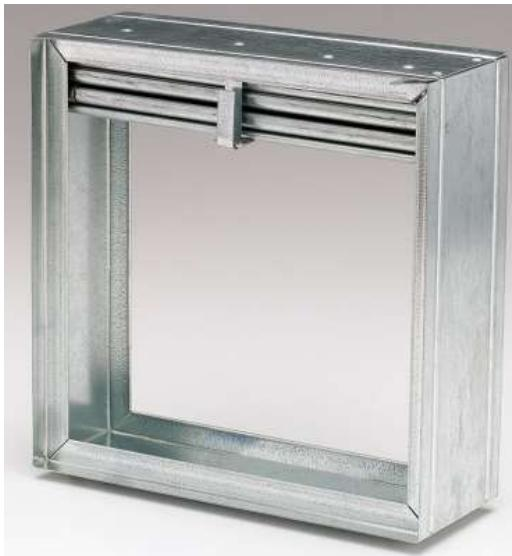  
Type A Curtain Style

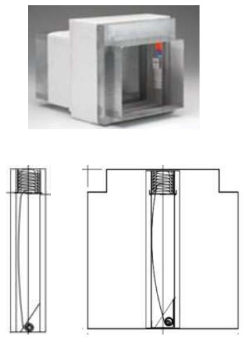  
Type B Curtain Style  
(Images courtesy Ruskin)

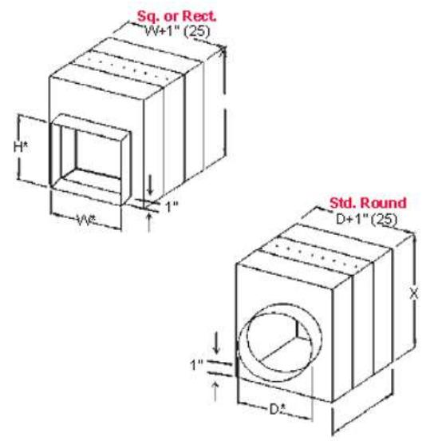  
Type C Curtain Style

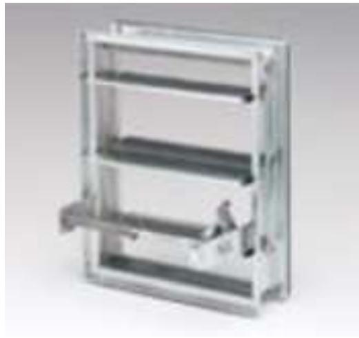  
Multi-Blade Style

## What Are They? – Fire Dampers

## Fire Dampers

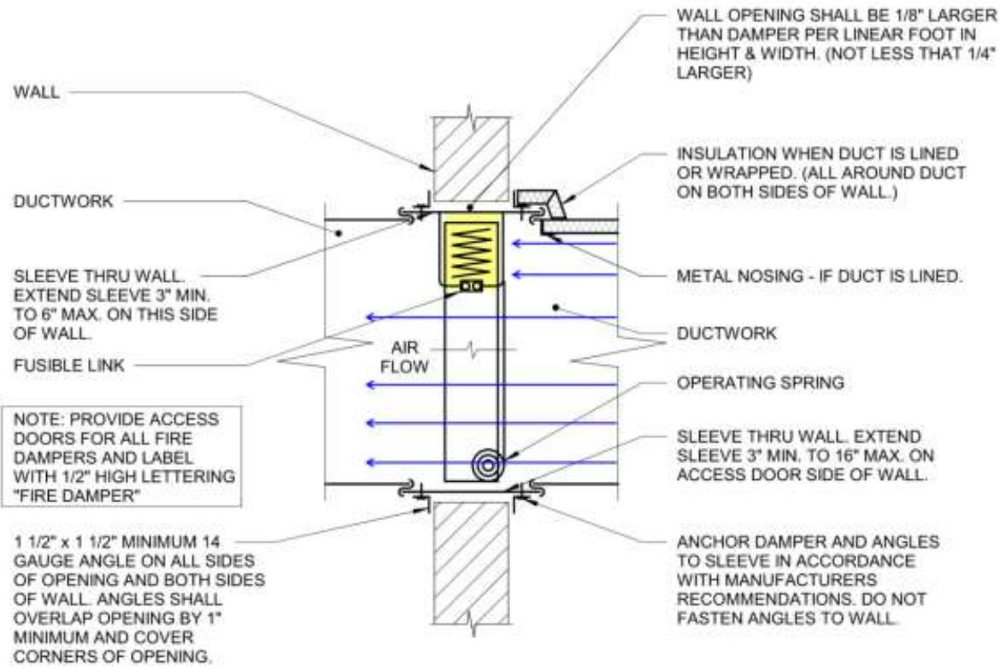  
TYPE "A"

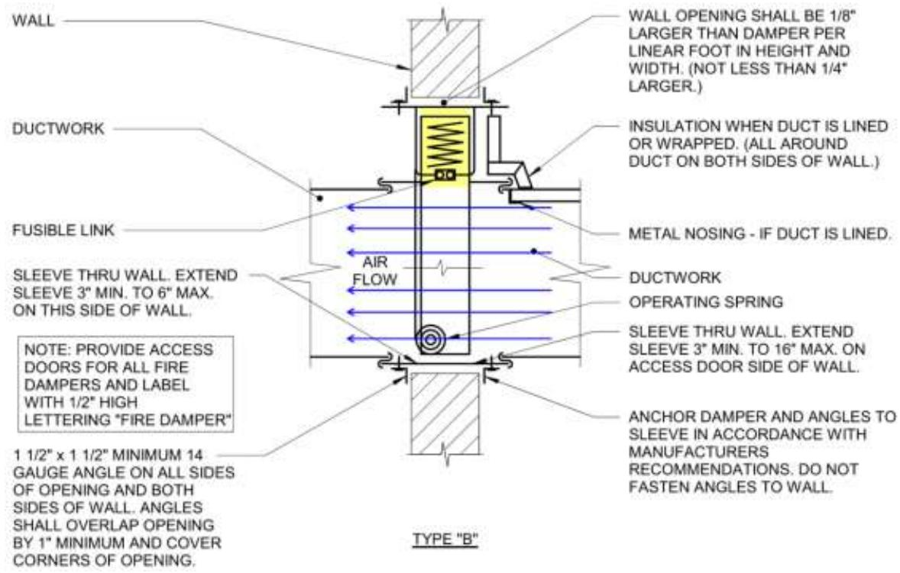

## What Are They? – Smoke Dampers

## Smoke Dampers:

• A smoke damper is composed of a multi-blade damper and actuator. When the presence of smoke is detected, the damper will shut to maintain the smoke resistance rating of the structure.

• Smoke Detector is installed within 5ft of the damper.

## What Are They? – Smoke Dampers

## Smoke Dampers:

## What Are They? – Smoke Dampers

## Smoke Dampers:

• Blade Types

• Airfoil

• Highest strength due to hollow airfoil shape.

• Lowest noise produced due to less air turbulence.

• Tested to provide superior heat resistance.

• Lowest leakage.

• Lowest static pressure drop.

## • Triple V-Groove

• High pressure drop due to air turbulence.

• Higher noise due to high pressure drop.

• Good sealing ability due to interlocking V-grooves.

## • Modified single skin

• Flimsy construction. Dampers can twist and bend.

• Poor sealing ability due to weak construction.

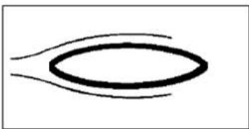

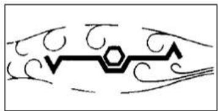

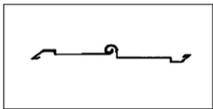

## What Are They? – Fire/Smoke Dampers

## Fire/Smoke Dampers

• A fire/smoke damper is a combination of a fire damper and a smoke damper and is used to maintain the smoke and fire resistance ratings of a structure.

• They look similar to multibladed smoke dampers, but also include a fusible or electronic resettable link and a spring closure mechanism.

## Fire/Smoke Dampers:

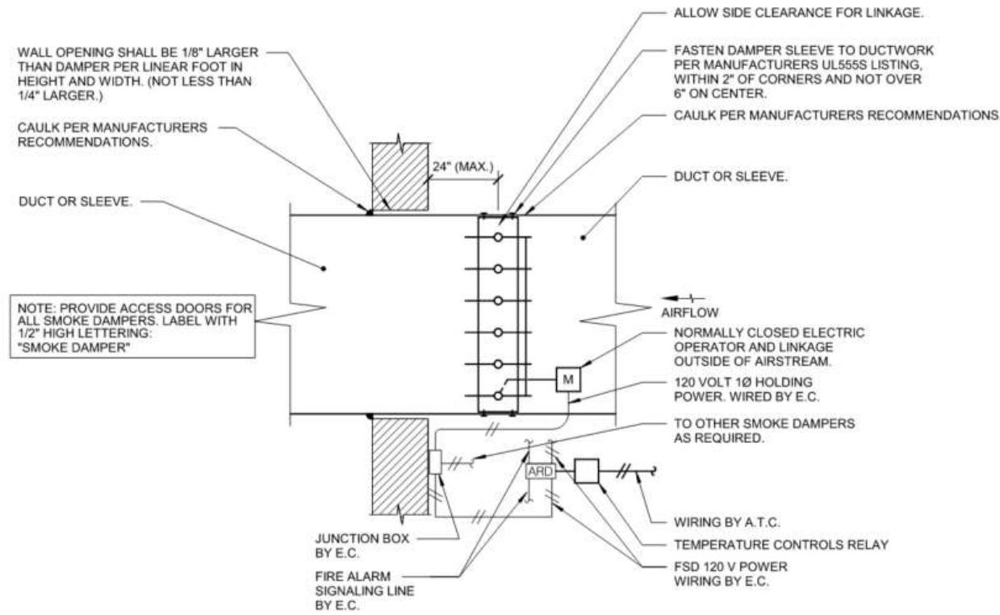

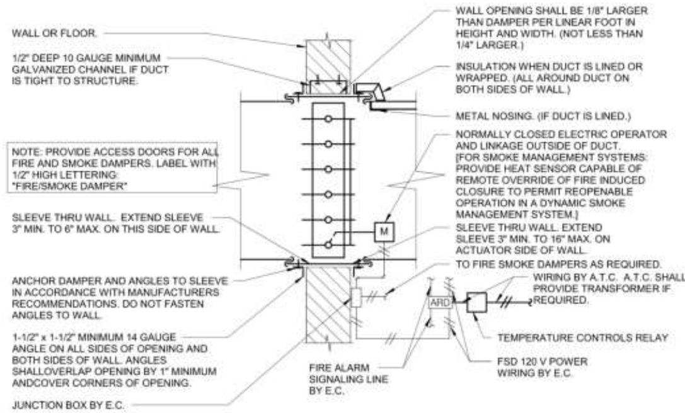

## What Are They? – Control/Fire/Smoke Dampers

## Control/Fire/Smoke Dampers

• A control/fire/smoke damper is a combination of a fire damper and a smoke damper and is used to maintain the smoke and fire resistance ratings of a structure within an Engineered Smoke Control System.

• They look similar to multibladed smoke dampers, but also include a fusible or electronic resettable link and a spring closure mechanism.

## Control/Fire/Smoke Dampers

## CODES

## Codes

IBC: International Building Code (+ Wisconsin Amendments)

IMC: International Mechanical Code (+ Wisconsin Amendments)

IFC: International Fire Code

NFPA 90A: Standard for the Installation of Air-Conditioning and Ventilating Systems

NFPA 92: Smoke Control Systems

NFPA 101: Life Safety Code

NFPA 105: Smoke Door Assemblies And Other Opening Protectives

## Codes – IBC

## IBC: International Building Code (+ Wisconsin)

• Chapter 7: Fire and Smoke Protection Features (Static Containment)

• 706 –714: Wall types

• 717: Duct and Transfer Openings

• Chapter 9: Fire Protection and Life Safety Systems (Engineered Smoke Control)

• 909: Smoke Control Systems

## Codes - IMC

## IMC: International Mechanical Code (+ Wisconsin)

• Chapter 5: Exhaust Systems

• Chapter 6: Duct Systems

• 606: Smoke Systems Control

• 607: Duct and Transfer Openings

## Codes - IFC

## IFC: International Fire Code

• Chapter 7: Fire and Smoke Protection Features

• 706: Duct and Transfer Openings

• Chapter 9: Fire Protection and Life Safety Systems.

• 909: Smoke Control Systems

• Chapter 11: Construction Requirements for Existing Buildings

## Codes – NFPA 90A

## NFPA 90A: Standard for the Installation of Air-Conditioning and Ventilating Systems

• Chapter 4: HVAC Systems

• 4.3: Air Distribution

• Chapter 5: Integration of a ventilation and Air-Conditioning System with Building Construction

• 5.3: Penetrations – Protection of Openings

• 5.4: Fire Dampers, Smoke Dampers, and Ceiling Dampers ratings and acceptance testing

• Chapter 6: Controls

• Chapter 7: Acceptance Testing

• Annex B: Maintenance

## Codes – NFPA 92

## NFPA 92: Smoke Control Systems

• Chapter 7: Smoke Control Documentation

• Chapter 8: Testing (First Time and Periodic)

• 8.2: Preliminary Building Inspections

• 8.3: Component System Testing

• 8.3.3: Smoke control system operational testing shall include all subsystems to the extent that they affect the operation of the smoke control system.

• 8.4: Acceptance Testing

• 8.5: Testing Documentation

• 8.6: Periodic Testing

• 8.7: Modifications

## Codes – NFPA 92

## NFPA 101: Life Safety Code

• Chapter 8: Features of Fire Protection

• 8.5.5: Ducts and Air-Transfer Openings.

## Codes – NFPA 105

NFPA 105: Smoke Door Assemblies And Other Opening Protectives • Chapter 7: Installation, Testing, Maintenance of Smoke Dampers

## DESIGN AND LAYOUT

## Design and Layout

IBC: International Building Code (+ Wisconsin Amendments)

IMC: International Mechanical Code (+ Wisconsin Amendments)

IFC: International Fire Code

NFPA 90A: Standard for the Installation of Air-Conditioning and Ventilating Systems

NFPA 101: Life Safety Code

## Design and Layout – IBC

## IBC: International Building Code (+ Wisconsin)

• Chapter 7: Fire and Smoke Protection Features (Static Containment)

• 706 –714: Wall types

• 717: Duct and Transfer Openings

• Chapter 9: Fire Protection and Life Safety Systems (Engineered Smoke Control)

• 909: Smoke Control Systems

## Design and Layout – IBC

## IBC: International Building Code (+ Wisconsin)

## • Chapter 7:

Fire and Smoke Protection Features (Static Containment)

706.11: Fire Walls Ducts and Air Transfer Openings • Ducts and Air transfer openings shall not penetrate fire walls.

• 707.10: Fire Barriers Ducts and Air Transfer Openings • Penetrations by air ducts and transfer openings shall comply with 717.

• 708.9: Fire Partitions Ducts and Air Transfer Openings • Penetrations by air ducts and transfer openings shall comply with 717.

• 709.8: Smoke Barriers Ducts and Air Transfer Openings • Penetrations by air ducts and transfer openings shall comply with 717.

• 710.8: Smoke Partitions Ducts and Air Transfer Openings • Penetrations by air ducts and transfer openings shall comply with 717.

• 711 - Floor and Roof Assemblies

• 712.6: Vertical Openings Ducts and Air Transfer Openings • Penetrations by air ducts and transfer openings shall comply with 717.

• 713.10: Shaft Enclosures Ducts and Air Transfer Openings

• Penetrations by air ducts and transfer openings shall comply with 717.

• 714.11: Penetrations Ducts and Air Transfer Openings

• Ducts and air transfer openings that are protected with dampers shall comply with 717

## Design and Layout – IBC

## IBC: International Building Code (+ Wisconsin)

• Chapter 7: Fire and Smoke Protection Features (Static Containment)

• 717.5: Where Required.

• 717.5.1: Fire Walls. . . Fire Dampers

• 717.5.2: Fire Barriers. . . Fire Dampers.

• 717.5.3: Shaft Enclosures. . . Fire/Smoke Dampers

• Wisconsin Code Amendment: SPS 362.017 (2) Smoke dampers are not required in ducts that are used in the exhaust portion of laboratory ventilating systems that are designed and installed in accordance with NFPA 45

• 717.5.4: Fire Partitions. . . Fire Dampers

• 717.5.5: Smoke Barriers. . . Smoke Damper

• 717.5.6: Exterior Walls . . . Fire Dampers

• 717.5.7: Smoke Partitions . . . Smoke Damper

## Design and Layout – IBC

## IBC: International Building Code (+ Wisconsin)

• Chapter 9: Fire Protection and Life Safety Systems (Engineered Smoke Control)

• 909: Smoke Control Systems

• 909.1: Scope: Design of [Engineered Smoke Control Systems] [as required by other sections:

• Atrium Spaces (404.5)

• Under-Ground Buildings (405.5)

• High-Rise Buildings (403.5.4)

• Covered Malls with Atriums Connecting more than 2 Stories (402.7.2)

• Underground Buildings <30ft Below Exit Floor (405.5)

• I-3 Detention Occupancies/Windowless Buildings (408.9)

• 909.2-909.21: Analysis and Design of [Smoke Control Systems]

## Design and Layout - IMC

## IMC: International Mechanical Code (+ Wisconsin)

• Chapter 5: Exhaust Systems

• Provides Prohibitions of damper installation:

• 504.2: FD/SD/FSD. . . shall be prohibited in clothes dryer exhaust ducts.

• 506.3.11: FD/SD/FSD. . . are prohibited in grease ducts

• 510.6.1: FD/SD/FSD. . . are prohibited in hazardous exhaust ducts.

• Wisconsin Code Amendment: SPS 364.0607 (2m): FD/SD/FSD. . . are not required laboratory exhaust

## Design and Layout - IMC

## IMC: International Mechanical Code (+ Wisconsin)

• Chapter 6: Duct Systems

• 607.5: Where required.

• 607.5.1: Fire Walls. . . Fire Dampers

• 607.2.2: Fire Barrier. . . Fire Dampers

• 607.5.3: Fire Partition. . . Fire Dampers

• 607.5.4: Corridors/smoke barrier. . . Fire Dampers

• Wisconsin Code Amendment Option: SPS 364.0607 (4m): Smoke dampers are not required in Group I−2 duct penetrations of smoke barriers in fully ducted HVAC systems.

• 607.5.5: Shaft enclosure. . . Fire/Smoke Dampers

• Wisconsin Code Amendment Option: SPS 364.0607 (3m): Smoke dampers are not required in ducts that are used in the exhaust portion of laboratory ventilating systems which are designed and installed in accordance with NFPA 45.

• 607.5.6: Exterior walls. . . Fire Dampers

• 607.5.7: Smoke partitions. . . Smoke Dampers

## Design and Layout - IFC

## IFC: International Fire Code

• General Rule: References IBC Chapter 7 and Chapter 9.

• Chapter 7: Fire and Smoke Protection Features

• Chapter 9: Fire Protection and Life Safety Systems.

• Chapter 11: Construction Requirements for Existing Buildings

## Design and Layout – NFPA 90A

## NFPA 90A: Standard for the Installation of Air-Conditioning and Ventilating Systems

• Not Necessarily a Code

• Chapter 4: HVAC systems

• 4.3: Air Distribution

• 4.3.9: Fire Dampers [shall be provided as per Chapter 5]

• 4.3.10: Smoke Dampers [shall be provided as per chapter 5]

• 4.3.10.2: Smoke dampers shall be installed in systems with a capacity greater than 15,000 ft3/min to isolate the air-handling equipment, including filters, from the remainder of the system on both the building supply side and the return side, in order to restrict the circulation of smoke, unless specifically exempted by:

• 4.3.10.2.1: Air-handling units located on the floor they serve and serving only that floor.

• 4.3.10.2.2: Air-handling units located on the roof and serving only the floor immediately below the roof

## Design and Layout – NFPA 90A

## NFPA 90A: Standard for the Installation of Air-Conditioning and Ventilating Systems

• Not Necessarily a Code

• Chapter 5: Integration of a Ventilation and Air-Conditioning System with Building Construction

• 5.3 Penetrations: Protection of Openings

## Design and Layout – NFPA 90A

NFPA 90A: Standard for the Installation of Air-Conditioning and Ventilating Systems Fire-rated roof-ceiling assembly

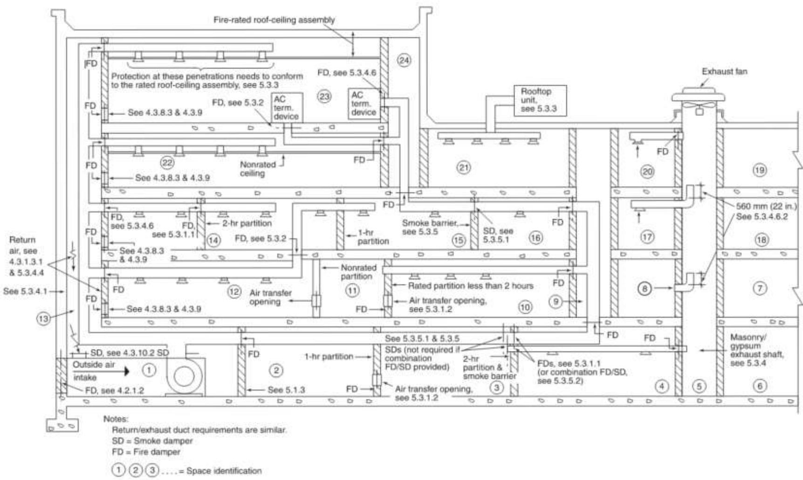  
Δ FIGURE A.5.3 Application of Penetration Requirements.

## Design and Layout – NFPA 101

## NFPA 101: LIFE SAFETY CODE

• NFPA Chapter 8: Features of Fire Protection

• 8.5.5: Ducts and Air-Transfer Openings

• 8.5.5.2.1: Where a smoke barrier is penetrated by a duct or air-transfer opening, a smoke damper

• 8.5.5.2.2: Where a smoke barrier is also constructed as a fire barrier, a combination fire/smoke damper designed

• 3.8.5.5.3: Smoke Damper Exceptions Smoke dampers shall not be required under any of the following conditions:

• Where specifically exempted by provisions in Chapters 11 through 43

• Where ducts or air-transfer openings are part of an engineered smoke control system

• Where the air in ducts continues to move and the air handling system installed is arranged to prevent recirculation of exhaust or return air under fire emergency conditions

• Where the air inlet or outlet openings in ducts are limited to a single smoke compartment

• Where ducts penetrate floors that serve as smoke barriers

• Where ducts penetrate smoke barriers forming a communicating space separation in accordance with 8.6.6(4)(a)

## Design and Layout – SD Operation

## System Operation

• Why Should FSD Close when AHU is off and NOT in Alarm?

• Wisconsin Code Amendment Option: SPS 362.0717 (1): Other than in mechanical smoke control systems, dampers shall be closed upon fan shutdown when local smoke detectors require a minimum velocity to operate.

• IBC-717.3.3.2.1: SD shall close upon fan shutdown where local detectors require minimum velocity to operate.

• 90A-6.3.3: Smoke dampers installed to isolate the air-handling system in accordance with 4.3.10.2 shall be arranged to close automatically when the system is not in operation.

• 90A-6.3.4: Smoke dampers shall be permitted to remain open when their associated fan is off, provided their associated controlling damper actuators and automatic alarm-initiating devices remain operational.

## Design and Layout – SD Operation

## System Operation

• Smoke Damper Actuation/Building In Alarm

• IMC-606.4: Upon activation, the SD shall shut down all operational capabilities of the air distribution system.

• IBC-7.7.3.3.2: Smoke Damper Actuation The smoke damper shall close upon actuation of a listed smoke detector or detectors installed . . . as applicable.

• IBC-717.3.3.3: Combination fire/smoke dampers installed in smoke control system shaft penetrations shall not be activated by local area smoke detection unless it is secondary to the smoke management system controls.

• NFPA 101-8.5.5.7.1: Required smoke dampers in ducts penetrating smoke barriers shall close upon detection of smoke by approved smoke detector.

• NFPA 101-8.5.5.7.3: Required smoke dampers in air-transfer openings shall close upon detection of smoke by approved smoke detectors in accordance with NFPA 72.

## MAINTENANCE AND TESTING

## Maintenance and Testing

IBC: International Building Code (+ Wisconsin Amendments)

IMC: International Mechanical Code (+ Wisconsin Amendments)

IFC: International Fire Code

NFPA 90A: Standard for the Installation of Air-Conditioning and Ventilating Systems

NFPA 92: Smoke Control Systems

NFPA 101: Life Safety Code

NFPA 105: Smoke Door Assemblies And Other Opening Protectives

AMCA: Guide for Cx and Periodic Performance Testing of FSD & Other Dampers

## Maintenance & Testing – IBC

## IBC: International Building Code (+ Wisconsin)

• Chapter 7: Fire and Smoke Protection Features (Static Containment)

• 717.4: Access and Identification. Fire and smoke dampers shall be provided with an approved means of access that is large enough to permit inspection and maintenance of the damper and its operating parts. The access shall not affect the integrity of fire-resistance-rated assemblies. The access openings shall not reduce the fire-resistance rating of the assembly. Access points shall be permanently identified on the exterior by a label.

• Chapter 9: Fire Protection and Life Safety Systems (Engineered Smoke Control)

• 909.18: Acceptance Testing (Commissioning)

• 909.19: System Acceptance

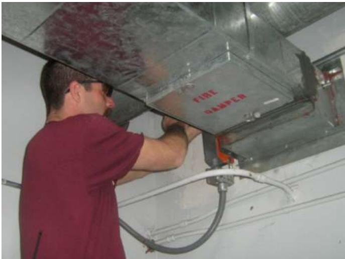

## Maintenance & Testing - IMC

## IMC: International Mechanical Code (+ Wisconsin)

• Chapter 6: Duct Systems

• 607.4: Access and Identification:

• Fire and smoke dampers shall be provided with an approved means of access, large enough to permit inspection and maintenance of the damper and its operating parts. The access shall not affect the integrity of fire-resistance-rated assemblies. The access openings shall not reduce the fire-resistance rating of the assembly.

• Access points shall be permanently identified on the exterior by a label having letters not less than 1/2 inch in height reading: FIRE/SMOKE DAMPER, SMOKE DAMPER or FIRE DAMPER. Access doors in ducts shall

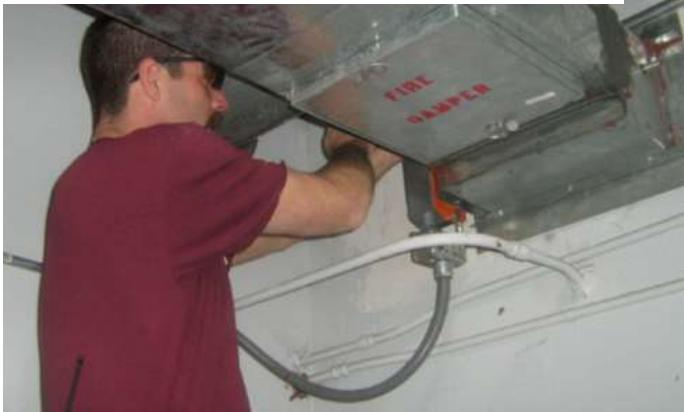

## Maintenance & Testing - IFC

## IFC: International Fire Code

• Chapter 7: Fire and Smoke Protection Features

• 706.1: Maintaining protection. Dampers protecting ducts and air transfer openings shall be inspected and maintained in accordance with NFPA 80 and NFPA 105

## Maintenance & Testing – NFPA 90A

## NFPA 90A: Standard for the Installation of Air-Conditioning and Ventilating Systems

• Chapter 5: Integration of a ventilation and Air-Conditioning System with Building Construction

• 5.4.8 Maintenance.

• 5.4.8.1: Fire dampers and ceiling dampers shall be maintained in accordance with NFPA 80.

• 5.4.8.2: Smoke dampers shall be maintained in accordance with NFPA 105.

• Chapter 7: Acceptance Testing

• Annex B: Maintenance

• B.2: Fire Dampers, Smoke Dampers and Ceiling Dampers

• B.2.1: Refer to NFPA 80 for inspection and maintenance of Fire Dampers, Ceiling Dampers and Combination Fire/Smoke dampers.

• B.2.2: Refer to NFPA 105 for inspection and maintenance of Fire Dampers, Ceiling Dampers and Combination Fire/Smoke dampers

• B.2.3: Refer to NFPA 92 for maintenance of smoke and combination fire/smoke dampers for each damper installed as part of a smoke control system.

## Maintenance & Testing – NFPA 92

## NFPA 92: Smoke Control Systems

• Chapter 7: Smoke Control Documentation

• 7.3: Installation [& Access]

• Chapter 8: Testing (First Time and Periodic)

• 8.3: Component System Testing

• 8.3.3: Smoke control system operational testing shall include all subsystems to the extent that they affect the operation of the smoke control system.

• 8.4: Acceptance Testing

• 8.4.4: Testing Procedures.

• 8.4.5: Testing of Smoke Management Systems in Large-Volume Spaces

• 8.4.6: Testing of Smoke Containment Systems.

• 8.5: Testing Documentation

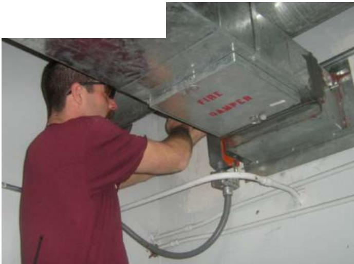

## Maintenance & Testing – NFPA 105

## NFPA 105: Smoke Door Assemblies And Other Opening Protectives

• Chapter 7: Installation, Testing, Maintenance of Smoke Dampers

• 7.3: Installation [& Access]

• 7.3.1.1: Smoke dampers shall be installed within 24 in. of the partition and before any branch line or opening.

• 7.3.1.2: Maintenance instructions shall be maintained on-site.

• 7.3.1.3: Damper actuator and linkage shall be supplied and installed at the factory.

• 7.3.2: Dampers shall be provided with an access door that is not less than 12 in.2.

• 7.3.2.1: Dampers that are installed behind registers, diffusers, or grilles shall be serviceable by removal of these covers.

• 7.3.2.2: A smoke damper access panel shall be labeled with the words “Smoke Damper” in letters not less than 1∕2 in height

• 7.3.2.3: Unobstructed access shall be provided.

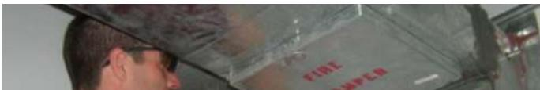

• 7.3.2.4: Installation of combination fire/smoke dampers shall be in accordance with NFPA 80

• 7.3.2.5: Smoke detectors shall be spaced and installed per the requirements of NFPA 72.

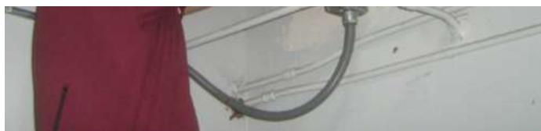

## Maintenance & Testing – NFPA 105

## NFPA 105: Smoke Door Assemblies And Other Opening Protectives

• Chapter 7: Installation, Testing, Maintenance of Smoke Dampers

• 7.4: Operational Test

• 7.4.1: Smoke and Combination Fire/Smoke Dampers. An operational test shall be conducted after the building’s HVAC system has been balanced.

• 7.4.1.1: The test shall be adequate to determine that the damper has been installed and functions as intended.

• 7.4.1.2: The operational test shall be conducted under normal HVAC airflow and non-airflow conditions. The damper shall fully close under both test conditions.

• 7.4.1.3: The operational test shall verify that there are no obstructions to the operation of the dynamic combination damper.

• 7.4.1.4: The operational test shall verify that there is full and unobstructed access to the dynamic combination damper and all appurtenances.

• 7.4.1.5: All indicating devices shall be verified to work properly and report to the intended location.

• 7.4.1.6: Combination fire/smoke dampers shall also meet the testing requirements contained in NFPA 80, Section 19.3

## Maintenance & Testing – NFPA 105

## NFPA 105: Smoke Door Assemblies And Other Opening Protectives

• Chapter 7: Installation, Testing, Maintenance of Smoke Dampers

• Acceptance Testing

• 7.5.2: Before testing, a visual inspection shall be performed

• 7.5.3: Acceptance testing shall be conducted after the building mechanical ventilation system has been balanced.

• 7.5.4: Acceptance testing shall be conducted by removing electrical power or air pressure from the actuator and ensuring that the damper fully closes.

• 7.5.5: Electrical power or air pressure shall then be reapplied to the damper to confirm that it returns to its full-open position.

• 7.5.6: A record of these inspections and testing shall be made in accordance with 7.6.4.

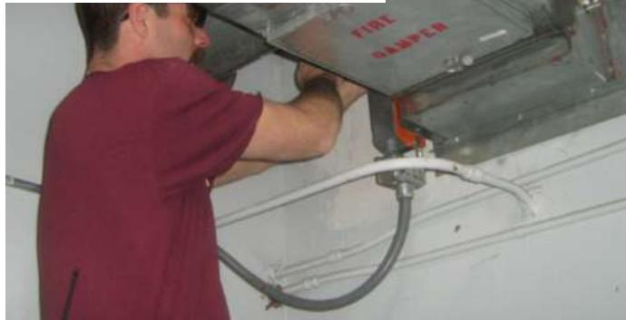

## Maintenance & Testing – AMCA

## AMCA: Guide for Commissioning and Periodic Performance Testing of Fire, Smoke and Other Life Safety Related Dampers

• Excellent Summary of NFPA 80, 105, & 92

• Cx and Acceptance Testing

• Fire Dampers and Combination Fire/Smoke Dampers

• Positioning of the Damper in the Opening

• Damper Sleeve

• Clearance between Damper and Wall/Floor Opening

• Securing Damper and Sleeve to the Wall/Floor Openings

• Duct to Sleeve Connections

• Damper Access

• Adequate to allow inspection and maintenance and all operating parts.

• Permanently labeled.

• Damper Flow and Pressure Ratings

• Operation of the Damper

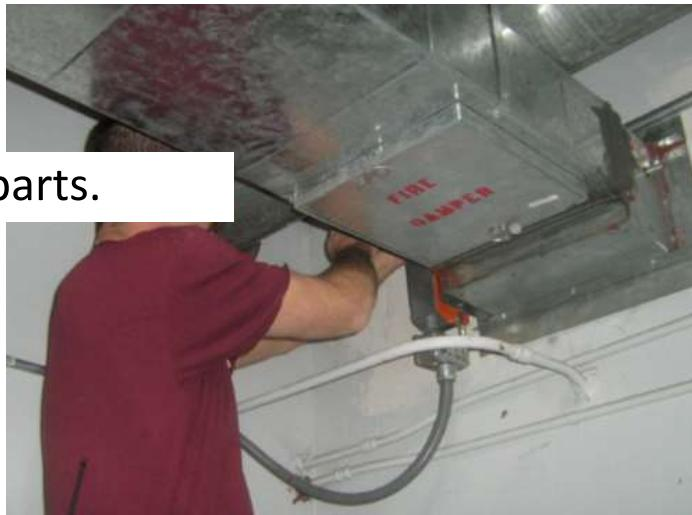

## Maintenance & Testing – AMCA

## AMCA: Guide for Commissioning and Periodic Performance Testing of Fire, Smoke and Other Life Safety Related Dampers

• Excellent Summary of NFPA 80, 105, & 92

• Cx and Acceptance Testing

• Smoke Dampers

• Positioning of the Damper in the Opening

• Sealing the Damper Frame to the Ductwork

• Damper Access

• Adequate to allow inspection and maintenance and all operating parts.

• Permanently labeled.

• Damper Flow and Pressure Ratings

• Operation of the Damper

## Maintenance & Testing – AMCA

## AMCA: Guide for Commissioning and Periodic Performance Testing of Fire, Smoke and Other Life Safety Related Dampers

• Excellent Summary of NFPA 80, 105, & 92

• Periodic Performance Testing

• General

• References NFPA 80 for Fire Dampers

• References NFPA 105 for Smoke Dampers.

• References NFPA 72 and NFPA 92 for smoke control systems.

• Each damper shall be tested and inspected one year after installation.

• The test and inspection frequency shall then be every 4 years,

• except in hospitals, where the frequency shall be every 6 years.

## Maintenance & Testing – AMCA

## AMCA: Guide for Commissioning and Periodic Performance Testing of Fire, Smoke and Other Life Safety Related Dampers

• Excellent Summary of NFPA 80, 105, & 92

• Periodic Performance Testing

• Periodic Performance Testing for Fusible Link Operated Dampers

1. Ensure Fan is Off

2. With Damper Full-Open, Remove fusible link.

3. Ensure Damper closes completely without assistance.

4. Return Damper to Full-Open and replace fusible Link.

## Maintenance & Testing – AMCA

## AMCA: Guide for Commissioning and Periodic Performance Testing of Fire, Smoke and Other Life Safety Related Dampers

• Excellent Summary of NFPA 80, 105, & 92

• Periodic Performance Testing

• Periodic Performance Testing for Dampers That Do Not Use a Fusible Link to Operate

• Dampers with Position Indication Wired to Indication Lights, Control Panels or BAS

1. Confirm damper is Full-Open using position indicator signal.

2. Remove Electrical Power to allow spring return to close damper.

3. Confirm damper is Full-Closed using position indicator signal.

4. Reapply electrical power to reopen damper.

5. Confirm damper is Full-Open using position indicator signal.

• Dampers without Position Indication

1. Visually Confirm damper is Full-Open.

2. Remove Electrical Power to allow spring return to close damper.

3. Visually Confirm damper is Full-Closed.

4. Reapply electrical power to reopen damper.

5. Visually Confirm damper is Full-Open.

## FREQUENCY

## Frequency

## IFC: International Fire Code

NFPA 90A: Standard for the Installation of Air-Conditioning and Ventilating Systems

NFPA 92: Smoke Control Systems

NFPA 101: Life Safety Code

NFPA 105: Smoke Door Assemblies And Other Opening Protectives

AMCA: Guide for Cx and Periodic Performance Testing of FSD & Other Dampers

## Frequency - IFC

## IFC: International Fire Code

• Chapter 7: Fire and Smoke Protection Features

• 706.1: Maintaining protection. Dampers protecting ducts and air transfer openings shall be inspected and maintained in accordance with NFPA 80 and NFPA 105

## Frequency – NFPA 90A

## NFPA 90A:Standard for the Installation of Air-Conditioning and Ventilating Systems

• Chapter 6: Controls

• 6.4.1: Testing. All automatic shutdown devices shall be tested at least annually.

• Annex B: Maintenance

• B.3: Filters. Unit filters should be renewed or cleaned when the resistance to airflow has increased to two times the original resistance or when the resistance has reached a value of recommended replacement by the manufacturer.

• B.4: Inspection and Cleaning of Ducts. Inspections to determine the amount of dust and waste material in the ducts (both discharge and return) should be made quarterly.

• B.5: Inspection and Cleaning of Plenums. Apparatus casing and air-handling unit plenums should be inspected monthly.

• B.7: Outside Air Intakes. Conditions outside the outside air intake should be examined at the time ducts are inspected.

• B.8: Fans and Fan Motors. Fans and fan motors should be inspected at least quarterly.

• B.9: Controls. Fan controls should be examined and activated at least annually.

## Frequency – NFPA 92

## NFPA 92 –Smoke Control Systems

• Chapter 8: Testing (First Time and Periodic)

• 8.6 Periodic Testing

• 8.6.1.1: Dedicated systems shall be tested at least semiannually. (Dedicated to smoke control only; no HVAC)

• 8.6.1.2: Non-dedicated systems shall be tested at least annually. (System sharing smoke control with HVAC)

## Frequency – NFPA 105

## NFPA 105: Smoke Door Assemblies And Other Opening Protectives

• Chapter 7: Installation, Testing, Maintenance of Smoke Dampers

• 7.6: Periodic Testing

• 7.6.2.1: Each damper shall be inspected and tested 1 year after the completion of acceptance testing.

• 7.6.2.2: After the inspection and test required by 7.6.2.1, the test and inspection frequency shall then be every 4 years, except in buildings containing a hospital, where the frequency shall be every 6 years.

• 7.6.2.3: In existing, fully ducted HVAC systems, periodic testing shall not be required for a single damper that is not accessible within a rated barrier or shaft.

## Frequency – AMCA

## AMCA: Guide for Commissioning and Periodic Performance Testing of Fire, Smoke and Other Life Safety Related Dampers

• Excellent Summary of NFPA 80, 105, & 92

• Periodic Performance Testing

• General

• References NFPA 80 for Fire Dampers

• References NFPA 105 for Smoke Dampers.

• References NFPA 72 and NFPA 92 for smoke control systems.

• Each damper shall be tested and inspected one year after installation.

• The test and inspection frequency shall then be every 4 years,

• except in hospitals, where the frequency shall be every 6 years.

## QUESTIONS/DISCUSSION

## FIRE AND FIRE SMOKE DAMPERS DESIGN AND MAINTENANCE TIMEG