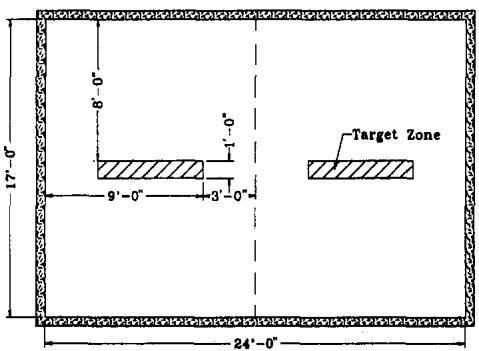
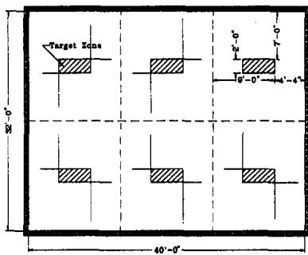

# QUESTIONS AND ANSWERS ABOUT THIS GUIDE

## What is the Purpose of the Guide?

The purpose of the Guide is to provide a simplified method for designing and laying out home fire sprinkler systems. The simplification has been achieved by pre-engineering key features of the design. Use of the Guide can result in cost savings in sprinkler installation.

## Who Can Use The Guide?

The Guide is intended for use by installers who are familiar with the installation of plastic and copper piping, and who possess a basic understanding of residential sprinkler system design and installation methods.

## How Does the Guide Relate to the Design Method of NFPA Standard 13-D?

The method described in the Guide enables installers to design systems that conform to the requirements of National Fire Protection Association (NFPA) Standard 13-D, “Sprinkler Systems in One- and Two-Family Dwellings and Manufactured Homes” (1994). Two important differences between the Guide’s method and the current 13-D method are that the Guide estimates the fitting loss and does not require the installer to specify the exact layout of the piping in the system.

## Loops and Grids

The Design Guide does not support the design of looped or gridded piping networks to supply sprinkler heads. Loops and grids may be utilized to improve the hydraulic performance of a system design, such benefits are not accounted for in this simplified design method. Installers should check with the local AHJ regarding the relationship of any fire sprinkler design method to local requirements.

## How Do Commercial and Residential Systems Differ?

The conventional process for fire sprinkler system design and installation was developed in commercial, industrial, and institutional settings. Such settings generally require large, complex systems, which must be fully engineered and which require substantial design review by the local AHJ. The designs are typically based on a unique set of plans and hydraulic calculations that often require special certification.

By comparison with commercial and industrial settings, homes are small. Home sprinkler systems are much less complex. The Guide is designed to make the advantages of this reduced complexity available to installers.

The Guide eliminates the need for detailed special plans because the system design is not tied to precise sprinkler head locations. Instead, sprinkler heads can be placed anywhere within target zones that are indicated on the house plans. The Guide substantially reduces and can eliminate the necessity for pre-installation design review. The hydraulics and head locations can be reviewed in the field after rough installation is complete. When requirements of actual construction make it necessary to change the layout of the piping or the location of sprinkler heads, conventional designs can require the submission of as-built plans. With the use of target zones, the need for as-built plans can be eliminated.

## What Materials and Tools Are Needed?

All that is needed are scaled drawings of each floor of the house, and possibly a calculator.

## What Information Is Needed?

Before beginning, the following information is required:

## Water Supply

The available water pressure in the home.

The length, size, and type of underground piping material used to supply water from the street main to the house.

## Change in Elevation

The change in elevation between the water main and the highest sprinkler in the house.

## Sprinkler Specifications

Water flow, pressure, and coverage specifications for the make and model of sprinkler head that will be used. These operating characteristics appear on the product information (“cut”) sheets furnished by the manufacturer.

Specifications for any backflow prevention devices or special valves that may be used in the system. This information also accompanies the devices.

## What Kinds of Homes Are Covered by the Guide?

The Guide can be used to design “tree systems” for most types of single-family homes. There are two exceptions:

Placement of sprinkler heads on sloped ceilings. Manufacturers’ installation guides should be followed for this type of ceiling.

Exceptionally large homes, or homes with unique layouts and design features. For such homes, installers should prepare a design plan in accordance with NFPA Standard 13-D.

Sprinkler heads require different flow rates and water pressures to cover different room areas. A typical manufacturer’s specification is shown in Table 1.

Table 1  
Sample Sprinkler Specification

<table><tr><td></td><td colspan="2">SINGLE-HEAD FLOW</td><td colspan="2">MULTIPLE-HEAD FLOW(each head)</td></tr><tr><td>COVERAGE AREA</td><td>FLOW</td><td>PRESSURE</td><td>FLOW</td><td>PRESSURE</td></tr><tr><td>12&#x27; X 12&#x27;</td><td>10</td><td>6.6</td><td>9</td><td>5.3</td></tr><tr><td>14&#x27; X 14&#x27;</td><td>10</td><td>6.6</td><td>9</td><td>5.3</td></tr><tr><td>16&#x27; X 16&#x27;</td><td>14</td><td>12.9</td><td>11</td><td>8.0</td></tr><tr><td>18&#x27; X 18&#x27;</td><td>14</td><td>12.9</td><td>12</td><td>9.5</td></tr><tr><td>20&#x27; X 20&#x27;</td><td>16</td><td>16.8</td><td>16</td><td>16.8</td></tr><tr><td colspan="5">Note: This table is for sample purposes only. Refer to the specific listing criteria for the particular model of sprinkler head being utilized.</td></tr></table>

Sprinkler heads should be chosen that require as little flow as possible for the greatest coverage area. Flow rates as low as 9 to 12 gallons per minute (gpm) for a coverage area of 14’ x 14 are available and constitute a desirable range.

## Coverage Area

In the method described in the Guide, the term Coverage Area designates a single sprinkler rating representing the greatest coverage that any individual sprinkler head on the system will have to achieve. This Coverage Area dictates the flow rate and the pressure for the system. Selection of this rating is therefore the first step.

Manufacturers’ coverage-area specifications for sprinkler heads typically run from 12’ x 12’ or less, to 20’ x 20’, as shown in Table 1.

## Room Width

The Guide uses the width of the room as the principal dimension for determining the Coverage Area. The width is defined as the measurement of the shorter side of the room.

Here is the basic rule:

The greatest room width that does not exceed the greatest coverage area rating of the sprinkler heads, will determine the Coverage Area for the system being designed.

In the following example, the house contains four rectangular rooms:

Room #l : width, 12 feet, length 14 feet

Room #2: width, 15 feet, length 19 feet

Room #3: width, 18 feet, length 18 feet

Room #4: width, 26 feet, length 30 feet

Let us assume that the maximum Coverage Area for the sprinkler heads being used in the system is 20’ x 20’. The width of Room #3, 18 feet, comes closest to the maximum rating of the heads without exceeding it. We therefore select a Coverage Area of 18’ x 18’ for the system.

Now let’s take the rooms one by one.

Room #l. Since the Coverage Area that we have chosen is greater than either dimension of this room, only one sprinkler head is required.

Room #2 has a width of 15 feet and a length of 19 feet. Since the length exceeds the maximum reach of our 18-foot-by-18-foot Coverage Area, a second head will be needed to provide full coverage in this room.

Room #3’s 18-foot length and width both fit our Coverage Area. One sprinkler head will be sufficient.

Room #4’s width and length both exceed the maximum reach of the sprinkler head. A second row of sprinklers will be required for this room. Each row will contain two sprinklers.

## Room Width and Coverage Area

Table 2 summarizes the relationship between Room Width and Coverage Area. Where room widths exceed the maximum for the sprinkler head being used, the Coverage Area should be selected in accordance with the table, with the understanding that two rows of sprinkler heads are required.

Table 2  
Room Width and Coverage Area

<table><tr><td>ROOM WIDTH(any length room)</td><td>COVERAGE AREA</td></tr><tr><td>to 12&#x27; or 21&#x27; - 24&#x27;</td><td>12&#x27; x 12&#x27;</td></tr><tr><td>to 14&#x27; or 25&#x27; - 28&#x27;</td><td>14&#x27; x 14&#x27;</td></tr><tr><td>to 16&#x27; or 29&#x27; - 32&#x27;</td><td>16&#x27; x 16&#x27;</td></tr><tr><td>to 18&#x27; or 33&#x27; - 36&#x27;</td><td>18&#x27; x 18&#x27;</td></tr><tr><td>to 20&#x27; or 37&#x27; - 40&#x27;</td><td>20&#x27; x 20&#x27;</td></tr></table>

For example, consider a house with an 17-foot x 24-foot living room and a 32-foot x 40-foot basement.

For the 17-foot-wide living room, the Coverage Area selected is 18 x 18 feet. The room requires a single row of two sprinklers to cover its 24-foot length. Figure 1 shows the target zones within which the sprinklers can be placed.

  
Figure 1  
Living Room with Target Zones

For the basement, we find 32 feet under Room Width in Table 2. The table shows that the Coverage Area will be 16 feet, which falls within the 18-foot Coverage Area that we have already selected. However, two rows of sprinklers will be required to achieve 32-foot coverage. Each row will contain three sprinklers, to reach the full length of 40 feet. Figure 2 shows the target zones within which the sprinklers can be placed.

  
Figure 2  
Basement with Target Zones

## Design Water Flow (DWF) and Pressure

Two system operating characteristics, the Design Water Flow (DWF) and the Water Pressure, are based on the selected Coverage Area of the sprinkler.

## Single Sprinkler Head

In the event that each room in the house has only one sprinkler head, then both the DWF and the required Water Pressure can be taken directly from the manufacturer’s specifications for Single-Head Flow for the chosen Coverage Area for use on the hydraulic calculation worksheet.

As an example, suppose that all rooms have one sprinkler head each, and the Coverage Area is 18 ‘x 18’. Suppose, too, that the manufacturer’s specifications exactly duplicate those in Table 1. The table gives the DWF of an 18’ x 18’ Coverage Area as 14 gallons per minute (gpm) and the pressure as 12.9 pounds per square inch (psi).

## Multiple Sprinkler Heads

If there are more than one sprinkler head in any room of the house, then the Multiple-Head Flow and the Single-Head Pressure from the manufacturer specification, and are used on the Hydraulic Calculation Work Sheet.

The Multiple-Head Flow Rate is used because it is possible that two heads in a given room with two or more sprinklers may be activated simultaneously.

The Single-Head Pressure is used because this makes it possible to perform one calculation to determine adequate pressure and flow for all heads on the system, regardless of the number of heads in any individual room.

As an example, suppose that we have selected a Coverage Area of 18’ x 18’, and that one room in the house has two sprinkler heads. If the manufacturer’s specifications are the same as those in Table 1, then the DWF is 24 gpm (12 x 2), and the Pressure is 12.9 psi.

## Maximum Flow Rate

The maximum flow rate for which the Guide can be used is 32 gpm. Greater flows will benefit from more detailed design procedures than those described in the Guide.