# PART 1: THE HYDRAULIC WORKSHEET

The Hydraulic Worksheet is used to determine the available pressure for the piping in the sprinkler system. This available pressure provides the basis for selecting types and sizes of piping that will permit the required pressure and water flow to be delivered to the farthest sprinkler head.

There is a drop in pressure between the tap of the public main and the farthest sprinkler head. This drop stems from four sources:

devices in the system that impede the water flow;

pressure loss as the water flows through the piping from the public main to the beginning of the sprinkler system;

rise in elevation between the tap of the public main and the highest sprinkler head in the house; and

pressure loss as water travels from the system entry point to the farthest head.

The Hydraulic Work Sheet is used to determine the available water pressure and flow rate at the farthest head after accounting for all losses. Appendix B is then used to choose types and sizes of pipe that will deliver the required pressure and flow rate.

The steps for calculating pressure losses on the Hydraulic Work Sheet are as follows:

## 1. Room Width and Coverage Area

Enter in 1A the largest Room Width that does not exceed the greatest coverage area rating of the sprinkler heads. Enter the selected Coverage Area in 1B.

## 2. Sprinkler Head Specifications

For the Coverage Area in lB, fill in the following information from the manufacturer’s specification sheet that is provided with the sprinkler heads:

2A: Single-Head Flow Rate;

2B: Single-Head Pressure; and

2C: Dual-Head Flow Rate.

## 3. Design Water Flow (DWF) and Design Pressure

If all rooms in the house will have only one sprinkler head, enter the Single-Head Flow Rate (2A) in 3A.

If there will be more than one sprinkler head in any room of the house, enter the Dual-Head Blow Rate (2C) in 3B, and multiply by 2.

The applicable entry—3A or 3B x 2— is the system’s Design Water Flow (DWF). Enter it on Line 1.

The Single-Head Pressure from 2B is used for the Design Sprinkler Pressure. Enter it on Line 2.

## 4. Water Pressure at the Public Main

This is the pressure in the public main of the local water supply system. The figure can be obtained from the utility. Enter it on Line 3.

## 5. Pressure Losses Caused by Devices

These losses are totalled as follows:

## A. Backflow Prevention Device; Check Valve

If a backflow prevention device is present, secure the pressure loss at the DWF, from the manufacturer’s specifications. Enter it on Line 4.

If the system employs a check valve rather than a backflow prevention device, Table 3 can be used to determine the pressure loss. Enter it on Line 4.

Table 3  
Pressure Loss in Devices

<table><tr><td rowspan="2">DWF up to →</td><td colspan="12">PRESSURE LOSS (psi)</td></tr><tr><td colspan="3">18 gpm</td><td colspan="3">22 gpm</td><td colspan="3">26 gpm</td><td colspan="3">32 gpm</td></tr><tr><td>Size (in.)</td><td>meter</td><td>gate valve</td><td>check valve</td><td>meter</td><td>gate valve</td><td>check valve</td><td>meter</td><td>gate valve</td><td>check valve</td><td>meter</td><td>gate valve</td><td>check valve</td></tr><tr><td>5/8</td><td>9</td><td>-</td><td>-</td><td>14</td><td>-</td><td>-</td><td>18</td><td>-</td><td>-</td><td>-</td><td>-</td><td>-</td></tr><tr><td>3/4</td><td>4</td><td>1</td><td>2</td><td>8</td><td>1</td><td>3</td><td>9</td><td>2</td><td>5</td><td>-</td><td>-</td><td>-</td></tr><tr><td>1</td><td>2</td><td>0</td><td>1</td><td>3</td><td>0</td><td>2</td><td>3</td><td>0</td><td>2</td><td>4</td><td>1</td><td>3</td></tr><tr><td>1 1/4</td><td>-</td><td>0</td><td>0</td><td>-</td><td>0</td><td>1</td><td>-</td><td>0</td><td>1</td><td>-</td><td>0</td><td>2</td></tr><tr><td>1 1/2</td><td>0</td><td>0</td><td>0</td><td>1</td><td>0</td><td>1</td><td>2</td><td>0</td><td>1</td><td>2</td><td>0</td><td>1</td></tr></table>

If the system has neither type of device and employs a direct connection to provide flow in the system enter “0” on Line 4.

## B. Water Meter

Determine the size of the system’s water meter, and enter it in 5B.

Using Table 3, find the pressure loss for this size meter at the system’s Design Water Blow (Line 1). Enter this figure on Line 5.

## C. Valves

Enter the number of gate or ball valves in 5C. Multiply by the figure that appears under the system’s Design Water Flow in Table 3. Enter this figure on Line 6.

## 6. Pressure Losses in Underground Supply Piping

In 6A and 6B, enter the sizes and types of underground water service piping that extends from the public main to the house.

Appendix A provides Pressure Loss Tables for various Design Water Flows, for different types of pipe of various sizes and lengths.

Choose the table which matches the underground pipe.

Go down the pipe lengths in the left-hand column and choose the first one that is equal to or greater than the length of pipe that is being checked.

Run across the column to the system’s Design Water Flow to find the pressure loss.

Enter this number on Line 7A.

Repeat the process for an additional pipe section, and enter the number on Line 7B.

## 7. Elevation Pressure Loss

An additional factor affecting pressure is the difference in elevation between the tap point at the water main and the highest sprinkler head in the system. Enter the difference in elevation at 7, and divide by 2. Enter the result on Line 8.

## 8. Sum of Losses and Pressure at the Farthest Head

Add Lines 2, 4, 5, 6, 7A, 7B, and 8. Enter on Line 9.

## 9. Available Pressure for Piping

To determine the available pressure for piping, subtract Line 9 from Line 3 and enter the result on Line 10.

## 10. Selection of Pipe Type and Size

Complete section 10 by using the tables in Appendix B to make pipe selection(s).

Choose the appropriate table for the DWF that you have entered on Line 1.

Choose the pressure loss in the vertical left-hand column that is equal to or less than the Available Pressure for Piping on Line 10.

Running across the table, choose a single pipe type or a combination of pipe types that will extend to the farthest sprinkler head.

For example, Figure 3 shows a portion of the 18 gpm Table in Appendix B. If the Available Pressure for Piping on Line 10 is 22 psi, the table shows the available piping options. These options indicate the maximum pipe run that can be accommodated by each type of pipe.

All lines except the first assume the use of two different types of piping in the maximum-length run. Select one length from Section A and one from Section B. Their combined length must accommodate the length of the run to the farthest sprinkler head.

The highlighted row in Figure 3 shows the maximum allowable length for a combined run of one-inch copper Type M and one-inch CPVC pipe. The copper portion of the run can be as long as. 50 feet, and the CPVC part of the run can be as long as 101 feet.

## ALLOWABLE INSIDE PIPE LENGTHS AT 18 GPM DESIGN WATER FLOW (DWF)

CHOOBE 1 ROW USING - ONE COLUMN FROM PIPE SECTION A PLUS ONE COLUMN FROM PIPE BECTION

<table><tr><td rowspan="2">18GPM</td><td colspan="2">INSIDE PIPE SECTION A</td><td colspan="7">INSIDE PIPE SECTION B</td></tr><tr><td>CPVCOR CU (M)1 1/4&quot;</td><td>1&quot;</td><td>CU (M)1&quot;</td><td>CU (M)3/4&quot;</td><td>CPVC1&quot;</td><td>CPVC3/4&quot;</td><td>CPVC3/4 S&quot;</td><td>PB1&quot;</td><td>PB3/4&quot;</td></tr><tr><td rowspan="7">A</td><td>15</td><td>-</td><td>97</td><td>27</td><td>123</td><td>41</td><td>14</td><td>50</td><td>15</td></tr><tr><td>15</td><td>25</td><td>87</td><td>24</td><td>111</td><td>37</td><td>13</td><td>45</td><td>13</td></tr><tr><td>15</td><td>50</td><td>78</td><td>22</td><td>99</td><td>33</td><td>12</td><td>40</td><td>12</td></tr><tr><td>15</td><td>75</td><td>69</td><td>19</td><td>88</td><td>29</td><td>10</td><td>35</td><td>10</td></tr><tr><td>15</td><td>-</td><td>72</td><td>20</td><td>91</td><td>30</td><td>11</td><td>37</td><td>11</td></tr><tr><td>15</td><td>-</td><td>47</td><td>13</td><td>60</td><td>20</td><td>7</td><td>24</td><td>7</td></tr><tr><td>15</td><td>-</td><td>22</td><td>6</td><td>28</td><td>9</td><td>3</td><td>11</td><td>3</td></tr><tr><td>V</td><td>20</td><td>-</td><td>129</td><td>36</td><td>164</td><td>55</td><td>19</td><td>67</td><td>19</td></tr><tr><td>A</td><td>20</td><td>25</td><td>120</td><td>33</td><td>153</td><td>51</td><td>18</td><td>62</td><td>18</td></tr><tr><td>I</td><td>20</td><td>50</td><td>110</td><td>31</td><td>141</td><td>47</td><td>16</td><td>57</td><td>17</td></tr><tr><td>L</td><td>20</td><td>75</td><td>101</td><td>28</td><td>129</td><td>43</td><td>15</td><td>52</td><td>15</td></tr><tr><td>A</td><td>20</td><td>-</td><td>104</td><td>29</td><td>133</td><td>44</td><td>15</td><td>54</td><td>16</td></tr><tr><td>B</td><td>20</td><td>-</td><td>79</td><td>22</td><td>101</td><td>23</td><td>12</td><td>41</td><td>12</td></tr><tr><td>L</td><td>20</td><td>-</td><td>54</td><td>15</td><td>69</td><td>23</td><td>8</td><td>28</td><td>8</td></tr><tr><td>E</td><td>25</td><td>-</td><td>161</td><td>45</td><td>206</td><td>68</td><td>24</td><td>83</td><td>24</td></tr><tr><td></td><td>25</td><td>25</td><td>152</td><td>42</td><td>194</td><td>64</td><td>23</td><td>78</td><td>23</td></tr><tr><td>P</td><td>25</td><td>50</td><td>142</td><td>40</td><td>182</td><td>60</td><td>21</td><td>74</td><td>21</td></tr><tr><td>R</td><td>25</td><td>75</td><td>133</td><td>37</td><td>170</td><td>56</td><td>20</td><td>69</td><td>20</td></tr><tr><td>E</td><td>25</td><td>-</td><td>136</td><td>38</td><td>174</td><td>58</td><td>20</td><td>70</td><td>20</td></tr><tr><td>S</td><td>25</td><td>-</td><td>111</td><td>31</td><td>142</td><td>47</td><td>16</td><td>57</td><td>17</td></tr><tr><td>S</td><td>25</td><td>-</td><td>86</td><td>24</td><td>110</td><td>36</td><td>13</td><td>44</td><td>13</td></tr></table>

Figure 3  
Allowable Inside Pipe Lengths at 18 GPM Design Water Flow (DWF),

## HYDRAULIC WORKSHEET

1. ROOM WIDTH AND COVERAGE AREA

A. Room Width: ft.

B. Coverage Area: ft. x ft.

2. SPRINKLER HEAD SPECIFICATIONS

A. Single-Head Flow Rate: \_ gpm.

B. Single-Head pressure: psi.

C. Dual-Head Flow Rate: gpm.

3. DESIGN WATER FLOW (DWF) AND DESIGN PRESSURE

A. If all rooms have only one sprinkler head:

DWF (from 2A): gpm.

B. If more than one head in any room:

DWF (From 2C): x 2 = gpm.

Design Water Flow (A or B above):

Line 1: gpm

Design Sprinkler pressure (From 2B):

Line 2: psi

4. WATER PRESSURE AT THE PUBLIC MAIN

Line 3: psi

5. PRESSURE LOSSES CAUSED BY DEVICES

A. Backflow prevention Device; Check Valve

Line 4: psi

B. Water Meter Loss

Water Meter Size:

pressure Loss

(Use DWF on Line 1, and Table 3)

Line 5: psi

C. Gate or Ball Valve Loss

(Use DWF and Table 3)

Line 6: psi

No. Valves

## 6. PRESSURE LOSSES IN UNDERGROUND SUPPLY PIPING

Find the Pressure Losses based on the DWF on Line 1 and Tables in Appendix A.

A. Underground Section #l Piping

ft: Pressure Loss = Size Type Length

Line 7A: psi

B. Underground Section #2 Piping

ft: Pressure Loss = Size Type Length

Line 7B: psi

## 7. ELEVATION PRESSURE LOSS

Difference in elevation between water main tap point and highest sprinkler (if the sprinkler head is lower, the number is negative): / 2 =

Line 8: psi

## 8. SUM OF LOSSES AND SPRINKLER PRESSURE

$$
\begin{array}{l} \overline {{\text {   Line   2   }}} + \overline {{\text {   Line   4   }}} + \overline {{\text {   Line   5   }}} + \overline {{\text {   Line   6   }}} + \\ \overline {{\text {   Line   7A   }}} + \overline {{\text {   Line   7B   }}} + \overline {{\text {   Line   8   }}} = \end{array}
$$

Line 9: psi

9. AVAILABLE PRESSURE FOR PIPING = Line 3 Line 9

Line 10: psi

## 10. SELECTION OF PIPE TYPE AND SIZE

Use the appropriate Table in Appendix B, based on the DWF, Line 1. Find the Available Pressure for Piping, Line 9, in the Table’s left-hand column. Select the piping type(s) and size(s).

INSIDE SECTION A: T y p e S i z e

INSIDE SECTION B: Type Size ft. maximum straight length

ft. maximum straight length

## PART 2: SPRINKLER TARGET ZONES

In the traditional sprinkler head placement method, the exact locations of the sprinkler heads are indicated on a set of sprinkler plans and must be fixed according to the hydraulic design. A typical placement is shown in Figure 4.

However, considerations that arise during construction often prevent installation at design location shown on the drawings. Deviations from the locations indicated on the plans can cause coordination problems with trades, and can result in re-inspection and the submittal of “as-built” plans.

Instead of exact locations, the Guide substitutes target zones within which the sprinkler heads can be placed. Placement of the sprinkler heads anywhere within the target zones meets the requirement of NFPA 13-D to comply with the manufacturers’ coverage area specifications. This method simplifies planning and design. A typical target zone created by use of the Guide is shown in Figure 5.

## The Target Zone Templet

In Appendix C, two templets are provided, one for plans drawn to $1 / 4 " = 1 \dot { } \dot { }$ scale, and one for plans drawn to $1 / 8 " = 1 \AA$ scale. Figure 6 shows a reduced copy of the 1/4" templet.

The templets have four features:

Along the left-hand edge: A scale rule marked in feet, for taking measurements on the drawing.

On the lower portion: Squares representing sprinkler coverage areas ranging from 12’ x 12’ to $2 0 ^ { \circ } \textbf { x } 2 0 ^ { \circ }$

In the middle: An eight-foot scale, used to establish eight-foot minimum spacing between sprinklers as required by NFPA 13-D.

In the upper right-hand corner: The scales that are used to lay out the target zones on the plans.

## Limitations of Template Use

There are two limitations on use of the templet:

Do not use the templet to determine target zone locations on other than flat ceilings.

In areas that are subject to heat from such sources as stove tops, fireplaces, furnaces, and hot water heaters, the target zone may have to be modified in accordance with the manufacturers’ installation guides for procedures relating to such areas.

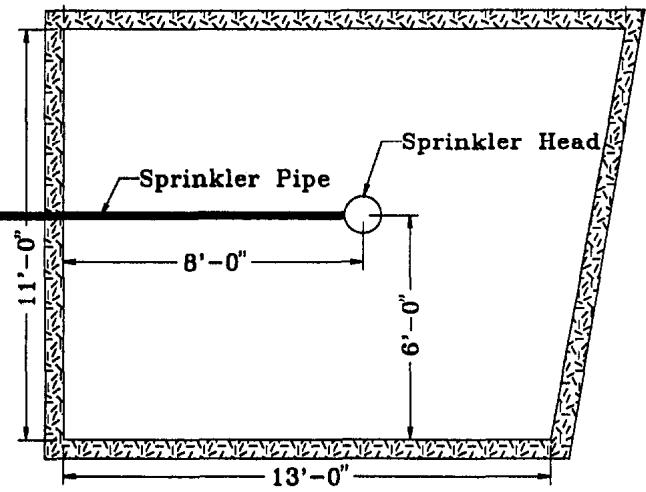

Figure 4 Traditional Placement of Sprinkler Heads  
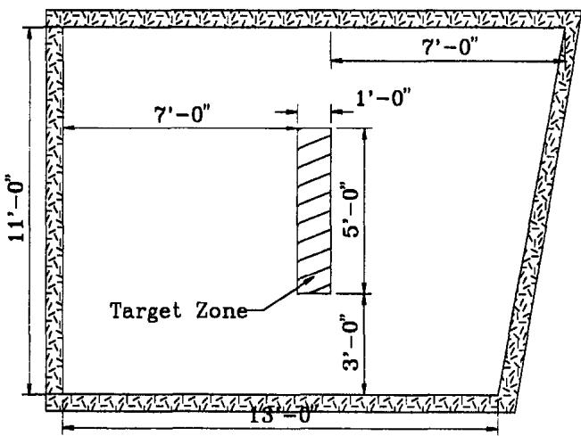  
Figure 5  
Typical Target Zone Based on $\mathbf { 1 6 ^ { \circ } \times 1 6 ^ { \circ } }$ Coverage

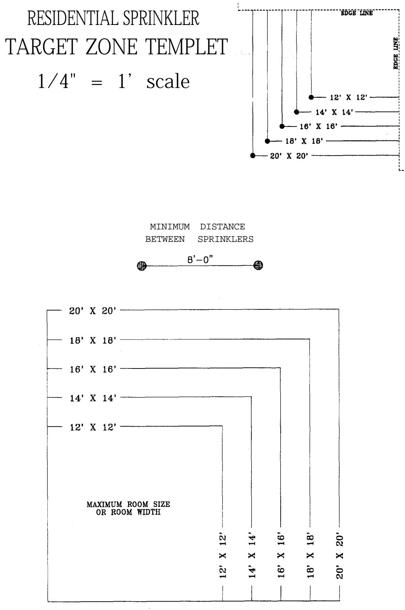  
Figure 6  
Template for the Creation of Target Zones (not to seale)

## Two Initial Steps

Two steps must be taken before measurements begin:

The applicable templet-- 1/4” or 1/8” --must be copied onto a transparency of the type used for overhead projections. With this transparency, house plans can be seen beneath the templet.

The two sides of the target zone scale that face the edges of the sheet, must be trimmed along the lines marked “edge line.” This is shown in Figure 7.

## Coverage Area

Use of the templet to lay out target zones is based on the Coverage Area that has been selected for the system. This figure appears on the Hydraulic Work Sheet, Item 1B.

## Creating a Target Zone

Creating a target zone by means of the templet is shown in Figures 8 and 9. In this example, the Coverage Area selected for the system is 16’ x 16’, and the room in which the sprinkler head is to be installed is 13’ x 15’.

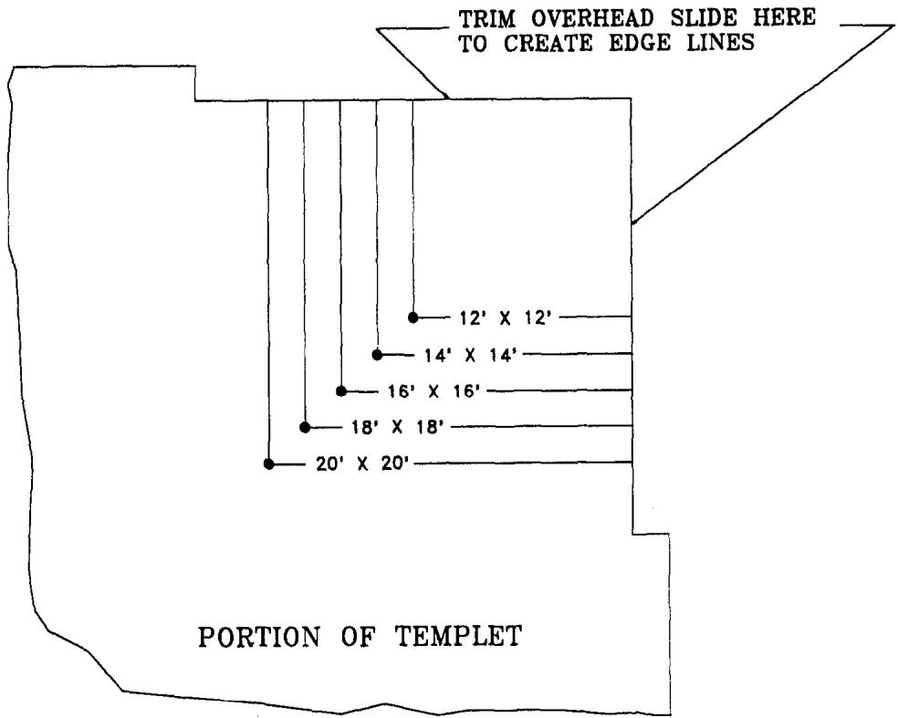

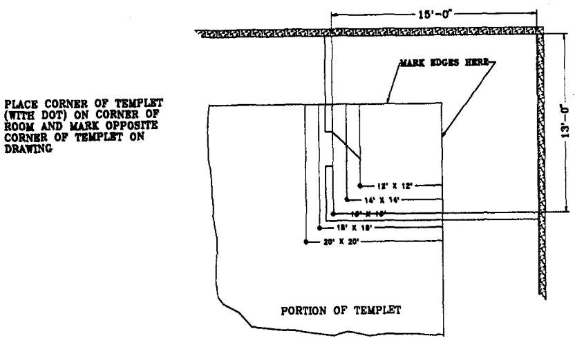

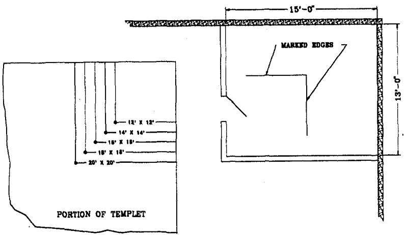  
Figure 8  
Creating One Corner of the Target Zone

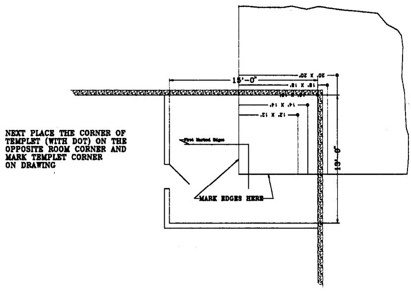

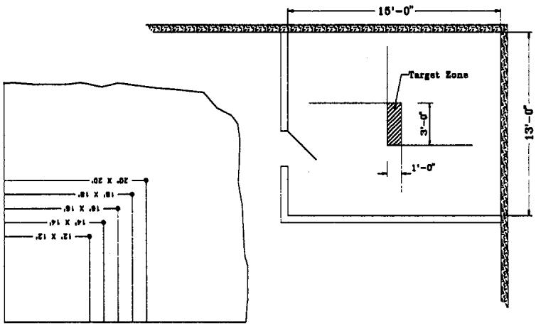  
Figure 9 Creating the Second Corner of the Target Zone

The steps are as follows:

To match the dimensions of the Coverage Area, the 16’ x 16’ scale in the upper right corner of the templet is employed.

Place this scale on one corner of the room on the plans, with the dot in the corner, as shown in Figure 8. Trace the comer of the scale edges onto the drawing.

Place the scale on the diagonally opposite sides of the room with the dot in the comer, as shown in Figure 9. Trace the comer of the scale edges onto the drawing.

The two right-angle markings will overlap in an area in the middle of the room. This is the Target Zone.

## Three Types of Rooms

Rooms will fall into three general types. Procedures, illustrated in Figure 10, for each type are as follows:

Type 1 - Rooms whose length and width are both less than the width of the Coverage Area. This type of room will require only one sprinkler head.

Use of the template to locate the target zone is described above.

Type 2 - Rooms whose width is less than the width of the Coverage Area, but whose length exceeds the length of the Coverage Area. This type of room will require two sprinkler heads.

The steps are as follows:

1. Divide the room in half along its length on the plans.

2. Treat each half as a separate room, and proceed as described above.

Type 3 - Rooms whose length and width both exceed the length and width of the Coverage Area. This type of room will require two rows of sprinkler heads, with each row having two heads.

The steps are as follows:

1. Divide the room in half along both its length and width.

2. Treat each of the four sections as a separate room, and proceed as above.

Type 1: Room Width and Length Less Than Coverage Area

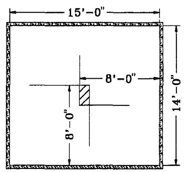  
Type 2: Room Width Less Than Coverage Area, Room Length Greater, Than Coverage Area

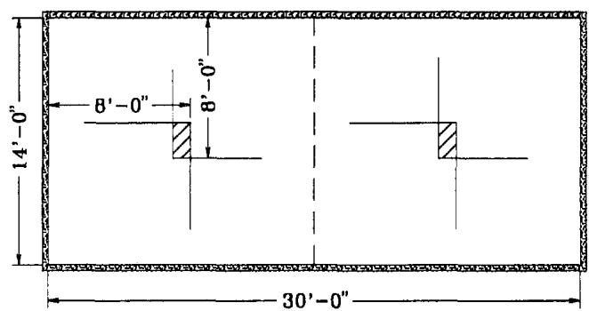  
Type 3: Room Width and Length Greater Than Coverage Area

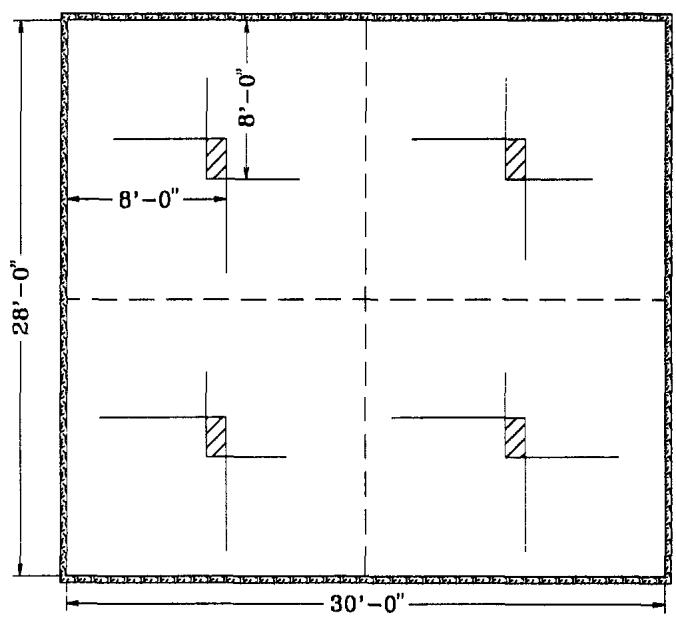  
Figure 10 Target Zones in Different Room Types

## Sidewall Sprinklers

To determine target zones for sidewall sprinklers, proceed as follows:

Select the wall on which the sprinkler head will be placed.

Place the templet on one side of a scale plan of the wall and trace one edge of the template onto the drawing as shown in Figure 11.

Move the templet to the opposite edge, and trace the edge onto the drawing. This will create a pair of parallel lines on the drawing. The space between them is the target zone.

For walls with more than one sprinkler, divide the wall in half and treat each half as an independent wall section.

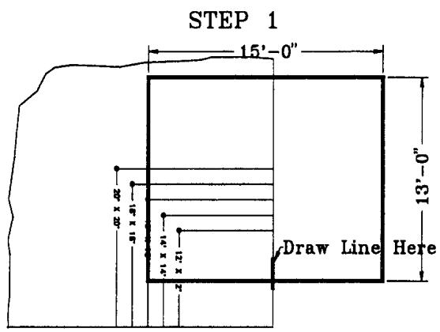

STEP 2  
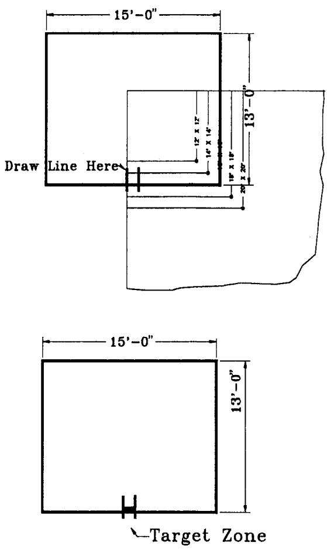  
Figure 11  
Target Zone for Sidewall Sprinklers

APPENDIX A

PRESSURE LOSS TABLES

UNDERGROUND PIPING

3/4" COPPER PIPE (any type)

<table><tr><td rowspan="2" colspan="2"></td><td colspan="26">DESIGN WATER FLOW (gpm)</td></tr><tr><td>9</td><td>10</td><td>11</td><td>12</td><td>13</td><td>14</td><td>15</td><td>16</td><td>17</td><td>18</td><td>19</td><td>20</td><td>21</td><td>22</td><td>23</td><td>24</td><td>25</td><td>26</td><td>27</td><td>28</td><td>29</td><td>30</td><td>31</td><td>32</td><td></td><td></td></tr><tr><td rowspan="20">L E N G T H O F P I P E f t 200</td><td>10</td><td>1</td><td>1</td><td>2</td><td>2</td><td>2</td><td>2</td><td>3</td><td>3</td><td>3</td><td>4</td><td>4</td><td>5</td><td>5</td><td>5</td><td>6</td><td>6</td><td>7</td><td>7</td><td>8</td><td>8</td><td>9</td><td>10</td><td>10</td><td>11</td><td>10</td><td></td></tr><tr><td>20</td><td>2</td><td>3</td><td>3</td><td>4</td><td>4</td><td>5</td><td>5</td><td>6</td><td>7</td><td>8</td><td>8</td><td>9</td><td>10</td><td>11</td><td>12</td><td>13</td><td>14</td><td>15</td><td>16</td><td>17</td><td>18</td><td>19</td><td>21</td><td>22</td><td>20</td><td></td></tr><tr><td>30</td><td>3</td><td>4</td><td>5</td><td>5</td><td>6</td><td>7</td><td>8</td><td>9</td><td>10</td><td>11</td><td>12</td><td>14</td><td>15</td><td>16</td><td>18</td><td>19</td><td>21</td><td>22</td><td>24</td><td>25</td><td>27</td><td>29</td><td>31</td><td>33</td><td>30</td><td></td></tr><tr><td>40</td><td>4</td><td>5</td><td>6</td><td>7</td><td>8</td><td>9</td><td>11</td><td>12</td><td>14</td><td>15</td><td>17</td><td>18</td><td>20</td><td>22</td><td>24</td><td>26</td><td>28</td><td>30</td><td>32</td><td>34</td><td>36</td><td>39</td><td>-</td><td>-</td><td>40</td><td></td></tr><tr><td>50</td><td>5</td><td>6</td><td>8</td><td>9</td><td>10</td><td>12</td><td>13</td><td>15</td><td>17</td><td>19</td><td>21</td><td>23</td><td>25</td><td>27</td><td>30</td><td>32</td><td>34</td><td>37</td><td>-</td><td>-</td><td>-</td><td>-</td><td>-</td><td>-</td><td>50</td><td></td></tr><tr><td>60</td><td>6</td><td>8</td><td>9</td><td>11</td><td>12</td><td>14</td><td>16</td><td>18</td><td>20</td><td>23</td><td>25</td><td>27</td><td>30</td><td>33</td><td>35</td><td>38</td><td>-</td><td>-</td><td>-</td><td>-</td><td>-</td><td>-</td><td>-</td><td>-</td><td>60</td><td></td></tr><tr><td>70</td><td>7</td><td>9</td><td>11</td><td>12</td><td>14</td><td>16</td><td>19</td><td>21</td><td>24</td><td>26</td><td>29</td><td>32</td><td>35</td><td>38</td><td>-</td><td>-</td><td>-</td><td>-</td><td>-</td><td>-</td><td>-</td><td>-</td><td>-</td><td>-</td><td>70</td><td></td></tr><tr><td>80</td><td>8</td><td>10</td><td>12</td><td>14</td><td>16</td><td>19</td><td>21</td><td>24</td><td>27</td><td>30</td><td>33</td><td>36</td><td>-</td><td>-</td><td>-</td><td>-</td><td>-</td><td>-</td><td>-</td><td>-</td><td>-</td><td>-</td><td>-</td><td>-</td><td>80</td><td></td></tr><tr><td>90</td><td>9</td><td>11</td><td>14</td><td>16</td><td>18</td><td>21</td><td>24</td><td>27</td><td>30</td><td>34</td><td>37</td><td>-</td><td>-</td><td>-</td><td>-</td><td>-</td><td>-</td><td>-</td><td>-</td><td>-</td><td>-</td><td>-</td><td>-</td><td>-</td><td>90</td><td></td></tr><tr><td>100</td><td>10</td><td>13</td><td>15</td><td>18</td><td>21</td><td>24</td><td>27</td><td>30</td><td>34</td><td>38</td><td>-</td><td>-</td><td>-</td><td>-</td><td>-</td><td>-</td><td>-</td><td>-</td><td>-</td><td>-</td><td>-</td><td>-</td><td>-</td><td>-</td><td>100</td><td></td></tr><tr><td>110</td><td>11</td><td>14</td><td>17</td><td>19</td><td>23</td><td>26</td><td>29</td><td>33</td><td>37</td><td>-</td><td>-</td><td>-</td><td>-</td><td>-</td><td>-</td><td>-</td><td>-</td><td>-</td><td>-</td><td>-</td><td>-</td><td>-</td><td>-</td><td>-</td><td>110</td><td></td></tr><tr><td>120</td><td>12</td><td>15</td><td>18</td><td>21</td><td>25</td><td>28</td><td>32</td><td>36</td><td>-</td><td>-</td><td>-</td><td>-</td><td>-</td><td>-</td><td>-</td><td>-</td><td>-</td><td>-</td><td>-</td><td>-</td><td>-</td><td>-</td><td>-</td><td>-</td><td>120</td><td></td></tr><tr><td>130</td><td>14</td><td>16</td><td>20</td><td>23</td><td>27</td><td>31</td><td>35</td><td>-</td><td>-</td><td>-</td><td>-</td><td>-</td><td>-</td><td>-</td><td>-</td><td>-</td><td>-</td><td>-</td><td>-</td><td>-</td><td>-</td><td>-</td><td>-</td><td>-</td><td>130</td><td></td></tr><tr><td>140</td><td>15</td><td>18</td><td>21</td><td>25</td><td>29</td><td>33</td><td>37</td><td>-</td><td>-</td><td>-</td><td>-</td><td>-</td><td>-</td><td>-</td><td>-</td><td>-</td><td>-</td><td>-</td><td>-</td><td>-</td><td>-</td><td>-</td><td>-</td><td>-</td><td>140</td><td></td></tr><tr><td>150</td><td>16</td><td>19</td><td>23</td><td>27</td><td>31</td><td>35</td><td>-</td><td>-</td><td>-</td><td>-</td><td>-</td><td>-</td><td>-</td><td>-</td><td>-</td><td>-</td><td>-</td><td>-</td><td>-</td><td>-</td><td>-</td><td>-</td><td>-</td><td>-</td><td>150</td><td></td></tr><tr><td>160</td><td>17</td><td>20</td><td>24</td><td>28</td><td>33</td><td>38</td><td>-</td><td>-</td><td>-</td><td>-</td><td>-</td><td>-</td><td>-</td><td>-</td><td>-</td><td>-</td><td>-</td><td>-</td><td>-</td><td>-</td><td>-</td><td>-</td><td>-</td><td>-</td><td>160</td><td></td></tr><tr><td>170</td><td>18</td><td>21</td><td>26</td><td>30</td><td>35</td><td>-</td><td>-</td><td>-</td><td>-</td><td>-</td><td>-</td><td>-</td><td>-</td><td>-</td><td>-</td><td>-</td><td>-</td><td>-</td><td>-</td><td>-</td><td>-</td><td>-</td><td>-</td><td>-</td><td>170</td><td></td></tr><tr><td>180</td><td>19</td><td>23</td><td>27</td><td>32</td><td>37</td><td>-</td><td>-</td><td>-</td><td>-</td><td>-</td><td>-</td><td>-</td><td>-</td><td>-</td><td>-</td><td>-</td><td>-</td><td>-</td><td>-</td><td>-</td><td>-</td><td>-</td><td>-</td><td>-</td><td>180</td><td></td></tr><tr><td>190</td><td>20</td><td>24</td><td>29</td><td>34</td><td>-</td><td>-</td><td>-</td><td>-</td><td>-</td><td>-</td><td>-</td><td>-</td><td>-</td><td>-</td><td>-</td><td>-</td><td>-</td><td>-</td><td>-</td><td>-</td><td>-</td><td>-</td><td>-</td><td>-</td><td>190</td><td></td></tr><tr><td>200</td><td>21</td><td>25</td><td>30</td><td>35</td><td>-</td><td>-</td><td>-</td><td>-</td><td>-</td><td>-</td><td>-</td><td>-</td><td>-</td><td>-</td><td>-</td><td>-</td><td>-</td><td>-</td><td>-</td><td>-</td><td>-</td><td>-</td><td>-</td><td>-</td><td>200</td><td></td></tr></table>

1" COPPER PIPE (any type)

<table><tr><td rowspan="2" colspan="2"></td><td colspan="25">DESIGN WATER FLOW (gpm)</td></tr><tr><td>9</td><td>10</td><td>11</td><td>12</td><td>13</td><td>14</td><td>15</td><td>16</td><td>17</td><td>18</td><td>19</td><td>20</td><td>21</td><td>22</td><td>23</td><td>24</td><td>25</td><td>26</td><td>27</td><td>28</td><td>29</td><td>30</td><td>31</td><td>32</td><td></td></tr><tr><td rowspan="20">L</td><td>10</td><td>0</td><td>0</td><td>0</td><td>0</td><td>1</td><td>1</td><td>1</td><td>1</td><td>1</td><td>1</td><td>1</td><td>1</td><td>1</td><td>1</td><td>1</td><td>2</td><td>2</td><td>2</td><td>2</td><td>2</td><td>2</td><td>2</td><td>3</td><td>3</td><td>10</td></tr><tr><td>20</td><td>1</td><td>1</td><td>1</td><td>1</td><td>1</td><td>1</td><td>1</td><td>1</td><td>2</td><td>2</td><td>2</td><td>2</td><td>2</td><td>3</td><td>3</td><td>3</td><td>3</td><td>4</td><td>4</td><td>4</td><td>4</td><td>5</td><td>5</td><td>5</td><td>20</td></tr><tr><td>30</td><td>1</td><td>1</td><td>1</td><td>1</td><td>2</td><td>2</td><td>2</td><td>2</td><td>2</td><td>3</td><td>3</td><td>3</td><td>4</td><td>4</td><td>4</td><td>5</td><td>5</td><td>5</td><td>6</td><td>6</td><td>7</td><td>7</td><td>8</td><td>8</td><td>30</td></tr><tr><td>40</td><td>1</td><td>1</td><td>1</td><td>2</td><td>2</td><td>2</td><td>3</td><td>3</td><td>3</td><td>4</td><td>4</td><td>4</td><td>5</td><td>5</td><td>6</td><td>6</td><td>7</td><td>7</td><td>8</td><td>8</td><td>9</td><td>9</td><td>10</td><td>11</td><td>40</td></tr><tr><td>50</td><td>1</td><td>2</td><td>2</td><td>2</td><td>3</td><td>3</td><td>3</td><td>4</td><td>4</td><td>5</td><td>5</td><td>6</td><td>6</td><td>7</td><td>7</td><td>8</td><td>8</td><td>9</td><td>10</td><td>10</td><td>11</td><td>12</td><td>13</td><td>13</td><td>50</td></tr><tr><td>60</td><td>2</td><td>2</td><td>2</td><td>3</td><td>3</td><td>3</td><td>4</td><td>4</td><td>5</td><td>6</td><td>6</td><td>7</td><td>7</td><td>8</td><td>9</td><td>9</td><td>10</td><td>11</td><td>12</td><td>12</td><td>13</td><td>14</td><td>15</td><td>16</td><td>60</td></tr><tr><td>70</td><td>2</td><td>2</td><td>3</td><td>3</td><td>4</td><td>4</td><td>5</td><td>5</td><td>6</td><td>6</td><td>7</td><td>8</td><td>9</td><td>9</td><td>10</td><td>11</td><td>12</td><td>13</td><td>14</td><td>15</td><td>16</td><td>17</td><td>18</td><td>19</td><td>70</td></tr><tr><td>80</td><td>2</td><td>2</td><td>3</td><td>3</td><td>4</td><td>5</td><td>5</td><td>6</td><td>7</td><td>7</td><td>8</td><td>9</td><td>10</td><td>11</td><td>12</td><td>12</td><td>13</td><td>14</td><td>16</td><td>17</td><td>18</td><td>19</td><td>20</td><td>21</td><td>80</td></tr><tr><td>90</td><td>2</td><td>3</td><td>3</td><td>4</td><td>5</td><td>5</td><td>6</td><td>7</td><td>7</td><td>8</td><td>9</td><td>10</td><td>11</td><td>12</td><td>13</td><td>14</td><td>15</td><td>16</td><td>17</td><td>19</td><td>20</td><td>21</td><td>23</td><td>24</td><td>90</td></tr><tr><td>100</td><td>3</td><td>3</td><td>4</td><td>4</td><td>5</td><td>6</td><td>7</td><td>7</td><td>8</td><td>9</td><td>10</td><td>11</td><td>12</td><td>13</td><td>14</td><td>16</td><td>17</td><td>18</td><td>19</td><td>21</td><td>22</td><td>24</td><td>25</td><td>27</td><td>100</td></tr><tr><td>110</td><td>3</td><td>3</td><td>4</td><td>5</td><td>6</td><td>6</td><td>7</td><td>8</td><td>9</td><td>10</td><td>11</td><td>12</td><td>13</td><td>15</td><td>16</td><td>17</td><td>19</td><td>20</td><td>21</td><td>23</td><td>24</td><td>26</td><td>28</td><td>29</td><td>110</td></tr><tr><td>120</td><td>3</td><td>4</td><td>4</td><td>5</td><td>6</td><td>7</td><td>8</td><td>9</td><td>10</td><td>11</td><td>12</td><td>13</td><td>15</td><td>16</td><td>17</td><td>19</td><td>20</td><td>22</td><td>23</td><td>25</td><td>27</td><td>28</td><td>30</td><td>32</td><td>120</td></tr><tr><td>130</td><td>3</td><td>4</td><td>5</td><td>6</td><td>7</td><td>7</td><td>9</td><td>10</td><td>11</td><td>12</td><td>13</td><td>14</td><td>16</td><td>17</td><td>19</td><td>20</td><td>22</td><td>24</td><td>25</td><td>27</td><td>29</td><td>31</td><td>33</td><td>35</td><td>130</td></tr><tr><td>140</td><td>4</td><td>4</td><td>5</td><td>6</td><td>7</td><td>8</td><td>9</td><td>10</td><td>12</td><td>13</td><td>14</td><td>16</td><td>17</td><td>19</td><td>20</td><td>22</td><td>24</td><td>25</td><td>27</td><td>29</td><td>31</td><td>33</td><td>35</td><td>37</td><td>140</td></tr><tr><td>150</td><td>4</td><td>5</td><td>6</td><td>6</td><td>8</td><td>9</td><td>10</td><td>11</td><td>12</td><td>14</td><td>15</td><td>17</td><td>18</td><td>20</td><td>22</td><td>23</td><td>25</td><td>27</td><td>29</td><td>31</td><td>33</td><td>35</td><td>38</td><td>-</td><td>150</td></tr><tr><td>160</td><td>4</td><td>5</td><td>6</td><td>7</td><td>8</td><td>9</td><td>10</td><td>12</td><td>13</td><td>15</td><td>16</td><td>18</td><td>20</td><td>21</td><td>23</td><td>25</td><td>27</td><td>29</td><td>31</td><td>33</td><td>35</td><td>38</td><td>-</td><td>-</td><td>160</td></tr><tr><td>170</td><td>4</td><td>5</td><td>6</td><td>7</td><td>9</td><td>10</td><td>11</td><td>13</td><td>14</td><td>16</td><td>17</td><td>19</td><td>21</td><td>23</td><td>25</td><td>27</td><td>29</td><td>31</td><td>33</td><td>35</td><td>38</td><td>-</td><td>-</td><td>-</td><td>170</td></tr><tr><td>180</td><td>5</td><td>6</td><td>7</td><td>8</td><td>9</td><td>10</td><td>12</td><td>13</td><td>15</td><td>17</td><td>18</td><td>20</td><td>22</td><td>24</td><td>26</td><td>28</td><td>30</td><td>33</td><td>35</td><td>37</td><td>-</td><td>-</td><td>-</td><td>-</td><td>180</td></tr><tr><td>190</td><td>5</td><td>6</td><td>7</td><td>8</td><td>10</td><td>11</td><td>12</td><td>14</td><td>16</td><td>17</td><td>19</td><td>21</td><td>23</td><td>25</td><td>27</td><td>30</td><td>32</td><td>34</td><td>37</td><td>-</td><td>-</td><td>-</td><td>-</td><td>-</td><td>190</td></tr><tr><td>200</td><td>5</td><td>6</td><td>7</td><td>9</td><td>10</td><td>12</td><td>13</td><td>15</td><td>16</td><td>18</td><td>20</td><td>22</td><td>24</td><td>27</td><td>29</td><td>31</td><td>34</td><td>36</td><td>39</td><td>-</td><td>-</td><td>-</td><td>-</td><td>-</td><td>200</td></tr></table>

1 1/4" COPPER PIPE (any type)

<table><tr><td rowspan="2" colspan="2"></td><td colspan="26">DESIGN WATER FLOW (gpm)</td></tr><tr><td>9</td><td>10</td><td>11</td><td>12</td><td>13</td><td>14</td><td>15</td><td>16</td><td>17</td><td>18</td><td>19</td><td>20</td><td>21</td><td>22</td><td>23</td><td>24</td><td>25</td><td>26</td><td>27</td><td>28</td><td>29</td><td>30</td><td>31</td><td>32</td><td></td><td></td></tr><tr><td rowspan="20">L</td><td>10</td><td>0</td><td>0</td><td>0</td><td>0</td><td>0</td><td>0</td><td>0</td><td>0</td><td>0</td><td>0</td><td>0</td><td>0</td><td>0</td><td>0</td><td>0</td><td>1</td><td>1</td><td>1</td><td>1</td><td>1</td><td>1</td><td>1</td><td>1</td><td>1</td><td>10</td><td></td></tr><tr><td>20</td><td>0</td><td>0</td><td>0</td><td>0</td><td>0</td><td>0</td><td>0</td><td>0</td><td>1</td><td>1</td><td>1</td><td>1</td><td>1</td><td>1</td><td>1</td><td>1</td><td>1</td><td>1</td><td>1</td><td>1</td><td>1</td><td>2</td><td>2</td><td>2</td><td>20</td><td></td></tr><tr><td>30</td><td>0</td><td>0</td><td>0</td><td>0</td><td>1</td><td>1</td><td>1</td><td>1</td><td>1</td><td>1</td><td>1</td><td>1</td><td>1</td><td>1</td><td>1</td><td>2</td><td>2</td><td>2</td><td>2</td><td>2</td><td>2</td><td>2</td><td>3</td><td>3</td><td>30</td><td>L</td></tr><tr><td>40</td><td>0</td><td>0</td><td>0</td><td>1</td><td>1</td><td>1</td><td>1</td><td>1</td><td>1</td><td>1</td><td>1</td><td>1</td><td>2</td><td>2</td><td>2</td><td>2</td><td>2</td><td>2</td><td>3</td><td>3</td><td>3</td><td>3</td><td>3</td><td>4</td><td>40</td><td>E</td></tr><tr><td>50</td><td>0</td><td>1</td><td>1</td><td>1</td><td>1</td><td>1</td><td>1</td><td>1</td><td>1</td><td>2</td><td>2</td><td>2</td><td>2</td><td>2</td><td>2</td><td>3</td><td>3</td><td>3</td><td>3</td><td>3</td><td>4</td><td>4</td><td>4</td><td>4</td><td>50</td><td>N</td></tr><tr><td>60</td><td>1</td><td>1</td><td>1</td><td>1</td><td>1</td><td>1</td><td>1</td><td>1</td><td>2</td><td>2</td><td>2</td><td>2</td><td>2</td><td>3</td><td>3</td><td>3</td><td>3</td><td>4</td><td>4</td><td>4</td><td>4</td><td>5</td><td>5</td><td>5</td><td>60</td><td>G</td></tr><tr><td>70</td><td>1</td><td>1</td><td>1</td><td>1</td><td>1</td><td>1</td><td>2</td><td>2</td><td>2</td><td>2</td><td>2</td><td>3</td><td>3</td><td>3</td><td>3</td><td>4</td><td>4</td><td>4</td><td>5</td><td>5</td><td>5</td><td>6</td><td>6</td><td>6</td><td>70</td><td>T</td></tr><tr><td>80</td><td>1</td><td>1</td><td>1</td><td>1</td><td>1</td><td>2</td><td>2</td><td>2</td><td>2</td><td>2</td><td>3</td><td>3</td><td>3</td><td>4</td><td>4</td><td>4</td><td>5</td><td>5</td><td>5</td><td>6</td><td>6</td><td>6</td><td>7</td><td>7</td><td>80</td><td>H</td></tr><tr><td>90</td><td>1</td><td>1</td><td>1</td><td>1</td><td>2</td><td>2</td><td>2</td><td>2</td><td>2</td><td>3</td><td>3</td><td>3</td><td>4</td><td>4</td><td>4</td><td>5</td><td>5</td><td>5</td><td>6</td><td>6</td><td>7</td><td>7</td><td>8</td><td>8</td><td>90</td><td></td></tr><tr><td>100</td><td>1</td><td>1</td><td>1</td><td>1</td><td>2</td><td>2</td><td>2</td><td>2</td><td>3</td><td>3</td><td>3</td><td>4</td><td>4</td><td>4</td><td>5</td><td>5</td><td>6</td><td>6</td><td>7</td><td>7</td><td>7</td><td>8</td><td>8</td><td>9</td><td>100</td><td>C</td></tr><tr><td>110</td><td>1</td><td>1</td><td>1</td><td>2</td><td>2</td><td>2</td><td>2</td><td>3</td><td>3</td><td>3</td><td>4</td><td>4</td><td>5</td><td>5</td><td>5</td><td>6</td><td>6</td><td>7</td><td>7</td><td>8</td><td>8</td><td>9</td><td>9</td><td>10</td><td>110</td><td>F</td></tr><tr><td>120</td><td>1</td><td>1</td><td>1</td><td>2</td><td>2</td><td>2</td><td>3</td><td>3</td><td>3</td><td>4</td><td>4</td><td>4</td><td>5</td><td>5</td><td>6</td><td>6</td><td>7</td><td>7</td><td>8</td><td>8</td><td>9</td><td>10</td><td>10</td><td>11</td><td>120</td><td></td></tr><tr><td>130</td><td>1</td><td>1</td><td>2</td><td>2</td><td>2</td><td>3</td><td>3</td><td>3</td><td>4</td><td>4</td><td>4</td><td>5</td><td>5</td><td>6</td><td>6</td><td>7</td><td>7</td><td>8</td><td>8</td><td>9</td><td>10</td><td>10</td><td>11</td><td>12</td><td>130</td><td>P</td></tr><tr><td>140</td><td>1</td><td>1</td><td>2</td><td>2</td><td>2</td><td>3</td><td>3</td><td>3</td><td>4</td><td>4</td><td>5</td><td>5</td><td>6</td><td>6</td><td>7</td><td>7</td><td>8</td><td>9</td><td>9</td><td>10</td><td>10</td><td>11</td><td>12</td><td>12</td><td>140</td><td>I</td></tr><tr><td>150</td><td>1</td><td>2</td><td>2</td><td>2</td><td>3</td><td>3</td><td>3</td><td>4</td><td>4</td><td>5</td><td>5</td><td>6</td><td>6</td><td>7</td><td>7</td><td>8</td><td>8</td><td>9</td><td>10</td><td>10</td><td>11</td><td>12</td><td>13</td><td>13</td><td>150</td><td>P</td></tr><tr><td>160</td><td>1</td><td>2</td><td>2</td><td>2</td><td>3</td><td>3</td><td>4</td><td>4</td><td>4</td><td>5</td><td>5</td><td>6</td><td>7</td><td>7</td><td>8</td><td>8</td><td>9</td><td>10</td><td>10</td><td>11</td><td>12</td><td>13</td><td>13</td><td>14</td><td>160</td><td>E</td></tr><tr><td>170</td><td>1</td><td>2</td><td>2</td><td>2</td><td>3</td><td>3</td><td>4</td><td>4</td><td>5</td><td>5</td><td>6</td><td>6</td><td>7</td><td>8</td><td>8</td><td>9</td><td>10</td><td>10</td><td>11</td><td>12</td><td>13</td><td>13</td><td>14</td><td>15</td><td>170</td><td></td></tr><tr><td>180</td><td>2</td><td>2</td><td>2</td><td>3</td><td>3</td><td>3</td><td>4</td><td>4</td><td>5</td><td>6</td><td>6</td><td>7</td><td>7</td><td>8</td><td>9</td><td>9</td><td>10</td><td>11</td><td>12</td><td>13</td><td>13</td><td>14</td><td>15</td><td>16</td><td>180</td><td>f</td></tr><tr><td>190</td><td>2</td><td>2</td><td>2</td><td>3</td><td>3</td><td>4</td><td>4</td><td>5</td><td>5</td><td>6</td><td>6</td><td>7</td><td>8</td><td>8</td><td>9</td><td>10</td><td>11</td><td>12</td><td>12</td><td>13</td><td>14</td><td>15</td><td>16</td><td>17</td><td>190</td><td>t</td></tr><tr><td>200</td><td>2</td><td>2</td><td>2</td><td>3</td><td>3</td><td>4</td><td>4</td><td>5</td><td>6</td><td>6</td><td>7</td><td>7</td><td>8</td><td>9</td><td>10</td><td>10</td><td>11</td><td>12</td><td>13</td><td>14</td><td>15</td><td>16</td><td>17</td><td>18</td><td>200</td><td></td></tr></table>

1 1/2" COPPER PIPE (any type)

<table><tr><td rowspan="2" colspan="2"></td><td colspan="27">DESIGN WATER FLOW (gpm)</td></tr><tr><td>9</td><td>10</td><td>11</td><td>12</td><td>13</td><td>14</td><td>15</td><td>16</td><td>17</td><td>18</td><td>19</td><td>20</td><td>21</td><td>22</td><td>23</td><td>24</td><td>25</td><td>26</td><td>27</td><td>28</td><td>29</td><td>30</td><td>31</td><td>32</td><td></td><td></td><td></td></tr><tr><td rowspan="2"></td><td>10</td><td>0</td><td>0</td><td>0</td><td>0</td><td>0</td><td>0</td><td>0</td><td>0</td><td>0</td><td>0</td><td>0</td><td>0</td><td>0</td><td>0</td><td>0</td><td>0</td><td>0</td><td>0</td><td>0</td><td>0</td><td>0</td><td>0</td><td>0</td><td>0</td><td>10</td><td></td><td></td></tr><tr><td>20</td><td>0</td><td>0</td><td>0</td><td>0</td><td>0</td><td>0</td><td>0</td><td>0</td><td>0</td><td>0</td><td>0</td><td>0</td><td>0</td><td>0</td><td>0</td><td>0</td><td>0</td><td>1</td><td>1</td><td>1</td><td>1</td><td>1</td><td>1</td><td>1</td><td>20</td><td></td><td></td></tr><tr><td>L</td><td>30</td><td>0</td><td>0</td><td>0</td><td>0</td><td>0</td><td>0</td><td>0</td><td>0</td><td>0</td><td>0</td><td>0</td><td>0</td><td>1</td><td>1</td><td>1</td><td>1</td><td>1</td><td>1</td><td>1</td><td>1</td><td>1</td><td>1</td><td>1</td><td>1</td><td>30</td><td>L</td><td></td></tr><tr><td>E</td><td>40</td><td>0</td><td>0</td><td>0</td><td>0</td><td>0</td><td>0</td><td>0</td><td>0</td><td>0</td><td>1</td><td>1</td><td>1</td><td>1</td><td>1</td><td>1</td><td>1</td><td>1</td><td>1</td><td>1</td><td>1</td><td>1</td><td>1</td><td>1</td><td>1</td><td>40</td><td>E</td><td></td></tr><tr><td>N</td><td>50</td><td>0</td><td>0</td><td>0</td><td>0</td><td>0</td><td>0</td><td>0</td><td>1</td><td>1</td><td>1</td><td>1</td><td>1</td><td>1</td><td>1</td><td>1</td><td>1</td><td>1</td><td>1</td><td>1</td><td>1</td><td>1</td><td>2</td><td>2</td><td>2</td><td>50</td><td>N</td><td></td></tr><tr><td>G</td><td>60</td><td>0</td><td>0</td><td>0</td><td>0</td><td>0</td><td>0</td><td>1</td><td>1</td><td>1</td><td>1</td><td>1</td><td>1</td><td>1</td><td>1</td><td>1</td><td>1</td><td>1</td><td>2</td><td>2</td><td>2</td><td>2</td><td>2</td><td>2</td><td>2</td><td>60</td><td>G</td><td></td></tr><tr><td>T</td><td>70</td><td>0</td><td>0</td><td>0</td><td>0</td><td>1</td><td>1</td><td>1</td><td>1</td><td>1</td><td>1</td><td>1</td><td>1</td><td>1</td><td>1</td><td>1</td><td>2</td><td>2</td><td>2</td><td>2</td><td>2</td><td>2</td><td>2</td><td>3</td><td>3</td><td>70</td><td>T</td><td></td></tr><tr><td>H</td><td>80</td><td>0</td><td>0</td><td>0</td><td>0</td><td>1</td><td>1</td><td>1</td><td>1</td><td>1</td><td>1</td><td>1</td><td>1</td><td>1</td><td>2</td><td>2</td><td>2</td><td>2</td><td>2</td><td>2</td><td>2</td><td>3</td><td>3</td><td>3</td><td>3</td><td>80</td><td>H</td><td></td></tr><tr><td></td><td>90</td><td>0</td><td>0</td><td>0</td><td>1</td><td>1</td><td>1</td><td>1</td><td>1</td><td>1</td><td>1</td><td>1</td><td>1</td><td>2</td><td>2</td><td>2</td><td>2</td><td>2</td><td>2</td><td>3</td><td>3</td><td>3</td><td>3</td><td>3</td><td>3</td><td>90</td><td></td><td></td></tr><tr><td>O</td><td>100</td><td>0</td><td>0</td><td>1</td><td>1</td><td>1</td><td>1</td><td>1</td><td>1</td><td>1</td><td>1</td><td>1</td><td>2</td><td>2</td><td>2</td><td>2</td><td>2</td><td>2</td><td>3</td><td>3</td><td>3</td><td>3</td><td>3</td><td>4</td><td>4</td><td>100</td><td>O</td><td></td></tr><tr><td>F</td><td>110</td><td>0</td><td>0</td><td>1</td><td>1</td><td>1</td><td>1</td><td>1</td><td>1</td><td>1</td><td>1</td><td>2</td><td>2</td><td>2</td><td>2</td><td>2</td><td>2</td><td>3</td><td>3</td><td>3</td><td>3</td><td>4</td><td>4</td><td>4</td><td>4</td><td>110</td><td>F</td><td></td></tr><tr><td></td><td>120</td><td>0</td><td>1</td><td>1</td><td>1</td><td>1</td><td>1</td><td>1</td><td>1</td><td>1</td><td>2</td><td>2</td><td>2</td><td>2</td><td>2</td><td>2</td><td>3</td><td>3</td><td>3</td><td>3</td><td>4</td><td>4</td><td>4</td><td>4</td><td>5</td><td>120</td><td></td><td></td></tr><tr><td>P</td><td>130</td><td>0</td><td>1</td><td>1</td><td>1</td><td>1</td><td>1</td><td>1</td><td>1</td><td>2</td><td>2</td><td>2</td><td>2</td><td>2</td><td>2</td><td>3</td><td>3</td><td>3</td><td>3</td><td>4</td><td>4</td><td>4</td><td>4</td><td>5</td><td>5</td><td>130</td><td>P</td><td></td></tr><tr><td>I</td><td>140</td><td>1</td><td>1</td><td>1</td><td>1</td><td>1</td><td>1</td><td>1</td><td>1</td><td>2</td><td>2</td><td>2</td><td>2</td><td>2</td><td>3</td><td>3</td><td>3</td><td>3</td><td>4</td><td>4</td><td>4</td><td>4</td><td>5</td><td>5</td><td>5</td><td>140</td><td>I</td><td></td></tr><tr><td>P</td><td>150</td><td>1</td><td>1</td><td>1</td><td>1</td><td>1</td><td>1</td><td>1</td><td>2</td><td>2</td><td>2</td><td>2</td><td>2</td><td>3</td><td>3</td><td>3</td><td>3</td><td>4</td><td>4</td><td>4</td><td>4</td><td>5</td><td>5</td><td>5</td><td>6</td><td>150</td><td>P</td><td></td></tr><tr><td>E</td><td>160</td><td>1</td><td>1</td><td>1</td><td>1</td><td>1</td><td>1</td><td>2</td><td>2</td><td>2</td><td>2</td><td>2</td><td>3</td><td>3</td><td>3</td><td>3</td><td>4</td><td>4</td><td>4</td><td>4</td><td>5</td><td>5</td><td>5</td><td>6</td><td>6</td><td>160</td><td>E</td><td></td></tr><tr><td></td><td>170</td><td>1</td><td>1</td><td>1</td><td>1</td><td>1</td><td>1</td><td>2</td><td>2</td><td>2</td><td>2</td><td>2</td><td>3</td><td>3</td><td>3</td><td>4</td><td>4</td><td>4</td><td>4</td><td>5</td><td>5</td><td>5</td><td>6</td><td>6</td><td>7</td><td>170</td><td></td><td></td></tr><tr><td>f</td><td>180</td><td>1</td><td>1</td><td>1</td><td>1</td><td>1</td><td>1</td><td>2</td><td>2</td><td>2</td><td>2</td><td>3</td><td>3</td><td>3</td><td>3</td><td>4</td><td>4</td><td>4</td><td>5</td><td>5</td><td>5</td><td>6</td><td>6</td><td>7</td><td>7</td><td>180</td><td>f</td><td></td></tr><tr><td>t</td><td>190</td><td>1</td><td>1</td><td>1</td><td>1</td><td>1</td><td>2</td><td>2</td><td>2</td><td>2</td><td>3</td><td>3</td><td>3</td><td>3</td><td>4</td><td>4</td><td>4</td><td>5</td><td>5</td><td>5</td><td>6</td><td>6</td><td>6</td><td>7</td><td>7</td><td>190</td><td>t</td><td></td></tr><tr><td></td><td>200</td><td>1</td><td>1</td><td>1</td><td>1</td><td>1</td><td>2</td><td>2</td><td>2</td><td>2</td><td>3</td><td>3</td><td>3</td><td>4</td><td>4</td><td>4</td><td>4</td><td>5</td><td>5</td><td>6</td><td>6</td><td>6</td><td>7</td><td>7</td><td>8</td><td>200</td><td></td><td></td></tr></table>

2" COPPER PIPE (any type)

<table><tr><td rowspan="2" colspan="2"></td><td colspan="29">DESIGN WATER FLOW (gpm)</td></tr><tr><td>9</td><td>10</td><td>11</td><td>12</td><td>13</td><td>14</td><td>15</td><td>16</td><td>17</td><td>18</td><td>19</td><td>20</td><td>21</td><td>22</td><td>23</td><td>24</td><td>25</td><td>26</td><td>27</td><td>28</td><td>29</td><td>30</td><td>31</td><td>32</td><td></td><td></td><td></td><td></td><td></td></tr><tr><td rowspan="2"></td><td>10</td><td>0</td><td>0</td><td>0</td><td>0</td><td>0</td><td>0</td><td>0</td><td>0</td><td>0</td><td>0</td><td>0</td><td>0</td><td>0</td><td>0</td><td>0</td><td>0</td><td>0</td><td>0</td><td>0</td><td>0</td><td>0</td><td>0</td><td>0</td><td>0</td><td>10</td><td></td><td></td><td></td><td></td></tr><tr><td>20</td><td>0</td><td>0</td><td>0</td><td>0</td><td>0</td><td>0</td><td>0</td><td>0</td><td>0</td><td>0</td><td>0</td><td>0</td><td>0</td><td>0</td><td>0</td><td>0</td><td>0</td><td>0</td><td>0</td><td>0</td><td>0</td><td>0</td><td>0</td><td>0</td><td>20</td><td></td><td></td><td></td><td></td></tr><tr><td>L</td><td>30</td><td>0</td><td>0</td><td>0</td><td>0</td><td>0</td><td>0</td><td>0</td><td>0</td><td>0</td><td>0</td><td>0</td><td>0</td><td>0</td><td>0</td><td>0</td><td>0</td><td>0</td><td>0</td><td>0</td><td>0</td><td>0</td><td>0</td><td>0</td><td>0</td><td>30</td><td>L</td><td></td><td></td><td></td></tr><tr><td>E</td><td>40</td><td>0</td><td>0</td><td>0</td><td>0</td><td>0</td><td>0</td><td>0</td><td>0</td><td>0</td><td>0</td><td>0</td><td>0</td><td>0</td><td>0</td><td>0</td><td>0</td><td>0</td><td>0</td><td>0</td><td>0</td><td>0</td><td>0</td><td>0</td><td>0</td><td>40</td><td>E</td><td></td><td></td><td></td></tr><tr><td>N</td><td>50</td><td>0</td><td>0</td><td>0</td><td>0</td><td>0</td><td>0</td><td>0</td><td>0</td><td>0</td><td>0</td><td>0</td><td>0</td><td>0</td><td>0</td><td>0</td><td>0</td><td>0</td><td>0</td><td>0</td><td>0</td><td>0</td><td>0</td><td>0</td><td>0</td><td>50</td><td>N</td><td></td><td></td><td></td></tr><tr><td>G</td><td>60</td><td>0</td><td>0</td><td>0</td><td>0</td><td>0</td><td>0</td><td>0</td><td>0</td><td>0</td><td>0</td><td>0</td><td>0</td><td>0</td><td>0</td><td>0</td><td>0</td><td>0</td><td>0</td><td>0</td><td>0</td><td>0</td><td>1</td><td>1</td><td>1</td><td>60</td><td>G</td><td></td><td></td><td></td></tr><tr><td>T</td><td>70</td><td>0</td><td>0</td><td>0</td><td>0</td><td>0</td><td>0</td><td>0</td><td>0</td><td>0</td><td>0</td><td>0</td><td>0</td><td>0</td><td>0</td><td>0</td><td>0</td><td>0</td><td>0</td><td>1</td><td>1</td><td>1</td><td>1</td><td>1</td><td>1</td><td>70</td><td>T</td><td></td><td></td><td></td></tr><tr><td>H</td><td>80</td><td>0</td><td>0</td><td>0</td><td>0</td><td>0</td><td>0</td><td>0</td><td>0</td><td>0</td><td>0</td><td>0</td><td>0</td><td>0</td><td>0</td><td>0</td><td>0</td><td>0</td><td>1</td><td>1</td><td>1</td><td>1</td><td>1</td><td>1</td><td>1</td><td>80</td><td>H</td><td></td><td></td><td></td></tr><tr><td></td><td>90</td><td>0</td><td>0</td><td>0</td><td>0</td><td>0</td><td>0</td><td>0</td><td>0</td><td>0</td><td>0</td><td>0</td><td>0</td><td>0</td><td>0</td><td>0</td><td>1</td><td>1</td><td>1</td><td>1</td><td>1</td><td>1</td><td>1</td><td>1</td><td>1</td><td>90</td><td></td><td></td><td></td><td></td></tr><tr><td>O</td><td>100</td><td>0</td><td>0</td><td>0</td><td>0</td><td>0</td><td>0</td><td>0</td><td>0</td><td>0</td><td>0</td><td>0</td><td>0</td><td>0</td><td>0</td><td>1</td><td>1</td><td>1</td><td>1</td><td>1</td><td>1</td><td>1</td><td>1</td><td>1</td><td>1</td><td>100</td><td>O</td><td></td><td></td><td></td></tr><tr><td>F</td><td>110</td><td>0</td><td>0</td><td>0</td><td>0</td><td>0</td><td>0</td><td>0</td><td>0</td><td>0</td><td>0</td><td>0</td><td>0</td><td>0</td><td>1</td><td>1</td><td>1</td><td>1</td><td>1</td><td>1</td><td>1</td><td>1</td><td>1</td><td>1</td><td>1</td><td>110</td><td>F</td><td></td><td></td><td></td></tr><tr><td></td><td>120</td><td>0</td><td>0</td><td>0</td><td>0</td><td>0</td><td>0</td><td>0</td><td>0</td><td>0</td><td>0</td><td>0</td><td>0</td><td>1</td><td>1</td><td>1</td><td>1</td><td>1</td><td>1</td><td>1</td><td>1</td><td>1</td><td>1</td><td>1</td><td>1</td><td>120</td><td></td><td></td><td></td><td></td></tr><tr><td>P</td><td>130</td><td>0</td><td>0</td><td>0</td><td>0</td><td>0</td><td>0</td><td>0</td><td>0</td><td>0</td><td>0</td><td>0</td><td>1</td><td>1</td><td>1</td><td>1</td><td>1</td><td>1</td><td>1</td><td>1</td><td>1</td><td>1</td><td>1</td><td>1</td><td>1</td><td>130</td><td>P</td><td></td><td></td><td></td></tr><tr><td>I</td><td>140</td><td>0</td><td>0</td><td>0</td><td>0</td><td>0</td><td>0</td><td>0</td><td>0</td><td>0</td><td>0</td><td>1</td><td>1</td><td>1</td><td>1</td><td>1</td><td>1</td><td>1</td><td>1</td><td>1</td><td>1</td><td>1</td><td>1</td><td>1</td><td>1</td><td>140</td><td>I</td><td></td><td></td><td></td></tr><tr><td>P</td><td>150</td><td>0</td><td>0</td><td>0</td><td>0</td><td>0</td><td>0</td><td>0</td><td>0</td><td>0</td><td>1</td><td>1</td><td>1</td><td>1</td><td>1</td><td>1</td><td>1</td><td>1</td><td>1</td><td>1</td><td>1</td><td>1</td><td>1</td><td>1</td><td>1</td><td>150</td><td>P</td><td></td><td></td><td></td></tr><tr><td>E</td><td>160</td><td>0</td><td>0</td><td>0</td><td>0</td><td>0</td><td>0</td><td>0</td><td>0</td><td>0</td><td>1</td><td>1</td><td>1</td><td>1</td><td>1</td><td>1</td><td>1</td><td>1</td><td>1</td><td>1</td><td>1</td><td>1</td><td>1</td><td>1</td><td>2</td><td>160</td><td>E</td><td></td><td></td><td></td></tr><tr><td></td><td>170</td><td>0</td><td>0</td><td>0</td><td>0</td><td>0</td><td>0</td><td>0</td><td>0</td><td>1</td><td>1</td><td>1</td><td>1</td><td>1</td><td>1</td><td>1</td><td>1</td><td>1</td><td>1</td><td>1</td><td>1</td><td>1</td><td>1</td><td>2</td><td>2</td><td>170</td><td></td><td></td><td></td><td></td></tr><tr><td>f</td><td>180</td><td>0</td><td>0</td><td>0</td><td>0</td><td>0</td><td>0</td><td>0</td><td>0</td><td>1</td><td>1</td><td>1</td><td>1</td><td>1</td><td>1</td><td>1</td><td>1</td><td>1</td><td>1</td><td>1</td><td>1</td><td>1</td><td>2</td><td>2</td><td>2</td><td>180</td><td>f</td><td></td><td></td><td></td></tr><tr><td>t</td><td>190</td><td>0</td><td>0</td><td>0.</td><td>0</td><td>0</td><td>0</td><td>0</td><td>1</td><td>1</td><td>1</td><td>1</td><td>1</td><td>1</td><td>1</td><td>1</td><td>1</td><td>1</td><td>1</td><td>1</td><td>1</td><td>2</td><td>2</td><td>2</td><td>2</td><td>190</td><td>t</td><td></td><td></td><td></td></tr><tr><td></td><td>200</td><td>0</td><td>0</td><td>0</td><td>0</td><td>0</td><td>0</td><td>0</td><td>1</td><td>1</td><td>1</td><td>1</td><td>1</td><td>1</td><td>1</td><td>1</td><td>1</td><td>1</td><td>1</td><td>1</td><td>2</td><td>2</td><td>2</td><td>2</td><td>2</td><td>200</td><td></td><td></td><td></td><td></td></tr></table>

1" POLYBUTELENE (PB) TUBING - SDR 9

<table><tr><td rowspan="2" colspan="2"></td><td colspan="26">DESIGN WATER FLOW (gpm)</td></tr><tr><td>9</td><td>10</td><td>11</td><td>12</td><td>13</td><td>14</td><td>15</td><td>16</td><td>17</td><td>18</td><td>19</td><td>20</td><td>21</td><td>22</td><td>23</td><td>24</td><td>25</td><td>26</td><td>27</td><td>28</td><td>29</td><td>30</td><td>31</td><td>32</td><td></td><td></td></tr><tr><td></td><td>10</td><td>0</td><td>1</td><td>1</td><td>1</td><td>1</td><td>1</td><td>1</td><td>1</td><td>2</td><td>2</td><td>2</td><td>2</td><td>2</td><td>2</td><td>3</td><td>3</td><td>3</td><td>3</td><td>4</td><td>4</td><td>4</td><td>4</td><td>5</td><td>5</td><td>10</td><td></td></tr><tr><td></td><td>20</td><td>1</td><td>1</td><td>1</td><td>2</td><td>2</td><td>2</td><td>2</td><td>3</td><td>3</td><td>3</td><td>4</td><td>4</td><td>5</td><td>5</td><td>5</td><td>6</td><td>6</td><td>7</td><td>7</td><td>8</td><td>8</td><td>9</td><td>9</td><td>10</td><td>20</td><td></td></tr><tr><td>L</td><td>30</td><td>1</td><td>2</td><td>2</td><td>2</td><td>3</td><td>3</td><td>4</td><td>4</td><td>5</td><td>5</td><td>6</td><td>6</td><td>7</td><td>7</td><td>8</td><td>9</td><td>9</td><td>10</td><td>11</td><td>12</td><td>12</td><td>13</td><td>14</td><td>15</td><td>30</td><td>L</td></tr><tr><td>E</td><td>40</td><td>2</td><td>2</td><td>3</td><td>3</td><td>4</td><td>4</td><td>5</td><td>6</td><td>6</td><td>7</td><td>8</td><td>8</td><td>9</td><td>10</td><td>11</td><td>12</td><td>13</td><td>14</td><td>15</td><td>16</td><td>17</td><td>18</td><td>19</td><td>20</td><td>40</td><td>E</td></tr><tr><td>N</td><td>50</td><td>2</td><td>3</td><td>3</td><td>4</td><td>5</td><td>5</td><td>6</td><td>7</td><td>8</td><td>9</td><td>9</td><td>10</td><td>11</td><td>12</td><td>13</td><td>15</td><td>16</td><td>17</td><td>18</td><td>19</td><td>21</td><td>22</td><td>23</td><td>25</td><td>50</td><td>N</td></tr><tr><td>G</td><td>60</td><td>3</td><td>3</td><td>4</td><td>5</td><td>6</td><td>6</td><td>7</td><td>8</td><td>9</td><td>10</td><td>11</td><td>12</td><td>14</td><td>15</td><td>16</td><td>18</td><td>19</td><td>20</td><td>22</td><td>23</td><td>25</td><td>26</td><td>28</td><td>30</td><td>60</td><td>G</td></tr><tr><td>T</td><td>70</td><td>3</td><td>4</td><td>5</td><td>6</td><td>7</td><td>8</td><td>9</td><td>10</td><td>11</td><td>12</td><td>13</td><td>15</td><td>16</td><td>17</td><td>19</td><td>20</td><td>22</td><td>24</td><td>25</td><td>27</td><td>29</td><td>31</td><td>33</td><td>35</td><td>70</td><td>T</td></tr><tr><td>H</td><td>80</td><td>4</td><td>5</td><td>6</td><td>6</td><td>8</td><td>9</td><td>10</td><td>11</td><td>12</td><td>14</td><td>15</td><td>17</td><td>18</td><td>20</td><td>22</td><td>23</td><td>25</td><td>27</td><td>29</td><td>31</td><td>33</td><td>35</td><td>37</td><td>-</td><td>80</td><td>H</td></tr><tr><td></td><td>90</td><td>4</td><td>5</td><td>6</td><td>7</td><td>8</td><td>10</td><td>11</td><td>12</td><td>14</td><td>15</td><td>17</td><td>19</td><td>21</td><td>22</td><td>24</td><td>26</td><td>28</td><td>30</td><td>33</td><td>35</td><td>37</td><td>-</td><td>-</td><td>-</td><td>90</td><td></td></tr><tr><td>O</td><td>100</td><td>5</td><td>6</td><td>7</td><td>8</td><td>9</td><td>11</td><td>12</td><td>14</td><td>15</td><td>17</td><td>19</td><td>21</td><td>23</td><td>25</td><td>27</td><td>29</td><td>31</td><td>34</td><td>36</td><td>39</td><td>-</td><td>-</td><td>-</td><td>-</td><td>100</td><td>O</td></tr><tr><td>F</td><td>110</td><td>5</td><td>6</td><td>8</td><td>9</td><td>10</td><td>12</td><td>13</td><td>15</td><td>17</td><td>19</td><td>21</td><td>23</td><td>25</td><td>27</td><td>30</td><td>32</td><td>35</td><td>37</td><td>-</td><td>-</td><td>-</td><td>-</td><td>-</td><td>-</td><td>110</td><td>F</td></tr><tr><td></td><td>120</td><td>6</td><td>7</td><td>8</td><td>10</td><td>11</td><td>13</td><td>15</td><td>17</td><td>19</td><td>21</td><td>23</td><td>25</td><td>27</td><td>30</td><td>32</td><td>35</td><td>38</td><td>-</td><td>-</td><td>-</td><td>-</td><td>-</td><td>-</td><td>-</td><td>120</td><td></td></tr><tr><td>P</td><td>130</td><td>6</td><td>8</td><td>9</td><td>11</td><td>12</td><td>14</td><td>16</td><td>18</td><td>20</td><td>22</td><td>25</td><td>27</td><td>30</td><td>32</td><td>35</td><td>38</td><td>-</td><td>-</td><td>-</td><td>-</td><td>-</td><td>-</td><td>-</td><td>-</td><td>130</td><td>P</td></tr><tr><td>I</td><td>140</td><td>7</td><td>8</td><td>10</td><td>11</td><td>13</td><td>15</td><td>17</td><td>19</td><td>22</td><td>24</td><td>27</td><td>29</td><td>32</td><td>35</td><td>38</td><td>-</td><td>-</td><td>-</td><td>-</td><td>-</td><td>-</td><td>-</td><td>-</td><td>-</td><td>140</td><td>I</td></tr><tr><td>P</td><td>150</td><td>7</td><td>9</td><td>10</td><td>12</td><td>14</td><td>16</td><td>18</td><td>21</td><td>23</td><td>26</td><td>28</td><td>31</td><td>34</td><td>37</td><td>-</td><td>-</td><td>-</td><td>-</td><td>-</td><td>-</td><td>-</td><td>-</td><td>-</td><td>-</td><td>150</td><td>P</td></tr><tr><td>E</td><td>160</td><td>8</td><td>9</td><td>11</td><td>13</td><td>15</td><td>17</td><td>20</td><td>22</td><td>25</td><td>27</td><td>30</td><td>33</td><td>36</td><td>-</td><td>-</td><td>-</td><td>-</td><td>-</td><td>-</td><td>-</td><td>-</td><td>-</td><td>-</td><td>-</td><td>160</td><td>E</td></tr><tr><td></td><td>170</td><td>8</td><td>10</td><td>12</td><td>14</td><td>16</td><td>18</td><td>21</td><td>23</td><td>26</td><td>29</td><td>32</td><td>35</td><td>39</td><td>-</td><td>-</td><td>-</td><td>-</td><td>-</td><td>-</td><td>-</td><td>-</td><td>-</td><td>-</td><td>-</td><td>170</td><td></td></tr><tr><td>f</td><td>180</td><td>9</td><td>10</td><td>12</td><td>15</td><td>17</td><td>19</td><td>22</td><td>25</td><td>28</td><td>31</td><td>34</td><td>37</td><td>-</td><td>-</td><td>-</td><td>-</td><td>-</td><td>-</td><td>-</td><td>-</td><td>-</td><td>-</td><td>-</td><td>-</td><td>180</td><td>f</td></tr><tr><td>t</td><td>190</td><td>9</td><td>11</td><td>13</td><td>15</td><td>18</td><td>20</td><td>23</td><td>26</td><td>29</td><td>33</td><td>36</td><td>-</td><td>-</td><td>-</td><td>-</td><td>-</td><td>-</td><td>-</td><td>-</td><td>-</td><td>-</td><td>-</td><td>-</td><td>-</td><td>190</td><td>t</td></tr><tr><td></td><td>200</td><td>10</td><td>12</td><td>14</td><td>16</td><td>19</td><td>22</td><td>24</td><td>28</td><td>31</td><td>34</td><td>38</td><td>-</td><td>-</td><td>-</td><td>-</td><td>-</td><td>-</td><td>-</td><td>-</td><td>-</td><td>-</td><td>-</td><td>-</td><td>-</td><td>200</td><td></td></tr></table>

1 1/4" POLYBUTELENE (PB) TUBING - SDR 9

<table><tr><td rowspan="2" colspan="2"></td><td colspan="26">DESIGN WATER FLOW (gpm)</td></tr><tr><td>9</td><td>10</td><td>11</td><td>12</td><td>13</td><td>14</td><td>15</td><td>16</td><td>17</td><td>18</td><td>19</td><td>20</td><td>21</td><td>22</td><td>23</td><td>24</td><td>25</td><td>26</td><td>27</td><td>28</td><td>29</td><td>30</td><td>31</td><td>32</td><td></td><td></td></tr><tr><td></td><td>10</td><td>0</td><td>0</td><td>0</td><td>0</td><td>0</td><td>0</td><td>0</td><td>1</td><td>1</td><td>1</td><td>1</td><td>1</td><td>1</td><td>1</td><td>1</td><td>1</td><td>1</td><td>1</td><td>1</td><td>1</td><td>2</td><td>2</td><td>2</td><td>2</td><td>10</td><td></td></tr><tr><td></td><td>20</td><td>0</td><td>0</td><td>1</td><td>1</td><td>1</td><td>1</td><td>1</td><td>1</td><td>1</td><td>1</td><td>1</td><td>2</td><td>2</td><td>2</td><td>2</td><td>2</td><td>2</td><td>3</td><td>3</td><td>3</td><td>3</td><td>3</td><td>4</td><td>4</td><td>20</td><td></td></tr><tr><td>L</td><td>30</td><td>1</td><td>1</td><td>1</td><td>1</td><td>1</td><td>1</td><td>1</td><td>2</td><td>2</td><td>2</td><td>2</td><td>2</td><td>3</td><td>3</td><td>3</td><td>3</td><td>4</td><td>4</td><td>4</td><td>4</td><td>5</td><td>5</td><td>5</td><td>6</td><td>30</td><td>L</td></tr><tr><td>E</td><td>40</td><td>1</td><td>1</td><td>1</td><td>1</td><td>1</td><td>2</td><td>2</td><td>2</td><td>2</td><td>3</td><td>3</td><td>3</td><td>3</td><td>4</td><td>4</td><td>4</td><td>5</td><td>5</td><td>5</td><td>6</td><td>6</td><td>7</td><td>7</td><td>7</td><td>40</td><td>E</td></tr><tr><td>N</td><td>50</td><td>1</td><td>1</td><td>1</td><td>2</td><td>2</td><td>2</td><td>2</td><td>3</td><td>3</td><td>3</td><td>4</td><td>4</td><td>4</td><td>5</td><td>5</td><td>6</td><td>6</td><td>6</td><td>7</td><td>7</td><td>8</td><td>8</td><td>9</td><td>9</td><td>50</td><td>N</td></tr><tr><td>G</td><td>60</td><td>1</td><td>1</td><td>2</td><td>2</td><td>2</td><td>2</td><td>3</td><td>3</td><td>3</td><td>4</td><td>4</td><td>5</td><td>5</td><td>6</td><td>6</td><td>7</td><td>7</td><td>8</td><td>8</td><td>9</td><td>9</td><td>10</td><td>11</td><td>11</td><td>60</td><td>G</td></tr><tr><td>T</td><td>70</td><td>1</td><td>2</td><td>2</td><td>2</td><td>2</td><td>3</td><td>3</td><td>4</td><td>4</td><td>5</td><td>5</td><td>5</td><td>6</td><td>7</td><td>7</td><td>8</td><td>8</td><td>9</td><td>10</td><td>10</td><td>11</td><td>12</td><td>12</td><td>13</td><td>70</td><td>T</td></tr><tr><td>H</td><td>80</td><td>1</td><td>2</td><td>2</td><td>2</td><td>3</td><td>3</td><td>4</td><td>4</td><td>5</td><td>5</td><td>6</td><td>6</td><td>7</td><td>7</td><td>8</td><td>9</td><td>9</td><td>10</td><td>11</td><td>12</td><td>12</td><td>13</td><td>14</td><td>15</td><td>80</td><td>H</td></tr><tr><td></td><td>90</td><td>2</td><td>2</td><td>2</td><td>3</td><td>3</td><td>4</td><td>4</td><td>5</td><td>5</td><td>6</td><td>6</td><td>7</td><td>8</td><td>8</td><td>9</td><td>10</td><td>11</td><td>11</td><td>12</td><td>13</td><td>14</td><td>15</td><td>16</td><td>17</td><td>90</td><td></td></tr><tr><td>O</td><td>100</td><td>2</td><td>2</td><td>3</td><td>3</td><td>4</td><td>4</td><td>5</td><td>5</td><td>6</td><td>6</td><td>7</td><td>8</td><td>9</td><td>9</td><td>10</td><td>11</td><td>12</td><td>13</td><td>14</td><td>15</td><td>16</td><td>17</td><td>18</td><td>19</td><td>100</td><td>C</td></tr><tr><td>F</td><td>110</td><td>2</td><td>2</td><td>3</td><td>3</td><td>4</td><td>4</td><td>5</td><td>6</td><td>6</td><td>7</td><td>8</td><td>9</td><td>9</td><td>10</td><td>11</td><td>12</td><td>13</td><td>14</td><td>15</td><td>16</td><td>17</td><td>18</td><td>19</td><td>21</td><td>110</td><td>F</td></tr><tr><td></td><td>120</td><td>2</td><td>3</td><td>3</td><td>4</td><td>4</td><td>5</td><td>6</td><td>6</td><td>7</td><td>8</td><td>9</td><td>9</td><td>10</td><td>11</td><td>12</td><td>13</td><td>14</td><td>15</td><td>16</td><td>18</td><td>19</td><td>20</td><td>21</td><td>22</td><td>120</td><td></td></tr><tr><td>P</td><td>130</td><td>2</td><td>3</td><td>3</td><td>4</td><td>5</td><td>5</td><td>6</td><td>7</td><td>8</td><td>8</td><td>9</td><td>10</td><td>11</td><td>12</td><td>13</td><td>14</td><td>15</td><td>17</td><td>18</td><td>19</td><td>20</td><td>22</td><td>23</td><td>24</td><td>130</td><td>P</td></tr><tr><td>I</td><td>140</td><td>3</td><td>3</td><td>4</td><td>4</td><td>5</td><td>6</td><td>6</td><td>7</td><td>8</td><td>9</td><td>10</td><td>11</td><td>12</td><td>13</td><td>14</td><td>15</td><td>17</td><td>18</td><td>19</td><td>20</td><td>22</td><td>23</td><td>25</td><td>26</td><td>140</td><td>I</td></tr><tr><td>P</td><td>150</td><td>3</td><td>3</td><td>4</td><td>5</td><td>5</td><td>6</td><td>7</td><td>8</td><td>9</td><td>10</td><td>11</td><td>12</td><td>13</td><td>14</td><td>15</td><td>17</td><td>18</td><td>19</td><td>21</td><td>22</td><td>23</td><td>25</td><td>27</td><td>28</td><td>150</td><td>P</td></tr><tr><td>E</td><td>160</td><td>3</td><td>3</td><td>4</td><td>5</td><td>6</td><td>6</td><td>7</td><td>8</td><td>9</td><td>10</td><td>11</td><td>13</td><td>14</td><td>15</td><td>16</td><td>18</td><td>19</td><td>20</td><td>22</td><td>23</td><td>25</td><td>27</td><td>28</td><td>30</td><td>160</td><td>E</td></tr><tr><td></td><td>170</td><td>3</td><td>4</td><td>4</td><td>5</td><td>6</td><td>7</td><td>8</td><td>9</td><td>10</td><td>11</td><td>12</td><td>13</td><td>15</td><td>16</td><td>17</td><td>19</td><td>20</td><td>22</td><td>23</td><td>25</td><td>27</td><td>28</td><td>30</td><td>32</td><td>170</td><td></td></tr><tr><td>f</td><td>180</td><td>3</td><td>4</td><td>5</td><td>5</td><td>6</td><td>7</td><td>8</td><td>9</td><td>10</td><td>12</td><td>13</td><td>14</td><td>15</td><td>17</td><td>18</td><td>20</td><td>21</td><td>23</td><td>25</td><td>26</td><td>28</td><td>30</td><td>32</td><td>34</td><td>180</td><td>f</td></tr><tr><td>t</td><td>190</td><td>3</td><td>4</td><td>5</td><td>6</td><td>7</td><td>8</td><td>9</td><td>10</td><td>11</td><td>12</td><td>14</td><td>15</td><td>16</td><td>18</td><td>19</td><td>21</td><td>23</td><td>24</td><td>26</td><td>28</td><td>30</td><td>32</td><td>34</td><td>36</td><td>190</td><td>t</td></tr><tr><td></td><td>200</td><td>4</td><td>4</td><td>5</td><td>6</td><td>7</td><td>8</td><td>9</td><td>10</td><td>12</td><td>13</td><td>14</td><td>16</td><td>17</td><td>19</td><td>20</td><td>22</td><td>24</td><td>26</td><td>27</td><td>29</td><td>31</td><td>33</td><td>35</td><td>37</td><td>200</td><td></td></tr></table>

1 1/2" POLYBUTELENE (PB) TUBING - SDR 9

<table><tr><td rowspan="2" colspan="2"></td><td colspan="26">DESIGN WATER FLOW (gpm)</td></tr><tr><td>9</td><td>10</td><td>11</td><td>12</td><td>13</td><td>14</td><td>15</td><td>16</td><td>17</td><td>18</td><td>19</td><td>20</td><td>21</td><td>22</td><td>23</td><td>24</td><td>25</td><td>26</td><td>27</td><td>28</td><td>29</td><td>30</td><td>31</td><td>32</td><td></td><td></td></tr><tr><td rowspan="20">L</td><td>10</td><td>0</td><td>0</td><td>0</td><td>0</td><td>0</td><td>0</td><td>0</td><td>0</td><td>0</td><td>0</td><td>0</td><td>0</td><td>0</td><td>0</td><td>0</td><td>0</td><td>1</td><td>1</td><td>1</td><td>1</td><td>1</td><td>1</td><td>1</td><td>1</td><td>10</td><td></td></tr><tr><td>20</td><td>0</td><td>0</td><td>0</td><td>0</td><td>0</td><td>0</td><td>0</td><td>0</td><td>1</td><td>1</td><td>1</td><td>1</td><td>1</td><td>1</td><td>1</td><td>1</td><td>1</td><td>1</td><td>1</td><td>1</td><td>1</td><td>1</td><td>2</td><td>2</td><td>20</td><td></td></tr><tr><td>30</td><td>0</td><td>0</td><td>0</td><td>0</td><td>0</td><td>1</td><td>1</td><td>1</td><td>1</td><td>1</td><td>1</td><td>1</td><td>1</td><td>1</td><td>1</td><td>1</td><td>2</td><td>2</td><td>2</td><td>2</td><td>2</td><td>2</td><td>2</td><td>2</td><td>30</td><td>L</td></tr><tr><td>40</td><td>0</td><td>0</td><td>0</td><td>1</td><td>1</td><td>1</td><td>1</td><td>1</td><td>1</td><td>1</td><td>1</td><td>1</td><td>2</td><td>2</td><td>2</td><td>2</td><td>2</td><td>2</td><td>2</td><td>3</td><td>3</td><td>3</td><td>3</td><td>3</td><td>40</td><td>E</td></tr><tr><td>50</td><td>0</td><td>0</td><td>1</td><td>1</td><td>1</td><td>1</td><td>1</td><td>1</td><td>1</td><td>1</td><td>2</td><td>2</td><td>2</td><td>2</td><td>2</td><td>2</td><td>3</td><td>3</td><td>3</td><td>3</td><td>3</td><td>4</td><td>4</td><td>4</td><td>50</td><td>N</td></tr><tr><td>60</td><td>0</td><td>1</td><td>1</td><td>1</td><td>1</td><td>1</td><td>1</td><td>1</td><td>2</td><td>2</td><td>2</td><td>2</td><td>2</td><td>2</td><td>3</td><td>3</td><td>3</td><td>3</td><td>4</td><td>4</td><td>4</td><td>4</td><td>5</td><td>5</td><td>60</td><td>G</td></tr><tr><td>70</td><td>1</td><td>1</td><td>1</td><td>1</td><td>1</td><td>1</td><td>1</td><td>2</td><td>2</td><td>2</td><td>2</td><td>2</td><td>3</td><td>3</td><td>3</td><td>3</td><td>4</td><td>4</td><td>4</td><td>5</td><td>5</td><td>5</td><td>5</td><td>6</td><td>70</td><td>T</td></tr><tr><td>80</td><td>1</td><td>1</td><td>1</td><td>1</td><td>1</td><td>1</td><td>2</td><td>2</td><td>2</td><td>2</td><td>3</td><td>3</td><td>3</td><td>3</td><td>4</td><td>4</td><td>4</td><td>5</td><td>5</td><td>5</td><td>6</td><td>6</td><td>6</td><td>7</td><td>80</td><td>H</td></tr><tr><td>90</td><td>1</td><td>1</td><td>1</td><td>1</td><td>1</td><td>2</td><td>2</td><td>2</td><td>2</td><td>3</td><td>3</td><td>3</td><td>3</td><td>4</td><td>4</td><td>4</td><td>5</td><td>5</td><td>5</td><td>6</td><td>6</td><td>7</td><td>7</td><td>7</td><td>90</td><td></td></tr><tr><td>100</td><td>1</td><td>1</td><td>1</td><td>1</td><td>2</td><td>2</td><td>2</td><td>2</td><td>3</td><td>3</td><td>3</td><td>3</td><td>4</td><td>4</td><td>5</td><td>5</td><td>5</td><td>6</td><td>6</td><td>6</td><td>7</td><td>7</td><td>8</td><td>8</td><td>100</td><td>O</td></tr><tr><td>110</td><td>1</td><td>1</td><td>1</td><td>1</td><td>2</td><td>2</td><td>2</td><td>3</td><td>3</td><td>3</td><td>3</td><td>4</td><td>4</td><td>5</td><td>5</td><td>5</td><td>6</td><td>6</td><td>7</td><td>7</td><td>8</td><td>8</td><td>9</td><td>9</td><td>110</td><td>F</td></tr><tr><td>120</td><td>1</td><td>1</td><td>1</td><td>2</td><td>2</td><td>2</td><td>2</td><td>3</td><td>3</td><td>3</td><td>4</td><td>4</td><td>5</td><td>5</td><td>5</td><td>6</td><td>6</td><td>7</td><td>7</td><td>8</td><td>8</td><td>9</td><td>9</td><td>10</td><td>120</td><td></td></tr><tr><td>130</td><td>1</td><td>1</td><td>1</td><td>2</td><td>2</td><td>2</td><td>3</td><td>3</td><td>3</td><td>4</td><td>4</td><td>5</td><td>5</td><td>5</td><td>6</td><td>6</td><td>7</td><td>7</td><td>8</td><td>8</td><td>9</td><td>10</td><td>10</td><td>11</td><td>130</td><td>P</td></tr><tr><td>140</td><td>1</td><td>1</td><td>2</td><td>2</td><td>2</td><td>3</td><td>3</td><td>3</td><td>4</td><td>4</td><td>4</td><td>5</td><td>5</td><td>6</td><td>6</td><td>7</td><td>7</td><td>8</td><td>9</td><td>9</td><td>10</td><td>10</td><td>11</td><td>12</td><td>140</td><td>I</td></tr><tr><td>150</td><td>1</td><td>1</td><td>2</td><td>2</td><td>2</td><td>3</td><td>3</td><td>3</td><td>4</td><td>4</td><td>5</td><td>5</td><td>6</td><td>6</td><td>7</td><td>7</td><td>8</td><td>8</td><td>9</td><td>10</td><td>10</td><td>11</td><td>12</td><td>12</td><td>150</td><td>P</td></tr><tr><td>160</td><td>1</td><td>2</td><td>2</td><td>2</td><td>3</td><td>3</td><td>3</td><td>4</td><td>4</td><td>5</td><td>5</td><td>6</td><td>6</td><td>7</td><td>7</td><td>8</td><td>8</td><td>9</td><td>10</td><td>10</td><td>11</td><td>12</td><td>13</td><td>13</td><td>160</td><td>E</td></tr><tr><td>170</td><td>1</td><td>2</td><td>2</td><td>2</td><td>3</td><td>3</td><td>3</td><td>4</td><td>4</td><td>5</td><td>5</td><td>6</td><td>6</td><td>7</td><td>8</td><td>8</td><td>9</td><td>10</td><td>10</td><td>11</td><td>12</td><td>13</td><td>13</td><td>14</td><td>170</td><td></td></tr><tr><td>180</td><td>1</td><td>2</td><td>2</td><td>2</td><td>3</td><td>3</td><td>4</td><td>4</td><td>5</td><td>5</td><td>6</td><td>6</td><td>7</td><td>7</td><td>8</td><td>9</td><td>9</td><td>10</td><td>11</td><td>12</td><td>12</td><td>13</td><td>14</td><td>15</td><td>180</td><td>f</td></tr><tr><td>190</td><td>2</td><td>2</td><td>2</td><td>3</td><td>3</td><td>3</td><td>4</td><td>4</td><td>5</td><td>5</td><td>6</td><td>7</td><td>7</td><td>8</td><td>9</td><td>9</td><td>10</td><td>11</td><td>12</td><td>12</td><td>13</td><td>14</td><td>15</td><td>16</td><td>190</td><td>t</td></tr><tr><td>200</td><td>2</td><td>2</td><td>2</td><td>3</td><td>3</td><td>4</td><td>4</td><td>5</td><td>5</td><td>6</td><td>6</td><td>7</td><td>8</td><td>8</td><td>9</td><td>10</td><td>11</td><td>11</td><td>12</td><td>13</td><td>14</td><td>15</td><td>16</td><td>17</td><td>200</td><td></td></tr></table>

2" POLYBUTELENE (PB) TUBING - SDR 9

<table><tr><td rowspan="2" colspan="2"></td><td colspan="27">DESIGN WATER FLOW (gpm)</td></tr><tr><td>9</td><td>10</td><td>11</td><td>12</td><td>13</td><td>14</td><td>15</td><td>16</td><td>17</td><td>18</td><td>19</td><td>20</td><td>21</td><td>22</td><td>23</td><td>24</td><td>25</td><td>26</td><td>27</td><td>28</td><td>29</td><td>30</td><td>31</td><td>32</td><td></td><td></td><td></td></tr><tr><td rowspan="20">L</td><td>10</td><td>0</td><td>0</td><td>0</td><td>0</td><td>0</td><td>0</td><td>0</td><td>0</td><td>0</td><td>0</td><td>0</td><td>0</td><td>0</td><td>0</td><td>0</td><td>0</td><td>0</td><td>0</td><td>0</td><td>0</td><td>0</td><td>0</td><td>0</td><td>0</td><td>10</td><td></td><td></td></tr><tr><td>20</td><td>0</td><td>0</td><td>0</td><td>0</td><td>0</td><td>0</td><td>0</td><td>0</td><td>0</td><td>0</td><td>0</td><td>0</td><td>0</td><td>0</td><td>0</td><td>0</td><td>0</td><td>0</td><td>0</td><td>0</td><td>0</td><td>0</td><td>0</td><td>0</td><td>20</td><td></td><td></td></tr><tr><td>30</td><td>0</td><td>0</td><td>0</td><td>0</td><td>0</td><td>0</td><td>0</td><td>0</td><td>0</td><td>0</td><td>0</td><td>0</td><td>0</td><td>0</td><td>0</td><td>0</td><td>0</td><td>0</td><td>0</td><td>1</td><td>1</td><td>1</td><td>1</td><td>1</td><td>30</td><td>L</td><td></td></tr><tr><td>40</td><td>0</td><td>0</td><td>0</td><td>0</td><td>0</td><td>0</td><td>0</td><td>0</td><td>0</td><td>0</td><td>0</td><td>0</td><td>0</td><td>0</td><td>0</td><td>0</td><td>1</td><td>1</td><td>1</td><td>1</td><td>1</td><td>1</td><td>1</td><td>1</td><td>40</td><td>E</td><td></td></tr><tr><td>50</td><td>0</td><td>0</td><td>0</td><td>0</td><td>0</td><td>0</td><td>0</td><td>0</td><td>0</td><td>0</td><td>0</td><td>0</td><td>1</td><td>1</td><td>1</td><td>1</td><td>1</td><td>1</td><td>1</td><td>1</td><td>1</td><td>1</td><td>1</td><td>1</td><td>50</td><td>N</td><td></td></tr><tr><td>60</td><td>0</td><td>0</td><td>0</td><td>0</td><td>0</td><td>0</td><td>0</td><td>0</td><td>0</td><td>0</td><td>1</td><td>1</td><td>1</td><td>1</td><td>1</td><td>1</td><td>1</td><td>1</td><td>1</td><td>1</td><td>1</td><td>1</td><td>1</td><td>1</td><td>60</td><td>G</td><td></td></tr><tr><td>70</td><td>0</td><td>0</td><td>0</td><td>0</td><td>0</td><td>0</td><td>0</td><td>0</td><td>0</td><td>1</td><td>1</td><td>1</td><td>1</td><td>1</td><td>1</td><td>1</td><td>1</td><td>1</td><td>1</td><td>1</td><td>1</td><td>1</td><td>1</td><td>2</td><td>70</td><td>T</td><td></td></tr><tr><td>80</td><td>0</td><td>0</td><td>0</td><td>0</td><td>0</td><td>0</td><td>0</td><td>0</td><td>1</td><td>1</td><td>1</td><td>1</td><td>1</td><td>1</td><td>1</td><td>1</td><td>1</td><td>1</td><td>1</td><td>1</td><td>1</td><td>2</td><td>2</td><td>2</td><td>80</td><td>H</td><td></td></tr><tr><td>90</td><td>0</td><td>0</td><td>0</td><td>0</td><td>0</td><td>0</td><td>0</td><td>1</td><td>1</td><td>1</td><td>1</td><td>1</td><td>1</td><td>1</td><td>1</td><td>1</td><td>1</td><td>1</td><td>1</td><td>2</td><td>2</td><td>2</td><td>2</td><td>2</td><td>90</td><td></td><td></td></tr><tr><td>100</td><td>0</td><td>0</td><td>0</td><td>0</td><td>0</td><td>0</td><td>1</td><td>1</td><td>1</td><td>1</td><td>1</td><td>1</td><td>1</td><td>1</td><td>1</td><td>1</td><td>1</td><td>1</td><td>2</td><td>2</td><td>2</td><td>2</td><td>2</td><td>2-</td><td>100</td><td>O</td><td></td></tr><tr><td>110</td><td>0</td><td>0</td><td>0</td><td>0</td><td>0</td><td>1</td><td>1</td><td>1</td><td>1</td><td>1</td><td>1</td><td>1</td><td>1</td><td>1</td><td>1</td><td>1</td><td>1</td><td>2</td><td>2</td><td>2</td><td>2</td><td>2</td><td>2</td><td>2</td><td>110</td><td>F</td><td></td></tr><tr><td>120</td><td>0</td><td>0</td><td>0</td><td>0</td><td>1</td><td>1</td><td>1</td><td>1</td><td>1</td><td>1</td><td>1</td><td>1</td><td>1</td><td>1</td><td>1</td><td>1</td><td>2</td><td>2</td><td>2</td><td>2</td><td>2</td><td>2</td><td>3</td><td>3</td><td>120</td><td></td><td></td></tr><tr><td>130</td><td>0</td><td>0</td><td>0</td><td>0</td><td>1</td><td>1</td><td>1</td><td>1</td><td>1</td><td>1</td><td>1</td><td>1</td><td>1</td><td>1</td><td>1</td><td>2</td><td>2</td><td>2</td><td>2</td><td>2</td><td>2</td><td>3</td><td>3</td><td>3</td><td>130</td><td>P</td><td></td></tr><tr><td>140</td><td>0</td><td>0</td><td>0</td><td>1</td><td>1</td><td>1</td><td>1</td><td>1</td><td>1</td><td>1</td><td>1</td><td>1</td><td>1</td><td>1</td><td>2</td><td>2</td><td>2</td><td>2</td><td>2</td><td>2</td><td>2</td><td>3</td><td>3</td><td>3</td><td>140</td><td>I</td><td></td></tr><tr><td>150</td><td>0</td><td>0</td><td>0</td><td>1</td><td>1</td><td>1</td><td>1</td><td>1</td><td>1</td><td>1</td><td>1</td><td>1</td><td>2</td><td>2</td><td>2</td><td>2</td><td>2</td><td>2</td><td>2</td><td>2</td><td>3</td><td>3</td><td>3</td><td>3</td><td>150</td><td>P</td><td></td></tr><tr><td>160</td><td>0</td><td>0</td><td>0</td><td>1</td><td>1</td><td>1</td><td>1</td><td>1</td><td>1</td><td>1</td><td>1</td><td>2</td><td>2</td><td>2</td><td>2</td><td>2</td><td>2</td><td>2</td><td>2</td><td>3</td><td>3</td><td>3</td><td>3</td><td>4</td><td>160</td><td>E</td><td></td></tr><tr><td>170</td><td>0</td><td>0</td><td>1</td><td>1</td><td>1</td><td>1</td><td>1</td><td>1</td><td>1</td><td>1</td><td>1</td><td>2</td><td>2</td><td>2</td><td>2</td><td>2</td><td>2</td><td>2</td><td>3</td><td>3</td><td>3</td><td>3</td><td>4</td><td>4</td><td>170</td><td></td><td></td></tr><tr><td>180</td><td>0</td><td>0</td><td>1</td><td>1</td><td>1</td><td>1</td><td>1</td><td>1</td><td>1</td><td>1</td><td>2</td><td>2</td><td>2</td><td>2</td><td>2</td><td>2</td><td>2</td><td>3</td><td>3</td><td>3</td><td>3</td><td>4</td><td>4</td><td>4</td><td>180</td><td>f</td><td></td></tr><tr><td>190</td><td>0</td><td>0</td><td>1</td><td>1</td><td>1</td><td>1</td><td>1</td><td>1</td><td>1</td><td>1</td><td>2</td><td>2</td><td>2</td><td>2</td><td>2</td><td>3</td><td>3</td><td>3</td><td>3</td><td>3</td><td>4</td><td>4</td><td>4</td><td>4</td><td>190</td><td>t</td><td></td></tr><tr><td>200</td><td>0</td><td>1</td><td>1</td><td>1</td><td>1</td><td>1</td><td>1</td><td>1</td><td>1</td><td>2</td><td>2</td><td>2</td><td>2</td><td>2</td><td>2</td><td>3</td><td>3</td><td>3</td><td>3</td><td>4</td><td>4</td><td>4</td><td>4</td><td>4</td><td>200</td><td></td><td></td></tr></table>

1" POLYETHYLENE (PE) PIPE - SIDR-PR

<table><tr><td rowspan="2" colspan="2"></td><td colspan="26">DESIGN WATER FLOW (gpm)</td></tr><tr><td>9</td><td>10</td><td>11</td><td>12</td><td>13</td><td>14</td><td>15</td><td>16</td><td>17</td><td>18</td><td>19</td><td>20</td><td>21</td><td>22</td><td>23</td><td>24</td><td>25</td><td>26</td><td>27</td><td>28</td><td>29</td><td>30</td><td>31</td><td>32</td><td></td><td></td></tr><tr><td rowspan="20">L</td><td>10</td><td>0</td><td>0</td><td>0</td><td>0</td><td>0</td><td>0</td><td>1</td><td>1</td><td>1</td><td>1</td><td>1</td><td>1</td><td>1</td><td>1</td><td>1</td><td>1</td><td>1</td><td>1</td><td>2</td><td>2</td><td>2</td><td>2</td><td>2</td><td>2</td><td>10</td><td></td></tr><tr><td>20</td><td>0</td><td>0</td><td>1</td><td>1</td><td>1</td><td>1</td><td>1</td><td>1</td><td>1</td><td>1</td><td>2</td><td>2</td><td>2</td><td>2</td><td>2</td><td>2</td><td>3</td><td>3</td><td>3</td><td>3</td><td>3</td><td>4</td><td>4</td><td>4</td><td>20</td><td></td></tr><tr><td>30</td><td>1</td><td>1</td><td>1</td><td>1</td><td>1</td><td>1</td><td>2</td><td>2</td><td>2</td><td>2</td><td>2</td><td>3</td><td>3</td><td>3</td><td>3</td><td>4</td><td>4</td><td>4</td><td>5</td><td>5</td><td>5</td><td>5</td><td>6</td><td>6</td><td>30</td><td>L</td></tr><tr><td>40</td><td>1</td><td>1</td><td>1</td><td>1</td><td>2</td><td>2</td><td>2</td><td>2</td><td>3</td><td>3</td><td>3</td><td>3</td><td>4</td><td>4</td><td>4</td><td>5</td><td>5</td><td>6</td><td>6</td><td>6</td><td>7</td><td>7</td><td>8</td><td>8</td><td>40</td><td>E</td></tr><tr><td>50</td><td>1</td><td>1</td><td>1</td><td>2</td><td>2</td><td>2</td><td>3</td><td>3</td><td>3</td><td>4</td><td>4</td><td>4</td><td>5</td><td>5</td><td>6</td><td>6</td><td>7</td><td>7</td><td>8</td><td>8</td><td>9</td><td>9</td><td>10</td><td>10</td><td>50</td><td>N</td></tr><tr><td>60</td><td>1</td><td>1</td><td>2</td><td>2</td><td>2</td><td>3</td><td>3</td><td>3</td><td>4</td><td>4</td><td>5</td><td>5</td><td>6</td><td>6</td><td>7</td><td>7</td><td>8</td><td>8</td><td>9</td><td>10</td><td>10</td><td>11</td><td>12</td><td>12</td><td>60</td><td>G</td></tr><tr><td>70</td><td>1</td><td>2</td><td>2</td><td>2</td><td>3</td><td>3</td><td>4</td><td>4</td><td>4</td><td>5</td><td>5</td><td>6</td><td>7</td><td>7</td><td>8</td><td>8</td><td>9</td><td>10</td><td>11</td><td>11</td><td>12</td><td>13</td><td>14</td><td>14</td><td>70</td><td>T</td></tr><tr><td>80</td><td>2</td><td>2</td><td>2</td><td>3</td><td>3</td><td>4</td><td>4</td><td>5</td><td>5</td><td>6</td><td>6</td><td>7</td><td>8</td><td>8</td><td>9</td><td>10</td><td>10</td><td>11</td><td>12</td><td>13</td><td>14</td><td>15</td><td>15</td><td>16</td><td>80</td><td>H</td></tr><tr><td>90</td><td>2</td><td>2</td><td>3</td><td>3</td><td>3</td><td>4</td><td>5</td><td>5</td><td>6</td><td>6</td><td>7</td><td>8</td><td>8</td><td>9</td><td>10</td><td>11</td><td>12</td><td>13</td><td>14</td><td>14</td><td>15</td><td>16</td><td>17</td><td>18</td><td>90</td><td></td></tr><tr><td>100</td><td>2</td><td>2</td><td>3</td><td>3</td><td>4</td><td>4</td><td>5</td><td>6</td><td>6</td><td>7</td><td>8</td><td>9</td><td>9</td><td>10</td><td>11</td><td>12</td><td>13</td><td>14</td><td>15</td><td>16</td><td>17</td><td>18</td><td>19</td><td>21</td><td>100</td><td>C</td></tr><tr><td>110</td><td>2</td><td>3</td><td>3</td><td>4</td><td>4</td><td>5</td><td>6</td><td>6</td><td>7</td><td>8</td><td>9</td><td>9</td><td>10</td><td>11</td><td>12</td><td>13</td><td>14</td><td>15</td><td>17</td><td>18</td><td>19</td><td>20</td><td>21</td><td>23</td><td>110</td><td>F</td></tr><tr><td>120</td><td>2</td><td>3</td><td>3</td><td>4</td><td>5</td><td>5</td><td>6</td><td>7</td><td>8</td><td>9</td><td>9</td><td>10</td><td>11</td><td>12</td><td>13</td><td>14</td><td>16</td><td>17</td><td>18</td><td>19</td><td>21</td><td>22</td><td>23</td><td>25</td><td>120</td><td></td></tr><tr><td>130</td><td>3</td><td>3</td><td>4</td><td>4</td><td>5</td><td>6</td><td>7</td><td>7</td><td>8</td><td>9</td><td>10</td><td>11</td><td>12</td><td>13</td><td>14</td><td>16</td><td>17</td><td>18</td><td>20</td><td>21</td><td>22</td><td>24</td><td>25</td><td>27</td><td>130</td><td>P</td></tr><tr><td>140</td><td>3</td><td>3</td><td>4</td><td>5</td><td>5</td><td>6</td><td>7</td><td>8</td><td>9</td><td>10</td><td>11</td><td>12</td><td>13</td><td>14</td><td>16</td><td>17</td><td>18</td><td>20</td><td>21</td><td>22</td><td>24</td><td>26</td><td>27</td><td>29</td><td>140</td><td>I</td></tr><tr><td>150</td><td>3</td><td>4</td><td>4</td><td>5</td><td>6</td><td>7</td><td>8</td><td>9</td><td>10</td><td>11</td><td>12</td><td>13</td><td>14</td><td>15</td><td>17</td><td>18</td><td>20</td><td>21</td><td>23</td><td>24</td><td>26</td><td>27</td><td>29</td><td>31</td><td>150</td><td>P</td></tr><tr><td>160</td><td>3</td><td>4</td><td>5</td><td>5</td><td>6</td><td>7</td><td>8</td><td>9</td><td>10</td><td>11</td><td>13</td><td>14</td><td>15</td><td>16</td><td>18</td><td>19</td><td>21</td><td>22</td><td>24</td><td>26</td><td>27</td><td>29</td><td>31</td><td>33</td><td>160</td><td>E</td></tr><tr><td>170</td><td>3</td><td>4</td><td>5</td><td>6</td><td>7</td><td>8</td><td>9</td><td>10</td><td>11</td><td>12</td><td>13</td><td>15</td><td>16</td><td>17</td><td>19</td><td>21</td><td>22</td><td>24</td><td>26</td><td>27</td><td>29</td><td>31</td><td>33</td><td>35</td><td>170</td><td></td></tr><tr><td>180</td><td>4</td><td>4</td><td>5</td><td>6</td><td>7</td><td>8</td><td>9</td><td>10</td><td>11</td><td>13</td><td>14</td><td>16</td><td>17</td><td>18</td><td>20</td><td>22</td><td>23</td><td>25</td><td>27</td><td>29</td><td>31</td><td>33</td><td>35</td><td>37</td><td>180</td><td>f</td></tr><tr><td>190</td><td>4</td><td>5</td><td>5</td><td>6</td><td>7</td><td>8</td><td>10</td><td>11</td><td>12</td><td>13</td><td>15</td><td>16</td><td>18</td><td>20</td><td>21</td><td>23</td><td>25</td><td>27</td><td>29</td><td>30</td><td>33</td><td>35</td><td>37</td><td>-</td><td>190</td><td>t</td></tr><tr><td>200</td><td>4</td><td>5</td><td>6</td><td>7</td><td>8</td><td>9</td><td>10</td><td>11</td><td>13</td><td>14</td><td>16</td><td>17</td><td>19</td><td>21</td><td>22</td><td>24</td><td>26</td><td>28</td><td>30</td><td>32</td><td>34</td><td>36</td><td>39</td><td>-</td><td>200</td><td></td></tr></table>

1 1/4" POLYETHYLENE (PE) PIPE - SIDR-PR

<table><tr><td rowspan="2" colspan="2"></td><td colspan="26">DESIGN WATER FLOW (gpm)</td></tr><tr><td>9</td><td>10</td><td>11</td><td>12</td><td>13</td><td>14</td><td>15</td><td>16</td><td>17</td><td>18</td><td>19</td><td>20</td><td>21</td><td>22</td><td>23</td><td>24</td><td>25</td><td>26</td><td>27</td><td>28</td><td>29</td><td>30</td><td>31</td><td>32</td><td></td><td></td></tr><tr><td></td><td>10</td><td>0</td><td>0</td><td>0</td><td>0</td><td>0</td><td>0</td><td>0</td><td>0</td><td>0</td><td>0</td><td>0</td><td>0</td><td>0</td><td>0</td><td>0</td><td>0</td><td>0</td><td>0</td><td>0</td><td>0</td><td>0</td><td>0</td><td>1</td><td>1</td><td>10</td><td></td></tr><tr><td></td><td>20</td><td>0</td><td>0</td><td>0</td><td>0</td><td>0</td><td>0</td><td>0</td><td>0</td><td>0</td><td>0</td><td>0</td><td>0</td><td>0</td><td>1</td><td>1</td><td>1</td><td>1</td><td>1</td><td>1</td><td>1</td><td>1</td><td>1</td><td>1</td><td>1</td><td>20</td><td></td></tr><tr><td>L</td><td>30</td><td>0</td><td>0</td><td>0</td><td>0</td><td>0</td><td>0</td><td>0</td><td>0</td><td>1</td><td>1</td><td>1</td><td>1</td><td>1</td><td>1</td><td>1</td><td>1</td><td>1</td><td>1</td><td>1</td><td>1</td><td>1</td><td>1</td><td>2</td><td>2</td><td>30</td><td>L</td></tr><tr><td>E</td><td>40</td><td>0</td><td>0</td><td>0</td><td>0</td><td>0</td><td>0</td><td>1</td><td>1</td><td>1</td><td>1</td><td>1</td><td>1</td><td>1</td><td>1</td><td>1</td><td>1</td><td>1</td><td>1</td><td>2</td><td>2</td><td>2</td><td>2</td><td>2</td><td>2</td><td>40</td><td>E</td></tr><tr><td>N</td><td>50</td><td>0</td><td>0</td><td>0</td><td>0</td><td>1</td><td>1</td><td>1</td><td>1</td><td>1</td><td>1</td><td>1</td><td>1</td><td>1</td><td>1</td><td>1</td><td>2</td><td>2</td><td>2</td><td>2</td><td>2</td><td>2</td><td>2</td><td>3</td><td>3</td><td>50</td><td>N</td></tr><tr><td>G</td><td>60</td><td>0</td><td>0</td><td>0</td><td>1</td><td>1</td><td>1</td><td>1</td><td>1</td><td>1</td><td>1</td><td>1</td><td>1</td><td>1</td><td>2</td><td>2</td><td>2</td><td>2</td><td>2</td><td>2</td><td>3</td><td>3</td><td>3</td><td>3</td><td>3</td><td>60</td><td>G</td></tr><tr><td>T</td><td>70</td><td>0</td><td>0</td><td>1</td><td>1</td><td>1</td><td>1</td><td>1</td><td>1</td><td>1</td><td>1</td><td>1</td><td>2</td><td>2</td><td>2</td><td>2</td><td>2</td><td>2</td><td>3</td><td>3</td><td>3</td><td>3</td><td>3</td><td>4</td><td>4</td><td>70</td><td>T</td></tr><tr><td>H</td><td>80</td><td>0</td><td>1</td><td>1</td><td>1</td><td>1</td><td>1</td><td>1</td><td>1</td><td>1</td><td>1</td><td>2</td><td>2</td><td>2</td><td>2</td><td>2</td><td>3</td><td>3</td><td>3</td><td>3</td><td>3</td><td>4</td><td>4</td><td>4</td><td>4</td><td>80</td><td>H</td></tr><tr><td></td><td>90</td><td>0</td><td>1</td><td>1</td><td>1</td><td>1</td><td>1</td><td>1</td><td>1</td><td>2</td><td>2</td><td>2</td><td>2</td><td>2</td><td>2</td><td>3</td><td>3</td><td>3</td><td>3</td><td>4</td><td>4</td><td>4</td><td>4</td><td>5</td><td>5</td><td>90</td><td></td></tr><tr><td>O</td><td>100</td><td>1</td><td>1</td><td>1</td><td>1</td><td>1</td><td>1</td><td>1</td><td>1</td><td>2</td><td>2</td><td>2</td><td>2</td><td>2</td><td>3</td><td>3</td><td>3</td><td>3</td><td>4</td><td>4</td><td>4</td><td>5</td><td>5</td><td>5</td><td>5</td><td>100</td><td>C</td></tr><tr><td>F</td><td>110</td><td>1</td><td>1</td><td>1</td><td>1</td><td>1</td><td>1</td><td>1</td><td>2</td><td>2</td><td>2</td><td>2</td><td>2</td><td>3</td><td>3</td><td>3</td><td>3</td><td>4</td><td>4</td><td>4</td><td>5</td><td>5</td><td>5</td><td>6</td><td>6</td><td>110</td><td>F</td></tr><tr><td></td><td>120</td><td>1</td><td>1</td><td>1</td><td>1</td><td>1</td><td>1</td><td>2</td><td>2</td><td>2</td><td>2</td><td>2</td><td>3</td><td>3</td><td>3</td><td>4</td><td>4</td><td>4</td><td>4</td><td>5</td><td>5</td><td>5</td><td>6</td><td>6</td><td>6</td><td>120</td><td></td></tr><tr><td>P</td><td>130</td><td>1</td><td>1</td><td>1</td><td>1</td><td>1</td><td>2</td><td>2</td><td>2</td><td>2</td><td>2</td><td>3</td><td>3</td><td>3</td><td>4</td><td>4</td><td>4</td><td>4</td><td>5</td><td>5</td><td>5</td><td>6</td><td>6</td><td>7</td><td>7</td><td>130</td><td>P</td></tr><tr><td>I</td><td>140</td><td>1</td><td>1</td><td>1</td><td>1</td><td>1</td><td>2</td><td>2</td><td>2</td><td>2</td><td>3</td><td>3</td><td>3</td><td>3</td><td>4</td><td>4</td><td>4</td><td>5</td><td>5</td><td>6</td><td>6</td><td>6</td><td>7</td><td>7</td><td>8</td><td>140</td><td>I</td></tr><tr><td>P</td><td>150</td><td>1</td><td>1</td><td>1</td><td>1</td><td>2</td><td>2</td><td>2</td><td>2</td><td>3</td><td>3</td><td>3</td><td>3</td><td>4</td><td>4</td><td>4</td><td>5</td><td>5</td><td>6</td><td>6</td><td>6</td><td>7</td><td>7</td><td>8</td><td>8</td><td>150</td><td>P</td></tr><tr><td>E</td><td>160</td><td>1</td><td>1</td><td>1</td><td>1</td><td>2</td><td>2</td><td>2</td><td>2</td><td>3</td><td>3</td><td>3</td><td>4</td><td>4</td><td>4</td><td>5</td><td>5</td><td>5</td><td>6</td><td>6</td><td>7</td><td>7</td><td>8</td><td>8</td><td>9</td><td>160</td><td>E</td></tr><tr><td></td><td>170</td><td>1</td><td>1</td><td>1</td><td>1</td><td>2</td><td>2</td><td>2</td><td>3</td><td>3</td><td>3</td><td>4</td><td>4</td><td>4</td><td>5</td><td>5</td><td>5</td><td>6</td><td>6</td><td>7</td><td>7</td><td>8</td><td>8</td><td>9</td><td>9</td><td>170</td><td></td></tr><tr><td>f</td><td>180</td><td>1</td><td>1</td><td>1</td><td>2</td><td>2</td><td>2</td><td>2</td><td>3</td><td>3</td><td>3</td><td>4</td><td>4</td><td>4</td><td>5</td><td>5</td><td>6</td><td>6</td><td>7</td><td>7</td><td>8</td><td>8</td><td>9</td><td>9</td><td>10</td><td>180</td><td>f</td></tr><tr><td>t</td><td>190</td><td>1</td><td>1</td><td>1</td><td>2</td><td>2</td><td>2</td><td>3</td><td>3</td><td>3</td><td>4</td><td>4</td><td>4</td><td>5</td><td>5</td><td>6</td><td>6</td><td>7</td><td>7</td><td>7</td><td>8</td><td>9</td><td>9</td><td>10</td><td>10</td><td>190</td><td>t</td></tr><tr><td></td><td>200</td><td>1</td><td>1</td><td>1</td><td>2</td><td>2</td><td>2</td><td>3</td><td>3</td><td>3</td><td>4</td><td>4</td><td>5</td><td>5</td><td>5</td><td>6</td><td>6</td><td>7</td><td>7</td><td>8</td><td>8</td><td>9</td><td>10</td><td>10</td><td>11</td><td>200</td><td></td></tr></table>

1 1/2" POLYETHYLENE (PE) PIPE - SIDR-PR

<table><tr><td rowspan="2" colspan="2"></td><td colspan="26">DESIGN WATER FLOW (gpm)</td></tr><tr><td>9</td><td>10</td><td>11</td><td>12</td><td>13</td><td>14</td><td>15</td><td>16</td><td>17</td><td>18</td><td>19</td><td>20</td><td>21</td><td>22</td><td>23</td><td>24</td><td>25</td><td>26</td><td>27</td><td>28</td><td>29</td><td>30</td><td>31</td><td>32</td><td></td><td></td></tr><tr><td rowspan="20">L</td><td>10</td><td>0</td><td>0</td><td>0</td><td>0</td><td>0</td><td>0</td><td>0</td><td>0</td><td>0</td><td>0</td><td>0</td><td>0</td><td>0</td><td>0</td><td>0</td><td>0</td><td>0</td><td>0</td><td>0</td><td>0</td><td>0</td><td>0</td><td>0</td><td>0</td><td>10</td><td></td></tr><tr><td>20</td><td>0</td><td>0</td><td>0</td><td>0</td><td>0</td><td>0</td><td>0</td><td>0</td><td>0</td><td>0</td><td>0</td><td>0</td><td>0</td><td>0</td><td>0</td><td>0</td><td>0</td><td>0</td><td>0</td><td>0</td><td>0</td><td>0</td><td>0</td><td>0</td><td>20</td><td></td></tr><tr><td>30</td><td>0</td><td>0</td><td>0</td><td>0</td><td>0</td><td>0</td><td>0</td><td>0</td><td>0</td><td>0</td><td>0</td><td>0</td><td>0</td><td>0</td><td>0</td><td>0</td><td>0</td><td>1</td><td>1</td><td>1</td><td>1</td><td>1</td><td>1</td><td>1</td><td>30</td><td>L</td></tr><tr><td>40</td><td>0</td><td>0</td><td>0</td><td>0</td><td>0</td><td>0</td><td>0</td><td>0</td><td>0</td><td>0</td><td>0</td><td>0</td><td>0</td><td>1</td><td>1</td><td>1</td><td>1</td><td>1</td><td>1</td><td>1</td><td>1</td><td>1</td><td>1</td><td>1</td><td>40</td><td>E</td></tr><tr><td>50</td><td>0</td><td>0</td><td>0</td><td>0</td><td>0</td><td>0</td><td>0</td><td>0</td><td>0</td><td>0</td><td>0</td><td>1</td><td>1</td><td>1</td><td>1</td><td>1</td><td>1</td><td>1</td><td>1</td><td>1</td><td>1</td><td>1</td><td>1</td><td>1</td><td>50</td><td>N</td></tr><tr><td>60</td><td>0</td><td>0</td><td>0</td><td>0</td><td>0</td><td>0</td><td>0</td><td>0</td><td>0</td><td>1</td><td>1</td><td>1</td><td>1</td><td>1</td><td>1</td><td>1</td><td>1</td><td>1</td><td>1</td><td>1</td><td>1</td><td>1</td><td>1</td><td>2</td><td>60</td><td>G</td></tr><tr><td>70</td><td>0</td><td>0</td><td>0</td><td>0</td><td>0</td><td>0</td><td>0</td><td>0</td><td>1</td><td>1</td><td>1</td><td>1</td><td>1</td><td>1</td><td>1</td><td>1</td><td>1</td><td>1</td><td>1</td><td>1</td><td>1</td><td>2</td><td>2</td><td>2</td><td>70</td><td>T</td></tr><tr><td>80</td><td>0</td><td>0</td><td>0</td><td>0</td><td>0</td><td>0</td><td>1</td><td>1</td><td>1</td><td>1</td><td>1</td><td>1</td><td>1</td><td>1</td><td>1</td><td>1</td><td>1</td><td>1</td><td>1</td><td>2</td><td>2</td><td>2</td><td>2</td><td>2</td><td>80</td><td>H</td></tr><tr><td>90</td><td>0</td><td>0</td><td>0</td><td>0</td><td>0</td><td>0</td><td>1</td><td>1</td><td>1</td><td>1</td><td>1</td><td>1</td><td>1</td><td>1</td><td>1</td><td>1</td><td>1</td><td>2</td><td>2</td><td>2</td><td>2</td><td>2</td><td>2</td><td>2</td><td>90</td><td></td></tr><tr><td>100</td><td>0</td><td>0</td><td>0</td><td>0</td><td>0</td><td>1</td><td>1</td><td>1</td><td>1</td><td>1</td><td>1</td><td>1</td><td>1</td><td>1</td><td>1</td><td>1</td><td>2</td><td>2</td><td>2</td><td>2</td><td>2</td><td>2</td><td>2</td><td>3</td><td>100</td><td>C</td></tr><tr><td>110</td><td>0</td><td>0</td><td>0</td><td>0</td><td>1</td><td>1</td><td>1</td><td>1</td><td>1</td><td>1</td><td>1</td><td>1</td><td>1</td><td>1</td><td>2</td><td>2</td><td>2</td><td>2</td><td>2</td><td>2</td><td>2</td><td>2</td><td>3</td><td>3</td><td>110</td><td>F</td></tr><tr><td>120</td><td>0</td><td>0</td><td>0</td><td>0</td><td>1</td><td>1</td><td>1</td><td>1</td><td>1</td><td>1</td><td>1</td><td>1</td><td>1</td><td>2</td><td>2</td><td>2</td><td>2</td><td>2</td><td>2</td><td>2</td><td>3</td><td>3</td><td>3</td><td>3</td><td>120</td><td></td></tr><tr><td>130</td><td>0</td><td>0</td><td>0</td><td>1</td><td>1</td><td>1</td><td>1</td><td>1</td><td>1</td><td>1</td><td>1</td><td>1</td><td>2</td><td>2</td><td>2</td><td>2</td><td>2</td><td>2</td><td>2</td><td>3</td><td>3</td><td>3</td><td>3</td><td>3</td><td>130</td><td>P</td></tr><tr><td>140</td><td>0</td><td>0</td><td>0</td><td>1</td><td>1</td><td>1</td><td>1</td><td>1</td><td>1</td><td>1</td><td>1</td><td>1</td><td>2</td><td>2</td><td>2</td><td>2</td><td>2</td><td>2</td><td>3</td><td>3</td><td>3</td><td>3</td><td>3</td><td>4</td><td>140</td><td>I</td></tr><tr><td>150</td><td>0</td><td>0</td><td>1</td><td>1</td><td>1</td><td>1</td><td>1</td><td>1</td><td>1</td><td>1</td><td>1</td><td>2</td><td>2</td><td>2</td><td>2</td><td>2</td><td>2</td><td>3</td><td>3</td><td>3</td><td>3</td><td>3</td><td>4</td><td>4</td><td>150</td><td>P</td></tr><tr><td>160</td><td>0</td><td>0</td><td>1</td><td>1</td><td>1</td><td>1</td><td>1</td><td>1</td><td>1</td><td>1</td><td>2</td><td>2</td><td>2</td><td>2</td><td>2</td><td>2</td><td>3</td><td>3</td><td>3</td><td>3</td><td>3</td><td>4</td><td>4</td><td>4</td><td>160</td><td>E</td></tr><tr><td>170</td><td>0</td><td>1</td><td>1</td><td>1</td><td>1</td><td>1</td><td>1</td><td>1</td><td>1</td><td>1</td><td>2</td><td>2</td><td>2</td><td>2</td><td>2</td><td>3</td><td>3</td><td>3</td><td>3</td><td>3</td><td>4</td><td>4</td><td>4</td><td>4</td><td>170</td><td></td></tr><tr><td>180</td><td>0</td><td>1</td><td>1</td><td>1</td><td>1</td><td>1</td><td>1</td><td>1</td><td>1</td><td>2</td><td>2</td><td>2</td><td>2</td><td>2</td><td>2</td><td>3</td><td>3</td><td>3</td><td>3</td><td>4</td><td>4</td><td>4</td><td>4</td><td>5</td><td>180</td><td>f</td></tr><tr><td>190</td><td>0</td><td>1</td><td>1</td><td>1</td><td>1</td><td>1</td><td>1</td><td>1</td><td>2</td><td>2</td><td>2</td><td>2</td><td>2</td><td>2</td><td>3</td><td>3</td><td>3</td><td>3</td><td>4</td><td>4</td><td>4</td><td>4</td><td>5</td><td>5</td><td>190</td><td>t</td></tr><tr><td>200</td><td>0</td><td>1</td><td>1</td><td>1</td><td>1</td><td>1</td><td>1</td><td>1</td><td>2</td><td>2</td><td>2</td><td>2</td><td>2</td><td>3</td><td>3</td><td>3</td><td>3</td><td>3</td><td>4</td><td>4</td><td>4</td><td>5</td><td>5</td><td>5</td><td>200</td><td></td></tr></table>

2" POLYETHYLENE (PE) PIPE - SIDR-PR

<table><tr><td rowspan="2" colspan="2"></td><td colspan="28">DESIGN WATER FLOW (gpm)</td></tr><tr><td>9</td><td>10</td><td>11</td><td>12</td><td>13</td><td>14</td><td>15</td><td>16</td><td>17</td><td>18</td><td>19</td><td>20</td><td>21</td><td>22</td><td>23</td><td>24</td><td>25</td><td>26</td><td>27</td><td>28</td><td>29</td><td>30</td><td>31</td><td>32</td><td></td><td></td><td></td><td></td></tr><tr><td rowspan="20">L</td><td>10</td><td>0</td><td>0</td><td>0</td><td>0</td><td>0</td><td>0</td><td>0</td><td>0</td><td>0</td><td>0</td><td>0</td><td>0</td><td>0</td><td>0</td><td>0</td><td>0</td><td>0</td><td>0</td><td>0</td><td>0</td><td>0</td><td>0</td><td>0</td><td>0</td><td>10</td><td></td><td></td><td></td></tr><tr><td>20</td><td>0</td><td>0</td><td>0</td><td>0</td><td>0</td><td>0</td><td>0</td><td>0</td><td>0</td><td>0</td><td>0</td><td>0</td><td>0</td><td>0</td><td>0</td><td>0</td><td>0</td><td>0</td><td>0</td><td>0</td><td>0</td><td>0</td><td>0</td><td>0</td><td>20</td><td></td><td></td><td></td></tr><tr><td>30</td><td>0</td><td>0</td><td>0</td><td>0</td><td>0</td><td>0</td><td>0</td><td>0</td><td>0</td><td>0</td><td>0</td><td>0</td><td>0</td><td>0</td><td>0</td><td>0</td><td>0</td><td>0</td><td>0</td><td>0</td><td>0</td><td>0</td><td>0</td><td>0</td><td>30</td><td>L</td><td></td><td></td></tr><tr><td>40</td><td>0</td><td>0</td><td>0</td><td>0</td><td>0</td><td>0</td><td>0</td><td>0</td><td>0</td><td>0</td><td>0</td><td>0</td><td>0</td><td>0</td><td>0</td><td>0</td><td>0</td><td>0</td><td>0</td><td>0</td><td>0</td><td>0</td><td>0</td><td>0</td><td>40</td><td>E</td><td></td><td></td></tr><tr><td>50</td><td>0</td><td>0</td><td>0</td><td>0</td><td>0</td><td>0</td><td>0</td><td>0</td><td>0</td><td>0</td><td>0</td><td>0</td><td>0</td><td>0</td><td>0</td><td>0</td><td>0</td><td>0</td><td>0</td><td>0</td><td>0</td><td>0</td><td>0</td><td>0</td><td>50</td><td>N</td><td></td><td></td></tr><tr><td>60</td><td>0</td><td>0</td><td>0</td><td>0</td><td>0</td><td>0</td><td>0</td><td>0</td><td>0</td><td>0</td><td>0</td><td>0</td><td>0</td><td>0</td><td>0</td><td>0</td><td>0</td><td>0</td><td>0</td><td>0</td><td>0</td><td>0</td><td>0</td><td>0</td><td>60</td><td>G</td><td></td><td></td></tr><tr><td>70</td><td>0</td><td>0</td><td>0</td><td>0</td><td>0</td><td>0</td><td>0</td><td>0</td><td>0</td><td>0</td><td>0</td><td>0</td><td>0</td><td>0</td><td>0</td><td>0</td><td>0</td><td>0</td><td>0</td><td>0</td><td>0</td><td>0</td><td>0</td><td>1</td><td>70</td><td>T</td><td></td><td></td></tr><tr><td>80</td><td>0</td><td>0</td><td>0</td><td>0</td><td>0</td><td>0</td><td>0</td><td>0</td><td>0</td><td>0</td><td>0</td><td>0</td><td>0</td><td>0</td><td>0</td><td>0</td><td>0</td><td>0</td><td>0</td><td>0</td><td>1</td><td>1</td><td>1</td><td>1</td><td>80</td><td>H</td><td></td><td></td></tr><tr><td>90</td><td>0</td><td>0</td><td>0</td><td>0</td><td>0</td><td>0</td><td>0</td><td>0</td><td>0</td><td>0</td><td>0</td><td>0</td><td>0</td><td>0</td><td>0</td><td>0</td><td>0</td><td>0</td><td>0</td><td>1</td><td>1</td><td>1</td><td>1</td><td>1</td><td>90</td><td></td><td></td><td></td></tr><tr><td>100</td><td>0</td><td>0</td><td>0</td><td>0</td><td>0</td><td>0</td><td>0</td><td>0</td><td>0</td><td>0</td><td>0</td><td>0</td><td>0</td><td>0</td><td>0</td><td>0</td><td>0</td><td>1</td><td>1</td><td>1</td><td>1</td><td>1</td><td>1</td><td>1</td><td>100</td><td>O</td><td></td><td></td></tr><tr><td>110</td><td>0</td><td>0</td><td>0</td><td>0</td><td>0</td><td>0</td><td>0</td><td>0</td><td>0</td><td>0</td><td>0</td><td>0</td><td>0</td><td>0</td><td>0</td><td>0</td><td>1</td><td>1</td><td>1</td><td>1</td><td>1</td><td>1</td><td>1</td><td>1</td><td>110</td><td>F</td><td></td><td></td></tr><tr><td>120</td><td>0</td><td>0</td><td>0</td><td>0</td><td>0</td><td>0</td><td>0</td><td>0</td><td>0</td><td>0</td><td>0</td><td>0</td><td>0</td><td>0</td><td>0</td><td>1</td><td>1</td><td>1</td><td>1</td><td>1</td><td>1</td><td>1</td><td>1</td><td>1</td><td>120</td><td></td><td></td><td></td></tr><tr><td>130</td><td>0</td><td>0</td><td>0</td><td>0</td><td>0</td><td>0</td><td>0</td><td>0</td><td>0</td><td>0</td><td>0</td><td>0</td><td>0</td><td>0</td><td>1</td><td>1</td><td>1</td><td>1</td><td>1</td><td>1</td><td>1</td><td>1</td><td>1</td><td>1</td><td>130</td><td>P</td><td></td><td></td></tr><tr><td>140</td><td>0</td><td>0</td><td>0</td><td>0</td><td>0</td><td>0</td><td>0</td><td>0</td><td>0</td><td>0</td><td>0</td><td>0</td><td>0</td><td>1</td><td>1</td><td>1</td><td>1</td><td>1</td><td>1</td><td>1</td><td>1</td><td>1</td><td>1</td><td>1</td><td>140</td><td>I</td><td></td><td></td></tr><tr><td>150</td><td>0</td><td>0</td><td>0</td><td>0</td><td>0</td><td>0</td><td>0</td><td>0</td><td>0</td><td>0</td><td>0</td><td>0</td><td>1</td><td>1</td><td>1</td><td>1</td><td>1</td><td>1</td><td>1</td><td>1</td><td>1</td><td>1</td><td>1</td><td>1</td><td>150</td><td>P</td><td></td><td></td></tr><tr><td>160</td><td>0</td><td>0</td><td>0</td><td>0</td><td>0</td><td>0</td><td>0</td><td>0</td><td>0</td><td>0</td><td>0</td><td>1</td><td>1</td><td>1</td><td>1</td><td>1</td><td>1</td><td>1</td><td>1</td><td>1</td><td>1</td><td>1</td><td>1</td><td>1</td><td>160</td><td>E</td><td></td><td></td></tr><tr><td>170</td><td>0</td><td>0</td><td>0</td><td>0</td><td>0</td><td>0</td><td>0</td><td>0</td><td>0</td><td>0</td><td>0</td><td>1</td><td>1</td><td>1</td><td>1</td><td>1</td><td>1</td><td>1</td><td>1</td><td>1</td><td>1</td><td>1</td><td>1</td><td>1</td><td>170</td><td></td><td></td><td></td></tr><tr><td>180</td><td>0</td><td>0</td><td>0</td><td>0</td><td>0</td><td>0</td><td>0</td><td>0</td><td>0</td><td>0</td><td>1</td><td>1</td><td>1</td><td>1</td><td>1</td><td>1</td><td>1</td><td>1</td><td>1</td><td>1</td><td>1</td><td>1</td><td>1</td><td>1</td><td>180</td><td>f</td><td></td><td></td></tr><tr><td>190</td><td>0</td><td>0</td><td>0</td><td>0</td><td>0</td><td>0</td><td>0</td><td>0</td><td>0</td><td>0</td><td>1</td><td>1</td><td>1</td><td>1</td><td>1</td><td>1</td><td>1</td><td>1</td><td>1</td><td>1</td><td>1</td><td>1</td><td>1</td><td>1</td><td>190</td><td>t</td><td></td><td></td></tr><tr><td>200</td><td>0</td><td>0</td><td>0</td><td>0</td><td>0</td><td>0</td><td>0</td><td>0</td><td>0</td><td>1</td><td>1</td><td>1</td><td>1</td><td>1</td><td>1</td><td>1</td><td>1</td><td>1</td><td>1</td><td>1</td><td>1</td><td>1</td><td>1</td><td>2</td><td>200</td><td></td><td></td><td></td></tr></table>

3/4" CPVC PIPE - SDR-13.5

<table><tr><td rowspan="2" colspan="2"></td><td colspan="26">DESIGN WATER FLOW (gpm)</td></tr><tr><td>9</td><td>10</td><td>11</td><td>12</td><td>13</td><td>14</td><td>15</td><td>16</td><td>17</td><td>18</td><td>19</td><td>20</td><td>21</td><td>22</td><td>23</td><td>24</td><td>25</td><td>26</td><td>27</td><td>28</td><td>29</td><td>30</td><td>31</td><td>32</td><td></td><td></td></tr><tr><td></td><td>10</td><td>0</td><td>1</td><td>1</td><td>1</td><td>1</td><td>1</td><td>1</td><td>1</td><td>1</td><td>2</td><td>2</td><td>2</td><td>2</td><td>2</td><td>3</td><td>3</td><td>3</td><td>3</td><td>3</td><td>4</td><td>4</td><td>4</td><td>4</td><td>5</td><td>10</td><td></td></tr><tr><td></td><td>20</td><td>1</td><td>1</td><td>1</td><td>2</td><td>2</td><td>2</td><td>2</td><td>3</td><td>3</td><td>3</td><td>4</td><td>4</td><td>4</td><td>5</td><td>5</td><td>6</td><td>6</td><td>6</td><td>7</td><td>7</td><td>8</td><td>8</td><td>9</td><td>9</td><td>20</td><td></td></tr><tr><td>L</td><td>30</td><td>1</td><td>2</td><td>2</td><td>2</td><td>3</td><td>3</td><td>3</td><td>4</td><td>4</td><td>5</td><td>5</td><td>6</td><td>7</td><td>7</td><td>8</td><td>8</td><td>9</td><td>10</td><td>10</td><td>11</td><td>12</td><td>13</td><td>13</td><td>14</td><td>30</td><td>L</td></tr><tr><td>E</td><td>40</td><td>2</td><td>2</td><td>3</td><td>3</td><td>4</td><td>4</td><td>5</td><td>5</td><td>6</td><td>7</td><td>7</td><td>8</td><td>9</td><td>9</td><td>10</td><td>11</td><td>12</td><td>13</td><td>14</td><td>15</td><td>16</td><td>17</td><td>18</td><td>19</td><td>40</td><td>E</td></tr><tr><td>N</td><td>50</td><td>2</td><td>3</td><td>3</td><td>4</td><td>4</td><td>5</td><td>6</td><td>7</td><td>7</td><td>8</td><td>9</td><td>10</td><td>11</td><td>12</td><td>13</td><td>14</td><td>15</td><td>16</td><td>17</td><td>18</td><td>20</td><td>21</td><td>22</td><td>24</td><td>50</td><td>N</td></tr><tr><td>G</td><td>60</td><td>3</td><td>3</td><td>4</td><td>5</td><td>5</td><td>6</td><td>7</td><td>8</td><td>9</td><td>10</td><td>11</td><td>12</td><td>13</td><td>14</td><td>15</td><td>17</td><td>18</td><td>19</td><td>21</td><td>22</td><td>24</td><td>25</td><td>27</td><td>28</td><td>60</td><td>G</td></tr><tr><td>T</td><td>70</td><td>3</td><td>4</td><td>5</td><td>5</td><td>6</td><td>7</td><td>8</td><td>9</td><td>10</td><td>11</td><td>13</td><td>14</td><td>15</td><td>17</td><td>18</td><td>19</td><td>21</td><td>23</td><td>24</td><td>26</td><td>28</td><td>29</td><td>31</td><td>33</td><td>70</td><td>T</td></tr><tr><td>H</td><td>80</td><td>4</td><td>4</td><td>5</td><td>6</td><td>7</td><td>8</td><td>9</td><td>10</td><td>12</td><td>13</td><td>14</td><td>16</td><td>17</td><td>19</td><td>21</td><td>22</td><td>24</td><td>26</td><td>28</td><td>30</td><td>32</td><td>34</td><td>36</td><td>38</td><td>80</td><td>H</td></tr><tr><td></td><td>90</td><td>4</td><td>5</td><td>6</td><td>7</td><td>8</td><td>9</td><td>10</td><td>12</td><td>13</td><td>15</td><td>16</td><td>18</td><td>20</td><td>21</td><td>23</td><td>25</td><td>27</td><td>29</td><td>31</td><td>33</td><td>35</td><td>38</td><td>-</td><td>-</td><td>90</td><td></td></tr><tr><td>O</td><td>100</td><td>5</td><td>5</td><td>7</td><td>8</td><td>9</td><td>10</td><td>12</td><td>13</td><td>15</td><td>16</td><td>18</td><td>20</td><td>22</td><td>24</td><td>26</td><td>28</td><td>30</td><td>32</td><td>35</td><td>37</td><td>-</td><td>-</td><td>-</td><td>-</td><td>100</td><td>O</td></tr><tr><td>F</td><td>110</td><td>5</td><td>6</td><td>7</td><td>8</td><td>10</td><td>11</td><td>13</td><td>14</td><td>16</td><td>18</td><td>20</td><td>22</td><td>24</td><td>26</td><td>28</td><td>31</td><td>33</td><td>35</td><td>38</td><td>-</td><td>-</td><td>-</td><td>-</td><td>-</td><td>110</td><td>F</td></tr><tr><td></td><td>120</td><td>5</td><td>7</td><td>8</td><td>9</td><td>11</td><td>12</td><td>14</td><td>16</td><td>18</td><td>20</td><td>22</td><td>24</td><td>26</td><td>28</td><td>31</td><td>33</td><td>36</td><td>39</td><td>-</td><td>-</td><td>-</td><td>-</td><td>-</td><td>-</td><td>120</td><td></td></tr><tr><td>P</td><td>130</td><td>6</td><td>7</td><td>9</td><td>10</td><td>12</td><td>13</td><td>15</td><td>17</td><td>19</td><td>21</td><td>23</td><td>26</td><td>28</td><td>31</td><td>33</td><td>36</td><td>39</td><td>-</td><td>-</td><td>-</td><td>-</td><td>-</td><td>-</td><td>-</td><td>130</td><td>P</td></tr><tr><td>I</td><td>140</td><td>6</td><td>8</td><td>9</td><td>11</td><td>13</td><td>14</td><td>16</td><td>18</td><td>21</td><td>23</td><td>25</td><td>28</td><td>30</td><td>33</td><td>36</td><td>39</td><td>-</td><td>-</td><td>-</td><td>-</td><td>-</td><td>-</td><td>-</td><td>-</td><td>140</td><td>I</td></tr><tr><td>P</td><td>150</td><td>7</td><td>8</td><td>10</td><td>12</td><td>13</td><td>15</td><td>17</td><td>20</td><td>22</td><td>24</td><td>27</td><td>30</td><td>33</td><td>35</td><td>38</td><td>-</td><td>-</td><td>-</td><td>-</td><td>-</td><td>-</td><td>-</td><td>-</td><td>-</td><td>150</td><td>P</td></tr><tr><td>E</td><td>160</td><td>7</td><td>9</td><td>10</td><td>12</td><td>14</td><td>16</td><td>19</td><td>21</td><td>23</td><td>26</td><td>29</td><td>32</td><td>35</td><td>38</td><td>-</td><td>-</td><td>-</td><td>-</td><td>-</td><td>-</td><td>-</td><td>-</td><td>-</td><td>-</td><td>160</td><td>E</td></tr><tr><td></td><td>170</td><td>8</td><td>9</td><td>11</td><td>13</td><td>15</td><td>17</td><td>20</td><td>22</td><td>25</td><td>28</td><td>31</td><td>34</td><td>37</td><td>-</td><td>-</td><td>-</td><td>-</td><td>-</td><td>-</td><td>-</td><td>-</td><td>-</td><td>-</td><td>-</td><td>170</td><td></td></tr><tr><td>f</td><td>180</td><td>8</td><td>10</td><td>12</td><td>14</td><td>16</td><td>18</td><td>21</td><td>24</td><td>26</td><td>29</td><td>32</td><td>36</td><td>-</td><td>-</td><td>-</td><td>-</td><td>-</td><td>-</td><td>-</td><td>-</td><td>-</td><td>-</td><td>-</td><td>-</td><td>180</td><td>f</td></tr><tr><td>t</td><td>190</td><td>9</td><td>10</td><td>12</td><td>15</td><td>17</td><td>19</td><td>22</td><td>25</td><td>28</td><td>31</td><td>34</td><td>38</td><td>-</td><td>-</td><td>-</td><td>-</td><td>-</td><td>-</td><td>-</td><td>-</td><td>-</td><td>-</td><td>-</td><td>-</td><td>190</td><td>t</td></tr><tr><td></td><td>200</td><td>9</td><td>11</td><td>13</td><td>15</td><td>18</td><td>20</td><td>23</td><td>26</td><td>29</td><td>33</td><td>36</td><td>-</td><td>-</td><td>-</td><td>-</td><td>-</td><td>-</td><td>-</td><td>-</td><td>-</td><td>-</td><td>-</td><td>-</td><td>-</td><td>200</td><td></td></tr></table>

1" CPVC PIPE - SDR-13.5

<table><tr><td rowspan="2" colspan="2"></td><td colspan="26">DESIGN WATER FLOW (gpm)</td></tr><tr><td>9</td><td>10</td><td>11</td><td>12</td><td>13</td><td>14</td><td>15</td><td>16</td><td>17</td><td>18</td><td>19</td><td>20</td><td>21</td><td>22</td><td>23</td><td>24</td><td>25</td><td>26</td><td>27</td><td>28</td><td>29</td><td>30</td><td>31</td><td>32</td><td></td><td></td></tr><tr><td rowspan="20">L</td><td>10</td><td>0</td><td>0</td><td>0</td><td>0</td><td>0</td><td>0</td><td>0</td><td>0</td><td>0</td><td>1</td><td>1</td><td>1</td><td>1</td><td>1</td><td>1</td><td>1</td><td>1</td><td>1</td><td>1</td><td>1</td><td>1</td><td>1</td><td>2</td><td>10</td><td></td><td></td></tr><tr><td>20</td><td>0</td><td>0</td><td>0</td><td>1</td><td>1</td><td>1</td><td>1</td><td>1</td><td>1</td><td>1</td><td>1</td><td>1</td><td>1</td><td>2</td><td>2</td><td>2</td><td>2</td><td>2</td><td>2</td><td>2</td><td>3</td><td>3</td><td>3</td><td>3</td><td>20</td><td></td></tr><tr><td>30</td><td>0</td><td>1</td><td>1</td><td>1</td><td>1</td><td>1</td><td>1</td><td>1</td><td>1</td><td>2</td><td>2</td><td>2</td><td>2</td><td>2</td><td>3</td><td>3</td><td>3</td><td>3</td><td>3</td><td>4</td><td>4</td><td>4</td><td>4</td><td>5</td><td>30</td><td>L</td></tr><tr><td>40</td><td>1</td><td>1</td><td>1</td><td>1</td><td>1</td><td>1</td><td>2</td><td>2</td><td>2</td><td>2</td><td>2</td><td>3</td><td>3</td><td>3</td><td>3</td><td>4</td><td>4</td><td>4</td><td>5</td><td>5</td><td>5</td><td>6</td><td>6</td><td>6</td><td>40</td><td>E</td></tr><tr><td>50</td><td>1</td><td>1</td><td>1</td><td>1</td><td>1</td><td>2</td><td>2</td><td>2</td><td>2</td><td>3</td><td>3</td><td>3</td><td>4</td><td>4</td><td>4</td><td>5</td><td>5</td><td>5</td><td>6</td><td>6</td><td>7</td><td>7</td><td>7</td><td>8</td><td>50</td><td>N</td></tr><tr><td>60</td><td>1</td><td>1</td><td>1</td><td>2</td><td>2</td><td>2</td><td>2</td><td>3</td><td>3</td><td>3</td><td>4</td><td>4</td><td>4</td><td>5</td><td>5</td><td>6</td><td>6</td><td>6</td><td>7</td><td>7</td><td>8</td><td>8</td><td>9</td><td>9</td><td>60</td><td>G</td></tr><tr><td>70</td><td>1</td><td>1</td><td>2</td><td>2</td><td>2</td><td>2</td><td>3</td><td>3</td><td>3</td><td>4</td><td>4</td><td>5</td><td>5</td><td>5</td><td>6</td><td>6</td><td>7</td><td>7</td><td>8</td><td>9</td><td>9</td><td>10</td><td>10</td><td>11</td><td>70</td><td>T</td></tr><tr><td>80</td><td>1</td><td>1</td><td>2</td><td>2</td><td>2</td><td>3</td><td>3</td><td>3</td><td>4</td><td>4</td><td>5</td><td>5</td><td>6</td><td>6</td><td>7</td><td>7</td><td>8</td><td>9</td><td>9</td><td>10</td><td>10</td><td>11</td><td>12</td><td>13</td><td>80</td><td>H</td></tr><tr><td>90</td><td>1</td><td>2</td><td>2</td><td>2</td><td>3</td><td>3</td><td>3</td><td>4</td><td>4</td><td>5</td><td>5</td><td>6</td><td>6</td><td>7</td><td>8</td><td>8</td><td>9</td><td>10</td><td>10</td><td>11</td><td>12</td><td>13</td><td>13</td><td>14</td><td>90</td><td></td></tr><tr><td>100</td><td>1</td><td>2</td><td>2</td><td>3</td><td>3</td><td>3</td><td>4</td><td>4</td><td>5</td><td>5</td><td>6</td><td>7</td><td>7</td><td>8</td><td>9</td><td>9</td><td>10</td><td>11</td><td>11</td><td>12</td><td>13</td><td>14</td><td>15</td><td>16</td><td>100</td><td>O</td></tr><tr><td>110</td><td>2</td><td>2</td><td>2</td><td>3</td><td>3</td><td>4</td><td>4</td><td>5</td><td>5</td><td>6</td><td>7</td><td>7</td><td>8</td><td>9</td><td>9</td><td>10</td><td>11</td><td>12</td><td>13</td><td>13</td><td>14</td><td>15</td><td>16</td><td>17</td><td>110</td><td>F</td></tr><tr><td>120</td><td>2</td><td>2</td><td>3</td><td>3</td><td>4</td><td>4</td><td>5</td><td>5</td><td>6</td><td>6</td><td>7</td><td>8</td><td>9</td><td>9</td><td>10</td><td>11</td><td>12</td><td>13</td><td>14</td><td>15</td><td>16</td><td>17</td><td>18</td><td>19</td><td>120</td><td></td></tr><tr><td>130</td><td>2</td><td>2</td><td>3</td><td>3</td><td>4</td><td>4</td><td>5</td><td>6</td><td>6</td><td>7</td><td>8</td><td>9</td><td>9</td><td>10</td><td>11</td><td>12</td><td>13</td><td>14</td><td>15</td><td>16</td><td>17</td><td>18</td><td>19</td><td>20</td><td>130</td><td>P</td></tr><tr><td>140</td><td>2</td><td>3</td><td>3</td><td>4</td><td>4</td><td>5</td><td>5</td><td>6</td><td>7</td><td>8</td><td>8</td><td>9</td><td>10</td><td>11</td><td>12</td><td>13</td><td>14</td><td>15</td><td>16</td><td>17</td><td>18</td><td>19</td><td>21</td><td>22</td><td>140</td><td>I</td></tr><tr><td>150</td><td>2</td><td>3</td><td>3</td><td>4</td><td>4</td><td>5</td><td>6</td><td>7</td><td>7</td><td>8</td><td>9</td><td>10</td><td>11</td><td>12</td><td>13</td><td>14</td><td>15</td><td>16</td><td>17</td><td>18</td><td>20</td><td>21</td><td>22</td><td>24</td><td>150</td><td>P</td></tr><tr><td>160</td><td>2</td><td>3</td><td>3</td><td>4</td><td>5</td><td>5</td><td>6</td><td>7</td><td>8</td><td>9</td><td>10</td><td>11</td><td>12</td><td>13</td><td>14</td><td>15</td><td>16</td><td>17</td><td>18</td><td>20</td><td>21</td><td>22</td><td>24</td><td>25</td><td>160</td><td>E</td></tr><tr><td>170</td><td>3</td><td>3</td><td>4</td><td>4</td><td>5</td><td>6</td><td>7</td><td>7</td><td>8</td><td>9</td><td>10</td><td>11</td><td>12</td><td>13</td><td>14</td><td>16</td><td>17</td><td>18</td><td>19</td><td>21</td><td>22</td><td>24</td><td>25</td><td>27</td><td>170</td><td></td></tr><tr><td>180</td><td>3</td><td>3</td><td>4</td><td>5</td><td>5</td><td>6</td><td>7</td><td>8</td><td>9</td><td>10</td><td>11</td><td>12</td><td>13</td><td>14</td><td>15</td><td>17</td><td>18</td><td>19</td><td>21</td><td>22</td><td>24</td><td>25</td><td>27</td><td>28</td><td>180</td><td>f</td></tr><tr><td>190</td><td>3</td><td>3</td><td>4</td><td>5</td><td>6</td><td>6</td><td>7</td><td>8</td><td>9</td><td>10</td><td>11</td><td>12</td><td>14</td><td>15</td><td>16</td><td>17</td><td>19</td><td>20</td><td>22</td><td>23</td><td>25</td><td>26</td><td>28</td><td>30</td><td>190</td><td>t</td></tr><tr><td>200</td><td>3</td><td>4</td><td>4</td><td>5</td><td>6</td><td>7</td><td>8</td><td>9</td><td>10</td><td>11</td><td>12</td><td>13</td><td>14</td><td>16</td><td>17</td><td>18</td><td>20</td><td>21</td><td>23</td><td>24</td><td>26</td><td>28</td><td>30</td><td>31</td><td>200</td><td></td></tr></table>

1 1/4" CPVC PIPE - SDR-13.5

<table><tr><td rowspan="2" colspan="2"></td><td colspan="26">DESIGN WATER FLOW (gpm)</td></tr><tr><td>9</td><td>10</td><td>11</td><td>12</td><td>13</td><td>14</td><td>15</td><td>16</td><td>17</td><td>18</td><td>19</td><td>20</td><td>21</td><td>22</td><td>23</td><td>24</td><td>25</td><td>26</td><td>27</td><td>28</td><td>29</td><td>30</td><td>31</td><td>32</td><td></td><td></td></tr><tr><td rowspan="20">L</td><td>10</td><td>0</td><td>0</td><td>0</td><td>0</td><td>0</td><td>0</td><td>0</td><td>0</td><td>0</td><td>0</td><td>0</td><td>0</td><td>0</td><td>0</td><td>0</td><td>0</td><td>0</td><td>0</td><td>0</td><td>0</td><td>0</td><td>0</td><td>0</td><td>1</td><td>10</td><td></td></tr><tr><td>20</td><td>0</td><td>0</td><td>0</td><td>0</td><td>0</td><td>0</td><td>0</td><td>0</td><td>0</td><td>0</td><td>0</td><td>0</td><td>0</td><td>1</td><td>1</td><td>1</td><td>1</td><td>1</td><td>1</td><td>1</td><td>1</td><td>1</td><td>1</td><td>1</td><td>20</td><td></td></tr><tr><td>30</td><td>0</td><td>0</td><td>0</td><td>0</td><td>0</td><td>0</td><td>0</td><td>0</td><td>0</td><td>1</td><td>1</td><td>1</td><td>1</td><td>1</td><td>1</td><td>1</td><td>1</td><td>1</td><td>1</td><td>1</td><td>1</td><td>1</td><td>1</td><td>2</td><td>30</td><td>L</td></tr><tr><td>40</td><td>0</td><td>0</td><td>0</td><td>0</td><td>0</td><td>0</td><td>0</td><td>0</td><td>1</td><td>1</td><td>1</td><td>1</td><td>1</td><td>1</td><td>1</td><td>1</td><td>1</td><td>1</td><td>1</td><td>2</td><td>2</td><td>2</td><td>2</td><td>2</td><td>40</td><td>E</td></tr><tr><td>50</td><td>0</td><td>0</td><td>0</td><td>0</td><td>0</td><td>1</td><td>1</td><td>1</td><td>1</td><td>1</td><td>1</td><td>1</td><td>1</td><td>1</td><td>1</td><td>1</td><td>2</td><td>2</td><td>2</td><td>2</td><td>2</td><td>2</td><td>2</td><td>3</td><td>50</td><td>N</td></tr><tr><td>60</td><td>0</td><td>0</td><td>0</td><td>0</td><td>1</td><td>1</td><td>1</td><td>1</td><td>1</td><td>1</td><td>1</td><td>1</td><td>1</td><td>2</td><td>2</td><td>2</td><td>2</td><td>2</td><td>2</td><td>2</td><td>3</td><td>3</td><td>3</td><td>3</td><td>60</td><td>G</td></tr><tr><td>70</td><td>0</td><td>0</td><td>0</td><td>1</td><td>1</td><td>1</td><td>1</td><td>1</td><td>1</td><td>1</td><td>1</td><td>1</td><td>2</td><td>2</td><td>2</td><td>2</td><td>2</td><td>2</td><td>3</td><td>3</td><td>3</td><td>3</td><td>3</td><td>4</td><td>70</td><td>T</td></tr><tr><td>80</td><td>0</td><td>0</td><td>1</td><td>1</td><td>1</td><td>1</td><td>1</td><td>1</td><td>1</td><td>1</td><td>2</td><td>2</td><td>2</td><td>2</td><td>2</td><td>2</td><td>3</td><td>3</td><td>3</td><td>3</td><td>3</td><td>4</td><td>4</td><td>4</td><td>80</td><td>H</td></tr><tr><td>90</td><td>0</td><td>1</td><td>1</td><td>1</td><td>1</td><td>1</td><td>1</td><td>1</td><td>1</td><td>2</td><td>2</td><td>2</td><td>2</td><td>2</td><td>2</td><td>3</td><td>3</td><td>3</td><td>3</td><td>4</td><td>4</td><td>4</td><td>4</td><td>5</td><td>90</td><td></td></tr><tr><td>100</td><td>0</td><td>1</td><td>1</td><td>1</td><td>1</td><td>1</td><td>1</td><td>1</td><td>2</td><td>2</td><td>2</td><td>2</td><td>2</td><td>3</td><td>3</td><td>3</td><td>3</td><td>3</td><td>4</td><td>4</td><td>4</td><td>4</td><td>5</td><td>5</td><td>100</td><td>O</td></tr><tr><td>110</td><td>1</td><td>1</td><td>1</td><td>1</td><td>1</td><td>1</td><td>1</td><td>2</td><td>2</td><td>2</td><td>2</td><td>2</td><td>3</td><td>3</td><td>3</td><td>3</td><td>4</td><td>4</td><td>4</td><td>4</td><td>5</td><td>5</td><td>5</td><td>6</td><td>110</td><td>F</td></tr><tr><td>120</td><td>1</td><td>1</td><td>1</td><td>1</td><td>1</td><td>1</td><td>1</td><td>2</td><td>2</td><td>2</td><td>2</td><td>3</td><td>3</td><td>3</td><td>3</td><td>4</td><td>4</td><td>4</td><td>4</td><td>5</td><td>5</td><td>5</td><td>6</td><td>6</td><td>120</td><td></td></tr><tr><td>130</td><td>1</td><td>1</td><td>1</td><td>1</td><td>1</td><td>1</td><td>2</td><td>2</td><td>2</td><td>2</td><td>2</td><td>3</td><td>3</td><td>3</td><td>4</td><td>4</td><td>4</td><td>4</td><td>5</td><td>5</td><td>5</td><td>6</td><td>6</td><td>7</td><td>130</td><td>P</td></tr><tr><td>140</td><td>1</td><td>1</td><td>1</td><td>1</td><td>1</td><td>2</td><td>2</td><td>2</td><td>2</td><td>2</td><td>3</td><td>3</td><td>3</td><td>4</td><td>4</td><td>4</td><td>4</td><td>5</td><td>5</td><td>6</td><td>6</td><td>6</td><td>7</td><td>7</td><td>140</td><td>I</td></tr><tr><td>150</td><td>1</td><td>1</td><td>1</td><td>1</td><td>1</td><td>2</td><td>2</td><td>2</td><td>2</td><td>3</td><td>3</td><td>3</td><td>3</td><td>4</td><td>4</td><td>4</td><td>5</td><td>5</td><td>6</td><td>6</td><td>6</td><td>7</td><td>7</td><td>8</td><td>150</td><td>P</td></tr><tr><td>160</td><td>1</td><td>1</td><td>1</td><td>1</td><td>2</td><td>2</td><td>2</td><td>2</td><td>3</td><td>3</td><td>3</td><td>3</td><td>4</td><td>4</td><td>4</td><td>5</td><td>5</td><td>5</td><td>6</td><td>6</td><td>7</td><td>7</td><td>8</td><td>8</td><td>160</td><td>E</td></tr><tr><td>170</td><td>1</td><td>1</td><td>1</td><td>1</td><td>2</td><td>2</td><td>2</td><td>2</td><td>3</td><td>3</td><td>3</td><td>4</td><td>4</td><td>4</td><td>5</td><td>5</td><td>5</td><td>6</td><td>6</td><td>7</td><td>7</td><td>8</td><td>8</td><td>9</td><td>170</td><td></td></tr><tr><td>180</td><td>1</td><td>1</td><td>1</td><td>1</td><td>2</td><td>2</td><td>2</td><td>3</td><td>3</td><td>3</td><td>3</td><td>4</td><td>4</td><td>5</td><td>5</td><td>5</td><td>6</td><td>6</td><td>7</td><td>7</td><td>8</td><td>8</td><td>9</td><td>9</td><td>180</td><td>f</td></tr><tr><td>190</td><td>1</td><td>1</td><td>1</td><td>2</td><td>2</td><td>2</td><td>2</td><td>3</td><td>3</td><td>3</td><td>4</td><td>4</td><td>4</td><td>5</td><td>5</td><td>6</td><td>6</td><td>7</td><td>7</td><td>7</td><td>8</td><td>8</td><td>9</td><td>10</td><td>190</td><td>t</td></tr><tr><td>200</td><td>1</td><td>1</td><td>1</td><td>2</td><td>2</td><td>2</td><td>2</td><td>3</td><td>3</td><td>3</td><td>4</td><td>4</td><td>5</td><td>5</td><td>5</td><td>6</td><td>6</td><td>7</td><td>7</td><td>8</td><td>8</td><td>9</td><td>10</td><td>10</td><td>200</td><td></td></tr></table>

1 1/2" CPVC PIPE - SDR-13.5

<table><tr><td rowspan="2" colspan="2"></td><td colspan="28">DESIGN WATER FLOW (gpm)</td></tr><tr><td>9</td><td>10</td><td>11</td><td>12</td><td>13</td><td>14</td><td>15</td><td>16</td><td>17</td><td>18</td><td>19</td><td>20</td><td>21</td><td>22</td><td>23</td><td>24</td><td>25</td><td>26</td><td>27</td><td>28</td><td>29</td><td>30</td><td>31</td><td>32</td><td></td><td></td><td></td><td></td></tr><tr><td rowspan="20">L</td><td>10</td><td>0</td><td>0</td><td>0</td><td>0</td><td>0</td><td>0</td><td>0</td><td>0</td><td>0</td><td>0</td><td>0</td><td>0</td><td>0</td><td>0</td><td>0</td><td>0</td><td>0</td><td>0</td><td>0</td><td>0</td><td>0</td><td>0</td><td>0</td><td>0</td><td>1</td><td>10</td><td></td><td></td></tr><tr><td>20</td><td>0</td><td>0</td><td>0</td><td>0</td><td>0</td><td>0</td><td>0</td><td>0</td><td>0</td><td>0</td><td>0</td><td>0</td><td>0</td><td>0</td><td>0</td><td>0</td><td>0</td><td>0</td><td>0</td><td>0</td><td>0</td><td>0</td><td>0</td><td>0</td><td>1</td><td>20</td><td></td><td></td></tr><tr><td>30</td><td>0</td><td>0</td><td>0</td><td>0</td><td>0</td><td>0</td><td>0</td><td>0</td><td>0</td><td>0</td><td>0</td><td>0</td><td>0</td><td>0</td><td>0</td><td>0</td><td>0</td><td>1</td><td>1</td><td>1</td><td>1</td><td>1</td><td>1</td><td>1</td><td>1</td><td>30</td><td>L</td><td></td></tr><tr><td>40</td><td>0</td><td>0</td><td>0</td><td>0</td><td>0</td><td>0</td><td>0</td><td>0</td><td>0</td><td>0</td><td>0</td><td>0</td><td>0</td><td>0</td><td>1</td><td>1</td><td>1</td><td>1</td><td>1</td><td>1</td><td>1</td><td>1</td><td>1</td><td>1</td><td>1</td><td>40</td><td>E</td><td></td></tr><tr><td>50</td><td>0</td><td>0</td><td>0</td><td>0</td><td>0</td><td>0</td><td>0</td><td>0</td><td>0</td><td>0</td><td>0</td><td>1</td><td>1</td><td>1</td><td>1</td><td>1</td><td>1</td><td>1</td><td>1</td><td>1</td><td>1</td><td>1</td><td>1</td><td>1</td><td>1</td><td>50</td><td>N</td><td></td></tr><tr><td>60</td><td>0</td><td>0</td><td>0</td><td>0</td><td>0</td><td>0</td><td>0</td><td>0</td><td>0</td><td>1</td><td>1</td><td>1</td><td>1</td><td>1</td><td>1</td><td>1</td><td>1</td><td>1</td><td>1</td><td>1</td><td>1</td><td>1</td><td>1</td><td>1</td><td>2</td><td>60</td><td>G</td><td></td></tr><tr><td>70</td><td>0</td><td>0</td><td>0</td><td>0</td><td>0</td><td>0</td><td>0</td><td>1</td><td>1</td><td>1</td><td>1</td><td>1</td><td>1</td><td>1</td><td>1</td><td>1</td><td>1</td><td>1</td><td>1</td><td>1</td><td>1</td><td>2</td><td>2</td><td>2</td><td>2</td><td>70</td><td>T</td><td></td></tr><tr><td>80</td><td>0</td><td>0</td><td>0</td><td>0</td><td>0</td><td>0</td><td>1</td><td>1</td><td>1</td><td>1</td><td>1</td><td>1</td><td>1</td><td>1</td><td>1</td><td>1</td><td>1</td><td>1</td><td>1</td><td>2</td><td>2</td><td>2</td><td>2</td><td>2</td><td>2</td><td>80</td><td>H</td><td></td></tr><tr><td>90</td><td>0</td><td>0</td><td>0</td><td>0</td><td>0</td><td>1</td><td>1</td><td>1</td><td>1</td><td>1</td><td>1</td><td>1</td><td>1</td><td>1</td><td>1</td><td>1</td><td>1</td><td>1</td><td>2</td><td>2</td><td>2</td><td>2</td><td>2</td><td>2</td><td>2</td><td>90</td><td></td><td></td></tr><tr><td>100</td><td>0</td><td>0</td><td>0</td><td>0</td><td>0</td><td>1</td><td>1</td><td>1</td><td>1</td><td>1</td><td>1</td><td>1</td><td>1</td><td>1</td><td>1</td><td>1</td><td>2</td><td>2</td><td>2</td><td>2</td><td>2</td><td>2</td><td>2</td><td>2</td><td>3</td><td>100</td><td>O</td><td></td></tr><tr><td>110</td><td>0</td><td>0</td><td>0</td><td>0</td><td>1</td><td>1</td><td>1</td><td>1</td><td>1</td><td>1</td><td>1</td><td>1</td><td>1</td><td>1</td><td>1</td><td>2</td><td>2</td><td>2</td><td>2</td><td>2</td><td>2</td><td>2</td><td>3</td><td>3</td><td>3</td><td>110</td><td>F</td><td></td></tr><tr><td>120</td><td>0</td><td>0</td><td>0</td><td>1</td><td>1</td><td>1</td><td>1</td><td>1</td><td>1</td><td>1</td><td>1</td><td>1</td><td>1</td><td>1</td><td>2</td><td>2</td><td>2</td><td>2</td><td>2</td><td>2</td><td>2</td><td>3</td><td>3</td><td>3</td><td>3</td><td>120</td><td></td><td></td></tr><tr><td>130</td><td>0</td><td>0</td><td>0</td><td>1</td><td>1</td><td>1</td><td>1</td><td>1</td><td>1</td><td>1</td><td>1</td><td>1</td><td>1</td><td>2</td><td>2</td><td>2</td><td>2</td><td>2</td><td>2</td><td>2</td><td>3</td><td>3</td><td>3</td><td>3</td><td>3</td><td>130</td><td>P</td><td></td></tr><tr><td>140</td><td>0</td><td>0</td><td>1</td><td>1</td><td>1</td><td>1</td><td>1</td><td>1</td><td>1</td><td>1</td><td>1</td><td>1</td><td>2</td><td>2</td><td>2</td><td>2</td><td>2</td><td>2</td><td>2</td><td>3</td><td>3</td><td>3</td><td>3</td><td>3</td><td>4</td><td>140</td><td>I</td><td></td></tr><tr><td>150</td><td>0</td><td>0</td><td>1</td><td>1</td><td>1</td><td>1</td><td>1</td><td>1</td><td>1</td><td>1</td><td>1</td><td>1</td><td>2</td><td>2</td><td>2</td><td>2</td><td>2</td><td>2</td><td>3</td><td>3</td><td>3</td><td>3</td><td>3</td><td>4</td><td>4</td><td>150</td><td>P</td><td></td></tr><tr><td>160</td><td>0</td><td>0</td><td>1</td><td>1</td><td>1</td><td>1</td><td>1</td><td>1</td><td>1</td><td>1</td><td>1</td><td>2</td><td>2</td><td>2</td><td>2</td><td>2</td><td>2</td><td>3</td><td>3</td><td>3</td><td>3</td><td>3</td><td>4</td><td>4</td><td>4</td><td>160</td><td>E</td><td></td></tr><tr><td>170</td><td>0</td><td>1</td><td>1</td><td>1</td><td>1</td><td>1</td><td>1</td><td>1</td><td>1</td><td>1</td><td>2</td><td>2</td><td>2</td><td>2</td><td>2</td><td>2</td><td>3</td><td>3</td><td>3</td><td>3</td><td>3</td><td>4</td><td>4</td><td>4</td><td>4</td><td>170</td><td></td><td></td></tr><tr><td>180</td><td>0</td><td>1</td><td>1</td><td>1</td><td>1</td><td>1</td><td>1</td><td>1</td><td>1</td><td>1</td><td>2</td><td>2</td><td>2</td><td>2</td><td>2</td><td>3</td><td>3</td><td>3</td><td>3</td><td>3</td><td>4</td><td>4</td><td>4</td><td>4</td><td>5</td><td>180</td><td>f</td><td></td></tr><tr><td>190</td><td>0</td><td>1</td><td>1</td><td>1</td><td>1</td><td>1</td><td>1</td><td>1</td><td>1</td><td>2</td><td>2</td><td>2</td><td>2</td><td>2</td><td>2</td><td>3</td><td>3</td><td>3</td><td>3</td><td>4</td><td>4</td><td>4</td><td>4</td><td>5</td><td>5</td><td>190</td><td>t</td><td></td></tr><tr><td>200</td><td>1</td><td>1</td><td>1</td><td>1</td><td>1</td><td>1</td><td>1</td><td>1</td><td>2</td><td>2</td><td>2</td><td>2</td><td>2</td><td>2</td><td>3</td><td>3</td><td>3</td><td>3</td><td>4</td><td>4</td><td>4</td><td>4</td><td>5</td><td>5</td><td>5</td><td>200</td><td></td><td></td></tr></table>

2" CPVC PIPE - SDR-13.5

<table><tr><td rowspan="2" colspan="2"></td><td colspan="29">DESIGN WATER FLOW (gpm)</td></tr><tr><td>9</td><td>10</td><td>11</td><td>12</td><td>13</td><td>14</td><td>15</td><td>16</td><td>17</td><td>18</td><td>19</td><td>20</td><td>21</td><td>22</td><td>23</td><td>24</td><td>25</td><td>26</td><td>27</td><td>28</td><td>29</td><td>30</td><td>31</td><td>32</td><td></td><td></td><td></td><td></td><td></td></tr><tr><td rowspan="2"></td><td>10</td><td>0</td><td>0</td><td>0</td><td>0</td><td>0</td><td>0</td><td>0</td><td>0</td><td>0</td><td>0</td><td>0</td><td>0</td><td>0</td><td>0</td><td>0</td><td>0</td><td>0</td><td>0</td><td>0</td><td>0</td><td>0</td><td>0</td><td>0</td><td>0</td><td>10</td><td></td><td></td><td></td><td></td></tr><tr><td>20</td><td>0</td><td>0</td><td>0</td><td>0</td><td>0</td><td>0</td><td>0</td><td>0</td><td>0</td><td>0</td><td>0</td><td>0</td><td>0</td><td>0</td><td>0</td><td>0</td><td>0</td><td>0</td><td>0</td><td>0</td><td>0</td><td>0</td><td>0</td><td>0</td><td>20</td><td></td><td></td><td></td><td></td></tr><tr><td>L</td><td>30</td><td>0</td><td>0</td><td>0</td><td>0</td><td>0</td><td>0</td><td>0</td><td>0</td><td>0</td><td>0</td><td>0</td><td>0</td><td>0</td><td>0</td><td>0</td><td>0</td><td>0</td><td>0</td><td>0</td><td>0</td><td>0</td><td>0</td><td>0</td><td>0</td><td>30</td><td>L</td><td></td><td></td><td></td></tr><tr><td>E</td><td>40</td><td>0</td><td>0</td><td>0</td><td>0</td><td>0</td><td>0</td><td>0</td><td>0</td><td>0</td><td>0</td><td>0</td><td>0</td><td>0</td><td>0</td><td>0</td><td>0</td><td>0</td><td>0</td><td>0</td><td>0</td><td>0</td><td>0</td><td>0</td><td>0</td><td>40</td><td>E</td><td></td><td></td><td></td></tr><tr><td>N</td><td>50</td><td>0</td><td>0</td><td>0</td><td>0</td><td>0</td><td>0</td><td>0</td><td>0</td><td>0</td><td>0</td><td>0</td><td>0</td><td>0</td><td>0</td><td>0</td><td>0</td><td>0</td><td>0</td><td>0</td><td>0</td><td>0</td><td>0</td><td>0</td><td>0</td><td>50</td><td>N</td><td></td><td></td><td></td></tr><tr><td>G</td><td>60</td><td>0</td><td>0</td><td>0</td><td>0</td><td>0</td><td>0</td><td>0</td><td>0</td><td>0</td><td>0</td><td>0</td><td>0</td><td>0</td><td>0</td><td>0</td><td>0</td><td>0</td><td>0</td><td>0</td><td>0</td><td>0</td><td>0</td><td>0</td><td>1</td><td>60</td><td>G</td><td></td><td></td><td></td></tr><tr><td>T</td><td>70</td><td>0</td><td>0</td><td>0</td><td>0</td><td>0</td><td>0</td><td>0</td><td>0</td><td>0</td><td>0</td><td>0</td><td>0</td><td>0</td><td>0</td><td>0</td><td>0</td><td>0</td><td>0</td><td>0</td><td>0</td><td>1</td><td>1</td><td>1</td><td>1</td><td>70</td><td>T</td><td></td><td></td><td></td></tr><tr><td>H</td><td>80</td><td>0</td><td>0</td><td>0</td><td>0</td><td>0</td><td>0</td><td>0</td><td>0</td><td>0</td><td>0</td><td>0</td><td>0</td><td>0</td><td>0</td><td>0</td><td>0</td><td>0</td><td>0</td><td>1</td><td>1</td><td>1</td><td>1</td><td>1</td><td>1</td><td>80</td><td>H</td><td></td><td></td><td></td></tr><tr><td></td><td>90</td><td>0</td><td>0</td><td>0</td><td>0</td><td>0</td><td>0</td><td>0</td><td>0</td><td>0</td><td>0</td><td>0</td><td>0</td><td>0</td><td>0</td><td>0</td><td>0</td><td>1</td><td>1</td><td>1</td><td>1</td><td>1</td><td>1</td><td>1</td><td>1</td><td>90</td><td></td><td></td><td></td><td></td></tr><tr><td>O</td><td>100</td><td>0</td><td>0</td><td>0</td><td>0</td><td>0</td><td>0</td><td>0</td><td>0</td><td>0</td><td>0</td><td>0</td><td>0</td><td>0</td><td>0</td><td>0</td><td>1</td><td>1</td><td>1</td><td>1</td><td>1</td><td>1</td><td>1</td><td>1</td><td>1</td><td>100</td><td>O</td><td></td><td></td><td></td></tr><tr><td>F</td><td>110</td><td>0</td><td>0</td><td>0</td><td>0</td><td>0</td><td>0</td><td>0</td><td>0</td><td>0</td><td>0</td><td>0</td><td>0</td><td>0</td><td>0</td><td>1</td><td>1</td><td>1</td><td>1</td><td>1</td><td>1</td><td>1</td><td>1</td><td>1</td><td>1</td><td>110</td><td>F</td><td></td><td></td><td></td></tr><tr><td></td><td>120</td><td>0</td><td>0</td><td>0</td><td>0</td><td>0</td><td>0</td><td>0</td><td>0</td><td>0</td><td>0</td><td>0</td><td>0</td><td>0</td><td>1</td><td>1</td><td>1</td><td>1</td><td>1</td><td>1</td><td>1</td><td>1</td><td>1</td><td>1</td><td>1</td><td>120</td><td></td><td></td><td></td><td></td></tr><tr><td>P</td><td>130</td><td>0</td><td>0</td><td>0</td><td>0</td><td>0</td><td>0</td><td>0</td><td>0</td><td>0</td><td>0</td><td>0</td><td>0</td><td>1</td><td>1</td><td>1</td><td>1</td><td>1</td><td>1</td><td>1</td><td>1</td><td>1</td><td>1</td><td>1</td><td>1</td><td>130</td><td>P</td><td></td><td></td><td></td></tr><tr><td>I</td><td>140</td><td>0</td><td>0</td><td>0</td><td>0</td><td>0</td><td>0</td><td>0</td><td>0</td><td>0</td><td>0</td><td>0</td><td>1</td><td>1</td><td>1</td><td>1</td><td>1</td><td>1</td><td>1</td><td>1</td><td>1</td><td>1</td><td>1</td><td>1</td><td>1</td><td>140</td><td>I</td><td></td><td></td><td></td></tr><tr><td>P</td><td>150</td><td>0</td><td>0</td><td>0</td><td>0</td><td>0</td><td>0</td><td>0</td><td>0</td><td>0</td><td>0</td><td>1</td><td>1</td><td>1</td><td>1</td><td>1</td><td>1</td><td>1</td><td>1</td><td>1</td><td>1</td><td>1</td><td>1</td><td>1</td><td>1</td><td>150</td><td>P</td><td></td><td></td><td></td></tr><tr><td>E</td><td>160</td><td>0</td><td>0</td><td>0</td><td>0</td><td>0</td><td>0</td><td>0</td><td>0</td><td>0</td><td>0</td><td>1</td><td>1</td><td>1</td><td>1</td><td>1</td><td>1</td><td>1</td><td>1</td><td>1</td><td>1</td><td>1</td><td>1</td><td>1</td><td>1</td><td>160</td><td>E</td><td></td><td></td><td></td></tr><tr><td></td><td>170</td><td>0</td><td>0</td><td>0</td><td>0</td><td>0</td><td>0</td><td>0</td><td>0</td><td>0</td><td>1</td><td>1</td><td>1</td><td>1</td><td>1</td><td>1</td><td>1</td><td>1</td><td>1</td><td>1</td><td>1</td><td>1</td><td>1</td><td>1</td><td>1</td><td>170</td><td></td><td></td><td></td><td></td></tr><tr><td>f</td><td>180</td><td>0</td><td>0</td><td>0</td><td>0</td><td>0</td><td>0</td><td>0</td><td>0</td><td>0</td><td>1</td><td>1</td><td>1</td><td>1</td><td>1</td><td>1</td><td>1</td><td>1</td><td>1</td><td>1</td><td>1</td><td>1</td><td>1</td><td>1</td><td>2</td><td>180</td><td>f</td><td></td><td></td><td></td></tr><tr><td>t</td><td>190</td><td>0</td><td>0</td><td>0</td><td>0</td><td>0.</td><td>0</td><td>0</td><td>0</td><td>1</td><td>1</td><td>1</td><td>1</td><td>1</td><td>1</td><td>1</td><td>1</td><td>1</td><td>1</td><td>1</td><td>1</td><td>1</td><td>1</td><td>2</td><td>2</td><td>190</td><td>t</td><td></td><td></td><td></td></tr><tr><td></td><td>200</td><td>0</td><td>0</td><td>0</td><td>0</td><td>0</td><td>0</td><td>0</td><td>0</td><td>1</td><td>1</td><td>1</td><td>1</td><td>1</td><td>1</td><td>1</td><td>1</td><td>1</td><td>1</td><td>1</td><td>1</td><td>1</td><td>2</td><td>2</td><td>2</td><td>200</td><td></td><td></td><td></td><td></td></tr></table>

1" PVC PIPE - SDR-21

<table><tr><td rowspan="2" colspan="2"></td><td colspan="26">DESIGN WATER FLOW (gpm)</td></tr><tr><td>9</td><td>10</td><td>11</td><td>12</td><td>13</td><td>14</td><td>15</td><td>16</td><td>17</td><td>18</td><td>19</td><td>20</td><td>21</td><td>22</td><td>23</td><td>24</td><td>25</td><td>26</td><td>27</td><td>28</td><td>29</td><td>30</td><td>31</td><td>32</td><td></td><td></td></tr><tr><td rowspan="20">L</td><td>10</td><td>0</td><td>0</td><td>0</td><td>0</td><td>0</td><td>0</td><td>0</td><td>0</td><td>0</td><td>0</td><td>0</td><td>0</td><td>1</td><td>1</td><td>1</td><td>1</td><td>1</td><td>1</td><td>1</td><td>1</td><td>1</td><td>1</td><td>1</td><td>1</td><td>10</td><td></td></tr><tr><td>20</td><td>0</td><td>0</td><td>0</td><td>0</td><td>0</td><td>0</td><td>1</td><td>1</td><td>1</td><td>1</td><td>1</td><td>1</td><td>1</td><td>1</td><td>1</td><td>1</td><td>1</td><td>2</td><td>2</td><td>2</td><td>2</td><td>2</td><td>2</td><td>2</td><td>20</td><td></td></tr><tr><td>30</td><td>0</td><td>0</td><td>0</td><td>1</td><td>1</td><td>1</td><td>1</td><td>1</td><td>1</td><td>1</td><td>1</td><td>1</td><td>2</td><td>2</td><td>2</td><td>2</td><td>2</td><td>2</td><td>2</td><td>3</td><td>3</td><td>3</td><td>3</td><td>3</td><td>30</td><td>L</td></tr><tr><td>40</td><td>0</td><td>1</td><td>1</td><td>1</td><td>1</td><td>1</td><td>1</td><td>1</td><td>1</td><td>2</td><td>2</td><td>2</td><td>2</td><td>2</td><td>2</td><td>3</td><td>3</td><td>3</td><td>3</td><td>3</td><td>4</td><td>4</td><td>4</td><td>4</td><td>40</td><td>E</td></tr><tr><td>50</td><td>1</td><td>1</td><td>1</td><td>1</td><td>1</td><td>1</td><td>1</td><td>2</td><td>2</td><td>2</td><td>2</td><td>2</td><td>3</td><td>3</td><td>3</td><td>3</td><td>4</td><td>4</td><td>4</td><td>4</td><td>5</td><td>5</td><td>5</td><td>6</td><td>50</td><td>N</td></tr><tr><td>60</td><td>1</td><td>1</td><td>1</td><td>1</td><td>1</td><td>1</td><td>2</td><td>2</td><td>2</td><td>2</td><td>3</td><td>3</td><td>3</td><td>3</td><td>4</td><td>4</td><td>4</td><td>5</td><td>5</td><td>5</td><td>6</td><td>6</td><td>6</td><td>7</td><td>60</td><td>G</td></tr><tr><td>70</td><td>1</td><td>1</td><td>1</td><td>1</td><td>1</td><td>2</td><td>2</td><td>2</td><td>2</td><td>3</td><td>3</td><td>3</td><td>4</td><td>4</td><td>4</td><td>5</td><td>5</td><td>5</td><td>6</td><td>6</td><td>7</td><td>7</td><td>7</td><td>8</td><td>70</td><td>T</td></tr><tr><td>80</td><td>1</td><td>1</td><td>1</td><td>1</td><td>2</td><td>2</td><td>2</td><td>2</td><td>3</td><td>3</td><td>3</td><td>4</td><td>4</td><td>4</td><td>5</td><td>5</td><td>6</td><td>6</td><td>7</td><td>7</td><td>7</td><td>8</td><td>8</td><td>9</td><td>80</td><td>H</td></tr><tr><td>90</td><td>1</td><td>1</td><td>1</td><td>2</td><td>2</td><td>2</td><td>2</td><td>3</td><td>3</td><td>3</td><td>4</td><td>4</td><td>5</td><td>5</td><td>5</td><td>6</td><td>6</td><td>7</td><td>7</td><td>8</td><td>8</td><td>9</td><td>9</td><td>10</td><td>90</td><td></td></tr><tr><td>100</td><td>1</td><td>1</td><td>2</td><td>2</td><td>2</td><td>2</td><td>3</td><td>3</td><td>3</td><td>4</td><td>4</td><td>5</td><td>5</td><td>6</td><td>6</td><td>7</td><td>7</td><td>8</td><td>8</td><td>9</td><td>9</td><td>10</td><td>11</td><td>11</td><td>100</td><td>O</td></tr><tr><td>110</td><td>1</td><td>1</td><td>2</td><td>2</td><td>2</td><td>3</td><td>3</td><td>3</td><td>4</td><td>4</td><td>5</td><td>5</td><td>6</td><td>6</td><td>7</td><td>7</td><td>8</td><td>8</td><td>9</td><td>10</td><td>10</td><td>11</td><td>12</td><td>12</td><td>110</td><td>F</td></tr><tr><td>120</td><td>1</td><td>2</td><td>2</td><td>2</td><td>3</td><td>3</td><td>3</td><td>4</td><td>4</td><td>5</td><td>5</td><td>6</td><td>6</td><td>7</td><td>7</td><td>8</td><td>8</td><td>9</td><td>10</td><td>10</td><td>11</td><td>12</td><td>13</td><td>13</td><td>120</td><td></td></tr><tr><td>130</td><td>1</td><td>2</td><td>2</td><td>2</td><td>3</td><td>3</td><td>4</td><td>4</td><td>5</td><td>5</td><td>6</td><td>6</td><td>7</td><td>7</td><td>8</td><td>9</td><td>9</td><td>10</td><td>11</td><td>11</td><td>12</td><td>13</td><td>14</td><td>15</td><td>130</td><td>P</td></tr><tr><td>140</td><td>1</td><td>2</td><td>2</td><td>3</td><td>3</td><td>3</td><td>4</td><td>4</td><td>5</td><td>5</td><td>6</td><td>7</td><td>7</td><td>8</td><td>8</td><td>9</td><td>10</td><td>11</td><td>11</td><td>12</td><td>13</td><td>14</td><td>15</td><td>16</td><td>140</td><td>I</td></tr><tr><td>150</td><td>2</td><td>2</td><td>2</td><td>3</td><td>3</td><td>4</td><td>4</td><td>5</td><td>5</td><td>6</td><td>6</td><td>7</td><td>8</td><td>8</td><td>9</td><td>10</td><td>11</td><td>11</td><td>12</td><td>13</td><td>14</td><td>15</td><td>16</td><td>17</td><td>150</td><td>P</td></tr><tr><td>160</td><td>2</td><td>2</td><td>2</td><td>3</td><td>3</td><td>4</td><td>4</td><td>5</td><td>6</td><td>6</td><td>7</td><td>7</td><td>8</td><td>9</td><td>10</td><td>10</td><td>11</td><td>12</td><td>13</td><td>14</td><td>15</td><td>16</td><td>17</td><td>18</td><td>160</td><td>E</td></tr><tr><td>170</td><td>2</td><td>2</td><td>3</td><td>3</td><td>4</td><td>4</td><td>5</td><td>5</td><td>6</td><td>7</td><td>7</td><td>8</td><td>9</td><td>9</td><td>10</td><td>11</td><td>12</td><td>13</td><td>14</td><td>15</td><td>16</td><td>17</td><td>18</td><td>19</td><td>170</td><td></td></tr><tr><td>180</td><td>2</td><td>2</td><td>3</td><td>3</td><td>4</td><td>4</td><td>5</td><td>6</td><td>6</td><td>7</td><td>8</td><td>8</td><td>9</td><td>10</td><td>11</td><td>12</td><td>13</td><td>14</td><td>15</td><td>16</td><td>17</td><td>18</td><td>19</td><td>20</td><td>180</td><td>f</td></tr><tr><td>190</td><td>2</td><td>2</td><td>3</td><td>3</td><td>4</td><td>5</td><td>5</td><td>6</td><td>7</td><td>7</td><td>8</td><td>9</td><td>10</td><td>11</td><td>12</td><td>12</td><td>13</td><td>14</td><td>15</td><td>17</td><td>18</td><td>19</td><td>20</td><td>21</td><td>190</td><td>t</td></tr><tr><td>200</td><td>2</td><td>3</td><td>3</td><td>4</td><td>4</td><td>5</td><td>5</td><td>6</td><td>7</td><td>8</td><td>9</td><td>9</td><td>10</td><td>11</td><td>12</td><td>13</td><td>14</td><td>15</td><td>16</td><td>17</td><td>19</td><td>20</td><td>21</td><td>22</td><td>200</td><td></td></tr></table>

C= 150 i.d.= 1.502"

1 1/4" PVC PIPE - SDR-21

<table><tr><td rowspan="2" colspan="2"></td><td colspan="26">DESIGN WATER FLOW (gpm)</td></tr><tr><td>9</td><td>10</td><td>11</td><td>12</td><td>13</td><td>14</td><td>15</td><td>16</td><td>17</td><td>18</td><td>19</td><td>20</td><td>21</td><td>22</td><td>23</td><td>24</td><td>25</td><td>26</td><td>27</td><td>28</td><td>29</td><td>30</td><td>31</td><td>32</td><td></td><td></td></tr><tr><td rowspan="20">L</td><td>10</td><td>0</td><td>0</td><td>0</td><td>0</td><td>0</td><td>0</td><td>0</td><td>0</td><td>0</td><td>0</td><td>0</td><td>0</td><td>0</td><td>0</td><td>0</td><td>0</td><td>0</td><td>0</td><td>0</td><td>0</td><td>0</td><td>0</td><td>0</td><td>0</td><td>10</td><td></td></tr><tr><td>20</td><td>0</td><td>0</td><td>0</td><td>0</td><td>0</td><td>0</td><td>0</td><td>0</td><td>0</td><td>0</td><td>0</td><td>0</td><td>0</td><td>0</td><td>0</td><td>0</td><td>0</td><td>0</td><td>1</td><td>1</td><td>1</td><td>1</td><td>1</td><td>1</td><td>20</td><td></td></tr><tr><td>30</td><td>0</td><td>0</td><td>0</td><td>0</td><td>0</td><td>0</td><td>0</td><td>0</td><td>0</td><td>0</td><td>0</td><td>0</td><td>0</td><td>1</td><td>1</td><td>1</td><td>1</td><td>1</td><td>1</td><td>1</td><td>1</td><td>1</td><td>1</td><td>1</td><td>30</td><td>L</td></tr><tr><td>40</td><td>0</td><td>0</td><td>0</td><td>0</td><td>0</td><td>0</td><td>0</td><td>0</td><td>0</td><td>0</td><td>1</td><td>1</td><td>1</td><td>1</td><td>1</td><td>1</td><td>1</td><td>1</td><td>1</td><td>1</td><td>1</td><td>1</td><td>1</td><td>1</td><td>40</td><td>E</td></tr><tr><td>50</td><td>0</td><td>0</td><td>0</td><td>0</td><td>0</td><td>0</td><td>0</td><td>0</td><td>1</td><td>1</td><td>1</td><td>1</td><td>1</td><td>1</td><td>1</td><td>1</td><td>1</td><td>1</td><td>1</td><td>1</td><td>1</td><td>2</td><td>2</td><td>2</td><td>50</td><td>N</td></tr><tr><td>60</td><td>0</td><td>0</td><td>0</td><td>0</td><td>0</td><td>0</td><td>1</td><td>1</td><td>1</td><td>1</td><td>1</td><td>1</td><td>1</td><td>1</td><td>1</td><td>1</td><td>1</td><td>1</td><td>2</td><td>2</td><td>2</td><td>2</td><td>2</td><td>2</td><td>60</td><td>G</td></tr><tr><td>70</td><td>0</td><td>0</td><td>0</td><td>0</td><td>0</td><td>1</td><td>1</td><td>1</td><td>1</td><td>1</td><td>1</td><td>1</td><td>1</td><td>1</td><td>1</td><td>1</td><td>2</td><td>2</td><td>2</td><td>2</td><td>2</td><td>2</td><td>2</td><td>3</td><td>70</td><td>T</td></tr><tr><td>80</td><td>0</td><td>0</td><td>0</td><td>0</td><td>1</td><td>1</td><td>1</td><td>1</td><td>1</td><td>1</td><td>1</td><td>1</td><td>1</td><td>1</td><td>2</td><td>2</td><td>2</td><td>2</td><td>2</td><td>2</td><td>2</td><td>3</td><td>3</td><td>3</td><td>80</td><td>H</td></tr><tr><td>90</td><td>0</td><td>0</td><td>0</td><td>1</td><td>1</td><td>1</td><td>1</td><td>1</td><td>1</td><td>1</td><td>1</td><td>1</td><td>1</td><td>2</td><td>2</td><td>2</td><td>2</td><td>2</td><td>2</td><td>3</td><td>3</td><td>3</td><td>3</td><td>3</td><td>90</td><td></td></tr><tr><td>100</td><td>0</td><td>0</td><td>0</td><td>1</td><td>1</td><td>1</td><td>1</td><td>1</td><td>1</td><td>1</td><td>1</td><td>1</td><td>2</td><td>2</td><td>2</td><td>2</td><td>2</td><td>2</td><td>3</td><td>3</td><td>3</td><td>3</td><td>3</td><td>4</td><td>100</td><td>O</td></tr><tr><td>110</td><td>0</td><td>0</td><td>1</td><td>1</td><td>1</td><td>1</td><td>1</td><td>1</td><td>1</td><td>1</td><td>1</td><td>2</td><td>2</td><td>2</td><td>2</td><td>2</td><td>2</td><td>3</td><td>3</td><td>3</td><td>3</td><td>3</td><td>4</td><td>4</td><td>110</td><td>F</td></tr><tr><td>120</td><td>0</td><td>0</td><td>1</td><td>1</td><td>1</td><td>1</td><td>1</td><td>1</td><td>1</td><td>1</td><td>2</td><td>2</td><td>2</td><td>2</td><td>2</td><td>3</td><td>3</td><td>3</td><td>3</td><td>3</td><td>4</td><td>4</td><td>4</td><td>4</td><td>120</td><td></td></tr><tr><td>130</td><td>0</td><td>1</td><td>1</td><td>1</td><td>1</td><td>1</td><td>1</td><td>1</td><td>1</td><td>2</td><td>2</td><td>2</td><td>2</td><td>2</td><td>3</td><td>3</td><td>3</td><td>3</td><td>3</td><td>4</td><td>4</td><td>4</td><td>4</td><td>5</td><td>130</td><td>P</td></tr><tr><td>140</td><td>0</td><td>1</td><td>1</td><td>1</td><td>1</td><td>1</td><td>1</td><td>1</td><td>2</td><td>2</td><td>2</td><td>2</td><td>2</td><td>3</td><td>3</td><td>3</td><td>3</td><td>3</td><td>4</td><td>4</td><td>4</td><td>4</td><td>5</td><td>5</td><td>140</td><td>I</td></tr><tr><td>150</td><td>1</td><td>1</td><td>1</td><td>1</td><td>1</td><td>1</td><td>1</td><td>1</td><td>2</td><td>2</td><td>2</td><td>2</td><td>2</td><td>3</td><td>3</td><td>3</td><td>3</td><td>4</td><td>4</td><td>4</td><td>4</td><td>5</td><td>5</td><td>5</td><td>150</td><td>P</td></tr><tr><td>160</td><td>1</td><td>1</td><td>1</td><td>1</td><td>1</td><td>1</td><td>1</td><td>2</td><td>2</td><td>2</td><td>2</td><td>2</td><td>3</td><td>3</td><td>3</td><td>3</td><td>4</td><td>4</td><td>4</td><td>4</td><td>5</td><td>5</td><td>5</td><td>6</td><td>160</td><td>E</td></tr><tr><td>170</td><td>1</td><td>1</td><td>1</td><td>1</td><td>1</td><td>1</td><td>1</td><td>2</td><td>2</td><td>2</td><td>2</td><td>3</td><td>3</td><td>3</td><td>3</td><td>4</td><td>4</td><td>4</td><td>4</td><td>5</td><td>5</td><td>5</td><td>6</td><td>6</td><td>170</td><td></td></tr><tr><td>180</td><td>1</td><td>1</td><td>1</td><td>1</td><td>1</td><td>1</td><td>2</td><td>2</td><td>2</td><td>2</td><td>2</td><td>3</td><td>3</td><td>3</td><td>3</td><td>4</td><td>4</td><td>4</td><td>5</td><td>5</td><td>5</td><td>6</td><td>6</td><td>6</td><td>180</td><td>f</td></tr><tr><td>190</td><td>1</td><td>1</td><td>1</td><td>1</td><td>1</td><td>1</td><td>2</td><td>2</td><td>2</td><td>2</td><td>3</td><td>3</td><td>3</td><td>3</td><td>4</td><td>4</td><td>4</td><td>5</td><td>5</td><td>5</td><td>6</td><td>6</td><td>6</td><td>7</td><td>190</td><td>t</td></tr><tr><td>200</td><td>1</td><td>1</td><td>1</td><td>1</td><td>1</td><td>2</td><td>2</td><td>2</td><td>2</td><td>2</td><td>3</td><td>3</td><td>3</td><td>4</td><td>4</td><td>4</td><td>5</td><td>5</td><td>5</td><td>6</td><td>6</td><td>6</td><td>7</td><td>7</td><td>200</td><td></td></tr></table>

1 1/2" PVC PIPE - SDR-21

<table><tr><td rowspan="2" colspan="2"></td><td colspan="27">DESIGN WATER FLOW (gpm)</td></tr><tr><td>9</td><td>10</td><td>11</td><td>12</td><td>13</td><td>14</td><td>15</td><td>16</td><td>17</td><td>18</td><td>19</td><td>20</td><td>21</td><td>22</td><td>23</td><td>24</td><td>25</td><td>26</td><td>27</td><td>28</td><td>29</td><td>30</td><td>31</td><td>32</td><td></td><td></td><td></td></tr><tr><td rowspan="20">L</td><td>10</td><td>0</td><td>0</td><td>0</td><td>0</td><td>0</td><td>0</td><td>0</td><td>0</td><td>0</td><td>0</td><td>0</td><td>0</td><td>0</td><td>0</td><td>0</td><td>0</td><td>0</td><td>0</td><td>0</td><td>0</td><td>0</td><td>0</td><td>0</td><td>0</td><td>10</td><td></td><td></td></tr><tr><td>20</td><td>0</td><td>0</td><td>0</td><td>0</td><td>0</td><td>0</td><td>0</td><td>0</td><td>0</td><td>0</td><td>0</td><td>0</td><td>0</td><td>0</td><td>0</td><td>0</td><td>0</td><td>0</td><td>0</td><td>0</td><td>0</td><td>0</td><td>0</td><td>0</td><td>20</td><td></td><td></td></tr><tr><td>30</td><td>0</td><td>0</td><td>0</td><td>0</td><td>0</td><td>0</td><td>0</td><td>0</td><td>0</td><td>0</td><td>0</td><td>0</td><td>0</td><td>0</td><td>0</td><td>0</td><td>0</td><td>0</td><td>0</td><td>0</td><td>0</td><td>0</td><td>1</td><td>1</td><td>30</td><td>L</td><td></td></tr><tr><td>40</td><td>0</td><td>0</td><td>0</td><td>0</td><td>0</td><td>0</td><td>0</td><td>0</td><td>0</td><td>0</td><td>0</td><td>0</td><td>0</td><td>0</td><td>0</td><td>0</td><td>0</td><td>1</td><td>1</td><td>1</td><td>1</td><td>1</td><td>1</td><td>1</td><td>40</td><td>E</td><td></td></tr><tr><td>50</td><td>0</td><td>0</td><td>0</td><td>0</td><td>0</td><td>0</td><td>0</td><td>0</td><td>0</td><td>0</td><td>0</td><td>0</td><td>0</td><td>0</td><td>1</td><td>1</td><td>1</td><td>1</td><td>1</td><td>1</td><td>1</td><td>1</td><td>1</td><td>1</td><td>50</td><td>N</td><td></td></tr><tr><td>60</td><td>0</td><td>0</td><td>0</td><td>0</td><td>0</td><td>0</td><td>0</td><td>0</td><td>0</td><td>0</td><td>0</td><td>0</td><td>1</td><td>1</td><td>1</td><td>1</td><td>1</td><td>1</td><td>1</td><td>1</td><td>1</td><td>1</td><td>1</td><td>1</td><td>60</td><td>G</td><td></td></tr><tr><td>70</td><td>0</td><td>0</td><td>0</td><td>0</td><td>0</td><td>0</td><td>0</td><td>0</td><td>0</td><td>0</td><td>0</td><td>1</td><td>1</td><td>1</td><td>1</td><td>1</td><td>1</td><td>1</td><td>1</td><td>1</td><td>1</td><td>1</td><td>1</td><td>1</td><td>70</td><td>T</td><td></td></tr><tr><td>80</td><td>0</td><td>0</td><td>0</td><td>0</td><td>0</td><td>0</td><td>0</td><td>0</td><td>0</td><td>1</td><td>1</td><td>1</td><td>1</td><td>1</td><td>1</td><td>1</td><td>1</td><td>1</td><td>1</td><td>1</td><td>1</td><td>1</td><td>1</td><td>1</td><td>80</td><td>H</td><td></td></tr><tr><td>90</td><td>0</td><td>0</td><td>0</td><td>0</td><td>0</td><td>0</td><td>0</td><td>0</td><td>1</td><td>1</td><td>1</td><td>1</td><td>1</td><td>1</td><td>1</td><td>1</td><td>1</td><td>1</td><td>1</td><td>1</td><td>1</td><td>1</td><td>2</td><td>2</td><td>90</td><td></td><td></td></tr><tr><td>100</td><td>0</td><td>0</td><td>0</td><td>0</td><td>0</td><td>0</td><td>0</td><td>1</td><td>1</td><td>1</td><td>1</td><td>1</td><td>1</td><td>1</td><td>1</td><td>1</td><td>1</td><td>1</td><td>1</td><td>1</td><td>2</td><td>2</td><td>2</td><td>2</td><td>100</td><td>C</td><td></td></tr><tr><td>110</td><td>0</td><td>0</td><td>0</td><td>0</td><td>0</td><td>0</td><td>1</td><td>1</td><td>1</td><td>1</td><td>1</td><td>1</td><td>1</td><td>1</td><td>1</td><td>1</td><td>1</td><td>1</td><td>1</td><td>2</td><td>2</td><td>2</td><td>2</td><td>2</td><td>110</td><td>F</td><td></td></tr><tr><td>120</td><td>0</td><td>0</td><td>0</td><td>0</td><td>0</td><td>0</td><td>1</td><td>1</td><td>1</td><td>1</td><td>1</td><td>1</td><td>1</td><td>1</td><td>1</td><td>1</td><td>1</td><td>2</td><td>2</td><td>2</td><td>2</td><td>2</td><td>2</td><td>2</td><td>120</td><td></td><td></td></tr><tr><td>130</td><td>0</td><td>0</td><td>0</td><td>0</td><td>0</td><td>1</td><td>1</td><td>1</td><td>1</td><td>1</td><td>1</td><td>1</td><td>1</td><td>1</td><td>1</td><td>1</td><td>2</td><td>2</td><td>2</td><td>2</td><td>2</td><td>2</td><td>2</td><td>2</td><td>130</td><td>P</td><td></td></tr><tr><td>140</td><td>0</td><td>0</td><td>0</td><td>0</td><td>0</td><td>1</td><td>1</td><td>1</td><td>1</td><td>1</td><td>1</td><td>1</td><td>1</td><td>1</td><td>1</td><td>2</td><td>2</td><td>2</td><td>2</td><td>2</td><td>2</td><td>2</td><td>2</td><td>3</td><td>140</td><td>I</td><td></td></tr><tr><td>150</td><td>0</td><td>0</td><td>0</td><td>0</td><td>1</td><td>1</td><td>1</td><td>1</td><td>1</td><td>1</td><td>1</td><td>1</td><td>1</td><td>1</td><td>2</td><td>2</td><td>2</td><td>2</td><td>2</td><td>2</td><td>2</td><td>2</td><td>3</td><td>3</td><td>150</td><td>P</td><td></td></tr><tr><td>160</td><td>0</td><td>0</td><td>0</td><td>0</td><td>1</td><td>1</td><td>1</td><td>1</td><td>1</td><td>1</td><td>1</td><td>1</td><td>1</td><td>1</td><td>2</td><td>2</td><td>2</td><td>2</td><td>2</td><td>2</td><td>2</td><td>3</td><td>3</td><td>3</td><td>160</td><td>E</td><td></td></tr><tr><td>170</td><td>0</td><td>0</td><td>0</td><td>1</td><td>1</td><td>1</td><td>1</td><td>1</td><td>1</td><td>1</td><td>1</td><td>1</td><td>1</td><td>2</td><td>2</td><td>2</td><td>2</td><td>2</td><td>2</td><td>2</td><td>3</td><td>3</td><td>3</td><td>3</td><td>170</td><td></td><td></td></tr><tr><td>180</td><td>0</td><td>0</td><td>0</td><td>1</td><td>1</td><td>1</td><td>1</td><td>1</td><td>1</td><td>1</td><td>1</td><td>1</td><td>2</td><td>2</td><td>2</td><td>2</td><td>2</td><td>2</td><td>2</td><td>3</td><td>3</td><td>3</td><td>3</td><td>3</td><td>180</td><td>f</td><td></td></tr><tr><td>190</td><td>0</td><td>0</td><td>0</td><td>1</td><td>1</td><td>1</td><td>1</td><td>1</td><td>1</td><td>1</td><td>1</td><td>1</td><td>2</td><td>2</td><td>2</td><td>2</td><td>2</td><td>2</td><td>3</td><td>3</td><td>3</td><td>3</td><td>3</td><td>4</td><td>190</td><td>t</td><td></td></tr><tr><td>200</td><td>0</td><td>0</td><td>1</td><td>1</td><td>1</td><td>1</td><td>1</td><td>1</td><td>1</td><td>1</td><td>1</td><td>2</td><td>2</td><td>2</td><td>2</td><td>2</td><td>2</td><td>3</td><td>3</td><td>3</td><td>3</td><td>3</td><td>3</td><td>4</td><td>200</td><td></td><td></td></tr></table>

2" PVC PIPE - SDR-21

<table><tr><td rowspan="2" colspan="2"></td><td colspan="29">DESIGN WATER FLOW (gpm)</td></tr><tr><td>9</td><td>10</td><td>11</td><td>12</td><td>13</td><td>14</td><td>15</td><td>16</td><td>17</td><td>18</td><td>19</td><td>20</td><td>21</td><td>22</td><td>23</td><td>24</td><td>25</td><td>26</td><td>27</td><td>28</td><td>29</td><td>30</td><td>31</td><td>32</td><td></td><td></td><td></td><td></td><td></td></tr><tr><td rowspan="2"></td><td>10</td><td>0</td><td>0</td><td>0</td><td>0</td><td>0</td><td>0</td><td>0</td><td>0</td><td>0</td><td>0</td><td>0</td><td>0</td><td>0</td><td>0</td><td>0</td><td>0</td><td>0</td><td>0</td><td>0</td><td>0</td><td>0</td><td>0</td><td>0</td><td>0</td><td>10</td><td></td><td></td><td></td><td></td></tr><tr><td>20</td><td>0</td><td>0</td><td>0</td><td>0</td><td>0</td><td>0</td><td>0</td><td>0</td><td>0</td><td>0</td><td>0</td><td>0</td><td>0</td><td>0</td><td>0</td><td>0</td><td>0</td><td>0</td><td>0</td><td>0</td><td>0</td><td>0</td><td>0</td><td>0</td><td>20</td><td></td><td></td><td></td><td></td></tr><tr><td>L</td><td>30</td><td>0</td><td>0</td><td>0</td><td>0</td><td>0</td><td>0</td><td>0</td><td>0</td><td>0</td><td>0</td><td>0</td><td>0</td><td>0</td><td>0</td><td>0</td><td>0</td><td>0</td><td>0</td><td>0</td><td>0</td><td>0</td><td>0</td><td>0</td><td>0</td><td>30</td><td>L</td><td></td><td></td><td></td></tr><tr><td>E</td><td>40</td><td>0</td><td>0</td><td>0</td><td>0</td><td>0</td><td>0</td><td>0</td><td>0</td><td>0</td><td>0</td><td>0</td><td>0</td><td>0</td><td>0</td><td>0</td><td>0</td><td>0</td><td>0</td><td>0</td><td>0</td><td>0</td><td>0</td><td>0</td><td>0</td><td>40</td><td>E</td><td></td><td></td><td></td></tr><tr><td>N</td><td>50</td><td>0</td><td>0</td><td>0</td><td>0</td><td>0</td><td>0</td><td>0</td><td>0</td><td>0</td><td>0</td><td>0</td><td>0</td><td>0</td><td>0</td><td>0</td><td>0</td><td>0</td><td>0</td><td>0</td><td>0</td><td>0</td><td>0</td><td>0</td><td>0</td><td>50</td><td>N</td><td></td><td></td><td></td></tr><tr><td>G</td><td>60</td><td>0</td><td>0</td><td>0</td><td>0</td><td>0</td><td>0</td><td>0</td><td>0</td><td>0</td><td>0</td><td>0</td><td>0</td><td>0</td><td>0</td><td>0</td><td>0</td><td>0</td><td>0</td><td>0</td><td>0</td><td>0</td><td>0</td><td>0</td><td>0</td><td>60</td><td>G</td><td></td><td></td><td></td></tr><tr><td>T</td><td>70</td><td>0</td><td>0</td><td>0</td><td>0</td><td>0</td><td>0</td><td>0</td><td>0</td><td>0</td><td>0</td><td>0</td><td>0</td><td>0</td><td>0</td><td>0</td><td>0</td><td>0</td><td>0</td><td>0</td><td>0</td><td>0</td><td>0</td><td>0</td><td>0</td><td>70</td><td>T</td><td></td><td></td><td></td></tr><tr><td>H</td><td>80</td><td>0</td><td>0</td><td>0</td><td>0</td><td>0</td><td>0</td><td>0</td><td>0</td><td>0</td><td>0</td><td>0</td><td>0</td><td>0</td><td>0</td><td>0</td><td>0</td><td>0</td><td>0</td><td>0</td><td>0</td><td>0</td><td>0</td><td>0</td><td>0</td><td>80</td><td>H</td><td></td><td></td><td></td></tr><tr><td></td><td>90</td><td>0</td><td>0</td><td>0</td><td>0</td><td>0</td><td>0</td><td>0</td><td>0</td><td>0</td><td>0</td><td>0</td><td>0</td><td>0</td><td>0</td><td>0</td><td>0</td><td>0</td><td>0</td><td>0</td><td>0</td><td>0</td><td>0</td><td>0</td><td>1</td><td>90</td><td></td><td></td><td></td><td></td></tr><tr><td>O</td><td>100</td><td>0</td><td>0</td><td>0</td><td>0</td><td>0</td><td>0</td><td>0</td><td>0</td><td>0</td><td>0</td><td>0</td><td>0</td><td>0</td><td>0</td><td>0</td><td>0</td><td>0</td><td>0</td><td>0</td><td>0</td><td>0</td><td>1</td><td>1</td><td>1</td><td>100</td><td>O</td><td></td><td></td><td></td></tr><tr><td>F</td><td>110</td><td>0</td><td>0</td><td>0</td><td>0</td><td>0</td><td>0</td><td>0</td><td>0</td><td>0</td><td>0</td><td>0</td><td>0</td><td>0</td><td>0</td><td>0</td><td>0</td><td>0</td><td>0</td><td>0</td><td>1</td><td>1</td><td>1</td><td>1</td><td>1</td><td>110</td><td>F</td><td></td><td></td><td></td></tr><tr><td></td><td>120</td><td>0</td><td>0</td><td>0</td><td>0</td><td>0</td><td>0</td><td>0</td><td>0</td><td>0</td><td>0</td><td>0</td><td>0</td><td>0</td><td>0</td><td>0</td><td>0</td><td>0</td><td>0</td><td>1</td><td>1</td><td>1</td><td>1</td><td>1</td><td>1</td><td>120</td><td></td><td></td><td></td><td></td></tr><tr><td>P</td><td>130</td><td>0</td><td>0</td><td>0</td><td>0</td><td>0</td><td>0</td><td>0</td><td>0</td><td>0</td><td>0</td><td>0</td><td>0</td><td>0</td><td>0</td><td>0</td><td>0</td><td>0</td><td>1</td><td>1</td><td>1</td><td>1</td><td>1</td><td>1</td><td>1</td><td>130</td><td>P</td><td></td><td></td><td></td></tr><tr><td>I</td><td>140</td><td>0</td><td>0</td><td>0</td><td>0</td><td>0</td><td>0</td><td>0</td><td>0</td><td>0</td><td>0</td><td>0</td><td>0</td><td>0</td><td>0</td><td>0</td><td>0</td><td>1</td><td>1</td><td>1</td><td>1</td><td>1</td><td>1</td><td>1</td><td>1</td><td>140</td><td>I</td><td></td><td></td><td></td></tr><tr><td>P</td><td>150</td><td>0</td><td>0</td><td>0</td><td>0</td><td>0</td><td>0</td><td>0</td><td>0</td><td>0</td><td>0</td><td>0</td><td>0</td><td>0</td><td>0</td><td>1</td><td>1</td><td>1</td><td>1</td><td>1</td><td>1</td><td>1</td><td>1</td><td>1</td><td>1</td><td>150</td><td>P</td><td></td><td></td><td></td></tr><tr><td>E</td><td>160</td><td>0</td><td>0</td><td>0</td><td>0</td><td>0</td><td>0</td><td>0</td><td>0</td><td>0</td><td>0</td><td>0</td><td>0</td><td>0</td><td>1</td><td>1</td><td>1</td><td>1</td><td>1</td><td>1</td><td>1</td><td>1</td><td>1</td><td>1</td><td>1</td><td>160</td><td>E</td><td></td><td></td><td></td></tr><tr><td></td><td>170</td><td>0</td><td>0</td><td>0</td><td>0</td><td>0</td><td>0</td><td>0</td><td>0</td><td>0</td><td>0</td><td>0</td><td>0</td><td>0</td><td>1</td><td>1</td><td>1</td><td>1</td><td>1</td><td>1</td><td>1</td><td>1</td><td>1</td><td>1</td><td>1</td><td>170</td><td></td><td></td><td></td><td></td></tr><tr><td>f</td><td>180</td><td>0</td><td>0</td><td>0</td><td>0</td><td>0</td><td>0</td><td>0</td><td>0</td><td>0</td><td>0</td><td>0</td><td>0</td><td>1</td><td>1</td><td>1</td><td>1</td><td>1</td><td>1</td><td>1</td><td>1</td><td>1</td><td>1</td><td>1</td><td>1</td><td>180</td><td>f</td><td></td><td></td><td></td></tr><tr><td>t</td><td>190</td><td>0</td><td>0</td><td>0</td><td>0</td><td>0</td><td>0</td><td>0</td><td>0</td><td>0</td><td>0</td><td>0</td><td>0</td><td>1</td><td>1</td><td>1</td><td>1</td><td>1</td><td>1</td><td>1</td><td>1</td><td>1</td><td>1</td><td>1</td><td>1</td><td>190</td><td>t</td><td></td><td></td><td></td></tr><tr><td></td><td>200</td><td>0</td><td>0</td><td>0</td><td>0</td><td>0</td><td>0</td><td>0</td><td>0</td><td>0</td><td>0</td><td>0</td><td>1</td><td>1</td><td>1</td><td>1</td><td>1</td><td>1</td><td>1</td><td>1</td><td>1</td><td>1</td><td>1</td><td>1</td><td>1</td><td>200</td><td></td><td></td><td></td><td></td></tr></table>

APPENDIX B

TABLES FOR

MAXIMUM SPRINKLER STRAIGHT PIPE RUNS

CHOOSE 1 ROW USING - ONE COLUMN FROM PIPE SECTION A PLUS ONE COLUMN FROM PIPE SECTION B

<table><tr><td rowspan="2">10GPM</td><td colspan="2">INSIDE PIPE SECTION ACPVC</td><td colspan="7">INSIDE PIPE SECTION B</td></tr><tr><td>OR CU (M)1 1/4&quot;</td><td>1&quot;</td><td>CU (M)1&quot;</td><td>CU (M)3/4&quot;</td><td>CPVC1&quot;</td><td>CPVC3/4&quot;</td><td>CPVC3/4 S&quot;</td><td>PB1&quot;</td><td>PB3/4&quot;</td></tr><tr><td>10</td><td>-</td><td>-</td><td>191</td><td>53</td><td>244</td><td>81</td><td>28</td><td>99</td><td>29</td></tr><tr><td>10</td><td>25</td><td>-</td><td>182</td><td>51</td><td>232</td><td>77</td><td>27</td><td>94</td><td>27</td></tr><tr><td>10</td><td>50</td><td>-</td><td>173</td><td>48</td><td>220</td><td>73</td><td>26</td><td>89</td><td>26</td></tr><tr><td>10</td><td>75</td><td>-</td><td>163</td><td>45</td><td>208</td><td>69</td><td>24</td><td>84</td><td>25</td></tr><tr><td>10</td><td>-</td><td>25</td><td>166</td><td>46</td><td>212</td><td>70</td><td>25</td><td>86</td><td>25</td></tr><tr><td>10</td><td>-</td><td>50</td><td>141</td><td>39</td><td>180</td><td>60</td><td>21</td><td>73</td><td>21</td></tr><tr><td>10</td><td>-</td><td>75</td><td>116</td><td>32</td><td>148</td><td>49</td><td>17</td><td>60</td><td>17</td></tr><tr><td>15</td><td>-</td><td>-</td><td>287</td><td>80</td><td>366</td><td>121</td><td>43</td><td>148</td><td>43</td></tr><tr><td>15</td><td>25</td><td>-</td><td>278</td><td>77</td><td>354</td><td>117</td><td>41</td><td>143</td><td>42</td></tr><tr><td>15</td><td>50</td><td>-</td><td>268</td><td>75</td><td>342</td><td>113</td><td>40</td><td>138</td><td>40</td></tr><tr><td>15</td><td>75</td><td>-</td><td>259</td><td>72</td><td>330</td><td>109</td><td>38</td><td>134</td><td>39</td></tr><tr><td>15</td><td>-</td><td>25</td><td>262</td><td>73</td><td>334</td><td>111</td><td>39</td><td>135</td><td>39</td></tr><tr><td>15</td><td>-</td><td>50</td><td>237</td><td>66</td><td>302</td><td>100</td><td>35</td><td>122</td><td>36</td></tr><tr><td>15</td><td>-</td><td>75</td><td>212</td><td>59</td><td>270</td><td>90</td><td>31</td><td>109</td><td>32</td></tr><tr><td>20</td><td>-</td><td>-</td><td>383</td><td>106</td><td>488</td><td>162</td><td>57</td><td>197</td><td>58</td></tr><tr><td>20</td><td>25</td><td>-</td><td>373</td><td>104</td><td>476</td><td>158</td><td>55</td><td>193</td><td>56</td></tr><tr><td>20</td><td>50</td><td>-</td><td>364</td><td>101</td><td>464</td><td>154</td><td>54</td><td>188</td><td>55</td></tr><tr><td>20</td><td>75</td><td>-</td><td>355</td><td>98</td><td>452</td><td>150</td><td>53</td><td>183</td><td>53</td></tr><tr><td>20</td><td>-</td><td>25</td><td>358</td><td>99</td><td>456</td><td>151</td><td>53</td><td>185</td><td>54</td></tr><tr><td>20</td><td>-</td><td>50</td><td>333</td><td>92</td><td>424</td><td>141</td><td>49</td><td>172</td><td>50</td></tr><tr><td>20</td><td>-</td><td>75</td><td>308</td><td>85</td><td>392</td><td>130</td><td>46</td><td>159</td><td>46</td></tr><tr><td>25</td><td>-</td><td>-</td><td>478</td><td>133</td><td>610</td><td>202</td><td>71</td><td>247</td><td>72</td></tr><tr><td>25</td><td>25</td><td>-</td><td>469</td><td>130</td><td>598</td><td>198</td><td>70</td><td>242</td><td>71</td></tr><tr><td>25</td><td>50</td><td>-</td><td>460</td><td>128</td><td>586</td><td>194</td><td>68</td><td>237</td><td>69</td></tr><tr><td>25</td><td>75</td><td>-</td><td>450</td><td>125</td><td>574</td><td>190</td><td>67</td><td>232</td><td>68</td></tr><tr><td>25</td><td>-</td><td>25</td><td>453</td><td>126</td><td>578</td><td>192</td><td>67</td><td>234</td><td>68</td></tr><tr><td>25</td><td>-</td><td>50</td><td>428</td><td>119</td><td>546</td><td>181</td><td>64</td><td>221</td><td>64</td></tr><tr><td>25</td><td>-</td><td>75</td><td>403</td><td>112</td><td>514</td><td>170</td><td>60</td><td>208</td><td>61</td></tr><tr><td>30</td><td>-</td><td>-</td><td>574</td><td>159</td><td>732</td><td>243</td><td>85</td><td>296</td><td>86</td></tr><tr><td>30</td><td>25</td><td>-</td><td>565</td><td>157</td><td>720</td><td>239</td><td>84</td><td>291</td><td>85</td></tr><tr><td>30</td><td>50</td><td>-</td><td>555</td><td>154</td><td>708</td><td>235</td><td>82</td><td>286</td><td>83</td></tr><tr><td>30</td><td>75</td><td>-</td><td>546</td><td>152</td><td>696</td><td>231</td><td>81</td><td>282</td><td>82</td></tr><tr><td>30</td><td>-</td><td>25</td><td>549</td><td>152</td><td>700</td><td>232</td><td>81</td><td>283</td><td>83</td></tr><tr><td>30</td><td>-</td><td>50</td><td>524</td><td>146</td><td>668</td><td>221</td><td>78</td><td>270</td><td>79</td></tr><tr><td>30</td><td>-</td><td>75</td><td>499</td><td>139</td><td>636</td><td>211</td><td>74</td><td>257</td><td>75</td></tr><tr><td>35</td><td>-</td><td>-</td><td>670</td><td>186</td><td>854</td><td>283</td><td>99</td><td>346</td><td>101</td></tr><tr><td>35</td><td>25</td><td>-</td><td>660</td><td>183</td><td>842</td><td>279</td><td>98</td><td>341</td><td>99</td></tr><tr><td>35</td><td>50</td><td>-</td><td>651</td><td>181</td><td>830</td><td>275</td><td>97</td><td>336</td><td>98</td></tr><tr><td>35</td><td>75</td><td>-</td><td>641</td><td>178</td><td>818</td><td>271</td><td>95</td><td>331</td><td>96</td></tr><tr><td>35</td><td>-</td><td>25</td><td>645</td><td>179</td><td>822</td><td>272</td><td>96</td><td>333</td><td>97</td></tr><tr><td>35</td><td>-</td><td>50</td><td>620</td><td>172</td><td>790</td><td>262</td><td>92</td><td>320</td><td>93</td></tr><tr><td>35</td><td>-</td><td>75</td><td>595</td><td>165</td><td>758</td><td>251</td><td>88</td><td>307</td><td>89</td></tr></table>

Table numbers represent 44% of the total pipe length available at the given pressure (fittings included @ 56% of total pipe length). To find the total pipe length available at the given pressure, multiply the column value times 2.25.

## ALLOWABLE INSIDE PIPE LENGTHS AT 12 GPM DESIGN WATER FLOW (DWF)

CHOOSE 1 ROW USING - ONE COLUMN FROM PIPE SECTION A PLUS ONE COLUMN FROM PIPE SECTION B

<table><tr><td rowspan="3">12GPM</td><td colspan="2">INSIDE PIPE SECTION A</td><td colspan="7">INSIDE PIPE SECTION B</td></tr><tr><td colspan="2">CPVC</td><td colspan="7"></td></tr><tr><td>OR CU (M)1 1/4&quot;</td><td>1&quot;</td><td>CU (M)1&quot;</td><td>CU (M)3/4&quot;</td><td>CPVC1&quot;</td><td>CPVC3/4&quot;</td><td>CPVC3/4 S&quot;</td><td>PB1&quot;</td><td>PB3/4&quot;</td></tr><tr><td>10</td><td>-</td><td>-</td><td>137</td><td>38</td><td>174</td><td>58</td><td>20</td><td>70</td><td>21</td></tr><tr><td>10</td><td>25</td><td>-</td><td>127</td><td>35</td><td>162</td><td>54</td><td>19</td><td>66</td><td>19</td></tr><tr><td>10</td><td>50</td><td>-</td><td>118</td><td>33</td><td>150</td><td>50</td><td>17</td><td>61</td><td>18</td></tr><tr><td>10</td><td>75</td><td>-</td><td>108</td><td>30</td><td>138</td><td>46</td><td>16</td><td>56</td><td>16</td></tr><tr><td>10</td><td>-</td><td>25</td><td>112</td><td>31</td><td>142</td><td>47</td><td>17</td><td>58</td><td>17</td></tr><tr><td>10</td><td>-</td><td>50</td><td>87</td><td>24</td><td>110</td><td>37</td><td>13</td><td>45</td><td>13</td></tr><tr><td>10</td><td>-</td><td>75</td><td>62</td><td>17</td><td>78</td><td>26</td><td>9</td><td>32</td><td>9</td></tr><tr><td>A</td><td>-</td><td>-</td><td>205</td><td>57</td><td>261</td><td>87</td><td>30</td><td>106</td><td>31</td></tr><tr><td>V</td><td>-</td><td>-</td><td>195</td><td>54</td><td>249</td><td>83</td><td>29</td><td>101</td><td>29</td></tr><tr><td>A</td><td>25</td><td>-</td><td>186</td><td>52</td><td>237</td><td>79</td><td>28</td><td>96</td><td>28</td></tr><tr><td>I</td><td>50</td><td>-</td><td>177</td><td>49</td><td>225</td><td>75</td><td>26</td><td>91</td><td>27</td></tr><tr><td>L</td><td>75</td><td>-</td><td>180</td><td>50</td><td>229</td><td>76</td><td>27</td><td>93</td><td>27</td></tr><tr><td>A</td><td>-</td><td>25</td><td>155</td><td>43</td><td>197</td><td>65</td><td>23</td><td>80</td><td>23</td></tr><tr><td>B</td><td>-</td><td>50</td><td>130</td><td>36</td><td>165</td><td>55</td><td>19</td><td>67</td><td>20</td></tr><tr><td>L</td><td>-</td><td>75</td><td>273</td><td>76</td><td>348</td><td>115</td><td>41</td><td>141</td><td>41</td></tr><tr><td>E</td><td>-</td><td>-</td><td>264</td><td>73</td><td>336</td><td>111</td><td>39</td><td>136</td><td>40</td></tr><tr><td>P</td><td>25</td><td>-</td><td>254</td><td>71</td><td>324</td><td>107</td><td>38</td><td>131</td><td>38</td></tr><tr><td>R</td><td>50</td><td>-</td><td>245</td><td>68</td><td>312</td><td>104</td><td>36</td><td>126</td><td>37</td></tr><tr><td>E</td><td>75</td><td>-</td><td>248</td><td>69</td><td>316</td><td>105</td><td>37</td><td>128</td><td>37</td></tr><tr><td>S</td><td>-</td><td>25</td><td>223</td><td>62</td><td>284</td><td>94</td><td>33</td><td>115</td><td>34</td></tr><tr><td>S</td><td>-</td><td>50</td><td>198</td><td>55</td><td>253</td><td>84</td><td>29</td><td>102</td><td>30</td></tr><tr><td>U</td><td>-</td><td>-</td><td>341</td><td>95</td><td>435</td><td>144</td><td>51</td><td>176</td><td>51</td></tr><tr><td>R</td><td>25</td><td>-</td><td>332</td><td>92</td><td>423</td><td>140</td><td>49</td><td>171</td><td>50</td></tr><tr><td>E</td><td>50</td><td>-</td><td>323</td><td>90</td><td>411</td><td>136</td><td>48</td><td>166</td><td>49</td></tr><tr><td>F</td><td>75</td><td>-</td><td>313</td><td>87</td><td>399</td><td>132</td><td>46</td><td>162</td><td>47</td></tr><tr><td>O</td><td>-</td><td>25</td><td>316</td><td>88</td><td>403</td><td>134</td><td>47</td><td>163</td><td>48</td></tr><tr><td>R</td><td>-</td><td>50</td><td>291</td><td>81</td><td>371</td><td>123</td><td>43</td><td>150</td><td>44</td></tr><tr><td>R</td><td>-</td><td>75</td><td>266</td><td>74</td><td>340</td><td>113</td><td>40</td><td>137</td><td>40</td></tr><tr><td>P</td><td>-</td><td>-</td><td>410</td><td>114</td><td>522</td><td>173</td><td>61</td><td>211</td><td>62</td></tr><tr><td>P</td><td>25</td><td>-</td><td>400</td><td>111</td><td>510</td><td>169</td><td>59</td><td>207</td><td>60</td></tr><tr><td>P</td><td>50</td><td>-</td><td>391</td><td>109</td><td>498</td><td>165</td><td>58</td><td>202</td><td>59</td></tr><tr><td>P</td><td>75</td><td>-</td><td>382</td><td>106</td><td>486</td><td>161</td><td>57</td><td>197</td><td>57</td></tr><tr><td>P</td><td>-</td><td>25</td><td>385</td><td>107</td><td>490</td><td>163</td><td>57</td><td>198</td><td>58</td></tr><tr><td>N</td><td>-</td><td>50</td><td>360</td><td>100</td><td>459</td><td>152</td><td>53</td><td>186</td><td>54</td></tr><tr><td>G</td><td>-</td><td>75</td><td>335</td><td>93</td><td>427</td><td>141</td><td>50</td><td>173</td><td>50</td></tr><tr><td>G</td><td>-</td><td>-</td><td>478</td><td>133</td><td>609</td><td>202</td><td>71</td><td>247</td><td>72</td></tr><tr><td>G</td><td>25</td><td>-</td><td>468</td><td>130</td><td>597</td><td>198</td><td>70</td><td>242</td><td>70</td></tr><tr><td>G</td><td>50</td><td>-</td><td>459</td><td>128</td><td>585</td><td>194</td><td>68</td><td>237</td><td>69</td></tr><tr><td>G</td><td>75</td><td>-</td><td>450</td><td>125</td><td>574</td><td>190</td><td>67</td><td>232</td><td>68</td></tr><tr><td>G</td><td>-</td><td>25</td><td>453</td><td>126</td><td>577</td><td>191</td><td>67</td><td>234</td><td>68</td></tr><tr><td>G</td><td>-</td><td>50</td><td>428</td><td>119</td><td>546</td><td>181</td><td>63</td><td>221</td><td>64</td></tr><tr><td>G</td><td>-</td><td>75</td><td>403</td><td>112</td><td>514</td><td>170</td><td>60</td><td>208</td><td>61</td></tr></table>

Table numbers represent 44% of the total pipe length available at the given pressure (fittings included @ 56% of total pipe length). To find he total pipe length available at the given pressure, multiply the column value times 225.

## ALLOWABLE INSIDE PIPE LENGTHS AT 14 GPM DESIGN WATER FLOW (DWF)

CHOOSE 1 ROW USING - ONE COLUMN FROM PIPE SECTION A PLUS ONE COLUMN FROM PIPE SECTlON B

<table><tr><td rowspan="3">14GPM</td><td colspan="2">INSIDE PIPE SECTION A</td><td colspan="7">INSIDE PIPE SECTION B</td></tr><tr><td colspan="2">CPVC</td><td colspan="7"></td></tr><tr><td colspan="2">OR CU (M)</td><td>CU (M)1&quot;</td><td>CU (M)3/4&quot;</td><td>CPVC1&quot;</td><td>CPVC3/4&quot;</td><td>CPVC3/4 S&quot;</td><td>PB1&quot;</td><td>PB3/4&quot;</td></tr><tr><td>10</td><td>-</td><td>-</td><td>103</td><td>29</td><td>131</td><td>43</td><td>15</td><td>53</td><td>15</td></tr><tr><td>10</td><td>25</td><td>-</td><td>93</td><td>26</td><td>119</td><td>39</td><td>14</td><td>48</td><td>14</td></tr><tr><td>10</td><td>50</td><td>-</td><td>84</td><td>23</td><td>107</td><td>35</td><td>12</td><td>43</td><td>13</td></tr><tr><td>10</td><td>75</td><td>-</td><td>75</td><td>21</td><td>95</td><td>32</td><td>11</td><td>38</td><td>11</td></tr><tr><td>10</td><td>-</td><td>25</td><td>78</td><td>22</td><td>99</td><td>33</td><td>12</td><td>40</td><td>12</td></tr><tr><td>10</td><td>-</td><td>50</td><td>53</td><td>15</td><td>67</td><td>22</td><td>8</td><td>27</td><td>8</td></tr><tr><td>10</td><td>-</td><td>75</td><td>28</td><td>8</td><td>35</td><td>12</td><td>4</td><td>14</td><td>4</td></tr><tr><td>A</td><td>-</td><td>-</td><td>154</td><td>43</td><td>196</td><td>65</td><td>23</td><td>79</td><td>23</td></tr><tr><td>V</td><td>-</td><td>-</td><td>145</td><td>40</td><td>184</td><td>61</td><td>21</td><td>75</td><td>22</td></tr><tr><td>A</td><td>25</td><td>-</td><td>135</td><td>38</td><td>172</td><td>57</td><td>20</td><td>70</td><td>20</td></tr><tr><td>I</td><td>50</td><td>-</td><td>126</td><td>35</td><td>161</td><td>53</td><td>19</td><td>65</td><td>19</td></tr><tr><td>L</td><td>75</td><td>-</td><td>129</td><td>36</td><td>164</td><td>55</td><td>19</td><td>67</td><td>19</td></tr><tr><td>A</td><td>-</td><td>25</td><td>104</td><td>29</td><td>133</td><td>44</td><td>15</td><td>54</td><td>16</td></tr><tr><td>B</td><td>-</td><td>50</td><td>79</td><td>22</td><td>101</td><td>33</td><td>12</td><td>41</td><td>12</td></tr><tr><td>L</td><td>-</td><td>75</td><td>79</td><td>22</td><td>101</td><td>33</td><td>12</td><td>41</td><td>12</td></tr><tr><td>E</td><td>-</td><td>-</td><td>205</td><td>57</td><td>262</td><td>87</td><td>30</td><td>106</td><td>31</td></tr><tr><td>20</td><td>25</td><td>-</td><td>196</td><td>54</td><td>250</td><td>83</td><td>29</td><td>101</td><td>29</td></tr><tr><td>P</td><td>50</td><td>-</td><td>187</td><td>52</td><td>238</td><td>79</td><td>28</td><td>96</td><td>28</td></tr><tr><td>R</td><td>75</td><td>-</td><td>177</td><td>49</td><td>226</td><td>75</td><td>26</td><td>91</td><td>27</td></tr><tr><td>E</td><td>-</td><td>25</td><td>180</td><td>50</td><td>230</td><td>76</td><td>27</td><td>93</td><td>27</td></tr><tr><td>S</td><td>-</td><td>50</td><td>155</td><td>43</td><td>198</td><td>66</td><td>23</td><td>80</td><td>23</td></tr><tr><td>S</td><td>-</td><td>75</td><td>130</td><td>36</td><td>166</td><td>55</td><td>19</td><td>67</td><td>20</td></tr><tr><td>U</td><td>-</td><td>-</td><td>257</td><td>71</td><td>327</td><td>108</td><td>38</td><td>132</td><td>39</td></tr><tr><td>R</td><td>25</td><td>-</td><td>247</td><td>69</td><td>315</td><td>105</td><td>37</td><td>128</td><td>37</td></tr><tr><td>E</td><td>50</td><td>-</td><td>238</td><td>66</td><td>303</td><td>101</td><td>35</td><td>123</td><td>36</td></tr><tr><td>25</td><td>75</td><td>-</td><td>229</td><td>63</td><td>291</td><td>97</td><td>34</td><td>118</td><td>34</td></tr><tr><td>F</td><td>-</td><td>25</td><td>232</td><td>64</td><td>295</td><td>98</td><td>34</td><td>120</td><td>35</td></tr><tr><td>O</td><td>-</td><td>50</td><td>207</td><td>57</td><td>263</td><td>87</td><td>31</td><td>107</td><td>31</td></tr><tr><td>R</td><td>-</td><td>75</td><td>182</td><td>50</td><td>232</td><td>77</td><td>27</td><td>94</td><td>27</td></tr><tr><td>30</td><td>-</td><td>-</td><td>308</td><td>86</td><td>393</td><td>130</td><td>46</td><td>159</td><td>46</td></tr><tr><td>P</td><td>25</td><td>-</td><td>299</td><td>83</td><td>381</td><td>126</td><td>44</td><td>154</td><td>45</td></tr><tr><td>I</td><td>50</td><td>-</td><td>289</td><td>80</td><td>369</td><td>122</td><td>43</td><td>149</td><td>43</td></tr><tr><td>P</td><td>75</td><td>-</td><td>280</td><td>78</td><td>357</td><td>118</td><td>42</td><td>144</td><td>42</td></tr><tr><td>I</td><td>-</td><td>25</td><td>283</td><td>79</td><td>361</td><td>120</td><td>42</td><td>146</td><td>43</td></tr><tr><td>N</td><td>-</td><td>50</td><td>258</td><td>72</td><td>329</td><td>109</td><td>38</td><td>133</td><td>39</td></tr><tr><td>G</td><td>-</td><td>75</td><td>233</td><td>65</td><td>297</td><td>98</td><td>35</td><td>120</td><td>35</td></tr><tr><td>35</td><td>-</td><td>-</td><td>359</td><td>100</td><td>458</td><td>152</td><td>53</td><td>185</td><td>54</td></tr><tr><td>35</td><td>25</td><td>-</td><td>350</td><td>97</td><td>446</td><td>148</td><td>52</td><td>181</td><td>53</td></tr><tr><td>35</td><td>50</td><td>-</td><td>341</td><td>95</td><td>434</td><td>144</td><td>51</td><td>176</td><td>51</td></tr><tr><td>35</td><td>75</td><td>-</td><td>331</td><td>92</td><td>422</td><td>140</td><td>49</td><td>171</td><td>50</td></tr><tr><td>35</td><td>-</td><td>25</td><td>334</td><td>93</td><td>426</td><td>141</td><td>50</td><td>173</td><td>50</td></tr><tr><td>35</td><td>-</td><td>50</td><td>309</td><td>86</td><td>394</td><td>131</td><td>46</td><td>160</td><td>47</td></tr><tr><td>35</td><td>-</td><td>75</td><td>284</td><td>79</td><td>362</td><td>120</td><td>42</td><td>147</td><td>43</td></tr></table>

Table numbers represent 44% of the total pipe length available at the given pressure (fittings included @ 56% of total pipe length). To find the total pipe length available at the given pressure, multiply the column value times 2.25.

CHOOSE 1 ROW USING . ONE COLUMN FROM PIPE SECTlON A PLUS ONE COLUMN FROM PIPE SECTION B

<table><tr><td rowspan="2" colspan="2">16GPM</td><td rowspan="2" colspan="2">INSIDE PIPE SECTION ACPVCOR CU (M)1 1/4&quot; 1&quot;</td><td colspan="7">INSIDE PIPE SECTION B</td></tr><tr><td>CU (M)1&quot;</td><td>CU (M)3/4&quot;</td><td>CPVC1&quot;</td><td>CPVC3/4&quot;</td><td>CPVC3/4 S&quot;</td><td>PB1&quot;</td><td>PB3/4&quot;</td></tr><tr><td rowspan="7"></td><td>10</td><td>-</td><td>-</td><td>80</td><td>22</td><td>102</td><td>34</td><td>12</td><td>41</td><td>12</td></tr><tr><td>10</td><td>25</td><td>-</td><td>71</td><td>20</td><td>90</td><td>30</td><td>11</td><td>37</td><td>11</td></tr><tr><td>10</td><td>50</td><td>-</td><td>61</td><td>17</td><td>78</td><td>26</td><td>9</td><td>32</td><td>9</td></tr><tr><td>10</td><td>75</td><td>-</td><td>52</td><td>14</td><td>66</td><td>22</td><td>8</td><td>27</td><td>8</td></tr><tr><td>10</td><td>-</td><td>25</td><td>55</td><td>15</td><td>70</td><td>23</td><td>8</td><td>28</td><td>8</td></tr><tr><td>10</td><td>-</td><td>50</td><td>30</td><td>8</td><td>38</td><td>13</td><td>4</td><td>16</td><td>5</td></tr><tr><td>10</td><td>-</td><td>75</td><td>5</td><td>1</td><td>7</td><td>2</td><td>1</td><td>3</td><td>1</td></tr><tr><td rowspan="7">A</td><td>15</td><td>-</td><td>-</td><td>120</td><td>33</td><td>153</td><td>51</td><td>18</td><td>62</td><td>18</td></tr><tr><td>15</td><td>25</td><td>-</td><td>111</td><td>31</td><td>141</td><td>47</td><td>16</td><td>57</td><td>17</td></tr><tr><td>15</td><td>50</td><td>-</td><td>102</td><td>28</td><td>130</td><td>43</td><td>15</td><td>52</td><td>15</td></tr><tr><td>15</td><td>75</td><td>-</td><td>92</td><td>26</td><td>118</td><td>39</td><td>14</td><td>48</td><td>14</td></tr><tr><td>15</td><td>-</td><td>25</td><td>95</td><td>26</td><td>121</td><td>40</td><td>14</td><td>49</td><td>14</td></tr><tr><td>15</td><td>-</td><td>50</td><td>70</td><td>20</td><td>90</td><td>30</td><td>10</td><td>36</td><td>11</td></tr><tr><td>15</td><td>-</td><td>75</td><td>45</td><td>13</td><td>58</td><td>19</td><td>7</td><td>23</td><td>7</td></tr><tr><td rowspan="7">E</td><td>20</td><td>-</td><td>-</td><td>160</td><td>45</td><td>204</td><td>68</td><td>24</td><td>83</td><td>24</td></tr><tr><td>20</td><td>25</td><td>-</td><td>151</td><td>42</td><td>193</td><td>64</td><td>22</td><td>78</td><td>23</td></tr><tr><td>20</td><td>50</td><td>-</td><td>142</td><td>39</td><td>181</td><td>60</td><td>21</td><td>73</td><td>21</td></tr><tr><td>20</td><td>75</td><td>-</td><td>132</td><td>37</td><td>169</td><td>56</td><td>20</td><td>68</td><td>20</td></tr><tr><td>20</td><td>-</td><td>25</td><td>135</td><td>38</td><td>173</td><td>57</td><td>20</td><td>70</td><td>20</td></tr><tr><td>20</td><td>-</td><td>50</td><td>110</td><td>31</td><td>141</td><td>47</td><td>16</td><td>57</td><td>17</td></tr><tr><td>20</td><td>-</td><td>75</td><td>85</td><td>24</td><td>109</td><td>36</td><td>13</td><td>44</td><td>13</td></tr><tr><td rowspan="7">U</td><td>25</td><td>-</td><td>-</td><td>200</td><td>56</td><td>256</td><td>85</td><td>30</td><td>103</td><td>30</td></tr><tr><td>25</td><td>25</td><td>-</td><td>191</td><td>53</td><td>244</td><td>81</td><td>28</td><td>99</td><td>29</td></tr><tr><td>25</td><td>50</td><td>-</td><td>182</td><td>50</td><td>232</td><td>77</td><td>27</td><td>94</td><td>27</td></tr><tr><td>25</td><td>75</td><td>-</td><td>172</td><td>48</td><td>220</td><td>73</td><td>26</td><td>89</td><td>26</td></tr><tr><td>25</td><td>-</td><td>25</td><td>175</td><td>49</td><td>224</td><td>74</td><td>26</td><td>91</td><td>26</td></tr><tr><td>25</td><td>-</td><td>50</td><td>150</td><td>42</td><td>192</td><td>64</td><td>22</td><td>78</td><td>23</td></tr><tr><td>25</td><td>-</td><td>75</td><td>125</td><td>35</td><td>160</td><td>53</td><td>19</td><td>65</td><td>19</td></tr><tr><td rowspan="7"></td><td>30</td><td>-</td><td>-</td><td>241</td><td>67</td><td>307</td><td>102</td><td>36</td><td>124</td><td>36</td></tr><tr><td>30</td><td>25</td><td>-</td><td>231</td><td>64</td><td>295</td><td>98</td><td>34</td><td>119</td><td>35</td></tr><tr><td>30</td><td>50</td><td>-</td><td>222</td><td>62</td><td>283</td><td>94</td><td>33</td><td>114</td><td>33</td></tr><tr><td>30</td><td>75</td><td>-</td><td>212</td><td>59</td><td>271</td><td>90</td><td>32</td><td>110</td><td>32</td></tr><tr><td>30</td><td>-</td><td>25</td><td>216</td><td>60</td><td>275</td><td>91</td><td>32</td><td>111</td><td>32</td></tr><tr><td>30</td><td>-</td><td>50</td><td>191</td><td>53</td><td>243</td><td>81</td><td>28</td><td>98</td><td>29</td></tr><tr><td>30</td><td>-</td><td>75</td><td>166</td><td>46</td><td>211</td><td>70</td><td>25</td><td>85</td><td>25</td></tr><tr><td rowspan="7"></td><td>35</td><td>-</td><td>-</td><td>281</td><td>78</td><td>358</td><td>119</td><td>42</td><td>145</td><td>42</td></tr><tr><td>35</td><td>25</td><td>-</td><td>271</td><td>75</td><td>346</td><td>115</td><td>40</td><td>140</td><td>41</td></tr><tr><td>35</td><td>50</td><td>-</td><td>262</td><td>73</td><td>334</td><td>111</td><td>39</td><td>135</td><td>39</td></tr><tr><td>35</td><td>75</td><td>-</td><td>253</td><td>70</td><td>322</td><td>107</td><td>37</td><td>130</td><td>38</td></tr><tr><td>35</td><td>-</td><td>25</td><td>256</td><td>71</td><td>326</td><td>108</td><td>38</td><td>132</td><td>38</td></tr><tr><td>35</td><td>-</td><td>50</td><td>231</td><td>64</td><td>294</td><td>97</td><td>34</td><td>119</td><td>35</td></tr><tr><td>35</td><td>-</td><td>75</td><td>206</td><td>57</td><td>262</td><td>87</td><td>31</td><td>106</td><td>31</td></tr></table>

Table numbers represent 44% of the total pipe length available at the given pressure (fittings included @ 56% of total pipe length). To find the total pipe length available at the pressure, multiply the column value times 2.25.

## ALLOWABLE INSIDE PIPE LENGTHS AT 18 GPM DESIGN WATER FLOW (DWF)

CHOOSE 1 ROW USING - ONE COLUMN FROM PIPE SECTION A PLUS ONE COLUMN FROM PIPE SECTION B

<table><tr><td rowspan="3">18GPM</td><td colspan="2">INSIDE PIPE SECTION A</td><td colspan="7">INSIDE PIPE SECTION B</td></tr><tr><td colspan="2">CPVC</td><td colspan="7"></td></tr><tr><td>OR CU (M)1 1/4&quot;</td><td>1&quot;</td><td>CU (M)1&quot;</td><td>CU (M)3/4&quot;</td><td>CPVC1&quot;</td><td>CPVC3/4&quot;</td><td>CPVC3/4 S&quot;</td><td>PB1&quot;</td><td>PB3/4&quot;</td></tr><tr><td>15</td><td>-</td><td>-</td><td>97</td><td>27</td><td>123</td><td>41</td><td>14</td><td>50</td><td>15</td></tr><tr><td>15</td><td>25</td><td>-</td><td>87</td><td>24</td><td>111</td><td>37</td><td>13</td><td>45</td><td>13</td></tr><tr><td>15</td><td>50</td><td>-</td><td>78</td><td>22</td><td>99</td><td>33</td><td>12</td><td>40</td><td>12</td></tr><tr><td>15</td><td>75</td><td>-</td><td>69</td><td>19</td><td>88</td><td>29</td><td>10</td><td>35</td><td>10</td></tr><tr><td>15</td><td>-</td><td>25</td><td>72</td><td>20</td><td>91</td><td>30</td><td>11</td><td>37</td><td>11</td></tr><tr><td>15</td><td>-</td><td>50</td><td>47</td><td>13</td><td>60</td><td>20</td><td>7</td><td>24</td><td>7</td></tr><tr><td>15</td><td>-</td><td>75</td><td>22</td><td>6</td><td>28</td><td>9</td><td>3</td><td>11</td><td>3</td></tr><tr><td>V</td><td>20</td><td>-</td><td>129</td><td>36</td><td>164</td><td>55</td><td>19</td><td>67</td><td>19</td></tr><tr><td>A</td><td>20</td><td>-</td><td>120</td><td>33</td><td>153</td><td>51</td><td>18</td><td>62</td><td>18</td></tr><tr><td>I</td><td>20</td><td>-</td><td>110</td><td>31</td><td>141</td><td>47</td><td>16</td><td>57</td><td>17</td></tr><tr><td>L</td><td>20</td><td>-</td><td>101</td><td>28</td><td>129</td><td>43</td><td>15</td><td>52</td><td>15</td></tr><tr><td>A</td><td>20</td><td>-</td><td>104</td><td>29</td><td>133</td><td>44</td><td>15</td><td>54</td><td>16</td></tr><tr><td>B</td><td>20</td><td>-</td><td>79</td><td>22</td><td>101</td><td>33</td><td>12</td><td>41</td><td>12</td></tr><tr><td>L</td><td>20</td><td>-</td><td>54</td><td>15</td><td>69</td><td>23</td><td>8</td><td>28</td><td>8</td></tr><tr><td>E</td><td>25</td><td>-</td><td>161</td><td>45</td><td>206</td><td>68</td><td>24</td><td>83</td><td>24</td></tr><tr><td></td><td>25</td><td>-</td><td>152</td><td>42</td><td>194</td><td>64</td><td>23</td><td>78</td><td>23</td></tr><tr><td>P</td><td>25</td><td>-</td><td>142</td><td>40</td><td>182</td><td>60</td><td>21</td><td>74</td><td>21</td></tr><tr><td>R</td><td>25</td><td>-</td><td>133</td><td>37</td><td>170</td><td>56</td><td>20</td><td>69</td><td>20</td></tr><tr><td>E</td><td>25</td><td>-</td><td>136</td><td>38</td><td>174</td><td>58</td><td>20</td><td>70</td><td>20</td></tr><tr><td>S</td><td>25</td><td>-</td><td>111</td><td>31</td><td>142</td><td>47</td><td>16</td><td>57</td><td>17</td></tr><tr><td>S</td><td>25</td><td>-</td><td>86</td><td>24</td><td>110</td><td>36</td><td>13</td><td>44</td><td>13</td></tr><tr><td>U</td><td>30</td><td>-</td><td>193</td><td>54</td><td>247</td><td>82</td><td>29</td><td>100</td><td>29</td></tr><tr><td>R</td><td>30</td><td>-</td><td>184</td><td>51</td><td>235</td><td>78</td><td>27</td><td>95</td><td>28</td></tr><tr><td>E</td><td>30</td><td>-</td><td>175</td><td>49</td><td>223</td><td>74</td><td>26</td><td>90</td><td>26</td></tr><tr><td></td><td>30</td><td>-</td><td>165</td><td>46</td><td>211</td><td>70</td><td>25</td><td>85</td><td>25</td></tr><tr><td>F</td><td>30</td><td>-</td><td>168</td><td>47</td><td>215</td><td>71</td><td>25</td><td>87</td><td>25</td></tr><tr><td>O</td><td>30</td><td>-</td><td>143</td><td>40</td><td>183</td><td>61</td><td>21</td><td>74</td><td>22</td></tr><tr><td>R</td><td>30</td><td>-</td><td>118</td><td>33</td><td>151</td><td>50</td><td>18</td><td>61</td><td>18</td></tr><tr><td></td><td>35</td><td>-</td><td>226</td><td>63</td><td>288</td><td>95</td><td>33</td><td>116</td><td>34</td></tr><tr><td>P</td><td>35</td><td>-</td><td>216</td><td>60</td><td>276</td><td>91</td><td>32</td><td>112</td><td>33</td></tr><tr><td>I</td><td>35</td><td>-</td><td>207</td><td>57</td><td>264</td><td>87</td><td>31</td><td>107</td><td>31</td></tr><tr><td>P</td><td>35</td><td>-</td><td>198</td><td>55</td><td>252</td><td>84</td><td>29</td><td>102</td><td>30</td></tr><tr><td>I</td><td>35</td><td>-</td><td>201</td><td>56</td><td>256</td><td>85</td><td>30</td><td>104</td><td>30</td></tr><tr><td>N</td><td>35</td><td>-</td><td>176</td><td>49</td><td>224</td><td>74</td><td>26</td><td>91</td><td>26</td></tr><tr><td>G</td><td>35</td><td>-</td><td>151</td><td>42</td><td>192</td><td>64</td><td>22</td><td>78</td><td>23</td></tr><tr><td></td><td>40</td><td>-</td><td>258</td><td>72</td><td>329</td><td>109</td><td>38</td><td>133</td><td>39</td></tr><tr><td></td><td>40</td><td>-</td><td>249</td><td>69</td><td>317</td><td>105</td><td>37</td><td>128</td><td>37</td></tr><tr><td></td><td>40</td><td>-</td><td>239</td><td>66</td><td>305</td><td>101</td><td>35</td><td>123</td><td>36</td></tr><tr><td></td><td>40</td><td>-</td><td>230</td><td>64</td><td>293</td><td>97</td><td>34</td><td>119</td><td>35</td></tr><tr><td></td><td>40</td><td>-</td><td>233</td><td>65</td><td>297</td><td>98</td><td>35</td><td>120</td><td>35</td></tr><tr><td></td><td>40</td><td>-</td><td>208</td><td>58</td><td>265</td><td>88</td><td>31</td><td>107</td><td>31</td></tr><tr><td></td><td>40</td><td>-</td><td>183</td><td>51</td><td>233</td><td>77</td><td>27</td><td>94</td><td>28</td></tr></table>

Table numbers represent 44% of the total pipe length avaulable at the given pressure (fittings included @ 56% of total pipe length) To find the total pipe length available at the given pressure, multiply the column value times 2.25.

## ALLOWABLE INSIDE PIPE LENGTHS AT 20 GPM DESIGN WATER FLOW (DWF)

CHOOSE 1 ROW USING - ONE COLUMN FROM PIPE SECTION A PLUS ONE COLUMN FROM PIPE SECTION B

<table><tr><td rowspan="3">20GPM</td><td colspan="2">INSIDE PIPE SECTION A</td><td colspan="7">INSIDE PIPE SECTION B</td></tr><tr><td colspan="9">CPVC</td></tr><tr><td>OR CU (M)1 1/4&quot;</td><td>1&quot;</td><td>CU (M)1&quot;</td><td>CU (M)3/4&quot;</td><td>CPVC1&quot;</td><td>CPVC3/4&quot;</td><td>CPVC3/4 S&quot;</td><td>PB1&quot;</td><td>PB3/4&quot;</td></tr><tr><td>15</td><td>-</td><td>-</td><td>80</td><td>22</td><td>101</td><td>34</td><td>12</td><td>41</td><td>12</td></tr><tr><td>15</td><td>25</td><td>-</td><td>70</td><td>20</td><td>90</td><td>30</td><td>10</td><td>36</td><td>11</td></tr><tr><td>15</td><td>50</td><td>-</td><td>61</td><td>17</td><td>78</td><td>26</td><td>9</td><td>31</td><td>9</td></tr><tr><td>15</td><td>75</td><td>-</td><td>52</td><td>14</td><td>66</td><td>22</td><td>8</td><td>27</td><td>8</td></tr><tr><td>15</td><td>-</td><td>25</td><td>55</td><td>15</td><td>70</td><td>23</td><td>8</td><td>28</td><td>8</td></tr><tr><td>15</td><td>-</td><td>50</td><td>30</td><td>8</td><td>38</td><td>13</td><td>4</td><td>15</td><td>4</td></tr><tr><td>15</td><td>-</td><td>75</td><td>5</td><td>1</td><td>6</td><td>2</td><td>1</td><td>2</td><td>1</td></tr><tr><td>20</td><td>-</td><td>-</td><td>106</td><td>29</td><td>135</td><td>45</td><td>16</td><td>55</td><td>16</td></tr><tr><td>20</td><td>25</td><td>-</td><td>97</td><td>27</td><td>123</td><td>41</td><td>14</td><td>50</td><td>15</td></tr><tr><td>20</td><td>50</td><td>-</td><td>87</td><td>24</td><td>111</td><td>37</td><td>13</td><td>45</td><td>13</td></tr><tr><td>20</td><td>75</td><td>-</td><td>78</td><td>22</td><td>100</td><td>33</td><td>12</td><td>40</td><td>12</td></tr><tr><td>20</td><td>-</td><td>25</td><td>81</td><td>23</td><td>103</td><td>34</td><td>12</td><td>42</td><td>12</td></tr><tr><td>20</td><td>-</td><td>50</td><td>56</td><td>16</td><td>72</td><td>24</td><td>8</td><td>29</td><td>8</td></tr><tr><td>20</td><td>-</td><td>75</td><td>31</td><td>9</td><td>40</td><td>13</td><td>5</td><td>16</td><td>5</td></tr><tr><td>25</td><td>-</td><td>-</td><td>133</td><td>37</td><td>169</td><td>56</td><td>20</td><td>68</td><td>20</td></tr><tr><td>25</td><td>25</td><td>-</td><td>123</td><td>34</td><td>157</td><td>52</td><td>18</td><td>64</td><td>19</td></tr><tr><td>25</td><td>50</td><td>-</td><td>114</td><td>32</td><td>145</td><td>48</td><td>17</td><td>59</td><td>17</td></tr><tr><td>25</td><td>75</td><td>-</td><td>105</td><td>29</td><td>133</td><td>44</td><td>16</td><td>54</td><td>16</td></tr><tr><td>25</td><td>-</td><td>25</td><td>108</td><td>30</td><td>137</td><td>46</td><td>16</td><td>56</td><td>16</td></tr><tr><td>25</td><td>-</td><td>50</td><td>83</td><td>23</td><td>105</td><td>35</td><td>12</td><td>43</td><td>12</td></tr><tr><td>25</td><td>-</td><td>75</td><td>58</td><td>16</td><td>74</td><td>24</td><td>9</td><td>30</td><td>9</td></tr><tr><td>30</td><td>-</td><td>-</td><td>159</td><td>44</td><td>203</td><td>67</td><td>24</td><td>82</td><td>24</td></tr><tr><td>30</td><td>25</td><td>-</td><td>150</td><td>42</td><td>191</td><td>63</td><td>22</td><td>77</td><td>23</td></tr><tr><td>30</td><td>50</td><td>-</td><td>140</td><td>39</td><td>179</td><td>59</td><td>21</td><td>72</td><td>21</td></tr><tr><td>30</td><td>75</td><td>-</td><td>131</td><td>36</td><td>167</td><td>55</td><td>19</td><td>68</td><td>20</td></tr><tr><td>30</td><td>-</td><td>25</td><td>134</td><td>37</td><td>171</td><td>57</td><td>20</td><td>69</td><td>20</td></tr><tr><td>30</td><td>-</td><td>50</td><td>109</td><td>30</td><td>139</td><td>46</td><td>16</td><td>56</td><td>16</td></tr><tr><td>30</td><td>-</td><td>75</td><td>84</td><td>23</td><td>107</td><td>36</td><td>12</td><td>43</td><td>13</td></tr><tr><td>35</td><td>-</td><td>-</td><td>186</td><td>52</td><td>237</td><td>78</td><td>28</td><td>96</td><td>28</td></tr><tr><td>35</td><td>25</td><td>-</td><td>176</td><td>49</td><td>225</td><td>75</td><td>26</td><td>91</td><td>27</td></tr><tr><td>35</td><td>50</td><td>-</td><td>167</td><td>46</td><td>213</td><td>71</td><td>25</td><td>86</td><td>25</td></tr><tr><td>35</td><td>75</td><td>-</td><td>158</td><td>44</td><td>201</td><td>67</td><td>23</td><td>81</td><td>24</td></tr><tr><td>35</td><td>-</td><td>25</td><td>161</td><td>45</td><td>205</td><td>68</td><td>24</td><td>83</td><td>24</td></tr><tr><td>35</td><td>-</td><td>50</td><td>136</td><td>38</td><td>173</td><td>57</td><td>20</td><td>70</td><td>20</td></tr><tr><td>35</td><td>-</td><td>75</td><td>111</td><td>31</td><td>141</td><td>47</td><td>16</td><td>57</td><td>17</td></tr><tr><td>40</td><td>-</td><td>-</td><td>212</td><td>59</td><td>271</td><td>90</td><td>31</td><td>110</td><td>32</td></tr><tr><td>40</td><td>25</td><td>-</td><td>203</td><td>56</td><td>259</td><td>86</td><td>30</td><td>105</td><td>31</td></tr><tr><td>40</td><td>50</td><td>-</td><td>194</td><td>54</td><td>247</td><td>82</td><td>29</td><td>100</td><td>29</td></tr><tr><td>40</td><td>75</td><td>-</td><td>184</td><td>51</td><td>235</td><td>78</td><td>27</td><td>95</td><td>28</td></tr><tr><td>40</td><td>-</td><td>25</td><td>187</td><td>52</td><td>239</td><td>79</td><td>28</td><td>97</td><td>28</td></tr><tr><td>40</td><td>-</td><td>50</td><td>162</td><td>45</td><td>207</td><td>69</td><td>24</td><td>84</td><td>24</td></tr><tr><td>40</td><td>-</td><td>75</td><td>137</td><td>38</td><td>175</td><td>58</td><td>20</td><td>71</td><td>21</td></tr></table>

Table numbers represent 44% of the total pipe length available at the given pressure (fittings included @ 55% of total pipe length). To find the total pipe length available at the given pressure, multiply the column value times 225.

## ALLOWABLE INSIDE PIPE LENGTHS AT 22 GPM DESIGN WATER FLOW (DWF)

CHOOSE 1 ROW USING - ONE COLUMN FROM PIPE SECTION A PLUS ONE COLUMN FROM PIPE SECTION B

<table><tr><td rowspan="2" colspan="2">22GPM</td><td rowspan="2" colspan="2">INSIDE PIPE SECTION ACPVCOR CU (M)1 1/4&quot; 1&quot;</td><td colspan="7">INSIDE PIPE SECTION B</td></tr><tr><td>CU (M)1&quot;</td><td>CU (M)3/4&quot;</td><td>CPVC1&quot;</td><td>CPVC3/4&quot;</td><td>CPVC3/4 S&quot;</td><td>PB1&quot;</td><td>PB3/4&quot;</td></tr><tr><td rowspan="6"></td><td>15</td><td>-</td><td>-</td><td>67</td><td>19</td><td>85</td><td>28</td><td>10</td><td>34</td><td>10</td></tr><tr><td>15</td><td>25</td><td>-</td><td>57</td><td>16</td><td>73</td><td>24</td><td>9</td><td>30</td><td>9</td></tr><tr><td>15</td><td>50</td><td>-</td><td>48</td><td>13</td><td>61</td><td>20</td><td>7</td><td>25</td><td>7</td></tr><tr><td>15</td><td>75</td><td>-</td><td>39</td><td>11</td><td>49</td><td>16</td><td>6</td><td>20</td><td>6</td></tr><tr><td>15</td><td>-</td><td>25</td><td>42</td><td>12</td><td>53</td><td>18</td><td>6</td><td>22</td><td>6</td></tr><tr><td>15</td><td>-</td><td>50</td><td>17</td><td>5</td><td>21</td><td>7</td><td>2</td><td>9</td><td>3</td></tr><tr><td>A</td><td>15</td><td>-</td><td>-</td><td>-</td><td>-</td><td>-</td><td>-</td><td>-</td><td>-</td><td>-</td></tr><tr><td>V</td><td>20</td><td>-</td><td>-</td><td>89</td><td>25</td><td>113</td><td>38</td><td>13</td><td>46</td><td>13</td></tr><tr><td>A</td><td>20</td><td>25</td><td>-</td><td>80</td><td>22</td><td>102</td><td>34</td><td>12</td><td>41</td><td>12</td></tr><tr><td>I</td><td>20</td><td>50</td><td>-</td><td>70</td><td>20</td><td>90</td><td>30</td><td>10</td><td>36</td><td>11</td></tr><tr><td>L</td><td>20</td><td>75</td><td>-</td><td>61</td><td>17</td><td>78</td><td>26</td><td>9</td><td>31</td><td>9</td></tr><tr><td>A</td><td>20</td><td>-</td><td>25</td><td>64</td><td>18</td><td>82</td><td>27</td><td>9</td><td>33</td><td>10</td></tr><tr><td>B</td><td>20</td><td>-</td><td>50</td><td>39</td><td>11</td><td>50</td><td>16</td><td>6</td><td>20</td><td>6</td></tr><tr><td>L</td><td>20</td><td>-</td><td>75</td><td>14</td><td>4</td><td>18</td><td>6</td><td>2</td><td>7</td><td>2</td></tr><tr><td rowspan="2">E</td><td>25</td><td>-</td><td>-</td><td>111</td><td>31</td><td>142</td><td>47</td><td>16</td><td>57</td><td>17</td></tr><tr><td>25</td><td>25</td><td>-</td><td>102</td><td>28</td><td>130</td><td>43</td><td>15</td><td>53</td><td>15</td></tr><tr><td>P</td><td>25</td><td>50</td><td>-</td><td>93</td><td>26</td><td>118</td><td>39</td><td>14</td><td>48</td><td>14</td></tr><tr><td>R</td><td>25</td><td>75</td><td>-</td><td>83</td><td>23</td><td>106</td><td>35</td><td>12</td><td>43</td><td>13</td></tr><tr><td>E</td><td>25</td><td>-</td><td>25</td><td>86</td><td>24</td><td>110</td><td>36</td><td>13</td><td>44</td><td>13</td></tr><tr><td>S</td><td>25</td><td>-</td><td>50</td><td>61</td><td>17</td><td>78</td><td>26</td><td>9</td><td>32</td><td>9</td></tr><tr><td>S</td><td>25</td><td>-</td><td>75</td><td>36</td><td>10</td><td>46</td><td>15</td><td>5</td><td>19</td><td>5</td></tr><tr><td>U</td><td>30</td><td>-</td><td>-</td><td>133</td><td>37</td><td>170</td><td>56</td><td>20</td><td>69</td><td>20</td></tr><tr><td>R</td><td>30</td><td>25</td><td>-</td><td>124</td><td>34</td><td>158</td><td>52</td><td>18</td><td>64</td><td>19</td></tr><tr><td rowspan="2">E</td><td>30</td><td>50</td><td>-</td><td>115</td><td>32</td><td>146</td><td>48</td><td>17</td><td>59</td><td>17</td></tr><tr><td>30</td><td>75</td><td>-</td><td>105</td><td>29</td><td>134</td><td>45</td><td>16</td><td>54</td><td>16</td></tr><tr><td>F</td><td>30</td><td>-</td><td>25</td><td>108</td><td>30</td><td>138</td><td>46</td><td>16</td><td>56</td><td>16</td></tr><tr><td>O</td><td>30</td><td>-</td><td>50</td><td>83</td><td>23</td><td>106</td><td>35</td><td>12</td><td>43</td><td>13</td></tr><tr><td>R</td><td>30</td><td>-</td><td>75</td><td>58</td><td>16</td><td>75</td><td>25</td><td>9</td><td>30</td><td>9</td></tr><tr><td></td><td>35</td><td>-</td><td>-</td><td>156</td><td>43</td><td>199</td><td>66</td><td>23</td><td>80</td><td>23</td></tr><tr><td>P</td><td>35</td><td>25</td><td>-</td><td>146</td><td>41</td><td>187</td><td>62</td><td>22</td><td>76</td><td>22</td></tr><tr><td>I</td><td>35</td><td>50</td><td>-</td><td>137</td><td>38</td><td>175</td><td>58</td><td>20</td><td>71</td><td>21</td></tr><tr><td>P</td><td>35</td><td>75</td><td>-</td><td>128</td><td>35</td><td>163</td><td>54</td><td>19</td><td>66</td><td>19</td></tr><tr><td>I</td><td>35</td><td>-</td><td>25</td><td>131</td><td>36</td><td>167</td><td>55</td><td>19</td><td>67</td><td>20</td></tr><tr><td>N</td><td>35</td><td>-</td><td>50</td><td>106</td><td>29</td><td>135</td><td>45</td><td>16</td><td>55</td><td>16</td></tr><tr><td>G</td><td>35</td><td>-</td><td>75</td><td>81</td><td>22</td><td>103</td><td>34</td><td>12</td><td>42</td><td>12</td></tr><tr><td rowspan="7"></td><td>40</td><td>-</td><td>-</td><td>178</td><td>49</td><td>227</td><td>75</td><td>26</td><td>92</td><td>27</td></tr><tr><td>40</td><td>25</td><td>-</td><td>169</td><td>47</td><td>215</td><td>71</td><td>25</td><td>87</td><td>25</td></tr><tr><td>40</td><td>50</td><td>-</td><td>159</td><td>44</td><td>203</td><td>67</td><td>24</td><td>82</td><td>24</td></tr><tr><td>40</td><td>75</td><td>-</td><td>150</td><td>42</td><td>191</td><td>63</td><td>22</td><td>77</td><td>23</td></tr><tr><td>40</td><td>-</td><td>25</td><td>153</td><td>42</td><td>195</td><td>65</td><td>23</td><td>79</td><td>23</td></tr><tr><td>40</td><td>-</td><td>50</td><td>128</td><td>36</td><td>163</td><td>54</td><td>19</td><td>66</td><td>19</td></tr><tr><td>40</td><td>-</td><td>75</td><td>103</td><td>29</td><td>131</td><td>44</td><td>15</td><td>53</td><td>15</td></tr></table>

Table numbers represent 44% of the total pipe length available at the given pressure (fittings included @ 56% of total pipe length). To find the total pipe length available at the given pressure, multiply the column value times 2.25.

## ALLOWABLE INSIDE PIPE LENGTHS AT 24 GPM DESIGN WATER FLOW (DWF)

CHOOSE 1 ROW USING - ONE COLUMN FROM PIPE SECTION A PLUS ONE COLUMN FROM PIPE SECTION B

<table><tr><td rowspan="2">24GPM</td><td colspan="2">INSIDE PIPE SECTION ACPVC</td><td colspan="7">INSIDE PIPE SECTION B</td></tr><tr><td>OR CU (M)1 1/4&quot;</td><td>1&quot;</td><td>CU (M)1&quot;</td><td>CU (M)3/4&quot;</td><td>CPVC1&quot;</td><td>CPVC3/4&quot;</td><td>CPVC3/4 S&quot;</td><td>PB1&quot;</td><td>PB3/4&quot;</td></tr><tr><td>15</td><td>-</td><td>-</td><td>57</td><td>16</td><td>72</td><td>24</td><td>8</td><td>29</td><td>9</td></tr><tr><td>15</td><td>25</td><td>-</td><td>47</td><td>13</td><td>61</td><td>20</td><td>7</td><td>24</td><td>7</td></tr><tr><td>15</td><td>50</td><td>-</td><td>38</td><td>11</td><td>49</td><td>16</td><td>6</td><td>20</td><td>6</td></tr><tr><td>15</td><td>75</td><td>-</td><td>29</td><td>8</td><td>37</td><td>12</td><td>4</td><td>15</td><td>4</td></tr><tr><td>15</td><td>-</td><td>25</td><td>32</td><td>9</td><td>41</td><td>13</td><td>5</td><td>16</td><td>5</td></tr><tr><td>15</td><td>-</td><td>50</td><td>7</td><td>2</td><td>9</td><td>3</td><td>1</td><td>4</td><td>1</td></tr><tr><td>15</td><td>-</td><td>-</td><td>-</td><td>-</td><td>-</td><td>-</td><td>-</td><td>-</td><td>-</td></tr><tr><td>V</td><td>20</td><td>-</td><td>76</td><td>21</td><td>97</td><td>32</td><td>11</td><td>39</td><td>11</td></tr><tr><td>A</td><td>20</td><td>25</td><td>66</td><td>18</td><td>85</td><td>28</td><td>10</td><td>34</td><td>10</td></tr><tr><td>I</td><td>20</td><td>50</td><td>57</td><td>16</td><td>73</td><td>24</td><td>8</td><td>29</td><td>9</td></tr><tr><td>L</td><td>20</td><td>75</td><td>48</td><td>13</td><td>61</td><td>20</td><td>7</td><td>25</td><td>7</td></tr><tr><td>A</td><td>20</td><td>-</td><td>51</td><td>14</td><td>65</td><td>21</td><td>8</td><td>26</td><td>8</td></tr><tr><td>B</td><td>20</td><td>-</td><td>26</td><td>7</td><td>33</td><td>11</td><td>4</td><td>13</td><td>4</td></tr><tr><td>L</td><td>20</td><td>-</td><td>1</td><td>0</td><td>1</td><td>0</td><td>0</td><td>0</td><td>0</td></tr><tr><td>E</td><td>25</td><td>-</td><td>95</td><td>26</td><td>121</td><td>40</td><td>14</td><td>49</td><td>14</td></tr><tr><td></td><td>25</td><td>25</td><td>85</td><td>24</td><td>109</td><td>36</td><td>13</td><td>44</td><td>13</td></tr><tr><td>P</td><td>25</td><td>50</td><td>76</td><td>21</td><td>97</td><td>32</td><td>11</td><td>39</td><td>11</td></tr><tr><td>R</td><td>25</td><td>75</td><td>67</td><td>19</td><td>85</td><td>28</td><td>10</td><td>34</td><td>10</td></tr><tr><td>E</td><td>25</td><td>-</td><td>70</td><td>19</td><td>89</td><td>29</td><td>10</td><td>36</td><td>10</td></tr><tr><td>S</td><td>25</td><td>-</td><td>45</td><td>12</td><td>57</td><td>19</td><td>7</td><td>23</td><td>7</td></tr><tr><td>S</td><td>25</td><td>-</td><td>20</td><td>5</td><td>25</td><td>8</td><td>3</td><td>10</td><td>3</td></tr><tr><td>U</td><td>30</td><td>-</td><td>114</td><td>32</td><td>145</td><td>48</td><td>17</td><td>59</td><td>17</td></tr><tr><td>R</td><td>30</td><td>25</td><td>104</td><td>29</td><td>133</td><td>44</td><td>15</td><td>54</td><td>16</td></tr><tr><td>E</td><td>30</td><td>50</td><td>95</td><td>26</td><td>121</td><td>40</td><td>14</td><td>49</td><td>14</td></tr><tr><td></td><td>30</td><td>75</td><td>86</td><td>24</td><td>109</td><td>36</td><td>13</td><td>44</td><td>13</td></tr><tr><td>F</td><td>30</td><td>-</td><td>89</td><td>25</td><td>113</td><td>37</td><td>13</td><td>46</td><td>13</td></tr><tr><td>O</td><td>30</td><td>-</td><td>64</td><td>18</td><td>81</td><td>27</td><td>9</td><td>33</td><td>10</td></tr><tr><td>R</td><td>30</td><td>-</td><td>39</td><td>11</td><td>49</td><td>16</td><td>6</td><td>20</td><td>6</td></tr><tr><td></td><td>35</td><td>-</td><td>133</td><td>37</td><td>169</td><td>56</td><td>20</td><td>68</td><td>20</td></tr><tr><td>P</td><td>35</td><td>25</td><td>123</td><td>34</td><td>157</td><td>52</td><td>18</td><td>64</td><td>19</td></tr><tr><td>I</td><td>35</td><td>50</td><td>114</td><td>32</td><td>145</td><td>48</td><td>17</td><td>59</td><td>17</td></tr><tr><td>P</td><td>35</td><td>75</td><td>104</td><td>29</td><td>133</td><td>44</td><td>16</td><td>54</td><td>16</td></tr><tr><td>I</td><td>35</td><td>-</td><td>108</td><td>30</td><td>137</td><td>45</td><td>16</td><td>56</td><td>16</td></tr><tr><td>N</td><td>35</td><td>-</td><td>83</td><td>23</td><td>105</td><td>35</td><td>12</td><td>43</td><td>12</td></tr><tr><td>G</td><td>35</td><td>-</td><td>58</td><td>16</td><td>73</td><td>24</td><td>9</td><td>30</td><td>9</td></tr><tr><td></td><td>40</td><td>-</td><td>151</td><td>42</td><td>193</td><td>64</td><td>22</td><td>78</td><td>23</td></tr><tr><td></td><td>40</td><td>25</td><td>142</td><td>39</td><td>181</td><td>60</td><td>21</td><td>73</td><td>21</td></tr><tr><td></td><td>40</td><td>50</td><td>133</td><td>37</td><td>169</td><td>56</td><td>20</td><td>69</td><td>20</td></tr><tr><td></td><td>40</td><td>75</td><td>123</td><td>34</td><td>157</td><td>52</td><td>18</td><td>64</td><td>19</td></tr><tr><td></td><td>40</td><td>-</td><td>126</td><td>35</td><td>161</td><td>53</td><td>19</td><td>65</td><td>19</td></tr><tr><td></td><td>40</td><td>-</td><td>101</td><td>28</td><td>129</td><td>43</td><td>15</td><td>52</td><td>15</td></tr><tr><td></td><td>40</td><td>-</td><td>76</td><td>21</td><td>98</td><td>32</td><td>11</td><td>39</td><td>12</td></tr></table>

Table numbers represent 44% of the total pipe length available at the given pressure (fittings included @ 56% of total pipe length) To find the total pipe length available at given pressure, multiply the column times 2.25.

## ALLOWABLE INSIDE PIPE LENGTHS AT 26 GPM DESIGN WATER FLOW (DWF)

CHOOSE 1 ROW USING-ONE COLUMN FROM PIPE SECTION A PLUS ONE COLUMN FROM PIPE SECTION B

<table><tr><td rowspan="3">26GPM</td><td colspan="2">INSIDE PIPE SECTION A</td><td colspan="7">INSIDE PIPE SECTION B</td></tr><tr><td colspan="2">CPVC</td><td colspan="7"></td></tr><tr><td>OR CU (M)1 1/4&quot;</td><td>1&quot;</td><td>CU (M)1&quot;</td><td>CU (M)3/4&quot;</td><td>CPVC1&quot;</td><td>CPVC3/4&quot;</td><td>CPVC3/4 S&quot;</td><td>PB1&quot;</td><td>PB3/4&quot;</td></tr><tr><td>20</td><td>-</td><td>-</td><td>65</td><td>18</td><td>83</td><td>28</td><td>10</td><td>34</td><td>10</td></tr><tr><td>20</td><td>25</td><td>-</td><td>56</td><td>16</td><td>71</td><td>24</td><td>8</td><td>29</td><td>8</td></tr><tr><td>20</td><td>50</td><td>-</td><td>47</td><td>13</td><td>59</td><td>20</td><td>7</td><td>24</td><td>7</td></tr><tr><td>20</td><td>75</td><td>-</td><td>37</td><td>10</td><td>48</td><td>16</td><td>6</td><td>19</td><td>6</td></tr><tr><td>20</td><td>-</td><td>25</td><td>40</td><td>11</td><td>51</td><td>17</td><td>6</td><td>21</td><td>6</td></tr><tr><td>20</td><td>-</td><td>50</td><td>15</td><td>4</td><td>20</td><td>6</td><td>2</td><td>8</td><td>2</td></tr><tr><td>20</td><td>-</td><td>-</td><td>-</td><td>-</td><td>-</td><td>-</td><td>-</td><td>-</td><td>-</td></tr><tr><td>25</td><td>-</td><td>-</td><td>82</td><td>23</td><td>104</td><td>35</td><td>12</td><td>42</td><td>12</td></tr><tr><td>25</td><td>25</td><td>-</td><td>72</td><td>20</td><td>92</td><td>31</td><td>11</td><td>37</td><td>11</td></tr><tr><td>25</td><td>50</td><td>-</td><td>63</td><td>17</td><td>80</td><td>27</td><td>9</td><td>32</td><td>9</td></tr><tr><td>25</td><td>75</td><td>-</td><td>54</td><td>15</td><td>68</td><td>23</td><td>8</td><td>28</td><td>8</td></tr><tr><td>25</td><td>-</td><td>25</td><td>57</td><td>16</td><td>72</td><td>24</td><td>8</td><td>29</td><td>9</td></tr><tr><td>25</td><td>-</td><td>50</td><td>32</td><td>9</td><td>40</td><td>13</td><td>5</td><td>16</td><td>5</td></tr><tr><td>25</td><td>-</td><td>75</td><td>7</td><td>2</td><td>8</td><td>3</td><td>1</td><td>3</td><td>1</td></tr><tr><td>30</td><td>-</td><td>-</td><td>98</td><td>27</td><td>125</td><td>41</td><td>15</td><td>51</td><td>15</td></tr><tr><td>30</td><td>25</td><td>-</td><td>89</td><td>25</td><td>113</td><td>37</td><td>13</td><td>46</td><td>13</td></tr><tr><td>30</td><td>50</td><td>-</td><td>79</td><td>22</td><td>101</td><td>34</td><td>12</td><td>41</td><td>12</td></tr><tr><td>30</td><td>75</td><td>-</td><td>70</td><td>19</td><td>89</td><td>30</td><td>10</td><td>36</td><td>11</td></tr><tr><td>30</td><td>-</td><td>25</td><td>73</td><td>20</td><td>93</td><td>31</td><td>11</td><td>38</td><td>11</td></tr><tr><td>30</td><td>-</td><td>50</td><td>48</td><td>13</td><td>61</td><td>20</td><td>7</td><td>25</td><td>7</td></tr><tr><td>30</td><td>-</td><td>75</td><td>23</td><td>6</td><td>29</td><td>10</td><td>3</td><td>12</td><td>3</td></tr><tr><td>35</td><td>-</td><td>-</td><td>114</td><td>32</td><td>146</td><td>48</td><td>17</td><td>59</td><td>17</td></tr><tr><td>35</td><td>25</td><td>-</td><td>105</td><td>29</td><td>134</td><td>44</td><td>16</td><td>54</td><td>16</td></tr><tr><td>35</td><td>50</td><td>-</td><td>96</td><td>27</td><td>122</td><td>40</td><td>14</td><td>49</td><td>14</td></tr><tr><td>35</td><td>75</td><td>-</td><td>86</td><td>24</td><td>110</td><td>36</td><td>13</td><td>45</td><td>13</td></tr><tr><td>35</td><td>-</td><td>25</td><td>89</td><td>25</td><td>114</td><td>38</td><td>13</td><td>46</td><td>13</td></tr><tr><td>35</td><td>-</td><td>50</td><td>64</td><td>18</td><td>82</td><td>27</td><td>10</td><td>33</td><td>10</td></tr><tr><td>35</td><td>-</td><td>75</td><td>39</td><td>11</td><td>50</td><td>17</td><td>6</td><td>20</td><td>6</td></tr><tr><td>40</td><td>-</td><td>-</td><td>131</td><td>36</td><td>167</td><td>55</td><td>19</td><td>67</td><td>20</td></tr><tr><td>40</td><td>25</td><td>-</td><td>121</td><td>34</td><td>155</td><td>51</td><td>18</td><td>63</td><td>18</td></tr><tr><td>40</td><td>50</td><td>-</td><td>112</td><td>31</td><td>143</td><td>47</td><td>17</td><td>58</td><td>17</td></tr><tr><td>40</td><td>75</td><td>-</td><td>103</td><td>28</td><td>131</td><td>43</td><td>15</td><td>53</td><td>15</td></tr><tr><td>40</td><td>-</td><td>25</td><td>106</td><td>29</td><td>135</td><td>45</td><td>16</td><td>55</td><td>16</td></tr><tr><td>40</td><td>-</td><td>50</td><td>81</td><td>22</td><td>103</td><td>34</td><td>12</td><td>42</td><td>12</td></tr><tr><td>40</td><td>-</td><td>75</td><td>56</td><td>15</td><td>71</td><td>24</td><td>8</td><td>29</td><td>8</td></tr><tr><td>45</td><td>-</td><td>-</td><td>147</td><td>41</td><td>187</td><td>62</td><td>22</td><td>76</td><td>22</td></tr><tr><td>45</td><td>25</td><td>-</td><td>138</td><td>38</td><td>175</td><td>58</td><td>20</td><td>71</td><td>21</td></tr><tr><td>45</td><td>50</td><td>-</td><td>128</td><td>36</td><td>164</td><td>54</td><td>19</td><td>66</td><td>19</td></tr><tr><td>45</td><td>75</td><td>-</td><td>119</td><td>33</td><td>152</td><td>50</td><td>18</td><td>61</td><td>18</td></tr><tr><td>45</td><td>-</td><td>25</td><td>122</td><td>34</td><td>156</td><td>52</td><td>18</td><td>63</td><td>18</td></tr><tr><td>45</td><td>-</td><td>50</td><td>97</td><td>27</td><td>124</td><td>41</td><td>14</td><td>50</td><td>15</td></tr><tr><td>45</td><td>-</td><td>75</td><td>72</td><td>20</td><td>92</td><td>30</td><td>11</td><td>37</td><td>11</td></tr></table>

Table numbers represent 44% of the total pipe length available at the given pressure (fittings included @ 56% of total length). To find the total pipe length available at the given pressure, multiply the column value times 225.

## ALLOWABLE INSIDE PIPE LENGTHS AT 28 GPM DESIGN WATER FLOW (DWF)

CHOOSE 1 ROW USING - ONE COLUMN FROM PIPE SECTION A PLUS ONE COLUMN FROM PIPE SECTION B

<table><tr><td rowspan="2" colspan="2">28GPM</td><td rowspan="2" colspan="2">INSIDE PIPE SECTION ACPVCOR CU (M)1 1/4&quot; 1&quot;</td><td colspan="7">INSIDE PIPE SECTION B</td></tr><tr><td>CU (M)1&quot;</td><td>CU (M)3/4&quot;</td><td>CPVC1&quot;</td><td>CPVC3/4&quot;</td><td>CPVC3/4 S&quot;</td><td>PB1&quot;</td><td>PB3/4&quot;</td></tr><tr><td rowspan="7"></td><td>20</td><td>-</td><td>-</td><td>57</td><td>16</td><td>73</td><td>24</td><td>8</td><td>29</td><td>9</td></tr><tr><td>20</td><td>25</td><td>-</td><td>48</td><td>13</td><td>61</td><td>20</td><td>7</td><td>25</td><td>7</td></tr><tr><td>20</td><td>50</td><td>-</td><td>38</td><td>11</td><td>49</td><td>16</td><td>6</td><td>20</td><td>6</td></tr><tr><td>20</td><td>75</td><td>-</td><td>29</td><td>8</td><td>37</td><td>12</td><td>4</td><td>15</td><td>4</td></tr><tr><td>20</td><td>-</td><td>25</td><td>32</td><td>9</td><td>41</td><td>14</td><td>5</td><td>16</td><td>5</td></tr><tr><td>20</td><td>-</td><td>50</td><td>7</td><td>2</td><td>9</td><td>3</td><td>1</td><td>4</td><td>1</td></tr><tr><td>20</td><td>-</td><td>-</td><td>-</td><td>-</td><td>-</td><td>-</td><td>-</td><td>-</td><td>-</td></tr><tr><td rowspan="7">A</td><td>25</td><td>-</td><td>-</td><td>71</td><td>20</td><td>91</td><td>30</td><td>11</td><td>37</td><td>11</td></tr><tr><td>25</td><td>25</td><td>-</td><td>62</td><td>17</td><td>79</td><td>26</td><td>9</td><td>32</td><td>9</td></tr><tr><td>25</td><td>50</td><td>-</td><td>52</td><td>15</td><td>67</td><td>22</td><td>8</td><td>27</td><td>8</td></tr><tr><td>25</td><td>75</td><td>-</td><td>43</td><td>12</td><td>55</td><td>18</td><td>6</td><td>22</td><td>6</td></tr><tr><td>25</td><td>-</td><td>25</td><td>46</td><td>13</td><td>59</td><td>20</td><td>7</td><td>24</td><td>7</td></tr><tr><td>25</td><td>-</td><td>50</td><td>21</td><td>6</td><td>27</td><td>9</td><td>3</td><td>11</td><td>3</td></tr><tr><td>25</td><td>-</td><td>-</td><td>-</td><td>-</td><td>-</td><td>-</td><td>-</td><td>-</td><td>-</td></tr><tr><td rowspan="7">E</td><td>30</td><td>-</td><td>-</td><td>85</td><td>24</td><td>109</td><td>36</td><td>13</td><td>44</td><td>13</td></tr><tr><td>30</td><td>25</td><td>-</td><td>76</td><td>21</td><td>97</td><td>32</td><td>11</td><td>39</td><td>11</td></tr><tr><td>30</td><td>50</td><td>-</td><td>67</td><td>19</td><td>85</td><td>28</td><td>10</td><td>34</td><td>10</td></tr><tr><td>30</td><td>75</td><td>-</td><td>57</td><td>16</td><td>73</td><td>24</td><td>9</td><td>30</td><td>9</td></tr><tr><td>30</td><td>-</td><td>25</td><td>60</td><td>17</td><td>77</td><td>26</td><td>9</td><td>31</td><td>9</td></tr><tr><td>30</td><td>-</td><td>50</td><td>35</td><td>10</td><td>45</td><td>15</td><td>5</td><td>18</td><td>5</td></tr><tr><td>30</td><td>-</td><td>75</td><td>10</td><td>3</td><td>13</td><td>4</td><td>2</td><td>5</td><td>2</td></tr><tr><td rowspan="7">U</td><td>35</td><td>-</td><td>-</td><td>100</td><td>28</td><td>127</td><td>42</td><td>15</td><td>51</td><td>15</td></tr><tr><td>35</td><td>25</td><td>-</td><td>90</td><td>25</td><td>115</td><td>38</td><td>13</td><td>47</td><td>14</td></tr><tr><td>35</td><td>50</td><td>-</td><td>81</td><td>22</td><td>103</td><td>34</td><td>12</td><td>42</td><td>12</td></tr><tr><td>35</td><td>75</td><td>-</td><td>72</td><td>20</td><td>91</td><td>30</td><td>11</td><td>37</td><td>11</td></tr><tr><td>35</td><td>-</td><td>25</td><td>75</td><td>21</td><td>95</td><td>32</td><td>11</td><td>39</td><td>11</td></tr><tr><td>35</td><td>-</td><td>50</td><td>50</td><td>14</td><td>63</td><td>21</td><td>7</td><td>26</td><td>7</td></tr><tr><td>35</td><td>-</td><td>75</td><td>25</td><td>7</td><td>31</td><td>10</td><td>4</td><td>13</td><td>4</td></tr><tr><td rowspan="7"></td><td>40</td><td>-</td><td>-</td><td>114</td><td>32</td><td>145</td><td>48</td><td>17</td><td>59</td><td>17</td></tr><tr><td>40</td><td>25</td><td>-</td><td>105</td><td>29</td><td>133</td><td>44</td><td>16</td><td>54</td><td>16</td></tr><tr><td>40</td><td>50</td><td>-</td><td>95</td><td>26</td><td>121</td><td>40</td><td>14</td><td>49</td><td>14</td></tr><tr><td>40</td><td>75</td><td>-</td><td>86</td><td>24</td><td>109</td><td>36</td><td>13</td><td>44</td><td>13</td></tr><tr><td>40</td><td>-</td><td>25</td><td>89</td><td>25</td><td>113</td><td>38</td><td>13</td><td>46</td><td>13</td></tr><tr><td>40</td><td>-</td><td>50</td><td>64</td><td>18</td><td>81</td><td>27</td><td>9</td><td>33</td><td>10</td></tr><tr><td>40</td><td>-</td><td>75</td><td>39</td><td>11</td><td>50</td><td>16</td><td>6</td><td>20</td><td>6</td></tr><tr><td rowspan="7"></td><td>45</td><td>-</td><td>-</td><td>128</td><td>36</td><td>163</td><td>54</td><td>19</td><td>66</td><td>19</td></tr><tr><td>45</td><td>25</td><td>-</td><td>119</td><td>33</td><td>151</td><td>50</td><td>18</td><td>61</td><td>18</td></tr><tr><td>45</td><td>50</td><td>-</td><td>109</td><td>30</td><td>140</td><td>46</td><td>16</td><td>56</td><td>16</td></tr><tr><td>45</td><td>75</td><td>-</td><td>100</td><td>28</td><td>128</td><td>42</td><td>15</td><td>52</td><td>15</td></tr><tr><td>45</td><td>-</td><td>25</td><td>103</td><td>29</td><td>132</td><td>44</td><td>15</td><td>53</td><td>16</td></tr><tr><td>45</td><td>-</td><td>50</td><td>78</td><td>22</td><td>100</td><td>33</td><td>12</td><td>40</td><td>12</td></tr><tr><td>45</td><td>-</td><td>75</td><td>53</td><td>15</td><td>68</td><td>22</td><td>8</td><td>27</td><td>8</td></tr></table>

Table numbers represent 44% of the total pipe length available at the given pressure (fittings included @ 56% of total pipe length) To find the total pipe length available at the given pressure, multiply the column value times 2.25.

## ALLOWABLE INSIDE PIPE LENGTHS AT 30 GPM DESIGN WATER FLOW (DWF)

CHOOSE 1 ROW USlNG - ONE COLUMN FROM PIPE SECTION A PLUS ONE COLUMN FROM PIPE SECTION B

<table><tr><td rowspan="2" colspan="2">30GPM</td><td rowspan="2" colspan="2">INSIDE PIPE SECTION ACPVCOR CU (M)1 1/4&quot; 1&quot;</td><td colspan="7">INSIDE PIPE SECTION B</td></tr><tr><td>CU (M)1&quot;</td><td>CU (M)3/4&quot;</td><td>CPVC1&quot;</td><td>CPVC3/4&quot;</td><td>CPVC3/4 S&quot;</td><td>PB1&quot;</td><td>PB3/4&quot;</td></tr><tr><td rowspan="6"></td><td>20</td><td>-</td><td>-</td><td>50</td><td>14</td><td>64</td><td>21</td><td>7</td><td>26</td><td>8</td></tr><tr><td>20</td><td>25</td><td>-</td><td>41</td><td>11</td><td>52</td><td>17</td><td>6</td><td>21</td><td>6</td></tr><tr><td>20</td><td>50</td><td>-</td><td>31</td><td>9</td><td>40</td><td>13</td><td>5</td><td>16</td><td>5</td></tr><tr><td>20</td><td>75</td><td>-</td><td>22</td><td>6</td><td>28</td><td>9</td><td>3</td><td>11</td><td>3</td></tr><tr><td>20</td><td>-</td><td>25</td><td>25</td><td>7</td><td>32</td><td>11</td><td>4</td><td>13</td><td>4</td></tr><tr><td>20</td><td>-</td><td>50</td><td>0</td><td>0</td><td>0</td><td>0</td><td>0</td><td>0</td><td>0</td></tr><tr><td>A</td><td>20</td><td>-</td><td>-</td><td>-</td><td>-</td><td>-</td><td>-</td><td>-</td><td>-</td><td>-</td></tr><tr><td>V</td><td>25</td><td>-</td><td>-</td><td>63</td><td>17</td><td>80</td><td>26</td><td>9</td><td>32</td><td>9</td></tr><tr><td>A</td><td>25</td><td>25</td><td>-</td><td>53</td><td>15</td><td>68</td><td>23</td><td>8</td><td>28</td><td>8</td></tr><tr><td>I</td><td>25</td><td>50</td><td>-</td><td>44</td><td>12</td><td>56</td><td>19</td><td>7</td><td>23</td><td>7</td></tr><tr><td>L</td><td>25</td><td>75</td><td>-</td><td>35</td><td>10</td><td>44</td><td>15</td><td>5</td><td>18</td><td>5</td></tr><tr><td>A</td><td>25</td><td>-</td><td>25</td><td>38</td><td>10</td><td>48</td><td>16</td><td>6</td><td>19</td><td>6</td></tr><tr><td>B</td><td>25</td><td>-</td><td>50</td><td>13</td><td>4</td><td>16</td><td>5</td><td>2</td><td>7</td><td>2</td></tr><tr><td>L</td><td>25</td><td>-</td><td>-</td><td>-</td><td>-</td><td>-</td><td>-</td><td>-</td><td>-</td><td>-</td></tr><tr><td rowspan="2">E</td><td>30</td><td>-</td><td>-</td><td>75</td><td>21</td><td>96</td><td>32</td><td>11</td><td>39</td><td>11</td></tr><tr><td>30</td><td>25</td><td>-</td><td>66</td><td>18</td><td>84</td><td>28</td><td>10</td><td>34</td><td>10</td></tr><tr><td>P</td><td>30</td><td>50</td><td>-</td><td>56</td><td>16</td><td>72</td><td>24</td><td>8</td><td>29</td><td>8</td></tr><tr><td>R</td><td>30</td><td>75</td><td>-</td><td>47</td><td>13</td><td>60</td><td>20</td><td>7</td><td>24</td><td>7</td></tr><tr><td>E</td><td>30</td><td>-</td><td>25</td><td>50</td><td>14</td><td>64</td><td>21</td><td>7</td><td>26</td><td>8</td></tr><tr><td>S</td><td>30</td><td>-</td><td>50</td><td>25</td><td>7</td><td>32</td><td>11</td><td>4</td><td>13</td><td>4</td></tr><tr><td>S</td><td>30</td><td>-</td><td>75</td><td>0</td><td>0</td><td>0</td><td>0</td><td>0</td><td>0</td><td>0</td></tr><tr><td>U</td><td>35</td><td>-</td><td>-</td><td>88</td><td>24</td><td>112</td><td>37</td><td>13</td><td>45</td><td>13</td></tr><tr><td>R</td><td>35</td><td>25</td><td>-</td><td>78</td><td>22</td><td>100</td><td>33</td><td>12</td><td>40</td><td>12</td></tr><tr><td rowspan="2">E</td><td>35</td><td>50</td><td>-</td><td>69</td><td>19</td><td>88</td><td>29</td><td>10</td><td>36</td><td>10</td></tr><tr><td>35</td><td>75</td><td>-</td><td>60</td><td>17</td><td>76</td><td>25</td><td>9</td><td>31</td><td>9</td></tr><tr><td>F</td><td>35</td><td>-</td><td>25</td><td>63</td><td>17</td><td>80</td><td>27</td><td>9</td><td>32</td><td>9</td></tr><tr><td>O</td><td>35</td><td>-</td><td>50</td><td>38</td><td>10</td><td>48</td><td>16</td><td>6</td><td>19</td><td>6</td></tr><tr><td>R</td><td>35</td><td>-</td><td>75</td><td>13</td><td>4</td><td>16</td><td>5</td><td>2</td><td>7</td><td>2</td></tr><tr><td></td><td>40</td><td>-</td><td>-</td><td>100</td><td>28</td><td>128</td><td>42</td><td>15</td><td>52</td><td>15</td></tr><tr><td>P</td><td>40</td><td>25</td><td>-</td><td>91</td><td>25</td><td>116</td><td>38</td><td>13</td><td>47</td><td>14</td></tr><tr><td>I</td><td>40</td><td>50</td><td>-</td><td>82</td><td>23</td><td>104</td><td>34</td><td>12</td><td>42</td><td>12</td></tr><tr><td>P</td><td>40</td><td>75</td><td>-</td><td>72</td><td>20</td><td>92</td><td>31</td><td>11</td><td>37</td><td>11</td></tr><tr><td>I</td><td>40</td><td>-</td><td>25</td><td>75</td><td>21</td><td>96</td><td>32</td><td>11</td><td>39</td><td>11</td></tr><tr><td>N</td><td>40</td><td>-</td><td>50</td><td>50</td><td>14</td><td>64</td><td>21</td><td>7</td><td>26</td><td>8</td></tr><tr><td>G</td><td>40</td><td>-</td><td>75</td><td>25</td><td>7</td><td>32</td><td>11</td><td>4</td><td>13</td><td>4</td></tr><tr><td rowspan="7"></td><td>45</td><td>-</td><td>-</td><td>113</td><td>31</td><td>144</td><td>48</td><td>17</td><td>58</td><td>17</td></tr><tr><td>45</td><td>25</td><td>-</td><td>103</td><td>29</td><td>132</td><td>44</td><td>15</td><td>53</td><td>16</td></tr><tr><td>45</td><td>50</td><td>-</td><td>94</td><td>26</td><td>120</td><td>40</td><td>14</td><td>49</td><td>14</td></tr><tr><td>45</td><td>75</td><td>-</td><td>85</td><td>24</td><td>108</td><td>36</td><td>13</td><td>44</td><td>13</td></tr><tr><td>45</td><td>-</td><td>25</td><td>88</td><td>24</td><td>112</td><td>37</td><td>13</td><td>45</td><td>13</td></tr><tr><td>45</td><td>-</td><td>50</td><td>63</td><td>17</td><td>80</td><td>27</td><td>9</td><td>32</td><td>9</td></tr><tr><td>45</td><td>-</td><td>75</td><td>38</td><td>10</td><td>48</td><td>16</td><td>6</td><td>19</td><td>6</td></tr></table>

Table numbers represent 44% of the total pipe length available at the given pressure (fittings included @ 56% of total pipe length). To find the total available pipe length at the given pressure, multiply the column values times 2.25.

## ALLOWABLE INSIDE PIPE LENGTHS AT 32 GPM DESIGN WATER FLOW (DWF)

CHOOSE 1 ROW USING - ONE COLUMN FROM PlPE SECTION A PLUS ONE COLUMN FROM PlPE SECTION B

<table><tr><td rowspan="3">32GPM</td><td colspan="2">INSIDE PIPE SECTION A</td><td colspan="7">INSIDE PIPE SECTION B</td></tr><tr><td colspan="2">CPVC</td><td colspan="7"></td></tr><tr><td>OR CU (M)1 1/4&quot;</td><td>1&quot;</td><td>CU (M)1&quot;</td><td>CU (M)3/4&quot;</td><td>CPVC1&quot;</td><td>CPVC3/4&quot;</td><td>CPVC3/4 S&quot;</td><td>PB1&quot;</td><td>PB3/4&quot;</td></tr><tr><td>20</td><td>-</td><td>-</td><td>44</td><td>12</td><td>57</td><td>19</td><td>7</td><td>23</td><td>7</td></tr><tr><td>20</td><td>25</td><td>-</td><td>35</td><td>10</td><td>45</td><td>15</td><td>5</td><td>18</td><td>5</td></tr><tr><td>20</td><td>50</td><td>-</td><td>26</td><td>7</td><td>33</td><td>11</td><td>4</td><td>13</td><td>4</td></tr><tr><td>20</td><td>75</td><td>-</td><td>16</td><td>5</td><td>21</td><td>7</td><td>2</td><td>8</td><td>2</td></tr><tr><td>20</td><td>-</td><td>25</td><td>19</td><td>5</td><td>25</td><td>8</td><td>3</td><td>10</td><td>3</td></tr><tr><td>20</td><td>-</td><td>-</td><td>-</td><td>-</td><td>-</td><td>-</td><td>-</td><td>-</td><td>-</td></tr><tr><td>20</td><td>-</td><td>-</td><td>-</td><td>-</td><td>-</td><td>-</td><td>-</td><td>-</td><td>-</td></tr><tr><td>25</td><td>-</td><td>-</td><td>56</td><td>15</td><td>71</td><td>24</td><td>8</td><td>29</td><td>8</td></tr><tr><td>25</td><td>25</td><td>-</td><td>46</td><td>13</td><td>59</td><td>20</td><td>7</td><td>24</td><td>7</td></tr><tr><td>25</td><td>50</td><td>-</td><td>37</td><td>10</td><td>47</td><td>16</td><td>5</td><td>19</td><td>6</td></tr><tr><td>25</td><td>75</td><td>-</td><td>28</td><td>8</td><td>35</td><td>12</td><td>4</td><td>14</td><td>4</td></tr><tr><td>25</td><td>-</td><td>25</td><td>31</td><td>9</td><td>39</td><td>13</td><td>5</td><td>16</td><td>5</td></tr><tr><td>25</td><td>-</td><td>50</td><td>6</td><td>2</td><td>7</td><td>2</td><td>1</td><td>3</td><td>1</td></tr><tr><td>25</td><td>-</td><td>-</td><td>-</td><td>-</td><td>-</td><td>-</td><td>-</td><td>-</td><td>-</td></tr><tr><td>30</td><td>-</td><td>-</td><td>67</td><td>19</td><td>85</td><td>28</td><td>10</td><td>34</td><td>10</td></tr><tr><td>30</td><td>25</td><td>-</td><td>57</td><td>16</td><td>73</td><td>24</td><td>9</td><td>30</td><td>9</td></tr><tr><td>30</td><td>50</td><td>-</td><td>48</td><td>13</td><td>61</td><td>20</td><td>7</td><td>25</td><td>7</td></tr><tr><td>30</td><td>75</td><td>-</td><td>39</td><td>11</td><td>49</td><td>16</td><td>6</td><td>20</td><td>6</td></tr><tr><td>30</td><td>-</td><td>25</td><td>42</td><td>12</td><td>53</td><td>18</td><td>6</td><td>22</td><td>6</td></tr><tr><td>30</td><td>-</td><td>50</td><td>17</td><td>5</td><td>21</td><td>7</td><td>2</td><td>9</td><td>3</td></tr><tr><td>30</td><td>-</td><td>-</td><td>-</td><td>-</td><td>-</td><td>-</td><td>-</td><td>-</td><td>-</td></tr><tr><td>35</td><td>-</td><td>-</td><td>78</td><td>22</td><td>99</td><td>33</td><td>12</td><td>40</td><td>12</td></tr><tr><td>35</td><td>25</td><td>-</td><td>68</td><td>19</td><td>87</td><td>29</td><td>10</td><td>35</td><td>10</td></tr><tr><td>35</td><td>50</td><td>-</td><td>59</td><td>16</td><td>75</td><td>25</td><td>9</td><td>31</td><td>9</td></tr><tr><td>35</td><td>75</td><td>-</td><td>50</td><td>14</td><td>63</td><td>21</td><td>7</td><td>26</td><td>7</td></tr><tr><td>35</td><td>-</td><td>25</td><td>53</td><td>15</td><td>67</td><td>22</td><td>8</td><td>27</td><td>8</td></tr><tr><td>35</td><td>-</td><td>50</td><td>28</td><td>8</td><td>36</td><td>12</td><td>4</td><td>14</td><td>4</td></tr><tr><td>35</td><td>-</td><td>75</td><td>3</td><td>1</td><td>4</td><td>1</td><td>0</td><td>1</td><td>0</td></tr><tr><td>40</td><td>-</td><td>-</td><td>89</td><td>25</td><td>113</td><td>38</td><td>13</td><td>46</td><td>13</td></tr><tr><td>40</td><td>25</td><td>-</td><td>80</td><td>22</td><td>102</td><td>34</td><td>12</td><td>41</td><td>12</td></tr><tr><td>40</td><td>50</td><td>-</td><td>70</td><td>20</td><td>90</td><td>30</td><td>10</td><td>36</td><td>11</td></tr><tr><td>40</td><td>75</td><td>-</td><td>61</td><td>17</td><td>78</td><td>26</td><td>9</td><td>31</td><td>9</td></tr><tr><td>40</td><td>-</td><td>25</td><td>64</td><td>18</td><td>82</td><td>27</td><td>9</td><td>33</td><td>10</td></tr><tr><td>40</td><td>-</td><td>50</td><td>39</td><td>11</td><td>50</td><td>16</td><td>6</td><td>20</td><td>6</td></tr><tr><td>40</td><td>-</td><td>75</td><td>14</td><td>4</td><td>18</td><td>6</td><td>2</td><td>7</td><td>2</td></tr><tr><td>45</td><td>-</td><td>-</td><td>100</td><td>28</td><td>128</td><td>42</td><td>15</td><td>52</td><td>15</td></tr><tr><td>45</td><td>25</td><td>-</td><td>91</td><td>25</td><td>116</td><td>38</td><td>13</td><td>47</td><td>14</td></tr><tr><td>45</td><td>50</td><td>-</td><td>81</td><td>23</td><td>104</td><td>34</td><td>12</td><td>42</td><td>12</td></tr><tr><td>45</td><td>75</td><td>-</td><td>72</td><td>20</td><td>92</td><td>30</td><td>11</td><td>37</td><td>11</td></tr><tr><td>45</td><td>-</td><td>25</td><td>75</td><td>21</td><td>96</td><td>32</td><td>11</td><td>39</td><td>11</td></tr><tr><td>45</td><td>-</td><td>50</td><td>50</td><td>14</td><td>64</td><td>21</td><td>7</td><td>26</td><td>8</td></tr><tr><td>45</td><td>-</td><td>75</td><td>25</td><td>7</td><td>32</td><td>11</td><td>4</td><td>13</td><td>4</td></tr></table>

Table numbers represent 44% of the total pipe length available at the given pressure (fittings included @ 56% of total pipe length). To find the total available pipe length at the given pressure, multiply the column value times 2.25.

APPENDIX C

SPRINKLER LAYOUT TEMPLETS

DESIGN GUIDE WORKSHEET

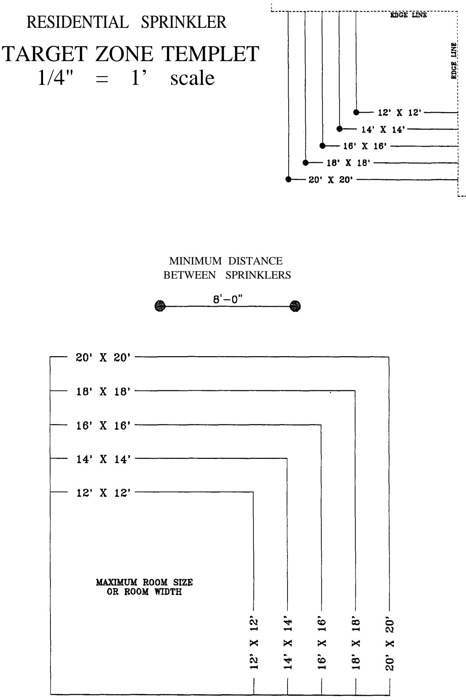

RESIDENTIAL SPRINKLERTARGET ZONE TEMPLET$\begin{array} { r l r } { 1 / 8 " } & { { } = } & { 1 } \end{array}$ scale

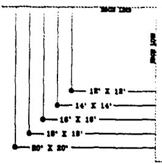

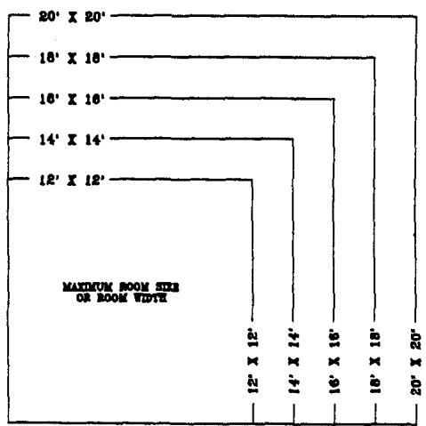

## HYDRAULIC WORKSHEET

1. ROOM WIDTH AND COVERAGE AREA

A. Room Width: f t .

B. Coverage Area: ft. x f t .

2. SPRINKLER HEAD SPECIFICATIONS

A. Single-Head Flow Rate: gpm.

B. Single-Head Pressure: psi.

C. Dual-Head Flow Rate: gpm.

3. DESIGN WATER FLOW (DWF) AND DESIGN PRESSURE

A. If all rooms have only one sprinkler head:

DWF (from 2A): g p m .

B. If more than one head in any room:

DWF (From 2C): x 2 = gpm.

Design Water Flow (A or B above):

Line 1: gpm

Design Sprinkler Pressure (From 2B):

Line 2: psi

WATER PRESSURE AT THE PUBLIC MAIN

Line 3: psi

PRESSURE LOSSES CAUSED BY DEVICES

A. Backflow Prevention Device; Check Valve

Line 4: - - - - - P s i

B. Water Meter Loss

Water Meter Size:

Pressure Loss

(Use DWF on Line 1, and Table 3)

Line 5: psi

C. Gate or Ball Valve Loss

(Use DWF and Table 3)

Line 6: psi

No. Valves Loss

## 6. PRESSURE LOSSES IN UNDERGROUND SUPPLY PIPING

Find the Pressure Losses based on the DWF on Line 1 and Tables in Appendix A.

A. Underground Section #1 Piping

$$
\frac {}{\text { Size }}, \frac {}{\text { Type }}, \frac {}{\text { Length }} \text {   ft:   Pressure   Loss   =   }
$$

Line 7A: p s i

B. Underground Section #2 Piping

$$
\overline {{\text { Sire }}} \quad , \quad \overline {{\text { Type }}} \quad , \quad \overline {{\text { Length }}} \quad \text { ft:   Pressure   Loss } =
$$

Llne 7B: p s i

## ELEVATION PRESSURE LOSS

Difference in elevation between water main tap point and highest sprinkler (if the sprinkler head is lower, the number is negative): / 2 =

Line 8: p s i

## 8. SUM OF LOSSES AND SPRINKLER PRESSURE

$$
\begin{array}{l} \overline {{\text {Line 2}}} + \overline {{\text {Line 4}}} + \overline {{\text {Line 5}}} + \overline {{\text {Line 6}}} + \\ \overline {{\text {Line 7A}}} + \overline {{\text {Line 7B}}} + \overline {{\text {Line 8}}} = \end{array}
$$

Line 9: p s i

## AVAILABLE PRESSURE FOR PIPING

Line 10: psi

## 10. SELECTION OF PIPE TYPE AND SIZE

Use the appropriate Table in Appendix B, based on the DWF, Line 1. Find the Available Pressure for Piping, Line 9, in the Table’s left-hand column. Select the piping type(s) and size(s).

INSIDE SECTION A: ft. maximum straight length Type Size

INSIDE SECTION B: ft. maximum straight length Type Size

APPENDIX D

INSIDE DIAMETER TABLE FITTING LOSS TABLE FRICTION LOSS TABLE

## INSIDE DIAMETER TABLE FOR PIPE AND TUBE (INCHES)

<table><tr><td>Nominal I.D.</td><td>CPVC Pipe*</td><td>Copper K</td><td>Copper L</td><td>Copper M</td><td>PB Tube</td><td>Steel WLS</td><td>Steel S40</td></tr><tr><td>0-3/4S</td><td>0.713</td><td>NA</td><td>NA</td><td>NA</td><td>NA</td><td>NA</td><td>NA</td></tr><tr><td>0-3/4</td><td>0.884</td><td>0.745</td><td>0.785</td><td>0.811</td><td>0.715</td><td>NA</td><td>NA</td></tr><tr><td>1-0/0</td><td>1.109</td><td>0.995</td><td>1.025</td><td>1.055</td><td>0.921</td><td>1.087</td><td>1.049</td></tr><tr><td>1-1/4</td><td>1.400</td><td>1.245</td><td>1.265</td><td>1.291</td><td>1.125</td><td>1.426</td><td>1.380</td></tr><tr><td>1-1/2</td><td>1.602</td><td>1.481</td><td>1.505</td><td>1.527</td><td>1.329</td><td>1.650</td><td>1.610</td></tr><tr><td>2-0/0</td><td>2.003</td><td>1.959</td><td>1.985</td><td>2.009</td><td>1.739</td><td>2.125</td><td>2.067</td></tr><tr><td></td><td colspan="5">C = 150</td><td colspan="2">C = 120</td></tr><tr><td colspan="8">NA - not applicable*I.D.s based on document G-82A published by B.F. Goodrich.</td></tr></table>

## Hazen-Williams formula (psi/ft):

where f.l. = friction loss

$$
\mathrm{f}. 1. = \frac {4 . 5 2 * Q ^ {1 . 8 5}}{\mathrm{C} ^ {1 . 8 5} * \mathrm{d} ^ {4 . 8 7}}
$$

Q = flow rate

C = roughness factor

d = inside pipe diameter

FRICTION LOSS IN FITTINGS (equivalent feet of pipe)

<table><tr><td></td><td>Nominal Size</td><td>ell-90</td><td>T-branch</td><td>T-run</td><td>ell-45</td></tr><tr><td rowspan="5">Copper</td><td>0 3/4&quot;</td><td>3.0</td><td>4.5</td><td>1.5</td><td>1.5</td></tr><tr><td>1 0/0&quot;</td><td>3.0</td><td>7.5</td><td>3.0</td><td>1.5</td></tr><tr><td>1 1/4&quot;</td><td>4.5</td><td>9.0</td><td>3.0</td><td>1.5</td></tr><tr><td>1 1/2&quot;</td><td>6.0</td><td>12.0</td><td>4.5</td><td>3.0</td></tr><tr><td>2 0/0&quot;</td><td>7.0</td><td>15.0</td><td>4.5</td><td>3.0</td></tr><tr><td rowspan="6">CPVC Pipe*</td><td>0 3/4&quot; S</td><td>2.0</td><td>4.0</td><td>1.0</td><td>1.0</td></tr><tr><td>0 3/4&quot;</td><td>2.0</td><td>4.0</td><td>1.0</td><td>1.0</td></tr><tr><td>1 0/0&quot;</td><td>2.5</td><td>5.0</td><td>1.5</td><td>1.5</td></tr><tr><td>1 1/4&quot;</td><td>3.0</td><td>6.0</td><td>2.0</td><td>2.0</td></tr><tr><td>1 1/2&quot;</td><td>4.0</td><td>8.0</td><td>2.0</td><td>2.0</td></tr><tr><td>2 0/0&quot;</td><td>5.0</td><td>10.0</td><td>3.0</td><td>2.0</td></tr><tr><td rowspan="5">PB Tube</td><td>0 3/4&quot;</td><td>3.0</td><td>4.0</td><td>1.0</td><td>1.0</td></tr><tr><td>1 0/0&quot;</td><td>3.0</td><td>5.0</td><td>1.0</td><td>1.0</td></tr><tr><td>1 1/4&quot;</td><td>4.0</td><td>7.0</td><td>1.0</td><td>2.0</td></tr><tr><td>1 1/2&quot;</td><td>5.0</td><td>8.0</td><td>2.0</td><td>2.0</td></tr><tr><td>2 0/0&quot;</td><td>6.0</td><td>10.0</td><td>2.0</td><td>2.0</td></tr><tr><td rowspan="4">Steel S40</td><td>1 0/0&quot;</td><td>3.0</td><td>5.0</td><td>2.0</td><td>1.0</td></tr><tr><td>1 1/4&quot;</td><td>3.0</td><td>6.0</td><td>2.0</td><td>2.0</td></tr><tr><td>1 1/2&quot;</td><td>4.0</td><td>8.0</td><td>3.0</td><td>2.0</td></tr><tr><td>2 0/0&quot;</td><td>5.0</td><td>10.0</td><td>3.0</td><td>3.0</td></tr><tr><td rowspan="4">Steel THW</td><td>1 0/0&quot;</td><td>3.0</td><td>5.0</td><td>2.0</td><td>1.0</td></tr><tr><td>1 1/4&quot;</td><td>3.0</td><td>6.0</td><td>2.0</td><td>2.0</td></tr><tr><td>1 1/2&quot;</td><td>4.0</td><td>8.0</td><td>3.0</td><td>2.0</td></tr><tr><td>2 0/0&quot;</td><td>5.0</td><td>10.0</td><td>3.0</td><td>2.0</td></tr><tr><td colspan="6">*Based on data published by Central Sprinkler, 3/4-S estimate.</td></tr></table>

FRlCTlON LOSS FACTOR TABLE (psi/ft)

<table><tr><td rowspan="2">NOMINAL SIZE</td><td colspan="12">FLOW RATE (GPM)</td></tr><tr><td>10</td><td>12</td><td>14</td><td>16</td><td>18</td><td>20</td><td>22</td><td>24</td><td>26</td><td>28</td><td>30</td><td>32</td></tr><tr><td>3/4&quot; CU (M)</td><td>0.08</td><td>0.12</td><td>0.16</td><td>0.20</td><td>0.25</td><td>0.30</td><td>0.36</td><td>0.42</td><td>0.49</td><td>0.56</td><td>0.64</td><td>0.72</td></tr><tr><td>1&quot; CU (M)</td><td>0.02</td><td>0.03</td><td>0.04</td><td>0.06</td><td>0.07</td><td>0.08</td><td>0.10</td><td>0.12</td><td>0.14</td><td>0.16</td><td>0.18</td><td>0.20</td></tr><tr><td>1 1/4&quot; CU (M)</td><td>0.01</td><td>0.01</td><td>0.02</td><td>0.02</td><td>0.03</td><td>0.03</td><td>0.04</td><td>0.04</td><td>0.05</td><td>0.06</td><td>0.07</td><td>0.07</td></tr><tr><td>1 1/2&quot; CU (M)</td><td>0.00</td><td>0.01</td><td>0.01</td><td>0.01</td><td>0.01</td><td>0.01</td><td>0.02</td><td>0.02</td><td>0.02</td><td>0.03</td><td>0.03</td><td>0.03</td></tr><tr><td>2&quot; CU (M)</td><td>0.00</td><td>0.00</td><td>0.00</td><td>0.00</td><td>0.00</td><td>0.00</td><td>0.00</td><td>0.01</td><td>0.01</td><td>0.01</td><td>0.01</td><td>0.01</td></tr><tr><td>3/4&quot; CPVC</td><td>0.05</td><td>0.08</td><td>0.10</td><td>0.13</td><td>0.16</td><td>0.20</td><td>0.24</td><td>0.28</td><td>0.32</td><td>0.37</td><td>0.42</td><td>0.47</td></tr><tr><td>1&quot; CPVC</td><td>0.02</td><td>0.03</td><td>0.03</td><td>0.04</td><td>0.05</td><td>0.07</td><td>0.08</td><td>0.09</td><td>0.11</td><td>0.12</td><td>0.14</td><td>0.16</td></tr><tr><td>1 1/4&quot; CPVC</td><td>0.01</td><td>0.01</td><td>0.01</td><td>0.01</td><td>0.02</td><td>0.02</td><td>0.03</td><td>0.03</td><td>0.03</td><td>0.04</td><td>0.04</td><td>0.05</td></tr><tr><td>1 1/2&quot; CPVC</td><td>0.00</td><td>0.00</td><td>0.01</td><td>0.01</td><td>0.01</td><td>0.01</td><td>0.01</td><td>0.02</td><td>0.02</td><td>0.02</td><td>0.02</td><td>0.03</td></tr><tr><td>2&quot; CPVC</td><td>0.00</td><td>0.00</td><td>0.00</td><td>0.00</td><td>0.00</td><td>0.00</td><td>0.00</td><td>0.01</td><td>0.01</td><td>0.01</td><td>0.01</td><td>0.01</td></tr><tr><td>3/4&quot; PB</td><td>0.15</td><td>0.22</td><td>0.29</td><td>0.37</td><td>0.46</td><td>0.56</td><td>0.66</td><td>0.78</td><td>0.90</td><td>1.04</td><td>1.18</td><td>1.33</td></tr><tr><td>1&quot; PB</td><td>0.05</td><td>0.06</td><td>0.08</td><td>0.11</td><td>0.13</td><td>0.16</td><td>0.19</td><td>0.23</td><td>0.26</td><td>0.30</td><td>0.34</td><td>0.39</td></tr><tr><td>1 1/4&quot; PB</td><td>0.02</td><td>0.02</td><td>0.03</td><td>0.04</td><td>0.05</td><td>0.06</td><td>0.07</td><td>0.09</td><td>0.10</td><td>0.11</td><td>0.13</td><td>0.15</td></tr><tr><td>1 1/2&quot; PB</td><td>0.01</td><td>0.00</td><td>0.01</td><td>0.01</td><td>0.01</td><td>0.01</td><td>0.01</td><td>0.02</td><td>0.02</td><td>0.02</td><td>0.02</td><td>0.03</td></tr><tr><td>2&quot; PB</td><td>0.00</td><td>0.00</td><td>0.00</td><td>0.00</td><td>0.00</td><td>0.00</td><td>0.00</td><td>0.01</td><td>0.01</td><td>0.01</td><td>0.01</td><td>0.01</td></tr></table>