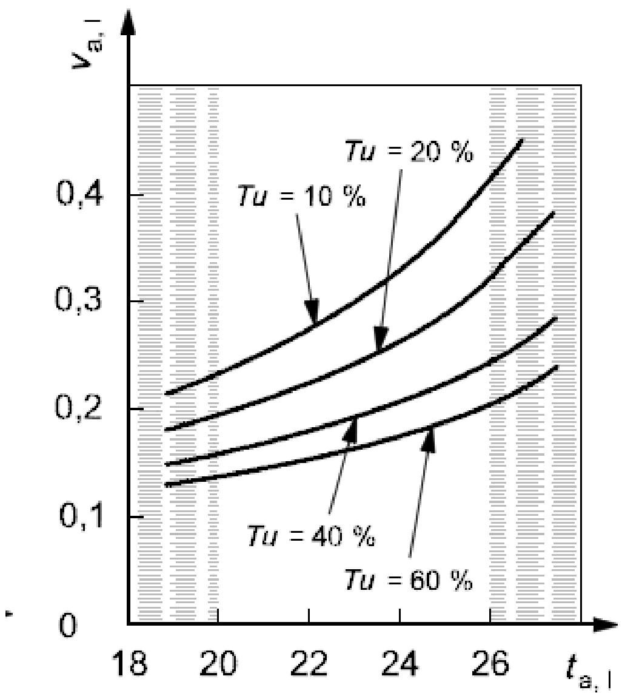
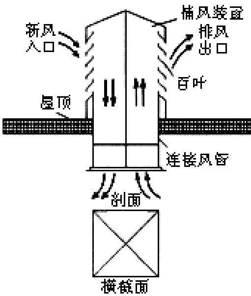
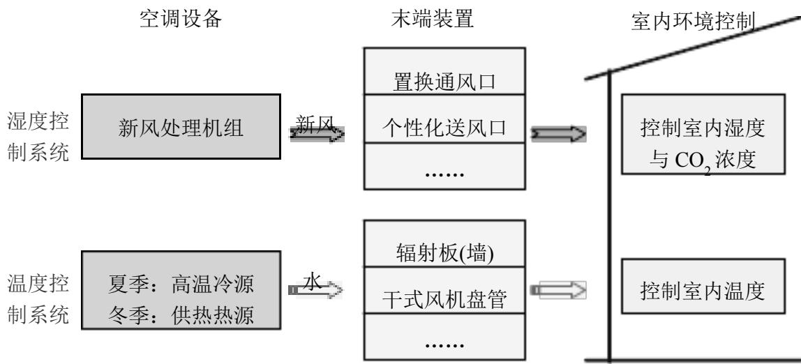
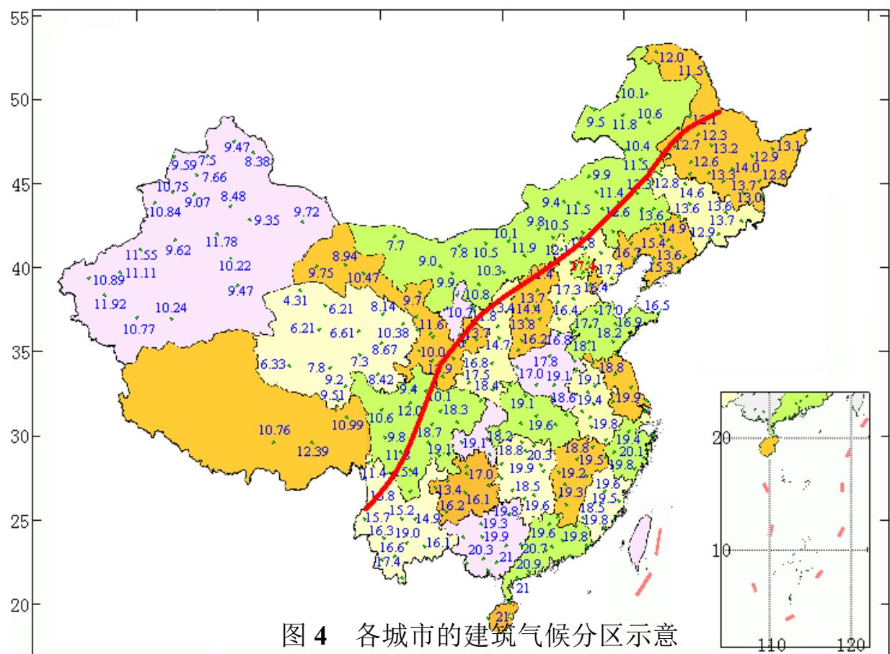
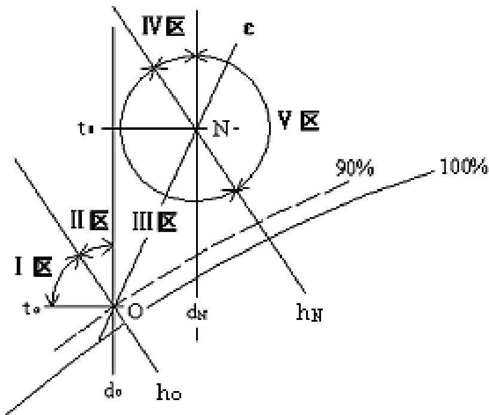
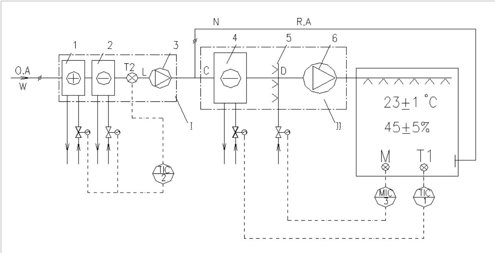
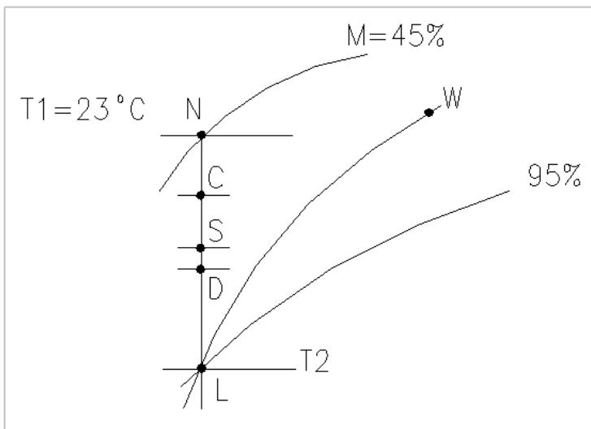
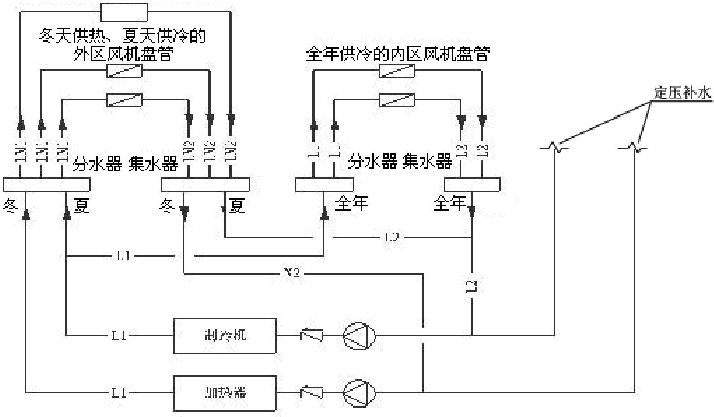
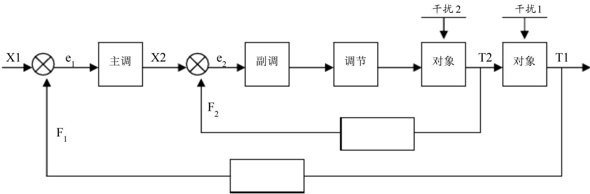

# 目 录

1 总 则....1
2 术语....3
3 室内空气计算参数....5
4 室外设计计算参数....11
4.1 室外空气计算参数....11
4.2 夏季太阳辐射照度....15
5 供 暖....17
5.1 一般规定....17
5.2 热负荷....20
5.3 散热器供暖....23
5.4 热水辐射供暖....26
5.5 电加热供暖....30
5.6 燃气红外线辐射供暖....33
5.7 户式燃气炉供暖....35
5.8 热空气幕....35
5.9 供暖管道设计及水力计算....35
5.10 热水集中供暖分户热计量与室温调控....40
6 通 风....44
6.1 一般规定....44
6.2 自然通风....47
6.3 机械通风....50
6.4 复合通风....59
6.5 设备选择与布置....61
6.6 风管设计....65
7 空气调节....69
7.1 一般规定....69
7.2 空调负荷计算....73
7.3 空气调节系统....78
7.4 气流组织....90
7.5 空气处理....98
8 空气调节冷热源....107
8.1 一般规定....107
8.2 电动压缩式机组....111
8.3 热泵....114
8.4 溴化锂吸收式机组....119
8.5 空调冷热水及冷凝水系统....121
8.6 冷却水系统....132
8.7 蓄冷、蓄热....137

8.8 区域供冷....140
8.9 燃气冷热电三联供....142
8.10 制冷机房....143
8.11 锅炉房、热力站....145

9 监测与控制....150
9.1 一般规定....150
9.2 传感器和执行器....153
9.3 供暖系统的监测与控制....155
9.4 通风系统的监测与控制....156
9.5 空气调节系统的监测与控制....156
9.6 空气调节冷热源和水系统的监测与控制....160

10 消声与隔振....163
10.1 一般规定....163
10.2 消声与隔声....164
10.3 隔振....166

11 绝热与防腐....169
11.1 绝热设计....169
11.2 防腐设计....170

附录 A 室外空气计算参数
附录 B 室外空气计算参数简化方法
附录 C 夏季太阳总辐射照度
附录 D 夏季透过标准窗玻璃的太阳辐射温度
附录 E 夏季空气调节大气透明度分布图
附录 F 加热由门窗缝隙渗入室内的冷空气的耗热量
附录 G 渗透冷空气量的朝向修正系数 n 值
附录 H 空调负荷简化方法计算系数表
附录 J 蓄冰装置容量与双工况制冷机的空气调节标准制冷量
附录 K 设备与管道最小保温、保冷厚度及凝结水管防凝露厚度

**1 总 则**

1.0.1 为了在供暖、通风与空气调节设计中贯彻执行国家技术经济政策，采用先进技术，合理利用资源和节约能源，保护环境，保证健康舒适的工作和生活环境，制定本规范。【条文说明】1.0.1 规范宗旨。

供暖、通风与空调工程是基本建设领域中一个不可缺少的组成部分，它对合理利用资源、节约能源、保护环境、保证工作条件、提高生活质量，都有着十分重要的作用。暖通空调系统在建筑物运行过程中持续消耗能源，如何通过合理选择系统与优化设计使其能耗降低，对实现我国建筑节能目标和推动绿色建筑发展作用巨大。

1.0.2 本规范适用于新建、扩建和改建的民用建筑的供暖、通风与空气调节设计。工业建筑可参照执行。

本规范不适用于有特殊用途、特殊净化与防护要求的建筑物以及临时性建筑物的设计。

【条文说明】1.0.2 规范适用范围。

本规范适用于各种类型的民用建筑，其中包括居住建筑，办公建筑、科教建筑、医疗卫生建筑、交通邮电建筑、文娱集会建筑和其他公共建筑等。对于新建、改建和扩建的民用建筑，其供暖、通风与空调设计，均应符合本规范各相关规定。

在工业建筑的暖通空调系统设计中，建筑的室外计算气象参数、室内设计参数、太阳辐射照度、冷热负荷计算、管道及风管计算、冷热源选择、空调系统设计、监测与控制、消声与隔振、保温与防腐等相关内容，工业建筑可参照执行本规范相关规定。

本规范不适用于有特殊用途、特殊净化与防护要求的建筑物、洁净厂房以及临时性建筑物的设计，是针对设计标准、装备水平以及某些特殊要求、特殊作法或特殊防护而言的，并不意味着本规范的全部内容都不适用于这些建筑物的设计，一些通用性的条文，应参照执行。有特殊要求的设计，应执行国家相关的设计规范。

1.0.3 供暖、通风与空气调节设计应优先采用新技术、新工艺、新设备、新材料，对有可能造成人体伤害的设备及管道，必须采取安全防护措施。

【条文说明】1.0.3 规范技术、工艺、设备、材料的选择要求。

规范从节能、环保、安全、卫生等方面结合了近十年来国内外出现的新技术、新设备、新材料与设计、科研新成果，对有关设计标准、技术要求、设计方法以及其他政策性较强的技术问题等都作了具体的规定。

1.0.4 在供暖、通风与空气调节系统设计中，应预留设备、管道及配件所必须的安装、操作和维修的空间，或在建筑设计中预留安装和维修用的孔洞。对于大型设备及管道应设置运输通道和起吊设施。

1.0.5 位于地震区或湿陷性黄土地区的工程，在供暖、通风与空气调节设计中，应根据需要，按照现行国家标准规范的规定分别采取防震和有效的预防措施。

【条文说明】1.0.5 地震区或湿陷性黄土地区设备和管道布置要求。

为了防止和减缓位于地震区或湿陷性黄土地区的建筑物由于地震或土壤下沉而造成的破坏和损失，除应在建筑结构等方面采取相应的预防措施外，布置供暖、通风和空调系统的设备和管道时，还应根据不同情况按照国家现行规范的规定分别采取防震或其他有效的防护

措施。

1.0.6 供暖、通风与空气调节设计应考虑施工及验收的要求。当设计对施工及验收有特殊要求时，应在设计文件中加以说明。

【条文说明】1.0.6 同施工验收规范衔接。

为保证设计和施工质量，要求供暖通风与空调设计的施工图内容应与国家现行的《建筑给水排水及供暖工程施工质量验收规范》（GB 50242）、《通风与空调工程施工质量验收规范》（GB 50234）等保持一致。有特殊要求及现行施工质量验收规范中没有涉及的内容，在施工图文件中必须有详尽说明，以利施工、监理工作的顺利进行。

1.0.7 供暖、通风与空气调节设计，除执行本规范的规定外，尚应符合国家现行的有关标准、规范的规定。

【条文说明】1.0.7 同其他标准规范衔接。

本规范为专业性的全国通用规范。根据国家主管部门有关编制和修订工程建设标准规范的统一规定，为了精简规范内容，凡引用或参照其他全国通用的设计标准规范的内容，除必要的以外，本规范不再另设条文。本条强调在设计中除执行本规范外，还应执行与设计内容相关的安全、环保、节能、卫生等方面的国家现行的有关标准、规范等的规定。具体规范名称不一一列出。

**2 术 语**

**2.0.1 预计平均热感觉指数（PMV） predicted mean vote**

PMV 指数是根据人体热平衡的基本方程式以及心理生理学主观热感觉的等级为出发点，考虑了人体热舒适感的诸多有关因素的全面评价指标。PMV指数表明群体对于（+3\~-3）七个等级热感觉投票的平均指数。

**2.0.2 预计不满意者的百分数（PPD） predicted percentage of dissatisfied**

PPD 指数为预计处于热环境中的群体对于热环境不满意的投票平均值。PPD 指数可预计群体中感觉过暖或过凉“根据七级热感觉投票表示热（+3），温暖（+2），凉（-2），或冷（-3）”的人的百分数。

**2.0.3 毛细管网辐射供暖 slim radiant heating**

一种新型热水辐射供暖模式，其加热管细小，加工成网状，可敷设于地面、顶棚或墙面。

**2.0.4 热量结算点 heat settlement site**

供热方和用热方之间通过热量表计量的热量值直接进行贸易结算的位置。

**2.0.5 置换通风 displacement ventilation**

借助空气热浮力作用的机械通风方式。空气以低风速、小温差的状态送入活动区下部，在送风及室内热源形成的上升气流的共同作用下，将热浊空气提升至顶部排出。

**2.0.6 复合通风系统 integrated ventilation system**

在一天的不同时刻或一年的不同季节，在满足热舒适和室内空气质量的前提下交替或联合运行自然通风和机械通风的通风系统。

**2.0.7 空气调节区 air-conditioned zone**

简称空调区。保持空气参数在给定范围之内的区域。

**2.0.8 多联分体式空调系统 variable refrigerant volume split air conditioning system**

一台室外空气源制冷或热泵机组配置多台室内机，通过改变制冷剂流量适应各房间负荷变化的直接膨胀式空调系统。

**2.0.9 蓄冷—释冷周期 period of charge and discharge**

蓄冷空调系统经一个蓄冷—释冷循环所运行的时间。

**2.0.10 空气分布特性指标（ADPI） air diffusion performance index**

舒适性空调中用来评价人的舒适性的指标，系指活动区测点总数中符合要求测点所占的百分比。

**2.0.11 热泵 heat pump**

利用逆向热力循环产生热能的装置。

**2.0.12 空气源热泵 air-source heat pump**

以空气为低位热源的热泵。通常有空气/空气热泵、空气/水热泵等形式。

**2.0.13 地源热泵系统 ground-source heat pump system**

以岩土体、地下水或地表水为低温热源，由水源热泵机组、地热能交换系统、建筑物内系统组成的供热空调系统。根据地热能交换系统形式的不同，地源热泵系统分为地埋管地源热泵系统、地下水地源热泵系统和地表水地源热泵系统。

**2.0.14 水环热泵空调系统 water-loop heat pump air conditioning system**

水/空气热泵的一种应用方式。通过水环路将众多的水/空气热泵机组并联成一个以回收建筑物余热为主要特征的空调系统。

**2.0.15 区域供冷系统 district cooling system**

在一个建筑群设置集中的制冷站制备空调冷冻水，再通过循环水管道系统，向各座建筑提供空调冷量的系统。

**2.0.16 低温送风空调系统 cold air distribution system**

送风温度低于常规数值的全空气空调系统。

**2.0.17 分区两管制水系统 zoning two-pipe water system**

按建筑物的负荷特性将空调水路分为冷水和冷热水合用的两个两管制系统。需全年供冷区域的末端设备只供应冷水，其余区域末端设备根据季节转换，供应冷水或热水。

**3 室内空气计算参数**

3.0.1 设计供暖时，民用建筑冬季室内计算温度应按下列规定采用：

1 寒冷地区和严寒地区主要房间应采用18℃\~24℃；

2 夏热冬冷地区主要房间冬宜采用16℃\~22℃；

3 辅助建筑物及辅助用室不应低于下列数值：

浴室 25℃ 更衣室 25℃ 办公室、休息室 18℃ 食堂 18℃ 盥洗室、厕所 12℃

【条文说明】3.0.1冬季室内计算温度。

考虑到不同供暖地区居民生活习惯的不同，分别对寒冷、严寒地区和夏热冬冷地区的冬季室内计算温度进行规定。当使用条件有特殊要求时，各类建筑物的室内温度可按照国家现行有关专业标准、规范执行。

1 根据国内外有关卫生部门的研究结果，当人体衣着适宜、保暖量充分且处于安静状态时，室内温度 20℃比较舒适，18℃无冷感，15℃是产生明显冷感的温度界限。本着提高生活质量，满足室温可调的要求，并按照国家现行《室内空气质量标准》（GB/T18883）要求，把民用建筑主要房间的室内温度范围定在 18\~24℃.

从实际调查数据来看，我国供暖建筑中人员都会采用自调节手段向房间加湿， 整个供暖季房间相对湿度在 15\~55%范围波动。

冬季的热舒适（-1≤PMV≤+1）温度范围为：18℃\~28.4℃。从节能原则出发，满足舒适的条件下尽量考虑节能，因此选择偏冷（-1≤PMV≤0）的环境，对应 PMV=0 时的温度上限为 24℃，所以冬季供暖设计温度范围为18℃\~24℃。从设计单位实际调查结果来看，大部分建筑供暖设计温度选择为18℃\~20℃。

2 考虑到夏热冬冷地区实际情况和当地居民生活习惯，其室内计算温度低于寒冷和严寒地区。

第一，夏热冬冷地区考虑供暖的房间相比不供暖的房间温度提高幅度比较大，室内热环境有了很大改善；第二，与寒冷地区和严寒地区相比，本地区相对湿度较高；第三，由于本地区不是所有建筑物都供暖，因此，在供暖以后，当地居民还是习惯在室内穿着棉衣，服装热阻相比严寒和寒冷地区较大。因此，综合考虑本地区的实际情况以及居民生活习惯，通过计算与 PMV 对应的舒适度，得出夏热冬冷地区主要房间冬季室内计算温度宜采用16℃\~22℃。

3.0.2 设置供暖的民用建筑，冬季室内活动区的平均风速不宜大于0.3m/s。

【条文说明】3.0.2供暖建筑物冬季室内风速。

本条对冬季室内最大允许风速的规定，主要是针对设置热风供暖的建筑而言的，目的是为了防止人体产生直接吹风感，影响舒适性。

3.0.3 民用建筑空气调节室内计算参数应按以下规定采用：

1 民用建筑长期逗留区域空气调节室内计算参数，应符合表3.0.3 的规定：

表 3.0.3 长期逗留区域空气调节室内计算参数

<table><tr><td>参数</td><td>热舒适度等级</td><td>温度(°C)</td><td>相对湿度(%)</td><td>风速(m/s)</td></tr><tr><td rowspan="2">冬季</td><td>I级</td><td>22~24</td><td>30~60</td><td>≤0.2</td></tr><tr><td>II级</td><td>18~21</td><td>≤60</td><td>≤0.2</td></tr><tr><td rowspan="2">夏季</td><td>I级</td><td>24~26</td><td rowspan="2">40~70</td><td rowspan="2">≤0.25</td></tr><tr><td>II级</td><td>27~28</td></tr></table>

2 民用建筑短期逗留区域空气调节室内计算参数，可在长期逗留区域参数基础上适当放低要求。夏季空调室内计算温度宜在长期逗留区域基础上提高 2℃，冬季空调室内计算温度宜在长期逗留区域基础上降低 2℃。

【条文说明】3.0.3民用建筑空气调节室内计算参数。

考虑到民用建筑中存在人员长期逗留区域和短期逗留区域，因此分别给出相应的室内计算参数。

1 考虑不同功能房间对室内热舒适的要求不同，分级给出室内计算参数。热舒适度等级由业主在确定建筑方案时选择。热舒适等级划分详见本规范第3.0.5条。

将热舒适划分为两个等级（Ⅰ级和Ⅱ级），其中Ⅰ级热舒适水平较高，Ⅱ级较低；等级划分的依据为 PMV 指标，Ⅰ级对应的 PMV 范围为-0.5≤PMV≤+0.5，Ⅱ级对应的 PMV 为-1≤PMV<-0.5 和 0.5<PMV≤1。

其中考虑到建筑节能的限制，要求冬季室内环境在满足舒适的条件下偏冷，夏季在满足舒适的条件下偏热，所以具体建筑等级划分如下：

表 1 不同热舒适度等级所对应的 PMV 值

<table><tr><td>热舒适度等级</td><td>冬季</td><td>夏季</td></tr><tr><td>I级</td><td>-0.5≤PMV≤0</td><td>0≤PMV≤0.5</td></tr><tr><td>II级</td><td>-1≤PMV&lt;-0.5</td><td>0.5&lt;PMV≤1</td></tr></table>

根据我国在 2000 年制定了 GB/T18049-200（中等热环境中 PMV 和 PPD 指数的测定及热舒适条件的规定），相对湿度应该设定在30%\~70%之间。根据国外专家的实验，在冬季当相对湿度超过 60%时，会引起人体的热不舒适。另外从节能的角度考虑，在冬季室内设计相对湿度越大，能耗越高，在冬季，相对湿度每提高 10%，能耗约增加 6%，因此不宜采用较高的相对湿度。另外，实际调研结果显示，冬季空调建筑的室内设计湿度几乎都低于 60%，还有部分建筑不考虑冬季湿度。因此，规定冬季空调室内设计湿度不宜大于 60%。在此基础上，由于Ⅰ级对舒适要求较高，综合考虑温湿度的关系，取相对湿度的范围为30%\~60%。因此，对于Ⅰ级建筑，当室内相对湿度在 30%\~60%之间，PMV值在-0.5\~0之间时，经过热舒适区的计算，所得舒适温度的范围为 22\~24℃，同理对于Ⅱ级，经过热舒适区的计算，所得舒适温度的范围为 18\~21℃。

对于空调夏季情况，相对湿度在 30%\~70%之间时，对应的满足热舒适的温度范围是22℃\~28℃。本着节能的原则，夏季应在满足舒适条件的前提下选择偏热的环境。由此确定夏季室内设计参数为：温度 24℃\~28℃，相对湿度 40%\~70%。在此基础之上，对于Ⅰ级，当室内相对湿度在 40%\~70%之间，PMV值在 0\~0.5 之间时，经过热舒适区的计算，所得舒适温度的范围为 24\~26℃，同理对于Ⅱ级，经过热舒适区的计算，所得舒适温度的范围为

27\~28℃。

对于风速，参照国际通用标准 ISO7730 和 ASHRAE55，并结合我国的实际国情和一般生活水平，取室内由于吹风感而造成的不满意度 DR 为不大于 20%，根据相关文献的研究结果，在 DR≤20%时，空气温度、平均风速和空气紊流度之间的关系如图所示：

  
图 1 空气温度、平均风速和空气紊流度关系图

根据实际情况，夏季室内紊流度较高，取为 40%，空气温度取平均值 26℃，得到夏季室内允许最大风速约为0.25m/s；冬季一般室内空气紊流度较小，取为20%，空气温度取18℃，得到冬季室内允许最大风速约为0.2m/s。

2 短期逗留区域指人员暂时逗留的区域，主要有商场、车站、营业厅、展厅、门厅、书店等观览场所和商业设施。

对于短期逗留区域，人员停留时间较短，服装热阻不同于长期逗留区域，对热满意程度更多来源于动态环境的变化，综合考虑建筑节能的需要，可在长期逗留区域基础上降低要求。3.0.4 工艺性空调室内温湿度基数及其允许波动范围，应根据工艺需要及卫生要求确定。活动区的风速：冬季不宜大于 0.3m/s，夏季宜采用 0.2\~0.5m/s；当室内温度高于 30℃，可大于0.5m/s。

【条文说明】3.0.4工艺性空调室内参数。

对于设置工艺性空调的民用建筑，其室内参数应根据工艺要求，并考虑必要的卫生条件确定。在可能的条件下，应尽量提高夏季室内温度基数，以节省建设投资和运行费用。另外，室温基数过低（如 20℃），由于夏季室内外温差太大，工作人员普遍感到不舒适，室温基数提高一些，对改善室内工作人员的卫生条件也是有好处的。

3.0.5 供暖与空气调节室内的热舒适性应按照《中等热环境PMV和 PPD指数的测定及热舒适条件的规定》（GB/T18049），采用预计的平均热感觉指数（PMV）和预计不满意者的百分数（PPD）评价，热舒适度等级划分按表 3.0.5 采用。

表 3.0.5 不同热舒适度等级对应的 PMV、PPD 值

<table><tr><td>热舒适度等级</td><td>PMV PPD</td><td></td></tr><tr><td>I级</td><td>-0.5≤PMV≤0.5</td><td>≤10%</td></tr><tr><td>II级</td><td>-1≤PMV&lt;-0.5, 0.5≤27%</td><td>≤27%</td></tr></table>

【条文说明】3.0.5 空气调节室内热舒适性评价指标参数。

《中等热环境 PMV 和 PPD 指数的测定及热舒适条件的规定》（GB/T18049）等同于国际标准 ISO7730，本规范结合我国国情对舒适等级进行了划分。采用 PMV、PPD 评价室内热舒适，即与国家现行标准一致，又与国际接轨。在不降低室内热舒适标准的前提下，通过合理选择室内空气设计参数，可以收到明显节能效果。

**3.0.6 民用建筑室内人员所需最小新风量应符合以下规定：**

1 公共建筑主要房间每人所需最小新风量应符合表3.0.6 规定。

表 3.0.6 民用建筑主要房间每人所需最小新风量/（m3/（h·人））

<table><tr><td>建筑类型</td><td>新风量</td></tr><tr><td>办公室</td><td>30</td></tr><tr><td>客房</td><td>30</td></tr><tr><td>多功能厅</td><td>20</td></tr><tr><td>大堂</td><td>10</td></tr><tr><td>四季厅</td><td>10</td></tr><tr><td>游艺厅</td><td>30</td></tr><tr><td>美容室</td><td>45</td></tr><tr><td>理发室</td><td>20</td></tr><tr><td>宴会厅</td><td>20</td></tr><tr><td>餐厅</td><td>20</td></tr><tr><td>咖啡厅</td><td>10</td></tr></table>

2 设置新风系统的居住建筑和医院建筑，其设计最小新风量宜按照换气次数法确定。  
3 高密人群建筑设计最小新风量宜按照不同人员密度下的每人所需最小新风量确定。【条文说明】3.0.6公共建筑主要房间每人所需最小新风量。

表 3.0.6 给出所推荐的不同类型民用建筑主要房间的每人所需最小新风量，主要参考对象包括《公共场所卫生标准》（GB9663\~GB9673）、《公共建筑节能设计标准》（GB50189）、《饭馆（餐厅）卫生标准》（GB16153-1996）等。表 3.0.6 中未做出规定的其他民用建筑人员所需最小新风量，可按照国家现行卫生标准中的容许浓度进行计算确定，并且设计时应满足国家现行专项标准的特殊要求。

2 由于居住建筑和医院建筑的建筑污染部分比重一般要高于人员污染部分，按照现有人员新风量指标所确定的新风量没有考虑建筑污染部分，从而不能保证始终完全满足室内卫生要求；因此，对于这两类建筑应将建筑的污染构成按建筑污染与人员污染同时考虑，并以换气次数的形式给出所需最小新风量。其中，居住建筑的换气次数参照 ASHRAE

Standard62.1-2007 确 定 ， 医 院 建筑 的 换 气次 数 按 照日 本 医 院设 计 和 管理 指 南（HEAS-02-2004）确定，结果见表 2。

表 2 住宅和医院建筑最小新风量（h-1）

<table><tr><td>建筑类型</td><td></td><td>换气次数</td></tr><tr><td rowspan="4">居住建筑</td><td>人均居住面积≤10m2</td><td>0.70</td></tr><tr><td>10m2&lt;人均居住面积≤20m2</td><td>0.60</td></tr><tr><td>20m2&lt;人均居住面积≤50m2</td><td>0.50</td></tr><tr><td>人均居住面&lt;积&gt;50 m2</td><td>0.45</td></tr><tr><td rowspan="3">医院建筑</td><td>门诊室</td><td>2</td></tr><tr><td>病房</td><td>2</td></tr><tr><td>手术室</td><td>5</td></tr></table>

3 按照目前我国现有新风量指标，计算得到的高密人群建筑新风量所形成的新风负荷在空调负荷中的比重一般高达20\~40%，对于人员密度超高建筑，新风能耗有时会高到人们难以接受的程度；另一方面，高密人群建筑的人流量变化幅度大，且受季节、气候和节假日等因素影响明显。因此，该类建筑应该考虑不同人员密度条件下对新风量指标的具体要求；并且，应重视室内人员的适应性和控制一定比例的不满意率等因素对新风量指标的影响。鉴于此，为了反映以上因素对新风量指标的具体要求，该类建筑新风量大小宜参考 ASHRAEStandard62.1-2007的规定设计法思想，对不同人员密度下的每人所需最小新风量做出规定，结果见表3。

表 3不同人员密度下的每人所需最小新风量/（m3/（h·人））

<table><tr><td rowspan="2">建筑对象</td><td colspan="3">人员密度 PF(人/ $m^2$ )</td></tr><tr><td>PF≤0.4</td><td>0.4&lt; PF≤1.0</td><td>PF&gt;1.0</td></tr><tr><td>影剧院</td><td>13</td><td>10</td><td>9</td></tr><tr><td>音乐厅</td><td>13</td><td>10</td><td>9</td></tr><tr><td>商场</td><td>17</td><td>15</td><td>14</td></tr><tr><td>超市</td><td>17</td><td>15</td><td>14</td></tr><tr><td>歌厅</td><td>22</td><td>19</td><td>18</td></tr><tr><td>游艺厅</td><td>26</td><td>18</td><td>16</td></tr><tr><td>酒吧</td><td>25</td><td>17</td><td>15</td></tr><tr><td>多功能厅</td><td>13</td><td>10</td><td>9</td></tr><tr><td>宴会厅</td><td>25</td><td>18</td><td>15</td></tr><tr><td>餐厅</td><td>25</td><td>18</td><td>15</td></tr><tr><td>咖啡厅</td><td>13</td><td>10</td><td>9</td></tr><tr><td>体育馆</td><td>17</td><td>15</td><td>14</td></tr><tr><td>健身房</td><td>40</td><td>37</td><td>36</td></tr><tr><td>保龄球房</td><td>26</td><td>20</td><td>19</td></tr><tr><td>图书馆</td><td>17</td><td>11</td><td>10</td></tr><tr><td>教室</td><td>26</td><td>20</td><td>19</td></tr><tr><td>博物馆</td><td>17</td><td>15</td><td>14</td></tr><tr><td>展览厅</td><td>17</td><td>15</td><td>14</td></tr><tr><td>大会厅</td><td>13</td><td>10</td><td>9</td></tr><tr><td>交通工具等候室</td><td>17</td><td>15</td><td>14</td></tr></table>

**4 室外设计计算参数**

**4.1 室外空气计算参数**

4.1.1 室外空气设计计算气象参数应按附录A采用。对于附录A 未列入的城市，应按本节的规定进行计算确定。对于冬夏两季各种室外计算温度，也可按本规定附录 B 所列的简化方法确定。

【条文说明】4.1.1 室外空气设计计算气象参数。

室外空气计算参数是负荷计算的重要基础数据，本规范以全国地级单位划分为基础，结合国家气象局气象观测台站的设置，基本保证每地级单位1个台站，直辖市 3个台站，共计选取 347个台站制作了室外空气计算参数表，见附录A。

近年来受温室效应的影响，全球气候变化较大，室外空气计算参数随环境温度的变化也发生了改变。本规范选取1970年 1月 1日至 2000年 12月 31日 30年的 6小时定时观测数据为基础进行计算，总体来说，夏季计算参数变化不大，冬季北方供暖城市计算参数有上升现象。

我国使用的室外空气计算参数确定方法与国外不同，一般是按平均或累年不保证日(时)数确定，而美国、日本及英国等国家一般采用不保证率的方法，且数据并不唯一，选择空间较大。经过专题研究，虽然国外的方法更灵活，能够针对目标建筑做出不同的选择，但我国的观测设备条件有限，目前还不能够提供所有主要城市 30年的逐时原始数据，用一日四次的 6小时定时数据计算不保证率的结果与逐时数据的结果是有偏差的；而且从我国第一本暖通规范《工业企业采暖通风和空气调节设计规范》（TJ19-75）出版以来一直沿用此种方法，广大的设计工作者已经习惯于这种传统的格式，综合考虑各种因素，本规范只更新数据，不改变方法。

4.1.2 供暖室外计算温度应采用历年平均不保证5 天的日平均温度。

【条文说明】4.1.2供暖室外计算温度。

供暖室外计算温度的是以日平均温度为统计基础，按照历年室外实际出现的较低的日平均温度低于室外计算温度的时间，平均每年不低于五天的原则确定的。经过几十年的实践证明，在采取连续供暖或间歇时间不长的运行制度时，这样的供暖室外计算温度一般不会影响民用建筑的供暖效果。

本条及本章其他条文中的所谓“不保证”，是针对室外温度状况而言的。“历年”即为每年，“历年平均”，是指累年不保证总数的历年平均值。

4.1.3 冬季通风室外计算温度应采用累年最冷月平均温度。

【条文说明】4.1.3冬季通风室外计算温度。

本条及本规范其他有关条文中的“累年最冷月”，系指累年逐月平均气温最低的月份。累年值是指历年气象观测要素的平均值或极值。累年逐月平均气温具体到本规范中是指1～12月各个月份30年的累年月平均气温。累年逐月平均气温最低的月份是从 12个累年月平均气温中选取一个最小值，其对应的月份即为累年逐月平均气温最低的月份。一般情况下累年最冷月为了一月，但在少数地区也会存在十二月或二月的情况。

本条的计算温度适用于机械送风系统补偿消除余热、余湿等全面排风的耗热量时使用；

对于选择机械送风系统的空气加热器时，室外计算参数宜采用供暖室外计算温度。

4.1.4 冬季空气调节室外计算温度应采用历年平均不保证1 天的日平均温度。

【条文说明】4.1.4冬季空气调节室外计算温度。

将冬季的室外空气计算温度分为供暖和空调两种温度是我国与国际上相比比较特殊的一种情况。在美国及日本等一些国家，冬季的设计计算温度并不区分供暖或空调，只是给出不同的保证率形式供设计师在不同使用功能的建筑时选用。

空调房间的温湿度要求要高于供暖房间，因此不保证的时间也应小于供暖温度所对应的时间。我国的冬季空气调节室外计算温度是以日平均温度为基础进行统计计算的，而国际上不保证率方法计算的基础是逐时平均温度，用二者进行比较，严格从意义上来说是不对等的。如果仅从数值上看，我国冬季空调室外计算温度的保证率还是比较高的，同美国等国家常用的标准在同一水平上。

4.1.5 冬季空气调节室外计算相对湿度应采用累年最冷月平均相对湿度。

【条文说明】4.1.5冬季空气调节室外计算相对湿度。

累年最冷月平均相对湿度是指累年逐月平均气温最低月份的累年月平均相对湿度。

4.1.6 夏季空气调节室外计算干球温度，应采用历年平均不保证50h的干球温度。

【条文说明】4.1.6夏季空气调节室外计算干球温度。

目前我国大部分的气象台站采集温度仍然采用的是每日四次的定时观测方法，部分发达城市已采用自动站记录数据，但是覆盖范围并不广泛，记录历史也不够统计标准的30年。因此本规范中所指的不保证 50小时，是以每天四次（2、8、14、20时）的定时温度记录为基础，以每次记录代表 6小时进行统计。

4.1.7 夏季空气调节室外计算湿球温度应采用历年平均不保证50h 的湿球温度。

【条文说明】4.1.7夏季空气调节室外计算湿球温度。

与 4.1.6相同，湿球温度也是选取每日四次的定时观测湿球温度，以每次记录代表 6小时进行统计。

4.1.8 夏季通风室外计算温度应采用历年最热月14 时的月平均温度的平均值。

【条文说明】4.1.8夏季通风室外计算温度。

我国气象台站在观测时统一采用北京时间进行记录，14时是一日四次定时记录中气温最高的一次。对于我国大部分地区来说，当地太阳时的14时与北京太阳时的 14时相比会有1～3个小时的时差。尤其是对于西部地区来说，统一采用北京时间 14时的温度记录，并不能真正反映当地最热月逐日逐时较高的 14时气温。但考虑到需要进行时差修正的地区，夏季通风室外计算温度多在 30℃以下（有的还不到20℃），把通风计算温度规定提高一些，对通风设计（主要是自然通风）效果影响不大，故本规范未规定对此进行修正。

如需修正，可按以下的时差订正简化方法进行修正：

1 对北京以东地区以及北京以西时差为1 小时地区，可以不考虑以北京时间14 时所确定的夏季通风室外计算温度的时差订正；

2 对北京以西时差为2小时的地区，可按以北京时间14时所确定的夏季通风室外计算温度加上 2℃来订正。

4.1.9 夏季通风室外计算相对湿度应采用历年最热月14 时的月平均相对湿度的平均值。

【条文说明】4.1.9夏季通风室外计算相对湿度。

全国统一采用北京时间最热月 14时的平均相对湿度确定这一参数，也存在时差影响问题，但是相对湿度的偏差不大，偏于安全，故未考虑修正问题。

**4.1.10 夏季空气调节室外计算日平均温度应采用历年平均不保证5 天的日平均温度。**

【条文说明】4.1.10 夏季空气调节室外计算日平均温度。

关于夏季室外计算日平均温度的确定原则是考虑与空调室外计算干湿球温度相对应的，即不保证小时数应为 50小时左右。统计结果表明，50小时的不保证小时数大致分布在15天左右，而在这15天左右的时间内，分布也是不均等的，有些天仅有 1\~2 小时，出现较多的不保证小时数的天数一般在 5天左右。因此，取不保证 5天的日平均温度，大致与室外计算干湿球温度不保证 50小时是相对应的。

**4.1.11 夏季空气调节室外计算逐时温度可按下式确定：**

$$
t _ {s h} = t _ {w p} + \beta \Delta t _ {r}\tag{4.1.11-1}
$$

式中： $\mathfrak { t } _ { \mathrm { s h } }$ —— 室外计算逐时温度(℃)

$\mathfrak { t } _ { \mathrm { w p } }$ —— 夏季空气调节室外计算日平均温度(℃)

$\beta$ —— 室外温度逐时变化系数，见表 4.1.11

$\varDelta \mathfrak { t } _ { \mathrm { r } }$ —— 夏季室外计算平均日较差，

$$
\Delta t _ {r} = \frac {t - t}{w g w p}\tag{4.1.11-2}
$$

式中： $\mathfrak { t } _ { \mathrm { w g } } ^ { \mathrm { ~ ~ - ~ } }$ —— 夏季空气调节室外计算干球温度(℃)

表 4.1.11 室外温度逐时变化系数

<table><tr><td>时刻</td><td>123456</td><td></td><td></td><td></td><td></td><td></td></tr><tr><td>β</td><td>-0.35</td><td>-0.38</td><td>-0.42</td><td>-0.45</td><td>-0.47</td><td>-0.41</td></tr><tr><td>时刻</td><td>7</td><td>8</td><td>9</td><td>10</td><td>11</td><td>12</td></tr><tr><td>β</td><td>-0.28</td><td>-0.12</td><td>0.03</td><td>0.16</td><td>0.29</td><td>0.40</td></tr><tr><td>时刻</td><td>13</td><td>14</td><td>15</td><td>16</td><td>17</td><td>18</td></tr><tr><td>β</td><td>0.48</td><td>0.52</td><td>0.51</td><td>0.43</td><td>0.39</td><td>0.28</td></tr><tr><td>时刻</td><td>19</td><td>20</td><td>21</td><td>22</td><td>23</td><td>24</td></tr><tr><td>β</td><td>0.14</td><td>0.00</td><td>-0.10</td><td>-0.07</td><td>-0.23</td><td>-0.26</td></tr></table>

【条文说明】4.1.11为适应关于按不稳定传热计算空调冷负荷的需要，制定本条内容。

4.1.12 当室内温湿度必须全年保证时，应另行确定空气调节室外计算参数。仅在部分时间(如夜间)工作的空气调节系统，可不完全遵守本规范第4.1.6 \~ 4.1.11 的规定。

【条文说明】4.1.12 特殊情况下空调室外计算参数的确定。

本规范的室外空气计算参数是在不同保证率下统计计算的结果，虽然保证率比较高，完全能够满足一般民用建筑的热环境舒适度需求，但是在特殊气象条件下仍然会存在达不到室内温湿度要求的情况。因此，当建筑室内温湿度参数必须全年保持既定要求的时候，应另行确定适宜的室外计算参数。

**4.1.13 冬季室外平均风速应采用累年最冷3 个月各月平均风速的平均值。**

冬季室外最多风向的平均风速应采用累年最冷3 个月最多风向(静风除外)的各月平均

风速的平均值。

夏季室外平均风速应采用累年最热 3 个月各月平均风速的平均值。

4.1.14 冬季最多风向及其频率应采用累年最冷3 个月的最多风向及其平均频率。

夏季最多风向及其频率应采用累年最热3 个月的最多风向及其平均频率。

年最多风向及其频率应采用累年最多风向及其平均频率。

【条文说明】4.1.14 室外风速、风向及频率。

本条及本规范其他有关条文中的“累年最冷三个月”，系指累年逐月平均气温最低的三个月；“累年最热三个月”，系指累年逐月平均气温最高的三个月。

最多风向”即 “主导风向”（Predominant Wind Direction）

4.1.15 冬季室外大气压力应采用累年最冷 3 个月各月平均大气压力的平均值。

夏季室外大气压力应采用累年最热 3 个月各月平均大气压力的平均值。

4.1.16 冬季日照百分率应采用累年最冷 3 个月各月平均日照百分率的平均值。

4.1.17 设计计算用供暖期天数应按累年日平均温度稳定低于或等于暖供暖室外临界温度的总日数确定。

一般民用建筑供暖室外临界温度宜采用 5℃。

【条文说明】4.1.17 设计计算用供暖期天数。

本条中所谓“日平均温度稳定低于或等于供暖室外临界温度”，系指室外连续 5天的滑动平均温度低于或等于供暖室外临界温度。

按本条规定统计和确定的设计计算用供暖期，是计算供暖建筑物的能量消耗，进行技术经济分析、比较等不可缺少的数据，是专供设计计算应用的，并不是指具体某一个地方的实际供暖期，各地的实际供暖期应由各地主管部门根据情况自行确定。为配合不同地区的不同要求，本规范给出了 5℃和 8℃两种临界温度的供暖期天数及起止日期。

4.1.18 室外计算参数的统计年份宜取 30 年。不足 30 年者，也可按实有年份采用，但不得少于 10 年；少于 10 年时，应对气象资料进行修正。

【条文说明】4.1.18 室外计算参数的统计年份。

近年来，国际上对室外计算参数统计年份的选取有一些讨论：年份取的长，有利于气象参数的稳定性，数据更有代表性；但是由于全球变暖，环境温度的攀升，统计年份选取过长则不能完全切合实际设计需求。为得出一个合理的结论，编制组室外空气计算参数专题小组对近 30年的气象参数进行了整理分析。近 30年的累年年平均气温与 1950\~1980 年 30年的累年年平均气温相比有了明显的上升，但是北方地区冬季的温度近十年又有回落的趋势，而夏季的温度整体变化不大。经过计算对比室外空气计算参数采用 10年、15年、20年及 30年不同统计期的数值，10年与 30年的数据与累年年平均气温变化的趋势最为相近。而从气象学的角度上说，30年是比较有代表性的观测统计期，所以本次规范室外空气计算参数的统计年份为30年。

4.1.19 山区的室外气象参数应根据就地的调查、实测并与地理和气候条件相似的邻近台站的气象资料进行比较确定。

【条文说明】4.1.19 山区的室外气象参数。

山区的气温受海拔，地形等因素影响较大，在与邻近台站的气象资料进行比较时，应注意小气候的影响，注意气候条件的相似性。

**4.2 夏季太阳辐射照度**

4.2.1 夏季太阳辐射照度应根据当地的地理纬度、大气透明度和大气压力，按7月 21 日的太阳赤纬计算确定。

【条文说明】4.2.1确定太阳辐射照度的基本原则。

本规范所给出的太阳辐射照度值，是根据地理纬度和7 月大气透明度，并按 7 月 21 日的太阳赤纬，应用有关太阳辐射的研究成果，通过计算确定的。

关于计算太阳辐射照度的基础数据及其确定方法。这里所说的基础数据，是指垂直于太阳光线的表面上的直接辐射照度 S和水平面上的总辐射照度 Q。原规范的基础数据是基于观测记录用逐时的 S 和 Q 值，采用近十年中每年 6 月至 9 月内舍去 15\~20 个高峰值的较大值的历年平均值。实践证明，这一统计方法虽然较为繁琐，但它所确定的基础数据的量值，已为大家所接受。本规范参照这一量值，根据我国有关太阳辐射的研究中给出的不同大气透明度和不同太阳高度角下的 S和 Q值，按照不同纬度、不同时刻（6\~18时）的太阳高度角用内插法确定的。

4.2.2 建筑物各朝向垂直面与水平面的太阳总辐射照度可按本规范附录C 采用。

【条文说明】4.2.2垂直面和水平面的太阳总辐射照度。

建筑物各朝向垂直面与水平面的太阳总辐射照度，是按下列公式计算确定的：

$$
J _ {z z} = J _ {z} + \frac {D + D}{2} f\tag{1}
$$

$$
J _ {z p} = J _ {p} + D\tag{2}
$$

式中： J ——各朝向垂直面上的太阳总辐射照度 $\left( \mathrm { W } / \mathrm { m } ^ { 2 } \right)$ ）；

J 水平面上的太阳总辐射照度（W/m2）；z p

J 各朝向垂直面的直接辐射照度 $\mathrm { ( W / m } ^ { 2 } )$ ）；z

J 水平面的直接辐射照度（W/m2）；p

D —— 散射辐射照度 $\left( \mathrm { W } / \mathrm { m } ^ { 2 } \right)$ ）；

D 地面反射辐射照度 $\left( \mathrm { W } / \mathrm { m } ^ { 2 } \right)$ ）。f

各纬度带和各大气透明度等级下的计算结果列于本规范附录C。

4.2.3 透过建筑物各朝向垂直面与水平面标准窗玻璃的太阳直接辐射照度和散射辐射照度，可按本规范附录C 采用。

【条文说明】4.2.3透过标准窗玻璃的太阳辐射照度。

根据有关资料，将 3mm 厚的普通平板玻璃定义为标准玻璃。透过标准窗玻璃的太阳直接辐射照度和散射辐射照度，是按下列公式计算确定的：

$$
J _ {c z} = \mu_ {\theta} J _ {z}\tag{3}
$$

$$
J _ {z p} = \mu J _ {p}\tag{4}
$$

$$
D _ {c z} = \mu_ {d} \left(\frac {D + D _ {f}}{2}\right)\tag{5}
$$

$$
D _ {c p} = \mu_ {d} D\tag{6}
$$

式中： $\boldsymbol { J } _ { _ { c z } }$ —— 各朝向垂直面和水平面透过标准窗玻璃的直接辐射照度 $\left( \mathrm { W } / \mathrm { m } ^ { 2 } \right)$ ）；

${ \mu } _ { \theta }$ —— 太阳直接辐射入射率；

$D _ { _ { c z } }$ 透过各朝向垂直面标准窗玻璃的散射辐射照度 $\left( \mathrm { W } / \mathrm { m } ^ { 2 } \right)$ ）；

$$
c p
$$

$D$ —— 透过水平面标准窗玻璃的散射辐射照度 $\left( \mathrm { W } / \mathrm { m } ^ { 2 } \right)$ ）；c p

$\mu _ { _ d }$ —— 太阳散射辐射入射率；

其他符号意义同前。

各纬度带和各大气透明度等级下的计算结果列于本规范附录D。

4.2.4 采用本规范附录 C 和附录 D 时，当地的大气透明度等级，应根据本规范附录 E 及夏季大气压力，按表 4.2.4确定。

表 4.2.4 大气透明度等级

<table><tr><td rowspan="2">附录C标定的大气透明度等级</td><td colspan="8">下列大气压力(hPa)时的透明度等级</td></tr><tr><td>650</td><td>700</td><td>750</td><td>800</td><td>850</td><td>900</td><td>950</td><td>1000</td></tr><tr><td>1</td><td>1 1 1 1 1 1</td><td></td><td></td><td></td><td></td><td></td><td></td><td>1</td></tr><tr><td>2</td><td>1 1 1 1 1 2 2</td><td></td><td></td><td></td><td></td><td></td><td></td><td>2</td></tr><tr><td>3</td><td>1 2 2 2 2 3 3</td><td></td><td></td><td></td><td></td><td></td><td></td><td>3</td></tr><tr><td>4</td><td>2 2 3 3 3 4 4</td><td></td><td></td><td></td><td></td><td></td><td></td><td>4</td></tr><tr><td>5</td><td>3 3 4 4 4 4 5</td><td></td><td></td><td></td><td></td><td></td><td></td><td>5</td></tr><tr><td>6</td><td>4 4 4 5 5 5 6</td><td></td><td></td><td></td><td></td><td></td><td></td><td>6</td></tr></table>

【条文说明】4.2.4 当地计算大气透明度等级的确定。

为了按本规范附录 C 和附录 D 查取当地的太阳辐射照度值，需要确定当地的计算大气透明度等级，为此，本条给出了根据当地大气压力确定大气透明度的等级，见表 4.2.4，并在本规范附录E中给出了夏季空调用的计算大气透明度分布图。

**5 供 暖**

**5.1 一般规定**

5.1.1 供暖方式应根据建筑物规模，所在地区气象条件、能源状况、能源政策、环保等要求，通过技术经济比较确定。

【条文说明】5.1.1选择供暖方式的原则。

目前各城市供热、供气、供电以及所处地区气象条件以及生活习惯各不相同，供暖方式也是各种各样；各地的能源结构、价格以及经济实力也存在较大差异，并且还要受到环保、卫生、安全等多方面的制约。因此，如何选择合理、节能的供暖方式，是应通过综合技术经济比较来确定的。

5.1.2 累年日平均温度稳定低于或等于 5℃的日数大于或等于 90 天的地区，宜设置集中供暖。

【条文说明】5.1.2宜采用集中供暖的地区。

根据几十年的实践经验，累年日平均温度稳定低于或等于5℃的日数大于或等于90天的地区，在同样保障室内设计环境的情况下，采用集中供暖系统更为经济、合理。这类地区是北京、天津、河北、山西、内蒙古、辽宁、吉林、黑龙江、山东、西藏、青海、宁夏、新疆等13个省、直辖市、自治区的全部，河南（许昌以北）、陕西（西安以北）、甘肃（天水以北）等省的大部分，以及江苏（淮阴以北）、安徽（宿县以北）、四川（西川）等省的一小部分，此外还有某些省份的高寒山区，如贵州的威宁、云南的中甸等。

近些年，随着我国经济发展和人民生活水平提高，累年日平均温度稳定低于或等于5℃的日数小于90天地区的建筑也开始逐渐设置集中供暖设施，具体方式可根据当地条件确定。

5.1.3 符合下列条件之一的地区，宜设置供暖设施；其幼儿园、养老院、中小学校、医疗机构等建筑宜采用集中供暖：

1 累年日平均温度稳定低于或等于5℃的日数为60～89 天；

2 累年日平均温度稳定低于或等于5℃的日数不足 60 天，但累年日平均温度稳定低于或等于8℃的日数大于或等于 75天。

【条文说明】5.1.3宜采用集中供暖的建筑。

为了保障人民生活最基本要求、维护公众利益设置了本条文。具体采用什么供暖方式，应根据所在地区的具体情况，通过技术经济比较确定。

5.1.4 供暖热负荷计算时，室内计算参数应按本规范第 3 章确定；室外计算参数应按本规范第 4章确定。

5.1.5 严寒或寒冷地区设置供暖的公共建筑，在非使用的时间内，室内温度必须保持在0℃以上；当利用房间蓄热量不能满足要求时，应按保证室内温度 5℃设置值班供暖。

【条文说明】5.1.5设置值班供暖的规定。

设置值班供暖，主要是为了防止公共建筑在非使用的时间内，其水管及其他用水设备发生冻结的现象。

5.1.6 居住建筑的集中供暖系统应按连续供暖进行设计。

5.1.7 设置供暖的建筑物，其围护结构的传热系数应符合国家现行有关节能设计标准的规定。【条文说明】5.1.7围护结构传热系数的规定。

国家公共建筑和居住建筑节能设计标准对围护结构、玻璃外窗、阳台门和天窗的传热系数都有相关的具体要求和规定，本规范应符合其规定。

5.1.8 围护结构的传热系数应按下式计算：

$$
K = \frac {1}{\frac {1}{\alpha_ {n}} + \sum \frac {\delta}{\alpha_ {\lambda} \cdot \lambda} + R _ {k} + \frac {1}{\alpha_ {w}}}\tag{5.1.8}
$$

式中: $K$ ——围护结构的传热系数 $[ ( \mathrm { W } / ( \mathrm { m } ^ { 2 } \cdot \mathrm { \Lambda } ^ { \circ } \mathrm { C } ) ] ; $

α ——围护结构内表面换热系数 $\left[ \left( \mathbf { W } \ / \ \left( \mathbf { m } ^ { 2 } \cdot \mathbf { \mu } ^ { \circ } \mathrm { C } \right) \right] \right.$ ，按本规范表 5.1.8-1采用；

$\alpha _ { _ w }$ ——围护结构外表面换热系数 $\mathbf { \partial } [ \textrm { W / \partial } ( \mathbf { m } ^ { 2 } \cdot \mathbf { \partial } ^ { \circ } \textrm { C } ) ]$ ，按本规范表 5.1.8-2采用；

$\delta$ 围护结构各层材料厚度（m）；

$\lambda$ 围护结构各层材料导热系数[ $\mathrm { ~ ( ~ W ~ / ~ } \mathrm { ~ ( ~ m ~ } \cdot \mathrm { ~ \textdegree ~ ) ~ } \mathrm { ~ ] ~ }$

$\mathbf { \alpha } _ { _ { \lambda } }$ ——材料导热系数修正系数，按本规范表5.1.8-3 采用；

$R _ { _ k }$ 封闭空气间层的热阻 $( \mathrm { m } ^ { 2 } \cdot \mathrm { ~ \mathrm { ~ C ~ } ~ } / \mathrm { ~ W ~ } )$ ，按本规范表 5.1.8-4 采用。

表 5.1.8-1 换热系数α

<table><tr><td>围护结构内表面特征</td><td> $\alpha_n[(W/(m^2·°C))]$ </td></tr><tr><td>墙、地面、表面平整或有肋状突出物的顶棚。当 $h/s≤0.2$ 时</td><td>8.7</td></tr><tr><td>有肋、井状突出物的顶棚,当 $0.27.1</td><td>7.1</td></tr><tr><td>有肋状突出物的顶棚,当\( h/s>0.3$ 时</td><td>7.6</td></tr><tr><td>有井状突出物的顶棚,当 $h/s>0.3$ 时</td><td>7.0</td></tr></table>

注：h ——肋高(m)；

S ——肋间净距(m)。

表 5.1.8-2 换热系数α

<table><tr><td>围护结构外表面特征</td><td> $\alpha_{w} \left[ (W / (m^2 \cdot ^\circ C)) \right]$ </td></tr><tr><td>外墙和屋顶</td><td>23</td></tr><tr><td>与室外空气相通的非供暖地下室上面的楼板</td><td>17</td></tr><tr><td>闷顶和外墙上有窗的非供暖地下室上面的楼板</td><td>12</td></tr><tr><td>外墙上无窗的非供暖地下室上面的楼板</td><td>6</td></tr></table>

表 5.1.8-3 导热系数修正系数α

<table><tr><td>材料、构造、施工、地区及说明</td><td> $\alpha_{\lambda}$ </td></tr><tr><td>作为夹心层浇筑在混凝土墙体及屋面构件中的块状多孔保温材料(如加气混凝土、泡沫混凝土及水泥膨胀珍珠岩),因干燥缓慢及灰缝影响</td><td>1.6</td></tr><tr><td>铺设在密闭屋面中的多孔保温材料(如加气混凝土、泡沫混凝土、水泥膨胀珍珠岩、石灰炉渣等),因干燥缓慢</td><td>1.5</td></tr><tr><td>铺设在密闭屋面中及作为夹心层浇筑在混凝土构件中的半硬质矿棉、岩棉、玻璃棉板等,因压缩及吸湿</td><td>1.2</td></tr><tr><td>作为夹心层浇筑在混凝土构件中的泡沫塑料等,因压缩</td><td>1.2</td></tr><tr><td>开孔型保温材料(如水泥刨花板、木丝板、稻草板等),表面抹灰或混凝土浇铸在一起,因灰浆渗入</td><td>1.3</td></tr><tr><td>加气混凝土、泡沫混凝土砌块墙体及加气混凝土条板墙体、屋面,因灰缝影响</td><td>1.25</td></tr><tr><td>填充在空心墙体及屋面构件中的松散保温材料(如稻壳、木、矿棉、岩棉等),因下沉</td><td>1.2</td></tr><tr><td>矿渣混凝土、炉渣混凝土、浮石混凝土、粉煤灰陶粒混凝土、加气混凝土等实心墙体及屋面构件,在严寒地区,且在室内平均相对湿度超过65%的供暖房间内使用,因干燥缓慢</td><td>1.15</td></tr></table>

表 5.1.8-4 封闭空气层热阻值 $R _ { _ \mathrm { K } } ^ { } ( { \bf m } ^ { 2 } \cdot \mathrm { ~  ~ \circ ~ } ^ { \circ } { \bf C } \mathrm { ~ / ~ } { \bf W } )$

<table><tr><td rowspan="2" colspan="2">位置、热流状态及材料特性</td><td colspan="7">间层厚度(mm)</td></tr><tr><td>5 10</td><td></td><td>20</td><td>30</td><td>40</td><td>50</td><td>60</td></tr><tr><td rowspan="3">一般空气间层</td><td>热流向下(水平、倾斜)</td><td>0.1</td><td>0.14</td><td>0.17</td><td>0.18</td><td>0.19</td><td>0.20</td><td>0.20</td></tr><tr><td>热流向上(水平、倾斜)</td><td>0.1</td><td>0.14</td><td>0.15</td><td>0.16</td><td>0.17</td><td>0.17</td><td>0.17</td></tr><tr><td>垂直空气间层</td><td>0.1</td><td>0.14</td><td>0.16</td><td>0.17</td><td>0.18</td><td>0.18</td><td>0.18</td></tr><tr><td rowspan="3">单面铝箔空气间层</td><td>热流向下(水平、倾斜)</td><td>0.16</td><td>0.28</td><td>0.43</td><td>0.51</td><td>0.57</td><td>0.60</td><td>0.64</td></tr><tr><td>热流向上(水平、倾斜)</td><td>0.16</td><td>0.26</td><td>0.35</td><td>0.40</td><td>0.42</td><td>0.42</td><td>0.43</td></tr><tr><td>垂直空气间层</td><td>0.16</td><td>0.26</td><td>0.39</td><td>0.44</td><td>0.47</td><td>0.49</td><td>0.50</td></tr><tr><td rowspan="3">算面铝箔空气间层</td><td>热流向下(水平、倾斜)</td><td>0.18</td><td>0.34</td><td>0.56</td><td>0.71</td><td>0.84</td><td>0.94</td><td>1.01</td></tr><tr><td>热流向上(水平、倾斜)</td><td>0.17</td><td>0.29</td><td>0.45</td><td>0.52</td><td>0.55</td><td>0.56</td><td>0.57</td></tr><tr><td>垂直空气间层</td><td>0.18</td><td>0.31</td><td>0.49</td><td>0.59</td><td>0.65</td><td>0.69</td><td>0.71</td></tr></table>

注：本表为冬季状况值。

5.1.9 用顶棚面积计算其传热量时，屋顶和顶棚的综合传热系数，可按下式计算：

$$
K = \frac {K _ {1} \times K _ {2}}{K _ {1} \times \cos \alpha + K _ {2}}\tag{5.1.9}
$$

式中: K ——屋顶和顶棚的综合传热系数[( $\mathrm { ~ W ~ / ~ } \left( { \bf m } ^ { 2 } \cdot  { \mathrm { ~ \% ~ } } \right)  { ] }$

$K _ { \mathbf { \Omega } _ { 1 } }$ ——顶棚的传热系数 $\left[ \left( \mathbf { W } \right/ \left( \mathbf { m } ^ { 2 } \cdot \mathbf { \Lambda } ^ { \circ } \mathrm { C } \right) \right]$

$K _ { \mathbf { \Omega } _ { 2 } }$ ——屋顶的传热系数 $\mathbf { \Sigma } ( \mathbf { W } \mathbf { \Sigma } / \mathbf { \Sigma } ( \mathbf { m } ^ { 2 } \bullet \mathbf { \Sigma } ^ { \circ } \mathbf { C } \mathbf { \Sigma } ) \mathbf { \Sigma } ]$

α ——屋顶和顶棚的夹角。

5.1.10 设置供暖的建筑物，在满足采光要求的前提下，应尽量减小其开窗面积。建筑物的窗墙面积比，应按国家现行有关节能设计标准的规定执行。

【条文说明】5.1.10 窗墙面积的规定。

国家相关节能设计标准对建筑物的窗墙面积比均作了具体要求和规定，本规范应符合其规定。

**5.1.11 建筑物的供暖系统高度超过50m时，宜竖向分区设置。**

【条文说明】5.1.11竖向分区设置规定。

设置竖向分区主要目的是：减小散热器及配件所承受的压力，保证系统安全运行，避免立管管径过大及出垂直失调等现象。

5.1.12 条件许可时，建筑物南北向房间的供暖系统宜分环设置。

【条文说明】5.1.12系统分环设置规定。

为了平衡南北向房间的温差、解决“南热北冷”的问题，除了按本规范的规定对南北向房间分别采用不同的朝向修正系数外，对民用建筑的供暖系统，必要时采取南北向房间分环布置的方式，也不失为一种行之有效的办法，故在条文中推荐。

5.1.13 供暖系统的水质应符合国家现行相关标准规定。

【条文说明】5.1.13供暖系统的水质的要求。

水质是保证供暖系统正常运行的前提，近些年发展的轻质散热器在使用时都对水质有不同的要求，国家工业产品标准《供暖空调系统水质标准》对供暖水质提出了具体要求。

**5.2 热负荷**

5.2.1 冬季供暖通风系统的热负荷应根据建筑物下列散失和获得的热量确定：

1 围护结构的耗热量；

2 加热由外门、窗缝隙渗入室内的冷空气耗热量；

3 加热由外门开启时经外门进入室内的冷空气耗热量；

4 通风耗热量；

5 通过其他途径散失或获得的热量。

【条文说明】5.2.1确定供暖通风热负荷的规定。

计算热负荷时不经常的散热量，可不计算；经常而不稳定的散热量，应采用小时平均值。当前住宅建筑户型面积越来越大，单位建筑面积内部得热量不一，且炊事、照明、家电等散热是间歇性的，这部分自由热可作为安全量，在确定热负荷时不予考虑。公共建筑内较大、且较恒定放热物体的散热量，在确定通风系统热负荷时应予以考虑。

5.2.2 围护结构的耗热量，应包括基本耗热量和附加耗热量。

5.2.3 围护结构的基本耗热量，应按下式计算：

$$
Q = \alpha F K (t _ {n} - t _ {w n})\tag{5.2.3}
$$

式中: Q ——围护结构的基本耗热量(W)；

α——围护结构温差修正系数，按本规范表5.2.3 采用；

F ——围护结构的面积(m2 )；

$\mathrm { K } \cdot$ ——围护结构的传热系数 $\left[ \mathbf { W } ~ / ~ \left( \mathbf { m } ^ { 2 } \cdot \mathbf { \Lambda } ^ { \circ } \mathrm { C } \right) \right]$ ；

$\mathfrak { t } _ { \mathfrak { n } }$ ——冬季室内计算温度(℃)，按本规范第 3章采用；

$\mathfrak { t } _ { \mathrm { w n } } .$ 供暖室外计算温度(℃)，按本规范第 4章采用。

注：当已知或可求出冷侧温度时， $t _ { w n }$ 一项可直接用冷侧温度值代人，不再进行α值修正。

表 5.2.3 温差修正系数α

<table><tr><td>围护结构特征</td><td>α</td></tr><tr><td>外墙、屋顶、地面以及与室外相通的楼板等</td><td>1.00</td></tr><tr><td>闷顶和与室外空气相通曲非供暖地下室上面的楼板等</td><td>0.90</td></tr><tr><td>与有外门窗的不供暖楼梯间相邻的隔墙(1~6层建筑)</td><td>0.60</td></tr><tr><td>与有外门窗的不供暖楼梯间相邻的隔墙(7~30层建筑)</td><td>0.50</td></tr><tr><td>非供暖地下室上面的楼板,外墙上有窗时</td><td>0.75</td></tr><tr><td>非供暖地下室上面的楼板。外墙上无窗且位于室外地坪以上时</td><td>0.60</td></tr><tr><td>非供暖地下室上面的楼板。外墙上无窗且位于室外地坪以下时</td><td>0.40</td></tr><tr><td>与有外门窗的非供暖房间相邻的隔墙</td><td>0.70</td></tr><tr><td>与无外门窗的非供暖房间相邻的隔墙</td><td>0.40</td></tr><tr><td>伸缩缝墙、沉降缝墙</td><td>0.30</td></tr><tr><td>防震缝墙</td><td>0.70</td></tr></table>

【条文说明】5.2.3 围护结构耗热量的分类及基本耗热量的计算。

公式 5．2．3是按稳定传热计算围护结构耗热量的时候,不管围护结构的热惰性指标D值大小如何,室外计算温度均采用供暖室外计算温度平均每年不保证5天的日平均温度,不再分级。

5.2.4 与相邻房间的温差大于或等于5℃时，应计算通过隔墙或楼板等的传热量。与相邻房间的温差小于5℃，且通过隔墙和楼板等的传热量大于该房间热负荷的10％时，尚应计算其传热量。

【条文说明】5.2.4相邻房间的温差传热计算原则。

当相邻房间的温差小于5℃时，为简化计算起见，可不计入通过隔墙和楼板等的传递，当隔墙或楼板的传热阻太小，且其传热量大于该房间热负荷的 10%时，也应将其传热量计入该房间的热负荷内。

5.2.5 围护结构的附加耗热量应按其占基本耗热量的百分率确定。各项附加百分率宜按下列规定的数值选用：

1 朝向修正率：

北、东北、西北 O～ 10％东、西 -5％东南、西南 -10％ ～ -15％南 -15％ ～ -30％

注：1应根据当地冬季日照率、辐射照度、建筑物使用和被遮挡等情况选用修正率。

2冬季日照率小于35％的地区，东南、西南和南向的修正率，宜采-10用％～0，东、西向可不修正。

2 风力附加率：建筑在不避风的高地、河边、海岸、旷野上的建筑物，以及城镇特别高出的建筑物，垂直的外围护结构附加5％\~10％。

3 外门附加率：

当建筑物的楼层数为 n时：

一道门 65％ ×n

两道门(有门斗) 80％ ×n

三道门(有两个门斗) 60％ ×n

公共建筑的主要出入口 500％

【条文说明】5.2.5围护结构的附加耗热量。包括朝向修正率、风力附加率、外门附加率。

1 朝向修正率，是基于太阳辐射的有利作用和南北向房间的温度平衡要求，而在耗热量计算中采取的修正系数。本条第一款给出的一组朝向修正率是综合各方面的论述、意见和要求，在考虑某些地区、某些建筑物在太阳辐射得热方面存在的潜力的同时，考虑到我国幅员辽阔，各地实际情况比较复杂，影响因素很多，南北向房间耗热量客观观存在一定的差异（10%\~30%左右），以及北向房间由于接受不到太阳直射作用而使人们的实感温度低（约差2℃）,而且墙体的干燥程度北向也比南向差，为使南北向房间在整个供暖期均能维持大体均衡的温度，规定了附加（减）的范围值。这样做适应性比较强，并为广大设计人员提供了可供选择的余地，具有一定的灵活性，有利于本规范的贯彻执行。

2 风力附加率，是指在供暖耗热量计算中，基于较大的室外风速会引起围护结构外表面换热系数增大即大于 23W/（m2·℃）而增加的附加系数。由于我国大部分地区冬季平均风速不大，一般为 2\~3m/s，仅个别地区大于 5m/s，影响不大，为简化计算起见，一般建筑物不必考虑风力附加，仅对建筑在不避风的高地、河边、海岸、旷野上的建筑物，以及城镇、厂区内特别高出的建筑物的风力附加系数做了规定。

3 外门附加率，是基于建筑物外门开启的频繁程度以及冲入建筑物中的冷空气导致耗热量增大而打的附加系数。外门附加率，只适用于短时间开启的、无热空气幕的外门。阳台门不应计入外门附加。

关于第3 款外门附加中“一道门附加65%×n，两道门附加80％×n”的有关规定，有人提出异议，但该项规定是正确的。因为一道门与两道门的传热系数是不同的：一道门的传热系数是 4.65W/（m2·℃），两道门的传热系数是 2.33W/（m2·℃）.

例如：设楼层数 n=6

一道门的附加 65%×n 为： $4 . 6 5 \times 6 5 \% \times 6 { = } 1 8 . 1 3 5$

两道门的附加80%×n为： $2 . 3 3 \times 8 0 \% \times 6 { = } 1 1 . 1 8 4$

显然一道门附加的多，而两道门附加的少。

另外，此处所指的外门是建筑物底层入口的门，而不是各层每户的外门。

4 设计人员也可根据经验对两面外墙和窗墙面积比过大进行修正。当公共建筑房间有两面以上外墙时，可将外墙、窗、门的基本耗热量附加5％。当窗墙（不含窗）面积比超过1：1 时，可将窗的基本耗热量附加10%。

5.2.6 民用建筑(楼梯间除外)的高度附加率，房间高度大于 4m 时，每高出 lm 应附加 2％，但总的附加率不应大于15％。

【条文说明】5.2.6高度附加率。

高度附加率，是基于房间高度大于4m时，由于竖向温度梯度的影响导致上部空间及围护结构的耗热量增大的附加系数。由于围护结构耗热作用等影响，房间竖向温度的分布并不总是逐步升高的，因此对高度附加率的上限值做了不应大于 15%的限制。高度附加率应附加于围护结构的基本耗热量和其他附加耗热量上。

5.2.7 对于只要求在使用时间保持室内温度，而其他时间可以自然降温的供暖建筑物，可按间歇供暖系统设计。其供暖热负荷应对围护结构耗热量进行间歇附加，附加率应根据间歇使用建筑物保证室温的时间和预热时间等因素通过计算确定：

1 仅白天使用的建筑物，间歇附加率可取20％；

2 对不经常使用的建筑物，间歇附加率可取 30％。

【条文说明】5.2.7 间歇供暖系统设计附加值选取。

对于夜间基本不使用的办公楼和教学楼等建筑，在夜间时允许室内温度自然降低一些，这时可按间歇供暖系统设计，这类建筑物的供暖热负荷应对围护结构耗热量进行间歇附加，间歇附加率可取20％；对于不经常使用的体育馆和展览馆等建筑，围护结构耗热量的间歇附加率可取30％。

5.2.8 加热由门窗缝隙渗入室内的冷空气的耗热量，应根据建筑物的内部隔断、门窗构造、门窗朝向、室内外温度和室外风速等因素确定，宜按本规范附录F进行计算。

【条文说明】5.2.8 本条强调了门窗缝隙渗透冷空气耗热量计算的必要性，并明确度算时应考虑的主要因素。在各类建筑物的耗热量中，冷风渗透耗热量所占比是相当大的，有时高在 30%左右，根据现有的资料，本规范附录 F 分别给出了用缝隙法计算民用建筑的冷风渗透耗热量，并在附录G中给出了全国主要城市的冷风渗透量的朝向修正系数n值。

**5.3 散热器供暖**

5.3.1 散热器供暖系统应采用热水作为热媒；散热器集中供暖系统宜按热媒温度为 75/50℃或85/60℃连续供暖进行设计。

【条文说明】5.3.1散热器供暖系统的热媒选择及热媒温度。

采用热水作为热媒，不仅对供暖质量有明显的提高，而且便于进行调节。因此，明确规定散热器供暖系统应采用热水作为热媒。

欧洲很多国家已开始采用60℃以下低温热水供暖，并正朝着进一步降低系统温度的方向发展。目前，国内也开始提倡低温连续供热，并开始降低传统的热媒温度。散热器供暖系统在低温下运行可以节能降耗，提高散热器供暖的舒适程度。研究表明：对采用散热器的集中供热系统，当二次网设计参数取75/50℃时，供热系统的年运行费用最低，其次是取85/60℃时。并且，正在运行的绝大多数供暖系统并没按过去设计的 95/70℃热媒参数运行。

5.3.2 居住建筑室内供暖系统的制式宜采用垂直双管系统、共用立管的分户独立循环系统，也可采用垂直单管跨越式系统；公共建筑供暖系统可采用双管或跨越式单管系统。

【条文说明】5.3.2供暖系统制式选择。

由于双管系统可实现变流量调节，有利于节能，因此室内供暖系统推荐采用双管系统。采用单管系统时，应在每组散热器的进出水支管之间设置跨越管，实现室温调节功能。公共建筑选择供暖系统制式的原则，是在保持散热器有较高散热效率的前提下，保证系统中除楼梯间以外的各个房间 (供暖区) ，能独立进行温度调节。公共建筑供暖系统可采用上 /下 分式垂直双管、下分式水平双管、上分式垂直单双管、上分式全带跨越管的垂直单管、下分式全带跨越管的水平单管制式，由于公共建筑往往分区出售或出租，由不同单位使用，因此，在设计和划分系统时，应充分考虑实现分区热量计量的灵活性,方便性和可能性，确保实现按用热量多少进行收费。

5.3.3 既有建筑的室内垂直单管顺流式系统应改成垂直双管系统或垂直单管跨越式系统，不宜改造为分户独立循环系统。

【条文说明】5.3.3 既有建筑的分户改造曾经在北方一些城市大面积推行，多数改为分户独立循环系统，室内管路为明装，其投入较大且扰民较多。根据既有建筑改造应尽可能减少扰民和投入为原则，因此建议采用改为垂直双管或加跨越管的形式，采取其他计费办法实现分户计量要求。

**5.3.4 垂直单管跨越式系统的垂直层数不宜超过 6 层，水平单管跨越式系统的散热器组数不宜超过 6 组。**

【条文说明】5.3.4单管跨越式系统适用层数和散热器连接组数的规定。

散热器流量和散热量的关系曲线与进出口温差有关，温差越大越接近线性。散热器串联组数过多，每组散热温差过小，不仅散热器面积增加较大，恒温阀调节性能也很难满足要求。

5.3.5 有冻结危险的楼梯间或其它有冻结危险的场所，应由单独的立、支管供暖，散热器前不得设置调节阀。

【条文说明】5.3.5冻结危险场所的散热器设置。

对于有冻结危险的楼梯间或其他有冻结危险的场所，一般不应将其散热器同邻室连接，以防影响邻室的供暖效果。

**5.3.6 选择散热器时，应符合下列规定：**

1 应根据供暖系统的压力要求，确定散热器的工作压力，并符合国家现行有关产品标准的规定；

2 宜采用外形美观、易于清扫的散热器；

3 相对湿度较大的房间应采用耐腐蚀的散热器；

4 采用钢制散热器时，应满足产品对水质的要求，在非供暖季节供暖系统应充水保养；

5 采用铝制散热器时，应选用内防腐型铝制散热器，并满足产品对水质的要求；

6 安装热量表和恒温阀的热水供暖系统不宜采用水流通道内含有粘砂的铸铁散热器；

7 高大空间供暖不宜单独采用对流型散热器。

【条文说明】5.3.6选择散热器的规定。

供暖系统在非供暖季节应充水湿保养，不仅是使用钢制散热器供暖系统的基本运行条件，也是热水供暖系统的基本运行条件，在设计说明中应加以强调。

公共建筑内的高大空间，如大堂、候车 ( 机)厅、展厅等处的供暖，如果采用常规的对流供暖方式供暖时，室内沿高度方向会形成很大的温度梯度，不但建筑热损耗增大，而且人员活动区的温度往往偏低 ，很难保持设计温度。采用辐射供暖时，室内高度方向的温度梯度很小；同时，由于有温度和辐射照度的综合作用，既可以创造比较理想的热舒适环境，又可以比对流供暖时减少能耗，因此，高大空间应以辐射供暖为主。高大空间体育训练馆外维护结构周边区可采用对流型散热器。

**5.3.7 布置散热器时，应符合下列规定：**

1 散热器宜安装在外墙窗台下，当安装或布置管道有困难时，也可靠内墙安装；

2 两道外门之间的门斗内，不应设置散热器；

3 楼梯间的散热器，应分配在底层或按一定比例分配在下部各层。

**【条文说明】5.3.7散热器的布置。**

1 散热器布置在外墙的窗台下，从散热器上升的对流热气流能阻止从玻璃窗下降的冷气流，使流经生活区和工作区的空气比较暖和，给人以舒适的感觉；如果把散热器布置在内墙，流经人们经常停留地区的是较冷的空气，使人感到不舒适，也会增加墙壁积尘的可能，因此推荐把散热器布置在外墙的窗台下；款 1 中考虑到分户热计量时，为了有利于户内管道的布置，增加了可靠内墙安装的内容；

2 为了防止把散热器冻裂，故规定在两道外门之间不应设置散热器；

3 把散热器布置在楼梯间的底层，可以利用热压作用，使加热了的空气自行上升到楼梯间的上部补偿其耗热量，因此规定楼梯间的散热器应尽量布置在底层或按一定比例分配在下部各层。

**5.3.8 铸铁散热器的组装片数，不宜超过下列数值：**

粗柱型（包括柱翼型） 20 片细柱型 25 片长翼型 7 片

【条文说明】5.3.8散热器组装片数。

规定本条的目的，主要是考虑便于施工安装。

5.3.9 散热器应明装。必须暗装时装饰罩应有合理的气流通道、足够的通道面积，并方便维修。散热器的外表面应刷非金属性涂料。

【条文说明】5.3.9散热器的安装。

散热器暗装在罩内时，不但散热器的散热量会大幅度减少;而且，由于罩内空气温度远远高于室内空气温度，从而使罩内墙体的温差传热损失大大增加。为此，应避免这种错误做法。实验证明:散热器外表面涂刷非金属性涂料时，其散热量比涂刷金属性涂料时能增加 1 0 %左右。

**5.3.10 幼儿园的散热器必须暗装或加防护罩。**

【条文说明】5.3.10幼儿园散热器的安装。强制条文。

规定本条的目的，是为了保护儿童安全健康，避免烫伤。

5.3.11 确定散热器数量时，应根据其连接方式、安装形式、组装片数、热水流量以及表面涂料等对散热量的影响，对散热器数量进行修正。

【条文说明】5.3.11 散热器数量确定。

散热器的散热量是在特定条件下通过实验测定给出的。在实际工程应用中情况往往是多种多样的，与测试条件下给出的散热量会有一定的差别，为此设计时除应按不同的传热温差（散热器表面温度与室温之差）选用合适的传热系数外，还应考虑其连接方式、安装形式、组装片数、热水流量以及表面涂料等对散热量的影响。

5.3.12 供暖系统非保温管道明设时，应计算管道的散热量对散热器数量的折减；暗设时，应计算管道中水的冷却对散热器数量的增加。

【条文说明】5.3.12 供暖系统非保温管道的设置。

散热器的安装数量，应与设计负荷相适应，不应盲目增加。有些人以为散热器装得越多就越安全，实际效果并非如此；盲目增加散热器数量，不但浪费能源，还很容易造成系统热力失匀和水力失调，使系统不能正常供暖。扣除室内明装管道的散热量，也是防止供热量过大的措施之一。

**5.3.13 垂直单管和双管供暖系统，同一房间的两组散热器可串联连接；贮藏室、盥洗室、厕所和厨房等辅助用室及走廊的散热器，亦可同邻室串联连接。当采用同侧连接时，上、下串联管道直径应与散热器接口直径相同。**

【条文说明】5.3.13散热器的连接。

关于同一房间的两组散热器可以串联连接，某些辅助房间如贮藏室、厕所等的散热器可以同

邻室连接的规定，主要是考虑在有些情况下单独设置立管有困难或不经济。

**5.4 热水辐射供暖**

5.4.1 热水地面辐射供暖系统供水温度不应超过60℃，供水温度宜采用 35～45℃，供回水温差不宜大于10℃；毛细管网辐射供暖系统供水温度宜满足表 5.4.1-1的规定，供回水温差宜采用3～6℃。辐射体的表面平均温度值宜符合表 5.4.1-2 的规定。

表 5.4.1-1 毛细管网供水温度（℃）

<table><tr><td>设置位置</td><td>宜采用温度</td><td>温度上限值</td></tr><tr><td>顶棚</td><td>25~35</td><td>40</td></tr><tr><td>墙面</td><td>25~35</td><td>40</td></tr><tr><td>地面</td><td>30~40</td><td>50</td></tr></table>

表 5.4.1-2 辐射体表面平均温度（℃）

<table><tr><td>设置位置</td><td>宜采用的温度</td><td>温度上限值</td></tr><tr><td>人员经常停留的地面</td><td>24~26</td><td>28</td></tr><tr><td>人员短期停留的地面</td><td>28 ~30</td><td>32</td></tr><tr><td>无人停留的地面</td><td>35 ~40</td><td>42</td></tr><tr><td>房间高度2.5~3.0m的顶棚</td><td>28 ~ 30</td><td></td></tr><tr><td>房间高度3.1~4.0m的顶棚</td><td>33 ~ 36</td><td></td></tr><tr><td>距地面1m以下的墙面</td><td>35</td><td></td></tr><tr><td>距地面1m以上3.5m以下的墙面</td><td>45</td><td></td></tr></table>

【条文说明】5.4.1辐射供暖系统的供回水温度和温差要求。  
根据辐射体表面温度限值要求和不同位置覆盖层热阻，制订毛细管网供水温度。

根据国内外技术资料从人体舒适和安全角度考虑，对辐射供暖的辐射体表面平均温度作了具体规定。低温热水地面辐射供暖的供水温度的上限值有60℃、65℃、70℃、75℃等，本条从对地板辐射供暖的安全、寿命和舒适考虑，规定民用建筑的供水温度不应超过 60℃。

5.4.2 热水辐射供暖系统的热负荷应按本规范第 5.2 节的有关规定经计算确定。全面地面辐射供暖系统的热负荷计算时，室内计算温度应比对流供暖系统的室内计算温度低 2℃，或取对流供暖系统计算总热负荷的 90％～95％作为全面地面辐射供暖系统热负荷。

局部地面辐射供暖系统的热负荷应按整个房间全面辐射供暖所算得的热负荷乘以该区域面积与所在房间面积的比值和表5.4.2 中所规定的附加系数确定。

表 5.4.2 局部辐射供暖耗热量附加系数

<table><tr><td>供暖区面积与房间总面积比值</td><td>0.55</td><td>0.40</td><td>0.25</td></tr><tr><td>附加系数</td><td>1.30</td><td>1.35</td><td>1.50</td></tr></table>

【条文说明】5.4.2热水地面辐射供暖负荷计算。

根据国内外资料和国内一些工程的实测，热水地面辐射供暖用于全面供暖时，在相同热舒适条件下的室内温度可比对流供暖时的室内温度低2～3℃。故规定地面辐射供暖的耗热量计算可按本规范的有关规定进行，但室内计算温度取值可降低 2℃，或将计算耗热量乘以 0.9～0.95 的修正系数（寒冷地区取 0.9，严寒地区取 0.95）。当地面辐射供暖用于局部供暖时，耗热量还要乘以表5.4.2 所规定的附加系数（局部供暖的面积与房间总面积的面积比大于 75%时，按全面供暖耗热量计算）。

5.4.3 计算地面辐射供暖系统热负荷时, 可不考虑高度附加。

【条文说明】5.4.3地面辐射供暖系统的高度附加。

高度附加率，是基于房间高度大于4m时，由于竖向温度梯度的影响导致上部空间及围护结构的耗热量增大而打的附加系数。对地面辐射供暖系统，地面温度一般高于室内空气温度，因此供暖热负荷计算时，可不考虑高度附加。

5.4.4 确定地面散热量时, 应校核地面的表面平均温度, 确保其不高于表5.4.1-2 的最高限值；否则应改善建筑热工性能或设置其它辅助供暖设备，减少地面辐射供暖系统负担的热负荷。

【条文说明】5.4.4地表面平均温度校核。

如不校核地面的表面平均温度,可能负荷大时表面平均温度会高于表 5.4.1-2 的最高限值，造成不舒适；《地面辐射供暖技术规程》（JGJ142）的 3.4.5条校核地面的表面平均温度的近似公式，是由 ASHRAE 手册（2000年版）提供的计算方法获得的计算数据，经回归得到。

5.4.5 与土壤相邻的地面，必须设绝热层，且绝热层下部必须设置防潮层。直接与室外空气相邻的楼板，必须设绝热层。

【条文说明】5.4.5地面绝热层和防潮层设置。强制条文。

绝热层的设置主要是考虑热量的有效利用和阻断冷桥。加热管及其覆盖层下部不设绝热层，一部分热量就会向楼板下传；设置防潮层的目的是为了不降低绝热层的隔热性能。

5.4.6 毛细管网辐射供暖系统单独供暖时，宜首先考虑地面埋置方式，地面面积不足时再考虑墙面埋置方式；毛细管网同时用于夏季供冷时，宜首先考虑顶棚安装方式，顶棚面积不足时再考虑墙面或地面埋置方式。

【条文说明】5.4.6毛细管网辐射供暖系统方式选择。

毛细管网是近几年新发展的技术，根据工程实践经验和使用效果，确定了该条不同情况的安装方式。

5.4.7 热水地面辐射供暖系统的工作压力不宜大于0.8MPa，毛细管网供暖系统的工作压力不应大于 0.6MPa，当超过上述压力时，应采取相应的措施。

【条文说明】5.4.7辐射供暖系统工作压力要求。

系统工作压力的高低，直接影响到塑料加热管的管壁厚度、使用寿命、耐热性能、价格等一系列因素，所以不宜定得太高。

5.4.8 地面辐射供暖加热管的材质和壁厚的选择，应根据工程的耐久年限、管材的性能、管材的累计使用时间以及系统的运行水温、工作压力等条件确定。

【条文说明】5.4.8热水地面辐射供暖所用的加热塑料管材。强制条文。

管材的力学特性与钢管等金属管材有较大区别。钢管的使用寿命主要取决于腐蚀速度，使用温度对其影响不大。而塑料管材的使用寿命主要取决于不同使用温度和压力对管材的累计破坏作用。在不同的工作压力下，热作用使管壁承受环应力的能力逐渐下降，即发生管材的“蠕变”，以至不能满足使用压力要求而破坏。壁厚计算方法可参照现行国家有关塑料管的标准执行。

5.4.9 在居住建筑中，低温热水地面辐射供暖系统应按户划分系统，配置分水器、集水器；户内的各主要房间，宜分环路布置加热管。

【条文说明】5.4.9 居住建筑中按户划分系统，可以方便的实现按户热计量，各主要房间分环路布置加热管，则便于实现分室控制温度。

5.4.10 加热管的敷设管间距，应根据地面散热量、室内计算温度、平均水温及地面传热热阻等通过计算确定。

【条文说明】5.4.10 地面散热量的计算，都是建立在加热管间距均匀布置的基础上的。实际上房间的热损失，主要发生在与室外空气邻接的部位，如外墙、外窗、外门等处。为了使室内温度分布尽可能均匀，在邻近这些部位的区域如靠近外窗、外墙处，管间距可以适当的缩小，而在其它区域则可以将管间距适当的放大。不过为了使地面温度分布不会有过大的差异，最大间距不宜超过300mm。

5.4.11 每个环路加热管的进、出水口，应分别与分水器、集水器相连接。分水器、集水器内径不应小于总供、回水管内径，且分水器、集水器最大断面流速不宜大于 0.8m/s。每个分水器、集水器分支环路不宜多于8路。每个分支环路供回水管上均应设置可关断阀门。

【条文说明】5.4.11分水器、集水器总进、出水管内径一般不小于 25mm，当所带加热管为 8个环路时，管内热媒流速可以保持不超过最大允许流速 0.8m/s。同时，分水器、集水器环路过多，将导致分水器、集水器处管道过于密集。

5.4.12 在分水器的总进水管与集水器的总出水管之间，宜设置旁通管，旁通管上应设置阀门。分水器、集水器上均应设置手动或自动排气阀。

【条文说明】5.4.12旁通管的连接位置，应在总进水管的始端（阀门之前）和总出水管的末端（阀门之后）之间，保证对供暖管路系统冲洗时水不流进加热管。

5.4.13 热水吊顶辐射板供暖，可用于层高为3\~30m建筑物的供暖。

【条文说明】5.4.13 热水吊顶辐射板为金属辐射板的一种，可用于层高 3\~30m 的建筑物的全面供暖和局部区域或局部工作地点供暖，其使用范围很广泛，几乎涵盖了包括大型船坞、船舶、飞机和汽车的维修大厅、机器、电子和陶瓷工业的生产加工中心，建材市场，购物中心，展览会场，多功能体育馆和娱乐大厅等许多场合，具有节能、舒适、卫生、运行费用低等特点。

5.4.14 热水吊顶辐射板的供水温度宜采用40\~140℃的热水，其水质应满足产品要求。在非供暖季节供暖系统应充水保养。

【条文说明】5.4.14 热水吊顶辐射板的供水温度，宜采用 40\~140℃的热水。既可用低温热水，也可用水温高达140℃的高温热水。但热水水质应符合国家现行标准《工业锅炉水质》（GB 1576）的要求。由于蒸汽腐蚀性较大，故不推荐采用。

5.4.15 热水吊顶辐射板的工作压力应符合国家现行有关产品标准的规定。

【条文说明】5.4.15 规定本条的目的是为了保证热水吊顶辐射板系统的正常运行。

5.4.16 热水吊顶辐射板供暖的热负荷应按本规范第5.2节的有关规定进行计算，并按本规范第5.4.2条、第 5.6.5条的规定进行修正。当屋顶耗热量大于房间总耗热量的 30%时，应采取必要的保温措施。

【条文说明】5.4.16 与对流散热器供暖系统相比，在舒适的条件下达到同样的供暖效果，辐射板供暖的室内温度要比对流供暖时低 2\~3℃，因此建筑物围护结构和门窗渗透耗热量均有所降低；同时由于竖向温度梯度小，也减小了高度附加。所以辐射供暖总耗热量比对流供暖耗热量低。可按照本规范的有关规定进行计算，并进行修正。当屋顶耗热量大于房间总耗热量的 30%时，应对屋顶采取保温措施，也可以用降低辐射板上部绝热层的绝热效果增加辐射板散热量的办法解决。

5.4.17 热水吊顶辐射板的有效散热量应根据下列因素确定：

1 当热水吊顶辐射板倾斜安装时，辐射板安装角度的修正系数，应按表5.4.17进行确定；

2 辐射板的管中流体应为紊流。当不到最小流量且辐射板不能串联连接时，辐射板的散热量应乘以 1.18 的安全系数。

表 5.4.17 辐射板安装角度修正系数

<table><tr><td>辐射板与水平面的夹角(°)</td><td>0 10</td><td></td><td>20</td><td>30</td><td>40</td></tr><tr><td>修正系数</td><td>1 1.022</td><td></td><td>1.043</td><td>1.066</td><td>1.088</td></tr></table>

【条文说明】5.4.17 热水吊顶辐射板倾斜安装时，辐射板的有效散热量会随着安装角度的不同而变化。设计时，应根据不同的安装角度，按表 5.4.17 对总散热量进行修正。

由于热水吊顶辐射板的散热量是在管道内流体处于紊流状态下进行测试的，为保证辐射板达到设计散热量，管内流量不得低于保证紊流状态的最小流量。如流量达不到所要求的最小流量，且不能采用多块板组成的串联连接方式时，应乘以1.18的安全系数。

5.4.18 热水吊顶辐射板的安装高度，应根据人体的舒适度确定。辐射板的最高平均水温应根据辐射板安装高度和其面积占天花板面积的比例按表 5.4.18 确定。

表 5.4.18 热水吊顶辐射板最高平均水温（℃）

<table><tr><td rowspan="2">最低安装高度(m)</td><td colspan="6">热水吊顶辐射板占天花板面积的百分比</td></tr><tr><td>10% 15% 20% 25% 30%</td><td></td><td></td><td></td><td></td><td>35%</td></tr><tr><td>3 73 71 68</td><td>64 58</td><td></td><td></td><td></td><td></td><td>56</td></tr><tr><td>4</td><td>115</td><td>105</td><td>91 78 67</td><td></td><td></td><td>60</td></tr><tr><td>5 &gt;147</td><td></td><td>123 100</td><td></td><td>83</td><td>71</td><td>64</td></tr><tr><td>6</td><td></td><td>132</td><td>104</td><td>87</td><td>75</td><td>69</td></tr><tr><td>7</td><td></td><td>137</td><td>108</td><td>91</td><td>80</td><td>74</td></tr><tr><td>8</td><td></td><td>&gt;141</td><td>112</td><td>96</td><td>86</td><td>80</td></tr><tr><td>9</td><td></td><td></td><td>117</td><td>101</td><td>92</td><td>87</td></tr><tr><td>10</td><td></td><td>122</td><td></td><td>107</td><td>98</td><td>94</td></tr></table>

注：表中安装高度系指地面到板中心的垂直距离（m）。

【条文说明】5.4.18 热水吊顶辐射板属于平面辐射体，辐射的范围局限于它所面对的半个空间，辐射的热量正比于开尔文温度的四次方，因此辐射体的表面温度对局部的热量分配起决定作用，影响到房间内各部分的热量分布。而采用高温辐射会引起室内温度的不均匀分布，使人体产生不舒适感。当然辐射板的安装位置和高度也同样影响着室内温度的分布。因此在供暖设计中，应对辐射板的最低安装高度以及在不同安装高度下辐射板内热媒的最高平均温度加以限制。条文中给出了采用热水吊顶辐射板供暖时，人体感到舒适的允许最高平均水温。这个温度值是依据辐射板表面温度计算出来的。对于在通道或附属建筑物内，人们仅短暂停留的区域，可采用较高的允许最高平均水温。

5.4.19 热水吊顶辐射板供暖系统的管道布置宜采用同程式。

【条文说明】5.4.19异程式供暖系统中，热媒通过各环路的长度不同，阻力损失不同，因而就会引起各环路之间的水力失调现象，产生辐射板不热或者散热不均匀的问题。各组辐射板表面平均温度不均匀，就会引起室内温度分布不均匀。尤其对于作用半径较长的异程式系统，情况更为严重。因此热水吊顶辐射板供暖系统的管道布置应尽量采取同程式布置。

5.4.20 热水吊顶辐射板与供暖系统供、回水管的连接方式，可采用并联或串联、同侧或异侧连接，并应采取使辐射板表面温度均匀、流体阻力平衡的措施。

【条文说明】5.4.20 热水吊顶辐射板可以并联和串联，同侧和异侧等多种连接方式接入供暖系统，可根据建筑物的具体情况确定，设计出最优的管道布置方式，以保证系统各环路阻力平衡和辐射板表面温度均匀。对于较长、高大空间的最佳管线布置，可采用沿长度方向平行的内部板和外部板串联连接，热水同侧进出的连接方式，同时采用流量调节阀来平衡每块板的热水流量，使辐射达到最优分布。这种连接方式所需费用低，辐射照度分布均匀，但设计时应注意能满足各个方向的热膨胀。在屋架或横梁隔断的情况下，也可采用沿外墙长度方向平行的两个或多个辐射板串联成一排，各辐射板排之间并联连接，热水异侧进出的方式。

5.4.21 布置全面供暖的热水吊顶辐射板装置时，应使室内作业区辐射照度均匀，并符合以下要求：

1 安装吊顶辐射板时，宜沿最长的外墙平行布置；

2 设置在墙边的辐射板规格应大于在室内设置的辐射板规格；

3 高层小于4m的建筑物，宜选择较窄的辐射板；

4 房间应预留辐射板沿长度方向热膨胀余地。

5 辐射板装置不应布置在对热敏感的设备附近。

【条文说明】5.4.21热水吊顶辐射板的布置对于优化供暖系统设计，保证室内作业区辐射照度的均匀分布是很关键的。通常吊顶辐射板的布置应与最长的外墙平行设置，如必要，也可垂直于外墙设置。沿墙设置的辐射板排规格应大于室中部设置的辐射板规格，这是由于供暖系统热负荷主要是由围护结构传热耗热量以及通过外门，外窗侵入或渗入的冷空气耗热量来决定的。因此为保证室内作业区辐射照度分布均匀，应考虑室内空间不同区域的不同热需求，如设置大规格的辐射板在外墙处来补偿外墙处的热损失。房间建筑结构尺寸同样也影响着吊顶辐射板的布置方式。房间高度较低时，宜采用较窄的辐射板，以避免过大的辐射照度；沿外墙布置辐射板且板排较长时，应注意预留长度方向热膨胀的余地。

**5.5 电加热供暖**

5.5.1 除符合下列条件之一，不得采用电加热供暖：

1 供电政策支持；

2 无集中供热与燃气源，用煤、油等燃料受到环保或消防严格限制的建筑；

3 夜间可利用低谷电进行蓄热，且蓄热式电锅炉不在日间用电高峰和平段时间启用的建筑；

4 利用可再生能源发电地区的建筑；

5 远离集中热源的独立建筑。

【条文说明】5.5.1 本条为强制条文。合理利用能源、节约能源、提高能源利用率是我国的基本国策。用高品位的电能直接用于转换为低品位的热能进行供暖,热效率低,运行费用高,是不合适的。国家有关强制性标准中早有“不得采用电热锅炉、电热水器作为直接供暖和空气调节系统热源的规定”。近些年来由于供暖、空调用电所占比例逐年上升,致使一些省市冬夏季尖峰负荷迅速增长,电网运行日趋困难,造成电力紧缺。2003年夏季,全国 20多个省、市不同程度出现了拉闸限电。而盲目推广电锅炉、电供暖,将进一步劣化电力负荷特性,影响民众日常用电,制约国民经济发展,为此必须严格限制。考虑到国内各地区的具体情况,在只有符合本条所指的特殊情况时方可采用。5.5.2 电供暖散热器的形式、性能应满足使用要求和有关规定。

【条文说明】5.5.2 本条文对采用电散热器供暖时的形式和性能提出了原则性要求和规定。电供暖散热器是一种固定安装在建筑物内，以电为能源，将电能直接转化成热能，并通过温度控制器实现对散热器供热控制的供暖散热设备。电供暖散热器按放热方式可以分为直接作用式和蓄热式；按传热类型可分为对流式和辐射式，其中对流式包括自然对流和强制对流两种；按安装方式又可以分为吊装式、壁挂式和落地式。在工程设计中，无论选用哪一种电供暖散热器，其形式和性能都应满足具体工程的使用要求和有关规定。

电供暖散热器的性能包括电气安全性能和热工性能。

1 电气安全性能主要有泄漏电流、电气强度、接地电阻、防潮等级、防触电保护等。具体要求如下：

1） 泄漏电流：在规定的试验额定电压下，测量电供暖散热器外露的金属部分与电源线之间的泄漏电流应不大于 0.75mA 或 0.75mA/kW；

2） 电气强度：在带电部份和非带电金属部分之间施加额定频率和规定的试验电压，持续时间1min，应无击穿或闪络。见表 4。

表 4 不同试验项目所用电压

<table><tr><td rowspan="2">不同电压下的电供暖散热器</td><td colspan="2">试验电压/V</td></tr><tr><td>泄漏电流</td><td>电气强度</td></tr><tr><td>单相电供暖散热器</td><td>233</td><td>1250</td></tr><tr><td>三相电供暖散热器</td><td>233</td><td>1406</td></tr></table>

3） 接地电阻：电供暖散热器外露金属部分与接地端之间的绝缘电阻不大于0.1Ω。

4） 防潮等级、防触电保护：不同的使用场所要求有不同的等级要求，最高在卫浴使用时要求达到IP24防护等级。

2 电供暖散热器从安全和使用角度考虑与直接作用式电供暖散热器相关的性能指标主要有输入功率、表面温度和出风温度、升温时间、温度控制功能和蓄热性能等，其中蓄热性能是针对蓄热式电供暖散热器而言的。具体要求如下：

1） 输入功率：电供暖散热器出厂时要求标注功率大小，这个功率称为标称输入功率，但是产品在正常运行时，也有一个运行时的功率，称为实际输入功率，这两个功率有可能不相等。有的厂家为了抬高产品售价，恶意提高产品标称输入功率的值，对消费者造成损失，因此输入功率是衡量电供暖散热器能力大小的一个重要指标。

2） 表面温度和出风温度：是电供暖散热器使用过程中是否安全的指标，其最高温度要求对于人体可触及的安装状态，接触电供暖散热器表面或者出口格栅时对人体不产生烫伤或者灼伤，同时对于建筑物内材料不造成损害。

3） 升温时间：是评判电供暖散热器响应时间的指标，电供暖散热器主要是通过对流和辐射对建筑物进行供暖的，只有其表面温度或者出风温度达到一定温度时才会起到维持房间温度的效果，一般升温时间指从接通电源到稳定运行时所用时间，通常稳定运行的概念是：电供暖散热器外表面或出气口格栅温度的温度变化不大于2℃，则可以认为已达到稳定运行。从节能和使用要求考虑，电供暖散热器升温时间越短，越有利。

4） 温度控制功能：电供暖散热器要求具备温度控制功能，所安装的温度控制器对环境温度敏感，应能在一定范围内设定温度，用户可以根据需要进行温度的设定。通常规定温度设定范围是 5\~30℃±2℃。环境温度到达设定温度时，温度控制器应动作控制。要求有一定的控制精度。

5） 蓄热性能：考察蓄热式电供暖散热器蓄热性能的基本指标是蓄热效率、蓄热量及蓄热和放热过程的控制问题。在进行电供暖工程设计时，应慎重选用蓄热式电供暖散热器。蓄热式电供暖散热器是利用低谷电价时蓄热，用电高峰时不消耗或者少消耗电能而实现对建筑物的供暖。蓄热式电供暖散热器是否真正有实际性的移峰填谷作用，应在三个方面落实：①蓄热、放热的控制要到位；②蓄热量的大小应能够保证散热器放热过程中所放出的热量满足建筑物的供暖需要；③蓄、放热时间满足峰谷电价时间的要求。只有控制好这三个方面的特性，蓄热式电供暖散热器才能真正发挥作用。

5.5.3 发热电缆辐射供暖宜采用地板式；低温电热膜辐射供暖宜采用顶棚式。辐射体表面平均温度应符合本规范第5.4.1条的有关规定。

【条文说明】5.5.3 本条文对两种电热辐射供暖的安装形式进行了原则性规定。发热电缆供暖系统是由可加热电缆和感应器传感器、恒温器温控器等构成，发热电缆具有接地体和工厂预制的电气接头，通常采用地板式，将电缆敷设于混凝土中，有直接供热及存储供热等系统两种形式；低温电热膜辐射供暖方式是以电热膜为发热体，大部分热量以辐射方式传入供暖区域，它是一种通电后能发热的半透明聚酯薄膜，由可导电的特制油墨、金属载流条经印刷、热压在两层绝缘聚酯薄膜之间制成的，电热膜通常不具有接地体，且须在施工现场进行电气连接，电热膜通常布置在顶棚上，并以吊顶龙骨作为系统接地体，同时配以独立的温控装置。

5.5.4 发热电缆辐射供暖和低温电热膜辐射供暖的加热元件及其表面工作温度，应符合国家现行有关产品标准的安全要求。根据不同的使用条件，电供暖系统应设置不同类型的温控装置。绝热层、龙骨等配件的选用及系统的使用环境，应满足建筑防火要求。

【条文说明】5.5.4 强制条文。

本条文对发热电缆辐射供暖和低温电热膜辐射供暖的配件及使用环境的安全性进行了规定，要求加热元件及其表面温度符合国家有关产品标准及规范的安全要求。同时，从节能角度考虑，要求上述两种供暖方式增设相应的温控装置。

5.5.5 采用发热电缆地面辐射供暖方式时，发热电缆的线功率一般不宜大于 20W/m；当面层采用带龙骨的架空木地板时，不宜大于10W/m。

【条文说明】5.5.5 发热电缆的线功率是基本恒定的，热量不能散出来就会导致局部温度上升，成为安全的隐患。因此，本条文作出了对发热电缆的线功率一般不超过 20W/m的规定，以确保在本规范的常规做法环境下，其外护套表面温度不超过 65℃，保证其使用寿命，并有利于地面温度均匀且不超出最高温度限制；在采用带龙骨的架空木板作为地面或者地面有较大面积遮挡时，需要对发热电缆有更加严格的、安全的规定。借鉴国内外大量的工程实践经验，对架空木地板要求所采用发热电缆的线功率不宜大于10W/m。

5.5.6 发热电缆地面辐射供暖系统的热负荷与地面散热量计算、地面构造与系统设计及电气设计

等，应按照国家行业标准《地面辐射供暖技术规程》(JGJ142)的有关规定执行。

【条文说明】5.5.6 与国家行业标准《地面辐射供暖技术规程》(JGJ142)第 3 章 3.2\~3.4 节、3.9\~3.10节的有关条文说明一致。

5.5.7 电热膜辐射供暖安装功率应满足房间所需散热量要求。在顶棚上布置电热膜时，应考虑为灯具、烟感器、喷头、风口、音响等留出安装位置。

【条文说明】5.5.7 本条文对采用电热膜辐射供暖的安装功率及其在顶棚上布置时的安装提出了原则性的要求，主要是为了保证其安装后能满足房间的温度要求，并避免与顶棚上的电气、消防、空调等装置的安装位置发生冲突，而影响其使用效果和安全性。

**5.6燃气红外线辐射供暖**

**5.6.1 采用燃气供暖时，必须采取相应的防火、防爆和通风换气等安全措施，并符合国家现行有关安全、防火规范的要求。**

【条文说明】5.6.1强制条文。

燃气红外线辐射供暖通常有炽热的表面，因此设置燃气红外线辐射供暖时，必须采取相应的防火、防爆措施。

燃烧器工作时，需对其供应一定比例的空气量，并放散二氧化碳和水蒸汽等燃烧产物，当燃烧不完全时，还会生成一氧化碳。为保证燃烧所需的足够空气，或将燃烧产物直接排至室内时的二氧化碳和一氧化碳稀释到允许浓度以下，避免水蒸汽在围护结构内表面上凝结，必须具有一定的通风换气量。采用燃气红外线辐射供暖应符合国家现行有关安全、防火规范的要求，以保证安全。

5.6.2 燃气供暖的燃料，可采用天然气、人工煤气、液化石油气等。燃气质量、燃气输配系统应符合国家现行《城镇燃气设计规范》（GB 50028）的要求。

【条文说明】5.6.2 制定此条目的是为了防止因燃气成分改变、杂质超标和供气压力不足等引起供暖效果的降低。

**5.6.3 燃气红外线辐射器的安装高度不应低于 3m。**

【条文说明】5.6.3强制条文。

燃气红外线辐射器的表面温度较高，如不对其安装高度加以限制，人体所感受到的辐射照度将会超过人体舒适的要求。舒适度与很多因素有关，如供暖方式、环境温度及风速、空气含尘浓度及相对湿度、作业种类和辐射器的布置及安装方式等。当用于全面供暖时，既要保持一定的室温，又要求辐射照度均匀，保证人体的舒适度，为此，辐射器应安装得高一些；当用于局部区域供暖时，由于空气的对流，供暖区域的空气温度比全面供暖时要低，所要求的辐射照度比全面供暖大，为此辐射器应安装得低一些。由于影响舒适度的因素很多，安装高度仅是其中一个方面，因此本条只对安装高度作了不应低于3m的限制。

5.6.4 燃气红外线辐射器用于局部工作地点供暖时，其数量不应少于两个，且应安装在人体的侧上方。

【条文说明】5.6.4 为了防止由于单侧辐射而引起人体部分受热、部分受凉的现象，造成不舒适感而规定的。

5.6.5 燃气红外线辐射器全面供暖的热负荷应按本章第 5.2 节的有关规定进行计算，并应对总耗热量乘以 0.8\~0.9 的修正系数。热负荷计算时可不计算高度附加，但当辐射器安装高度过高时应考虑辐射照度的减小。

【条文说明】5.6.5 采用燃气红外线辐射供暖，室内温度梯度小，且实感温度比对流供暖室内空气温度高2\~3℃，因此，可不计算因温度梯度引起的耗热量附加值。燃气红外线辐射供暖所采用的修正系数根据实测结果并参考国内外有关资料确定的。

燃气红外线辐射器安装高度过高时，会使辐射照度减小。因此应根据辐射器的安装高度，对总耗热量进行必要的高度修正。

5.6.6 局部区域燃气红外线辐射供暖耗热量可按本规范第5.4.2 条中的有关规定计算。

【条文说明】5.6.6燃气红外线辐射供暖与地面辐射供暖换热方式一致，因此采用相同的计算规定。

5.6.7 布置全面辐射供暖系统时，沿四周外墙、外门处的辐射器散热量不宜少于总热负荷的 60%。

【条文说明】5.6.7 采用辐射供暖进行全面供暖时，不但要使人体感受到较理想的舒适度，而且要使整个房间的温度比较均匀。通常建筑四周外墙和外门的耗热量，一般不少于总耗热量的 60%，适当增加该处的辐射器的数量，对保持室温均匀有较好的效果。

5.6.8 由室内供应空气的空间应能保证燃烧器所需要的空气量。当燃烧器所需要的空气量超过该空间每小时 0.5次的换气次数时，应由室外供应空气。

【条文说明】5.6.8强制条文。

燃气红外线辐射供暖系统的燃烧器工作时，需对其供应一定比例的空气量。当燃烧器每小时所需的空气量超过该房间每小时0.5次换气时，应由室外供应空气，以避免房间内缺氧和燃烧器供应空气量不足而产生故障。

5.6.9 燃气红外线辐射供暖系统采用室外供应空气时，进风口应符合下列要求：

1 设在室外空气洁净区，距地面高度不低于2.0m；

2 距排风口水平距离大于6m；当处于排风口下方时，垂直距离不小于 3m；当处于排风口上方时，垂直距离不小于 6m；

3 安装过滤网。

【条文说明】5.6.9 燃气红外线辐射供暖当采用室外供应空气时，可根据具体情况采取自然进风或机械进风。

5.6.10 燃气红外线辐射供暖系统的尾气应排至室外。排风口应符合下列要求：

1 设在人员不经常通行的地方，距地面高度不低于2m；

2 水平安装的排气管，其排风口伸出墙面不少于0.5m；

3 垂直安装的排气管，其排风口高出半径为 6m 以内的建筑物最高点不少于 1m；

4 排气管穿越外墙或屋面处，加装金属套管。

【条文说明】5.6.10燃气红外线辐射供暖尾气排放要求及排风口的要求。燃气燃烧后的尾气为二氧化碳和水蒸汽。在农作物、蔬菜、花卉温室等特殊场合，采用燃气红外线辐射供暖时，允许其尾气排至室内。

5.6.11 燃气红外线辐射供暖系统应在便于操作的位置设置能直接切断供暖系统及燃气供应系统的控制开关。利用通风机供应空气时，通风机与供暖系统设置连锁开关。

【条文说明】5.6.11当工作区发出火灾报警信号时，应自动关闭供暖系统，同时还应连锁关闭燃气系统入口处的总阀门，以保证安全。当采用机械进风时，为了保证燃烧器所需的空气量，通风机应与供暖系统联锁工作，并确保通风机不工作时，供暖系统不能开启。

**5.7 户式燃气炉供暖**

5.7.1 采用户式燃气炉做热源时，应采用全封闭式燃烧，平衡式强制排烟的系统。户式燃气系统的排烟口应保持空气畅通，远离人群和新风口。

【条文说明】5.7.1 部分强制条文。燃气壁挂炉使用出现过安全问题，采用全封闭式燃烧和平衡式强制排烟的系统是确保安全运行的条件。燃气壁挂炉运行会产生有害气体，因此，户室燃气系统的排烟口应保持空气畅通加以稀释，并将排烟口远离人群和新风口避免污染和影响室内空气质量。5.7.2 户式燃气炉供暖热负荷可考虑生活习惯、建筑特点、地理区域等因素进行附加。

【条文说明】5.7.2 由于分户燃气供暖运行的灵活性及该设备的特点，从实践经验看按推荐的面积热指标进行计算供暖热负荷完全能满足要求，确定热指标时应考虑不同地区生活习惯、建筑特点、地理区域等因素。

5.7.3 由于燃气壁挂炉烟气结露温度和最小流量的限制，宜采取混水或去耦罐的热水供暖系统。

【条文说明】5.7.3 实践表明：燃气壁挂炉在低温热媒运行时烟气结露温度影响使用寿命和供暖效果。目前，有的燃气壁挂炉生产厂家已强调采取采用混水或去耦罐的热水供暖系统。

5.7.4 散热设备应与燃气壁挂炉供回水温度匹配。户式燃气炉散热设备可根据习惯和具体情况选择。

【条文说明】 5.7.4燃气壁挂炉做热源时，末端设备可采用不同的供暖方式，散热器和地板采暖等末端设备都可以，设计人员可根据习惯和具体情况选择，但必须适应壁挂炉的供回水温度。

5.7.5 户式燃气炉供暖系统应具有防冻保护功能。

5.7.6 户式燃气炉供暖系统应设置排气泄水装置。

**5.8 热空气幕**

5.8.1 对严寒、寒冷地区公共建筑经常开启的外门，当不设门斗和前室时，宜设置热空气幕。

5.8.2 公共建筑空气幕送风方式宜采用由上向下送风。

【条文说明】5.8.2对于公共建筑推荐由上向下送风，是由于公共建筑的外门开启频繁，而且往往向内外两个方向开启，不便采用侧面送风，如采用由下向上送风，卫生条件又难以保证。

5.8.3 热空气幕的送风温度应根据计算确定。对于公共建筑的外门，不宜高于 50℃；对高大的外门，不应高于 70℃。

5.8.4 热空气幕的出口风速应通过计算确定。对于公共建筑的外门，不宜大于 6m/s；对于高大的外门，不宜大于25m/s。

【条文说明】5.8.4 热空气幕出口风速的要求，主要是根据人体的感受、噪声对环境的影响、阻隔冷空气效果的实践经验，并参考国内外有关资料制定的。

**5.9 供暖管道设计及水力计算**

5.9.1 供暖管道的种类应根据其工作温度、工作压力、使用寿命、施工与环保性能等因素，经综

合考虑和技术经济比较后确定，其质量应符合国家现行有关产品标准的规定。

【条文说明】5.9.1 近几年来，随着供暖系统热计量技术的不断完善和强制性的应用，供暖方式出现了多样化，同时也带来了供暖管道种类的多样化。目前，在供暖工程中，除了可选用焊接钢管、镀锌钢管外，还可选用热镀锌钢管、化学管道、有色金属道等管道。

金属管道的使用寿命主要与其工作压力有关，与工作温度关系不大，但化学管道的使用寿命却与其工作压力和工作温度都密切相关。在一定工作温度下，随着工作压力的增大，化学管道的寿命将缩短；在一定的工作压力下，随着工作温度的升高，化学管道的使用寿命也将缩短。所以，对于地面辐射供暖系统，其热媒温度和系统工作压力不应定得过高。另外，长时间的光照作用也会缩短化学管道的寿命。根据上述情况等因素，本条文作出了对供暖管道种类应根据其工作温度、工作压力、使用寿命、施工与环保性能等因素，经综合考虑和技术经济比较后确定的原则性规定。总的来说，室内、外供暖干管一般应选用焊接钢管、镀锌钢管或热镀锌钢管，室内明装支、立管一般应选用镀锌钢管、热镀锌钢管、外敷铝或不锈钢管保护层的 PB管道等，散热器供暖系统的室内埋地暗装供暖管道一般应选用耐温较高的聚丁烯（PB）管、交联聚乙烯（PEX）管等化学管道或铝塑复合管（XPAP），地面辐射供暖系统的室内埋地暗装供暖管道一般应 选用耐热聚乙烯（PE-RT）管、无规共聚聚丙烯（PP-R）管等化学管道。另外，铜管也是一种适用于低温热水地面辐射供暖系统的有色金属加热管道，具有导热系数高、阻氧性能好、易于弯曲且符合绿色环保要求的特点，正逐渐为人们所接受。

本条文还规定了各种管道的质量，应符合国家现行有关产品标准的规定。其中，PE-X管采用《冷热水用交联聚乙烯（PE-X）管道系统》(GB/T18992);PB 管采用《冷热水用聚丁烯（PB）管道系统》(GB/T 19473);PE-RT 管采用《冷热水用耐热聚乙烯（PE-RT）管道系统》(CJ/T 175);PP-R管采用《冷热水用聚丙烯管道系统》(GB /T18742)；XPAP管采用《铝塑复合压力管》(GB /T18997)；铜管采用《无缝铜水管和铜气管》(GB /T 18033)。

5.9.2 散热器供暖系统的供水和回水管道宜在热力入口处与下列系统分开设置：

1 通风与空调系统；

2 热空气幕系统；

3 热水供热系统。

【条文说明】5.9.2 送风加热、热水供应和生产供热系统等，同散热器供暖系统比较，无论使用条件、使用时间和系统热力平衡上，大都不是完全一致的，因此，提出对各系统管道宜在热力入口处分开设置。

5.9.3 集中供热系统中应在建筑物热力入口处的供水、回水管道上设置温度计、压力表、过滤器，并应在回水管道上设置静态水力平衡阀。

【条文说明】5.9.3 集中供热系统应在热力入口处的供回水总管上设置温度计、压力表，其目的主要是为调节温度、压力提供方便条件；为了满足供热计量和收费的要求，促进供暖系统的节能和科学管理，并考虑到回水管的水温较供水管低，有利于延长热量表的使用寿命，本条文还规定在回水总管上应设置热量表；过滤器是保证管道配件及热量表等不堵塞、不磨损的主要措施，因此在热力入口进入热量表流量计前的回水管上应设置滤网规格不宜小于60目的过滤器，在供水管上一般应顺水流方向设两级过滤器，第一级为粗滤，滤网孔径不宜大于 φ3.0mm，第二级为精过滤器，滤网规格宜不小于60目；静态水力平衡阀又叫水力平衡阀或平衡阀，具备开度显示、压差和流量测量、限定开度等功能。通过改变平衡阀的开度，使阀门的流动阻力发生相应变化来调节流量，能够实现设计要求的水力平衡，其调节性能一般包括接近线性线段和对数（等百分比）特性曲线线段。对于定流量系统，完成初调节后，各个平衡阀的开度被固定，局部阻力也被固定，若总流量不改变，则系统始终处于水力平衡状态。当水泵处于设计流量或者变流量运行时，各个用户能够按照设计要求，基本上能够按比例得到分配流量。通过安装静态水力平衡阀解决水力失调是供热系统节能的重点工作和基础工作，因此无论供暖系统规模大小，均要求在热力入口处设置。静态水力平衡阀既可安装在供水管上，也可安装在回水管上，但出于避免气蚀与噪声等的考虑，一般应安装于回水管上。

**5.9.4 供暖干管和立管上阀门的设置应遵循下列规定：**

1 供暖系统的各并联环路，应设置关闭和调节装置。当有冻结危险时，立管或支管上的阀门至干管的距离不应大于 120mm；

2 供水立管的始端和回水立管的末端均应设置阀门，回水立管上还应设置排污、泄水装置；

3 共用立管分户独立循环供暖系统，在共用立管与进户供回水管的连接处应设置关闭阀。【条文说明】5.9.4 在供暖管道上设置关闭和调节装置的目的，是为系统的调节和检修创造必要的条件。当有调节要求时，应设置调节阀，必要时尚应同时设置关闭用的阀门；无调节要求时，只设置关闭用的阀门即可。

根据供暖系统中不同的需要，应选择具备相应功能的阀门。用于维修时关闭用的阀门，应选择低阻力阀，如闸阀、双偏心半球阀或球阀等；需要承担调节功能的阀门，应选择用高阻力阀，如截止阀、静态水力平衡阀、调节阀等。

**5.9.5 热水供暖系统应根据不同情况设置排气、泄水及排污装置。**

【条文说明】5.9.5 热水供暖系统，根据不同情况设置排气、泄水及排污装置，是为了保证系统的正常运行并为维护管理创造必要的条件。

要保证热水供暖系统的正常运行，必须妥善解决好系统内的空气排除问题。通常的做法是：在有可能积存空气的高点（高于前后管段）排气，机械循环热水干管尽量使空气与水同向流动；上供下回供暖系统，在供水干管的末端设置自动排气阀或集气罐；下供下回供暖系统，在供水立管的顶部设置自动排气阀或集气罐，或在顶层的散热器上设置手动或自动排气阀；水平双管或水平单管串联供暖系统，在每组散热器上设置手动或自动排气阀。自动排气阀的口径一般可采用DN15，系统较大时宜采用DN20。

5.9.6 供暖管道必须计算其热膨胀。当利用管段的自然补偿不能满足要求时应设置补偿器，并应在需要补偿管段的适当位置上设置固定支架。

【条文说明】5.9.6 强制条文。供暖系统的管道由于热媒温度变化而引起热膨胀，不但要考虑干管的热膨胀，也要考虑立管的热膨胀。这个问题很重要，必须重视。在可能的情况下，利用管道的自然弯曲补偿是简单易行的，如果自然补偿不能满足要求，则应根据不同情况通过计算选型设置补偿器。对供暖管道进行热补偿与固定，一般应符合下列要求：

1 水平干管或总立管固定支架的布置，要保证分支管接点出的最大位移量不大于 40mm；连接散热器的立管，要保证管道分支接点由管道伸缩引起的最大位移量不大于20mm；无分支管接点的管段，间距要保证伸缩量不大于补偿器或自然补偿所能吸收的最大补偿率；

2 计算管道膨胀量时，管道的安装温度应按冬季环境温度考虑，一般可取0\~5℃；

3 采用自然补偿是，补偿器要优先采用方形或Z 形。

4 确定固定支架的位置时，要考虑安装固定支架（与建筑物连接）的可行性。

5 垂直双管及跨越管与立管同轴的单管系统的散热器立管，长度不大于 20mm 时，可在立管中间设固定卡；长度大于20mm时，应采取补偿措施；

6 采用套筒补偿器或波纹管补偿器时，需设置导向支架；当管径大于等于 DN50 时，应进行固定支架的推力计算，验算支架的强度；

7 户内长度大于10m的供回水立管与水平干管相连接时，以及供回水支管与立管相连接处，应设置2\~3个过渡弯头或弯管，避免采用“T”形直接连接。

5.9.7 供暖管道的敷设应有一定的坡度，供水管道应按水流方向设上升坡度，回水管道应按水流方向设下降坡度。水平支、干管的且坡度宜采用 0.003，不得小于 0.002；立管与散热器连接的支管，坡度不得小于 0.01。当受条件限制时，热水管道（包括水平单管串联系统的散热器连接管）可无坡敷设，但管中的水流速不得小于0.25m/s。

【条文说明】5.9.7 本条文是考虑便于排除供暖管道中的空气，参考国外有关资料并结合具体情况制定的。当水流速度达到 0.25m/s 时，方能把管中空气裹携走，使之不能浮升；因此，采用无坡敷设时，管内流速不得小于 0.25m/s。

5.9.8 穿越建筑物基础、变形缝的供暖管道，以及埋设在建筑结构里的立管，应采取预防由于建筑物下沉而损坏管道的措施。

【条文说明】5.9.8关于供暖管道穿过建筑物基础和变形缝的规定。

在布置供暖系统时，若必须穿过建筑物变形缝，应采取预防由于建筑物下沉而损坏管道的措施，如在管道穿过基础或墙体处埋设大口径套管内填以弹性材料等。

5.9.9 当供暖管道必须穿越防火墙时，应预埋钢套管，并在穿墙处设置固定支架，管道与套管之间的空隙应采用耐火材料严密封堵；当供暖管道穿越普通墙壁或楼板时，应预埋钢套管，管道与套管之间的空隙应采用柔性防火封堵材料封堵。

【条文说明】5.9.9供暖管道穿过防火墙的要求。强制条文。

根据《建筑设计防火规范》（GB 50016）的要求做了原则性规定。具体要求，可参照有关规范的规定。

规定本条的目的，是为了保持防火墙墙体的完整性，以防发生火灾时，烟气或火焰等通过管道穿墙处波及其他房间。

5.9.10 供暖管道不得与输送蒸汽燃点低于或等于120℃的可燃液体或可燃、腐蚀性气体的管道在同一条管沟内平行或交叉敷设。

【条文说明】5.9.10供暖管道与其他管道同沟敷设的要求。规定本条的目的，是为了防止表面温度较高的供暖管道，触发其他管道中燃点低的可燃液体、可燃气体引起燃烧和爆炸，或其他管道中的腐蚀性气体腐蚀供暖管道。

5.9.11 符合下列情况之一时，供暖管道应保温：

1 管道内输送的热媒必须保持一定参数；

2 管道敷设在地沟、技术夹层、闷顶及管道井内或易被冻结的地方；

3 管道通过的房间或地点要求保温；

4 管道无益热损失较大。

【条文说明】5.9.11本条是基于使热媒保持一定参数、节能和防冻等因素制定的。根据国家新的节能政策，对每米管道保温后的允许热耗，保温材料的导热系数及保温厚度，以及保护壳作法等都必须在原有基础上加以改善和提高，设计中要给予重视。

**5.9.12 室内供暖系统设计必须进行水力平衡计算， 各并联环路之间（不包括共用段）的压力损失相对差额不应大于 15%。**

【条文说明】5.9.12 强制条文。

关于室内热水供暖系统各并联环路之间的压力损失允许差额不大于 15%的规定，是基于保证供暖系统的运行效果，并参考国内外资料而规定的。一般可通过下列措施达到各并联环路之间的水力平衡：

1 环路布置应力求均匀对称，环路半径不宜过大，负担的立管数不宜过多。

2 应首先通过调整管径，使并联环路之间压力损失相对差额的计算值达到最小。

3 当调整管径不能满足要求时，应采取增大末端设备的阻力特性，或在立管或支环路上设置静态或动态水力平衡装置等措施。

5.9.13 室内供暖系统总压力应符合下列原则：

1 不大于室外热力网给定的资用压力降；

2 满足室内供暖系统水力平衡的要求；

3 供暖系统总压力损失的附加值宜取 10%。

【条文说明】5.9.13规定供暖系统计算压力损失的附加值采用10%的目的，是基于计算误差、施工误差及管道结垢等因素考虑的安全系数。

5.9.14 室内热水供暖系统管道的流速应根据系统的水力平衡要求及防噪声要求等因素确定，最大流速不宜超过表 5.9.14 的限值。

表 5.9.14 室内热水供暖系统管道的最大流速 （m/s）

<table><tr><td>管径D(mm)</td><td>15</td><td>20</td><td>25</td><td>32</td><td>40</td><td>≥50</td></tr><tr><td>有特殊要求安静的场所</td><td>0.5</td><td>0.65</td><td>0.8</td><td>1.0</td><td>1.0</td><td>1.0</td></tr><tr><td>一般场所</td><td>0.8</td><td>1.0</td><td>1.2</td><td>1.4</td><td>1.8</td><td>2.0</td></tr></table>

【条文说明】5.9.14关于供暖管道中的热媒最大允许流速，目前国内尚无专门的试验资料和统一规定，但设计中又很需要这方面的数据，因此，参考国内外的有关资料并结合我国管材供应等的实际情况，作出了本条文中的有关规定。

最大流速与推荐流速不同，它只在极少数公用管段中为消除剩余压力或为了计算平衡压力损失时使用，如果把最大允许流速规定的过小，则不易达到平衡要求，不但管径增大，还需要增加调压板等装置。前苏联在关于机械循环供暖系统中噪声的形成和水的极限流速的专门研究中得出的结论表明，适当提高热水供暖系统的热媒流速不致于产生明显的噪声，其他国家的研究结果也证实了这一点。

5.9.15 机械循环垂直双管供暖系统和垂直分层布置的水平单管串联供暖系统及同一环路而层数不同的垂直单管供暖系统，应对热水在散热器和管道中冷却而产生自然作用压力的影响采取相应的技术措施。

【条文说明】5.9.15规定本条的目的，是为了防止或减少热水在散热器和管道中冷却产生的重力水头而引起的系统竖向水力失调。当重力水头的作用高差大于10m 时，并联环路之间的水力平衡，

应按下式计算重力水头：

$$
\mathrm{H} = 2 / 3 \mathrm{h} (\mathrm{Ph} - \mathrm{Pg}) \mathrm{g}\tag{7}
$$

式中: H ——重力水头，m；

h ——计算环路散热器中心之间的高差，m；

$\mathrm { P g }$ ——设计供水温度下的密度， $\mathrm { k g / m ^ { 3 } ; }$

Ph ——设计回水温度下的密度， $\mathrm { k g / m ^ { 3 } ; }$

G ——重力加速度， $\mathrm { m } / \mathrm { s } ^ { 2 } , ~ \mathrm { g } { = } 9 . 8 1 \mathrm { m } / \mathrm { s } ^ { 2 } \mathrm { s }$

**5.9.16 热水供暖系统供水干管末端和回水干管始端的管径不宜小于 DN20。**

【条文说明】5.9.16 热水供暖系统供水干管末端和回水干管始端的管径，首先应在水力平衡计算的基础上确定，当计算管径小于 DN20 时，考虑各种不利因素，为了避免管道堵塞等情况的发生，宜适当放大管径，一般不小于 DN20为宜。

5.9.17 静态水力平衡阀或自力式控制阀的规格应按热媒设计流量、工作压力及阀门允许压降等参数经计算确定；其安装位置应保证阀门前后有足够的直管段，没有特别说明的情况下，阀门前直管段长度不应小于5 倍管径，阀门后直管段长度不应小于2 倍管径。

**5.10 热水集中供暖分户热计量与室温调控**

5.10.1 集中供热的新建建筑和既有建筑的节能改造必须安装热量计量装置，热量计量装置应符合以下规定：

1 集中供热系统的热量结算点必须安装热量表。

2 热源和热力站应设热量计量装置；居住建筑应以楼栋为对象设置热量表。对建筑类型相同、建设年代相近、围护结构作法相同、用户热分摊方式一致的若干栋建筑，也可确定一个共用的位置设置热量表。

3 在楼栋或者热力站安装热量表作为热量结算点时，分户热计量应采取用户热分摊的方法确定。在同一个热量结算点内，用户热分摊方式应统一，仪表的种类和型号应一致。

4 供热系统进行热计量改造时，应对系统的水力工况进行校核。当热力入口资用压差不能满足既有供暖系统要求时，应采取提高管网循环泵扬程或增设局部加压泵等补偿措施，以满足室内系统资用压差的需要

【条文说明】5.10.1 部分强制条文。

根据《中国人民共和国节约能源法》的规定，新建建筑和既有建筑的节能改造应当按照规定安装用热计量装置。

供热企业和终端用户间的热量结算，应以热量表作为结算依据。用于结算的热量表应符合相关国家产品标准，且计量检定证书应在检定的有效期内。

用户热量分摊计量方式是在楼栋热力入口处(或热力站)安装热量表计量总热量，再通过设置在住宅户内的测量记录装置，确定每个独立核算用户的用热量占总热量的比例，进而计算出用户的分摊热量，实现分户热计量。用户热分摊方法主要有散热器热分配计法、流量温度分摊法、通断时间面积分摊法和户用热量表法。

近几年供热计量技术发展很快，本文仅列出了目前在实践中应用较多、切实可行、行业认可的几种方法。随着技术进步和热计量工程的推广，还会有新的热计量分摊方法出现，国家和行业鼓励这些技术创新，以在工程实践中进一步完善后，再加以补充和修订。

1 散热器热分配计法：适用于新建和改造的各种散热器供暖系统，特别适合室内垂直单管顺流式系统改造为垂直单管跨越式系统，该方法不适用于地面辐射供暖系统。散热器热分配计法只是分摊计算用热量，室内温度调节需安装散热器恒温控制阀。

散热器热分配计法是利用散热器热分配计所测量的每组散热器的散热量比例关系，来对建筑的总供热量进行分摊。热分配计有蒸发式、电子式及电子远传式三种，后两者是今后的发展趋势。

散热器热分配计法适用于新建和改造的散热器供暖系统，特别是对于既有供暖系统的热计量改造比较方便、灵活性强，不必将原有垂直系统改成按户分环的水平系统。

采用该方法时必须具备散热器与热分配计的热耦合修正系数，我国散热器型号种类繁多，国内检测该修正系数经验不足，需要加强这方面的研究。

关于散热器罩对热分配量的影响，实际上不仅是散热器热分配计法面对的问题，其它热分配法如流量温度分摊法、通断时间面积分摊法也面临同样的问题。

2 流量温度分摊法：适用于垂直单管跨越式供暖系统和具有水平单管跨越式的共用立管分户循环供暖系统。该方法只是分摊计算用热量，室内温度调节需另安装调节装置。

流量温度分摊法是基于流量比例基本不变的原理，即：对于垂直单管跨越式供暖系统，各个垂直单管与总立管的流量比例基本不变；对于在入户处有跨越管的共用立管分户循环供暖系统，每个入户和跨越管之和流量与共用立管流量比例基本不变，然后结合现场预先测出的流量比例系数和各分支三通前后温差，分摊建筑的总供热量。

由于该方法基于流量比例基本不变的原理，因此现场预先测出的流量比例系数准确性就非常重要，除应使用小型超声波流量计外，更要注意超声波流量计的现场正确安装与使用。

3 通断时间面积分摊法：适用于共用立管分户循环供暖系统，该方法同时具有热量分摊和分户室温调节的功能，即室温调节时对户内各个房间室温作为一个整体统一调节而不实施对每个房间单独调节。

通断时间分摊法是以每户的供暖系统通水时间为依据，分摊建筑的总供热量。

该方法尤其适用于分户循环的水平串联式系统，也可用水平单管跨越式和地板辐射供暖系统。选用该分摊方法时，要注意散热设备选型与设计负荷要良好匹配，不能改变散热末端设备容量，户与户之间不能出现明显水力失调，不能在户内散热末端调节室温，以免改变户内环路阻力而影响热量的公平合理分摊。

4 户用热量表法该分摊系统由各户用热量表以及楼栋热量表组成。

户用热量表安装在每户供暖环路中，可以测量每个住户的供暖耗热量。热量表由流量传感器、温度传感器和计算器组成。根据流量传感器的形式，可将热量表分为：机械式热量表、电磁式热量表、超声波式热量表。机械式热量表的初投资相对较低，但流量传感器对轴承有严格要求，以防止长期运转由于磨损造成误差较大；对水质有一定要求，以防止流量计的转动部件被阻塞，影响仪表的正常工作。电磁式热量表的初投资相对机械式热量表要高，但流量测量精度是热量表所用的流量传感器中最高的、压损小。电磁式热量表的流量计工作需要外部电源，而且必须水平安装，需要较长的直管段，这使得仪表的安装、拆卸和维护较为不便。超声波热量表的初投资相对较高，流量测量精度高、压损小、不易堵塞，但流量计的管壁锈蚀程度、水中杂质含量、管道振动等因素将影响流量计的精度，有的超声波热量表需要直管段较长。

这种方法也需要对住户位置进行修正。它适用于分户独立式室内供暖系统及分户地面辐射供暖系统，但不适合用于采用传统垂直系统的既有建筑的改造。

对于既有供热系统，局部进行温室调控和热计量改造工作时，由于改造增加了阻力，会造成水力失调及系统压头不足，因此需要进行水力平衡及系统压头的校核，考虑增设加压泵或者重新进行平衡调试。

**5.10.2 热量表的设计和安装应符合以下要求。**

1 热量表应根据公称流量选型，并校核在设计流量下的压降。公称流量可按照设计流量的80％确定。

2 热量表的流量传感器的安装位置应符合仪表安装要求，且宜安装在回水管上。

5.10.3 分户热计量供暖热负荷的计算应按本规范第 5.2 节的有关规定进行计算。在确定分户热计量供暖系统的户内供暖设备容量和户内管道时，应考虑户间传热对供暖负荷的附加，但附加量不应超过50％，且不应统计在供暖系统的总热负荷内。

【条文说明】5.10.3附加量的大小不影响外网、热源的初投资，在实施室温可调和供热计量收费后也不影响运行能耗的多少，只影响到室内系统的初投资。附加量取得过大，初投资增加较多。这里取50%是依据模拟分析和运行经验而确定。

5.10.4 新建和改扩建的居住建筑或以散热器为主的公共建筑的室内供暖系统应安装散热器恒温控制阀或其他自动温度控制阀进行室温调控。散热器恒温控制阀的选用和设置应符合下列要求：

1 当室内供暖系统为垂直或水平双管系统时，应在每组散热器的供水支管上安装高阻恒温控制阀；且宜具有预设功能。

2 单管跨越式系统应采用低阻力两通恒温控制阀或三通恒温控制阀。

3 当散热器有罩时，应采用温包外置式恒温控制阀。

4 恒温控制阀应具有产品合格证、使用说明书和质量检测部门出具的性能测试报告；其调节性能等指标应符合产品标准《散热器恒温控制阀》(JG/T195)要求。

【条文说明】5.10.4 在没有设置预设阻力功能的恒温控制阀时，双管系统如果超过 5层将会有较大的垂直失调，因此在这里提出双管系统如果用于超过 5 层后则宜（应）加设预设阻力功能的恒温控制阀。

5.10.5 分户热计量供暖系统应适应室温调控的要求，并符合以下规定：

1 热源或热力站必须安装供热量自动控制装置。

2 变流量系统应设置调速水泵。

3 热力入口应设置静态水力平衡阀。

4 当室内供暖系统为变流量系统时，不应设自力式流量控制阀，是否设置自力式压差控制阀应通过计算热力入口的压差变化幅度确定。

【条文说明】5.10.5 变流量系统能够大量节省水泵耗电，目前应用越来越广泛。在变流量系统的末端（热力入口）采用自力式流量控制阀（定流量阀）是不妥的。当系统根据气候负荷改变循环流量时，我们要求所有末端按照设计要求分配流量，而彼此间的比例维持不变，这个要求需要通过静态水力平衡阀来实现；当用户室内恒温阀进行调节改变末端工况时，自力式流量控制阀具有定流量特性，对改变工况的用户作用相抵触；对未改变工况的用户能够起到保证流量不变的作用，但是未变工况用户的流量变化不是改变工况用户“排挤”过来的，而主要是受水泵扬程变化的影响，如果水泵扬程有控制，这个“排挤”影响是较小的，所以对于变流量系统，不应采用自力式流量控制阀。

水力平衡调节、压差控制和流量控制的目的都是为了控制室温不会过高，而且还可以调低，这些功能都由末端温控装置来实现。只要保证了恒温阀（或其他温控装置）不会产生噪声，压差波动一些也没有关系，因此应通过计算压差变化幅度选择自力式压差控制阀，计算的依据就是保证恒温阀的阀权以及在关闭过程中的压差不会产生噪声。

**6 通 风**

**6.1 一般规定**

6.1.1 建筑物存在大量余热余湿及有害物质，应优先使用通风措施加以消除。建筑通风应从总体规划、建筑设计和工艺等方面采取有效的综合预防和治理措施。

【条文说明】6.1.1民用建筑通风的目的，是为了防止大量热、蒸汽或有害物质向人员活动区散发，防止有害物质对环境的污染。大量余热余湿及有害物质的控制，应以预防为主，需要各专业协调配合综合治理才能实现。当采用通风处理余热余湿可以满足要求时，应优先使用通风措施，可以大大降低空气处理的能耗。

6.1.2 对通风过程中不可避免放散的有害或污染环境的物质，在排放前必须采取通风净化措施，并达到国家有关大气环境质量标准和各种污染物排放标准的要求。

【条文说明】6.1.2 某些民用建筑，如科研和教学试验用房、设备用房等在使用和存储过程中会放散大量的热、蒸汽粉尘甚至有毒气体等，如果不采取治理措施，会直接危害操作工作人员的身体健康，还会污染建筑周围的自然环境，影响周边居民或办公人员。因此，必须采取综合有效的预防、治理和控制措施。

6.1.3 以自然通风为主的建筑物，建筑方位的确定应根据主要进风面和建筑物形式，按夏季最多风向布置。

【条文说明】6.1.3 关于建筑物方位的确定。

确定建筑物方位时，本专业应与建筑、工艺等专业配合，使建筑尽量避免或减少东西向的日晒。以自然通风为主的建筑物，在方位选择时，除考虑避免西向外，还应根据建筑物的主要进风面和建筑物的形式，按夏季最多风向布置，即将主要的进风面，置于夏季最多风向的一侧，或按与夏季风向频率最多的两个方向的中心线垂直或接近垂直或与建筑物纵轴线成60º\~90º布置。建筑物的平面布置不宜采取封闭的庭院式。如布置成“L”和“Ⅲ”、“Ⅱ”型时，其开口部分应位于夏季最多风向的迎风面，各翼的纵轴应与夏季最多风向平行或呈0º\~45º。

6.1.4 设有机械通风系统的房间，人员所需的新风量应满足第 3.0.7条的规定；人员所在房间不设机械通风系统时，应有可开启外窗。

【条文说明】6.1.4 室内新风量的要求。强制条文。

规定本条是为了使住宅、办公室、餐厅等民用建筑的房间能够达到室内空气质量的要求。无论是采暖房间还是分散式空气调节房间，都应具备通风条件

6.1.5 对建筑物内放散热、蒸汽或有害物质的设备，宜采用局部排风。当局部排风达不到卫生要求时，应辅以全面排风或采用全面排风。气流组织设计时，宜根据污染物的特性及污染源的变化，进行优化。

【条文说明】6.1.5 整体通风与局部通风的配合。

对于有散发热、蒸气或有害物质的房间，为了不使产生的散发热、蒸气或有害物质在室内扩散，在散发处设置自然或机械的局部排风，予以就地排除，是经济有效的措施。但是，有时由于受工艺布置及操作等条件限制，不能设置局部排风，或者采用了局部排风，仍然有部分有害物质扩散在室内，在有害物质的浓度有可能超过国家标准时，则应辅以自然的或机械的全面排风，或者采用自然的或机械的全面排风。

室内污染物的特性，如污染气体的密度、颗粒物的粒径等与气流组织的排污效率关系密切，如较轻的污染物有上浮的趋势，较重的污染物有下沉的趋势，根据污染物的特性有针对性的进行气流组织的设计才能保证有效的排污。另一方面，在保证有效排除污染物的前提下，好的气流组织设计所需的送风量较少，能耗较低。

当室内污染源的位置或特性发生变化时，有条件的通风系统可以设置不同型式的通风策略，根据工况变化切换到对应的高效气流组织型式，达到迅速排污的目的。

6.1.6 设计局部排风或全面排风时，宜优先采用自然通风。

【条文说明】6.1.6 自然通风对改善人员活动区的卫生条件是最经济有效的方法。因此，对同时散发热量和有害物质的房间，在夏季，应尽量采用自然通风；在冬季，当室外空气直接进入室内不致形成雾气和在围护结构内表面不致产生凝结水时，也应考虑采用自然通风。

6.1.7 位于夏热冬冷或夏热冬暖地区的建筑物，当采用通风屋顶隔热时，其建筑热工设计，应符合国家现行标准《民用建筑热工设计规范》(GB 50176）的规定。

【条文说明】6.1.7 建筑物设置通风屋顶及隔热的条件。

过去夏热冬冷或夏热冬暖地区的建筑物大都采用通风屋顶进行隔热，收到了良好效果。近些年来，民用建筑设置通风屋顶的也越来越多，所需费用很少，但效果却很显著。某些存放油漆、橡胶、塑料制品等的仓库，由于受太阳辐射的影响，屋顶内表面及室内温度过高，致使所存放的上述物品变质或损坏，乃至有引起自燃和爆炸的危险，除应加强通风外，设置通风屋顶也是一种有效的隔热措施。

6.1.8 凡属下列情况之一的民用建筑，应单独设置排风系统：

1 两种或两种以上的有害物质混合后能引起燃烧或爆炸时；

2 混合后能形成毒害更大或腐蚀性的混合物、化合物时；

3 混合后易使蒸汽凝结并聚积粉尘时；

4 散发剧毒物质的房间和设备；

5 建筑物内设有储存易燃易爆物质的单独房间或有防火防爆要求的单独房间。

【条文说明】6.1.8 排风系统的划分原则。强制条文。

1 防止不同种类和性质的有害物质混合后引起燃烧或爆炸事故。

2 避免形成毒性更大的混合物或化合物，对人体造成的危害或腐蚀设备及管道。

3 防止或减缓蒸汽在风管中凝结聚积粉尘，增加风管阻力甚至堵塞风管，影响通风系统的正常运行。

4 避免剧毒物质通过排风管道及风口窜入其他房间，如把散发铅蒸汽、汞蒸汽、氰化物和砷化氰等剧毒气体的排风与其他房间的排风划为同一系统，系统停止运行时，剧毒气体可能通过风管窜入其他房间。

5 根据《建筑设计防火规范》（GB 50016）和《高层民用建筑设计防火规范》（GB 50045）的规定，建筑中存有容易起火或爆炸危险物质的房间（如放映室、药品库等），所设置的排风装置应是独立的系统，以免使其中容易起火或爆炸的物质窜入其他房间，防止火灾蔓延，否则会招致严重后果。

由于建筑物种类繁多，具体情况颇为繁杂，条文中难以做出明确的规定，设计时应根据不同情况妥善处理。

6.1.9 组织室内送风、排风气流时，应防止房间之间的无组织空气流动，不应使含有大量热、蒸汽或有害物质的空气流入没有或仅有少量热、蒸汽或有害物质的人员活动区，且不应破坏局部排风系统的正常工作。

【条文说明】6.1.9 室内气流组织。

规定本条是为了避免或减轻大量余热、余湿或有害物质对卫生条件较好的人员活动区的影响。

送风气流首先应送入污染较小的区域，再进入污染较大的区域。同时应该注意送风系统不应破坏排风系统的正常工作。当送风系统补偿采暖房间的机械排风时，送风可送至走廊或较清洁的邻室、工作部位，但是送风量不应超过房间所需风量的 50%，这主要是为了防止送风气流受到一定污染而规定的。

6.1.10 重要房间或重要场所的通风系统应具备防止以空气传播为途径的疾病通过通风系统交叉传染的功能。

【条文说明】6.1.10 防疫相关的通风原则。

组织良好的通风对通过空气传播的疾病，具有很好的控制作用。为避免类似 SARS、H1N1 流感等病毒通过通风系统传播，在设计通风系统时，应使通风系统具备在疾病流行期间避免不同房间的空气掺混的功能，避免疾病通过通风系统从一个房间传播到其它房间，且宜首先将空气送入人员活动区域，然后再进入空气污染区域；或使通风系统具备此功能的运行模式，在以空气传播为途径的的疾病流行期间切换到相应通风模式下运行。

6.1.11 同时放散有害物质、余热和余湿时，全面通风量应按其中所需最大的空气量确定，且送入室内的新风量应满足室内人员的卫生要求。多种有害物质同时放散于建筑物内时，其全面通风量的确定应按国家现行相关标准执行。

【条文说明】6.1.11 一般的民用建筑进行通风的目的是消除余热余湿和污染物，所以要选取其中的最大值，并且要对使用人员的卫生标准是否满足进行校核。国家现行相关标准《工业企业设计卫生标准》(GBZ 1)对多种有害物质同时放散于建筑物内时的全面通风量确定已有规定，可参照执行。

6.1.12 建筑物的防烟、排烟设计应按国家现行标准《高层民用建筑设计防火规范》（GB 50045 ）及《建筑设计防火规范》（GB 50016)执行。

【条文说明】6.1.12 高层和多层民用建筑的防排烟设计。

近二十年来，在我国各大中城市及某些经济开发区的建设中，兴建了许多高层和多层民用建筑，其中包括居住、办公类建筑和大型公共建筑。在某些建筑中，由于执行标准、规范不力和管理不妥等原因，仍缺乏必要的或有效的防烟、排烟系统，及其他相应的安全、消防设施。一旦发生火灾事故，就会影响楼内人员安全、迅速地进行疏散，也会给消防人员进入室内灭火造成困难。，所以设计时必须予以充分重视。在国家现行《高层民用建筑设计防火规范》（GB 50045）中，对防烟楼梯间及其前室、合用前室、消防电梯间前室以及中庭、走道、房间等的防烟、排烟设计，已作了具体规定。多年来，国内在这方面也逐渐积累了比较好的设计经验。鉴于各设计部门对防排烟系统的设计，大都安排本专业人员会同各有关专业配合进行，为此在本条中予以提及，并指出设计中应执行国家现行《高层民用建筑设计防火规范》（GB50045）和《建筑设计防火规范》（GB50016）的有关规定。

**6.2 自然通风**

6.2.1 应优先利用自然通风进行室内污染物浓度控制和消除建筑物余热、余湿。当利用自然通风不能满足要求时，应采用机械通风。

【条文说明】6.2.1 本条的目的主要是为了节能。自然通风主要通过合理适度地改变建筑通风方式达到提高室内空气质量、减少通风能耗。在设计时应充分考虑自然通风的利用。

6.2.2 对于室外空气污染和噪声污染严重的地区，不宜全面采用自然通风。

【条文说明】6.2.2 不适宜自然通风的气候条件。

对于空气污染和噪声污染比较严重的地区，直接的自然通风会将室外污浊的空气和噪声带入室内，不利于人体健康。因此，可以采用机械辅助式自然通风，通过一定空气处理手段机械送风，自然排风。

6.2.3 利用自然通风的建筑设计时，应对建筑周围微环境进行预测，并应符合以下要求：

1 利用穿堂风进行自然通风的建筑，其迎风面与夏季最多风向宜成 60°～90°角，且不应小于45°。

2 建筑群宜采用错列式、斜列式平面布置形式以替代行列式、周边式平面布置形式。

【条文说明】6.2.3 民用建筑及其周围微环境优化设计要求。

1） 民用建筑的朝向要求。某些地区室外通风计算温度较高，因为室温的限制，热压作用就会有所减小。为此，在确定该地区大空间高温建筑的朝向时，应考虑利用夏季最多风向来增加自然通风的风压作用或对建筑形成穿堂风。因此要求建筑的迎风面与最多风向成60°～90 °。

2） 民用建筑平面布置要求。错列式、斜列式平面布置形式相比行列式、周边式平面布置形式等有利于自然通风。

6.2.4 夏季自然通风应采用阻力系数小、易于操作和维修的进排风口或窗扇。

【条文说明】6.2.4 自然通风进排风口或窗扇的选择。

为了提高自然通风的效果，应采用流量系数较大的进排风口或窗扇，如在工程设计中常采用的性能较好的门、洞、平开窗、上悬窗、中悬窗及隔板或垂直转动窗、板等。

供自然通风用的进排风口或窗扇，一般随季节的变换要进行调节。对于不便于人员开关或需要经常调节的进排风口或窗扇，应考虑设置机械开关装置，否则自然通风效果将不能达到设计要求。总之，设计或选用的机械开关装置，应便于维护管理并能防止锈蚀失灵，且有足够的构件强度。

6.2.5 夏季自然通风用的进风口，其下缘距室内地面的高度不应大于 1.2m；冬季自然通风用的进风口，当其下缘距室内地面的高度小于4m时，应采取防止冷风吹向人员活动区的措施。

【条文说明】6.2.5 进风口的位置。

夏季由于室内外形成的热压小，为保证足够的进风量，消除余热、提高通风效率，应使室外新鲜空气直接进入人员活动区。自然进风口的位置应尽可能低。参考国内外一些有关资料，本条将夏季自然通风进风口的下缘距室内地坪的上限定为1.2 m。冬季为防止冷空气吹向人员活动区，进风口下缘不宜低于 4 m，冷空气经上部侧窗进入，当其下降至工作地点时，已经过了一段混合加热过程，这样就不致使工作区过冷。如进风口下缘低于 4m，则应采取防止冷风吹向人员活动区的措施。

6.2.6 自然通风区域与外墙开口或屋顶天窗的距离宜较近。通畅的通风开口面积不应小于房间地板面积的 5%，其中：生活、工作的房间的通风开口有效面积不应小于该房间地板面积的 5%；厨房的通风开口有效面积不应小于该房间地板面积的 10%，并不得小于 0.60m2。建筑内区房间若通过邻接房间进行自然通风，其通风开口面积与房间地板面积的比例应在上述基础上提高。各地具体情况应按当地相关标准执行。

【条文说明】6.2.6目前国内外标准中对此规定大体一致，但具体数值有所不同。国家标准《民用建筑设计通则》（GB50352）第 7.2.2条：生活、工作的房间的通风开口有效面积不应小于该房间地板面积的 1/20；厨房的通风开口有效面积不应小于该房间地板面积的1/10，并不得小于0.60m2。美国 ASHRAE 标准 62.1-2007 条目 5.1.1 也有类似规定。

**6.2.7 应对建筑进行自然通风潜力分析，并依据气候条件设计自然通风策略。**

【条文说明】6.2.7 在确定自然通风方案之前，必须收集目标地区的气象参数，进行气候潜力分析。自然通风潜力指仅依靠自然通风就可满足室内空气品质及热舒适要求的潜力。然后，根据潜力，可定出相应的气候策略，即风压、热压的选择及相应的措施。

因为 28℃以上的空气难以降温至舒适范围，室外风速3.0 m/s 会引起纸张飞扬，所以对于室内无大功率热源的民用建筑，“风压通风”的通风利用条件宜采取气温20\~28℃，风速0.1\~3.0 m/s，湿度 40\~90 % 的范围。由于 12℃以下室外风气流难以直接利用，“热压通风”的通风条件宜设定为气温 12\~20℃，风速 0\~3.0 m/s，湿度不设限。

根据我国气候区域特点，中纬度的温暖气候区、温和气候区、寒冷地区，更适合采用中庭、通风塔等热压通风设计，而热湿气候区、干热地区更适合采用风压通风设计。

**6.2.8 采用自然通风的建筑，自然通风量的计算应同时考虑热压以及风压的作用。**

【条文说明】6.2.8风压与热压是形成自然通风的两种动力方式。

风压是空气流动受到阻挡时产生的静压，其作用效果与建筑物的形状等有关；热压是气温不同产生的压力差，它会使室内热空气上升逸散到室外；建筑物的通风效果往往是这两种方式综合作用的结果，都要考虑。10米（三层）以下，考虑城市周围建筑复杂，且风速通常较小且不稳定，所以可以不考虑。

**6.2.9 热压作用的通风量，宜按以下原则确定：**

1 室内发热量较均匀、空间形式较简单的单层大空间民用建筑，可采用简化计算方法确定，其室内设计温度宜控制在12～30℃；

2 住宅和办公建筑中，考虑多个房间之间或多个楼层之间的通风，可采用网络法进行计算；

3 建筑体型复杂或室内发热量明显不均的建筑，可按CFD数值模拟方法确定。

【条文说明】6.2.9 热压通风的计算。

简化计算方法如下：

$$
G = 3600 \frac{Q}{c\left( \begin{array}{cc}t & -t\\ \end{array} \right)}\tag{8}
$$

式中：G —— 热压作用的通风量（kg/h）；

Q ——室内的全部余热，kW；

C —— 空气比热，1.01kJ/(kg.℃)；

$t _ { \mathrm { p } }$ —— 排风温度，℃；

$t _ { \mathrm { w f } }$ —— 夏季通风室外计算温度，℃。

以上计算方法是在下列简化条件下进行的：

1）空气在流动过程中是稳定的

2）整个房间的空气温度等于房间的平均温度

3）房间内空气流动的路途上，没有任何障碍物

4）除进风口外的缝隙所渗入的空气量不予考虑

网络法是从宏观角度对建筑通风进行分析，把整个建筑物作为系统，其中每个房间作为一个区（或网络节点），认为各个区内空气具有恒定的温度、压力和污染物浓度，利用质量、能量守恒等方程计算风压和热压作用下通风量，常用软件有 Contam等。

相对于网络法，CFD 模拟是从微观角度，针对某一区域或房间，利用质量、能量及动量守恒等基本方程对流场模型求解，分析空气流动状况，常用软件有Airpak，Fluent，Phoenics 等。

6.2.10 风压作用的通风量，宜按以下原则确定：

1 应分别计算过渡季及夏季的自然通风量，并按其最小值确定；

2 室外风向应按计算季节中的当地室外最多风向确定；

3 室外风速应按基准高度室外最多风向的平均风速确定。当采用 CFD 数值模拟时，应考虑当地地形条件下的梯度风影响；

4 仅当建筑迎风面与计算季节的最多风向成 45°\~90°角时，该面上的外窗或开口可作为进风口进行计算。

【条文说明】6.2.10本条规定了风压计算时的计算依据。

从地球表面到约500\~1000m高的空气层为大气边界层，其厚度主要取决于地表的粗糙度，不同地区因地形特征不同，使得地表的粗糙度不同，因此边界层厚度不同，在平原地区边界层薄，在城市和山区边界层厚。边界层内部风速沿垂直方向存在梯度，即梯度风，其形成的原因是下垫面对气流的摩擦作用。在摩擦力作用下，贴近地面处的风速接近零，沿高度方向因地面摩擦力的作用越来越小而风速递增，到达一定高度之后风速将达到最大值而不再增加，该高度成为边界层高度。由于大气边界层及梯度风作用对室外空气流场的影响非常显著，因而在进行CFD数值模拟时，应充分考虑当地风环境的影响，以建立更合理的边界条件。

6.2.11 宜结合建筑设计，合理利用各种被动式通风技术强化自然通风。

1 当常规自然通风系统不能提供足够风量的时候，可采用捕风装置加强自然通风。

2 当采用常规自然通风难以排除建筑内的余热、余湿或污染物时，可采用屋顶无动力风帽装置，无动力风帽的接口直径宜与其连接的风管管径相同。

3 当建筑物不能很好的利用风压或者浮升力不足以提供所需风量的时候，可采用太阳能诱导等通风方式。

【条文说明】6.2.11 自然通风强化措施。

1 捕风装置是一种自然风捕集装置，是利用对自然风的阻挡在捕风装置迎风面形成正压、背风面形成负压，与室内的压力形成一定的压力梯度，将新鲜空气引入室内，并将室内的浑浊空气抽吸出来，从而加强自然通风换气的能力。为保持捕风系统的通风效果，捕风装置内部用隔板将其分为两个或四个垂直风道。每个风道随外界风向改变轮流充当送风口或排风口。捕风装置可以适用于大部分的气候条件，即使在风速比较小的情况下也可以成功的将大部分经过捕风装置的自然风导入室内。捕风装置一般安装在建筑物的顶部，其通风口位于建筑上部2-20m 的位置，四个风道捕风装置的一般结构形式和通风原理如图 2所示。

  
图 2 捕风装置的一般结构形式和通风原理

2 无动力风帽是通过自身叶轮的旋转，将任何平行方向的空气流动，加速并转变为由下而上垂直的空气流动，从而将下方建筑物内的污浊气体吸上来并排出，以提高室内通风换气效果的一种装置。该装置不需要电力驱动，可长期运转且噪音较低，在国外已使用多年，在国内也开始大量使用。

3 太阳能诱导通风方式依靠太阳辐射给建筑结构的一部分加热，从而产生大的温差，比传统的由内外温差引起流动的浮升力驱动的策略能获得更大的风量，从而能够更有效的实现自然通风。典型的三类太阳能诱导方式为：Trombe 墙，太阳能烟囱，太阳能屋顶。

**6.3 机械通风**

**6.3.1 机械送风系统进风口的位置，应符合下列要求：**

1 应设在室外空气较清洁的地点；

2 应低于排风口；

3 进风口的下缘距室外地坪不宜小于2m，当设在绿化地带时，不宜小于1m；

4 应避免进风、排风短路。

【条文说明】6.3.1 机械送风系统进风口的位置。部分强制条文。

关于机械送风系统进风口位置的规定，是根据国内外有关资料，并结合国内的实践经验制定的。其基本点为：

1 为了使送入室内的空气免受外界环境的不良影响而保持清洁，因此规定把进风口布置在室外空气较清洁的地点；

2 为了防止排风（特别是散发有害物质的排风）对进风的污染，所以规定进风口低于排风口；对于散发有害物质的建筑，其进、排风口的相互位置，当设在屋面上同一高度时，按本条第 4 款执行。

3 为了防止送风系统把进风口附近的灰尘、碎屑等扬起并吸入，故规定进风口下缘距室外地坪不宜小于 2m，同时还规定当布置在绿化地带时，不宜小于 1m；

**6.3.2 建筑物全面排风系统吸风口的布置，应符合下列规定：**

1 位于房间上部区域的吸风口，用于排除余热、余湿和有害气体时（含氢气时除外），吸风口上缘至顶棚平面或屋顶的距离不大于 0.4m；

2 用于排除氢气与空气混合物时，吸风口上缘至顶棚平面或屋顶的距离不大于 0.1m；

3 位于房间下部区域的吸风口，其下缘至地板间距不大于 0.3m；

4 因建筑结构造成有爆炸危险气体排出的死角处，应设置导流设施。

【条文说明】 6.3.2 全面排风系统吸风口的布置要求。强制条文。

规定建筑物全面排风系统吸风口的位置，在不同情况下应有不同的设计要求，目的是为了保证有效的排除室内余热、余湿及各种有害物质。对于由于建筑结构造成的有爆炸危险气体排出的死角，例如产生氢气的房间，会出现由于顶棚内无法设施排风口而聚集一定浓度的氢气发生爆炸的情况。在结构允许的情况下，在结构梁上设置连通管进行导流排气，以避免事故发生。

6.3.3 选择机械送风系统的空气加热器时，室外空气计算参数应采用采暖室外计算温度；当其用于补偿消除余热、余湿用全面排风耗热量时，应采用冬季通风室外计算温度。

【条文说明】6.3.3 机械送风系统的室外空气计算参数选择。

6.3.4 住宅通风应满足以下规定：

1 自然通风不能满足室内卫生要求的住宅，应设置机械通风系统或自然通风与机械通风结合的复合通风系统。室外新风应先进入人员的主要活动区。

2 厨房、无外窗卫生间应采用机械排风系统或预留机械排风系统开口，且应留有必要的进风面积。

3 厨房和卫生间全面通风换气次数不宜小于 3 次/h。

4 住宅的厨房、卫生间宜设竖向排风道，竖向排风道应具有防火、防倒灌、防串味及均匀排气的功能。顶部应设置防止室外风倒灌装置。排风道设置位置和安装应符合现行的相关标准要求，并根据实际使用情况进行设计计算。

【条文说明】6.3.4 住宅通风规定。

1 由于人们对住宅的空气品质的要求提高，而室外气候条件恶劣、噪声等因素限制了自然通风的应用，国内外逐渐增加了机械通风在民用住宅中的应用。但当前住宅机械通风系统的发展还存在如下局限：

1） 室内通风量的确定，国家标准中只对单人需要新风量提出要求，而对于人数不确定的房间如何确定其通风量没有提及，也缺乏相应的测试和模拟分析。

2） 系统形式的研究，国内对于住宅通风系统还没有明确分类，也缺乏相应的实际工程对不同系统形式进行比较。对于房间内排风和送风方式对室内污染物和空气流场的影响，缺乏相应的分析。

3） 对于不同系统在不同气候条件下的运行和控制策略缺乏探讨。

4） 住宅通风类产品还有待增加和改善。

住宅内的通风换气应首先考虑采用自然通风，但在无自然通风条件或自然通风不能满足卫生要求的情况下，应设机械通风或自然通风与机械通风结合的复合通风系统。“不能满足室内卫生条件”是指室内有害物浓度超标，影响人的舒适和健康。应使气流从较清洁的房间流向污染较严重的房间，因此使室外新鲜空气首先进入起居室、卧室等人员主要活动、休息场所，然后从厨房、卫生间排出到室外，是较为理想的通风路径。

2 民用建筑厨房及无外窗卫生间污染源较聚集，应采用机械排风系统，设置竖向排风道，设计时应预留机械排风系统开口。当厨房及卫生间的排风量大于补充的自然补风量时，应采用机械补风方式，可以采用短循环送风、空气幕送风和前部送风等形式。

3 为保证有效的排气，应有足够的进风通道，当厨房和卫生间的外窗关闭或暗卫生间无外窗时，需通过门进风，应在下部设有效截面积不小于 0.02m2 固定百叶，或距地面留出不小于 30mm的缝隙。厨房排油烟机的排气量一般为300\~500m3/h，有效进风截面积不小于0.02m2，相当于进风风速 4\~7m/s，由于排油烟机有较大风压，基本可以满足要求。卫生间排风机的排气量一般为80\~100m3/h，虽然风压较小，但有效进风截面积不小于 0.02m2，相当于进风风速 1.1\~1.4m/s，也可以满足要求，因而厨房和卫生间全面通风换气次数不低于 3次/h。

4 局部排风要求。住宅中除厨房，洗手间外，其它房间如产生大量水蒸气和污染物也应设局部排风系统，如书房，棋牌室等。

5 住宅建筑竖向排风道应具有防火、防倒灌的功能。顶部应设置防止室外风倒灌装置。排风道设置位置和安装应符合《住宅厨房排风道》（JG/T3044-98）要求，排风道设计宜采用简化设计计算方法或软件设计计算方法。排风道设计建议：

1） 竖向集中排油烟系统宜采用简单的单孔烟道，在烟道上用户排油烟机软管接入口处安装可靠的逆止阀。

2） 排风道设计过程一般为先假定一个烟道内截面尺寸，计算流动总阻力，再根据排油烟机性能曲线校核是否能满足要求；若不满足，则修正烟道内截面尺寸，直至满足要求为止。

3） 排风道阻力计算可以采用简化计算方法，设计计算时可以采用总局部阻力等于总沿程阻力的方法，即总流动阻力两倍于总沿程阻力。其中沿程阻力计算公式为：

$$
P _ {m} = a \left[ (n - 1) l \cdot \frac {R}{2} + (N - n + 1) l \cdot R _ {m p} \right]\tag{9}
$$

式中： $\boldsymbol { P } _ { \boldsymbol { m } }$ —— 排烟道总沿程阻力损失，Pa，

α —— 修正系数，α=0.84\~0.88,

n —— 同时开机的用户数，

l —— 建筑层高，m

$R _ { _ { m p } }$ —— 对应于系统总排风量的烟道比摩阻，Pa/m,

N —— 住宅总层数。

4） 竖向烟道内截面尺寸选取依据:在一定的同时开机率、一定的用户排油烟机性能下，确定满足最不利用户（最底层）一定排风量时的最小烟道截面尺寸，或先假设烟道气体流速并采用下列计算公式计算排风道的尺寸。

排风道截面总风量计算公式为：

$$
Q = \sum_ {j = 1} ^ {n} (c \sum_ {i = 1} ^ {n} q _ {i})\tag{10}
$$

式中：Q 为总风量，m3/s； $c _ { _ j }$ 为同时使用系数， $c _ { _ j } = 0 . 4 \sim 0 . 6$ ； $\boldsymbol { q } _ { } ^ { q } { } _ { i }$ 为一户的排风量，m3/s；n 为1\~6 层住户数；m 为同时使用系数的数量。

排风道截面积计算公式为：

$$
F = \frac {Q}{V}\tag{11}
$$

式中：F为排风道截面积， m2；V为排风道内气体流速， m/s。

**6.3.5 公共厨房通风应满足以下规定：**

1 公共厨房宜优先考虑自然通风并设直流式机械通风系统。严寒和寒冷地区的送风宜考虑加热措施。

2 公共厨房排风应设全面通风和局部通风系统。全面通风系统通风量宜按热平衡法和换气次数法计算，取其中较大值。局部通风量宜按罩口吸入风速计算。

3 厨房通风应考虑风量的匹配，使厨房保持负压，但负压值不宜大于5Pa。通风系统送风量宜按排风量的 80%\~90%计算。

4 公共厨房的热加工间宜采用对工作岗位进行局部送风的方式，不宜设置全面空调系统。

5 厨房的排油烟风道应具有防火、防倒灌的功能。排风罩、排油烟风道及排风机设置安装应便于油、水的收集和油污清理。

6 厨房的机械排风系统必须设置油烟净化设施，其油烟排放浓度及净化设备的最低去除效率不应低于国家现行相关标准的规定。蒸煮间排风可不用净化装置，直接排出。

【条文说明】6.3.5 公共厨房通风规定。

**1 公共厨房通风方式。**

厨房通风有自然通风和机械通风两种方法。由于厨房内油烟气味很浓，极易进入餐厅内，因而仅靠自然通风是不够的，还需借助机械通风设备来换气，使厨房内呈负压，油烟气味得以及时排出。

公共厨房应设有机械排风系统。考虑到厨房内油烟、水蒸气较多，厨房通风一般采用直流式，所处理的空气全部来自室外，不可用回风。在北方严寒和寒冷地区，为避免送风温度过低及较大换气量所引起的室内环境恶劣，如过低的送风温度会导致室内温度过低，造成冬季厨房内水池及水管道出现冻结现象等，宜充分考虑对厨房冬季送风做加热处理。

**2 公共厨房通风换气量。**

厨房排风应设置全面通风与局部通风系统。

全面通风系统通风量计算建议取热平衡计算通风量、换气次数计算通风量两者较大值确定。按热平衡计算通风量

$$
L = \frac {Q}{0 . 3 4 8 (T _ {p} - T _ {i})}\tag{12}
$$

式中：L ——必需的通风量，m3/h；

$T$ ——室内排风计算温度，℃；

T ——室内通风计算温度，℃；

Q ——厨房内总发热量，W

$$
Q = Q _ {1} + Q _ {2} + Q _ {3} + Q _ {4}\tag{13}
$$

式中： $\boldsymbol { Q } _ { _ { 1 } }$ ——厨房设备散热量，按工艺提供数据计算，W ；

$\boldsymbol { Q } _ { _ { 2 } }$ ——操作人员散热量，W ；

$\mathcal { Q } _ { _ 3 }$ ——照明灯具散热量，W ；

$Q _ { _ 4 }$ ——室内外围护结构冷负荷， W 。

按换气次数法计算通风量

中餐厨房：n=40\~50 次/h

西餐厨房：n=30\~40 次/h

职工餐厅厨房：n=25\~35 次/h

局部通风系统通风量计算建议采用局部排风罩罩口吸入风速计算通风量作为设计风量。局部排风罩按罩口吸入风速计算，为保证排气罩对油烟或水汽的捕集效果，罩口吸气速度不宜小于0.5m/s。

局部排风罩通风量按如下公式进行计算

$$
L = 3 6 0 0 K \cdot P \cdot H \cdot v _ {x}\tag{14}
$$

式中： $L$ ——局部排风量，m3/h；

P ——罩子的周边长（靠墙边长不计），m；

H ——罩口距灶面的距离，m；

υ ——罩口吸入风速（不应小于 0.5 m/s），m/s；

K ——考虑沿高度分布不均匀的安全系数，通常取 K=1.4。

由于厨房处于值班、准备、热加工的不同过程，所需通风量变化较大，全面通风系统宜考虑多速运行或变频调节的设计。

3 公共厨房压力要求及厨房通风送风量。

厨房通风应考虑风量的匹配，根据全面通风量和局部通风量计算结果确定补风量，以维持厨房负压状态，但负压值不得大于 5Pa，因为负压过大，炉膛会倒风。一般情况下送风量宜按排风量的 80%\~90%考虑。

4 公共厨房空调系统送风形式。

由于厨房热加工间炉灶热辐射强度很大，岗位工作温度可达40\~60℃，而厨师连续工作时间一般为 2 小时，因此热加工间可采用岗位送风系统来提供新鲜空气和改善热感觉。岗位送风宜从厨师烹饪位置正上方向下垂直送风，其卷吸风量应尽量小，且覆盖面尽量大，避免厨师受强烈吹风引起不适和影响炉火。送风口形式可根据厨房具体情况合理选择。

5 通风排气管道要求。

厨房排油烟风道应具有防火、防倒灌的功能。厨房排风管的水平段应设不小于0.02 的坡度，坡向排气罩。罩口下沿四周设集油集水沟槽，沟槽底应装排油污管。水平风道宜设置清洗检查孔,以利清洁人员定期清除风道中积沉的油污、油垢。为防止污浊空气或油烟处于正压渗入室内，宜在顶部设总排风机。

6 排气处理。

烹调期间厨房排风需经净化后方可排放。中餐厨房，其烹调的发热量和排烟量一般较大，排风量也较大。按照《饮食业油烟排放标准(试行) 》(GB18483)的规定,油烟排放浓度不得超过2.0mg/m3, 净化设备的最低去除效率小型不宜低于60%，中型不宜低于 75%，大型不宜低于 85%。

蒸煮间排风对新风的要求较低,但排风效果一定要好,否则,蒸汽将充满整个工作间,影响厨师工作,排气排出的主要是水蒸气,可以不用净化装置,直接排出。

**6.3.6 公共卫生间和浴室通风应满足以下规定：**

1 公共卫生间应设置机械排风系统。公共浴室宜设气窗；无条件设气窗时，应设独立的机械通风系统。应采取措施保证浴室、卫生间对更衣以及其他公共区域的负压。

2 公共卫生间和浴室采用机械通风时，新风量应满足本规范 3.0.6 的要求。公共浴室及附属房间换气次数宜符合表 6.3.6 的规定：

表 6.3.6公共卫生间和浴室机械通风换气次数

<table><tr><td>名称</td><td>淋浴</td><td>池浴</td><td>桑拿或蒸汽浴</td><td>洗浴单间或小于5个喷头的淋浴间</td><td>更衣室</td><td>走廊、门厅</td></tr><tr><td>每小时换气次数</td><td>5~6 6~8</td><td></td><td>6~8</td><td>10</td><td>2~3</td><td>1~2</td></tr></table>

【条文说明】6.3.6 公共卫生间和浴室通风。

公共卫生间和浴室通风关系到公众健康和安全的问题，因此应保证其良好的通风。

浴室气窗是指室内直接与室外相连的能够进行自然通风的外窗，对于没有气窗的浴室，应设独立的通风系统，保证室内的空气质量。

浴室、卫生间处于负压区，以防止气味或热湿空气从浴室、卫生间流入更衣或其他公共区域。

表 6.3.6中桑拿或蒸气浴指浴室的建筑房间，而不是指房间内部的桑拿蒸汽隔间。当建筑未设置单独房间放置桑拿隔间时，如直接将桑拿隔间设在淋浴间或其他公共房间，则应提高该淋浴间等房间的通风换气次数。

**6.3.7 设备机房通风应满足以下规定：**

1 设备机房应保持良好的通风，有条件时可采用自然通风或机械排风自然补风，无条件时应设置机械通风系统。设备有特殊要求时，其通风应满足设备工艺要求。

2 制冷机房的机器设备间通风系统应独立设置且应直接排向室外，不得与其它通风系统联合。制冷机房设备间的室内温度冬季不宜低于10℃，夏季不宜高于 35℃。

3 氨冷冻站应设置每小时不小于3次换气的机械排风和每小时不低于7 次的事故通风。

4 氟利昂制冷机房的机械通风量应按连续通风和事故通风分别计算。事故通风量大于连续通风量时，宜设置双风机或变速风机。

5 吸收式制冷机房通风换气次数在工作期间宜按10\~15 次/h 计算，非工作期间宜按 3 次/h 计算。

6 泵房、热力机房、中水处理机房、电梯机房等应有良好的通风，地上建筑可利用外窗自然通风或机械排风自然补风，地下建筑应设机械排风。采用机械通风时每小时换气次数宜采用表.6.3.7中所列规定值：

表 6.3.7 部分设备机房机械通风换气次数

<table><tr><td>机房名称</td><td>清水泵房</td><td>软化水间</td><td>污水泵房</td><td>中水处理机房</td><td>蓄电池室</td><td>电梯机房</td><td>热力机房</td></tr><tr><td>每小时换气次数</td><td>4 4</td><td></td><td>8~12</td><td>8~12</td><td>10~12</td><td>10</td><td>10~12</td></tr></table>

7 设在地下的变配电室应设机械通风措施，气流宜从高低压配电室流向变压器室，从变压器室排至室外。排风温度不宜高于 45℃，室内温度不宜高于 28℃ 。当通风无法保障变配电室设备工作要求时，宜设置空调降温系统。

【条文说明】6.3.7 设备机房通风规定。

1 机房设备会产生大量余热/余湿，靠自然通风往往不能保证热量及时排出，因此应设置机械通风系统，并尽量使用室外空气为自然冷源。不同的季节应采取不同的运行策略，实现系统节能。

制冷设备的可靠性不好会导致制冷剂的泄露带来安全隐患,制冷机房在工作过程中会产生余热，良好的自然通风设计能够较好地利用自然冷量消除余热，稀释室内泄露制冷剂，达到提高安全保障并且节能的目的。制冷机房采用自然通风时，机房通风所需要的自由开口面积可按下式计算：

$$
\mathrm{F} = 0. 1 3 8 \mathrm{G} 0. 5 \quad (\mathrm{m} ^ {2})\tag{15}
$$

式中: G—— 机房中最大制冷系统灌注的制冷工质量（kg）。

2 制冷机房的排风中可能会含有制冷剂，不能和其他通风系统连接在一起。

3 氨是可燃气体，其爆炸极限为16～27％，当氨气大量泄漏而又得不到吹散稀释的情况下，如遇明火或电气火花，则将引起燃烧爆炸。因此应采取可靠的机械通风形式来保障安全。

4 连续通风量按每平米机房面积 9m3/h 和消除余热（余热温升不大于 10℃）计算，取二者最大值。事故通风的通风量按排走机房内由于工质泄露或系统破坏散发的制冷工质确定，根据工程经验，可按下式计算：

$$
\mathrm{L} = 2 4 7. 8 (\mathrm{G}) 0. 5 \quad \left(\mathrm{m} ^ {3} / \mathrm{h}\right)\tag{16}
$$

式中: G——机房最大制冷系统灌注的制冷工质量(kg)。

5 吸收式空调机组在运行中属真空设备，无爆炸可能性，但它是以天然气、液化石油气、人工煤气为热源燃料，它的火灾危险性主要来自这些有爆炸危险的易燃燃料以及因设备控制失灵，管道阀门泄漏以及机件损坏时的燃气泄漏，机房因液体蒸气、可燃气体与空气形成爆炸混合物，遇明火或热源产生燃烧和爆炸，因此应保证良好的通风。

6 根据工程经验，表.6.3.7中可以满足通风基本要求。

7 变配电室通常由高、低压器配电室及变压器组成，其中的电器设备散发一定的热量，尤以变压器的发热量为大。若变配电器室内温度太高，会影响设备工作效率。

6.3.8 汽车库通风应满足以下规定：

1 车库内自然通风不能满足 CO 最高允许浓度应不大于 30mg/m3 的标准时应设机械通风系统。

2 地下汽车库宜设置独立的送风、排风系统。具备自然进风条件的地下汽车库，可采用自然进风、机械排风的方式。

3 车库通风系统可采用风管通风或诱导通风方式，以保证室内不产生气流死角。

4 车流量随时间变化较大的车库，宜设置 CO 浓度传感器，风机宜采用多台并联方式或设置风机调速装置。

5 车库通风系统的送排风量宜采用稀释浓度法计算，对于单层停放的汽车库可采用换气次数

法计算，最终结果应取两者大值。送风量应按排风量的 80%\~90%选用。

6 地下汽车库的室外排风口应设于建筑下风向，远离人员活动区并作消声处理。

7 设置采暖的地下汽车库应在坡道出入口处设热风幕。

8 车库内排风与排烟可共用一套系统，但应确保消防规范要求。

【条文说明】6.3.8 汽车库通风规定。新增条目。

1 通过相关实验分析得出将汽车排出的CO 稀释到容许浓度时， $\mathrm { N O } _ { \mathrm { x } }$ $\mathrm { C } _ { \mathrm { m } } \mathrm { H } _ { \mathrm { n } }$ 远远低于它们相应的允许浓度。也就是说，只要保证 CO 浓度排放达标，其他有害物即使有一些分布不均匀，也有足够的安全倍数保证将其通过排风带走；所以以 CO 为标准来考虑车库通风量是合理的。选用《工业场所有害因素职业接触限值》（GBZ2）标准，CO的短时间接触容许浓度为30 mg/m3。

2 地下汽车库由于位置原因，容易造成自然通风不畅，宜设置独立的送风、排风系统；当地下汽车库设有开敞的车辆出、入口且自然进风满足所需进风条件时，可采用自然进风机械排风的方式。

3 风管通风是指利用风管将新鲜气流送到工作区以稀释污染物，并通过风管将稀释后的污染气流收集排出室外的传统通风方式；诱导通风是指利用空气射流的引射作用进行通风的方式。当采用接风管的机械进、排风系统时，应注意气流分布的均匀性，减少通风死角。当车库层高较低，不易布置风管时，为了防止气流不畅，杜绝死角，可采用诱导式通风系统。

4 对于车流量变化较大的车库，由于其风机设计选型时是根据最大车流量选择的（最不利原则），而往往车库的高峰车流量持续时间很短，如果持续以最大通风量进行通风，会造成风机运行能耗的浪费。这种情况，宜采用 CO 浓度传感器联动控制多台并联风机或可调速风机的方式，会起到很好的节能效果。CO 浓度传感器的布置方式：当采用传统的风管机械进、排风系统时，传感器宜分散设置。当采用诱导式通风系统时，传感器应设在排风口附近。

5 采用换气次数法计算车库通风量时，相关数值按以下选取：

（1） 排风量按换气次数不小于 6次/h计算，送风量按换气次数不小于 5次/h计算。

（2） 当层高<3m时，按实际高度计算换气体积；当层高≥3m时，按 3m高度计算换气体积。但采用换气次数法计算通风量时存在以下问题：

1) 车库通风量的确定，此时通风目的是稀释有害物以满足卫生要求的允许浓度。也就是说,通风风量的计算与有害物的散发量及散发时的浓度有关,而与房间容积(亦即房间换气次数)并无确定的数量关系。举例来说,两个有害物散发情况相同且平面布置和大小也相同而只是层高不同的车库,按有害物稀释计算的排风量是相同的,但按换气次数计算,二者的排风量就不同了。

2) 换气次数法并没有考虑到实际中的（部分或全部）双层停车库或多层停车库情况，与单层车库采用相同的计算方法也是不尽合理的。

以上说明换气次数法有其固有弊端。正因为如此,提出对于全部或部分为双层或多层停车库情形，排风量应按稀释浓度法计算；单层停车库的排风量宜按稀释浓度法计算，如无计算资料时，可参考换气次数估算。

当采用稀释浓度法计算排风量时，建议采用以下公式，送风量应按排风量的80%\~90%选用。

$$
L = \frac {G}{y _ {1} - y _ {0}} \mathrm{m} ^ {3} / \mathrm{h}\tag{17}
$$

式中： L ——车库所需的排风量，m3/h；

G ——车库内排放 CO 的量，mg/h；

$y _ { _ 1 }$ ——车库内 CO 的允许浓度，为 30mg/m3；

$\boldsymbol { y } _ { _ { 0 } }$ ——室外大 $\Xi$ 中 CO 的浓度，一般取 2\~3 mg/m3。

$$
G = M y \quad \mathrm{mg/h}\tag{18}
$$

式中：M ——库内汽车排出气体的总量，m3/h；

y ——典型汽车排放CO 的平均浓度， $\mathrm { m g } / \mathrm { m } ^ { 3 }$ ，根据中国汽车尾气排放现状，通常情况下可取 55000 mg/m3。

$$
M = \frac {T}{T _ {0}} \cdot m \cdot t \cdot k \cdot n \quad \mathrm{m} ^ {3} / \mathrm{h}\tag{19}
$$

式中： n ——车库中的设计车位数；

k ——1 小时内出入车数与设计车位数之比，也称车位利用系数，一般取 0.5\~1.2；

t ——车库内汽车的运行时间，一般取 2\~6min；

m ——单台车单位时间的排气量，m3/min；

$T _ { _ { 1 } }$ ——库内车的排气温度，500+273=773K；

$T _ { _ 0 }$ ——库内以 20℃计的标准温度 273+20=293K。

地下汽车库内排放 CO 的多少与所停车的类型、产地、型号、排气温度及停车启动时间等有关，一般地下停车库大多数按停放小轿车设计。按照车库排风量计算式，应当按每种类型的车分别计算其排出的气体量，但地下车库在实际使用时车辆类型出入台数都难以估计。为简化计算，m值可取 1.2\~1.5m3/h 台。

8 本条考虑安全要求，并且只能用在车库传统风管通风方式上。

**6.3.9 事故通风应满足以下规定：**

1 可能突然放散大量有害气体或有爆炸危险气体的场所应设置事故通风。事故通风量宜根据放散物的种类、安全及卫生浓度要求，按全面通风计算确定，且换气次数不应小于每小时12次。

2 事故通风应根据放散物的种类，设置相应的检测报警及控制系统。事故通风的手动控制装置应在室内外便于操作的地点分别设置。

3 可能放散有爆炸危险气体的场所应设置防爆通风设备或诱导式事故通风系统；

4 事故通风宜由经常使用的通风系统和事故通风系统共同保证，但在发生事故时，必须保证事故通风要求。

5 事故通风系统室内吸风口和传感器位置应根据放散物的位置及密度合理设计。

6 事故排风的室外排风口应符合下列规定：

1） 不应布置在人员经常停留或经常通行的地点以及邻近窗户、天窗、室门等设施的位置；

2） 排风口与机械送风系统的进风口的水平距离不应小于 20m；当水平距离不足 20m时，排风口必须高出进风口，并不得小于 6m；排风口的高度应高于 20m 范围内最高建筑屋面 3m 以上；

3） 当排气中含有可燃气体时，事故通风系统排风口应远离火源 30m以上，距可能火花溅落地点应大于 20m；

4）排风口不得朝向室外空气动力阴影区和正压区。

【条文说明】6.3.9 事故通风规定。部分强制条文。

1 事故通风是保证安全生产和保障人民生命安全的一项必要的措施。对在生活中可能突然放散有害气体的民用建筑，在设计中均应设置事故排风系统。有时虽然很少或没有使用，但并不等于可以不设，应以预防为主。这对防止设备、管道大量逸出有害气体（家用燃气、冷冻机房的冷冻剂泄露等）而造成人身事故是至关重要的。需要指出的是，事故通风不包括火灾通风。关于事故通风的通风量，要保证事故发生时，控制不同种类的放散物浓度低于国家安全及卫生标准所规定的最高容许浓度，且换气次数不低于每小时 12次。有特定要求的建筑可不受此条件限制，允许适当取大。

2 事故排风系统（包括兼作事故排风用的基本排风系统）应根据建筑物可能释放的放散物种类设置相应的检测报警及控制系统，以便及时发现事故，启动自动控制系统，减少损失。事故通风的手动控制装置应装在室内、外便于操作的地点，以便一旦发生紧急事故，使其立即投入运行。

3 放散物包含有爆炸危险的气体时，应采取防爆通风设备，也可采用诱导式事故排风系统。诱导式事故排风系统可采用一般的通风机等设备。

4 共用的前提是事故通风必须保证。

5 事故排风的室内吸风口，应设在有害气体或爆炸危险性物质放散量可能最大或聚集最多的地点。对事故排风的死角处，应采取导流措施。当发生事故向室内放散密度比空气大的气体或蒸气时，室内吸风口应设在地面以上0.3～1.0m处；放散密度比空气小的气体或蒸气时，室内吸风口应设在上部地带；放散密度比空气小的可燃气体或蒸气，室内吸风口应尽量紧贴顶棚布置，其上缘距顶棚不得大于0.4m。

为保证传感器能尽早发现事故，及时快速监测到所放散的有害气体或爆炸危险性物质，传感器应布置在建筑内有可能放散有害物质的发生源附近以及主要的人员活动区域，且应安装维护方便，不影响人员活动。当放散气体或蒸气密度比空气大时，应设在下部地带；当放散气体或蒸气密度比空气小时，应设在上部地带。

6 所规定的事故排风口的布置是从安全角度考虑的，为的是防止系统投入运行时排出的有毒及爆炸性气体危及人身安全和由于气流短路时对送风空气质量造成影响。

**6.4 复合通风**

6.4.1 当利用自然通风不能消除室内余热余湿或不满足卫生、环保等要求时，宜采用自然通风和机械通风共同作用的复合通风。

【条文说明】6.4.1 复合通风系统是指自然通风和机械通风在一天的不同时刻或一年的不同季节里，在满足热舒适和室内空气质量的前提下交替或联合运行的通风系统。复合通风系统设置的目的是，增加自然通风系统的可靠运行和保险系数，并提高机械通风系统的节能率。

复合通风适用场合包括净高大于5m且体积大于1万 m3 的大空间建筑及住宅、办公室、教室等易于在外墙上开窗并通过实现室内人员自行调节实现自然通风的房间。研究表明：复合通风系统通风效率高，通过自然通风与机械通风手段的结合，可节约风机和制冷能耗约 10%\~50%，既带来较高的空气品质又有利于节能。复合通风在欧洲已经普遍采用，主要用于办公建筑、住宅、图书馆等民用建筑，目前在我国一些建筑中已有应用。

6.4.2 复合通风系统设计参数及运行控制方案应经技术经济及节能综合分析后确定。复合通风中的自然通风量不宜低于联合运行风量的30%。

【条文说明】6.4.2 复合通风系统在机械通风和自然通风系统联合运行下，及在自然通风系统单独运行下的通风换气量，按常规方法难以计算，需要采用计算流体力学或多区域网络法进行数值模拟确定。自然通风和机械通风所占比重需要通过技术经济及节能综合分析确定，并由此制订对应的运行控制方案。为充分利用可再生能源，自然通风的通风量在复合通风系统中应占一定比重，自然通风量宜不低于复合通风联合运行时风量的 30%，并根据所需自然通风量确定建筑物的自然通风开口面积。以下算例具体说明复合通风开口面积确定方法：

某建筑体积为 $2 0 { \times } 5 { \times } 2 0 \mathrm { m } ^ { 3 }$ ，余热量为 $Q ^ { = 1 2 \mathrm { k W } }$ 。自然通风进风口中心距地面高度 1m，面积为$F _ { _ 1 } ^ { = 5 4 \mathrm { m } ^ { 2 } , }$ ；排风口为屋顶天窗。过渡季室外空气温度 $\cdot t \ = 2 5 ^ { \circ } C$ ，室内温度 $t = 2 6 \mathrm { ~ } ^ { \circ } C$ ，送风口及排风口流量系数分别为 $\mu _ { _ 1 } = 0 . 3 2 , \mu _ { _ 2 } = 0 . 5$

解：

**1) 计算全面换气量**

上部排风温度

$$
t _ {p} = t _ {n} + \Delta t _ {H} (H - 2) = 4 9 ^ {\circ} \mathrm{C}
$$

全面换气量

$$
G = 3 6 0 0 \frac {Q}{c (t _ {p} - t _ {w f})} = 1. 4 \times 1 0 ^ {6} \mathrm{m} ^ {3} / \mathrm{h}
$$

2) 计算自然通风排风口面积

假设自然通风量占全面换气量的比例为30%，则自然通风换气量为

$$
G _ {n} = G \times 30 \% = 0.42 \times 10^{6} \mathrm{m}^{3}/\mathrm{h}
$$

自然通风开口面积可按 $G = F \mathbb { \mu } { \sqrt { 2 \mid \Delta p \mid \rho _ { _ w } } }$ 求得，其中 $\Delta p$ 包括热压和风压，风压通过 CFD 模拟得到。

$$
\Delta p _ {1} = p _ {x} - 7. 5
$$

$$
\Delta p _ {2} = p _ {x} + 2 5
$$

式中: $\Delta { p } _ { _ { 1 } }$ $\Delta { p } _ { _ 2 }$ ——表示自然通风送风口及排风口压差；

$p _ { \mathbf { \Omega } _ { \alpha } }$ ——表示自然通风送风口处余压；x

7.5和 25——分别表示进风口及排风口处风压，数值大小通过 CFD 模拟得到。假设该模型送风口、排风口各一个，送风量等于排风量，则余压 $p _ { _ x }$ 可由下式确定

$$
G _ {n} = F _ {1} \mu_ {1} \sqrt {2 | \Delta p _ {1} | \rho_ {w}} = F _ {2} \mu_ {2} \sqrt {2 | \Delta p _ {2} | \rho_ {w}}
$$

因此可解得自然通风排风口面积 $F _ { _ 2 } { = } 2 7 \mathrm { m } ^ { 2 }$

**3) 机械系统设计**

机械通风量

$$
G _ {m} = G \times 70 \% = 0.98 \times 10^{6} \mathrm{m}^{3}/\mathrm{h}
$$

机械通风送风口

$$
F _ {3} = G _ {m} / v _ {3} = 3 4 \mathrm{m} ^ {2}
$$

机械通风排风口

$$
F _ {4} = G _ {m} / v _ {4} = 3 4 \mathrm{m} ^ {2}
$$

式中: $\nu _ { _ { 3 } }$ ， $\nu _ { _ 4 }$ ——表示机械通风送排风口风速。

6.4.3 复合通风系统应根据控制目标设置必要的监测传感器和相应的系统切换启闭执行机构。

【条文说明】6.4.3 复合通风系统通常的控制目标包括消除室内余热余湿和满足卫生要求，所对应的监测传感器包括温湿度传感器及 $\mathrm { C O } _ { 2 }$ 、CO等。自然通风、机械通风系统应设置切换启闭的执行机构，依据传感器监测值进行控制，可以作为楼宇自控系统（BAS）的一部分。

6.4.4 复合通风系统应优先使用自然通风；当控制参数不能满足要求时，启用机械通风。当复合通风系统不能满足要求时，关闭复合通风系统，启动空调系统。

【条文说明】 6.4.4 复合通风应首先利用自然通风，根据传感器的监测结果判断是否开启机械通风系统。控制参数不能满足要求即室内污染物浓度超过卫生标准限值，或室内温湿度高于设定值。例如当室外温湿度适宜时，通过执行机构开启建筑外围护结构的通风开口，引入室外新风带走室内的余热余湿及有害污染物，当传感器监测到室内 $\mathrm { C O } _ { 2 }$ 浓度超过 1000μg/g，或室内温湿度超过舒适范围时，开启机械通风系统，此时系统处于自然通风和机械通风联合运行状态。当室外参数进一步恶化，如温湿度升高导致通过复合通风系统也不能满足消除室内余热余湿要求时，应关闭复合通风系统，开启空调系统。

**6.4.5 高度大于 15m的建筑采用复合通风系统时，宜考虑温度分层等问题。**

【条文说明】 6.4.5 按照国内外已有研究结果，除薄膜构造外，通常对于屋顶保温良好、高度在15m以内的大空间建筑可以不考虑上下温度分布不均匀的问题，可根据《国外大空间建筑的空调设计》具体确定。而对于高度大于15m的大空间建筑，在设计建筑复合通风系统时，需要考虑不同运行工况的气流组织，避免建筑内不同区域之间的通风效果有较大差别，在分析气流组织的时候可以采用CFD技术。人员过渡区域及有固定座位的区域要重点核算。

**6.5 设备选择与布置**

**6.5.1 通风机的选择应按下列原则确定：**

1 应按系统计算总风量并附加风管和设备的漏风量；送、排风系统可附加 5％～10％，除尘系统可附加 10％～15％，排烟系统可附加 10％～20％。

2 采用定转速通风机时，通风机的压力应在计算系统压力损失上进行附加；常规送排风系统可附加10％～15％，除尘系统可附加 15％～20％，排烟系统可附加10％。

3 采用变频调速时，通风机的压力应以计算系统总压力损失作为额定压力，电动机的功率应在计算值上附加15％～20％。

4 设计工况下，通风机效率不应低于其最高效率的90％。

5 通风机的类型应针对通风系统的特点，结合通风机的性能曲线和特性而确定。

6.5.2 选择空气加热器、冷却器、空气热回收装置和除尘器等设备时，应附加风管和设备等的漏风量。系统允许漏风量不应超过第6.5.1 条的附加风量。

【条文说明】6.5.1、6.5.2 选择通风设备时附加的规定。

在通风和空气调节系统运行过程中，由于风管和设备的漏风会导致送风口和排风口处的风量达不到设计值，甚至会导致室内参数（其中包括温度、相对湿度、风速和有害物浓度等）达不到设计和卫生标准的要求。为了弥补系统漏风可能产生的不利影响，选择通风机时，应根据系统的类别（低压、中压或高压系统）、风管内的工作压力、设备布置情况以及系统特点等因素，附加系统的漏风量。如：能量回收器（转轮式、板翅式、板式等）往往布置在系统的负压段，存在其本身的漏风量。由于系统的漏风量有时需要通过加热器、冷却器或能量回收器等进行处理，因此，在选择此类设备时应附加风管的漏风量。

风管漏风量的大小取决于很多因素，如风管材料、加工及安装质量、阀门的设置情况和管内的正负压大小等。风管的漏风量（包括负压段渗入的风量和正压段泄漏的风量），是上述诸因素综合作用的结果。由于具体条件不同，很难把漏风量标准制定得十分细致、确切。为了便于计算，条文中根据我国常用的金属和非金属材料风管的实际加工水平及运行条件，规定一般送排风系统附加 5%～10%，除尘系统附加 10%～15%，排烟系统附加 10%～20%。需要指出，这样的附加百分率适用于最长正压管段总长度不大于50m的送风系统，和最长负压管段总长度不大于50m的排风及除尘系统。对于比这更大的系统，其漏风百分率可适当增加。有的全面排风系统直接布置在使用房间内，则不必考虑漏风的影响。

当系统的设计风量和计算阻力确定以后，选择通风机时，应考虑的主要问题之一是通风机的效率。在满足给定的风量和风压要求的条件下，通风机在最高效率点工作时，其轴功率最小。在具体选用中由于通风机的规格所限，不可能在任何情况下都能保证通风机在最高效率点工作，因此条文中规定通风机的设计工况效率不应低于最高效率的90%。一般认为在最高效率的 90%以上范围内均属于通风机的高效率区。根据我国目前通风机的生产及供应情况来看，做到这一点是不难的。

常用的通风机，按其工作原理可分为离心式、轴流式和贯流式三种。近年来在工程中广泛使用的混流式风机以及斜流式风机等均可看成是上述风机派生而来的。从性能曲线看，离心式通风机可以在很宽的压力范围内有效地输送大风量或小风量，性能较为平缓、稳定，适应性较广。轴流式通风机不如离心式通风机那样的风压，但可以在低压下输送大风量，其流量较高，压力较低，在性能曲线最高压力点的左边有个低谷，这是由风机的喘振引起的，使用时应避免在此段曲线间运行。通常情况下轴流式通风机的噪声比离心式通风机高。混流式和斜流式通风机的风压高于同机号的轴流式风机，风量大于同机号的离心式风机，效率较高、高效区较宽、噪声较低、结构紧凑且安置方便，应用较为广泛。通常风机在最高效率点附近运行时的噪声最小，越远离最高效率点，噪声越大。

另外，需要提醒的是，通风机选择中的各种附加应明确特定设计条件合理确定，更要避免重

复多次附加造成选型偏差。

6.5.3 通风机输送非标准状态空气时，其风量和风压均不应修正，但对其电动机的轴功率应进行验算。

【条文说明】6.5.3 输送非标准状态空气时选择通风机及电动机的有关规定。

当所输送的空气密度改变时，通风系统的通风机特性和风管特性曲线也将随之改变。非标准状态时通风机产生的实际风压也不是标准状态时通风机性能图表上所标定的风压。在通风空气调节系统中的通风机的风压等于系统的压力损失。在非标准状态下系统压力损失或大或小的变化，同通风机风压或大或小的变化不但趋势一致，而且大小相等。也就是说，在实际的容积风量一定的情况下，按标准状态下的风管计算表算得的压力损失以及据此选择的通风机，也能够适应空气状态变化了的条件。由此，选择通风机时不必再对风管的计算压力损失和通风机的风压进行修正。但是，对电动机的轴功率应进行验算，核对所配用的电动机能否满足非标准状态下的功率要求，其式如下：

$$
P _ {z} = \frac {L H ^ {\prime}}{3 6 0 0 \cdot 1 0 0 0 \cdot \eta_ {1} \cdot \eta_ {2}}\tag{20}
$$

式中: $\mathrm { P }$ $Z$ ——电动机的轴功率（kW）；

L —— 通风机的风量（m3/h）；

H′——非标准状态下，系统的实际压力损失（Pa）；

$\boldsymbol { \mathfrak { n } } _ { \mathfrak { n } }$ ——通风机的效率；

$\boldsymbol { \mathsf { \Pi } } _ { 2 } ^ { \mathsf { \Pi } }$ 通风机的传动效率。

6.5.4 多台风机并联或串联运行时，宜选择同型号通风机。不同型号、不同性能的通风机不宜并联或串联安装。

【条文说明】6.5.4 通风机的并联与串联。

通风机的并联与串联安装，均属于通风机联合工作。采用通风机联合工作的场合主要有两种：一是系统的风量或阻力过大，无法选到合适的单台通风机；二是系统的风量或阻力变化较大，选用单台通风机无法适应系统工况的变化或运行不经济。并联工作的目的，是在同一风压下获得较大的风量；串联工作的目的，是在同一风量下获得较大的风压。在系统阻力即通风机风压一定的情况下，并联后的风量等于各台并联通风机的风量之和。当并联的通风机不同时运行时，系统阻力变小，每台运行的通风机之风量，比同时工作时的相应风量大；每台运行的通风机之风压，则比同时运行的相应风压小。通风机并联或串联工作时，布置是否得当是至关重要的。有时由于布置和使用不当，并联工作不但不能增加风量，而且适得其反，会比一台通风机的风量还小；串联工作也会出现类似的情况，不但不能增加风压，而且会比单台通风机的风压小，这是必须避免的。

由于通风机并联或串联工作比较复杂，尤其是对具有峰值特性的不稳定区在多台通风机并联工作时易受到扰动而恶化其工作性能；因此设计时必须慎重对待，否则不但达不到预期目的，还会无谓地增加能量消耗。为简化设计和便于运行管理，条文中规定，在通风机联合工作的情况下，应尽量选用相同型号、相同性能的通风机并联或串联。当不同型号、不同性能的通风机并联或串联安装时，必须根据通风机和系统的风管特性曲线，确定通风机的合理组合方案，并采取相应的

技术措施，以保证通风机联合工作的正常运行。

6.5.5 当通风系统使用时间较长且运行工况（风量、风压）有较大变化时，通风机宜采用双速或变频调速风机。

【条文说明】6.5.5 双速或变频调速风机的采用。

随着工艺需求和气候等因素的变化,建筑对通风量的要求也随之改变。系统风量的变化会引起系统阻力更大的变化。对于运行时间较长且运行工况（风量、风压）有较大变化的系统，为节省系统运行费用，宜考虑采用双速或变频调速风机。通常对于要求不高的系统，为节省投资，可采用双速风机，但要对双速风机的工况与系统的工况变化进行校核。对于要求较高的系统，宜采用变频调速风机。采用变频调速风机的系统节能性更加显著。采用变频调速风机的通风系统应配备合理的控制。

6.5.6 符合下列条件之一时，通风设备和风管应采取保温或防冻等措施：

1 不允许所输送空气的温度有较显著升高或降低时；

2 所输送空气的温度相对环境温度较高或较低时；

3 需防止空气热回收装置结露（冻结）和热量损失时；

4 排出的气体在进入大气前，可能被冷却而形成凝结物堵塞或腐蚀风管时；

【条文说明】6.5.6 通风设备和风管的保温、防冻。

通风设备和风管的保温、防冻具有一定的技术经济意义，有时还是系统安全运行的必要条件。例如，某些降温用的局部送风系统和兼作热风采暖的送风系统，如果通风机和风管不保温，不仅冷热耗量大不经济，而且会因冷热损失使系统内所输送的空气温度显著升高或降低，从而达不到既定的室内参数要求。又如，锅炉烟气等可能被冷却而形成凝结物堵塞或腐蚀风管。位于严寒地区和寒冷地区的空气热回收装置，如果不采取保温、防冻措施，冬季就可能冻结而不能发挥应有的作用。此外，某些高温风管如不采取保温的办法加以防护，也有烫伤人体的危险。

6.5.7 通风机房不宜与住宅、教室、观众厅、手术室、病房、录音室等要求安静的房间贴邻布置。如必须贴邻布置时，应采取可靠的消声隔振措施。

【条文说明】6.5.7 通风机房的布置。

为了降低通风机对要求安静房间的噪声干扰，除了控制通风机沿通风管道传播的空气噪声和沿结构传播的固体振动外，还必须减低通风机透过机房围护结构传播的噪声。

6.5.8 排除、输送有燃烧或爆炸危险混合物的通风设备和风管，均应采取防静电接地措施（包括法兰跨接），不应采用容易积聚静电的绝缘材料制作。

【条文说明】6.5.8 通风设备及管道的防静电接地等要求。

当静电积聚到一定程度时，就会产生静电放电，即产生静电火花，使可燃或爆炸危险物质有引起燃烧或爆炸的可能；管内沉积不易导电的物质和会妨碍静电导出接地，有在管内产生火花的可能。防止静电引起灾害的最有效办法是防止其积聚，采用导电性能良好（电阻率小于106Ω·cm）的材料接地。因此做了如条文中的有关规定。

法兰跨接系指风管法兰连接时，两法兰之间须用金属线搭接。

6.5.9 空气中含有易燃易爆危险物质的房间中的送风、排风系统应采用防爆型通风设备。送风机如设置在单独的通风机房内且送风干管上设置止回阀时，可采用非防爆型通风设备。

【条文说明】6.5.9 该条文是从保证安全的角度制定的。

空气中含有易燃易爆危险物质的房间中的送风、排风设备，当其布置在单独隔开的送风机室内时，由于所输送的空气比较清洁，如果在送风干管上设有止回阀门时，可避免有燃烧或爆炸危险性物质窜入送风机室，这种情况下，通风机可采用普通型。

**6.6 风管设计**

6.6.1 通风、空气调节系统的风管，宜采用圆形、扁圆形或长、短边之比不大于 4 的矩形截面，其最大长、短边之比不应超过 10。风管的截面尺寸宜按国家现行标准《通风与空气调节工程施工质量验收规范》（GB 50243）中的规定执行。金属风管的尺寸应按外径或外边长计；非金属风管应按内径或内边长计。

【条文说明】6.6.1 本条是通风、空气调节系统，选用风管截面及规格的要求。

规定本条的目的，是为了使设计中选用的风管截面尺寸标准化，为施工、安装和维护管理提供方便，为风管及零部件加工工厂化创造条件。据了解，在《全国通用通风道计算表》中，圆形风管的统一规格，是根据 R20系列的优先数制定的，相邻管径之间具有固定的公比 ${ \begin{array} { c } { \left( \begin{array} { l } { \left| \right|} \\ { 2 0 } \end{array}  \right)} 0 \approx 1 . 1 2 { \it \Delta } } \end{array}   .$ 在直径 100～1000mm 范围内只推荐 20 种可供选择的规格，各种直径间隔的疏密程度均匀合理，比以前国内常采用的圆形风管规格减少了许多；矩形风管的统一规格，是根据标准长度20系列的数值确定的，把以前常用的 300 多种规格缩减到 50种左右。经有关单位试算对比，按上述圆形和矩形风管系列进行设计，基本上能满足系统压力平衡计算的要求。

6.6.2 通风与空气调节系统的风管材料配件及柔性接头等应符合国家现行防火规范的规定。当输送腐蚀性或潮湿气体时，应采用防腐材料或采取相应的防腐措施。

【条文说明】6.6.2 风管材料。

规定本条的目的，是为了防止火灾蔓延。根据《建筑设计防火规范》（GB50016）的规定，体育馆、展览馆、候机（车、船）楼（厅）等大空间建筑、办公楼和丙、丁、戊类厂房内的通风、空气调节系统，当风管按防火分区设置且设置了防烟防火阀时，可采用燃烧产物毒性较小且烟密度等级小于等于25的难燃材料。

一些化学实验室、通风柜等排风系统所排出的气体具有一定的腐蚀性，需要用玻璃钢、聚乙烯、聚丙烯等材料制作风管、配件以及柔性接头等；当系统中有易腐蚀设备及配件时，应对设备和系统进行防腐处理。

6.6.3 风管的漏风量应根据管道长短及其气密程度，按系统风量的百分率计算。风管和设备漏风量不应超过第6.5.1 条的附加风量。

【条文说明】 6.6.3 风管漏风量的确定。

风管漏风量的大小，取决于很多因素，如风管材料、加工及安装质量、阀门的设置情况和管内的正负压大小等。风管的漏风量（包括负压段渗入的风量和正压段泄漏的风量），是上述诸因素综合作用的结果。由于具体条件不同，很难把漏风量标准制定得十分细致、确切。为了便于计算，条文中根据我国常用的金属和非金属材料风管的实际加工水平及运行条件，规定一般送排风系统附加5%\~10%。需要指出，这样的附加百分率适用于最长正压管段总长度不大于50m的送风系统，和最长负压管段总长度不大于50m的排风系统。对于比这更大的系统，其漏风百分率可适当增加。有的全面排风系统直接布置在使用房间内，则不必考虑漏风的影响。

6.6.4 通风与空气调节系统风管内的空气流速宜按表6.6.4采用。

表 6.6.4 风管内的空气流速（m/s）

<table><tr><td>风管分类</td><td>住宅</td><td>公共建筑</td></tr><tr><td>干管</td><td>3.5~4.56.0 8.0</td><td>5.0~6.5</td></tr><tr><td>支管</td><td>3.05.0 6.5</td><td>3.0~4.5</td></tr><tr><td>从支管上接出的风管</td><td>2.54.0 6.0</td><td>3.0~3.5</td></tr><tr><td>通风机入口</td><td>3.54.5 5.0</td><td>4.0</td></tr><tr><td>通风机出口</td><td>5.0~8.08.5 11.0</td><td>6.5~10</td></tr></table>

注： 1. 表列值的分子为推荐流速，分母为最大流速。

2.对消声有要求的系统，风管内的流速应符合本规范 10.1.5 的规定。

【条文说明】6.6.4 民用建筑通风、空气调节风管管内风速的采用。

本表给出的通风、空气调节系统风管风速的推荐风速和最大风速。其推荐风速是基于经济流速和防止在风管中产生气流再噪声等因素，考虑到民用建筑通风、空气调节所服务房间的允许噪声级，参照国内外有关资料制定的。最大风速是基于气流再噪声和风道强度等因素，参照国内外有关资料制定的。

6.6.5 通风与空气调节系统各环路的压力损失应进行压力平衡计算。各并联环路压力损失的相对差额，不宜超过15％。当通过调整管径仍无法达到上述要求时，应设置调节装置。

【条文说明】6.6.5 系统中并联管路的阻力平衡。

把通风和空气调节系统各并联管段间的压力损失差额控制在一定范围内，是保障系统运行效果的重要条件之一。在设计计算时，应用调整管径的办法使系统各并联管段间的压力损失达到所要求的平衡状态，不仅能保证各并联支管的风量要求，而且可不装设调节阀门，对减少漏风量和降低系统造价也较为有利。根据国内的习惯做法，本条规定一般送排风系统各并联管段的压力损失相对差额不大于15%，相当于风量相差不大于 5%。这样做既能保证通风效果，设计上也是能办到的，如在设计时难于利用调整管径达到平衡要求时，则以装设调节阀门为宜。

6.6.6 对噪声要求严格的区域，通风与空气调节系统应进行风管消声的计算，以保证所服务房间达到允许噪声水平。

【条文说明】6.6.6 正确的风管设计和风机选择是通风与空气调节系统满足室内空气品质、噪声水平和高效率运行的必要条件。风管的全压损失计算对风管系统的设计和风机选择非常重要。而系统的声学计算所得出的室内风机剩余噪声声压级为所需消声量，用于消声器选择。有关风管水力计算的方法、消声计算方法可参看相关手册。

6.6.7 风管与通风机及空气处理机组等振动设备的连接处，应装设柔性接头，其长度宜为 150～300mm。

【条文说明】6.6.7 对通风设备接管的要求。

与通风机、空气调节器及其他振动设备连接的风管，其荷载应由风管的支吊架承担。一般情况下风管和振动设备间应装设挠性接头，目的是保证其荷载不传到通风机等设备上，使其呈非刚性连接。这样既便于通风机等振动设备安装隔振器，有利于风管伸缩，又可防止因振动产生固体噪声，对通风等的维护检修也有好处。

6.6.8 通风、空气调节系统中通风机及空气处理机组等设备的前或后宜装设调节阀，调节阀宜选用多叶式或花瓣式。

【条文说明】6.6.8 通风、空气调节设备调节阀的设置。

本条文是考虑实际运行中通风、空气调节系统在非设计工况下为调节通风机风量、风压所采取的措施。采用多叶式或花瓣式调节阀有利于风机稳定运行及降低能耗。

6.6.9 多台通风机并联运行的系统应在各自的管路上设置止回或自动关断装置。

【条文说明】6.6.9 多台通风机并联止回装置的设置。

规定本条是为了防止多台通风机并联设置的系统，当部分通风机运行时输送气体的短路回流。6.6.10 通风与空气调节系统的风管布置，防火阀、排烟阀、排烟口等的设置，均应符合国家现行有关建筑设计防火规范的规定。

【条文说明】6.6.10 风管布置、防火阀、排烟阀等的设置要求。

在国家现行标准《建筑设计防火规范》（GB50016）及《高层民用建筑设计防火规范》（GB50045）中，对风管的布置、防火阀、排烟阀的设置要求均有详细的规定，本规范不再另行规定。

6.6.11 矩形风管采取内外同心弧形弯管时，曲率半径宜大于 1.5 倍的平面边长；当平面边长大于500mm，且曲率半径小于 1.5 倍的平面边长时，应设置弯管导流叶片。

【条文说明】6.6.11 为降低风管系统的局部阻力，对于内外同心弧形弯管，应采取可能的最大曲率半径（R），当矩形风管的平面边长为（a）时，R/a 值不宜小于 1.5，当R/a<1.5 时，弯管中宜设导流叶片；当平面边长大于 500mm 时，应加设弯管导流叶片。

6.6.12 风管系统的主干支管应设置风管测定孔，并宜设置风管检查孔和清洗孔。

【条文说明】6.6.12 通风与空调系统安装完毕，必须进行系统的调试，这是施工验收的前提条件。风管测定孔主要用于系统的调试，测定孔应设置在气流较均匀和稳定的管段上，与前、后局部配件间距离宜分别保持等于或大于4D和 1.5D（D为圆风管的直径或矩形风管的当量直径）的距离；与通风机进口和出口间距离宜分别保持 1.5倍通风机进口和 2倍通风机出口当量直径的距离。

风管检查孔用于通风与空调系统中需要经常检修的地方，如风管内的电加热器、过滤器、加湿器等。

随着人们对通风与空调系统传播细菌的不断认识，特别是 2003 年“非典型肺炎”后，我国颁布了《空调通风系统清洗规范》（GB 19210）。对于较复杂的系统，考虑到一些区域直接清洗有困难，宜开设清洗孔。开设的清洗孔应满足清洗和修复的需要。

检查孔和清洗孔的设置在保证满足检查和清洗的前提下数量尽量要少，在需要同处设置检查孔和清洗孔时尽量合二为一，以免增加风管的漏风量和减少风管保温工程的施工麻烦。

6.6.13 输送高温气体的风管，应采取热补偿措施。

【条文说明】6.6.13强制条文。输送高温气体风管，如排烟风管，由于气体温度的变化会引起风管的膨胀或收缩，导致管路损坏，造成严重后果，必须重视。

6.6.14 输送空气温度超过 80℃的通风管道，应采取一定的保温隔热措施，其厚度按隔热层外表面温度不超过 80℃确定。

【条文说明】6.6.14 风管敷设安全事宜。

为防止高温风管长期烘烤建筑物的可燃或难燃结构发生火灾事故，因此规定；当输送温度高于80℃的空气或气体混合物时，风管穿过建筑物的可燃或难燃烧体结构处，应设置不燃材料隔热层，保持隔热层外表面温度不高于 80℃；非保温的高温金属风管或烟道沿可燃或难燃烧体结构敷设时，应设遮热防护措施或保持必要的安全距离。

6.6.15 当风管内设有电加热器时，电加热器前后各 800mm 范围内的风管和穿过设有火源等容易起火房间的风管及其保温材料均应采用不燃材料。

【条文说明】6.6.15 电加热器的安全要求。

规定本条是为了减少发生火灾的因素，防止或减缓火灾通过风管蔓延。

**6.6.16 可燃气体管道、可燃液体管道和电线等，不得穿过风管的内腔，也不得沿风管的外壁敷设。可燃气体管道和可燃液体管段，不应穿越通风机房。**

【条文说明】6.6.16 风管敷设安全事宜。强制条文。

可燃气体（煤气等）、可燃液体（甲、乙、丙类液体）和电线等，由于某种原因常引起火灾事故。为防止火势通过风管蔓延，作此规定。

6.6.17 当风管内可能产生沉积物、凝结水或其他液体时，风管应设置不小于 0.005 的坡度，并在风管的最低点和通风机的底部设排液装置；当排除有氢气或其他比空气密度小的可燃气体混合物时，排风系统的风管应沿气体流动方向具有上倾的坡度，其值不小于0.005。

【条文说明】6.6.17 通风系统排除凝结水的措施。

排除潮湿气体或含水蒸气的通风系统，风管内表面有时会因其温度低于露点温度而产生凝结水。 为了防止在系统内积水腐蚀设备及风管、影响通风机的正常运行，因此条文中规定水平敷设的风管应有一定的坡度并在风管的最低点和通风机的底部排除凝结水。

当排除比空气密度小的可燃气体混合物时，局部排风系统的风管沿气体流动方向具有上倾的坡度，有利于排气。

6.6.18 对于排除有害气体的通风系统，其风管的排风口宜设置在建筑物顶端，且宜采用锥形风帽或防雨风帽。

【条文说明】6.6.18 对排除有害气体排风口要求。

对于排除有害气体的通风系统的排风口，宜设置在建筑物顶端并采用锥形帽或防雨风管，目的是把这些有害物排入高空，以利于稀释。

**7 空气调节**

**7.1 一般规定**

7.1.1 符合下列要求条件之一时，应设置空气调节：

1 采用采暖通风达不到人体舒适或机电设备等对室内环境的要求，或条件不允许、不经济时；

2 采用采暖通风达不到工艺对室内温度、湿度、洁净度等要求时；

3 对提高工作效率和经济效益有显著作用时；

4 对保证身体健康、促进康复有显著效果时。

【条文说明】 7.1.1 设置空气调节的条件。

“采用采暖通风达不到人体舒适或机电设备等要求的室内环境”的情况一般指夏季室外空气温度不低于室内空气温度，无法通过通风降温的情况。

“条件不允许、不经济”的情况举例：地下室发热量较大的机电设备用房，只要室外温度低于室内允许最高温度，理论上采用通风可以满足要求，但夏季温度较高的地区所需设计通风量很大，进排风口和风道尺寸占据空间很大，土建条件不能满足要求，也不可能为此增加层高，采用简单的空气调节设备往往更节省一次投资；一些空气调节建筑仅存在少量需冬季供暖的房间，为此设置独立的散热器采暖一次投资增加较大，如热负荷很大，利用较低温度的空气调节热水没有条件设置大量散热器时，可设置强制对流散热的风机盘管等。

当设置空调后，提高了人员工作效率，从而增加了经济效益；在医疗方面，设置空调后有益于疾病的康复和恢复疲劳等作用；

7.1.2 高大空间仅下部为人员活动区时，宜采用分层空气调节。

【条文说明】

7.1.2 对于高大空间，当工艺或使用要求允许仅在下部区域进行空调时，采用分层式送风或下部送风的气流组织方式，可达到节能的目的。

7.1.3 工艺性空气调节在满足工艺要求的条件下，宜减少空气调节区的面积和散热、散湿设备。【条文说明】

7.1.3 此条仅限于民用建筑中的工艺性空气调节。工艺性空气调节对温湿度要求高，相应投资及运行费用也很高。在满足工艺要求的条件下，合理规划和布局，减少空调区的面积和散热、散湿设备，可达到节约投资及运行费用的目的。同时减少散热、散湿设备也利于达到温湿度控制要求。

7.1.4 空气调节区内的空气压力应满足下列要求：

1 舒适性空气调节区宜保持一定的正压。一般舒适性空气调节的室内正压值宜取5Pa，最大不应超过 50Pa。

2 工艺性空气调节区按工艺要求确定。

**【条文说明】**

7.1.4 空气调节区的空气压力。

保持空气调节建筑对室外的相对正压，能防止室外空气侵入，有利于保证房间清洁度和室内参数少受外界干扰。因此有正压要求的空气调节区送风应根据区域的严密程度校核其新风量，例如公共建筑门厅等开敞高大空间，当送风为按人员卫生要求确定的最小新风量时，不应机械排风，以免大量室外空气侵入。

建筑物内不同的区域空气相对静压程度不同；例如：设置空气调节的电梯厅、走道，相对于办公等房间和卫生间，以及餐厅相对其他空气调节区和厨房，都应为正负压的中间区域；医院传染病房和一些设置空气调节设备的附属房间等，根据需要还应保持负压；因此对空气调节区域的正压和最小正压值不做强制性要求。

舒适性空气调节区域的正压值不应过大，新风量大于维持正压所需风量时，宜设机械排风并回收热量后将多余风量排出室外。

工艺性空气调节区域指民用建筑中，工艺要求洁净度标准较高或温湿度精度较高的房间，以及有工艺要求的民用建筑，例如医院及其手术室（手术室及其附属用房正压和负压要求应符合《医院洁净手术部建筑技术规范》（GB 50333）的有关规定）等。

7.1.5 舒适性空气调节的建筑热工设计应根据建筑物性质和所处的建筑气候分区，符合相关国家现行节能设计标准的规定。

【条文说明】 7.1.5 舒适性空气调节的建筑热工设计。

建筑热工设计包括以下各项：

1 建筑围护结构的各项热工指标（围护结构传热系数、透明屋顶和外窗（包括透明幕墙）的遮阳系数、外窗和透明幕墙的气密性能）；

2 建筑窗墙面积比（包括透明幕墙）、屋顶透明部分与屋顶总面积之比；

3 外门的设置要求；

4 外部遮阳设施的设置要求；

5 围护结构热工性能的权衡判断等。

严寒和寒冷地区、夏热冬冷地区、夏热冬暖地区的居住建筑应分别符合《民用建筑节能设计标准》（采暖居住建筑部分）(JGJ26)、《夏热冬冷地区居住建筑节能设计标准》(JGJ134)、《夏热冬暖地区居住建筑节能设计标准》(JGJ75)的有关规定。

公共建筑应符合《公共建筑节能设计标准》(GB 50189)的有关规定。

7.1.6 工艺性空调区围护结构传热系数不应大于表7.1.6 中规定的数值，并应符合相关国家现行节能设计标准的规定。

表 7.1.6 工艺性空气调节区围护结构最大传热系数 K 值（W/（m2•℃））

<table><tr><td rowspan="2">围护结构名称</td><td colspan="3">室温波动范围(°C)</td></tr><tr><td>±0.1~0.2</td><td>±0.5</td><td>≥±1.0</td></tr><tr><td>屋顶</td><td>-</td><td>-</td><td>0.8</td></tr><tr><td>顶棚</td><td>0.5</td><td>0.8</td><td>0.9</td></tr><tr><td>外墙</td><td>-</td><td>0.8</td><td>1.0</td></tr><tr><td>内墙和楼板</td><td>0.7</td><td>0.9</td><td>1.2</td></tr></table>

注： 表中内墙和楼板的有关数值，仅使用于相邻空调区的温差大于3℃时。

【条文说明】7.1.6建筑物围护结构的传热系数 K值的大小，是能否保证空调区正常使用条件，影响空调工程综合造价高低，维护费用多少的主要因素之一。K 值愈小，则耗冷量愈小，空调系统愈经济。而 K值又受建筑结构与材料等投资影响，不能无限制地减小。传热系数 K值的选择与保温材料价格及导热系数、室内外计算温差、初投资费用系数、年维护费用系数以及保温材料的投资回收年限等各项因素有关，而不同地区的热价、电价、水价、保温材料价格及系统工作时间等也不是不变的，很难给出一个固定不变的经济K 值。因此，对工艺性空调而言，围护结构的传热系数应通过技术经济比较确定合理的K 值。表 7.1.6 中围护结构最大传热系数 K 值，是仅考虑围护结构传热对空气调节精度的影响确定的。目前国家现行节能设计标准，对不同的建筑、气候分区，都有不同的最大K 值规定。因此，当表中数值大于国家现行节能设计标准规定时，应取2 者中较小的数值。

7.1.7 工艺性空调区，当室温波动范围小于或等于±0.5℃时，其围护结构的热惰性指标，不应小于表7.1.7 的规定。

表 7.1.7 工艺性空调区围护结构最小热惰性指标 D 值

<table><tr><td rowspan="2">围护结构名称</td><td colspan="2">室温波动范围(°C)</td></tr><tr><td>±0.1~0.2</td><td>±0.5</td></tr><tr><td>屋顶</td><td>-</td><td>3</td></tr><tr><td>顶棚</td><td>43</td><td></td></tr><tr><td>外墙</td><td>-</td><td>4</td></tr></table>

【条文说明】7.1.7 热惰性指标 D值直接影响室内温度波动范围，其值大则室温波动范围就小，其值小则相反。

7.1.8 工艺性空调区的外墙、外墙朝向及其所在层次，应符合表7.1.8的要求。

表 7.1.8 工艺性空调区外墙、外墙朝向及其所在层次

<table><tr><td>室温允许波动范围(°C)</td><td>外墙</td><td>外墙朝向</td><td>层次</td></tr><tr><td>+0.1~0.2</td><td>不应有外墙</td><td>-</td><td>宜避免在顶层</td></tr><tr><td>+0.5</td><td>不宜有外墙</td><td>如有外墙,宜北向</td><td>宜底层</td></tr><tr><td>≥1.0</td><td>宜减少外墙</td><td>宜北向</td><td>宜底层</td></tr></table>

注：1 室温允许波动范围小于或等于±0.5℃的空调区，宜布置在室温允许波动范围较大的空调区之中，当布置在单层建筑物内时，宜设通风屋顶。

2 本条与本规范第 7.1.9 条规定的“北向”，适用于北纬 23.5°以北的地区；北纬 23.5°及其以南的地区，可相应地采用南向。

【条文说明】7.1.8 根据实测表明，对于空调区西向外墙，当其传热系数为0.34 0.40W/(m2·℃)，室内外温差为 10.5 24.5℃时，距墙面 100mm 以内的空气温度不稳定，变化在±0.3℃以内；距墙面 100mm以外时，温度就比较稳定了。因此，对于室温允许波动范围大于或等于 $\pm 1 . 0 ^ { \circ } \mathrm { C } \sharp \sharp$ 空调区来说，有西向外墙，也是可以的，对人员活动区的温度波动不会有什么影响。但从减少室内冷负荷出发，则宜减少西向外墙以及其他朝向的外墙；如有外墙时，最好为北向，且应避免将空调区设置在顶层。

为了保持室温的稳定性和不减少人员活动区的范围，对于室温允许波动范围为±0.5℃的空调区，不宜有外墙，如有外墙，应北向；对于室温允许波动范围为±0.1 0.2℃的空调区，不应有外墙。

屋顶受太阳辐射热的作用后，能使屋顶表面温度升高 35 40℃，屋顶温度的波幅可达±28℃。为了减少太阳辐射热对室温波动要求小于或等于±0.5℃空调区的影响，所以规定当其在单层建筑

物内时，宜设通风屋顶。

在北纬 23.5°及其以南的地区，北向与南向的太阳辐射照度相差不大，且均较其他朝向小，故可采用南向或北向外墙。对于本规范第7.1.9条来说，则可采用南向或北向外窗。

**7.1.9 工艺性空调区的外窗应符合下列要求**

1 室温波动范围大于±1.0℃时，外窗宜设置在北向；

2 室温波动范围为±1.0℃时，不应有东西向外窗；

3 室温波动范围为±0.5℃时，不宜有外窗，如有外窗应设置在北向。

【条文说明】7.1.9 工艺性空调区的外窗朝向。

根据调查、实测和分析：当室温允许波动范围大于±1.0℃时，从技术上来看，可以不限制外窗朝向，但从降低空调系统造价考虑，应尽量采用北向外窗；室温允许波动范围为±1.0℃的空调区，由于东、西向外窗的太阳辐射热可以直接进入人员活动区，故不应有东、西向外窗；据实测，室温允许波动范围为±0.5℃的空调区，对于双层毛玻璃的北向外窗，室内外温差为 9.4℃时，窗对室温波动的影响范围在200mm以内，故如有外窗，应北向。

7.1.10 工艺性空调区的门和门斗，应符合表 7.1.10 的要求。舒适性空调区开启频繁的外门，宜设门、旋转门或弹簧门等，必要时设置空气幕。

表 7.1.10 工艺性空调区的门和门斗

<table><tr><td>室温波动范围(°C)</td><td>外门和门斗</td><td>内门和门斗</td></tr><tr><td>±0.1~0.2</td><td>不应设外门</td><td>内门不宜通向室温基数不同或室温允许波动范围大于±1.0°C的邻室</td></tr><tr><td>+0.5</td><td>不应设外门,必须设外门时,必须设门斗</td><td>门两侧温差大于3°C时,宜设门斗</td></tr><tr><td>≥±1.0</td><td>不宜设外门,如有经常开启的外门,应设门斗</td><td>门两侧温差大于7°C时,宜设门斗</td></tr></table>

注：外门门缝应严密，当门两侧温差大于 7℃时，应采用保温门。

【条文说明】7.1.10 从调查来看，一般空调区的外门均设有门斗，内门（指空调区与非空调区或走廊相通的门）一般也设有门斗（走廊两边都是空调区的除外，在这种情况下，门斗设在走廊的两端）。与邻室温差较大的空调区，设计中也有未设门斗的，但在使用过程中，由于门的开启对室温波动影响较大，因此在后来也采取了一定的措施。按北京、上海、南京、广州等地空调区的实际使用情况，规定门两侧温差大于或等于 7℃时，应采用保温门；同时对工艺性（即对室内温度波动范围要求较严格的）空调区的内门和门斗，作了如条文中表 7.1.10 的有关规定。

对舒适性空调区开启频繁的外门，也作了宜设门斗，必要时设置空气幕的规定，并增加了宜设置旋转门、弹簧门等要求。旋转门或弹簧门在现在的建筑物中被广泛应用，它能有效地阻挡通过外门的冷、热空气渗透。

7.1.11 功能复杂、规模较大的公共建筑的空气调节系统方案设计时，宜通过全年能耗分析和投资及运行费用等的比较，进行优化设计。

【条文说明】 7.1.11 空气调节系统方案比较要求。对规模较大、要求较高或功能复杂的建筑物，在确定空调方案时，原则上宜对各种可行的方案及运行模式进行全年能耗分析，才能使系统的配置最合理，从而实现系统设计、运行模式及控制策略的最优化。

**7.2 空调负荷计算**

7.2.1 除在方案设计或初步设计阶段可使用热、冷负荷指标进行必要的估算外，施工图阶段应对空调区进行冬季热负荷和夏季逐项逐时冷负荷计算。

【条文说明】7.2.1 逐时冷负荷计算的要求。强制条文。

近些年来，全国各地暖通工程设计过程中滥用单位冷热负荷指标的现象十分普遍。估算的结果当然总是偏大，并由此造成“一大三大”的后果，即总负荷偏大，从而导致主机偏大、管道输送系统偏大、末端设备偏大。由此给国家和投资者带来巨大损失，给节能和环保带来的潜在问题也是显而易见的，因而作此强制。

7.2.2 空调区的夏季计算得热量应根据下列各项确定：

1 通过围护结构传入的热量；

2 通过外窗进入的太阳辐射热量；

3 人体散热量；

4 照明散热量；

5 设备、器具、管道及其他内部热源的散热量；

6 食品或物料的散热量；

7 渗透空气带入的热量；

8 伴随各种散湿过程产生的潜热量。

【条文说明】7.2.2 空调区的夏季得热量。

在计算得热量时，只能计算空调区域得到的热量（包括空调区自身的得热量和由空调区外传入的得热量，例如分层空调中的对流热转移和辐射热转移等），处于空调区域之外的得热量不应计算。明确指出食品的散热量应予以考虑，因为该项散热量对于若干民用建筑（如饭店、宴会厅等）的空调负荷影响颇大。

7.2.3 空调区的夏季冷负荷应根据各项得热量的种类和性质以及空调区的蓄热特性，分别进行计算。

【条文说明】7.2.3 本条从现代负荷计算方法的基本原理出发，规定了计算夏季冷负荷所应考虑的基本因素，强调指出得热量与冷负荷是两个不同的概念。

以空气调节房间为例，通过围护结构进入房间的，以及房间内部散出的各种热量，称为房间得热量。为保持所要求的室内温度必须由空气调节系统从房间带走的热量称为房间冷负荷。两者在数值上不一定相等，这取决于得热中是否含有时变的辐射成分。当时变的得热量中含有辐射成分时或者虽然时变得热曲线相同但所含的辐射百分比不同时，由于进入房间的辐射成分不能被空气调节系统的送风消除，只能被房间内表面及室内各种陈设所吸收、反射、放热、再吸收，再反射、再放热……在多次放热过程中，由于房间及陈设的蓄热、放热作用，得热当中的辐射成分逐新转化为对流成分，即转化为冷负荷。显然，此时得热曲线与负荷曲线不再一致，比起前者，后者线型将产生峰值上的衰减和时间上的延迟，这对于削减空气调节设计负荷有重要意义。

7.2.4 下列各项得热量不应将其逐时值直接作为冷负荷，并按非稳定传热方法计算其形成的冷负荷：

1 通过围护结构进入的非稳态传热得热量；

2 透过外窗进入的太阳辐射得热量；

3 人体散热得量；

4 非全天使用的设备、照明灯具的散热得量等。

【条文说明】7.2.4 明确规定了按非稳态传热方法进行负荷计算的各种得热项目。

7.2.5 下列各项得热量，可按稳定传热方法计算其形成的冷负荷：

1 室温允许波动范围≥±1℃的舒适性空调区，通过非轻型外墙进入的传热量；

2 空调区与邻室的夏季温差＞3℃时，通过隔墙、楼板等内围护结构进入的传热量；

3 人员密集场所、间歇供冷场所的人体散热量；

4 全天使用的照明散热量，间歇供冷空调区的照明和设备散热量等；

5 新风带来的热量。

【条文说明】7.2.5 明确规定了按稳态传热方法进行负荷计算的各种得热项目。

7.2.6 空调负荷宜采用建筑冷负荷计算软件进行计算；采用手算时，宜按以下方法进行计算：

1 通过围护结构进入的非稳态传热形成的逐时冷负荷，宜按式（7.2.6-1）计算：

$$
C L _ {E} = K F \left(t _ {w 1} - t _ {n}\right)\tag{7.2.6-1}
$$

式中: $C L _ { _ { E } }$ ——外墙、屋顶或外窗形成的逐时冷负荷（W）；

K ——外墙、屋顶或外窗传热系数 $[ { \mathrm { W / ( m ^ { 2 } \cdot \mathrm { \Lambda ^ { \circ } C ) } } } ]$

F ——外墙、屋顶或外窗传热面积（m2）；

$t _ { _ { w 1 } }$ 外墙、屋顶或外窗的逐时冷负荷计算温度（℃），可按本规范附录 H选用；

$t _ { _ n }$ ——夏季空调室内计算温度（℃）。

2 透过玻璃窗进入的太阳辐射得热形成的逐时冷负荷按式（7.2.6-2）计算：

$$
C L _ {W} = C _ {c l W} C D _ {z} D _ {J _ {\max}} F _ {W}\tag{7.2.6-2}
$$

式中: $C L _ { _ W }$ ——透过玻璃窗进入的太阳辐射得热形成的逐时冷负荷（ W）；

$C _ { _ { c l W } }$ 冷负荷系数，可按本规范附录 H选用；

$C _ { _ { z } }$ ——窗遮挡系数，可按本规范附录 H选用；

$D _ { \ j _ { \mathrm { \ m a x } } }$ ——日射得热因数最大值，可按本规范附录 H选用；

$F _ { _ { W } }$ ——窗玻璃净面积（m2）。

3 人体、照明和设备等散热形成的冷负荷，宜按式（7.2.6-3）计算：

$$
C L = C _ {c l} C Q\tag{7.2.6-3}
$$

式中: CL——人体、照明和设备等散热形成的逐时冷负荷（W）；

$C _ { c l }$ ——冷负荷系数，可按本规范附录 H选用；

C ——修正系数，可按本规范附录 H 选用；

Q ——人体、照明和设备散热量。

【条文说明】7.2.6 目前空调负荷计算主要有谐波法和传递函数法两种方法，二者建模方法虽不同，但均能满足空调冷负荷计算要求。经研究比较，计算结果具有较好一致性。由于空调负荷计算是一个复杂的动态过程，建议采用计算机软件计算；条件不具备时，也可按附录H 提供数据进行计算。

7.2.7 对可按稳定传热方法计算的冷负荷，其室外或邻室计算温度及传热形成的冷负荷，宜按下列情况分别确定：

1 对于室温允许波动范围大于或等于 $\pm 1 . 0 ^ { \circ } \mathrm { C }$ 的空调区，其非轻型外墙的室外计算温度可采用近似室外计算日平均综合温度；按式（7.2.7-1）计算：

$$
t _ {z p} = t _ {w p} + \frac {\rho J}{\alpha_ {w} ^ {p}}\tag{7.2.7-1}
$$

式中: $t _ { _ { z p } }$ —— 夏季空调室外计算日平均综合温度（℃）；

$t _ { _ { w p } }$ —— 夏季空调室外计算日平均温度（℃），按本规范第 4.1.10 条的规定采用；

$J$ —— 围护结构所在朝向太阳总辐射照度的日平均值 $\left( \mathrm { W } / \mathrm { m } ^ { 2 } \right)$

$\rho$ —— 围护结构外表面对于太阳辐射热的吸收系数；

$\alpha _ { _ w }$ —— 围护结构外表面换热系数 $\mathrm { W } / ( \mathrm { m } ^ { 2 } \cdot \mathrm { ~ \mathcal { C } ~ } ) ]$

2 对于隔墙、楼板等内围护结构，当邻室为非空调区时，采用邻室计算平均温度，按式（7.2.7-2）计算：

$$
t _ {l s} = t _ {w p} + \Delta t _ {l s}\tag{7.2.7-2}
$$

式中: $\boldsymbol { t } _ { _ { l s } }$ 邻室计算平均温度（℃）；

$t _ { _ { w p } }$ ——同式（7.2.7-1）；

$\Delta t _ { _ { l s } }$ 邻室计算平均温度与夏季空调室外计算日平均温度的差值（℃），宜按表 7.2.7采用。

表 7.2.7 温度的差值（℃）

<table><tr><td>邻室散热量( $W/m^3$ )</td><td> $\Delta t_{ls}$ </td></tr><tr><td>很少(如办公室和走廊等)</td><td>0~2</td></tr><tr><td>&lt;23 3</td><td></td></tr><tr><td>23~116</td><td>5</td></tr></table>

3 对于室温允许波动范围大于或等于±1.0℃的空调区，其非轻型外墙传热形成的冷负荷，可近似按式（7.2.7-3）计算。

$$
C L _ {E} = K F (t _ {z p} - t _ {n})\tag{7.2.7-3}
$$

式中: $C L _ { _ { E } } \setminus K \setminus F \setminus t _ { _ { n } }$ —— 同式（7.2.6-1）；

t 同式（7.2.7-1）； z p

注：当屋顶处于空调区之外时，只计算屋顶传热进入空调区的辐射部分形成的冷负荷。

4 空调区与邻室的夏季温差大于 3℃时，宜按式（7.2.7-4）计算通过隔墙、楼板等内围护结构传热形成的冷负荷：

$$
C L _ {E i n} = K F (t _ {l s} - t _ {n})\tag{7.2.7-4}
$$

式中: $C L _ { _ { E i n } }$ —— 内围护结构传热形成的冷负荷（W）；

K 、 F 、 t —— 同式（7.2.6-3）；n

t 邻室计算平均温度（℃）。l s

**7.2.8 空调区的夏季冷负荷应满足下列规定：**

1 舒适性空调区，夏季可不计算通过地面传热形成的冷负荷；工艺性空调区有外墙时，宜计算距外墙 2m范围内地面传热形成的冷负荷；

2 计算人体、照明和设备等冷负荷时，应考虑人员的群集系数、同时使用系数、设备功率系数和通风保温系数等；

3 高大空间采用分层空调时，可按全室空调逐时冷负荷的综合最大值乘以小于1的经验系数，作为空调区的冷负荷。

【条文说明】7.2.8 空调区的夏季冷负荷。

地面传热形成的冷负荷：对于工艺性空气调节区，当有外墙时，距外墙2m范围内的地面，受室外气温和太阳辐射热的影响较大，测得地面的表面温度比室温高 $1 . 2 \sim 1 . 2 6 ^ { \circ } \mathrm { C }$ ，即地面温度比西外墙的内表面温度还高。分析其原因，可能是混凝土地面的 K 值比西外墙的要大一些的缘故，所以规定距外墙 2m范围内的地面须计算传热形成的冷负荷。对于舒适性空气调节区，夏季通过地面传热形成的冷负荷所占的比例很小，可以忽略不计。

人体、照明和设备等散热形成的冷负荷：非全天工作的照明、设备、器具以及人员等室内热源散热量，因具有时变性质，且包含辐射成分，所以这些散热曲线与它们所形成的负荷曲线是不一致的。根据散热的特点和空气调节区的热工状况，按照负荷计算理论，依据给出的散热曲线可计算出相应的负荷曲线。在进行具体的工程计算时.可直接查计算表或使用计算机程序求解。

人员“群集系数”，系指人员的年龄构成、性别构成以及密集程度等情况的不同而考虑的折减系教。年龄不同和性别不同，人员的小时散热量就不同。例如成年女子的散热量约为成年男子散热量的85％，儿童散热量相当于成年男子散热量的75％。

设备的“功率系数”，系指设备小时平均实耗功率与其安装功率之比。

设备的“通风保温系数”，系指考虑设备有无局部排风设施以及设备热表面是否保温而采取的散热量折减系数。

高大空间空调负荷：公共建筑高大空间一般利用合理的气流组织，仅对下部空间(空气调节区)进行空气调节，其上部较大空间则采取通风排热，该空气调节方式称为分层空气调节。分层空气调节都具有较好的节能效果，一般可达 30％左右，其空调负荷可按全室空调逐时冷负荷的综合最大值乘以小于1的经验系数进行计算。

**7.2.9 空调区的夏季计算散湿量应根据散湿源的种类，分别选用适宜的人员群集系数、同时使用系数以及通风系数等，并根据下列各项确定：**

1 人体散湿量；

2 渗透空气带入的湿量；

3 化学反应过程的散湿量；

4 各种潮湿表面、液面或液流的散湿量；

5 食品或气体物料的散湿量；

6 设备的散湿量；

7 地下建筑围护结构的散湿量。

**【条文说明】7.2.9 空气调节区的散湿量确定。**

散湿量直接关系到空气处理过程和空气调节系统的冷负荷。把散湿量的各个项目一一列出，单独形成一条，是为了把湿量问题提得更加明确，并且与本规范 7.2.2条 8款相呼应，强调了与显热得热量性质不同的各项有关的潜热得热量。

本条所说的人员“群集系数”，指的是集中在空气调节区内的各类人员的年龄构成、性别构成和密集程度不同而使人均小时散湿量发生变化的折减系数。例如儿童和成年女子的散湿量约为成年男子相应散湿量的75％和85％。考虑人员群集的实际情况，将会把以往计算偏大的湿负荷减低下来。

“通风系数”，系指考虑散湿设备有无排风设施而采用的散湿量折减系数。当按照本规范第7.2.6条从有关工具书中查找通风保湿系数时，“设备无保温”情况下的通风保温系数值，即为本条文的通风系数值。

**7.2.10 空调系统的夏季冷负荷应满足下列规定：**

1 设有温度自控时，空调系统夏季总冷负荷按所有空调区作为一个整体空间进行逐时冷负荷计算所得的综合最大小时冷负荷确定；无温度自控时，空调系统夏季总冷负荷按所有空调区逐时冷负荷的累计值确定；

2 空调系统夏季总冷负荷应计入各项有关的附加负荷。

3 应考虑各空调区在使用时间上的不同，采用小于 1 的同时使用系数。

【条文说明】7.2.10 空气调节系统的夏季冷负荷。强制条文。

根据空气调节区的同时使用情况、空气调节系统类型及控制方式等各种情况的不同.在确定空气调节系统夏季冷负荷时，主要有两种不同算法：一个是取同时使用的各空气诵节区逐时冷负荷的综合最大值，即从各空气调节区逐时冷负荷相加之后得出的数列中找出的最大值；一个是取同时使用的各空气调节区夏季冷负荷的累计值，即找出各空气调节区逐时冷负荷的最大值并将它们相加在一起，而不考虑它们是否同时发生。后一种方法的计算结果显然比前一种方法的结果要大。例如：当采用变风量集中式空气调节系统时，由于系统本身具有适应各空气调节区冷负荷变化的调节能力，此时即应采用各空气调节区逐时冷负荷的综合最大值；当末端设备没有室温控制装置时，由于系统本身不能适应各空气调节区冷负荷的变化，为了保证最不利情况下达到空气调节区的温湿度要求，即应采用各空气调节区夏季冷负荷的累计值。

7.2.11 空调系统的夏季附加负荷应包括以下内容：

1 新风冷负荷；

2 空气处理过程中产生冷热抵消现象引起的冷负荷；

3 空气通过风机、风管的温升引起的冷负荷，当回风管敷设在非空调空间时，应考虑漏入风量对回风参数的影响；

4 风管漏风引起的附加冷负荷；

【条文说明】7.2.11 新风冷负荷应按最小新风量标准和夏季室外空调计算干、湿球温度确定。

7.2.12 空调冷源的容量应为空调系统夏季冷负荷与冷水通过水泵、管道、水箱等部件的温升引起的附加冷负荷之和。冷水箱温升引起的冷量损失计算，可根据水箱保温情况、水箱间的环境温度、水箱内冷水的平均温度，按稳定传热进行计算。

【条文说明】7.2.12 空调冷源的容量确定。

空调冷源的容量应考虑冷水系统所引起的附加冷负荷，其计算可参考有关设计资料。

7.2.13 空调区的冬季热负荷按稳定传热计算，室外计算温度应采用冬季空调计算温度，计算方法详见本规范 5.2 节，计算时应计入加热新风所需的热量。

【条文说明】7.2.13 空调区的冬季热负荷确定。

冬季热负荷和采暖房间的热负荷，计算方法是一样的，只是当空调区有足够的正压时，不必计算经由门窗缝隙渗入室内冷空气的耗热量。但是，考虑到空调区内热环境条件要求较高，区内温度的不保证时间应少于一般采暖房间，因此，在选取室外计算温度时，规定采用平均每年不保证 1天的温度值，即应采用冬季空气调节室外计算温度。

7.2.14 当空调区有内外分区时，内区的冬季冷负荷可按下列原则确定：

1 内外区有隔墙分隔时，室内照明功率、人员数量、设备功率等宜与夏季取值相同。

2 内外区无隔墙分隔时，室内照明功率、人员数量、设备功率等的取值应根据内区面积、送风方式等因素综合确定。

【条文说明】7.2.14 空调内区的冬季冷负荷确定。

进深较大的开敞式办公用房、大型商场等，内外区负荷特性相差很大, 尤其是冬季或过渡季,常常外区需送热时, 内区因过热需全年送冷。内区冬季冷负荷的计算可按有无隔墙进行分类，并采取不同计算方法，同时，对间歇运行的空调系统，内区应考虑空调系统冬季预热的问题。

7.2.15 下列情况时，宜进行全年动态负荷计算：

1 需要对空调方案进行能耗等技术经济分析时；

2 利用热回收装置回收冷热量、利用室外新风作冷源调节室内负荷、冬季利用冷却塔提供空调冷水等节能措施而需要计算节能效果时；

【条文说明】7.2.15 全年动态负荷计算。

全年动态负荷计算是进行空调方案能耗、经济分析的基础，随着计算机软件的发展，建筑物全年动态负荷计算也逐渐普及，为建筑设计分析创造了必要的条件。目前常用的建筑能耗分析软件有：Dest、DOE 等。

**7.3 空气调节系统**

7.3.1 选择空气调节系统时，应根据建筑物的用途、规模、使用特点、负荷变化情况与参数要求、

所在地区气象条件与能源状况等，通过技术经济比较确定。

【条文说明】7.3.1 本条是选择空气调节系统的总原则，其目的是为了在满足使用要求的前提下，尽量做到一次投资省、系统运行经济、减少能耗。

**7.3.2 空调区应根据房间功能要求、负荷特性、进深、朝向、分隔等划分，符合下列情况之一的空调区, 宜分别设置空气调节风系统：**

1 使用时间不同；

2 温湿度基数和允许波动范围不同；

3 对空气的洁净要求不同；

4 噪声标准要求不同，以及有消声要求和产生噪声的空调区；

5 同一时间内分别需要供热和供冷的空调区。

【条文说明】7.3.2 空调区域的划分影响因素较多，主要包括：温湿度、使用时间、空气的洁净、噪声标准及空调负荷特征等。

将不同要求的空调区放置在一个空气调节系统中, 难以控制, 影响使用，所以不强调室内参数及要求相近等空调区可划为同一系统, 而强调不同要求的空调区宜分别设置空气调节风系统。

同一时间内分别需要供热和供冷的空调区，是指不同朝向区域、周边区与内区等。进深较大的开敞式办公用房、大型商场等，内外区负荷特性相差很大, 尤其是冬季或过渡季, 常常外区需送热时, 内区因过热需全年送冷; 过渡季节朝向不同的空调区也常需要不同的送风参数, 推荐按不同区域划分，分别设置空气调节风系统或末端装置, 易于调节及满足使用要求。

7.3.3 空气中含有易燃易爆物质的空调区应独立设置空气调节风系统。

【条文说明】7.3.3 根据消防规范，对空气调节风系统的划分强调了对空气中含有易燃易爆物质空调区的要求，具体做法应遵循国家现行有关的防火设计规范。

7.3.4 不同空调区合用空气调节风系统时, 应符合下列原则：

1 空气的洁净要求不同的空调区，对洁净度要求高的区域应作局部处理；

2 噪声标准要求不同的空调区，对噪声标准要求高的空调区应作局部处理。

【条文说明】 7.3.4 不同要求的空调区合用空气调节风系统时，强调应对标准要求高的空调区域进行局部处理。

7.3.5 全空气空调系统的设计应符合下列原则：

1 除工艺特殊要求外，应采用单风管式系统；

2 空调区允许采用较大送风温差或室内散湿量较大时，应采用一次回风系统；

3 要求采用较小送风温差，且室内散湿量较小、相对湿度允许波动范围较大时，可采用二次回风系统；

4 除温湿度波动范围要求严格的房间外，不宜在同一个空气处理系统中，同时有加热和冷却过程。

【条文说明】 7.3.5 一般情况下，在全空气空气调节系统 (包括定风量和变风量系统) 中不应采用分别送冷热风的双风管系统，因该系统热量互相抵消，不符合节能原则。

目前定风量系统多采用改变冷热水水量控制送风温度，而不常采用变动一、二次回风比的复杂控制系统，且变动一、二次回风比会影响室内相对湿度的稳定，也不适用于散湿量大、温湿度要求严格的空调区；因此，在不使用再热的前提下，一般工程推荐系统简单、易于控制的一次回

风系统。

采用下送风方式的空气调节风系统以及洁净室的空气调节风系统（按洁净要求确定的风量，往往大于用负荷和允许送风温差计算出的风量），其允许送风温差都较小，为避免再热量的损失，可以使用二次回风系统。因变动一、二次回风比会影响室内相对湿度的稳定，不适用于散湿量大、湿度控制要求严格的空调区。

一般情况下，除温湿度波动范围要求严格的房间外，同一个空气处理系统不宜有加热和冷却过程，因热量互相抵消，不符合节能原则。

7.3.6 下列空调区宜采用定风量全空气空气调节系统：

1 空间较大、人员较多；

2 温湿度允许波动范围小；

3 噪声或洁净度标准高。

【条文说明】 7.3.6 全空气系统存在风管占用空间较大的缺点, 但人员较多的空调区新风比例较大, 与风机盘管加新风等空气—水系统相比, 多占用空间不明显；人员较多的大空间空调负荷和风量较大，便于独立设置空气调节风系统，可避免出现多空调区共用一个全空气定风量系统难以分别控制的问题；全空气定风量系统易于改变新回风比例，必要时可实现全新风送风，能够获得较大的节能效果；全空气系统的设备集中，便于维修管理；因此，推荐在剧院、体育馆等人员较多、运行时负荷和风量相对稳定的大空间建筑中采用。

全空气定风量系统易于控制空调区温湿度，消除噪声和过滤净化处理，且气流组织稳定，因此，推荐用于要求温湿度允许波动范围小的系统，以及噪声或洁净度标准高的播音室、净化房间、医院手术室等空气调节系统。

7.3.7 在经济、技术条件允许时，下列空气调节系统宜采用变风量全空气空气调节系统：

1 同一个空气调节风系统中，各空调区的冷、热负荷变化大、低负荷运行时间长，且需要分别控制各空调区温度；

2 建筑内区全年需要送冷风；

3 卫生等标准要求较高的舒适性空调系统。

【条文说明】 7.3.7 变风量全空气空气调节系统具有控制灵活、卫生、节约电能等特点，在国外已得到广泛的应用, 近年来在我国应用也有所发展, 因此本规范对其适用条件和要求做出了规定。

常年需送冷的内区，由于没有多变的建筑围护结构负荷，以相对恒定的送风温度，靠送风量的变化，基本上可满足其负荷变化；而空气调节外区房间较复杂，一些季节为满足各房间和各区域的不同要求，常送入较低温度的一次风，需要供热的空调区靠末端装置上的再热盘管加热，当送入的冷空气靠制冷机冷却时，再热盘管将形成冷热抵消，因此强调需全年送冷的内区更适宜变风量系统。

变风量系统比其他空气调节系统造价高, 比风机盘管加新风系统占据空间大，是采用的限制条件。

由于变风量系统的风量变化范围有一定的限制,且湿度不易控制,因此，不宜应用在温湿度精度要求高的工艺性空调区; 由于变风量系统末端装置的一次风速较高、内置风机等会产生较高噪声,因此，不宜应用于播音室等噪声要求严格的空调区。

7.3.8 变风量全空气空气调节系统设计应符合下列要求：

1 应合理划分空调区域；

2 末端装置宜选用压力无关型，其选型应根据负荷特性经计算确定；

3 变风量空调末端装置调节特性应结合其自身自动控制方式确定，并充分考虑二次噪声对室内环境的影响。

4 应采取保证最小新风量要求的措施

5 空气处理机组的最大送风量应根据系统的逐时冷负荷的综合最大值确定，最小送风量应根据负荷变化范围和房间卫生、正压、气流组织及末端装置可变风量范围等因素确定，且不应小于设计新风量。

6 风机宜采用变速调节，并应采取避免风机运行工作点进入风机不稳定区的措施。

7 应采用扩散性能好的风口。

【条文说明】 7.3.8 变风量空调系统的区域划分不同，其空调系统形式也不相同，可采用以下方案：

1）内区采用全年送冷的变风量空调系统，外区设置风机盘管、散热器、定风量全空气系统等空调采暖设施。

2）内外区合用变风量集中空气处理机组，外区采用再热型变风量末端装置，再热装置宜采用热水盘管。

3）内外区分别设置变风量集中空气处理机组，内区全年供冷，外区按季节转换供冷或供热。外区宜按朝向分别设置集中空气处理机组，使每个系统中各末端装置服务区域的转换时间一致。

变风量空调系统的末端装置形式很多，推荐采用压力无关型。变风量空调系统的末端装置计算可按以下要求进行：

1）一次风的最大设计送风量，应按所服务空调区域的逐时显热冷负荷综合最大值和送风温差经计算确定；一次风的最小送风量，由末端装置本身的可调范围、温度控制区域的最小新风量和新风分配均匀性要求，以及采用气流分布要求和加热器工作时送风温差要求等因素确定。

2）内置风机的风量、静压应根据末端装置的类型：串联风机、并联风机，进行计算确定。

早期变风量末端装置依靠阀门自身的机械性能实现调节流量随开度的变化，如今多数采用直接数字控制技术达到理想的阀门流量调节特性，由于控制技术不同，阀门流量特性不同，不能达到工艺设计的流量特性，从而导致变风量系统调节、节能运行失败，因此选择变风量末端装置应同时固定控制模式，并对控制特性在安装前进行抽样标定。变风量末端装置运行时，存在风机或高速输送空气产生的二次噪声，应校核计算消声措施，满足房间允许噪声要求。

当送风量减少时，新风量也随之减少，会产生新风不满足卫生要求的后果，因此强调应采取保证最小新风量的措施。

推荐采用风机调速改变系统风量，以达到节能的目的；不宜采用恒速风机通过改变送、回风阀的开度实现变风量等简易方法。

当送风口处风量变化时，如送风口选择不当，会影响到室内空气分布。但采用串联式风机驱动型等末端装置时，因送风口处风量是恒定的，则不存在上述问题。

7.3.9 全空气空气调节系统符合下列情况之一时，宜设回风机；设置回风机的空调系统应采取保证新回风混合室全年处于负压的措施。

1 不同季节的新风量变化较大、其他排风出路不能适应风量变化要求；

2 系统阻力较大，设置回风机经济合理；

3 需要减小风机噪声；

4 送回风量需分别调节的变风量系统。

【条文说明】 7.3.9 双风机式空气调节系统的选择。

单风机式系统简单、占地少、一次投资省、运转耗电量少，因此常被采用。但在需要变换新风、回风和排风量时，单风机式存在调节困难、空气调节处理机组容易漏风等缺点；在系统阻力大时，风机风压高，耗电量大，噪声也较大。因此宜采用双风机式系统。

为了维持最小新风量，使新风量恒定，回风量往往不是随送风量按比例变化，而是要求与送风量保持恒定的差值，因此送回风机转速需分别控制，所以，变风量系统推荐采用双风机式空气调节系统。

为保证系统新风量的要求，双风机式空气调节系统应采取确保新回风混合室全年处于负压的措施。

7.3.10 空调区较多、各空调区要求单独调节，且建筑层高较低的建筑物，宜采用风机盘管加新风系统。当空调区空气质量和温湿度波动范围要求严格，或空气中含有较多油烟时，不宜采用风机盘管。

【条文说明】 7.3.10 风机盘管加新风系统的选择设计。

风机盘管系统具有各空调区可单独调节，比全空气系统节省空间，比带冷源的分散设置的空气调节器和变风量系统造价低廉等优点，目前在宾馆客房、办公室等建筑中大量采用。“加新风系统”是指新风需经过处理达到一定的参数要求后，有组织地送入室内。

风机盘管加新风系统存在着不能严格控制室内温湿度，常年使用时，冷却盘管外部因冷凝水而滋生微生物和病菌，恶化室内空气等缺点。 因此，对温湿度和卫生等要求较高的空调区限制使用。

由于风机盘管对空气进行循环处理，一般不做特殊的过滤，所以不应安装在厨房等油烟较多的空调区，否则会增加盘管风阻力及影响传热。

7.3.11 风机盘管加新风系统设计应符合下列要求：

1 处理后的新风宜直接送入人员活动区域；

2 室内散湿量较大的空调区，新风宜处理到室内等湿状态点；

3 卫生标准较高的空调区，处理后的新风宜负担全部室内湿负荷。低温新风系统的设计应满足 7.3.15 条的要求；

【条文说明】 7.3.11 风机盘管加新风系统的设计

如新风与风机盘管吸入口相接，或只送到风机盘管的回风吊顶处，将减少室内的通风量，当风机盘管风机停止运行时，新风有可能从带有过滤器的回风口吹出，不利于室内卫生；新风和风机盘管的送风混合后再送入室内的情况，送风和新风的压力难以平衡，有可能影响新风量的送入。因此推荐新风直接送入人员活动区域。

风机盘管加新风系统强调新风的处理，当卫生标准较高的空调区（如医院）采用新风负担全部室内湿负荷时，风机盘管干工况运行，改善室内卫生条件。

根据经验，风机盘管机组的容量确定宜按中档转速下的冷却（加热）量选用。

7.3.12 下列地区或场所，不宜采用多联分体式空调系统：

1 采用空气源多联分体式空调系统供热时，冬季运行性能系数低于 1.8；

2 震动较大、油污蒸汽较多以及产生电磁波或高频波等场所。

【条文说明】 7.3.12 空气源多联分体式空调系统没有空气调节水系统和冷却水系统，系统简单、不需机房面积，管理灵活，可以热回收，且自动化程度较高，近年已在国内一些工程中采用。冬季运行性能系数低于1.8时，已无法体现热泵的经济性。

由于制冷剂直接进入空调区，且室内有电子控制设备，当用于有振动、有油污蒸汽、有产生电磁波或高频波设备的场所时，易引起制冷剂泄漏、设备损坏、控制器失灵等事故，不宜采用该系统。

**7.3.13 多联分体式空气调节系统设计应符合下列要求：**

1 负荷特性相差较大的房间或区域，宜分别设置多联分体式空调系统；同时分别需供冷与供热的房间或区域，宜设置热回收型多联分体式空调系统；

2 系统冷媒管的等效长度宜不超过70m；

3 室外机变频设备应与其他调频设备保持合理的距离，防止互相干扰；

4 冷媒管道的管径、管材和管道配件等应按产品技术要求选用，其主要配件应由生产厂配套供应。

【条文说明】7.3.13 多联分体式空气调节系统的设计。

近年来，国外一些生产厂新推出了能同时进行制冷和制热的热回收机组。室外机为双压缩机和双换热器，并增加了一根制冷剂连通管道；当同时需供冷和供热时，需供冷区域蒸发器吸收的热量，通过制冷剂向需供热区域的冷凝器借热，达到了全热回收的目的；室外机的两个换热器、需供冷区域室内机和需供热区域室内机换热器，根据负荷的变化，按不同的组合作为蒸发器或冷凝器使用，系统控制灵活，供热供冷一体化，符合节能的原则，所以推荐采用这种热回收式机组。

7.3.14 当采用冰蓄冷空气调节冷源或有低温冷媒可利用时，全空气系统可采用低温送风空气调节系统；对要求保持较高空气湿度或需要较大送风量的空调区，不宜采用低温送风空气调节系统。

低温送风系统具有以下优点：

1 比常规系统送风温差和冷水温升大，送风量和循环水量小，减小了空气处理设备、水泵、风道等的初投资，节省了机房面积和风道所占空间高度；

2 由于冷水温度低，制冷能耗比常规系统要高，但采用蓄冷系统时，制冷能耗发生在非用电高峰，而用电高峰期使用的风机和冷水循环泵的能耗却有显著的降低，因此与冰蓄冷结合使用的低温送风系统明显地减少了用电高峰期的电力需求和运行费用；

3 特别适用于负荷增加而又不允许加大管道、降低层高的改造工程；

4 加大了空气的除湿量，降低了室内湿度，增强了室内的热舒适性。

蓄冰空气调节冷源需要较高的初投资，利用蓄冰设备提供的低温冷水，与低温送风系统结合，则可有效地减少初投资和用电量，且更能够发挥减小电力需求和运行费用的优点；其他能够提供低温冷媒的冷源设备，例如干式蒸发或利用乙烯乙二醇水溶液做冷媒的空气处理机组，也可采用低温送风系统。

低温送风系统的空调区相对湿度较低，送风量较小，因此要求湿度较高及送风量较大的空调

区不宜采用。

7.3.15 采用低温送风空气调节系统时，应符合下列规定：

1 空气冷却器的出风温度与冷媒的进口温度之间的温差不宜小于 3℃，出风温度宜采用4\~10℃，直接膨胀系统不应低于7℃；

2 确定室内送风温度时，应计算送风机、送风管道及送风末端装置的温升；并应保证在室内温湿度条件下风口不结露；

3 采用低温送风时，室内设计干球温度宜比常规空气调节系统提高 1℃；

4 空气处理机组的选型应通过技术经济比较确定。空气冷却器的迎风面风速宜采用1.5\~2.3m/s；冷媒通过空气冷却器的温升宜采用9\~13℃；

5 当送风口直接向空调区送低温冷风时，应采取使送风温度逐渐降低的措施；

6 低温送风系统的空气处理机组至送风口处必须进行严密的保冷，保冷层厚度应经计算确定，并应符合本规范11.1.4 条的规定；

7 低温送风系统的末端送风装置应符合本规范第 7.4.2 条的规定。

【条文说明】 7.3.15 低温送风系统的设计。

1 空气冷却器的出风温度：制约空气冷却器出风温度的条件是冷媒温度，如冷却盘管的出风温度与冷媒的进口温度之间的温差（接近度）过小，必然导致盘管传热面积过大而不经济，以致选择盘管困难；送风温度过低还会带来以下问题：

1） 易引起风口结露；

2） 不利于风口处空气的混合扩散；

3） 当冷却盘管出风温度低于7℃时，可能导致干式蒸发系统的盘管结霜和液态制冷剂带入压缩机。

2 送风温升：低温送风系统不能忽视的还有风机、风道及末端装置的温升（一般可达3℃左右），并考虑风口结露等因素，才能够最后确定室内送风温度及送风量。

3 室内设计干球温度：常规系统的室内相对湿度为50%\~60%，而低温送风系统的室内相对湿度为 40%左右，根据 ASHRAE 标准 55—1981，室内相对湿度从 50%下降到 35%时，干球温度可提高0.56℃而热舒适度不变，近年的研究证明提高的数值可达1℃或更高。如不提高设计干球温度，系统将增加潜热负荷，夏季人穿衣少时会感觉偏冷；设计负荷如过大，在部分负荷时，冷媒在管内流速和传热过分降低，使出风温度不稳定；采用变风量系统时，送风量过小易引起冷空气下跌，如达变风量下限时仍然过冷，再热量将增加；因此，推荐将室内干球温度提高 1℃设计，以免设计负荷过大。

4 空气处理机组的选型：空气冷却器的迎风面风速低于常规系统，是为了减少风侧阻力和冷凝水吹出的可能性，并使出风温度接近冷媒的进口温度；为了获得低出风温度，冷却器盘管的排数和翅片密度也高于常规系统，但翅片过密或排数过多会增加风或水侧阻力、不便于清洗、凝水易被吹出盘管等，应对翅片密度和盘管排数二者权衡取舍，进行设备费和运行费的经济比较，确定其数值；为了取得风水之间更大的接近度和温升，及解决部分负荷时流速过低的问题，应使冷媒流过盘管的路径较长，温升较高，并提高冷媒流速与扰动，以改善传热，因此冷却盘管的回路布置常采用管程数较多的分回路的布置方式，但增加了盘管阻力；基于上述诸多因素，低温送风系统不能直接采用常规空气调节系统的空气处理机组，必须通过技术经济分析比较，严格计算，

进行设计选型。

5 低温送风系统的软启动：空气调节送风系统开始运行或长时间停止工作后启动，室内相对湿度和露点温度较高，经过降温处理的送风若直接进入室内，风口表面如降至周围空气的露点以下，会出现结露现象，低温送风时尤为严重。因此，强调低温送风时不能很快地降低送风温度，可采用调节冷媒流量或温度、逐步减小末端加热量等“软启动方式”，使送风温度随室内相对湿度的降低而逐渐降低。当末端采用小风机串联等混合箱装置，混合后的出风温度接近常规系统时，有可能不存在上述问题。

6 低温送风系统的保冷： 由于送风温度比常规系统低，为减少系统冷量损失和防止结露，应保证系统设备、管道、末端送风装置的正确保冷与密封，保冷层应比常规系统厚，见本规范11.1.4条的规定。

7 低温送风系统的末端送风装置：因送风温度低，为防止低温空气直接进入人员活动区，尤其是采用变风量全空气空气调节系统, 当低负荷低送风量时，对末端送风装置的扩散性或空气混合性有更高的要求，详见本规范第7.4.2条的规定。

7.3.16 室内空气品质和舒适性要求较高、设置集中空调系统的建筑，有条件且经技术经济比较合理时，可采用温湿度独立控制空调系统：

**【条文说明】 7.3.16 温湿度独立控制空调系统的应用**

温湿度独立控制空调系统主要有以下特点：

1 降温与除湿处理要求的冷源温度不同：处理潜热（除湿）时，采用冷冻除湿方式，要求低于室内空气的露点温度的低温空调冷水；而处理显热（降温）时，仅要求冷水温度低于室内空气的干球温度，可采用自然冷源或COP值较高的高温冷水机组。

2 温度控制系统的末端装置干工况运行，避免了室内盘管表面滋生霉菌，卫生条件好；且末端装置一般采用水作为冷媒，其输送能耗比全空气系统能耗低。

3 湿度控制系统的干燥新风承担所有的潜热负荷，比温湿度同时控制的常规空调系统能够更好地控制房间湿度和满足室内热湿比的变化，房间湿度控制标准严格时避免了再热损失。

  
图 3 温湿度独立控制空调系统原理

因此，温湿度独立控制空调系统经技术经济比较合理时，可广泛地应用于室内空气品质要求较高的建筑等。

7.3.17 采用温湿度独立控制空调系统时，应符合下列规定：

1 应根据气候分区采取不同的新风处理方式；

2 冷却除湿不应采用热水、电加热等外部热源再热方式；有高于 70℃的余热可利用时，应采

用余热驱动式溶液除湿方式；

3 有条件时，可采用自然冷源制取高温冷水；

4 新风量应按满足卫生和除湿要求进行计算，并取较大值；干燥地区采用蒸发冷却方式处理新风时，可适当增大新风量；

5 新风送风系统的末端送风装置应符合本规范 7.4.2 条的规定；

6 潮湿地区使用的辐射板或干式风机盘管的高温冷水系统，应对室内湿度进行监控，并采取确保设备表面不结露的措施。

【条文说明】 7.3.17 温湿度独立控制空调系统的设计

温湿度独立控制空调系统设计时，应根据工程所在的气候分区采取不同的新风处理形式。各城市的气候分区可参考表 5和图 4。

表5 部分城市所处气候分区

<table><tr><td>湿度分区</td><td>代表地区</td><td>最湿月平均含湿量</td></tr><tr><td>I区-干燥地区</td><td>博克图、呼玛、海拉尔、满州里、克拉马依、乌鲁木齐、呼和浩特、大柴旦、大同、哈密、伊宁、西宁、兰州、阿坝、喀什、平凉、天水、拉萨、康定、酒泉、吐鲁番、银川</td><td>&lt;12g/kg</td></tr><tr><td>II区-潮湿地区</td><td>哈尔滨、长春、沈阳、太原、北京、天津、大连、石家庄、西安、济南、郑州、洛阳、徐州、南京、合肥、重庆、成都、贵阳、武汉、杭州、宁波、长沙、南昌、福州、广州、深圳、海口、南宁</td><td>&gt;12g/kg</td></tr></table>

干燥地区（I区）新风宜采用蒸发冷却进行降温，潮湿地区（II区）新风可采用冷却除湿、溶液除湿、转轮除湿和联合除湿等处理方式。考虑到节能，温湿度独立控制空调系统的新风处理，应避免冷热抵消，并尽可能利用余热。

**7.3.18 夏季空气调节室外计算湿球温度较低、温度的日较差大的地区，在满足使用要求的前提下，空气的冷却宜采用蒸发冷却方式。**

**【条文说明】 7.3.18 蒸发冷却空调系统的选择**

在气候比较干燥的西部和北部地区如新疆、青海、西藏、甘肃、宁夏、内蒙古、黑龙江的全部、吉林的大部分地区、陕西、山西的北部、四川、云南的西部等地，考虑到节能，空气的冷却应优先采用蒸发冷却方式

7.3.19 采用蒸发冷却空气调节系统时，应符合下列规定：

1 应根据气候环境、除湿要求等合理确定蒸发冷却空调系统的形式。

2 室内空气设计温度一般可比传统空气温度舒适区高 2～3℃，室内空气设计的相对湿度在允许范围内取较大的值。

3 应根据室外空气含湿量确定蒸发冷却的级数，合理控制送风除湿能力，以满足室内的相对湿度。

4 气流组织宜采用下送风、置换通风等方式。

**【条文说明】7.3.19 蒸发冷却空调系统的设计**

在不同的夏季室外空气设计干、湿球温度下，蒸发冷却空调系统应采用不同的蒸发冷却形式。图 7.3.20 将不同的夏季室外空气状态点在 h - d 图划分了五个区域，其中点 N、O 分别代表室内空气状态点、理想的送风状态点。各区的特征如下：

1 夏季室外空气设计状态点 W 在象限Ⅰ区，即室外空气焓值小于送风焓值，室外空气含湿量小于送风状态点的含湿量（hW < ho , dW < do），经等焓加湿即可达到要求的送风状态点，应使用直接蒸发冷却方式，并取100%新风。

  
图 5 不同的夏季室外空气状态点在 h - d 图上的区域划分

2 状态点 W 在象限Ⅱ区，即室外空气焓值大于送风焓值，室外空气含湿量小于送风含湿量$( \mathrm { h W } > \mathrm { h O } , \mathrm { d W } \leq \mathrm { d O } )$ ，需先经间接蒸发冷却，再经直接蒸发冷却即可达到要求的送风状态点，即采用二级或三级蒸发冷却。由于室外空气焓值小于室内空气焓值，所以宜取100%新风。

3 状态点 W 在象限Ⅲ区，即室外空气焓值大于送风焓值，室外空气含湿量大于送风含湿量$( \mathrm { h W } > \mathrm { h O } , \mathrm { d W } \geq \mathrm { d O } ) ,$ ），处于热湿比ε上部的状态点原则上可通过加大通风量的直接蒸发冷却来实现室内环境控制。对于这种室外设计参数，实际上大多数时间室外状态出现在左侧两区，因此也应采用间接蒸发冷却。处于热湿比ε下部的状态点则不能单独使用蒸发冷却空调。可采用蒸发冷却联合冷却方式。

4 状态点 W 在象限Ⅳ区，即室外空气焓值大于室内空气的焓值，室外空气含湿量小于室内空气含湿量 $( \mathrm { \ h W { > } h N { \ / { N } } \mathrm { - } d W { < } d N } \ )$ ）。当室外空气状态点远离 dN时，可采用多级（或带排风热回收）的蒸发冷却方式。当室外空气状态点距离 dN太近时，由于处理的送风温度太高、湿度太大，不能单独使用蒸发冷却空调。可采用蒸发冷却联合冷却方式。

5 夏季设计室外空气状态点 W在象限Ⅴ区，即室外空气焓值大于室内空气的焓值，室外空气含湿量大于室内空气含湿量（hW > hN , dW > dN），此时处理的送风温度太高、湿度太大，不能单独使用蒸发冷却空调。可采用蒸发冷却联合冷却方式，

考虑到节能，在室内空气设计的相对湿度不超过允许范围内的较大值时，室内空气设计温度可比传统空气温度舒适区高2～3℃，同时，采用下送风等方式。

**7.3.20下列情况应采用直流式（全新风）空气调节系统：**

1 夏季空气调节系统的回风焓值高于室外空气焓值；

2 系统服务的各空调区排风量大于按负荷计算出的送风量；

3 室内散发有害物质，以及防火防爆等要求不允许空气循环使用；

4 卫生或工艺要求采用直流式（全新风）空调系统。

【条文说明】7.3.20 直流式系统的选择。

直流式系统不包括设置了回风，但过渡季可通过阀门转换，采用全新风直流运行的全空气空调系统。考虑节能要求，一般全空气空气调节系统不应采用冬夏季能耗较大的直流式（全新风）空气调节系统，而应采用有回风的混风系统。

7.3.21 空气调节系统的新风量应符合下列规定：

1 应不小于人员所需新风量，以及补偿排风和保持室内正压所需风量中的较大值；

2 根据人员的活动和工作性质，以及在室内的停留时间等因素确定人员所需新风量，并满足本规范3.0.6 条的要求；

3 当全空气空调系统必须服务于不同新风比的多个空调区域时，不应采用新风比最大区域的数值作为系统的总新风比。

【条文说明】 7.3.21 空气调节系统新风量的确定。

空气调节系统新风量的要求适用于所有空气调节系统，包括风机盘管加新风系统、多联分体式空调系统、水环热泵的新风系统等。

有资料规定空气调节系统的新风量占送风量的百分数不应低于 10%，但温湿度波动范围要求很小或洁净度要求很高的空调区送风量都很大，如要求最小新风量达到送风量的 10%，新风量也很大，不仅不节能，大量室外空气还影响了室内温湿度的稳定，增加了过滤器的负担；一般舒适性空气调节系统，按人员和正压要求确定的新风量达不到10%时，由于人员较少，室内 $\mathrm { C O } _ { 2 }$ 浓度也较小（氧气含量相对较高），也没必要加大新风量；因此本规范没有规定新风量的最小比例（即最小新风比）。民用建筑物主要空调区人员所需新风量的具体数值可参照本规范第 3.0.6条。

当全空气空调系统必须服务于不同新风比的多个空调区域时，其系统的新风量应按下列公式确定：

$$
Y = X / (1 + X - Z)
$$

$$
Y = V / V\tag{21}
$$

$$
X = V ^ {o t} / V ^ {s t}\tag{22}
$$

$$
Z = V _ {o c} ^ {o n} / V _ {s c} ^ {s t}\tag{23}
$$

（24）

式中： $\overset { Y } { \underset { V } { } }$ 修正后的系统新风量在送风量中的比例；

$$
o t \text { ——修正后的总新风量 } (\mathrm{m} ^ {3} / \mathrm{h});
$$

Vst —总送风量，即系统中所有房间送风量之和（m3/h）；

X ——未修正的系统新风量在送风量中的比例；

Von 系统中所有房间的新风量之和（m3/h）；

Z ——需求最大的房间的新风比；

Voc 需求最大的房间的新风量（m3/h）；

Vsc 需求最大的房间的送风量（m3/h）；

**7.3.22 舒适性空气调节和条件允许的工艺性空气调节可用新风作冷源时，全空气空气调节系统应最大限度地使用新风。**

【条文说明】 7.3.22 用新风作冷源。

1 规定此条的目的是为了节约能源。

2 除过渡季可使用全新风外，还有冬季不采用最小新风量的特例：冬季发热量较大的内区，如采用最小新风量，仍需要对空气进行冷却，此时可加大新风量作为冷源。

全空气系统不能最大限度使用新风的限制条件，是指室内温湿度允许波动范围小或需保持正压稳定的空调区以及洁净室等，应减少过滤器负担，不宜改变或增加新风量的情况。

7.3.23 新风进风口的面积应适应新风量变化的需要。进风口处应装设能严密关闭的阀门。新风口位置应符合本规范第 6.3.1 条机械送风系统进风口的位置的规定。

【条文说明】 7.3.23 新风进风口。

1 新风进风口的面积应适应新风量变化的需要，是指在过渡季大量使用新风时，可设置最小 新风口和最大新风口，或按最大新风量设置新风进风口，并设调节装置，以分别适应冬夏和过渡季节新风量变化的需要。

2 系统停止运行时，进风口如不能严密关闭，夏季热湿空气侵入，会造成金属表面和室内墙面结露；冬季冷空气侵入，将使室温降低，甚至使加热排管冻结；所以规定进风口处应设有严密关闭的阀门，寒冷和严寒地区宜设保温阀门。

7.3.24 空气调节系统应有排风出路，室内正压值应符合本规范第7.1.4 条的规定。人员集中且密闭性较好，或过渡季节使用大量新风的空调区，应设置机械排风设施，排风量应适应新风量的变化。

【条文说明】 7.3.24 空气调节系统的排风出路。

考虑空气调节系统的排风出路（包括机械排风和自然排风）是为了使室内正压不要过大，造成新风无法正常送入。

机械排风设施可采用设回风机的双风机系统，或设置专用排风机；排风量还应随新风量变化，例如采取控制双风机系统各风阀的开度，或排风机与送风机联锁控制风量等自控措施。

7.3.25 设有集中排风的空气调节系统宜设置空气热回收装置。

【条文说明】 7.3.25 设置空气热回收装置原则。

规定此条的目的是为了节能。空气调节系统中处理新风的冷热负荷占总冷热负荷的比例很大，根据北京、上海、广州地区 5 座高层饭店客房区的空气调节负荷统计计算，处理新风全年冷热负荷大约为传热负荷的 1～4倍，为有效地减少新风冷热负荷，除规定合理的新风量标准之外，还宜采用热回收装置回收空气调节排风中的热量和冷量，用来预热和预冷新风。

7.3.26 空气热回收装置的选择，应根据处理风量、新风中显热和潜热能耗的构成和排风污染物种

类等因素确定。

**【条文说明】7.3.26 空气热回收装置选择原则**

国家标准《空气-空气能量回收装置》(GB/T21087)将空气热回收装置换热类型分为全热回收和显热回收两类，同时规定了内部漏风率和外部漏风率指标。根据热回收原理和结构特点的差异，处理风量的能力和排风泄漏量存在较大的差异。当排风中污染物浓度较大或污染物种类对人体有害时，若不能保证污染物不泄漏到新风送风气流中，则不应采用转轮式空气热回收装置，也不宜采用板式或板翅式空气热回收装置。

新风中显热和潜热能耗的构成的比例构成是选择显热或全热空气热回收装置的关键因素。在严寒地区、夏季室外空气焓值低于室内空气设计焓值而室外空气温度又高于室内空气设计温度的温和地区，宜选用显热回收装置。在其他地区，尤其是夏热冬冷地区，宜选用全热回收装置。

常用的空气热回收装置性能和适用对象参见下表：

表 6常用空气热回收装置性能和适用对象

<table><tr><td rowspan="2">项目</td><td colspan="6">热回收装置形式</td></tr><tr><td>转轮式</td><td>液体循环式</td><td>板式</td><td>热管式</td><td>板翅式</td><td>溶液吸收式</td></tr><tr><td>热回收形式</td><td>显热或全热</td><td>显热</td><td>显热</td><td>显热</td><td>全热</td><td>全热</td></tr><tr><td>热回收效率</td><td>50%~85%</td><td>55%~65%</td><td>50%~80%</td><td>45%~65%</td><td>50%~70%</td><td>50%~85%</td></tr><tr><td>排风泄漏量</td><td>0.5%~10%</td><td>0 0~5%</td><td></td><td>0~1%</td><td>0~5%</td><td>0</td></tr><tr><td>适用对象</td><td>风量较大且允许排风与新风间有适量渗透的系统</td><td>新风与排风热回收点较多且比较分散的系统</td><td>仅需回收显热的系统</td><td>含有轻微灰尘或温度较高的通风系统</td><td>需要回收全热且空气较清洁的系统</td><td>需回收全热并对空气有过滤的系统</td></tr></table>

**7.4 气流组织**

7.4.1 空调区的气流组织应根据建筑物对空调区内温湿度参数、允许风速、噪声标准、空气质量、室内温度梯度及空气分布特性指标(ADPI)等要求，结合建筑物特点、内部装修、家具布置等进行设计、计算；复杂空间的气流组织宜采用CFD模拟计算。

【条文说明】7.4.1 空调区的气流组织设计原则。

本条强凋了进行空气调节系统末端装置的选择和布置时，应与建筑装修相协调，注意风口的选型与布置对内部装修美观的影响问题。同时应考虑室内空气质量、室内温度梯度等的要求。

涉及到气流组织设计舒适性指标由两方面决定：一方面是气流组织形式，另一方面和室内热源分布及特性相关。

空气分布特性指标（ADPI：Air Diffusion Performance Index）定义为满足规定风速和温度要求的测点数与总测点数之比。对舒适性空调而言，相对湿度在较大范围内（30％～70％）对人体舒适性影响较小，可主要考虑空气温度与风速对人体的综合作用。根据实验结果，有效温度差与室内风速之间存在下列关系：

$$
E D T = (t - t) - 7. 6 6 (u - 0. 1 5)\tag{25}
$$

式中： $\mathfrak { t } _ { \mathrm { i } } \cdot \ \mathfrak { t } _ { \mathrm { n } } \cdot \ \mathfrak { u } _ { \mathrm { i } }$ ——工作区某点的空气温度、空气流速和给定的室内设计温度。并且认为当EDT 在－1.7～＋1.1之间多数人感到舒适。因此，空气分布特性指标（ADPI）应为

$$
A D P I = \frac {- 1 . 7 <   \Delta E T <   1 . 1 \text{的测点数}}{\text{总测点数}} \times 100\tag{26}
$$

在一般情况下，应使ADPI≥80％。ADPI 的值越大，说明感到舒适的人群比例越大。

7.4.2 空调区的送风方式及送风口的选型应符合下列要求：

1 宜采用百叶风口或条缝型风口等侧送，侧送气流宜贴附；工艺设备对侧送气流有一定阻碍或单位面积送风量较大，人员活动区的风速有要求时，不应采用侧送。

2 当有吊顶可利用时，应根据空调区高度与使用场所对气流的要求，分别采用圆形、矩形、条缝形散流器或孔板送风。当单位面积送风量较大，且人员活动区内要求风速较小或区域温差要求严格时，应采用孔板送风。

3 空间较大的公共建筑，宜采用喷口送风、旋流风口送风或下部送风。

4 演播室等室内余热量大的高大空间，宜采用可伸缩的圆筒形风口向下送风方式。

5 变风量全空气空气调节系统的送风末端装置，应保证在风量改变时室内气流分布不受影响，并满足空调区的温度、风速的基本要求。

6 送风口表面温度应高于室内露点温度 1～2℃，低于室内露点温度时，应采用低温送风风口。

【条文说明】7.4.2 空调区的送风方式及送风口的选型。

空调区内良好的气流组织需要通过合理的送、回风方式以及送、回风口的正确选型和布置来实现。

侧送时宜使气流贴附以增加送风的射程，改善室内气流分布。工程实践中发现风机盘管送风如果不贴附则室内温度分布不均匀。空气分布方式增加了置换通风器及地板送风口等方式，这有利于提高人员活动区的空气质量或采用分层空气调节，以优化室内能量分配。对高大空间建筑更具有明显节能效果。

1 侧送是目前几种送风方式中，比较简单经济的一种。在一般空调区中，大都可以采用侧送。当采用较大送风温差时，侧送贴附射流有助于增加气流的射程长度，使气流混合均匀，既能保证舒适性要求，又能保证人员活动区温度波动小的要求。侧送气流宜贴附顶棚。

2 圆形、方形和条缝型散流器平送，均能形成贴附射流，对室内高度较低的空调区，既能满足使用要求，又比较美观，因此，当有吊顶可利用或建筑上有设置吊顶的可能时，采用这种送风方式是比较合适的。对于室内高度较高的空调区(如影剧院等)，以及室内散热量较大的空调区，当采用散流器时，应采用向下送风，但布置风口时，应考虑气流的均布性。

在一些室温允许波动范围小的工艺性空调区中，采用孔板送风的较多。根据测定可知，在距孔板 100～250mm的汇合段内，射流的温度、速度均已衰减，可达到±0.1℃的要求，且区域温差小，在较大的换气次数下(每小时达 32次)，人员活动区风速一般均在 0．09～0.12m/s 范围内。所以，在单位面积送风量大，且人员活动区要求风速小或区域温差要求严格的情况下，应采用孔板向下送风。

3 对于空间较大的公共建筑，采用上述几种送风方式，布置风管困难，难以达到均匀送风的目的．因此，规定在上述建筑物中，宜采用喷口或旋流风口送风方式。由于喷口送风的喷口截面大，出口风速高，气流射程长，与室内空气强烈掺混，能在室内形成较大的回流区，达到布置少量风口即可满足气流均布的要求，同时具有风管布置简单、便于安装、经济等特点。此外，向下

送风时，采用旋流风口，亦可达到满意的效果。

应用置换通风、地板送风（包括个人/岗位送风）的下部送风方式，能实现送入室内的空气先在地板上均匀分布，然后被热源（人员、设备等）加热，形成以热烟羽形式向上的对流气流，更有效地将热量和污染物排出人员活动区，在空间较大的公共建筑应用时，节能效果显著，同时有利于改善通风效率和室内空气品质。

4 变风量全空气空气调节系统的送风参数是保持不变的，它是通过改变风量来平衡负荷变化以保持室内参数不变的。这就要求，在送风量变化时，为保持室内空气质量的设计要求以及噪声要求。所选用的送风末端装置或送风口应能满足室内空气温度及风速的要求。用于变风量全空气空气调节系统的送风末端装置，应具有与室内空气充分混合的性能，如果在低送风量时，应能防止产生空气滞留，在整个空调区内具有均匀的湿度和风速，而不能产生吹风感，尤其在组织热气流时，要保证气流能够进入人员活动区，而不至于在上部区域滞留。

5 低温送风的送风口所采用的散流器与常规散流器相似。两者的主要差别是：低温送风散流器所适用的温度和风量范围较常规散流器广。在这种较广的温度与风量范围下，必须解决好充分与空调区空气混合、贴附长度及噪声等问题。选择低温进风散流器就是通过比较散流器的射程、散流器的贴附长度与空调区特征长度等三个参数．确定最优的性能参数。选择低温送风散流器时，一般与常规方法相同，但应对低温送风射流的贴附长度予以重视。在考虑散流器射程的同时，应使散流器的贴附长度大于空调区的特征长度．以避免人员活动区吹冷风现象。

**7.4.3 采用贴附侧送风时，应符合下列要求：**

1 送风口上缘离顶棚距离较大时，送风口处设置向上倾斜10°～20°的导流片；

2 送风口内设置使射流不致左右偏斜的导流片；

3 射流流程中无阻挡物。

**【条文说明】7.4.3 贴附侧送的要求。**

贴附射流的贴附长度主要取决于侧送气流的阿基米德数。为了使射流在整个射程中都贴附在顶棚上而不致中途下落，就需要控制阿基米德数小于一定的数值。

侧送风口安装位置距顶棚愈近，愈容易贴附。如果送风口上缘离顶棚距离较大时，为了达到贴附目的，规定送风口处应设置向上倾斜 10°～20°的导流片。

**7.4.4 采用孔板送风时，应符合下列要求：**

1 孔板上部稳压层的高度应按计算确定，但净高不应小于 0.2m。

2 向稳压层内进风的速度宜采用 3～5m/s。除送风射流较长的以外，稳压层内可不设送风分布支管。在送风口处，宜装设防止送风气流直接吹向孔板的导流片或挡板。

**3 孔板布置应与室内局部热源的分布相适应。**

【条文说明】7.4.4 孔板送风的要求。

本条规定的稳压层最小净高不应小于0.2m，主要是从满足施工安装的要求上考虑的。

在一般面积不大的空调区中，稳压层内可以不设送风分布支管。根据实测，在 6×9m 的空调区内(室温允许波动范围为±0.1℃和±0.5℃)，采用孔板送风，测试过程中将送风分布支管装上或拆下，在室内均未曾发现任何明显的影响。因此，除送风射程较长的以外，稳压层内可不设送风分布支管。

当稳压层高度较低时，向稳压层送风的送风口，一般需要设置导流板或挡板以免送风气流直

接吹向孔板。

**7.4.5 采用喷口送风时，应符合下列要求：**

1 人员活动区宜处于回流区；

2 喷口的安装高度应根据空调区高度和回流区的分布位置等因素确定；

3 兼作热风采暖时，宜具有改变射流出口角度的可能性。

【条文说明】7.4.5 喷口送风的要求。

1 将人员活动区置于气流回流区是从满足卫生标准的要求而制定的。

2 喷口送风的气流组织形式和侧送是相似的，都是受限射流。受限射流的气流分布与建筑物的几何形状、尺寸和送风口安装高度等因素有关。送风口安装高度太低，则射流易直接进入人员活动区；太高则使回流区厚度增加，回流速度过小。两者均影响舒适感。

3 对于兼作热风采暖的喷口送风系统，为防止热射流上翘，设计时应考虑使喷口有改变射流角度的可能性。

**7.4.6 采用散流器送风时，应满足下列要求：**

1 风口布置应有利于送风气流对周围空气的诱导，散流器中心与侧墙的距离不宜小于1.0m；

2 在散流器平送方向不应有阻挡物；

3 兼作供暖使用时，且风口安装高度较高时，散流器宜具有改变射流流态的功能。

**【条文说明】7.4.6 散流器送风的要求**

1 散流器布置应结合空间特征，按对称均匀布置或梅花形布置，有利于送风气流对周围空气的诱导，避免气流交叉和气流死角，与侧墙的距离过小，会影响气流的混合程度。散流器有时会安装在暴露的管道上，当送风口安装在天花板以下300mm或者更低的地方时，不会产生贴附效应，气流将以较大的速度到达工作区。

2 散流器平送方向的阻挡物，会造成气流不能与室内空气充分混合，提前进入人员活动区，影响热舒适感。

3 对于高大空间中使用的情况，为避免气流上浮，保证热空气能到达人员活动区，需要通过改变送风口的流态来加以实现。温控型散流器、条缝形（蟹爪形）散流器等送风口能实现不同送风工况的流态改变。

7.4.7 采用置换通风时，应满足下列要求：

1 地面至吊顶的高度宜大于2.7m；

2 送风温度不宜低于 18℃；

3 系统所处理的冷负荷不宜大于 120W/㎡；

4 室内不应有较大的热源和较强的气流扰动；

5 房间的垂直温度梯度宜小于 2K/m。

6 应避免与其它送、排风系统用于同一个空间中。

**【条文说明】7.4.7 置换通风的要求**

置换通风是室内通风或送、排风气流分布的一种形式。经热湿处理后的新鲜空气以低风速小温差经由置换通风器送入人员活动区下部，并形成较薄的空气湖；室内人员及设备等内热源周围在浮力作用下，形成向上的对流气流，携带污染物和热量从顶部排出，室内形成气流分层。过低的吊顶高度和室内较强的气流扰动不利气流分层的保持。过低的送风温度、过高的送风速度和过大的垂直温度梯度都会影响热舒适性。对于如运动场馆等一些特殊的区域，可以采用较低的送风温度。不同于混合式送风系统，置换通风系统的送风风速很低（一般为0.25\~0.35m/s），因此，应考虑是否有足够的风量来满足温度梯度的限制。脚踝和头之间的温差不应超过 3K（＞95%的满意率）。系统所处理的冷负荷一般不宜大于 120w/㎡，否则，很大的送风量需要置换通风器的进风面积也很大，造成布置困难。

设计中要避免置换通风系统与其它送、排风系统用于同一个空间中，因为其它送、排系统会打破房间空气的气流分层，从而破坏置换通风系统。置换通风系统可以和一些补充系统合用，如辐射冷地板等。置换通风系统与辐射冷吊顶、冷梁等合用时，上层空间区域的冷表面可能使污染物空气从上层空间区域再度进入工作区，应用时须特别注意。

**7.4.8 采用地板送风（UFAD）时，应满足下列要求：**

1 送风温度不宜低于 16℃；

2 气流分层的高度应维持在室内人员呼吸区之上；

3 地板内送风空气的相对湿度应控制在80%以下；

4 地板静压箱应密封良好，与周围建筑构件间应有良好的绝热性和防潮性；

5 应避免与其它送、排风系统用于同一个空间中。

**【条文说明】7.4.8 地板送风的要求**

地板送风是利用地板静压箱，将经热湿处理后的空气由地板送风口或近地板处的送风口，送到人员活动区内。与置换通风相比，地板送风是以较高的风速从尺寸较小的地板送风口送出，形成较强的空气混合。因此，其送风温度可低于置换通风形式，系统所处理的冷负荷大于置换通风。送风口附近区域不应该有人长久停留。

地板送风在房间内产生垂直温度梯度和气流分层。典型的空气分层分为三个区域，第一个区域为低混合区,此区域内送风空气与房间空气混合，射流终速度为0.25m/s。第二个区域为分层区，此区域内房间温度梯度呈线性分布。第三个区域为高混合区，此区域内房间热空气停止上升，风速很低。当送风口射程高于分层高度时，高（混合）区已不存在。一旦房间内空气上升到分层面以上时，就不会再进入分层面以下的地区。分层控制的目的是既要减少送风量，减少输送能耗，又要保持人员活动区的舒适度和空气品质。房间的气流分层主要受送风量和室内冷负荷之间的平衡关系影响。设计时应将分层高度维持在室内人员呼吸区以上，一般为1.2\~1.8m。

地板静压箱内送风空气的相对湿度应控制在80%以下，以抑制静压箱内的细菌滋长。地板静压箱分为有压静压箱和零压静压箱，有压静压箱应具有良好的密闭性，大量的不受控制的空气泄漏，会影响气流特性。地板静压箱与周围建筑构件（楼板、外墙等）间应有良好的绝热性和防潮性，以减少送风温度的变化（热力衰减度），抑制细菌滋长。

同置换通风系统一样，应避免与其它送、排风系统用于同一个空间中，因为其它送、排风系统系统会打破房间空气的气流分层。

**7.4.9 分层空气调节的气流组织设计，应符合下列要求：**

1 空调区宜采用双侧送风，当空调区跨度小于18m时，亦可采用单侧送风，其回风口宜布置在送风口的同侧下方。

2 侧送多股平行射流应互相搭接；采用双侧对送射流时，其射程可按相对喷口中点距离的90％计算。

3 宜减少非空调区向空调区的热转移。必要时，应在非空调区设置送、排风装置。【条文说明】7.4.9 分层空气调节的空气分布。

在高大公共建筑中利用合理的气流组织，仅对下部空间(空调区域)进行空气调节，对上部较大空间(非空调区域)不设空气调节而采用通风排热，这种空气调节方式称为分层空气调节。分层空气调节都具有较好的节能效果，一般可达30％左右。

1 着重阐明空调区域的气流组织形式。实践证明，对于高度大于 10m。容积大于 10000m3 的高大空间，采用双侧对送、下部回风的气流组织方式是合适的，能够达到分层空气调节的要求。当空调区跨度小于18m时，采用单侧送风也可以满足要求。

2 强调必须实现分层，即能形成空调区和非空调区。为了保证这一重要原则而提出“侧送多股平行气流应互相搭接”。以便形成覆盖。双侧对送射流末端不需要搭接，按相对喷口中点距离的90％计算射程即可。送风口的构造，应能满足改变射流出口角度的要求。送风口可选用圆喷口、扁喷口和百叶风口，实践证明，都是可以达到分层效果的。

3 为保证空调区达到设计要求，应减少非空调区向空调区的热转移。为此，应设法消除非空调区的散热量。实验结果表明，当非空调区的散热量大于 4.2W／m3 时，在非空调区适当部位设置送排风装置，可以达到较好的效果。

7.4.10 空气调节系统上送风方式的夏季送风温差应根据进风口类型、安装高度、气流射程长度以及是否贴附等因素确定。在满足舒适和工艺要求的条件下，宜加大送风温差。舒适性空气调节上送风方式的夏季送风温差，宜按表 7.4.10-1采用；工艺性空气调节的送风温差，宜按表 7.4.10-2 采用。

表 7.4.10-1 舒适性空气调节的夏季送风温差（上送风方式）（℃）

<table><tr><td>送风口高度(m)</td><td>送风温差(°C)</td></tr><tr><td>≤5.0</td><td>≤10</td></tr><tr><td>&gt;5.0</td><td>≤15</td></tr></table>

表 7.4.10-2 工艺性空气调节的送风温差（℃）

<table><tr><td>室温允许波动范围(°C)</td><td>送风温差(°C)</td></tr><tr><td>&gt;±1.0</td><td>≤15</td></tr><tr><td>±1.0</td><td>6~9</td></tr><tr><td>±0.5</td><td>3~6</td></tr><tr><td>±0.1~0.2</td><td>2~3</td></tr></table>

【条文说明】 7.4.10 空气调节系统上送风方式的夏季送风温差。

空气调节系统夏季送风温差，对室内温湿度效果有一定影响，是决定空气调节系统经济性的主要因素之一。在保证既定的技术要求的前提下，加大送风温差有突出的经济意义。送风温差加大一倍，系统送风量可减少一半，系统的材料消耗和投资(不包括制冷系统)约减少40％，而动力消耗则可减少50％；送风温差在 4～8℃之间每增加 1℃，风量可以减少 10％～15％。所以在空气调节设计中，正确地决定送风温差是一个相当重要的问题。

送风温差的大小与送风方式关系很大，对于不同送风方式的送风温差不能规定一个数字。所以确定空气调节系统的送风温差时，必须和送风方式联系起来考虑。对混合式通风可加大送风温差，但对置换通风就不宜加大送风温差。

表 7.4.10中所列的数值，适用于贴附侧送、散流器平送和孔板送风等方式。多年的实践证明，对于采用上述送风方式的工艺性空气凋节区来说，应用这样较大的送风温差是能够满足室内温、湿度要求，也是比较经济的。人员活动区处于下送气流的扩散区时，送风温差应通过计算确定。条文中给出的舒适性空气调节的送风温差是参照室温允许波动范围大于±1.0℃的工艺性空气调节的送风温差，并考虑空调区高度等因素确定的。

**7.4.11 空调区的换气次数，应符合下列规定：**

1 舒适性空气调节每小时不宜小于5 次，但高大空间的换气次数应按其冷负荷通过计算确定。

2 工艺性空气调节不宜小于表7.4.11 所列的数值。

表 7.4.11工艺性空气调节换气次数

<table><tr><td>室温允许波动范围(°C)</td><td>每小时换气次数</td><td>附注</td></tr><tr><td>±1.0</td><td>5</td><td>高大空间除外</td></tr><tr><td>±0.5</td><td>8</td><td>---</td></tr><tr><td>±0.1~0.2</td><td>12</td><td>工作时间不送风的除外</td></tr></table>

【条文说明】7.4.11 空调区的换气次数。

空调区的换气次数系指该空调区的总送风量与空调区体积的比值。换气次数和送风温差之间有一定的关系。对于空调区来说，送风温差加大。换气次数即随之减少，本条所规定的换气次数是和本规范第7.5.10条所规定的送风温差相适应的。

实践证明，在一般舒适性空气凋节和室温允许波动范围大于±l.0℃工艺性空调区中，换气次数的多少，不是一个需要严格控制的指标，只要按照所取的送风温差计算风量，一般都能满足室温要求，当室温允许波动范围小于或等于 $\pm 1 . 0 ^ { \circ } \mathrm { C } |$ 时，换气次数的多少对室温的均匀程度和自控系统的调节品质的影响就需考虑了。据实测结果，在保证室温的一定均匀度和自控系统的一定调节品质的前提下，归纳了如条文中所规定的在不同室温允许波动范围时的最小换气次数。

对于通常所遇到的室内散热量较小的空调区来说，换气次数采用条文中规定的数值就已经够了，不必把换气次数再增多。不过对于室内散热量较大的空调区来说，换气次数的多少应根据室内负荷和送风温差大小通过计算确定，其数值一般都大于条文中所规定的数值。

7.4.12 送风口的出口风速应根据送风方式、送风口类型、安装高度、室内允许风速和噪声标准等因素确定。消声要求较高时，宜采用 2～5m/s，喷口送风可采用 4～10m/s。

【条文说明】7.4.12 送风口的出口风速。

送风口的出口风速，应根据不同情况通过计算确定，条文中推荐的风速范围，是基于常用的送风方式制定的：

1 侧送和散流器平送的出口风速，受两个因素的限制，一是回流区风速的上限，而是风口处的允许噪声。回流区风速的上限与射流的自由度 $\sqrt { F } / d$ 有关，根据实验，两者有以下关系：

$$
v _ {h} = \frac {0 . 6 5 v}{\sqrt {F} / d _ {0}}\tag{27}
$$

式中： $\nu _ { _ h }$ ——回流区的最大平均风速（m/s）；

$\nu _ { _ { 0 } }$ ——送风口出口风速（m/s）；

$d _ { \mathbf { \Phi } _ { - } }$ 0 ——送风口当量直径（m）;

F ——每个送风口所管辖的空调区断面面积（m2）。当v =0.25m/s时，根据上式得出的计算结果列于下表。h

表 7 侧送和散流器平送的出口风速

<table><tr><td>射流自由度 $\sqrt{F/d_0}$ </td><td>最大允许出口风速(m/s)</td><td>采用的出口风速(m/s)</td><td>射流自由度 $\sqrt{F/d_0}$ </td><td>最大允许出口风速(m/s)</td><td>采用的出口风速(m/s)</td></tr><tr><td>52.0</td><td></td><td rowspan="4">2.0</td><td>11</td><td>4.2</td><td rowspan="2">3.5</td></tr><tr><td>62.3</td><td></td><td>12</td><td>4.6</td></tr><tr><td>72.7</td><td></td><td>13</td><td>5.0</td><td rowspan="4">5.0</td></tr><tr><td>83.1</td><td></td><td>15</td><td>5.7</td></tr><tr><td>93.5</td><td></td><td rowspan="2">3.5</td><td>20</td><td>7.3</td></tr><tr><td>10</td><td>3.9</td><td>25</td><td>9.6</td></tr></table>

因此，侧送和散流器平送的出口风速采用2-5m/s 是合适的。

2 孔板下送风的出口风速，从理论上讲可以采用较高的数值。因为在一定条件下，出口风速高，相应的稳压层内的静压也可高一些，送风会比较均匀，同时由于速度衰减快，提高出口风速后，不致影响人员活动区的风速。稳压层内静压过高，会使漏风量增加；当出口风速高达7-8m/s时，会有一定的噪声，一般采用3-5m/s 为宜。

3 条缝型风口气流轴心速度衰减较快，使用于人员活动区允许风速为 0.25-0.5m/s 的舒适性空调，出口风速宜为 2-4m/s。

4 喷口送风的出口风速是根据射流末端到达人员活动区的轴心风速与平均风速经计算确定。喷口侧向送风的风速宜取4-8m/s。当空调区对噪声控制要求不十分严格时，风速最大值可取10m/s。

7.4.13 回风口和排风口的位置，应根据对人员活动区域的影响、冬夏季工况及空调房间的净高等因素确定，且应符合下列要求：

1 不应设在送风射流区和人员经常停留的地方；采用侧送时，回风口宜设在送风口的同侧下方。

2 房间高度较大且冬季送热风时，或采用孔板送风和散流器向下送风时，回风口宜设在房间下部。

3 以夏季送冷风为主的空调区域，当采用顶部送回风方式时，顶部回风口宜与灯具相结合。

4 建筑顶层、或者吊顶上部存在较大发热量、或者吊顶空间较大时，不宜直接从吊顶回风。

5 有走廊的多间空调房间，有条件时，可采用走廊回风，但走廊断面风速不宜过大。

6 采用置换通风方式时，回风口应置于活动区高度以上，排风口应高于回风口。

【条文说明】7.4.13 回风口的布置方式。

按照射流理论，送风射流引射着大量的室内空气与之混合，使射流流量随着射程的增加而不断增大。而回风量小于(最多等于)送风量，同时回风口的速度场图形呈半球状。其速度与作用半径的平方成反比，吸风气流速度的衰减很快。所以在空调区内的气流流型主要取决于送风射流，而回风口的位置对室内气流流型及温度、速度的均匀性影响均很小。设计时，应考虑尽量避免射流短路和产生“死区”等现象。采用侧送时，把回风口布置在送风口同侧，效果会更好些。

关干走廊回风，其横断面风速不宜过大，以免引起扬尘和造成不舒适感。

7.4.14 回风口的吸风速度宜按表7.4.14选用。

表 7.4.14 回风口的吸风速度（m/s）

<table><tr><td colspan="2">回风口的位置</td><td>最大吸风速度(m/s)</td></tr><tr><td colspan="2">房间上部</td><td>≤4.0</td></tr><tr><td rowspan="2">房间下部</td><td>不靠近人经常停留的地点时</td><td>≤3.0</td></tr><tr><td>靠近人经常停留的地点时</td><td>≤1.5</td></tr></table>

【条文说明】7.4.14 回风口的吸风速度。

确定回风口的吸风速度(即面风速)时，主要考虑丁三个因素：一是避免靠近回风口处的风速过大，防止对回 $\mathcal { \ R } \subsetneq$ 附近经常停留的人员造成不舒适的感觉；二是不要因为风速过大而扬起灰尘及增加噪声；三是尽可能缩小风口断面，以节约投资。

回风口的面风速，一般按下式计算：

$$
\frac {v}{v _ {x}} = 0. 7 5 \frac {1 0 x ^ {2} + F}{F}\tag{28}
$$

式中: v —— 回风口的面风速（m／s）；

${ \bf V } _ { \textrm { x } }$ —— 距回风口 x米处的气流中心速度(m／s)；

x ——距回风口的距离（m）；

F—— 回风口有效截面面积（m2）。

当回风口处于空调区上部，人员活动区风速不超过 0.25m／s．在一般常用回风口面积的条件下，从上式中可以得出回风口面风速为 4～5m／s，当回风口处于空调区下部时．用同样的方法可得出条文中所列的有关面风速。

利用走廊回风时，为避免在走廊内扬起灰尘等，实际使用经验表明，装在门或墙下部的回风口面风速，采用1～1.5m／s为宜。

**7.5 空气处理**

7.5.1 空气的冷却应根据不同条件和要求，分别采用以下处理方式：

1 在水资源条件允许的情况下，采用循环水蒸发冷却；

2 江水、湖水、地下水等天然冷源冷却；

3 采用蒸发冷却和天然冷源等自然冷却方式达不到要求时，应采用人工冷源冷却。

【条文说明】7.5.1 空气冷却方式。

1 占我国国土面积一半以上的西部地区，夏季空气干球温度高，含湿量低，属于干热地区。室外干燥空气不仅可直接用来消除空气调节房间的余湿，还可以通过蒸发冷却消除空气调节房间的显热。研究表明，当室外最湿月平均含湿量低于 $1 2 \mathrm { g / k g }$ 时，夏季的空气冷却适宜采用蒸发冷却技术。在新疆、内蒙古、甘肃、宁夏、青海、西藏等地和四川部分地区，应用蒸发冷却技术将大大节约空气调节的能耗。对新疆多项实际工程的实测表明，间接蒸发冷却的空气调节系统结合间接蒸发冷水机的应用，比传统空气调节系统节能约40%\~70%。由于蒸发冷却对水的消耗量较大，因此对于缺水的干旱或半干旱地区应根据水资源情况慎重选用。

空气的蒸发冷却分为直接蒸发冷却和间接蒸发冷却。直接蒸发冷却是干燥空气和水直接接触的冷却过程，空气处理过程中空气和水之间的传热、传质同时发生且互相影响，空气处理过程为绝热降温加湿过程，经直接蒸发冷却处理的空气，极限温度仅能达到干燥空气的湿球温度。

在某些情况下，当对处理空气有进一步的要求，如要求较低含湿量或焓时，就应该采用间接蒸发冷却技术。间接蒸发冷却是通过在直接蒸发冷却过程中嵌入显热换热过程，可以避免传热、传质的相互影响。空气处理过程为减焓等湿降温过程。

2 对于温度较低的江、河、湖水，如西部地区的某些河流、深水湖泊等，夏季水体温度在10℃左右，完全可以作为空气调节的冷源。对于地下水资源丰富且有合适的水温、水质的地区，当采取可靠的回灌和防止污染措施时，可适当利用这一天然冷源，并应征得地区主管部门的同意。

3 当无法利用蒸发冷却，又没有符合水温、水质要求的天然冷源可资利用时，或利用天然冷源无法满足空气冷却要求时，空气冷却应采用人工冷源，并考虑利用天然冷源预冷空气的可能性。

**7.5.2 空气的冷却采用天然冷源时，应符合下列要求：**

1 与被冷却空气直接接触的水质符合卫生要求；

2 水的温度、硬度等符合使用要求；

3 地表水使用过后的回水予以再利用；

4 地下水使用过后的回水全部回灌并不得造成污染。

【条文说明】7.5.2 天然冷源的使用限制条件。部分强制条文。

用作天然冷源的水，涉及到室内空气品质和空气处理设备的使用效果和使用寿命。比如直接和空气接触的水有异味、不卫生会影响室内空气品质，水的硬度过高会加速传递热管结垢。在采用地表水作天然冷源时，强调再利用是对资源的保护。地下水的回灌可以防止地面沉降，全部回灌并不得造成污染是对水资源保护必须采取的措施。为保证地下水不被污染，地下水不适宜与空气直接接触的冷却方式。

7.5.3 空气冷却器的选择，应符合下列要求：

1 采用循环水蒸发冷却或天然冷源时，可选用喷水室和直接蒸发冷却器。采用喷水室时，采用天然冷源且温度条件适宜时，宜选用两级喷水室。

2 采用人工冷源时，宜采用空气冷却器。当要求利用循环水进行绝热加湿或利用喷水增加空气处理后的饱和度时，可选用带喷水装置的空气冷却器。

【条文说明】7.5.3 空气冷却装置的选择。

蒸发冷却是绝热加湿过程，实现这一过程是喷水室特有的功能，是其他空气冷却处理装置所不能代替的。当用地下水、江水、湖水等作冷源时，其水温相对地说是比较高的，此时，若采用间接冷却方式处理空气，一般不易满足要求。采用直接接触冷却的双级喷水室或直接蒸发冷却器比较容易满足要求，还可以节省水资源。

采用人工冷源时，原则上选用空气冷却器。由于空气冷却器具有占地面积小，水的管路简单．特别是可采用闭式水系统，可减少水泵安装数量，节省水的输送能耗，空气出口参数可调性好等原因，它得到了较其他形式的冷却器更加广泛的应用。空气冷却器的缺点是消耗有色金属较多。因此，价格也相应地较贵。对人员密集场所如剧院、体育馆等，当规模较小且条件允许时，也可以采用喷水室，用于改善室内空气品质。

喷水室空气处理装置其有多种热工处理功能，尤其在要求保证较严格的露点温度控制时，具有较大的优越性。此外，由于其采用的是水和空气直接接触进行热、质交换的工作原理。在要求的空气出口露点温度相等情况下，其所需冷水的供水温度显然要比间接式冷却器高得多。另外，喷水室设备制造比较容易，金属材料消耗量少，造价便宜。这些都是它的优点。但是，在采用喷水室的情况下，水系统不得不做成开式系统，回水得靠重力回水。于是，不可避免地要设置中间水箱，增加水泵，使水系统变得复杂化，既会增加输送能耗，又会加大维修工作量，所以，其应用受到一定的影响。

**7.5.4 空气冷却器的设置应符合下列要求：**

1 空气与冷媒应逆向流动；

2 低温送风空调系统的空气冷却器应符合本规范 7.3.15 条的要求；

3 常温空调系统空气冷却器迎风面的空气质量流速宜采用 2.5～3.5kg/(m2.s)，当迎风面的空气质量流速大于3.0kg/(m2.s)时，应在冷却器后设置挡水板；

4 医院手术室洁净空调系统空气冷却器迎风面空气流速不应大于2.4 kg/(m2.s)；

5 空气冷却器的冷媒进口温度，应比空气的出口干球温度至少低3.5℃。冷媒的温升宜采用 5～10℃，其流速宜采用 O.6～1.5m/s。

【条文说明】7.5.4 采用空气冷却器的注意事项。

空气冷却器迎风面的空气流速大小，会直接影响外表面的放热系教。据测定，当风速在1.5～3.0m/s 范围内，风速每增加 0.5m/s，相应的放热系数的递增率在 10％左右。但是，考虑到提高风速不仅会使空气侧的阻力增加，而且会把凝结水吹走，增加带水量。所以，一般当质量流速大于3.0kg/( m2·s)时，应设挡水板。在采用带喷水装置的空气冷却器情况下，一般都应当装设挡水板。

规定空气冷却器的冷媒进口温度应比空气的出口干球温度至少低 3.5 ℃，是从保证空气冷却器有一定的热质交换能力提出来的。在空气冷却器中，空气与冷媒的流动方向主要为逆交叉流。一般认为，冷却器的排数大于或等于4 排时，可将逆交叉流看成逆流。按逆流理论推导，空气的终温是逐渐趋近冷媒初温。

冷媒温升宜为5～10℃ 。这是从减小流量，降低输送能耗的经济角度考虑确定的。

据实测，冷水流速在 2m/s 以上时，空气冷却器的传热系数 K 值儿乎没有什么变化，但却增加了供水的电能消耗。冷水流速只有在 1.5m/s 以下时，K 值才会随冷水流速的提高而增加。其主要原因是水侧热阻对冷却器换热的总热阻影响不大。加大水侧放热系数，K 值并不会得到多大提高。所以，从冷却器传热效果和水流阻力两者综合考虑，冷水流速以取0.6～1.5m/s 为宜。

7.5.5 制冷剂直接膨胀式空气冷却器的蒸发温度，应比空气的出口干球温度至少低3.5℃；常温空调系统满负荷时，蒸发温度不宜低于 0℃；低负荷时，应防止其表面结霜。

【条文说明】7.5.5 制冷剂直接膨胀式空气冷却器的蒸发温度。

制冷剂蒸发温度与空气出口干球温度之差，和冷却器的单位负荷、冷却器结构形式、蒸发温度的高低、空气质量流速和制冷剂中的含油量大小等因素有关。根据国内空气冷却器产品设计中采用的单位负荷值、管内壁的制冷剂换热系数和冷却器肋化系数的大小，可以算出制冷剂蒸发温度应比空气的出口干球温度至少低3.5℃ ，这一温差值也可以说是在技术上可能达到的最小值。目前，国产蒸发器的这一温差值，实测为 8～10℃ 。随着今后蒸发器在结构设计上的改进，这一温差值必将会有所降低。系统的设计冷负荷很大时，若蒸发温度过低，则在低负荷的情况下，由于冷却器的冷却能力明显大于系统实时所需的供冷量，冷却器表面易于结霜，影响制冷机的正常运行。因此，在设计上应采取防止表面结霜的措施。

**7.5.6 空气调节系统不得采用氨作制冷剂的直接膨胀式空气冷却器。**

【条文说明】7.5.6 制冷剂直接膨胀式空气冷却器的制冷剂。强制条文。

为防止氨制冷剂外漏时，经送风机直接将氨送至空调区，危害人体或造成其他事故。所以采用制冷剂直接膨胀式空气冷却器时．不得用氨作制冷剂。

7.5.7 采用天然冷源喷水室处理空气时，其温升应通过计算确定。在进行喷水室热工计算时，应进行挡水板过水量对处理后空气参数影响的修正。

【条文说明】7.5.7 喷水室。

冷水温升主要取决于水气比。在相同条件下，水气比越大，冷水温升越小。水气比取大了，由于冷水温升小，冷水系统的水泵容量就需相应增大，水的输送能耗也会增大。这显然是不经济的。根据经验总结，采用天然冷源时，应根据当地的实际水温情况，通过计算确定。

挡水板后气流中的带水现象．会引起空调区的湿度增大，要消除带水量的影响，则需额外降低喷水室内的机器露点温度，但这样，耗冷量会随之增加，实际运行经验表明，当带水量为 0．7g/ kg 时，机器露点温度需相应降低 l℃ ，这将导致耗冷量的显著增大。因此，在设计计算中．考虑带水量的影响，是一个很重要的问题。

挡水板的过水量大小与挡水板的材料、形式、折角、折数、间距、喷水室截面的空气流速以及喷嘴压力等有关。许多单位对挡水板过水量做过测定，但因其体条件不同，也略有差异。因此，设计时可很据其体情况参照有关的设计手册确定。

7.5.8 加热空气的热媒宜采用热水。对于工艺性空气调节系统．当室内温度要求控制的允许波动范围小于±l.0℃时，送风末端精调加热器宜采用电加热器。

【条文说明】7.5.8 空气调节系统的热媒及加热器选型。

合理地选用空气调节系统的热媒是为了满足空气调节控制精确度和稳定性要求。对于室内温度要求控制的允许波动范围等于或大于±1.0℃的场合，采用其他热媒，也是可以满足要求的。

7.5.9 对于两管制空调水系统，应分别计算空气加热器和空气冷却器的换热面积。当二者所需水量和换热面积相差不大时宜合用，换热面积应取其大值。当二者所需水量或所需换热面积相差很大时，宜分别设置。

【条文说明】7.5.9 空气冷却器和加热器的选用。

在许多两管制空调水系统中，盘管为冷、热两用，设计中通常以冷量来选择、校核盘管的换热面积。当系统冷量和热量需求差异较大，即冷水流量和热水流量相差较大时，合用的电动二通阀在供热工况时调节性能下降，控制系统可能出现振荡。热水流量不宜低于冷水流量的1/4。

在寒冷地区用于某些冷量需求大，热量需求小的场所（如商场、影剧院等）时，其盘管的传热面积对于供热工况而言严重偏大，满足供热量只需极小的热水流量，此时可能造成盘管冻裂的现象出现。因此，规定当冷水流量和热水流量相差较大时，宜分别设置空气冷却器和加热器。

7.5.10 空气调节系统的送风和回风应过滤处理，并应符合以下规定：

1 送风系统宜设置粗效、中效两级空气过滤器。

2 宜装过滤器阻力检测报警装置。

3 过滤器应拆装更换方便；

4 空气过滤器的阻力应按终阻力计算。

5 医院洁净手术室过滤器设置应符合国家现行规范《医院洁净手术部建筑技术规范》（GB50333）的相关规定。

【条文说明】7.5.10 过滤器的选择。

空调区一般都有一定的清洁要求，因此，送入室内的空气都应通过必要的过滤处理。另一方面，为防止空气冷却器的表面积尘后，严重影响热湿交换性能，进入的空气也需预先进行过滤处理。

粗效过滤器额定风量下的计数效率应为：80%＞E≥20%（粒径≥5μm）。中效过滤器额定风量下的计数效率应为：70%＞E≥20%（粒径≥1μm）。工程实践表明，仅设一级粗效过滤器，空气洁净度不易满足要求，故推荐采用两级过滤。

设置过滤器阻力检测报警装置，强调过滤器拆装更换方便，是保证过滤器正常使用的必要条件。

用于公共场所的集中空气调节系统，可吸入物浓度、细菌总数、真菌总数等指标应满足《公共场所集中空调通风系统卫生规范》（卫法监发[2003]225 号）的相关要求。除采用过滤处理来满足各项指标外，也可在经济合理、技术可行的前提下，采用静电空气净化、紫外线、TiO2 等技术措施。

过滤器的滤料应选用效率高、阻力低和容尘量大的材料。粗效过滤器的终阻力应小于或等于100Pa，中效过滤器的终阻力应小于或等于160Pa。

《医院洁净手术部建筑技术规范》（GB 50333－2002）的规定，洁净手术室送风系统应至少设三级空气过滤；第一级宜设置在新风口，第二级应设置在系统的正压段，第三级应设置在送风末端或附近； 回风口必须设过滤器等。

7.5.11 对于II类民用建筑工程的空调系统，应设置空气净化装置。对于 I类民用建筑工程，可针对用途选择性设置。空气净化装置类型应根据人员密度、一次性投资、运行维护成本、环境要求等要求，进行综合比较后确定。

1 医院等卫生要求较高的空调系统应采用同时具有除尘、杀菌、除味功能的空气净化装置。

2 人流量较大的公共场所空调系统应采用具有除尘、杀菌功能的空气净化装置。

3 除全新风系统外的空调系统，宜在回风口设置空气净化装置。

4 对于净化要求高且经济条件许可时，可在组合空调机组或风机盘管机组出风口处安装空气净化装置。

5 空气净化装置不应产生新的污染且应有检查口便于日常维护。

**【条文说明】 7.5.11 空气净化装置的选择**

民用建筑工程按不同的室内环境要求分为以下两类：Ⅰ类民用建筑工程：住宅、办公楼、医院病房、老年建筑、幼儿园、学校教室等建筑工程；II类民用建筑工程：旅店、文化娱乐场所、书店、图书馆、展览馆、体育馆、商场（店）、公共交通工具等候室、医院候诊室、饭馆、理发店等公共建筑。

目前，工程常用的空气净化装置有高压静电式、光催化型、吸附反应型等三大类空气净化装置，各类空气净化装置具有以下特点：高压静电式，对颗粒物净化效率良好，对细菌有一定去除作用，对有机气体污染物效果不明显。因此在颗粒物污染严重的环境，宜采用此类净化装置，初投资虽然较高，但空气净化机组本身阻力低，系统能耗和运行费用较低。对于环境有较高的卫生要求时，宜采用光催化型净化装置，可对细菌等达到较好的净化效果，但此类净化装置易受到颗粒物污染造成失效，所以应加装中效空气过滤器进行保护，并定期检查清洗。由于技术的原因，此类净化装置可能产生二次污染物，需在安装前进行严格测试。吸附反应型净化装置对于有机气体污染物效果最好，对颗粒物等也有一定效果，具有无二次污染，但是净化设备阻力较高，需要定期更换滤网或吸附材料等。在预算充足的情况下，可以对净化要求较高的空调系统设置两种或两种以上的空气净化装置达到更好的净化效果。

7.5.12 空气调节系统采用静电空气净化装置进行过滤处理时，应符合下列要求：

1 净化装置的迎风面风速不大于 2.5m/s；

2 应采取与风机有效联动和可靠的接地措施；

**3 不得作为净化空气调节系统的末级净化设施。**

**【条文说明】7.6.12 部分强制条文。**

1 静电空气净化装置迎风面速度的规定是为了保证其过滤效率，减少空气阻力。

2 静电空气净化装置在工作过程中，由于电晕的作用，会伴随臭氧的产生。医学研究表明，人体长期接触一定浓度的臭氧易于继发上呼吸道感染，还会造成人的神经中毒，头晕头痛、视力下降、记忆力衰退等。因此，控制静电空气净化装置的臭氧发生量十分必要。与风机有效联动措施，是为了防止在无空气流动时静电空气净化装置工作，造成空气处理设备内臭氧浓度过高而采取的技术措施。可靠的接地是用电安全的必要措施。

3 静电空气净化装置的除尘效率不高，稳定性差，同时容易产生二次扬尘。因此，在洁净手术部、无菌病房等净化空气调节系统中，不得将其作为末级净化设施。

7.5.13 对冬季湿度有要求的空调系统，应设置冬季加湿装置，且应根据加湿量、加湿控制精度、一次投资费用、耗电量、节水、卫生等要求，进行综合比较确定加湿方式。

1 当有蒸汽汽源可以利用时，应首先选用干蒸汽加湿器；医院洁净手术室净化空调系统宜采用干蒸汽加湿器。

2 无蒸汽汽源，但对湿度及控制精度要求严格时，可通过经济比较采用电极式或电热式蒸汽加湿器。

3 空气湿度及其控制精度要求不高时可采用高压喷雾加湿器。

4 对湿度控制精度要求不高且经济条件许可时，可以采用湿膜加湿器或高压微雾加湿设备。

5 医院等卫生要求较高的空调系统不应采用循环高压喷雾加湿器和湿膜加湿器。

6 加湿器供水水质应达到生活饮用水卫生标准。

【条文说明】 7.5.13 加湿器的选择。

目前，工程常用的加湿器有干蒸汽加湿器、电极式或电热式蒸汽加湿器、循环高压喷雾加湿器和湿膜加湿器等三大类加湿器，各加湿器具有以下特点：干蒸汽加湿器加湿迅速、均匀、稳定，不带水滴，有利于细菌抑制。因此，在蒸汽源可资利用时，宜优先考虑采用干蒸气加湿器。电极式或电热式蒸汽加湿器具有蒸汽加湿的各项优点，且控制方便灵活，可以满足空调区域对湿度较高的控制精度要求；但这类加湿器耗电量大，运行、维护费用高。因此，应通过经济技术比较确定。循环高压喷雾加湿器和湿膜加湿器均具有效率高、耗电量低、初投资和运行费用低的优点，在普通民用建筑中得到广泛应用。但该类加湿器易产生微生物污染，故不应用于卫生要求较严格的空气调节系统中，如医疗建筑。

7.5.14 风机盘管机组的选择应考虑其结构的特点，不宜选择过高出口余压机组；设有水路电磁阀开关控制时，应有防冻保护措施。

【条文说明】7.5.14 早期的风机盘管机组余压只有 0Pa 和 12Pa 两种余压形式，《风机盘管机组》（GB/T19232-2003）对高余压机组没有漏风率规定，如今为适应业主需求，设计和生产企业选择生产的风机盘管余压越来越高，达 50Pa或以上，由于用量占绝大多数的风机盘管机组换热盘管位于送风机出风侧，凝结水排水口随余压增大漏风严重，导致噪声、能耗增加，故不易选择过高的出口余压风机盘管机组。为适应建筑节能需求，许多高档建筑采用在风机盘管机组供水管设置电磁阀进行自动控制，当室内温度达到设计要求时，电磁阀关断，用于节省水泵能耗，但冬季在下班或其他原因关闭风机盘管后，如果房间围护结构漏风或外窗开启，房间温度低于零度会使盘管冻裂，空调水从回水管流入房间，由于标准层楼面一般都不设防水，不设防冻保护控制造成跑水，工程中已有多起案例造成重大损失。

7.5.15 组合式空气处理机组宜安装在空调机房内，且宜符合下列要求：

1 尽量邻近空调区域。

2 机房面积和净高应根据设备的大小确定，并保证机组出风风道安装空间和有适当的机组操作、检修空间等。

3 空调机房内应考虑排水和地面防水设施。

【条文说明】7.5.15 组合式空气处理机组宜安装在空调机房内，有利于日常维修和噪声控制。空气处理机组安装在临近空调区域机房内，可减小空气输送能耗和风机压头，也可有效减小机组噪声和水患的危害。新建建筑设计时，应将组合式空气处理机组安装于空气调节机房内，并留有必要的维修通道和检修空间，宜避免由于机房面积的原因，机组出风风道采用突然扩大的静压箱改变气流方向，导致机组风机压头损失大，总送风量小于设计风量。

7.5.16 一般中、大型恒温恒湿类空调系统和对相对湿度有上限控制要求的空调系统，其空气处理的设计，应采取新风预先单独处理，除去多余的含湿量；在随后的处理中取消再热过程，杜绝冷热抵消现象。

【条文说明】7.5.16 恒温恒湿空调系统。

对相对湿度有上限控制要求的空调工程，现在越来越多。这类工程虽然只要求全年室内相对湿度不超过某一限度，比如 60% ，并不要求对相对湿度进行严格控制，但实际设计中对夏季的空气处理过程，却往往不得不采取与恒温恒湿型空调系统相类似的做法。所以，在这里有必要特别提出，并把它们归并于一起讨论。

过去对恒温恒湿型或对相对湿度有上限控制要求的空调系统，几乎都是千篇一律地采用新风和回风先混合，然后经降温去湿处理，实行露点温度控制加再热式控制。这必然会带来大量的冷热抵消，导致能量的大量浪费。

本条文的规定不仅旨在避免采用上述耗能的再热方式，而且也意在限制采用一般二次回风或旁通方式。因采用一般二次回风或旁通，尽管理论上说可起到减轻由于再热引起的冷热抵消的效应，但经实践证明，其控制难以实现，很少有成功的实例。这里所提倡的实质上是采取简易的解耦手段，把温度和相对湿度的控制分开进行。譬如，采用单独的新风处理机组专门对新风空气中的湿负荷进行处理，使之一直处理到相应于室内要求参数的露点温度，然后再与回风相混合，经干冷，降温到所需的送风温度即可。再如，采用带除湿转轮的新风处理机组也能达到与上述做法类似的效果。这一系统的组成、空气处理过程、自动控制原理及其相应的夏季空气焓图见图6 和图 7。

条文中所用的“一般”限定词，是指三种常见情况：一是恒温恒湿系统并非直流式统或新风量比例并不很大的情况；二是指当室内除少量工作人员呼吸产生的湿负荷，以至在工程计算中可以略而不计外，并无其他诸如敞开的水槽之类显著散湿设备的情况。三是指对室内相对湿度控制允许波动范围不是特别严格，如允许偏差等于或大于5%时。

如果系统是直流式系统或新风量比例很大 ，那么，新风空气经过处理后与回风空气混合后的温度有可能低于所需的送风温度。在这种情况下再热便成为不可避免，否则，相对湿度便会控制不住。

至于当相对湿度控制允许波动范围很小，比如±2-3%时，情况可能会不同。因为在所述的空调控制系统中，夏季湿度控制环节采用的恒定露点温度控制，对室内相对湿度参数而言，终究还是低级别的开环性质的控制。

  
图 6 中大型精密恒湿恒温空调系统的空气热湿处理和自控原理  
I-新风处理机组 II-主空气处理机组  
1-新风预加热器；2-新风空气冷却器；3-新风风机；4-空气干冷冷却器；5-加湿器；6-送风机

  
图 7 相应系统的夏季空气处理焓湿图

至于条文中的“中、大型”限定词，则是从实际出发，把小型系统视作例外。这是因为：

1 再热损失也即冷热抵消量的多少与送风量的大小也即系统的大小成正比例关系。系统规模越大，改进节能的潜力越大。小型系统规模小，即使用再热，有一些冷热抵消，数量有限。

2 小型系统常采用整体式恒温恒湿机组，使用方便、占地面积小，在实用中确实有一定的优势，故不应限制使用。况且对于小型系统，如再另外加设一套新风处理机组，也不现实。

这里“中大型”意在定位于通常高度为3m左右，面积在 300m2 以上的恒温恒湿空调区对象。对于这类对象适用的恒温恒湿机组的容量大致为：风量 10000m3/h，冷量约 56kW。现在也有将恒温恒湿机组越做越大的现象。这是不节能、不经济、不合理的。因为：

1 恒温恒湿机本身难以对温度和相对湿度实现解耦控制，难以避免因再热而引起大量的冷热抵消；

2 系统容量大，其因冷热抵消而引起的能耗量更会令人难以容忍；

3 其冬季运行全靠电加热供暖，与电炉取暖并无不同。系统容量大，这种能源不能优质优用的损失也必然随着增大。

**8 空气调节冷热源**

**8.1 一般规定**

8.1.1 空气调节冷热源应根据建筑物空气调节规模、用途、建设地点的能源条件、结构、价格，以及国家节能减排和环保政策的相关规定等，按下列要求通过综合论证确定：

1 有可供利用的废热或工厂余热的区域，热源应优先采用废热或工厂余热。当废热或工厂余热的温度较高、经技术经济论证合理时，冷源宜采用吸收式冷水机组；

2 在经济技术合理的情况下，冷、热源宜优先利用浅层地能、太阳能、风能等可再生能源。当采用可再生能源受到气候等原因的限制无法时刻保证时，应设置辅助冷、热源；

3 不具备上述1、2条的条件，但有城市或区域热网的地区，集中式空气调节系统的供热热源宜优先采用城市或区域热网，但符合8.1.4条的情况除外；

4 不具备上述1、2条的条件，但城市电网夏季供电充足、且全年供冷运行时间达到3个月（供冷运行季节时间，非累积小时）以上的地区，空气调节系统的冷源宜采用电动压缩式冷水机组；

5 不具备上述条件，但城市燃气供应充足的地区，宜采用燃气锅炉、燃气热水机供热或燃气吸收式冷(温)水机组供冷、供热；

6 不具备上述条件的地区，可采用燃煤锅炉、燃油锅炉供热，蒸汽吸收式冷水机组或燃油吸收式冷(温)水机组供冷、供热；

7 具有上述多种能源的地区，可采用复合式能源供冷、供热；

8 室外空气夏季设计状态点的露点温度低于14℃的气候地区，应优先采用间接蒸发冷却系统来提供空调系统的冷源；但水资源严重短缺、或当地政府明文规定不允许采用生活给水用于空调系统时，不应采用蒸发冷却系统；

9 天然气供应充足的地区，当建筑的电力负荷、热负荷和冷负荷能较好匹配，能充分发挥热、电、冷联产系统的能源综合利用效率并经济技术比较合理时，应优先采用分布式热电冷联供技术；

10 全年进行空气调节，且各房间或区域负荷特性相差较大，需要长时间向建筑物同时供热和供冷并技术经济比较合理时，宜采用水环热泵空气调节系统供冷、供热；

11 在执行分时电价、峰谷电价差较大的地区，经技术经济分析，采用低谷电价能够明显起到对电网“削峰填谷”和节省运行费用时，可采用蓄冷系统供冷。

【条文说明】8.1.1本条文列出了空气调节系统设计时，冷、热源形式选择的基本原则。

冷热源包括冷热水机组、建筑物内的锅炉和换热设备。

建筑能耗占我国能源总消费的比例已达27.6%，在建筑能耗中，暖通空调系统和生活热水系统耗能比例接近 60%。公共建筑中，冷热源的能耗占空调系统能耗 40%以上。当前各种机组、设备类型繁多，电制冷机组、溴化锂吸收式机组及蓄冷蓄热设备等各具特色，地源热泵、水源热泵、蒸发冷却等利用可再生能源或天然冷源的技术应用广泛。由于使用这些机组和设备时会受到能源、环境、工程状况使用时间及要求等多种因素的影响和制约，因此应客观全面地对冷热源方案进行经济技术分析比较，以可持续发展的思路确定合理的冷热源方案。

1 热源应优先采用废热或工厂余热，可变废为宝，节约资源和能耗。当废热或工厂余热的温

度较高、经技术经济论证合理时，冷源宜采用吸收式冷水机组，可以利用热源制冷。

2 面对全球气候变化，节能减排和发展低碳经济成为各国共识。我国“十一五”规划要求单位国内生产总值能源消耗比“十五”期末降低 20%左右，温家宝总理出席于 2009 年 12 月在丹麦哥本哈根举行的《联合国气候变化框架公约》，提出 2020 年中国单位国内生产总值二氧化碳排放比 2005年下降 40％～45％。随着《中华人民共和国可再生能源法》、《中华人民共和国节约能源法》、《民用建筑节能条例》、《可再生能源中长期发展规划》等一系列法规的出台，政府一方面利用大量补贴、税收优惠政策来刺激清洁能源产业发展；另一方面也通过法规，帮助能源公司购买、使用可再生能源。因此水(地)源热泵、太阳能热水器等市场发展迅猛，应用广泛。

3 发展城市热源是我国城市供热的基本政策，北方城市发展较快，较为普遍，夏热冬冷地区少部分城市也在规划中，有的已在实施，具有城市或区域热源时应优先采用。

4 由于电动压缩式冷水机组具有能效高、技术成熟、系统简单和灵活、占地面积小等特点，因此在城市电网夏季供电充足的区域，冷源宜采用电动压缩式冷水机组。

5 当具有电、城市供热、天然气，城市煤气等能源中两种以上能源时，可采用几种能源合理搭配作为空调冷热源。如“电+气”、“电+蒸汽”等，实际上很多工程都通过技术经济比较后采用了这种复合能源方式，投资和运行费用都降低，取得了较好的经济效益。城市的能源结构若是几种共存，空调也可适应城市的多元化能源结构，用能源的峰谷季节差价进行设备选型，提高能源的一次能效，使用户得到实惠。

6 在高温干燥地区，可通过蒸发冷却方式直接提供用于空调系统的冷水，减少了人工制冷的能耗。在符合条件的地区，应优先推广采用。

7 从节能角度来说，能源应充分考虑梯级利用，例如采用热、电、冷联产的方式。《中华人民共和国节约能源法》明确提出：“推广热电联产，集中供热，提高热电机组的利用率，发展热能梯级利用技术，热、电、冷联产技术和热、电、煤气三联供技术，提高热能综合利用率”。大型热电冷联产是利用热电系统发展供热、供电和供冷为一体的能源综合利用系统。冬季用热电厂的热源供热，夏季采用溴化锂吸收式制冷机供冷，使热电厂冬夏负荷平衡，高效经济运行。

8 用水环路将小型的水/空气热泵机组并联在一起，构成一个以回收建筑物内部余热为主要特点的热泵供热、供冷的空调系统。需要长时间向建筑物同时供热和供冷时，可节省能源和减少向环境排热。水环热泵系统具有：（1）实现建筑物内部冷、热转移，（2）可独立计量，（3）运行调节比较方便等优点，在需要长时间向建筑物同时供热和供冷时，它能够减少建筑外提供的供热量而节能。水环热泵系统可以节省集中机房面积，但由于水环热泵系统的初投资等方面相对较大，且因为分散设置后每个压缩机的安装容量较小，使得 COP值相对较低，从而导致整个建筑空调系统的电气安装容量相对较大，因此，在设计选用时，需要进行较细的分析。从能耗上看，只有当冬季建筑物内存在明显可观的冷负荷时，才具有较好的节能效果。

9 蓄冷系统的合理使用，能够明显的提高城市或区域电网的供电效率，优化供电系统。同时，在分时电价较为合理的地区，也能为用户带来全年运行电费节省的效益。为充分利用现有电力资源，鼓励夜间使用低谷电，国家和各地区电力部门制订了峰谷电价差政策。蓄冷空调系统对转移电力高峰，平衡电网负荷，有较大的作用。

8.1.2 除符合下列情况之一外，不得采用电能直接作为空气调节系统的主要供热热源和空气加湿的热源：

1 电力充足、供电政策支持和电价优惠地区的建筑；

2 以供冷为主，采暖负荷非常小、且无法利用热泵或其它方式提供热源的建筑；

3 无集中供热与燃气源，采用煤、油等燃料受到环保或消防严格限制的建筑；

4 冬季电力供应充足、夜间可利用低谷电能进行蓄热、且电锅炉不在用电高峰和平段时间启用的建筑；

5 利用可再生能源发电、且其发电量能够满足直接电热用量需求的建筑；

6 符合 8.1.4 条规定的建筑中，内、外区合一的变风量系统中需要对局部外区进行加热的空气调节系统；或者尽管设置有集中热源，但建筑的某个局部区域或房间采用集中热源会导致系统复杂、经济技术效益明显降低时；

7 冬季无加湿用蒸汽源、且冬季室内相对湿度的要求较高时。

【条文说明】8.1.2 强制条文。

主要供热热源指占热源总容量70%以上。

常见的采用直接电能供热的情况有：电热锅炉、电热水器、电热空气加热器、电极（电热）式加湿器等。这些设备的一个主要特点是：直接消耗高品位的电能。合理利用能源、提高能源利用率、节约能源是我国的基本国策。用高品位的电能直接用于转换为低品位的热能进行采暖或空调，整体的热效率低，运行费用高，是不合适的。国家有关强制性标准中早有“不得采用直接电加热的空调设备或系统”的规定。考虑到国内各地区的具体情况，在只有符合本条所指的特殊情况时方可采用。

在冬季无加湿用蒸汽源、且冬季室内相对湿度的要求较高且对加湿器的热惰性有工艺要求（例如有较高恒温恒湿要求的工艺性房间），或对空调加湿有一定的卫生要求（例如无菌病房等），不采用蒸汽无法实现湿度的精度要求或卫生要求时，才允许采用电极（或电热）式蒸汽加湿器。而对于一般的舒适型空调来说，不应采用电能作为空气加湿的能源。

当集中供热的建筑的个别局部区域短时需要加热时，（例如：南方地区采用内、外区合一的变风量系统，需要对局部外区进行加热；建筑屋顶的局部水箱间有防冻需求等），如果为此单独设置空调热水系统可能难度较大或者条件受到限制或者投入较高。因此作了适当的放宽。

当房间因为工艺要求（例如高精度的珍品库房等）的相对湿度精度比较高时，通常宜设置末端再热。为了提高调节的可靠性和可调性（同时这些房间可能也不允许末端带水），需要适当的采用电热为再热的能源。

8.1.3 公共建筑群中，需要设置集中空调系统的建筑，其容积率达到2.0以上时，具备下列条件并经过技术经济比较合理时，可采用区域供冷系统：

1 用户空调负荷及其特性明确；

2 该区域的空调建筑全年供冷时间长、且需求一致；

3 具备规划建设区域供冷站及管网的条件。

【条文说明】8.1.3公共建筑群区域集中供冷系统的应用条件。

1 通常，设备的容量越大，运行能效也越高，当系统较大时，“系统能源综合利用率”比较好。但是系统较大时，同样也可能导致“输送能耗”增加。因此采用区域供冷时，需要协调好两者的关系。从定性来看，当需要集中空调的建筑密度比较高时，后者的缺点在一定程度上得到了缓解，而前者的优点体现了出来。因此，采用该区域的冷“负荷密度（W/m2）”来评价是比较合理的，但是，从目前的设计过程来看，是否采用区域供冷系统，通常都是在最初的方案论证阶段就需要决定的事。在方案阶段，区域的“负荷密度”还很难得到详细的数据，这时一般根据采用以前的一些经验指标来估算。从目前公共建筑的经验指标来看，当需要集中空调的容积率达到2.0以上时，其区域的“负荷密度”与容积率为5\~6的采用集中空调的单栋建筑是相当的。

2 实践表明：区域供冷的能效是否合理，在很大程度上还取决于该区域的建筑是否都能够接受区域供冷的方式。如果区域供冷系统建造完成后实际用户不多，那么很难发挥其优势，反而会体现出能耗较大等不足。因此在此提出了相关的用户要求。

3 当区域内的建筑全年有较长的供冷季节性需求，且各建筑的需求比较一致时，采用区域供冷能够提高设备和系统的使用率。

4 区域供冷（供热）系统应在规划设计阶段完成，因此，规划中需要具备规划建设区域供冷站及管网的条件。

8.1.4 符合下列情况之一时，宜采用分散设置的直接膨胀式风冷、水冷式或蒸发冷却式空气调节系统：

1 采用集中供冷，供热系统不经济的建筑；

2 需设空气调节的房间布置过于分散的建筑；

3 设有集中供冷、供热系统的建筑中，使用时间和要求不同的少数房间；

4 需增设空气调节，而机房和管道难以设置的既有建筑；

5 居住建筑。

【条文说明】8.1.4 分散设置的空气调节系统，虽然设备安装容量下的能效比低于集中设置的冷(热)水机组或供热、换热设备，但其使用灵活多变，可适应多种用途、小范围的用户需求。同时，由于它具有容易实现分户计量的优点，对行为节能能够起到好的促进作用。

8.1.5 冷水（热泵）机组台数及单机制冷量（制热量）选择，应满足空气调节负荷变化规律及部分负荷运行的调节要求。一般不宜少于两台；当小型工程仅设一台时，应选调节性能优良的机型。冷水（热泵）机组的单台容量及台数的选择，应能适应空气调节负荷全年变化规律，满足季节及部分负荷要求。

【条文说明】8.1.5 在大中型公共建筑中，或者对于全年供冷负荷需求变化幅度较大的建筑，冷水(热泵)机组的台数和容量的选择，应根据冷(热)负荷大小及变化规律而定，单台机组制冷量的大小应合理搭配，当单机容量调节下限的制冷量大于建筑物的最小负荷时，可选1台适合最小负荷的冷水机组，在最小负荷时开启小型制冷系统满足使用要求，这已在许多工程中取得很好的节能效果。如果每台机组的装机容量相同，也可以采用一台变频调速机组的方式。

对于空调设计冷负荷大于528kW以上的公共建筑(一般为3000～6000m2)，机组设置不宜少于2台，除可提高安全可靠性外，也可达到经济运行的目的。当特殊原因仅能设置1台时，应采用可靠性高，部分负荷能效高的机组。

8.1.6 选择电动压缩式机组时，其制冷剂必须符合国家现行有关环保的规定, 应选用环境友好的制冷剂。

【条文说明】8.1.6 强制条文。

大气臭氧层消耗和全球气候变暖是与空调制冷行业相关的二项重大环保问题。单独强调制冷剂的消耗臭氧层潜能值（ODP）或全球变暖潜能值（GWP）都是不全面与科学的。国标《制冷剂编号方法和安全性分类》(GB/T 7778-2008)定义的环境友好的制冷剂，在综合考虑制冷剂的消耗臭氧层潜能值（ODP）、全球变暖潜能值（GWP）、制冷剂的年泄漏率、设备寿命等特性的基础上，引用美国绿色建筑协会的 LEED-NC标准 2.2版中的评价标准。

国家环保总局于 2007年 6月 5日发布的《消耗臭氧层物质(ODS)替代品推荐目录(修定)》规定目前常用的制冷剂 HCFC22、HCFC123 、HFC134a 、HFC407c 、HFC410a 等都是消耗臭氧层物质(ODS)替代品，但是 HCFC到 2040年将停止在新设备中使用。旧设备仍可使用回收的 HCFC。

HFCs 因其具有较高的 GWP 值被《京都议定书》明确列入应实施减排的温室气体目录。就长远的发展趋势而言，HFCs在未来的消费淘汰也是不可避免的，唯一尚不能确定的是这一替代进程的时间进度。

8.1.7 选择冷水机组时，应考虑机组水侧污垢的影响，采用合理的污垢系数对供冷（热）量进行修正。

【条文说明】8.1.7 水机组的冷量修正。

由于实际工程中的水质与机组标准工况所规定的水质可能存在区别，而结垢对机组性能的影响很大。因此，当实际使用的水质与标准工况下所规定的水质条件不一致时，应进行修正。一般来说，机组运行保养较好时（例如采用在线清洁等方式），水质条件较好，修正系数可以忽略；当设计时预计到机组的运行保养有可能出现不及时等不利因素时，宜对污垢系数进行适当的修正。

**8.2 电动压缩式机组**

8.2.1 选择水冷电动压缩式冷水机组机型时，宜按表8.2.1内的制冷量范围，经过性能价格综合比较后确定。

表8.2.1 水冷式冷水机组选型范围

<table><tr><td>单机名义工况制冷量(kW)</td><td>冷水机组机型</td></tr><tr><td>≤116</td><td>涡旋式</td></tr><tr><td>116~1054</td><td>螺杆式</td></tr><tr><td rowspan="2">1054~1758</td><td>螺杆式</td></tr><tr><td>离心式</td></tr><tr><td>≥1758</td><td>离心式</td></tr></table>

注：名义工况出水温度7℃，冷却水温度30℃，蒸发器的污垢系数0.018 m2·℃/kW,冷凝器的污垢系数0.044 m2·℃/ kW。

【条文说明】8.2.1 本条对目前生产的水冷式冷水机组的单机制冷量做了大致的划分，提供选型时参考。

1 表中对几种机型制冷范围的划分，主要是推荐采用较高性能参数的机组，以实现节能。

2 螺杆式和离心式之间有制冷量相近的型号，可通过性能价格比，选择合适的机型。

3 往复式冷水机组因能效低已很少使用，故不列入本表。

8.2.2 电动压缩式机组总装机容量应按本规范第7.1节计算的冷负荷和机组规格选定，不另作附加和备用。如果机组的规格不能完全符合计算冷负荷的要求时，所选定的机组的总容量与计算冷负荷的比值不得超过1.1。

【条文说明】8.2.2 强制条文。从实际情况来看，在目前所有的舒适性集中空调建筑中，几乎都不存在冷源的总供冷量不够的问题，大部分情况下，一年中冷水机组同时全开的时间很短甚至没有同时全部运行的要求，这也说明，相当多的制冷站房的冷水机组总装机容量过大，实际上造成了投资的浪费。同时，由于单台的装机容量也同时增加，还导致了其低负荷工况下的能效降低。因此，对设计的装机容量做出了本条规定。

目前大部分主流厂家的产品，都可以按照设计冷量的需求来配置和提供冷水机组，但也有一些产品采用的是“系列化或规格化”生产。为了防止冷水机组的装机容量选择过大，本条对总容量进行了限制。

对于一般的舒适性建筑而言，本条规定能够满足使用要求。对于某些特定的建筑必须设置备用冷水机组时（例如某些工艺必须保证的建筑等），其备用冷水机组的容量不统计在本条规定的装机容量之中。

8.2.3 冷水机组的选型应采用名义工况制冷性能系数（COP）较高的产品，并同时考虑满负荷和部分负荷因素，其性能系数应符合现行的《公共建筑节能设计标准》(GB50189)的规定。

【条文说明】8.2.3冷水机组名义工况制冷性能系数（COP）是指在下表温度条件下，机组以同一单位标准的制冷量除以总输入电功率的比值。

表 8.2.3 名义工况时的温度条件

<table><tr><td></td><td>进水温度(°C)</td><td>出水温度(°C)</td><td>冷却水进水温度(°C)</td><td>空气干球温度(°C)</td></tr><tr><td>水冷式</td><td>12</td><td>730</td><td></td><td>—</td></tr><tr><td>风冷式</td><td>12</td><td>7</td><td>—</td><td>35</td></tr></table>

本条提出在机组选型时，除考虑满负荷运行时性能系数外，还应考虑部分负荷时的性能系数。实践证明，冷水机组满负荷运行率相对较少，大部分时间是在部分负荷下运行。由于绝大部分项目采用多台冷水机组，根据ARI Standard 550/590-2003标准D2的叙述：“在多台冷水机组系统中的各个单台冷水机组是要比单台冷水机组系统中的单台冷水机组更接近高负荷运行”，故机组的高负荷（或满负荷）COP具有代表意义。

《公共建筑节能设计标准》(GB50189)第5.4.5条和5.4.6条分别对COP、IPLV进行了规定，第5.4.8条对单元式空调机最低性能系数进行了规定，本规范应符合其规定。有条件时，鼓励使用《冷水机组能效限定值及能源效率等级》(GB19577)规定的1、2级能效的机组。推荐使用比最低性能系数（COP）提高1个能效等级的冷水机组。主要考虑了以下因素：国家的节能政策，我国产品现有与发展水平，鼓励国产机组尽快提高技术水平。

IPLV应用过程中需注意以下问题：

1 IPLV 重点在于对于产品的性能的评价和比较，应用时不宜直接采用 IPLV 对某个实际工程的机组全年能耗进行评价。机组能耗与机组的运行时间、机组负荷、机组能效三要素相关。在单台机组承担空调系统负荷前提下, 单台机组的IPLV 高，不一定其全年能耗低。

2 实际工程中采用不同台数的机组时，对于单台机组来说，其全年的低负荷率及低负荷运行的时间是不一样的。台数越多，且采用多台冷水机组以群控方式运行时，其单台的全年负荷率越高。故单台冷水机组在各种机组负荷下运行时间百分比，与 IPLV中各种机组负荷下运行时间百分比会存在较大的差距。

3 多机头机组通过压缩机卸载，使其(尤其是四机头机组)四个部分负荷点的能效较高，因此其

IPLV/NPLV 比单机头机组高，不一定其全年能耗比单机头机组低。

4 各地区气象条件差异较大，因此不同的工程，需要结合被空调建筑的负荷需求和室外气象条件进行不同的分析。

**8.2.4 电动压缩式冷水机组电动机的供电方式应符合下列要求：**

1 当单台电动机的额定输入功率大于1200kW时，应采用中（高）压供电方式。

2 当单台电动机的额定输入功率大于900kW 而小于或等于 1200kW 时，宜采用中（高）压供电方式。

3 当单台电动机的额定输入功率大于 650kW 而小于或等于 900kW 时，可采用中（高）压供电方式。

**【条文说明】8.2.4**

1 大型项目需要大型或特大型冷水机组，因其电动机额定输入功率较大,故运行电流较大，导致电缆或母排因截面较大不利于其接头安装。采用中（高）压电机，可以减小运行电流以及电缆和母排的铜损、铁损。由于减少低压变压器的装机容量，因此也减少了低压变压器的损耗和投资。但是中（高）压冷水机组价格高，中（高）压电缆和母排的安全等级高造成相应的投资增加。

2 目前电动压缩式冷水机组的电动机主要有 10kV、6kV和 380V三种电压。由于350kV和10kV是常见的外网供电电压，若10kV外网供电，可直接采用 10kV电机；若350kV外网供电，可采用二种变压器（350kV/10kV）和（350kV/6kV），由于常见电压为 10kV，故采用 10kV 电机较多。由于绝大多数空调设备（水泵、风机、空调末端等）是380V供电，因此需要大量的低压变压设备（10kV/380V）或（6kV/380V），380V的冷水机组的供电容量占空调系统的供电容量比例很小，可不设专用的变压器。但是中（高）压冷水机组价格高，中（高）压电缆和母排的安全等级高造成相应的投资增加，且380V的冷水机组技术成熟、价格低、运行管理方便、维修成本低，因此广泛应用于运行电流较小的中、小型项目中。

3 目前国内中（高）压冷水机组的电机型号少，存在多种压缩机型号配一个中（高）压电机型号的现象，因此最佳性价比的机组少，高能效机组少。中（高）压冷水机组要求空调工操作管理中（高）压电器设备，并且电机的防护等级提高，因此运行管理水平要求较高。因此本规定根据电机容量对此作了不同的要求，主要是根据电力部门和强电设计师的要求，并结合目前已有的产品情况规定。

**8.2.5 采用氨做制冷剂的冷水机组时，应符合下列条件：**

1 采用安全性、密封性能良好的整体式氨冷水机组。

2 应符合其它现行的国家规范、标准的规定。

**【条文说明】8.2.5 部分强制条文。**

由于在制冷空调用制冷剂中，碳氟化合物对大气臭氧层消耗或全球气候变暖有不利的影响，因此多国科研人员加紧对“天然”制冷剂的研究。随氨制冷的工艺水平和研发技术不断提高，氨制冷的应用项目和范围将不断扩大。因此本规范仍然保留了关于氨制冷方面的内容。

由于氨本身为易燃易爆品，在民用建筑空调系统中应用时，需要引起高度的重视。因此本条文从应用的安全性方面提出了相关的要求。

**8.3 热泵**

8.3.1 空气源热泵机组的性能应符合国家现行的规定，并应符合下列要求：

1 具有先进可靠的融霜控制，融霜所需时间总和不应超过运行周期时间的20％。

2 冬季设计工况时机组运行性能系数（COP）＜1.8 的地区，不宜采用空气源热泵空调机组。

3 冬季设计工况时机组运行性能系数（COP）＜2.0 的地区，不宜采用空气源热泵热水机组。

4 在冬季寒冷、潮湿的地区，当室外设计温度低于当地平衡点温度，或对于室内温度稳定性有较高要求的空气调节系统，应设置辅助热源。

5 对于有同时供冷、供热要求的建筑，宜优先选用热回收式热泵机组。

注：冬季设计工况下的运行性能系数指冬季室外空气调节计算温度和达到设计需求参数时的机组供热量（W）与机组输入功率（W）之比。

【条文说明】8.3.1《公共建筑节能设计标准》(GB50189)第5.4.5条对风冷热泵COP限值进行了规定，本规范应符合其规定。

本条提出选用空气源热泵冷（热）水机组时应注意的问题：

1 空气源热泵的单位制冷量的耗电量较水冷冷水机组大，价格也高，为降低投资成本和降低运行费用，应选用机组性能系数较高的产品，并应满足国家公共建筑节能设计标准的规定。此外，先进科学的融霜技术是机组冬季运行的可靠保证。机组在冬季制热运行时，室外空气侧换热盘管低于露点温度时，换热翅片上就会结霜，会大大降低机组运行效率，严重时无法运行，为此必须除霜。除霜的方法有很多，最佳的除霜控制应是判断正确，除霜时间短，融霜修正系数高。近年来各厂家为此都进行了研究，对于不同气候条件采用不同的控制方法。设计选型时应对此进行了解，比较后确定。

2 空气源热泵机组比较适合于不具备集中热源的夏热冬冷地区。对于冬季寒冷、潮湿的地区使用时必须考虑机组的经济性和可靠性。室外低温减少了机组制热量；室外空气过于潮湿使得融霜时间过长，同样也会降低机组的有效制热量，因此我们必须计算冬季设计状态下机组的COP，当热泵机组失去能耗上的优势时就不宜采用。这里对于性能上相对较有优势的空气源热泵冷热水机组的COP限定为2.00；对于规格较小、直接蒸发的单元式空调机组限定为1.80。

3 空气源热泵的平衡点温度是该机组的有效制热量与建筑物耗热量相等时的室外温度。当这个温度比建筑物的冬季室外计算温度高时，就必须设置辅助热源。

空气源热泵机组在融霜时机组的供热量就会受影响，同时会影响到室内温度的稳定度，因此在稳定度要求高的场合，同样应设置辅助热源。设置辅助热源后，应注意防止冷凝温度和蒸发温度超出机组的使用范围。

4 辅助加热装置的容量应根据在冬季室外计算温度情况下空气源热泵机组有效制热量和建筑物耗热量的差值确定。

5 带有热回收功能的空气源热泵机组可以把原来排放到大气中的热量加以回收利用，提高了能源利用效率，因此对于有同时供冷、供热要求的建筑应优先采用。

8.3.2 空气源热泵机组的冬季制热量应根据室外空气调节计算温度，分别采用温度修正系数和融霜修正系数进行修正。

【条文说明】8.3.2 空气源热泵机组的冬季制热量是受室外空气温度、湿度和机组本身的融霜性能

的影响，通常采用下式计算：

$$
Q = q K _ {1} K _ {2}\tag{29}
$$

式中: $Q ^ { - }$ ——机组制热量(kW)；

q——产品样本中的瞬时制热量(标准工况：室外空气干球温度7℃、湿球温度6℃)(kW)；

$K _ { \mathfrak { r } }$ ——使用地区室外空气调节计算干球温度的修正系数，按产品样本选取；

$K _ { _ 2 }$ ——机组融霜修正系数，应根据生产厂家提供的数据修正；当无数据时，可按每小时融霜一次取0.9，两次取0.8。

注：每小时融霜次数可按所选机组融霜控制方式、冬季室外计算温度、湿度选取，或向厂家咨询。

8.3.3 空气源热泵或风冷制冷机组室外机的设置，应符合下列要求：

1 确保进风与排风通畅，在排出空气与吸入空气之间不会发生明显的气流短路；

2 避免污浊气体排风的影响；

3 对周围环境不造成热污染和噪声污染；

4 可方便地对室外机的换热器进行清扫。

【条文说明】8.3.3本条提出的内容是空气源热泵室外机设置时必须注意的几个问题：

1 空气源热泵机组的运行效率，很大程度上与室外机与大气的换热条件有关；室外机进、排风的通畅，防止进、排风短路是布置室外机时的基本要求。当受位置条件等限制时，应创造条件，避免发生明显的气流短路；如设置排风帽，改变排风方向等方法，必要时可以借助于数值模拟方法辅助气流组织设计。此外，控制进、排风的气流速度也是有效的避免短路的一种方法；通常机组进风气流速度宜控制在1.5～2.0 m/s，排风口的排气速度不宜小于 7m/s。

2 室外机除了避免自身气流短路外，还应避免其他外部含有热量、腐蚀性物质及油污微粒等的排放气体的影响，如厨房油烟排气和其他室外机的排风等。

3 室外机的运行会对周围环境产生热污染和噪声影响，因此室外机应与周围建筑物保持一定的距离，以保证热量的有效扩散和噪声的自然衰减。对周围建筑物产生噪声干扰，应符合国家现行标准《声环境质量标准》(GB3096)的要求。

4 保持室外机换热器干净可以保证其运行的高效率，很有必要创造室外机的清扫条件。

8.3.4 地埋管地源热泵系统设计时，应符合以下要求：

1 应通过工程场地状况调查和对浅层地热能资源的勘察，确定埋地管换热系统实施的可能性与经济性。

2 当地埋管系统应用建设面积在5000m2以上或实施了岩土热响应实验的项目，应利用岩土热响应实验结果进行地埋管换热器的设计。

3 地埋管的埋管方式、盘管形式、规格与长度，应按冷(热)负荷、土地面积、土壤结构、土壤温度变化规律和机组性能等因素确定。

4 地埋管换热系统设计应进行全年动态负荷计算，最小计算周期不得小于1年。在计算周期内，地源热泵系统总释热量和总吸热量应相平衡。

5 地埋管系统最大释热量和最大吸热量相差不大时，应分别按供冷与供热工况进行地埋管换热器的长度计算，并取其较大者确定地埋管换热器的长度；当两者相差较大时，增设辅助热源或冷却塔。

6 地埋管地源热泵系统宜与其他冷热源系统联合运行。

7 冬季有冻结可能的地区，应有防冻措施。

【条文说明】8.3.4 本条是地埋管地源热泵系统设计的基本要求：

1 地埋管地源热泵系统的采用首先应根据工程场地条件、地质勘察结果，评估埋地管换热系统实施的可能性与经济性。

2 利用岩土热响应实验进行地埋管换热器的设计，是将岩土综合热物性参数、岩土初始平均温度和空调冷热负荷输入专业软件，在夏季工况和冬季工况运行条件下进行动态耦合计算，通过控制地埋管换热器夏季运行期间出口最高温度和冬季运行期间进口最低温度，进行地埋管换热器的设计。

3 采用地埋管地源热泵系统，埋管换热系统是成败的关键。这种系统的设计与计算较为复杂，地埋管的埋管形式、数量、规格等必须根据系统的换热量、埋管土地面积、土壤的热物理特性、地下岩土分布情况、机组性能等多种因素确定。

4 地源热泵地埋管系统的全年总释热量和总吸热量（单位均为：kWh）基本平衡是地埋管地源热泵系统成败的关键。对于地下水径流流速较小地埋管区域，在计算周期内，地源热泵系统总释热量和总吸热量应相平衡。两者相差不大指两者的比值≤0.8\~1.25。对于地下水径流流速较大地埋管区域，地源热泵系统总释热量和总吸热量可以通过地下水流动（带走或获取热量）取得平衡。地下水的径流流速的大小区分原则：1个月内，地下水的流动距离超过沿流动方向的地埋管布置区域的长度，为较大流速；反之为较小流速。

5 当无法取得地埋管系统的总释热量和总吸热量的平衡时，设计可以通过增加辅助热源或冷却塔辅助散热的方法解决；还可以采用设置其他冷热源与地源热泵系统联合运行的方法解决，通过检测地下土壤温度，调整运行策略，保证整个冷热源系统全年的高效率运行。

6 通常地源热泵系统为减少系统造价和占地面积，宜与其他常规能源、太阳能等系统联合运行，实际运行时，其他系统主要用于调峰。

8.3.5 地下水地源热泵系统设计时，应符合以下要求：

1 地下水的持续出水量应满足地源热泵系统最大吸热量或释热量的要求；地下水的水温应满足机组运行要求，并根据不同的水质采取相应的水处理技术措施；

2 地下水系统宜采用变流量设计，并根据空调负荷变化动态调节地下水用水量；

3 热泵机组集中设置时，应根据水源水质条件确定水源直接进入机组换热器或另设板式换热器间接换热；

4 应对地下水采取可靠的回灌措施，确保全部回灌到同一含水层，且不得对地下水资源造成污染。

【条文说明】8.3.5 部分强制条文。

本条针对采用地下水水源热泵系统时提出的基本要求：

1 必须通过工程场地的水文地质勘察、试验资料，获得取得地下水资源详细数据，包括连续供水量、水温、地下水径流方向、分层水质、渗透系数等参数。有了这些资料才能判定采用地下水的可能性。

水源热泵的正常运行对地下水的水质有一定的要求。为满足水质要求可采用具有针对性的处理方法，如采用除砂器、除垢器、除铁处理等等。正确的水处理手段是保证系统正常运行的前提，不容忽视；

2 采用变流量设计是为了尽量减少地下水的用量和减少输送动力消耗。但要注意的是：当地下水采用直接进入机组的方式时，应满足机组对最小水量的限制要求和最小水量变化速率限制的要求，这一点与冷水机组变流量系统的要求相同；

3 地下水直接进入机组还是通过换热器后间接进入机组，需要根据多种因素确定：水质、水温和维护的方便性。水质好的地下水宜直接进入机组，反之采用间接方法；维护简单工作量不大时采用直接方法，反之亦然；地下水直接进入机组有利于提高机组效率，反之亦然。因此设计人员可以通过技术经济分析后确定，本条文提供的方法正是遵照了这些原则。

4 为了保护宝贵的地下水资源，要求采用地下水全部回灌，并不得对地下水资源造成污染。为了保证不污染地下水，应采用闭式地下水采集、回灌系统。

8.3.6 江河湖水源地源热泵系统设计时，应符合以下要求：

1 设计前，应对地表水体资源进行评价；

2 应考虑江河的丰水、枯水季节的水位差；

3 与地表水水体的换热方式应根据机组的设置、水体水温、水质、水深、换热量等条件确定；

4 开式地表水换热系统的取水口，应设在水位较深、水质较好的位置，并应位于排水口的上游，且远离排水口；

5 采用地表水盘管换热器时，盘管的形式、规格与长度，应按冷(热)负荷、水体面积、水体深度、水体温度的变化规律和机组性能等因素确定；

6 在冬季有冻结可能的地区，闭式地表水换热系统应有防冻措施。

【条文说明】8.3.6本条规定了采用地表水水源热泵系统的设计基本要求：

1 水源热泵机组采用地表水作为热源热汇时，应对地表水体资源进行环境影响评估，以防止水体的温度变化过大而破坏生态平衡。一般情况下，水体的温度变化应限制在周平均最大温升不大于1℃，周平均最大温降≤2℃的范围内。除此以外，地表水是属于一种资源，水资源的合理利用，也必须获得各关部门的批准，如水务部门和航运主管部门等。

2 由于江河的丰水、枯水季节的水位变化会很大，过大的水位差除了造成取水困难外，输送动力的变化与增加也是不可小视，所以要进行综合经济比较后确定采用与否。

3 热泵机组与地表水水体的换热方式，有闭式与开式二种方式：

当地表水体环境保护要求高，或水质复杂且水体面积较大、水位较深，以及热泵机组分散布置，而且数量众多（例如采用单元式空调机组）时，宜采用闭式地表水换热系统，通过沉于地表水下的换热器与地表水进行热交换，但当换热量较大，换热器的布置影响到水体的正常使用时就不宜采用。

当地表水体水质较好，或水体深度、温度等条件不适宜于采用闭式地表水换热系统时，宜采用开式地表水换热系统，直接从水体抽水和排水。

4 为了避免取水与排水短路，开式地表水换热系统的取水口，应选择水位较深、水质较好的位置且远离排水口。至于取水口与排水口的距离要求，不同情况不好一概而论，一般来说，当采用具有较好流动性的江、河水时，取水口应位于排水口的上游；如果采用平时流动性较差甚至不流动的水库、湖水时，取水口与排水口的距离应较大。

8.3.7 海水源地源热泵系统设计时，应符合以下要求：

1 海水换热系统应根据海水水源的水文状况、海水温度的变化规律等进行设计；

2 海水设计温度宜根据近30年取水点区域的海水温度统计资料进行确定；

3 开式系统中的取水口的设置深度应根据海水水深温度特性进行优化后确定，距离海底高度宜大于2.5 m；取水口应能抵抗大风和海水的潮汐引起的水流应力；取水口处应设置过滤器、杀菌及防生物附着装置；排水口应与取水口保持一定的距离；

4 与海水接触的设备及管道，应具有耐海水腐蚀性能，应采取防止海洋生物附着的措施；中间换热器应具备可拆卸功能；

5 闭式海水换热系统在冬季有冻结可能的地区，应采取防冻措施。

【条文说明】8.3.7海水源热泵系统，本质上属于地表水的范畴，因此对其的设计要求可以参照8.3.6条及其条文说明。但因为海水的特殊性，本规范在此专门提出了要求。主要是三点：

1 海水有一定的腐蚀性，沿海区域一般不宜采用井水源热泵，以防止海水侵蚀陆地、地层沉降及建筑物地基下沉等；开式系统应控制使用后的海水温度指标和含氯浓度，以免影响海洋的生态环境；此外还需要考虑到设备与管道的耐腐蚀问题。

2 海水由于潮汐的影响，会对系统产生一定的水流应力。

3 接触海水的管道和设备容易附着海洋生物，对海水的输送和利用有一定影响。此外还需要考虑到设备与管道的耐腐蚀问题。

8.3.8 原生污水源地源热泵系统设计时，应符合以下要求：

1 污水换热系统应考虑污水水温及流量的变化规律、水质等等因素进行设计；

2 采用开式系统时，原生污水取水口处应设置具有连续反冲洗功能的过滤装置，取水口处污水量应稳定；排水口应位于取水口下游并与取水口保持一定的距离；

3 开式系统设中间换热器时，中间换热器应具备可拆卸功能；原生污水直接进入热泵机组时，应采用冷媒侧转换的热泵机组，且与原生污水接触的换热器应特殊设计。

【条文说明】8.3.8 同海水源热泵一样，污水源热泵系统的设计在遵守 8.3.6条的相关规定的同时，还要注意其特殊性——对污水的性质和水质处理要求的不同，会导致系统设计上存在一定的区别。

8.3.9 水环热泵空气调节系统的设计，应符合下列规定：

1 循环水水温宜控制在15～35℃；

2 循环水应采用闭式系统。应通过技术经济比较确定采用闭式冷却塔或开式冷却塔。采用开式冷却塔时，应设置中间换热器。

3 辅助热源的供热量应根据冬季白天高峰和夜间低谷负荷时的建筑物的供暖负荷、系统可回收的内区余热等，经热平衡计算确定。辅助热源的选择原则应符合本规范8.1.1条规定。

4 水环热泵机组的循环水应采用定流量运行方式；水环热泵空气调节系统的循环水系统宜采用变流量运行方式时，机组的循环水管道上应设置与机组启停连锁控制的开关式电动阀。

5 水源热泵机组噪声值应能满足空调区域的要求，并采取有效的隔振及消声措施。

**【条文说明】8.3.9**

1 热泵的水温范围是根据目前的产品要求、冷却塔能力和系统设计中的相关情况来综合提出的。设计时，应注意采用合理的控制方式来保持这一水温。

2 水环热泵的循环水系统是构成整个系统的基础。由于热泵机组换热器对循环水的水质要求较高且实际上常用于有一定高度的建筑，适合于采用闭式系统。因此如果采用开式冷却塔，应设置中间换热器。需要注意的是：设置换热器之后会导致夏季冷却水温偏高，因此对冷却水系统（包括冷却塔）的能力，热泵的适应性以及实际运行工况，都应进行校核性计算。

3 当冬季的热负荷较大时，需要设置辅助热源。在计算辅助热源的安装容量时，应将热泵机组的制冷电耗作为内热的一部分来考虑。

4 从保护热泵机组的角度来说，机组的循环水流量不应实时改变。当建筑规模较小（设计冷负荷不超过 527kW）时，循环水系统可直接采用定流量系统。对于建筑规模较大时，为了节省水泵的能耗，循环水系统宜采用变流量系统。为了保证变流量系统中机组定流量的要求，机组的循环水管道上应设置与机组启停连锁控制的开关式电动阀；电动阀应先于机组打开，后于机组关闭。

5 水环热泵机组目前有两种方式：整体式和分体式。在整体式中，由于压缩机随机组设置到了室内，因此需要重点关注室内或使用地点的噪声问题。

**8.4溴化锂吸收式机组**

8.4.1 采用溴化锂吸收式冷(温)水机组时，其使用的能源种类应根据当地的资源情况合理确定；在具有多种可使用能源时，宜按照以下优先顺序确定：

1 废热(烟气、蒸汽、热水等)；

2 利用可再生能源产生的热源；

3 矿物质能源优先顺序为天然气、人工煤气、液化石油气、燃油等。

【条文说明】8.4.1 本条规定了吸收式冷水机组采用热能作为制冷的能源时，采用热能的优先顺序。其中第1、2款与本章的总则是一致的。

直接采用矿物质能源时，则综合考虑当前的能源供应情况、能耗价格、使用的灵活性和方便性等情况来推荐了相应的优先顺序。

8.4.2 非直燃式机组的机型应根据热源的参数确定。除 8.4.1 条第1 款、第 2 款和利用区域或市政集中热水为热源外，矿物质能源直接燃烧和提供热源的溴化锂吸收式机组均应采用双效型。

【条文说明】8.4.2

1 根据吸收式冷水机组的性能，通常当热源温度比较高时，宜采用双效机组。由于废热、可再生能源及生物质能的能源品位相对较低；对于城市热网，在夏季制冷工况下，通常热网的温度也比较低。因此采用它们为能源时，有时无法采用双效机组。当采用锅炉燃烧供热时，为了提高冷水机组的性能，应提高供热热源的温度，因此不应采用单效式机组。

2 各类机组所对应的热源参数如下表所示。

表 8 各类机组的加热热源参数

<table><tr><td>机型</td><td>加热热源种类和参数</td></tr><tr><td>直燃机组</td><td>天然气、人工煤气、液化石油气、燃油</td></tr><tr><td>蒸汽双效机组</td><td>蒸汽额定压力(表压)0.25、0.4、0.6、0.8MPa</td></tr><tr><td>热水双效机组</td><td>&gt;140°C热水</td></tr><tr><td>蒸汽单效机组</td><td>废汽(0.1MPa)</td></tr><tr><td>热水单效机组</td><td>废热等(85~140°C热水)</td></tr></table>

**8.4.3 采用直燃式机组时，应符合以下规定：**

1 机组应按满足夏季冷负荷和冬季热负荷的需求中的较小者选择。并考虑冷、热负荷与机组供冷、供热量的匹配；

2 当机组供热能力不足时，宜加大高压发生器和燃烧器以增加供热量，但其高压发生器和燃烧器的最大供热能力不应大于所选择的直燃式机组型号的额定热量的50%。

3 当机组供冷能力不足时，宜采用辅助电制冷。

**【条文说明】8.4.3**

1 直燃式机组的额定供热量一般为额定供冷量的80%左右，这是一个标准的配置，也是较经济合理的配置，在设计时，尽可能按照标准的机组来选型是最经济合理的。

2 对于我国北方地区的某些建筑，冬季供热负荷从数值上可能不小于夏季供冷负荷（或者是供热负荷与供冷负荷的比值大于 0.8）。当按照夏季冷负荷选型时，如果采用加大机组的型号来满足供热的要求，在投资、机组效率等方面都受到一定的影响。因此现行的一些工程采用了机组型号不加大而直接加大高压发生器和燃烧器的方式；这种方式虽然可行，但仍然存在高、低压发生器的匹配和一定程度上影响机组的运行效率的问题，因此对此进行了适当的限制。当超过本条规定的限制时，北方地区应采用“直燃机组+辅助锅炉房”的方式来配置。

3 对于我国南方地区的某些建筑，情况可能与本条文说明中的第 2条相反。从能源利用的合理性来看，宜采用“直燃机组+辅助电制冷”的方式来配置。

8.4.4 吸收式机组的性能参数应符合国家现行《公共建筑节能设计标准》（GB50189）的规定。采用供冷（温）及生活热水三用型直燃机时，还应符合下列要求：

1 完全满足冷（温）水及生活热水日负荷变化和季节负荷变化的要求，并达到使用、经济、合理；

2 设置与机组配合的控制系统，按冷（温）水及生活热水的负荷需求进行调节；

3 当生活热水负荷大、波动大或使用要求高时，应另设专用热水机组供应生活热水。【条文说明】8.4.4溴化锂吸收式三用直燃机的选型要求。

《公共建筑节能设计标准》（GB50189）表 5.4.9 对吸收式机组的性能参数限值进行了规定，本规范应符合其要求。

三用机可以有以下几种用途：

1 夏季：单供冷、供冷及供生活热水；

2 春秋季：供生活热水；

3 冬季：采暖、采暖及供生活热水。

有如此多的用途受到业主的欢迎。但由于在设计选型中存在一些问题，致使在实际工程使用中出现不尽如人意之处。分析原因是：

1 对供冷（温）和生活热水未进行日负荷分析与平衡，由于机组能量不足，造成不能同时满足各方面的要求；

2 未进行各季节的使用分析，造成不经济、不合理运行、效率低、能耗大；

3 在供冷（温）及生活热水系统内未设必要的控制与调节装置，管理无法优化，造成运行混乱，达不到使用要求，以致运行成本提高。

直燃机是价格昂贵的设备，尤其是三用机，要搞好合理匹配，系统控制，提高能源利用率是设计选型的关键。当难以满足生活热水供应要求、又影响供冷（温）质量时，即不符合本条要求

时、应另设专用热水机组提供生活热水。

8.4.5 当建筑在整个冬季的实时冷、热负荷比值变化大时，四管制空气调节系统不宜采用直燃式机组作为单独冷热源。

【条文说明】8.4.5 四管制空气调节系统主要适用于有同时供冷、供热需求的建筑物。由于建筑中冷、热负荷及其比例随时间变化较大，直燃式机组很难在任何时刻同时满足冷、热负荷的变化要求。因此，一般情况下不宜将它作为四管制空气调节系统唯一采用的冷、热源。

如果经过技术论证表明：设置四管制空气调节系统建筑全年的冷、热负荷的比例始终处于比较稳定的状态、且直燃式机组的供冷、供热量能够与此比例相匹配的情况下，为了减少投资时，可采用直燃式机组作为该建筑的冷、热源。

8.4.6 当利用废热热源或太阳能提供的热源，且热源供水温度在 60～85℃之间时，可采用吸附式冷水机组制冷。

【条文说明】8.4.6 吸附式冷水机组的特点是能够利用低温热水进行制冷，因此其比较适合于具有低位热源的场所。但由于其制冷COP比较低（大约为0.5），因此，在有高温热源的场所不宜采用。

8.4.7 选择溴化锂吸收式机组时，除符合 8.1.8条的规定外，还应考虑机组由于真空度不够及腐蚀等因素，对供冷（热）量进行修正。

【条文说明】8.4.7 溴化锂吸收式冷（温）水机组的冷（热）量修正。

虽然近年来溴化锂吸收式机组在保持真空度、防腐等方面采取了多方位有效措施，产品质量大为提高，但真正做好、管理好还是有一定难度的。因为溴化锂吸收式机组都是由换热器组成，真空度不够和腐蚀的影响很大。从某些工程运行的情况看，它们造成的冷量衰减现象仍然存在。

8.4.8 直燃型溴化锂吸收式冷（温）水机组的储油、供油系统、燃气系统等的设计，均应符合国家现行有关标准的规定。

【条文说明】8.4.8 直燃型机组的储油、供油、燃气系统的设计要求。

直燃型溴化锂吸收式冷（温）水机组储油、供油、燃气供应及烟道的设计，应符合国家现行《锅炉房设计规范》（GB 50041）、《高层民用建筑设计防火规范》（GB 50045）、《建筑设计防火规范》（GB 50016）、《城镇燃气设计规范》（GB 50028）、《工业企业煤气安全规程》等规范和标准的要求。

**8.5空调冷热水及冷凝水系统**

8.5.1 空调冷热水参数应考虑对冷热源装置、末端设备、循环水泵功率的影响等因素，按以下原则确定：

1 冷水机组直接供冷系统的空调冷水供水温度不宜低于 5℃，空调冷水供回水温差不应小于5℃，宜适当增大供回水温差；

2 采用蓄冷装置的供冷系统，空调冷水供水温度和供回水温差要求见8.5.7；

3 采用蒸发冷却或天然冷源制取空调冷水时，空调冷水的供水温度，应根据当地气象条件和末端设备的工作能力合理确定，采用强制对流末端设备时，供回水温差不宜小于 4℃；采用辐射供冷末端设备时，供回水温差不应小于2℃.

4 采用市政热力或锅炉供应的一次热源通过换热器加热二次空调热水时，其空调热水供水温度宜根据系统需求和末端能力确定。对于严寒地区的预热时，不宜低于70℃；对于一般的非预热盘管，宜采用 50\~65℃。严寒地区空调热水的供回水温差不应小于15℃，寒冷地区空调热水的供回水温差不应小于 10℃.

5 采用直燃式冷（温）水机组、空气源热泵、地源热泵等作为热源，空调热水供回水温度和温差应按设备要求确定。

**【条文说明】 8.5.1 空调冷热水参数。**

1 空调冷热水参数应保证技术可靠、经济合理，该数值适用于以水为冷热媒对空气进行冷却或加热处理的一般建筑的空调系统，有特殊工艺要求的情况除外。

2 提高冷水机组冷水温度，对提高机组效率有利，因此根据冷水机组空调工况蒸发温度的要求，只规定冷水机组直接供冷系统的冷水供水温度的最低限制；当采用低于冷水机组的名义空调工况水温（7℃）时，应考虑冷水机组性能系数比名义工况下降的因素。采用蓄冷装置的供冷系统，供水温度与蓄冷介质和蓄冷、取冷方式等有关，可参考下表。

表 9 供水温度与蓄冷介质和蓄冷、取冷方式关系

<table><tr><td rowspan="3">蓄冷介质和蓄冷、取冷方式</td><td rowspan="3">水</td><td colspan="4">冰</td><td rowspan="3">共晶盐</td></tr><tr><td rowspan="2">动态冰片滑落式</td><td colspan="2">冰盘管式</td><td rowspan="2">封装式(冰球或冰板)</td></tr><tr><td>外融冰式</td><td>内融冰式</td></tr><tr><td>空调供水温度(°C)</td><td>5~9</td><td>2~4</td><td>2~4</td><td>3~7</td><td>3~7</td><td>7~10</td></tr></table>

3 大温差设计可减小水泵耗电量和管网管径，因此规定了空调冷水和热水系统温差不得小于一般末端设备名义工况要求的 5℃。但当采用大温差，如要求末端设备空调冷水的平均水温基本不变时，冷水机组的出水温度则需降低，使冷水机组性能系数有所下降；当空调冷水或热水采用大温差时，还应校核流量减少对采用定型盘管的末端设备（如风机盘管等）传热系数和传热量的影响，必要时需增大末端设备规格。所以应综合考虑节能和投资因素确定采用的大温差数值。

4 采用蒸发冷却或天然冷源制取空调冷水时，根据对空调系统的综合能耗的研究，4℃的冷水温差对于供水温度16\~18℃左右的冷水系统并采用现有的末端产品，能够得到满足要求和能耗的均衡。当然，针对专门开发的一些干工况末端设备，以及某些露点温度较低而能够通过蒸发冷却得到更低水温（例如12\~14℃）的地区而言，设计人可以将上述冷水温差进一步加大。研究表明：对于辐射供冷的末端设备来说，较大的温差不容易做到（否则单位面积的供冷量不够），因此对此部分末端设备所组成的系统，放宽了对冷水温差的要求。

5 市政热力或锅炉产生的热水一般温度相对较高（80℃以上），可以将二次空调热水加热到末端空气处理设备的名义工况水温60℃，并考虑超高层建筑竖向分区采用二次换热设备的换热温差，推荐供水温度为50\~65℃。但降低供水温度有利于减少设备的投入和降低对一次热源的要求，因此需要设计人根据具体情况来提出需求的供水温度。对于严寒地区的预热盘管，为了防止盘管冻结，要求供水温度应相应提高。

6 采用直燃式冷（温）水机组、空气源热泵、地源热泵等作为热源时，产水温度一般较低，供回水温差也不可能太大，因此不做规定，按设备能力确定。

8.5.2 除设蓄冷蓄热水池等直接供冷供热的蓄能系统及用喷水室处理空气的系统外，空调水系统应采用闭式循环系统。

【条文说明】8.5.2 闭式与开式空调水系统的选择。

规定除特殊情况外，应采用闭式循环水系统（其中包括开式膨胀水箱定压的系统），是因为闭

式系统水泵扬程只需克服管网阻力，相对节能和节省一次投资。

民用建筑采用开式喷水室处理空气的系统已经基本不采用，因此不再叙述开式喷水室系统的具体设计事宜。

采用水蓄冷的系统当水池水位低于末端设备时，也应采用设置换热设备的闭式系统，只有在水池水位为系统最高点时才采用直接供冷供热的开式系统，也不存在增加水泵能耗的问题。

8.5.3 当建筑物所有区域只要求按季节同时进行供冷和供热转换时，应采用两管制的空调水系统。当建筑物内一些区域的空调系统需全年供应空调冷水、其它区域仅要求按季节进行供冷和供热转换时，可采用分区两管制的空调水系统。当空调水系统的供冷和供热工况转换频繁或需同时使用时，宜采用四管制水系统。

【条文说明】 8.5.3空调水管路系统制式的选择。

建筑物内存在需全年供冷的区域时（不仅限于内区），这些区域在非供冷季首先应该直接采用室外新风做冷源，例如全空气系统增大新风比、独立新风系统增大新风量。只有在新风冷源不能满足供冷量需求时，才需要在供热季设置为全年供冷区域单独供冷水的管路，即分区两管制系统。因此仅给出内外区集中送新风的风机盘管加新风的分区两管制系统的系统形式，见图8.7.3。

对于一般工程，如仅在理论上存在一些内区，但实际使用时发热量常比夏季采用的设计数值小且不长时间存在、或者这些区域面积或总冷负荷很小、冷源设备无法为之单独开启，或这些区域冬季即使短时温度较高也不影响使用；如为之采用相对复杂投资较高的分区两管制系统，工程中常发生不能正常使用，甚至在冷负荷小于热负荷时房间温度过低而无供热手段的情况。因此工程中应考虑建筑物是否真正存在面积和冷负荷较大的需全年供应冷水的区域，确定最经济和满足要求的空调管路制式。

冬天供热、夏天供冷的新风空调箱  
  
图 8 风机盘管加新风分区两管制水系统举例

8.5.4 空调冷水循环水泵串联级数的确定和运行方式选择时，应符合下列原则：

1 冷水水温和供回水温差要求一致且各区域管路压力损失相差不大的中小型工程，可采用冷源设备定流量、负荷侧变流量的冷水循环一级泵系统（简称一级泵系统）。

2 负荷侧系统规模较大、阻力较高时，应设置二级泵系统，宜采用在冷源侧和负荷侧分别设置定流量运行的一级泵和变流量运行的二级泵系统；当各区域管路阻力相差较大或各系统水温或温差要求不同时，宜设二级泵系统，宜按区域分别设置二级泵。

3 冷源设备集中设置且各单体建筑用户分散的区域供冷等大规模空调冷水系统，当输送距离较远且各用户管路阻力相差较大，或者水温（温差）要求不同时，可采用在冷源侧设置定流量运行的一级泵、为共用输配干管设置变流量运行的二级泵、各用户或用户内的各系统分别设置变流量运行的三级泵或四级泵的多级泵系统。

【条文说明】8.5.4 空调冷水循环水泵串联级数的确定和运行方式。

1 冷源侧、负荷侧分界：对于冷水机组，为保证其蒸发器水量恒定，冷源（冷水机组）和对应水泵为“定流量”运行，而对于设置水路控制阀的末端空气处理设备和输送管网（负荷侧）则为“变流量”运行。一般冷源侧和负荷侧的分界在冷源总供回水总管之间的旁通管或平衡管两端。当一级泵系统末端设备设置三通阀时，以三通处分界，负荷侧仅为末端设备。三级泵等多级泵系统的中间串联水泵则是为冷源和各区域或末端设备之间的共用输送管网单独配置的，相对于为冷源服务的一级泵，也可归类为负荷侧水泵。

2 一级泵系统简单、一次投资较低，但水泵为定流量运行只能台数调节，不能减少单台泵运行功率，可在中小型工程中采用。工程或系统大、小的界限，可以根据 8.7.12 条提出的输送能效比数值判别，其适用范围最远环路总长度一般在 500m之内。当环路总长度满足要求时，根据工程规模、投资、机房面积等情况，可以选择一级泵系统，也可以选择二级泵系统；当环路总长度或水系统能效比不满足要求时，不宜采用冷（热）源侧定流量的一级泵系统，宜采用水泵能够变速运行而节能的二级泵或其他系统。

**3 二级泵系统的选择设置**

1） 机房内冷源侧阻力变化不大，因此强调“负荷侧”系统较大、阻力较高是推荐采用二级泵系统的条件，且为充要条件，因此单独提出。当空调系统负荷变化很大时，首先应通过合理设置冷源设备的台数和规格解决小负荷运行问题，仅用负荷侧的二级泵无法解决根本问题，因此“负荷变化大”不列入采用二级泵的条件。

2） 当系统各环路阻力相差悬殊时，如分区分环路按阻力大小设置和选择二级泵，比设置一组二级泵更节能。阻力相差“较大”的界限推荐值可采用0.05MPa ，相当于输送距离100m 或送回水管道在200m左右的阻力，水泵所配电机容量也会变化一挡。

3） 当各区域水温一致且阻力接近，仅使用时间等特性不同，以往工程中也常按区域分别设置二级泵，带来如下问题：（1）水泵设置总台数多于合用系统，有的区域流量过小采用一台水泵还需设置备用泵，增加投资；（2）各区域水泵不能互为备用，安全性差；（3）各区域最小负荷小于系统总最小负荷，各区域水泵台数不可能过多，每个区域泵的流量调节范围减少，使某些区域在小负荷时流量过大、温差过小、不利于节能。

各区域水温一致且阻力接近时完全可以合用一组二级泵，多台水泵根据末端流量需要进行台数和变速调节，大大增加了流量调解范围和各水泵的互为备用性。且各区域末端的水路电动阀自动控制水量和通断，即使停止运行或关闭检修也不会影响其他区域。

4） 工程中常有空调冷热水的一些系统与冷热源供水温度的水温或温差要求不同，又不单独设置冷热源的情况。可以采用再设换热器的间接系统，也可以采用设置二级混水泵和旁通调节的直接串联系统。后者相对于前者有不增加换热器的投资和运行阻力，不需再设置一套补水定压膨胀设施的优点。因此增加了当各环路水温要求不一致时按系统分设二级泵的推荐条件。

4 冷源设备集中设置且各用户单体建筑分散的大规模空调冷水系统，当输送距离较远且各用户管路阻力相差悬殊或水温要求不同时，工程中常在制冷站设置共用的一级泵和二级泵，分别负担冷源侧和室外管网等共用干管阻力，在用户设置三级泵，负担各用户管网阻力，如用户所需水温或温差与冷源水温不同，还可通过三级（或四级）泵作为混水泵满足要求。多级泵系统与二级泵系统同属于直接串联系统，因此是否设置的条件与二级泵系统相同。

8.5.5 经技术和经济比较，在确保设备的适应性、控制方案和运行管理可靠的前提下，可采用冷源侧变流量水系统。

【条文说明】 8.5.5冷源侧变流量水系统的选用。

随着制冷机组制冷效率的提高，循环水泵能耗所占比例上升，尤其是单台冷水机组所需流量较大时，冷源变流量运行节能潜力较大。但该系统涉及冷水机组允许变化范围，减少水量对冷机性能系数的影响，对设备、控制方案和运行管理等的特殊要求等；因此应“经技术和经济比较”，指与其他系统相比，节能潜力较大，并确有技术保障的前提下，可以作为供选择的节能方案。

系统设计时，以下两个方面应重点考虑：

1 冷水机组对变水量的适应性：重点考虑冷水机组允许的变水量允许范围和允许的水量变化速率；

2 设备控制方式：需要考虑冷水机组的容量调节和水泵变速运行之间的关系，以及所采用的控制参数和控制逻辑。

8.5.6 采用换热器加热或冷却的二次空调水系统，二次泵宜采用变速调节。对供冷（热）规模和负荷较大工程，当各区域管路阻力相差较大时，可按区域分别设置换热器和二次泵。

【条文说明】 8.5.6 采用换热器的空调水系统。

1 一般换热器不需要定流量运行，因此推荐在换热器二次水侧采用二次泵变速调节的节能措施。

2 按区域分别设置换热器和二次泵的系统规模界限和优缺点参见 8.7.4 条文说。因换热器价格较高等因素，满足选用条件时，分区域设置二次泵系统仅作为可采用的节能措施提出。

8.5.7 一级泵空调水系统的设计应符合下列要求：

1 空调末端装置应设电动控制阀。

2 当末端空气处理装置采用电动两通阀时，应在冷热源侧和负荷侧的总供、回水管（或集、分水器）之间设旁通管及由压差控制的电动旁通调节阀，旁通管和旁通调节阀的设计流量应取单台最大冷水机组的额定流量。

3 多台冷水机组和冷水泵之间通过共用集管连接时，每台冷水机组进水或出水管道上应设置与对应的冷水机组和水泵连锁开关的电动两通阀。

【条文说明】 8.5.7 一级泵空调水系统的设计。

1 一级泵系统末端设备设置温度控制的电动二通阀（包括开关控制和连续调节阀门）时，为保证流经冷水机组蒸发器的流量恒定，应在冷热源侧和负荷侧的总供、回水管（或集、分水器）之间设旁通管及由压差控制的电动旁通调节阀，因末端设备二通阀价格低廉，为经常采用和推荐的做法。当末端设备数量较少时，也可采用温度控制的电动三通阀，则可省去总供、回水管之间由压差控制的电动旁通装置。因此末端设备的电动控制阀类型不做强行规定。

2 多台冷水机组和循环水泵之间宜采用一对一的管道连接方式，机组与水泵之间的水流量一一对应地保证蒸发器水流量恒定，不需设置电动隔断阀、电气连锁关系简单。即使设备台数较少时，考虑机组和水泵检修时的交叉组合互为备用，仍可采用设备一对一地连接管道，在机组和冷水泵连接管之间设置互为备用的手动转换阀。冷水机组与冷水循环泵之间采取一对一连接有困难时，常采用共用集管的连接方式，当一些冷水机组和对应冷水泵停机，应自动隔断对应冷水机组的冷水通路，以免流经运行的冷水机组流量不足。随着自控水平的提高，将设置电动隔断阀且与冷水泵和冷水机组连锁开闭由推荐改为应该采用。

**8.5.8 二级泵和多级泵空调水系统的设计应符合下列要求：**

1 空调末端装置应设置水路电动两通阀。

2 应在供回水总管之间冷源侧和负荷侧分界处设平衡管，平衡管宜设置在冷源机房内，管径不宜小于总供回水管管径。

3 采用二级泵系统且按区域分别设置二级泵时，应考虑服务区域的平面布置、系统的压力分布等因素，合理确定二级泵的设置位置。

4 二级泵等负荷侧各级泵应采用变速泵。

5 一级泵与冷水机组之间的接管和转换、控制阀门的设置应符合本规范第 8.5.7 条第 3 款的要求。

【条文说明】 8.5.8 二级泵和多级泵空调水系统的设计。

1 设置二级泵系统的主要目的之一是改变水泵流量达到节能目的，因此规定空调末端装置的回水支管上应设置使系统变流量的电动两通阀（包括开关控制和连续调节阀门）。

2 一、二级泵之间的平衡管两侧接管端点，即为一级泵和二级泵负担管网阻力的分界点。

当分区域设置的二级泵采用分布式布置时（见本条第 3 款条文说明），如平衡管远离机房设在各区域内，定流量运行的一级泵则需负担外网阻力，并按最不利区域所需压力配置，功率很大，较近各区域平衡管前的一级泵多余资用压头需用阀门调节克服，不符合节能原则。因此规定平衡管位置应在冷源机房内。

一级泵和二级泵流量在设计工况完全匹配时，平衡管内无水量通过即接管点之间无压差。当一级泵和二级泵的流量调节不完全同步时，平衡管内有水通过，使一级泵和二级泵维持在设计工况流量，其主要目的是保证冷水机组蒸发器的流量恒定。在旁通管内有水流过时，也应尽量减小旁

**通管阻力，因此管径应尽可能加大**

二级泵与三级泵之间也有流量调节可能不同步的问题，但没有保证蒸发器流量恒定问题。如二级泵与三级泵之间设置平衡管，当各三级泵用户远近不同、且二级泵按最不利用户配置时，近端用户需设置节流装置克服较大的剩余资用压头。当系统控制精度要求不高时如不设置平衡管，近端用户三级泵可以利用二级泵提供的资用压头，对节能有利。因此，二级泵与三级泵之间没有规定必须设置平衡管。但当三级泵或四级泵用户需要不同水温或温差时，则应设置平衡管作为混水旁通管用。

3 二级泵的设置位置，指集中设置在冷站内（集中式设置），还是设在服务的各区域内（分布式设置）。集中式设置便于设备的集中管理，但系统所分区域较多时，总供回水管数量增多、投资增大、外网占地面积大，且相同流速下小口径管道水阻力大、增大水泵能耗，可考虑分布式设

置。

二级泵分布式设置在各区域靠近负荷端时，应校核系统压力：当系统定压点较低或外网阻力很大时，二级泵入口（系统最低点压力）低于水泵高度时系统容易进气，低于水泵允许最大负压值时水泵会产生气蚀；因此应校核从平衡管的分界点至二级泵入口的阻力不应大于定压点高度，一般空调系统均能满足要求，外网很长阻力很大时可考虑三次泵或间接连接系统。

4 二级泵等负荷侧水泵采用变频调速泵，比仅采用台数调节更加节能，因此规定采用。8.5.9 冷源侧变流量空调水系统的设计应符合下列要求：

1 空调末端装置的回水支管上应采用电动两通阀；

2 一级泵应采用调速泵；

3 冷水机组与冷水循环水泵应采用共用集管连接方式，冷水机组的进水或出水管道上应设置与冷水机组连锁开关的电动两通阀；

4 在总供、回水管之间应设旁通管和由流量传感器或压差传感器控制的电动两通调节阀，旁通管和旁通调节阀的设计流量应取各规格单台最大冷水机组允许的最小流量的最大值；

5 应考虑蒸发器最大许可的水压降和水流对蒸发器管束的侵蚀因素，确定冷水机组的最大流量；冷水机组的最小流量不应影响到蒸发器换热效果和运行安全性；

6 应选择允许水流量变化范围大、适应冷水流量快速变化（允许流量变化率大）、具有减少出水温度波动的控制功能的冷水机组；

7 采用多台冷水机组时，应选择在设计流量下蒸发器水压降相同或接近的冷水机组。【条文说明】 8.5.9冷源侧变流量空调水系统的设计。

1 由于水泵是节能的变流量运行，前 2款规定的理由同变速运行的二级泵系统。

2 冷水机组和水泵的运行台数变化为分别独立控制，因此各机组的冷水循环水泵可以通过共用集管连接，且不必一对一选择设置。

3 当末端设备所需流量低于单台最大冷水机组允许的最小流量时，水泵转数不能再降低，实际上已经与“机组定流量、负荷侧变流量“的系统原理相同。因此多余供水流量需通过旁通管和旁通调节阀流回冷水机组，以保证冷水机组允许的最小流量。流量下限一般不低于机组额定流量的 50%。

4 5款指出了确定变流量运行的冷水机组最大和最小流量的考虑因素。

5 6款指出适应变流量运行的冷水机组应具有的性能。允许水流量变化范围大的冷水机组的流量变化范围举例：离心式机组宜为额定流量的30\~130%，螺杆式机组宜为额定流量的40%\~120%；适应冷水流量快速变化的冷水机组宜能承受每分钟 30\~50%的流量变化率，机组的允许流量变化率不应小于每分钟 25%～30％；流量变化会影响到机组供水温度，因此机组还应有相应的控制功能。

6 多台冷水机组蒸发器水压降如相差过大，由于系统的不平衡，流经阻力较大机组的实际流量将会比设计流量减少，对于一级泵变流量系统，有可能减少至机组允许的最小流量以下，因此 8款强调应选择在设计流量下蒸发器水压降相同或接近的冷水机组。

8.5.10 空调水系统的冷水机组、末端装置等设备和管路及部件的工作压力不应大于其承压能力。【条文说明】 8.5.10空调水系统防超压。强制条文。

应采取的防超压措施包括：当仅冷水机组进水口侧承受的压力大于所选冷水机组蒸发器的承压能力时，可将水泵安装在冷水机组蒸发器的出水口侧，减少冷水机组的工作压力；选择承压更高的设备和管路及部件；空调系统竖向分区。空调系统竖向分区也可采用分别设置高、低区冷热源、高区采用换热器间接连接的闭式循环水系统、超压部分另设置自带冷热源的风冷设备等多种形式。

8.5.11 除空调热水和空调冷水的流量和管网阻力相吻合的情况外，两管制空调水系统应分别设置冷水和热水循环泵。

【条文说明】 8.5.11 两管制空调水系统冷热水循环泵的设置。

由于冬夏季空调水系统流量及系统阻力相差很大，两管制系统如冬夏季合用循环水泵，一般按系统的供冷运行工况选择循环泵，供热时系统和水泵工况不吻合，往往水泵不在高效区运行，且系统为小温差大流量运行，造成电能浪费；即使冬季改变系统的压力设定值，水泵变速运行，水泵冬季在设计负荷下也需长期低速运行，效率也会降低；因此不允许合用。

如冬夏季冷热负荷大致相同，冷热水温差也相同（例如采用直燃机、水源热泵等），流量和阻力基本吻合的情况除外，可以合用循环泵。

分区两管制和四管制系统的冷热水为独立的系统，所以循环泵必然分别设置。

8.5.12 空调冷热水系统循环水泵的输送能效比（ER）应符合国家现行标准《公共建筑节能设计标准》（GB50189）的规定：

【条文说明】 8.5.12 空调冷热水系统循环水泵的输送能效比。

本条引自《公共建筑节能设计标准》（GB50189）的 5.3.27，并在输送能效比限值表注释中更加明确了该表的使用范围。规定系统最大输送能效比的目的是要求在确定冷热源位置、供冷供热管网布置、确定管网管径等设计时，应考虑降低管网输配能耗。当管路长度、流量超过输送能效比限值表的使用范围时，说明循环泵功率较大，应采取其他节能措施，例如采用水泵变速技术等。

1 输送能效比（ER）不应大于表 10中规定的限值。

2 工程设计的输送能效比（ER），应按下式计算：

ER= 0.002342 H/(ΔT•η)

（30）

式中： H——水泵设计扬程（mH O）；

ΔT——供回水温差（℃）；

η——水泵在设计工作点的效率（%）。

表 10 空调冷热水系统的最大输送能效比（ER）

<table><tr><td rowspan="2">管道类型</td><td colspan="3">两管制空调热水管道</td><td rowspan="2">四管制空调热水管道</td><td rowspan="2">空调冷水管道</td></tr><tr><td>严寒地区</td><td>寒冷地区/夏热冬冷地区</td><td>夏热冬暖地区</td></tr><tr><td>ER</td><td>0.00577</td><td>0.00618</td><td>0.00865</td><td>0.00673</td><td>0.0241</td></tr></table>

注：1 表中的数据适用于独立建筑物内的空调冷热水系统，最远环路总长度一般在 200～500m 范围内。区域供冷（热）等管道总长更长的水系统可参照执行；

2 两管制热水管道数值不适用于供回水温差小于 10℃的系统，例如采用直燃型溴化锂吸收式冷（温）水机组、空气源热泵、地源热泵等作为热源的情况。

8.5.13 空调水循环泵台数应符合下列要求：

1 水泵定流量运行的一级泵，应与冷水机组的台数及蒸发器的额定流量相对应

2 变流量运行的每个分区的各级水泵不宜少于2 台。

3 空调热水泵台数不宜少于2 台；严寒及寒冷地区，当热水泵不超过 3 台时，其中一台宜设置为备用泵。

【条文说明】 8.5.13 空调水循环泵的台数。

1 为保证流经冷水机组蒸发器的水量恒定，并随冷水机组的运行台数向用户提供适应负荷变化的空调冷水流量，要求按与冷水机组“一对一”地设置一级循环泵。一级泵（变速）变流量系统的水泵和冷水机组独立控制，不要求对应设置，因此与冷水机组对应设置的水泵强调为“定流量”运行泵

2 变流量运行的每个分区的各级水泵的流量调节，可通过台数调节或水泵变速调节实现，但即使是流量较小的系统，也不宜少于 2台水泵，是考虑到在小流量运行时，水泵可轮流检修。

3 空调冷水和水温较低的空调热水，负荷调节一般采用变流量调节（与相对高温的散热器采暖系统根据气候采用改变供水温度的质调节和质、量调节结合不同），因此多数时间在小于设计流量状态下运行，只要水泵不少于 2 台，即可作到轮流检修。但考虑到严寒及寒冷地区对供暖的可靠性要求较高，且设备管道等有冻结的危险，因此强调水泵设置台数不超过 3 台时，其中一台宜设置为备用泵，以免水泵故障检修时，流量减少过多；上述规定与《锅炉房设计规范》（GB50041）中“供热热水制备”章的有关规定相符。舒适性空调供冷的可靠性要求一般低于严寒及寒冷地区供暖，因此是否设置备用泵，可根据工程的性质、标准，所水泵的台数，室外气候条件等因素确定，不做硬性规定。

8.5.14 空调水系统布置和选择管径时，应减少并联环路之间的压力损失的相对差额，当超过 15%时，应采取水力平衡措施。

【条文说明】 8.5.14 空调水系统阻力平衡。

强调空调水系统设计时，首先应通过系统布置和选定管径减少压力损失的相对差额，但实际工程中常常较难通过管径选择计算取得管路平衡，因此没有规定计算时各环路压力损失相对差额的允许数值，只规定达不到 15%的平衡要求时，可通过设置平衡装置达到空调水管道的水力平衡。

空调水系统的平衡措施除调整管路布置和管径外，还包括设置可测量数据的平衡阀（包括静态平衡和动态平衡）、具有流量平衡功能的电动阀等装置；应根据工程标准、系统特性正确选用，并在适当的位置正确设置，例如末端设置电动两通阀的变流量的空调水系统中，各支环路不应采用自力式流量控制阀（定流量阀）。

8.5.15 空调水系统的补水泵的设计补水量（小时流量）宜按系统水容量的 1%计算。

【条文说明】 8.5.15 空调水系统补水泵的设计补水量。

系统泄漏量是确定用水量、补水管管径、补水泵流量的依据，应按空调系统的规模和不同系统形式计算水容量后确定。

工程中系统水容量可参照下表估算，室外管线较长时取较大值：

表 11 空调水系统的单位水容量（L/m2建筑面积）

<table><tr><td>空调方式</td><td>全空气系统</td><td>水/空气系统</td></tr><tr><td>供冷和采用换热器供热</td><td>0.40 ~ 0.55</td><td>0.70 ~ 1.30</td></tr></table>

8.5.16 空调水系统的补水点，宜设置在循环水泵的吸入口处。当补水压力低于补水点压力时，应设置补水泵。空调补水泵的选择及设置，应符合下列要求：

1 补水泵的扬程，应保证补水压力比系统静止时补水点的压力高30\~50kPa。

2 补水泵宜设置 2 台，补水泵的总小时流量宜为系统水容量的 5\~10%。

3 当仅设置1 台补水泵时，严寒及寒冷地区空调热水用及冷热水合用的补水泵，宜设置备用泵。

【条文说明】8.5.16 空调水补水泵的选择及设置。

1 补水点设在循环水泵吸入口，是为了减小补水点处压力及补水泵扬程。

2 补水泵扬程是根据补水点压力确定的，但还应注意计算水泵至补水点的管道阻力。

3 补水泵流量规定不宜小于系统水容量的 5%（即空调系统的5倍计算小时泄漏量），是考虑事故补水量较大，以及初期上水时补水时间不要太长（小于 20 小时），且膨胀水箱等调节容积可使较大流量的补水泵间歇运行。推荐补水泵流量的上限值，是为了防止水泵流量过大而导致膨胀水箱等的调节容积过大等问题。推荐设置 2 台补水泵，可在初期上水或事故补水时同时使用，平时使用1台，可减小膨胀水箱的调节容积，又可互为备用。

4 补水泵间歇运行有检修时间，即使仅设置 1台，也不强行规定设置备用泵；但考虑到严寒及寒冷地区冬季运行应有更高的可靠性，当因水泵过小等原因只能选择 1 台泵时宜再设 1 台备用泵。

8.5.17 当设置补水泵时，空调水系统应设补水调节水箱；水箱的调节容积应按照水源的供水能力、软化设备的间断运行时间及补水泵稳定运行等因素确定。

【条文说明】 8.5.17 空调系统补水箱的设置和调节容积。

空调冷水直接从城市管网补水时，不允许补水泵直接抽取；当空调热水需补充软化水时，离子交换软化设备供水与补水泵补水不同步，且软化设备常间断运行；因此需设置水箱储存一部分调节水量。一般可取30\~60min 补水泵流量，系统较小时取大值。

8.5.18 闭式空调水系统的定压和膨胀应按下列要求设计：

1 定压点宜设在循环水泵的吸入口处，定压点最低压力应使管道系统任何一点的表压均应高于大气压力5kPa 以上。

2 宜优先采用高位水箱定压。

3 当水系统设置独立的定压设施时，膨胀管上不应设置阀门；当各系统合用定压设施且需要分别检修时，膨胀管上应设置带电信号的检修阀，且各空调水系统应设置安全阀。

4 系统的膨胀水量应能够回收。

【条文说明】 8.5.18空调系统膨胀水箱的设置要求。

1 定压点宜设在循环水泵的吸入口处，是为了使系统运行时各点压力均高于静止时压力，定压点压力或膨胀水箱高度可以低一些；由于空调水温度较采暖系统水温低，要求高度也比采暖系统的1m低，定为 0.5m（5kPa）。当定压点远离循环水泵吸入口时，应按水压图校核，最高点不应出现负压。

2 高位膨胀水箱具有定压简单、可靠、稳定、省电等优点，是目前最常用的定压方式，因此推荐优先采用。

3 随着技术发展，建筑物内空调、采暖等水系统类型逐渐增多，如均分别设置定压设施则投资较大，但合用时膨胀管上不设置阀门则各系统不能完全关闭泄水检修，因此仅在水系统设置独立的定压设施时，规定膨胀管上不应设置阀门；当各系统合用定压设施且需要分别检修时，增加了防止误操作的措施：规定膨胀管上的检修阀应采用电信号阀进行警示，并在各空调系统设置安全阀，一旦阀门未开启且警示失灵，可防止事故发生。

4 从节能节水的目的出发，膨胀水量应回收, 例如膨胀水箱应预留出膨胀容积，或采用其他定压方式时，将系统的膨胀水量引至补水箱回收等。

8.5.19 当给水硬度较高时，空调热水系统的补水宜进行水质软化处理，并应符合国家现行相关标准规定。

【条文说明】 8.5.19 空调水软化要求。

空调热水的供水平均温度一般为 60℃左右，已经达到结垢水温，且直接与高温一次热源接触的换热器表面附近的水温则更高，结垢危险更大；因此空调热水的水质硬度要求应等同于供暖系统，当给水硬度较高时，为不影响系统传热、延长设备的检修时间和使用寿命，宜对补水进行化学软化处理，或采用对循环水进行阻垢处理.吸收式制冷的冷热水机组则要求补水硬度在$5 0 \mathrm { m g C a C O _ { 3 } / L }$ 以下。

8.5.20 空调水管的坡度、设置伸缩器的要求应符合本规范 5.9.6、5.9.7 对热水供暖管道的规定。

【条文说明】 8.5.20 空调水管的坡度和伸缩。

8.5.21 空调水系统应设置排气和泄水装置。

【条文说明】8.5.21 空调水系统的排气和泄水。

无论是闭式还是开式系统均应设置在系统最高处排除空气和管道上下拐弯及立管的底部排除存水的排气和泄水装置。

8.5.22 冷水机组或换热器、循环水泵、补水泵等设备的入口管道上，应根据需要设置过滤器或除污器。

【条文说明】 8.5.22 设备入口的除污。

设备入口需除污，应根据系统大小和设备的需要，确定除污装置的设置位置。例如系统较大、产生污垢的管道较长时，除系统冷热源、水泵等设备的入口需设置外，各分环路或末端设备、自控阀前也应根据需要设置，但距离较近的设备可不重复串联设置除污装置。

**8.5.23 空气处理设备冷凝水管道的设置应符合下列规定：**

1 当空调设备冷凝水积水盘位于机组的正压段时，凝水盘的出水口宜设置水封，位于负压段时，应设置水封，水封高度应大于凝水盘处正压或负压值；

2 凝水盘的泄水支管沿水流方向坡度不宜小于 0.01；冷凝水干管坡度不宜小于 0.003，不应小于0.001，且不允许有积水部位；

3 冷凝水水平干管始端应设置扫除口；

4 冷凝水管道宜采用排水塑料管或热镀锌钢管；当凝结水管表面可能产生二次冷凝水且对使用房间有可能造成影响时，凝结水管道应采取防结露措施；

5 冷凝水排入污水系统时，应有空气隔断措施，冷凝水管不得与室内雨水系统直接连接。

6 冷凝水管管径应按冷凝水的流量和管道坡度确定。

【条文说明】 8.5.23 冷凝水管道设置。

1 处于正压段和负压段的冷凝水积水盘出水口处设水封，是为了防止漏风及负压段的冷凝水排不出去。在正压段和负压段设置水封的方向应相反。

2 规定了风机盘管等末端设备凝结水盘泄水管坡度和冷凝水干管的坡度要求，当有困难时，

可适当放大管径减小坡度，或中途加设提升泵。

3 为便于定期冲洗、检修，干管始端应设扫除口。

4 冷凝水管处于非满流状态，内壁接触水和空气，不应采用无防锈功能的焊接钢管；冷凝水为无压自流排放，当软塑料管中间下垂时，影响排放；因此推荐强度较大和不易生锈的排水塑料管或热镀锌钢管。热镀锌钢管防结露保温可参照本规范11.1节。

5 冷凝水管不应与污水系统直接连接，民用建筑室内雨水系统均为密闭系统也不应与之直接连接，以防臭味和雨水从空气处理机组凝水盘外溢。

6 1kW 冷负荷每小时约产生 0.4\~0.8kg 的冷凝水，此范围内的冷凝水管径可按下表进行估算：

表 12 冷凝水管管径选择表

<table><tr><td>管道最小坡度</td><td colspan="9">冷负荷(kW)</td></tr><tr><td>0.001</td><td>≤7</td><td>7.1~17.6</td><td>17.7~100</td><td>101~176</td><td>177~598</td><td>599~1055</td><td>1056~1512</td><td>1513~12462</td><td>&gt;12462</td></tr><tr><td>0.003</td><td>≤17</td><td>17~42</td><td>43~230</td><td>231~400</td><td>401~1100</td><td>1101~2000</td><td>2001~3500</td><td>3501~15000</td><td>&gt;15000</td></tr><tr><td>管道公称直径(mm)</td><td>DN20</td><td>DN25</td><td>DN32</td><td>DN40</td><td>DN50</td><td>DN80</td><td>DN100</td><td>DN125</td><td>DN150</td></tr></table>

**8.6 冷却水系统**

8.6.1 空调系统的冷却水应循环使用。技术经济比较合理且条件具备时，可利用冷却塔作为冷源设备使用。

【条文说明】 8.6.1冷却水的循环使用。

由于节水和节能要求, 冷却水系统不允许直流。

利用冷却水供冷和热回收也需增加一些投资，且并不是没有一点能耗。例如采用冷却水供冷的工程所在地，冬季或过渡季应有较长时间室外湿球温度能满足冷却塔制备空调冷水，增设换热器、转换阀等冷却塔供冷设备才经济合理等。

具备利用冷却塔冷却功能进行制冷需具备的条件还有，工程采用了能单独提供空调冷水的分区两管制或四管空调水系统。但冷季消除室内余热首先应直接采用室外新风做冷源，只有在新风冷源不能满足供冷量需求时，才需要在供热季设置为全年供冷区域单独供冷水的分区两管制等较复杂的系统。

因此利用冷却水供冷和热回收，增加了应经技术经济比较且条件具备的选择条件。

8.6.2 以供冷为主，兼有供热需求的建筑物，在技术经济合理的前提下，可采取措施对制冷机组的冷凝热进行回收利用。

【条文说明】8.6.2 冷凝热回收。

在供冷同时会产生大量“低品位”冷凝热，对于兼有供热需求的建筑物，采取适当的冷凝热回收措施，可以在一定程度上减少全年供热量需求。但要明确：热回收措施应在技术可靠、经济合理的前提下采用，因此不能舍本求末。通常来说，热回收机组的冷却水温不宜过高（离心机低于 45℃，螺杆机低于 55℃）。否则将导致机组运行不稳定，机组能效衰减大，供热量衰减大等问题，反而有可能在整体上多耗费能源。

需要指出的是：在采用上述热回收措施时，应考虑冷、热负荷的匹配问题。例如：当生活热水热负荷的需求不连续时，必须同时考虑设置冷却塔散热的措施，以保证冷水机组的供冷工况。8.6.3 空调系统冷却水水温应符合下列要求：

1 制冷机组的冷却水进口温度不宜高于33℃。

2 冷却水进口最低温度应按制冷机组的要求确定, 电动压缩式冷水机组不宜小于 15.5℃，溴化锂吸收式冷水机组不宜小于 24℃；冷却水系统, 尤其是全年运行的冷却水系统, 宜对冷却水的供水温度采取调节措施。

3 冷却水进出口温差应按冷水机组的要求确定，电动压缩式冷水机组不宜小于 5℃，溴化锂吸收式冷水机组宜为5\~7℃。

【条文说明】 8.6.3 冷却水水温。

1 有关标准对冷水机组的正常使用范围进行了推荐（见表 13），是根据压缩式冷水机组冷凝器的允许工作压力和溴化锂吸收式冷（温）水机组的运行效率等因素，并考虑湿球温度较高的炎热地区冷却塔的处理能力，经技术经济比较确定的。本规范参考有关标准提供的数值，规定不宜高于 33℃。

2 冷却水水温不稳定或过低, 会造成制冷系统运行不稳定、影响节流过程的正常进行、吸收式冷（温）水机组出现结晶事故等; 所以增加了对一般冷水机组冷却水最低水温的限制（不包括水源热泵等特殊系统的冷却水）,本规范参照了上述标准中提供的数值（见表13）。随着冷水机组技术配置的提高，对冷却水进口最低水温的要求也会有所降低，必要时可参考生产厂具体要求。调节水温的措施包括控制冷却塔风机、控制供回水旁通水量等。

3 电动压缩式冷水机组的冷却水进出口温差，是综合考虑了设备投资和运行费用、大部分地区的室外气候条件等因素，推荐了我国工程和产品的常用数据。吸收式冷（温）水机组的冷却水因经过吸收器和冷凝器两次温升，进出口温差比压缩式冷水机组大，推荐的数据是按照我国目前常用产品要求确定的。当考虑室外气候条件可采用较大温差时，应与设备生产厂配合选用非标准工况冷却水流量的设备。

表 13 国家标准推荐的使用范围的有关数据

<table><tr><td>冷水机组类型</td><td>冷却水进口最低温度(°C)</td><td>冷却水进口最高温度(°C)</td><td>冷却水流量范围(%)</td><td>名义工况冷却水进出口温差(°C)</td><td>标准号</td></tr><tr><td>电动压缩式</td><td>15.5</td><td>33</td><td>—</td><td>5 GB/T18430.2</td><td></td></tr><tr><td>直燃型吸收式</td><td>—</td><td>—</td><td>—</td><td>5 ~ 5.5</td><td>GB/T 18362</td></tr><tr><td>蒸汽单效型吸收式</td><td rowspan="2">24</td><td rowspan="2">34</td><td rowspan="2">60 ~ 120</td><td>5 ~8</td><td>GB/T 18431</td></tr><tr><td>蒸汽双效和热水型吸收式</td><td>5 ~ 6</td><td></td></tr></table>

8.6.4 冷却水的水质应符合国家现行标准的要求，并应采取下列措施：

1 应采取稳定冷却水系统水质的水处理措施；

2 水泵或冷水机组的入口管道上应设置过滤器或除污器；

3 采用水冷管壳式冷凝器的冷水机组，宜设置自动在线清洗装置；

4 当开式冷却水系统不能满足制冷设备的水质要求时，应采用闭式循环系统，可采用闭式冷却塔，或设置中间换热器。

【条文说明】 8.6.4 冷却水水质。

1 由于补充水的水质和系统内的机械杂质等因素，不能保证冷却水系统水质, 尤其是开式冷却水系统与空气大量接触, 造成水质不稳定, 产生和积累大量水垢、污垢、微生物等, 使冷却塔和冷凝器的传热效率降低, 水流阻力增加, 卫生环境恶化，对设备造成腐蚀。因此, 为稳定水质,规定应采取相应措施, 包括传统的化学加药处理, 以及其他物理方式, 但必须是经过科学鉴定和实践验证的有效方式。

2 为了避免安装过程的焊渣、焊条、金属碎硝、砂石、有机织物以及运行过程产生的冷却塔填料等异物进入冷凝器和蒸发器，宜在冷水机组冷却水和冷冻水入水口前设置过滤孔径不大于3mm的过滤器。（对于循环水泵设置在冷凝器和蒸发器入口处的设计方式，该过滤器可以设置在循环水泵进水口）。

3 冷水机组循环冷却水系统，除做好日常的水质处理工作基础上，设置水冷管壳式冷凝器自动在线清洗装置，可以有效降低冷凝器的污垢热阻，保持冷凝器换热管内壁较高的洁净度，从而降低冷凝端温差（制冷剂冷凝温度与冷却水的离开温度差）和冷凝温度。从运行费用来说，冷凝温度越低，冷水机组的制冷系数越大，可减少压缩机的耗电量。例如，当蒸发温度一定时，冷凝温度每增加1℃，压缩机单位制冷量的耗功率约增加3～4%。

4 办公楼各电算机房专用水冷整体式空调器、分户或分区设置的水源热泵机组等，这些设备内换热器要求冷却水洁净，一般不能将开式系统的冷却水直接送入机组。

8.6.5 集中设置的冷水机组的冷却水泵台数和流量应相对应；分散设置的水冷整体式空调器或小型户式冷水机组，可以合用冷却水系统；冷却水泵的扬程应能满足冷却塔的进水压力要求。

【条文说明】 8.6.5 冷却水循环泵的选择。

为保证流经冷水机组冷凝器的水量恒定, 要求按与冷水机组“一对一”地设置冷却水循环泵，但小型分散的水冷柜式空调器、小型户式冷水机组等可以合用冷却水系统; 除全年要求冷水机组连续运行的重要工程外,没有设备用泵的要求。

冷却水泵的扬程包括系统阻力、系统所需扬水高差、有布水器的冷却塔和喷射式冷却塔等要求的压力。

**8.6.6 冷却塔的选用和设置应符合下列要求：**

1 冷却塔的出口水温、进出口水温降和循环水量, 在夏季空气调节室外计算湿球温度条件下,应满足冷水机组的要求。

2 对进口水压有要求的冷却塔的台数，应与冷却水泵台数相对应。

3 供暖室外计算温度在 0℃以下的地区, 冬季运行的冷却塔应采取防冻措施，冬季不运行的冷却塔及其室外管道应能泄空。

4 冷却塔设置位置应通风良好, 远离高温或有害气体，并应避免飘水对周围环境的影响。

5 冷却塔的噪声标准和噪声控制, 应符合本规范第10 章的有关要求。

6 应采用阻燃型材料制作的冷却塔，并应符合防火要求。

7 对于双工况制冷机组，若机组在两种工况下对于冷却水温的参数有所不同时，应分别进行两种工况下冷却塔热工性能的复核计算。

【条文说明】 8.6.6冷却塔的设置要求。

1 同一型号的冷却塔，在不同的室外湿球温度条件和冷水机组进出口温差要求的情况下，散热量和冷却水量也不同，因此，选用时需按照工程实际，对冷却塔的标准气温和标准水温降下的名义工况冷却水量进行修正，使其满足冷水机组的要求，一般无备用要求。

2 有旋转式布水器或喷射式等对进口水压有要求的冷却塔需保证其进水量，所以应和循环水泵相对应设置。当冷却塔本身不需保证水量和水压时，可以合用冷却塔，但其接管和控制也宜与水泵对应，详见本规范8.6.9的条文说明。

3 为防止冷却塔在 0℃以下，尤其是间断运行时结冰，应选用防冻型冷却塔，并采用在冷却塔底盘和室外管道设电加热设施等防冻措施。增加了冬季不使用的冷却塔室外管道泄空的防冻要求，包括补水管道在低于室外的室内设置关断阀和泄水阀等。

4 冷却塔的设置位置不当，直接影响冷却塔散热量，且对周围环境产生影响；另外由冷却塔产生火灾，也是工程中经常发生的事故；因此做出相应规定。

8.6.7 间歇运行的开式冷却水系统，冷却塔底盘或集水箱的有效存水容积，应大于湿润冷却塔填料等部件所需水量，以及停泵时靠重力流入的管道内的水容量。

【条文说明】 8.6.7 冷却水系统的存水量。

空调系统即使全天开启，随负荷变化冷源和水泵台数调节时，均为间歇运行。在水泵停机后，冷却塔填料的淋水表面附着的水滴下落，一些管道内的水容量由于重力作用，也从系统开口部位下落，系统内如没有足够的容纳这些水量的容积，就会造成大量溢水浪费；当水泵重新启动时，首先需要一定的存水量，以湿润冷却塔干燥的填料表面和充满停机时流空的管道空间，否则会造成水泵缺水进气空蚀，不能稳定运行。

不设集水箱采用冷却塔底盘存水时, 底盘补水水位以上的存水量应不小于冷却塔布水槽以上供水水平管道内的水容量，以及湿润冷却塔填料等部件所需水量; 当冷却塔下方设置集水箱时,水箱补水水位以上的存水容积除满足上述水量外, 还应容纳冷却塔底盘至水箱之间管道的水容量。

湿润冷却塔填料等部件所需水量应由冷却塔生产厂提供，根据资料介绍，经测试，逆流塔约为冷却塔标称循环水量的1.2%，横流塔约为1.5%。

8.6.8 当设置冷却水集水箱、且必须设置在室内时，宜设置在冷却塔的下一层，且冷却塔最底部和水箱最底部高差不得超过10m。

【条文说明】8.6.8 集水箱的设置位置。

冬季使用的系统，为防止停止运行时冷却塔底部存水冻结，可在室内设置集水箱，节省冷却塔底部存水的电加热量。在冷却塔下部设置集水箱作用如下：

1 冷却塔水靠重力流入集水箱，无补水、溢水不平衡问题；

2 可方便地增加系统间歇运行时所需存水容积，使冷却水循环泵能稳定工作；

3 为多台冷却塔统一补水、排污、加药等提供了方便操作的条件。

因此，必要时可紧贴冷却塔下部设置各台冷却塔共用的冷却水集水箱。

冬季使用的系统，为防止停止运行时冷却塔底部存水冻结，可在室内设置集水箱，节省冷却塔底部存水的电加热量。但如在室内设置水箱存在占据室内面积、水箱和冷却塔的高差增加水泵电能等缺点。因此，是否设置集水箱应根据工程具体情况确定，且应尽量减少冷却塔和集水箱的高差。

8.6.9 冷水机组、冷却水泵、冷却塔或集水箱之间的位置和连接应符合下列要求：

1 冷却塔或集水箱与冷水机组等设备最大高差，不应使设备、管道、管件等工作压力大于其承压能力。

2 冷却水泵应自灌吸水，冷却塔集水盘或集水箱最低水位与冷却水泵吸水口的高差应大于管

道、管件、设备的阻力。

3 多台冷水机组和冷却水泵之间通过共用集管连接时，每台冷水机组进水或出水管道上应设置与对应的冷水机组和水泵连锁开关的电动两通阀。

4 多台冷却水泵或冷水机组与冷却塔之间通过共用集管连接时,在每台冷却塔进水管上宜设置与对应水泵连锁开闭的电动阀；对进口水压有要求的冷却塔，应设置与对应水泵连锁开闭的电动阀。当每台冷却塔进水管上设置电动阀，除设置集水箱，或冷却塔底部为共用集水盘外，每台冷却塔的出水管上也应设置与冷却水泵联锁开闭的电动阀。

【条文说明】 8.6.9 冷水机组、冷却水泵、冷却塔之间的位置和连接。部分强制性条款。

1 当冷却塔高度有可能使冷凝器和管路及部件的工作压力超过其承压能力时，应采取的防超压措施包括：降低冷却塔的设置位置；当仅冷却塔集水盘或集水箱高度大于冷水机组进水口侧承受的压力大于所选冷水机组冷凝器的承压能力时，可将水泵安装在冷水机组的出水口侧，减少冷水机组的工作压力；选择承压更高的设备和管路及部件等。但当冷却塔安装位置较低时，冷却水泵宜设置在冷凝器的进口侧，以防止高差不足水泵负压进水。

2 冷却水泵自灌吸水和高差应大于管道、管件、设备的阻力的规定，都是为防止水泵负压进水产生气蚀。

3 多台冷水机组和冷却水泵之间通过共用集管连接时，每台冷水机组设置电动阀（隔断阀）是为了保证运行的机组冷凝器水量恒定。

4 冷却塔的旋转式布水器靠出水的反作用力推动运转，因此需要足够的水量和约 0.1MPa 水压，才能够正常布水；喷射式冷却塔的喷嘴也要求约 0.1\~0.2MPa的压力。当冷却水系统中一部分冷水机组和冷却水泵停机时，系统总循环水量减少，如果平均进入所有冷却塔，每台冷却塔进水量过少，会使布水器或喷嘴不能正常运转，影响散热；冷却塔一般远离冷却水泵，如采用手动阀门控制十分不便；因此，要求共用集管连接的系统应设置能够随冷却水泵频繁动作的自控隔断阀，在水泵停机时关断对应冷却塔的进水管，保证正在工作的冷却塔的进水量。

一般横流式冷却塔只要回水进入布水槽就可靠重力均匀下流，进水所需水压很小（≤0.05Mpa），且常常以冷却塔的多单元组合成一台大塔，共用布水槽和集水盘，因此冷却塔没有水量控制的要求；但存在水泵运行台数减少时，因管网阻力减少使运行水泵流量增加超负荷的问题，因此也规定设置隔断阀。

为防止无用的补水和溢水或冷却塔底抽空，设置自控隔断阀的冷却塔出水管上也应对应设电动阀。即使各集水盘之间用管道联通，由于管道之间存在流动阻力，仍然存在上述问题；因此仅设置集水箱或冷却塔底部为共用集水盘（不包括各集水盘之间用管道联通）时除外。

8.6.10 当多台开式冷却塔与冷却水泵或冷水机组之间通过共用集管连接时，应使各台冷却塔并连环路的压力损失大致相同，在冷却塔底盘之间宜设平衡管，或各台冷却塔底部设置共用集水盘。

【条文说明】 8.6.10 冷却塔管路的流量平衡。

在冷却塔之间设置平衡管或共用集水盘，是为了避免各台冷却塔补水和溢水不均衡，造成浪费。另外，冷却塔进出水管道设计时，也应注意管道阻力平衡，以保证各台冷却塔要求的水量。8.6.11 开式系统冷却水补水量应按系统的蒸发损失、飘逸损失、排污泄漏损失之和计算。不设集水箱的系统，应在冷却塔底盘处补水；设置集水箱的系统, 应在集水箱处补水。

【条文说明】 8.6.11冷却水的补水量和补水点。

开式冷却水损失量占系统循环水量的比例计算或估算值：蒸发损失为每摄氏度水温降 0.16%；飘逸损失可按生产厂提供数据确定，无资料时可取 0.2\~0.3%；排污损失（包括泄漏损失）与补水水质、冷却水浓缩倍数的要求、飘逸损失量等因素有关，应经计算确定，一般可按 0.3%估算。计算冷却水补水量的目的是为了确定补水管管径、补水泵、补水箱等设施，可以采用以上估算数值。

**8.7 蓄冷、蓄热**

8.7.1 符合以下条件之一，经综合技术经济比较合理时，宜采用蓄冷（热）系统供冷（热）。

1 执行分时电价、峰谷电价差较大的地区，或有其它鼓励政策时；

2 空调冷负荷峰值的发生时刻与电力峰值的发生时刻接近、且电网低谷时段的冷、热负荷较小时；

3 建筑物的冷、热负荷具有显著的不均匀性，或逐时空调冷、热负荷的峰谷差悬殊，按照峰值负荷设计装机容量的设备经常处于部分负荷下运行，利用闲置设备进行制冷或供热能够取得较好的经济效益时；

4 电能的峰值供应量受到限制，以至于不采用蓄冷系统能源供应不能满足建筑空气调节的正常使用要求时；

5 改造工程，既有冷（热）源设备不能满足新的冷（热）负荷的峰值需要，但是在空调负荷的非高峰时段总制冷（热）量存在富裕量时；

6 建筑空气调节系统采用低温送风方式、需要较低的冷水供水温度时；

7 区域供冷系统中，采用较大的冷水温差供冷时；

8 必须设置部分应急冷源的场所。

【条文说明】8.7.1蓄冷、蓄热系统能够对电网起到“削峰填谷”的作用，对于整个电力系统来说，具有较好的节能效果，在设计中可以适当的推荐采用。本小节主要介绍系统设计时的原则性要求，蓄冷空调系统的具体要求应符合《蓄冷空调工程技术规程》（JGJ158）的规定。

1 对于执行分时电价的地区来说，采用蓄冷、蓄热系统能够提高用户的经济效益，减少运行费用。

2 空调负荷的高峰与电力负荷的峰值时段比较接近时，如果采用蓄冷、蓄热系统，可以使得冷、热源设备的电气安装容量下降，在非峰值时段可以运行较多的设备进行蓄热蓄冷。

3 在空调负荷的峰谷差悬殊的情况下，如果按照峰值设置冷、热源的容量并直接供应空调冷、热水，可能造成在一天甚至全年绝大部分时间段冷水机组都处于较低负荷运行的情况，既不利于节能，也使得设备的投入没有得到充分的利用。因此如果经济分析合理时，也宜采用蓄冷、蓄热系统。

4 当电力安装容量受到限制时，通过设置蓄冷、蓄热系统，可以使得在负荷高峰时段用冷、热源设备与蓄冷、蓄热系统联合运行的方式而达到要求的峰值负荷。尤其对于改造或扩建工程，这不失为一种有效地提高峰值冷热供应需求的措施。

5 一般来说，采用常规的冷水温度（7/12℃）且空调机组合理的盘管配置（原则上最多在10\~12排，排数过多的既不经济，也增加了对风机风压的要求）时，最低能达到的送风温度大约在11\~12℃左右。对于设计要求更低的送风温度的空调系统来说，由于送风温度的降低，需要较低的冷水温度，因此宜采用冰蓄冷系统。

6 区域供冷系统，应采用较大的冷水供回水温差以节省输送能耗。研究表明：在采用与常规系统相同的末端并保证具有同样处理空气能力的条件下，冷水的供回水温差可以适当加大。由于冰蓄冷系统具有出水温度较低的特点，因此适合于大温差送水的需求。

7 对于某些特定的建筑（例如数据中心等），城市电网的停电可能会对空调系统产生严重的影响时，需要设置应急的冷源（或热源），这时可采用蓄冷（热）系统作为应急的措施来实现。

8 对于日较差较大的地区，采用冷却水冷却，夜间冷却水温度较低，能够明显提高制冷系统的制冷效率，尤其是采用水蓄冷系统。

8.7.2 蓄冷系统设计时，应计算一个蓄冷--释冷周期的逐时空调冷负荷，并根据蓄冷—释冷周期内冷负荷曲线、电网峰谷时段以及电价、建筑物能够提供的设置蓄冷设备的空间等因素，经综合比较后确定采用全负荷蓄冷或部分负荷蓄冷。

【条文说明】8.7.2 蓄冷—释冷典型周期大多为一日，逐时空调冷负荷计算是蓄冷系统设计的基础。

对于用冷时间，并且在用电高峰时段需冷量相对较大的系统，可采用全负荷蓄冷；一般工程建议采用部分负荷蓄冷。在设计蓄冷—释冷周期内采用部分负荷的蓄冷空调系统，应考虑其在负荷较小时能够以全负荷蓄冷方式运行。

在有条件的情况下，还宜进行全年（供冷季）的逐时空调冷负荷计算或供热季节的全年负荷计算，这样才能更好的确定系统的全年运行策略。

在确定全年运行策略时，充分利用低谷电价，一方面能够节省运行费用，另一方面，通常这也是为城市电网“削峰填谷”能够取得较好效果的方式。

8.7.3 制冷机蓄冷装置的蓄容量应保证在设计蓄冷时段内完成全部预定的冷量蓄存，并宜按照附录 J 的规定来确定。

**【条文说明】8.7.3**

1 冰蓄冷装置的蓄冷特性要求如下：

1） 在电网的低谷时间段内（通常为 7\~9 小时），完成全部设计冷量的蓄存。因此应能提供出的两个必要条件是：1）确定制冷剂在制冷工况下的最低运行温度（一般为-4 \~ -8℃）；2）根据最低运行温度及保证制冷剂安全运行的原则，确定载冷剂的浓度（体积浓度一般为 25%\~30%）。

2） 结冰厚度与结冰速度应均匀。

2 冰蓄冷装置的释冷特性要求如下：

对于用户及设计单位来说，冰蓄冷装置的释冷特性是非常重要的，保持冷水温度恒定和确保逐时释冷量符合建筑空调的需求，是空调系统运行的前提。所以，冰蓄冷装置的完整释冷特性曲线中，应能明确给出装置的逐时可释出的冷量（常用取冷速率来表示和计算）及其相应的溶液浓度。

对于释冷速率，通常有两种定义法：

1） 单位时间可释出的冷量与冰蓄冷装置的名义总蓄冷量的比值，以百分比表示（一般冰盘管式装置，均按此种方法给出）；

2） 某单位时间释出的冷量与该时刻冰蓄冷装置内实际蓄存的冷量的比值，以百分比表示（一般封装式式装置，均按此种方法给出）。

全负荷蓄冰系统初投资最大，占地面积大、但运行费最节省。部分负荷蓄冰系统则既减少了装机容量，又有一定蓄能效果，相应减少了运行费用。附录 J 中所指一般空调系统运行周期为一天 24小时，实际工程如教堂，使用周期可能是一周或其它。

一般产品规格和工程说明书中，常用蓄冷量量纲为(RT·h)冷吨时，它与标准量纲的关系为：1RT·h ＝ 3.517 KW·h。

8.7.4 蓄冷装置的蓄冷和释冷特性应满足蓄冷空调系统的需求。

8.7.5 蓄冷时段仍需供冷，且符合下列情况之一时，宜配置基载机组：

1 基载冷负荷超过制冷主机单台空调工况制冷量的20%时；

2 基载冷负荷超过 350kW 时；

3 基载负荷下的空调总冷量（kWh）超过设计蓄冰冷量（kWh）的 10%时。

**【条文说明】8.7.5**

基载冷负荷如果比较大，或者基载负荷下的总冷量比较大时，为了保证制冰蓄冷运行时段的空调要求，并确保制冰蓄冷系统的正常运行，通常宜设置单独的基载机组。比较典型的建筑是酒店类建筑。

基载冷负荷如果不大，或者基载负荷下的总冷量不大，单独设置基载机组，可能导致系统的复杂和投资的增加，因此这种情况下，也可不设置基载冷水机组，而是根据系统供冷的要求设置单独的取冷水泵（在蓄冷的同时进行部分取冷）。需要注意的是：在这种情况下，同样应保证在蓄冷时段的蓄冷量满足 8.7.3条的要求。

8.7.6 载冷剂选择及管路设计应符合国家现行标准《蓄冷空调工程技术规程》(JGJ158)的相关规定。【条文说明】8.7.6

蓄冰系统中常用的载冷剂是乙烯乙二醇水溶液，其浓度愈大凝固点愈低（见表 14）。一般制冰出液温度为-6℃\~ -7℃，蓄冰需要其蒸发温度为-10℃\~ -11℃，故希望乙烯乙二醇水溶液的凝固温度在-11℃\~-14℃之间。所以常选用乙烯乙二醇水溶液体积浓度为25%左右。

表 14 乙烯乙二醇水溶液浓度与相应凝固点及沸点

<table><tr><td rowspan="2">乙二醇</td><td>质量 %</td><td>0.5</td><td></td><td>10</td><td>15</td><td>20</td><td>25</td><td>30</td><td>35</td><td>40</td><td>45</td><td>50</td><td>55</td><td>60</td></tr><tr><td>体积 %</td><td>0.4</td><td>.4</td><td>8.9</td><td>13.6</td><td>18.1</td><td>22.9</td><td>27.7</td><td>32.6</td><td>37.5</td><td>42.5</td><td>47.5</td><td>52.7</td><td>57.8</td></tr><tr><td colspan="2">沸点(100.7 kPa)(°C)</td><td></td><td>100</td><td>100.6</td><td>101.1</td><td>101.7</td><td>102.2</td><td>103.3</td><td>104.4</td><td>105.0</td><td>105.6</td><td></td><td></td><td></td></tr><tr><td colspan="2">凝固点 (°C)</td><td>0</td><td>-1.4</td><td>-3.2</td><td>-5.4</td><td>-7.8</td><td>-10.7</td><td>-14.1</td><td>-17.9</td><td>-22.3</td><td>-27.5</td><td>-33.8</td><td>-41.1</td><td>-48.3</td></tr></table>

8.7.7 采用冰蓄冷空调系统时，应适当加大空调冷水的供回水温差，并宜符合以下规定：

1 当空调冷水直接进入建筑内各空调末端时，若采用内融冰方式，空调系统的冷水供回水温差不应小于 6℃，供水温度不宜高于 6℃；若采用外融冰方式，空调系统的冷水供回水温差不应小于 8℃，供水温度不宜高于 5℃；

2 当建筑空调水系统由于分区而存在二次冷水的需求时，若采用内融冰方式，空调系统的一次冷水供回水温差不应小于 5℃，供水温度不宜高于 6℃；若采用外融冰方式，空调系统的冷水供回水温差不应小于 6℃，供水温度不宜高于 5℃；

3 当空调系统采用低温送风方式时，其冷水供回水温度，应经过经济技术比较后合理确定。供水温度一般不宜高于 5℃；

4 采用区域供冷时，参见 8.8.2。

**【条文说明】8.7.7**

设计采用蓄冰空调系统时，由于能够提供比较低温的供水温度，因此使得加大冷水供回水温差成为可能，而加大供回水温差能够节省冷水输送能耗。

从空调系统的末端情况来看，供回水温差的大小在末端一定的条件下主要取决于供水温度的高低。在蓄冰空调系统中，由于系统形式、蓄冰装置等的不同，供水温度也会存在一定的区别，因此设计中要根据不同情况来确定。

当空调系统的冷水设计温差超过本条第1、2款的规定时，宜采用串联式蓄冰系统。

8.7.8 水蓄冷蓄热系统设计应符合下列规定：

1 水路设计时，应采用防止系统中水倒灌的措施。

2 蓄冷水温不宜低于4℃，蓄冷水池的蓄水深度不宜低于2m。

3 空调水系统最高点高于蓄冷水池设计水面时，宜采用板式换热器间接供冷。

4 蓄冷水池与消防水池合用时，其技术方案应经过当地消防部门的审批，并应采取切实可靠的措施保证消防供水的要求；蓄热水池不应与消防水池合用。

**【条文说明】8.7.8**

1 由于一般蓄能槽均为开式系统，管路设计一定要配合自动控制，防止水倒灌和管内出现真空（尤其对蓄热水系统）。

2 为防止蒸发器内水的冻结，一般制冷机出水温度不宜低于 4℃，而且 4℃水比重最大，便于利用温度分层蓄存。通常可利用温差为 6～7℃，特殊情况利用温差可达 8～10℃。确定深度时，考虑水池中冷热掺混热损失，条件允许适应尽可能深。

3 采用板式换热器间接供冷，无论系统运行与否，整个管道系统都处于充水状态无倒灌危险，管道使用寿命长。

4 一般开式蓄热的水池，蓄热温度应低于 95℃，以免汽化。热水不能用于消防，故不应与消防水池合用。

**8.8 区域供冷**

8.8.1 区域供冷时，应优先考虑利用分布式能源站、热电厂等生产余热。

**【条文说明】8.8.1**

能源的梯级利用，是区域供冷系统中最合理的方式之一，应优先考虑。

8.8.2 设计采用区域供冷方式时，宜优先采用冰蓄冷系统。空调冷水供回水温差应符合下列要求：

1 采用电动压缩式冷水机组供冷时，不宜低于 8℃；

2 采用冰蓄冷时，不宜低于 10℃；

3 采用吸收式冷水机组供冷时，不宜低于 5℃。

**【条文说明】8.8.2**

由于区域供冷的管网距离长，水泵扬程高，因此加大供回水温差，可减少水流量，减少水泵的能耗。由于受到不同类型机组冷水供回水温差限制，因此不同供冷方式宜采用不同的冷水供回水温差。

经研究表明：在空调末端不变的情况下，冷水采用 5/13℃与 7/12℃的供回水温度，末端设备对空气的处理能力基本上不受到影响。

8.8.3 区域供冷站的设计应符合以下要求：

1 根据建设的不同阶段及用户的使用特点进行冷负荷分析计算，确定合理的同时使用系数和系统的总装机容量。

2 设计时宜考虑配合用户负荷的增长分期投入和建设的可能性。

3 区域供冷站宜位于冷负荷中心；供冷站可独立建设，供冷半径的确定应经过技术经济比较，且不宜大于1500m。

4 应设计自动控制系统及能源管理系统优化系统。

**【条文说明】8.8.3**

1 设计采用区域供冷方式时，应进行各建筑和区域的逐时冷负荷分析计算。制冷机组的总装机容量应按照整个区域的最大逐时冷负荷需求，并考虑各建筑或区域的同时使用系数后确定。这一点与建筑内确定冷水机组装机容量（本规范第 8.2.2条）的理由是相同的，做出此规定的目的是防止装机容量过大。

2 由于区域供冷系统涉及到的建筑或区域较大，一次建设全部完成和投入运行的情况不多。因此在站房设计中，需要考虑分期建设问题。通常是一些固定部分，如机房土建、管网等需要一次建设到位，但冷水机组、水泵等设备可以采用位置预留的方式。

3 对站房位置的要求与对建筑内部的制冷站位置的要求在原则上是一致的。主要目的是希望减少冷水输送距离，降低输送能耗。

4 区域供冷站房设备容量大、数量多，只依靠传统的人工管理，难以实现满足用户空调要求的同时，运行又节能的目标。因此这里强调了采用自动控制系统及能源管理优化系统的要求。8.8.4 区域供冷管网的设计应符合以下要求：

1 管网系统应按变流量系统设计及运行。各段管道的设计流量应按照该段管道所负担的建筑或区域的最大逐时冷负荷的要求，并考虑同时使用系数后确定。

2 区域供冷系统管网与建筑单体的空调水系统规模较大时，可通过换热器分开或多级冷水直供。

3 应通过经济比较确定管网的计算比摩阻，管网水流速不宜超过2.5m/s。

4 进行管网的水力工况分析及水力平衡计算。当各环路的水力不平衡率超过 15%时，各支路上应设置静态手动平衡阀。

5 确定合理的保温厚度，供冷管道宜采用带有保温及防水保护层的成品管材。设计状态下，沿程冷损失应小于设计输送总冷量的 5％。

7 用户入口应设有冷量计量装置和控制调节装置。

8 宜分段设置用于检修的阀门井。

**【条文说明】8.8.4**

1 各管段最大设计流量值的确定原则，与冷水机组的装机容量的确定原则是一致的。这样要求的目的是为了降低管道尺寸、减少管道投资。在这一原则的基础上，必然要求整个管网系统按照变流量系统的要求来设计。

由于区域供冷系统规模大、存水量多、影响面大，因此从使用安全可靠的角度来看，区域供冷系统与各建筑的水系统一般采用间接连接的方式，这样可以消除由于局部出现问题而对整个系统共同影响。当膨胀水箱位置高于所有管道与末端时，也可以采用空调冷水直供系统，这样可以减少由于换热器带来的温度损失和水泵扬程损失，对节能有好处。

2 由于系统大、水泵的装机容量大，因此确定合理的管道流速并保证个环路之间的水力平衡，是区域供冷能否做到节能运行的关键环节之一，必须引起设计人员的高度重视。

3 由于管网比较长，会导致管道的传热损失增加，因此对管道的保温要求也做了整体性的性能规定。

4 为了提倡用户的行为节能，本条文规定了冷量计量的要求。

**8.9燃气冷热电三联供**

8.9.1 采用燃气冷热电三联供技术时，应按照系统配置形式和设备特点，采用能源梯级利用的方式。

**【条文说明】8.9.1**

表 15 系统配置型式与特点

<table><tr><td>发电机</td><td>余热形式</td><td>中间热回收</td><td>余热利用设备</td><td>用途</td></tr><tr><td>涡轮发电机</td><td>烟气</td><td>无</td><td>烟气双效吸收式制冷机烟气补燃双效吸收式制冷机</td><td>空调、采暖、生活热水</td></tr><tr><td>内燃发电机</td><td>烟气高温冷却水</td><td>无</td><td>烟气热水吸收式制冷机烟气热水补燃吸收式制冷机</td><td>空调、采暖、生活热水</td></tr><tr><td>大型燃气轮机热电厂</td><td>烟气、蒸汽</td><td>余热锅炉蒸汽轮机</td><td>蒸汽双效吸收式制冷机烟气双效吸收式制冷机</td><td>空调、采暖、生活热水</td></tr><tr><td>微型燃气轮机</td><td>低温烟气</td><td>—</td><td>烟气双效吸收式制冷机烟气单效吸收式制冷机</td><td>空调、采暖</td></tr></table>

8.9.2 设备的配置及系统的设计应符合以下原则：

1 以冷、热负荷定发电量；

2 优先满足本建筑的机电系统用电。

**【条文说明】8.9.2**

1 采用以冷、热负荷来确定发电量（以热定电）的方式，对于整个建筑来说具有很好的经济效益。

2 采用本建筑用电优先的原则，是为了充分利用发电机组的能力。由于在此过程中能量得到了梯级利用，因此也具有较好的节能效益和经济效益。

8.9.3 余热利用设备和容量选择应符合以下要求：

1 宜采用余热直接回收利用的方式；

2 余热利用设备最低制冷容量，不应低于发电机满负荷运行时产生的余热制冷量。

**【条文说明】8.9.3**

1 余热的利用可分为直接利用和间接利用两种。由于间接利用通常都需要设置中间换热器，存在能源品位的损失。因此推荐采用余热直接利用的方式。

2 为了使得在发电过程中产生的余热得到充分利用，规定了余热利用设备的最小制冷量要求。

**8.10 制冷机房**

8.10.1 制冷机房设计时，应符合下列要求：

1 制冷机房的位置应根据工程项目的实际情况确定，宜设置在空气调节负荷的中心；

2 机房宜设置辅助的值班室或控制室，根据使用需求也可设置必要的维修及工具间；

3 机房内应有良好的通风设施；地下层机房应设置机械通风，必要时设置事故通风；值班室或控制室内的参数宜按照办公室的要求考虑；

4 机房应考虑预留安装孔、洞及运输通道；

5 机组制冷剂安全阀泄压管应接至室外安全处；

6 机房应设电话及事故照明装置，照度不宜小于100lx，测量仪表集中处应设局部照明；

7 机房内的地面和设备机座应采用易于清洗的面层；机房内应设置给水与排水设施，满足水系统冲洗、排污要求；

8 当冬季机房内设备和管道中存水或不能保证完全放空时，机房内应供热措施，保证房间温度达到 8℃以上

【条文说明】8.10.1 本条文是制冷与供热机房设置的要求：

1 制冷和换热装置机房的位置应根据工程项目的实际情况确定，尽可能设置在空气调节负荷的中心的目的有两个，一是避免输送管路长短不一，难以平衡而造成的供冷（热）质量不良；二是可避免过长的输送管路而造成输送能耗过大。

2 大型机房内设备运行噪声较大，按照办公环境的要求设置值班室或控制室除了保护操作人员的健康外，也是机房自动化控制设备运行环境的需要。

3 根据其所选用的不同制冷剂，采用不同的检漏报警装置，并与机房内的通风系统连锁。测头应安装在制冷剂最易泄漏的部位。对于设置了事故通风的冷冻机房，在冷冻机房两个出口门门外侧，宜设置紧急手动启动事故通风的按钮。

4 由于机房内设备的尺寸都比较大，因此需要从一开始就纤细考虑好这些大型设备的就位于运输通道，防止建筑结构完成后设备的就位困难。

5 制冷机组所携带的冷剂较多，当制冷机的安全爆破片破裂时，大量的制冷剂会迅速涌入机房内，由于制冷剂气体的比重一般都比较空气大，很容易在机房下部人员活动区积聚，排挤空气，使工作人员受缺氧窒息的危害。因此美国制冷系统安全设计标准ANSI/ASHRAE-15标准第8.11.2.1章节的要求，不论属于哪个安全分组的制冷剂， 在制冷机房内均需设置与安装和所使用制冷剂相对应的泄漏检测传感器和报警装置。尤其是地下机房，危险性更大。所以制冷剂安全阀泄压管一定要求接至室外安全处。制冷剂泄漏造成的缺氧窒息比制冷剂毒性的危害更大，制冷剂泄漏时，低压制冷剂与高压制冷剂的扩散速率不同。若机组负压时，仅空气向机组内部扩散。

6 第 5、6、7、8款分别为机房设计对通讯、照明、建筑、给排水与温度的要求。

8.10.2 机房内设备布置应符合以下要求：

1 机组与墙之间的净距不小于 1m，与配电柜的距离不小于 1.5m；

2 机组与机组或其他设备之间的净距不小于1.2m；

3 留有不小于蒸发器、冷凝器或低温发生器长度的维修距离；

4 机组与其上方管道、烟道或电缆桥架的净距不小于1m；

5 机房主要通道的宽度不小于 1.5m。

**【条文说明】8.10.2**

按当前常用的机型作了最小间距的规定。在设计布置时还是应尽量紧凑、不应宽打窄用、浪费面积，根据实践经验、设计图面上因重叠的管道摊平绘制，管道甚多，看似机房很挤，完工后却较宽松。所以，按本条规定的间距设计一般不会拥挤。

随着设备清洁技术的提高，一些在线清洁方式（如 8.6.4条第 3款）也开始使用。当冷水或冷却水系统采用在线清洁装置时，可以不按照本条第 3款的规定执行。

**8.10.3 氨制冷机房，应满足下列要求：**

1 氨制冷机房单独设置且远离建筑群；

2 机房内严禁采用明火采暖；

3 机房应有良好的通风条件，同时应设置事故排风装置，换气次数每小时不少于12次，排风机选用防爆型；

4 制冷剂泄压口应高于周围50m范围内最高建筑屋脊 5m，并采取防止雷击、防止雨水或杂物进入泄压管的装置；

5 应设置紧急泄氨装置，在紧急情况下，能将机组氨液溶于水中（每 1kg/min 的氨至少提供17l/min 的水）排至经有关部门批准的储罐或水池。

【条文说明】8.10.3 部分强制条文。

尽管氨制冷在目前具有一定的节能减排的应用前景，但由于氨本身的易燃易爆特点，因此对于民用建筑，在使用氨制冷时，需要非常重视安全问题。

**8.10.4 直燃吸收式冷热水机组机房的设计应符合下列要求：**

1 符合国家现行有关防火及燃气设计规范的相关规定；

2 宜单独设置机房；不能单独设置机房的直燃吸收式冷热水机组，机房应靠建筑物的外墙，并采用耐火极限大于 2.00 小时防爆墙和耐火极限大于1.5 小时现浇楼板与相邻部位隔开；当必须设门时，应设甲级防火门；

3 机房不应与人员密集场所和主要疏散口贴邻设置；

4 燃气直燃型吸收式冷热水机组机房单层面积大于200m2 时，机房应设直接对外的安全出口；

5 机房应设置泄压口，泄压口面积应不小于机房占地面积的 10％（当通风管道或通风井直通室外时，其面积可计入机房的泄压面积）；泄压口应避开人员密集场所和主要安全出口；

6 直燃型机组的机房不应设置吊顶；

7 应合理布置烟道，以免影响机组的燃烧效率及制冷效率。

**【条文说明】8.10.4**

本条主要是针对直燃吸收式机组机房的安全要求提出的。直燃式吸收式机组通常采用燃气或燃油为燃料，这两种燃料的使用都涉及到防火、防爆、泄爆、安全疏散等安全问题；对于燃气机组的机房还有燃气泄露报警、紧急切断燃气供应的安全措施。这些内容在国家有关的防火设计规范和燃气设计规范中都作了详细的规定。

直燃机组的烟道设计也是一个重要的内容之一。设计时应符合机组的相关设计参数要求，并按照锅炉房烟道设计的相关要求来进行。

**8.11锅炉房、热力站**

8.11.1 采用城市热网或区域锅炉房热源（蒸汽、热水）供热的空气调节系统，宜设热力站，用换热器进行间接供热。热力站应设计量表具。蒸汽（或热水）型吸收式机组或采暖空调使用换热装置的机房，若采用热网蒸汽或热网热水为热源时，应设置计量表具间。

【条文说明】8.11.1

通过换热器间接供冷供热的优点在于：（1）使区域冷、热源系统独立于末端空调系统，利于其运营管理、不受末端空调系统运行状态干扰、符合其达到额定供应能力周期长的建设特征（2）利于区域冷、热源管网系统的水力平衡与水力稳定；（3）降低运行成本，如：系统补水量可以显著下降，即节约了水费也减少了水处理费用；（4）提高了系统的安全性与可靠性，因为末端系统的内部故障不影响区域系统的正常运行。

8.11.2 换热器的选择，应符合以下规定：

1 高效、紧凑、便于维护管理、使用寿命长；

2 类型、构造、材质与换热介质理化特性及换热系统使用要求相适应；

3 用于热泵空调系统，从低温热源取热时，采用能以紧凑形式实现低温差换热的结构形式；

4 水-水换热器宜采用板式换热器。

**【条文说明】8.11.2**

1 对于“寸土寸金”的商业楼宇必须强调高效、紧凑，如此才能减少换热装置的占地面积，而且象板式换热器及其机组也确实能实现这样的要求；

2 换热介质理化特性对换热器类型、构造、材质的确定至关重要，例如，高参数汽－水换热就不适合采用板式换热器，因为胶垫寿命短，二次费用高。地表水水源热泵系统的低温热源水往往 cl－含量较高，而不锈钢对 cl－敏感，此时换热器材质就不宜采用不锈钢。又如，当换热介质含有较大粒径杂质时，就应选择高通过性的流道形式与尺寸；

3 采用低温热源的热泵空调系统，只有小温差取热才能使热泵机组有相对较高的性能系数，选型数据分析表明，蒸发温度范围 3℃～10℃时，平均1℃变化对性能系数的影响达3％～5%；

4 尽管理论上所有类型换热器均能实现低温差换热，但若采用壳管类换热器必然体积庞大，所以此种情况下应尽量考虑采用结构紧凑且易于实现小温差换热的板式换热器；强调换热器的全生命周期成本，意在提醒设计师不能单从初投资的角度考虑换热器选型，而应兼顾运行管理成本及其对系统能效的影响。

8.11.3 换热器的台数不应多于四台。全年使用的换热系统中，换热器的台数不应少于两台；非全年使用的换热系统中，换热器的台数不宜少于两台。供冷系统的换热器应按照下列第 2 款的要求来确定换热器的容量。供热系统的单台换热器的设计容量，应按照以下 1、2 款规定所计算出的单台容量中的较大者确定：

1 一台因故停止工作时，剩余换热器的设计换热量应符合业主关于保障换热量的要求，寒冷地区和严寒地区供热（包括采暖和空调供热）用换热器，剩余换热器的总换热量分别不应低于设计供热量的65%和 70%。

2 换热器的总换热量确定时，应在换热系统设计热负荷的基础上乘以附加系数，附加系数值宜按下表选取：

表 8.11.3 换热器附加系数取值表

<table><tr><td>系统类型</td><td>采暖及空调供热</td><td>空调供冷</td><td>水源热泵</td></tr><tr><td>附加系数</td><td>1.1~1.15</td><td>1.05~1.1</td><td>1.15~1.25</td></tr></table>

【条文说明】8.11.3

尽管换热器不大容易出故障，但并非万无一失，同时考虑到日常管理，所以规定了最少台数要求。但过多的台数会增加初投资与运行成本，并对水系统的水力工况稳定带来不利影响。设计选型经验也表明，几乎不会出现一个换热系统需要四台换热器的情况，所以规定了最多台数限定。

1 不同物业与相同物业的不同档次对热供应保障程度的要求不一，如：高档酒店，管理集团往往要求任何情况下热供应 100%保障。而高保障，意味着投资高，所以强调与物业管理方沟通，确定合理的保障性。

2 在《锅炉房设计规范》(GB50041)第 10.2.1 条中，规定为：当其中一台停止运行时，其余换热器的容量宜满足 75%总计算热负荷的需求。该规范同时考虑了生产用热的保障性问题。对于民用建筑而言，计算分析表明：冷热供应量连续 5 小时低于设计冷热负荷的 40%时，造成的室温下降，对于供热：≤2℃；所以对于供冷：≤3℃。但考虑到严寒和寒冷地区当供热严重不足时有可能导致人员的身体健康受到影响或者室内出现冻结的情况，因此规定了 65%的保证率。以室外温度达到冬季设计温度、室内采暖设计温度 18℃计算：在北京，如果保证65%的供热量，室内的平均温度约为8\~9℃；在哈尔滨，如果保证70%的供热量，则室内平均温度为6℃左右。

3 由于换热器实际工况条件往往会偏离其选型工况，如水质不佳造成实际污垢热阻大于换热器选型采用的污垢热阻；热泵系统水源水温度变化等都可能造成实际换热能力不足，所以应考虑安全余量。考虑到换热器实际工况与选型工况的偏离程度与系统类型有关，故给出了不同系统类型的换热器选型热负荷安全附加建议。其中对空调供冷，由于工况偏离程度往往较小，加之小温差换热时换热器投资高，故安全附加建议值较低。而对于水源热泵，因水源水的水质与温度往往具有不确定性，同时一旦换热能力不足还可能影响热泵机组的正常运行，所以建议的安全附加值高些。当换热器的换热能力相对过盈时，有利于提升空调系统能效，特别是对自品位较低的热源取热的水源热泵系统更明显，尽管这会增加一些投资，但回收期通常不会多于5\~6年。

4 对于供冷系统来说，由于供冷通常不涉及到安全性的问题（工艺特定要求除外），因此不用按照本条第一款的要求执行。对于供热来说，按照本条第1 款选择计算出的换热器的单台能力如果大于按照第 2 款计算值的要求，表明换热器已经具备了一定的富裕，因此就不用再乘附加系数了。

8.11.4 换热器传热计算应根据换热器类型与换热介质性质考虑污垢热阻。

【条文说明】8.11.4

1 换热器传热计算计入污垢热阻实属常识，因为其在换热器总热阻中的权重很大，对计算结果影响明显。此规定意在强调，因为目前设计师基本不做换热器选型计算，而交由供应商进行，但提供的选型基本数据往往很少包括污垢热阻，所以选型计算中漏掉污垢热阻或污垢热阻取值过低的情况较普遍。其原因无外乎两方面，一是“有意”漏掉增加商务竞争力，二是我国关于换热器污垢热阻的规定不系统，厂商可以按照各自理解取值。如几大品牌板式换热器选型计算的污垢热阻取值均参考美国 TEMP 标准，见下表。由于我国的许多实际工程的冷却水质与美国标准并不一致，如果直接采用，实际上会使得机组的性能无法达到要求，设计人员在具体工程中，应该充

分注意此点。

表 16美国 TEMP 规定的不同水质污垢热阻 $( \mathbf { m } ^ { 2 } \cdot \mathbf { \mu } ^ { \circ } \mathsf { C } / \mathbf { K } \mathbf { w } )$

<table><tr><td>水质分类</td><td>软水或蒸馏水</td><td>城市用软水</td><td>大洋的海水</td><td>处理过的冷却水</td><td>城市用硬水、沿海海水或港湾水、河水或运河水</td></tr><tr><td>数值</td><td>0.009</td><td>0.017</td><td>0.026</td><td>0.034</td><td>0.043</td></tr></table>

2 由于迄今我们对诸如海水、中水以及城市污水等在换热表面产生的“软垢”的污垢热阻尚缺乏研究，此处建议取为 0.129m2·℃/kW，此数值等于国家标准规定的开式冷却水系统污垢热阻0.086 m2·℃/kW的 1.5倍，当然也有学者建议取教科书中河水污垢热阻 0.6 m2·℃/kW。

**8.11.5 当换热器表面产生污垢不宜被清洁时，宜设置免拆卸清洗系统。**

**【条文说明】8.11.5**

1 保证换热器清洁对提高系统能效作用明显。对于一、二次侧介质均为清水的换热器，常规的水处理与运行管理能保证换热器较长时间的高效运行。但是对水源水水质不佳的热泵系统并非如此，如，城市污水处理厂二级水水源热泵。

2 以各类地表水为水源的水源热泵系统，常规的水处理与运行管理很难保证换热器较长时间的高效运行，或是虽能实现，但代价极大，其主要原因是，非循环水系统，水量大，水质差。而对水进行的化学处理，还存在“污染”水源水的风险。

3 实践表明，各类在线运行或非在线运行的免拆卸清洗系统，能保证“恶劣”水质时换热器较长时间的高效运行，此类清洗装置包括：用于壳管式换热器的胶球和毛刷清洗系统，能在不中断换热器运行情况下，实现对换热表面的连续清洁；用于板式换热器的“CIP” 清洗系统，无须拆卸换热器，只需很少时间，就能实现换热器清洗。

8.11.6 当换热介质为非清水介质时，换热器宜设置在独立房间内，且宜设置给、排水系统及通风系统。

【条文说明】8.11.6非清水介质主要指：城市污水及江河湖海等地表水。此类水源不可避免得会在换热器表面形成 “软垢”，而且“软垢”还 可能具有生物活性，因此需要定期打开清洗。为便于换热器清洗并降低清洗操作对站房环境的影响，要求将换热器置于独立房间内。

由于清洁工作相对频繁，给、排水系统的设置是为了系统清洁的方便；通风措施的设置主要为了保证室内的空气环境。

**8.11.7 汽水换热器的蒸汽凝结水，宜回收利用。**

【条文说明】8.11.7蒸汽凝结水仍然具有较高的温度和应用价值。在一些地区（尤其是建设有区域蒸汽管网），由于凝结水回收的系统较大，一些工程常常将凝结水直接放掉，这一方面浪费了宝贵的高品质水资源（软化水），另一方面对于热量也是一个浪费，并且直接排到下水道还存在其他方面的问题。因此本条文提出了回收利用的规定。

回收利用有两层含义：（1）回到锅炉房的凝结水箱；（2）作为某些系统（例如生活热水系统）的预热在换热站就地换热后再回到锅炉房。后者不但可以降低凝结水的温度，而且充分利用了热量。

8.11.8 锅炉房的设置与设计除应符合本规范规定外，还应符合《锅炉房设计规范》（GB 50041）、《高层民用建筑设计防火规范》（GB 50045）、《建筑设计防火规范》（GB 50016）的相关规定以及工程所在地主管部门的管理要求。。

【条文说明】8.11.8本规范有关锅炉房的设计规定仅适用于设在单体建筑内的非燃煤整装式锅炉。因此必须指出的是：本规范关于锅炉房的规定仅涉及锅炉类型的选择、容量配置等关于热源方案的要求，而有关锅炉房具体设计要求必须符合相关规范和政府主管部门的管理要求。

**8.11.9 锅炉房及单台锅炉的设计容量与锅炉台数应符合以下规定：**

1 锅炉房的设计容量应根据供热系统综合最大热负荷确定；

2 单台锅炉的设计容量应以保证其具有长时间较高运行效率的原则确定，实际运行负荷率不宜低于50%。

3 在保证锅炉具有长时间较高运行效率的前提下，各台锅炉的容量宜相等；

4 全年使用时不应少于两台，非全年使用时不宜少于两台，锅炉房锅炉总台数不宜过多。

5 其中一台因故停止工作时，剩余锅炉的设计换热量应符合业主保障供热量的要求，并且对于寒冷地区和严寒地区供热（包括采暖和空调供热）时，剩余锅炉的总供热量分别不应低于设计供热量的65%和 70%。

**【条文说明】8.11.9**

1 这里提出的综合最大热负荷与《锅炉房设计规范》（GB 50041）第 3.0.7 条的概念相似，综合最大热负荷确定时应考虑各种性质的负荷峰值所出现的时间，或考虑同时使用系数，强调以其作为确定锅炉房容量的热负荷，是因为设计实践中往往将围护结构热负荷、新风热负荷与生活热负荷的最大值之和作为确定锅炉房容量的热负荷，与综合最大热负荷相比通常会高 20～40%，造成锅炉房容量过大，即加大了投资又可能增加运行能耗。

2 采暖及空调热负荷计算中，通常不计入灯光设备等得热，而将其作为热负荷的安全裕量。但灯光设备等得热远大于管道热损失，所以确定锅炉房容量时无需计入管道热损失。

3 锅炉低负荷运行时，热效率会有所下降，如果能使锅炉的额定容量与长期运行的实际负荷输出接近，会得到较高的季节热效率。作为综合建筑的热源往往会长时间在很低的负荷率下运行，由此基于长期热效率原则确定单台锅炉容量很重要，不能简单的等容量选型。但保证长期热效率的前提下，又以等容量选型最佳，因为这样投资节约、系统简洁、互备性好。

4 关于一台锅炉故障时剩余供热量的规定，理由同8.11.3条第 2款的解释，此处不再赘述。8.11.10 除厨房、洗衣、高温消毒以及冬季空调加湿等必须采用蒸汽的热负荷外，其余热负荷应以热水锅炉为热源。当蒸汽热负荷在总热负荷中的比例大于70%且总热负荷≤1.4MW 时，可以采用蒸汽锅炉。

【条文说明】8.11.10 与蒸汽相比热水作为供热介质的优点早已被实践证明，所以强调尽量以水为锅炉供热介质的理念。但当蒸汽热负荷比例大，而总热负荷又不很大时，分设蒸汽供热与热水供热系统，往往系统复杂，投资偏高，锅炉选型困难，但节能效果有限，所以此时统一供热介质，技术经济上往往更合理。

8.11.11 锅炉额定热效率不应低于现行国家标准《公共建筑节能设计标准》（GB 50189）的规定。当供热系统的设计回水温度≤50℃时，应采用冷凝式锅炉。

**【条文说明】8.11.11**

1 条文中的锅炉热效率为燃料低位发热量热效率。

2 20 世纪 70 年代以来，西欧和美国等相继研制了冷凝式锅炉，即在传统锅炉的基础上加设冷凝式热交换受热面，将排烟温度降到 40～50℃，使烟气中的水蒸气冷凝下来并释放潜热，可以使热效率提高到 100%以上（以低位发热量计算），通常比非冷凝式锅炉的热效率至少提高 10～12%。燃料为天然气时，烟气的露点温度一般在55℃左右，所以只有系统回水温度低于 55℃，采用冷凝式锅炉才能实现节能。

8.11.12 当采用真空热水锅炉时，最高用热温度宜≤85℃。

【条文说明】8.11.12 真空热水锅炉近年来应用的越来越广泛，而且因其极佳的安全性、承压供热的特点与非常适合作为建筑就地热源，真空热水锅炉的主要优点体现在：负压运行无爆炸危险；由于热容量小，升温时间短，所以启停热损失较低，实际热效率高；本体换热，即实现了供热系统的承压运行，又避免了换热器散热损失与水泵功耗；与锅炉＋换热器的间接供热系统相比投资与占地面积均由较大节省；闭式运行，锅炉本体寿命长。强调最高用热温度≤85℃，是因为真空锅炉安全稳定的最高供热温度为 85℃。

**9 监测与控制**

**9.1 一般规定**

9.1.1 采暖、通风与空气调节系统应设置监测与控制系统，并应符合以下规定：

1 监测与控制内容可包括参数检测、参数与设备状态显示、自动调节与控制、工况自动转换、设备联锁与自动保护、能量计量以及中央监控与管理等。具体内容应根据建筑物的功能与标准、系统类型、设备运行时间以及工艺对管理的要求等因素，通过技术经济比较确定；

2 系统规模大，制冷空气调节设备台数多且相关联各部分相距较远时，应采用集中监控系统；

3 不具备采用集中监控系统的采暖、通风和空气调节系统，宜采用就地的自动控制系统：【条文说明】 9.1.1 应设置监测和控制的内容及条件。

1 参数检测：包括参数的就地检测及遥测两类。就地参数检测是现场运行人员管理运行设备或系统的依据；参数的遥测是监控或就地控制系统制定监控或控制策略的依据；

2 参数和设备状态显示：通过集中监控主机系统的显示或打印单元以及就地控制系统的光、声响等器件显示某一参数是否达到规定值或超差；或显示某一设备运行状态；

3 自动调节：使某些运行参数自动地保持规定值或按预定的规律变动；

4 自动控制：使系统中的设备及元件按规定的程序启停；

5 工况自动转换：指在多工况运行的系统中，根据节能及参数运行要求实时从某一运行工矿转到另一运行工况；

6 设备联锁：使相关设备按某一指定程序顺序启停；

7 自动保护：指设备运行状况异常或某些参数超过允许值时，发出报警信号或使系统中某些设备及元件自动停止工作；

8 能量计量：包括计量系统的冷热量、水流量及其累计值等，它是实现系统以优化方式运行，更好地进行能量管理的重要条件；

9 中央监控与管理：是指以微型计算机为基础的中央监控与管理系统，是在满足使用要求的前提下，按既考虑局部，更着重总体的节能原则，使各类设备在耗能低效率高状态下运行。中央监控与管理系统是一个包括管理功能、监视功能和实现总体运行优化的多功能系统。

设计时究竟采用那些监测与控制内容，应根据建筑物的功能和标准、系统的类型、运行时间和工艺对管理的要求等因素，经技术经济比较确定。

本规范所涉及的集中监控系统主要指集散型控制系统及全分散控制系统等一类系统。所谓集散型控制系统是一种基于计算机的分布式控制系统，其特征是“集中管理，分散控制”。即以分布在现场所控设备或系统附近的多台计算机控制器（又称下位机）完成对设备或系统的实时监测、保护和控制任务，克服了计算机集中控制带来的危险性高度集中和常规仪表控制功能单一的局限性；由于采用了安装于中央监控室的具有通讯、显示、打印及其丰富的管理软件的计算机系统，实行集中优化管理与控制，避免了常规仪表控制分散所造成的人机联系困难及无法统一管理的缺点。采用集中监控系统可减少运行维护工作量，提高管理水平；系统各部分相距较远且有关联，采用集中监控系统便于工况转换和运行调节；采用集中监控系统可合理利用能量实现节能运行；

采用集中监控系统方能防止事故，保证设备和系统运行安全可靠。

全分散控制系统是系统的末端，例如包括传感器、执行器等部件具有通讯及智能功能，真正实现了点到点的连接，比集散型控制系统控制的灵活性更大，就中央主机部分设置、功能而言，全分散控制系统与集散型控制系统所要求的是完全相同的。

1 由于集中监控系统管理具有统一监控与管理功能的中央主机及其功能性强的管理软件，因而可减少运行维护工作量，提高管理水平；

2 由于集中监控系统能方便地实现点到点通讯连接，因而比常规控制更容易实现工况转换和调节；

3 由于集中监控系统所关心的不仅是设备的正常运行和维护，更着重于总体的运行状况和效率，因而更有利于实现系统的节能运行；

4 由于集中监控系统可实现下位机间或点到点通讯连接，因而系统之间的联锁保护控制更便于实现。

不适合采用集中监控系统的小型采暖、通风和空调系统，采用就地控制系统具有以下优势：

1 工艺或使用条件有一定要求的采暖、通风和空调系统，采用手动控制尽管可以满足运行要求，但维护管理困难，而采用就地控制不仅可提高了运行质量，也给维护管理带来了很大方便，因此本条文规定应设就地控制；

2 防止事故保证安全的自动控制，主要是指系统和设备的各类保护控制，如通风和空调系统中电加热器与通风机的联锁和无风断电保护等；

3 采用就地控制系统能根据室内外条件实时投入节能控制方式，因而有利于节能。

9.1.2 采暖通风与空气调节设备设置联动、联锁等保护措施时，应符合下列规定：

1 当采用集中监控系统时，联动、联锁等保护措施应由集中监控系统实现；

2 当采用就地自动控制系统时，联动、联锁等保护措施，应为自控系统的一部分或独立设置；

3 当无集中监控或就地自动控制系统时，设置专门联动、联锁等保护措施。

【条文说明】 9.1.2 联锁、联动等保护措施的设置。

1 采用集中监控系统时，设备联动、联锁等保护措施应直接通过监控系统的下位机的控制程序或点到点的连接实现，尤其联动、联锁分布在不同控制区域时优越性更大；

2 采用就地控制系统时，设备联动、联锁等保护措施应为就地控制系统的一部分或分开设置成两个独立的系统；

3 对于不采用集中监控与就地控制的系统，出于安全目的时，联动、联锁应独立设置。

9.1.3 采暖、通风与空气调节系统有代表性的参数，应在便于观察的地点设置就地检测仪表。

【条文说明】 9.1.3 就地检测仪表。

设置就地检测仪表的目的，一方面是通过仪表随时向操作人员提供各工况点和室内控制点的情况，以便进行必要的操作，因而应设在便于观察的位置；另一方面集中监控或就地控制系统基于实现监控与控制等目的所设置的遥测仪表当具有就地显示环节时，则可不必再设就地检测仪表。

9.1.4 采用集中监控系统控制的动力设备，应设就地手动控制装置，并通过远动/手动转换开关实现自动与就地手动控制的转换；自动/手动转换开关的状态应为集中监控系统的输入参数之一。

【条文说明】 9.1.4 手动控制装置的设置。

为使动力设备安全运行及便于维修，采用集中监控系统时，应在动力设备附近的动力柜上设

置手动控制装置及远动/手动转换开关，并要求能监视远动/手动转换开关状态。

9.1.5 控制器宜安装在被控系统或设备附近，当采用集中监控系统时，应设置控制室；当就地控制系统环节及仪表较多时，宜设置控制室。

【条文说明】 9.1.5 控制室的设置。

为便于系统初调试及运行管理，通常作法是将控制器或集中监控系统的下位机放在被控设备或系统附近；当采用集中监控系统时，为便于管理及提高系统运行质量，应设专门控制室；当就地控制的环节或仪表较多时，为便于统一管理，宜设专门控制室。

9.1.6 涉及防火与排烟系统的监测与控制，应执行国家现行有关防火规范的规定；与防排烟系统合用的通风空气调节系统应按消防设置的要求供电，并在火灾时转入火灾控制状态；通风空气调节风道上宜设置带位置反馈的防火阀。

【条文说明】 9.1.6 制定本条是为了暖通空调设计能够符合防火规范以及向消防监控设计提出正确的监控要求，使系统能正常运行。

与防排烟合用的空调通风系统（例如送风机兼作排烟补风机用，利用平时风道作为排烟风道时阀门的转换，火灾时气体灭火房间通风管道的隔绝等），平时风机运行一般由楼宇自控监控，火灾时设备、风阀等应立即转入火灾控制状态，由消防控制室监控。

要求风道上防火阀带位置反馈可用来监视防火阀工作状态，防止防火阀平时运行的非正常关闭及了解火灾时的阀位情况，以便及时准确的复位，以免影响空调通风系统的正常工作。通风系统干管上的防火阀如处于关闭状态,对通风系统影响较大，且不易判断部位，因此一定要监控防火阀的工作状态；当干管上的防火阀只影响个别房间时，例如宾馆客房的竖井排风或新风管道，垂直立管与水平支管交接处的防火阀只影响一个房间，是否设防火阀工作状态监视，则不作强行规定。防火阀工作状态首先在消防控制室显示，如有必要也可在楼宇中控室显示。

9.1.7 热源、热力站和制冷机房的燃料消耗量、补水量、耗电量均应计量。循环水泵耗电量宜单独 计量。

【条文说明】 9.1.7 热源、热力站和制冷机房应计量的项目。

在冷、热源进行耗电量分项计量有助于分析能耗构成、寻找节能途径，选择和采取节能措施。

9.1.8 中央级监控管理系统应符合下列要求：

1 应能以与现场测量仪表相同的时间间隔与测量精度连续记录、显示各系统运行参数和设备状态。其存储介质和数据库应能保证记录连续一年以上的运行参数；

2 应能计算和定期统计系统的能量消耗、各台设备连续和累计运行时间；

3 应能改变各控制器的设定值，并依据节能控制程序自动进行系统或设备的启停；

4 应设立权限控制等安全机制，并宜设置可与其它弱电系统数据共享的集成接口；

5 应有参数越线报警、事故报警及报警记录功能，并宜设有系统或设备故障诊断功能。

【条文说明】 9.1.8 中央级监控管理系统的设置要求。

指出了中央级监控管理系统应具有的基本操作功能。包括监视功能、显示功能、操作功能、控制功能、数据管理辅助功能、安全保障管理功能等。它是由监控系统的软件包实现的，各厂家的软件包虽然各有特点，但是软件包功能类似。实际工程中，由于没有按照条文中的要求去做，致使所安装的集中监控系统管理不善的例子屡见不鲜。例如，不设立安全机制，任何人都可进入修改程序的级别，就会造成系统运行故障；不定期统计系统的能量消耗并加以改进，就达不到节能的目标；不记录系统运行参数并保存，就缺少改进系统运行性能的依据等。

随着智能建筑技术的发展，主要以管理暖通空调系统为主的集中监控系统只是大厦弱电子系统之一。为了实现大厦各弱电子系统数据共享，就要求各子系统间（例如消防子系统、安全防范子系统等）有统一的通讯平台，因而必须预留与统一的通讯平台相连接的接口。

**9.2 传感器和执行器**

**9.2.1 传感器应按下列基本原则选择：**

1 当以安全保护和设备状态监视为目的时，宜选择温度开关、压力开关、风流开关、水流开关、压差开关、水位开关等以开关量形式输出的传感器，不宜使用连续量输出的传感器；

2 易燃易爆环境应采用防燃防爆型传感器。

【条文说明】 9.2.1 传感器选择的基本条件。

9.2.2 温度、湿度传感器的设置，应满足下列条件：

1 温度、湿度传感器测量范围宜为测点温度范围的 1.2～1.5 倍，传感器测量范围和精度应与二次仪表匹配，并高于工艺要求的控制和测量精度；

2 供、回水管温差的两个温度传感器应成对选用，且温度偏差系数应同为正或负；

3 壁挂式空气温度、湿度传感器应安装在空气流通，能反映被测房间空气状态的位置，安装位置附近不应有热源及水滴；风道内温度、湿度传感器应保证插入深度，不得在探测头与风道外侧形成热桥；插入式水管温度传感器应保证测头插入深度在水流的主流区范围内；

4 机器露点温度传感器应安装在挡水板后有代表性的位置，应避免辐射热、振动、水滴及二次回风的影响。

【条文说明】9.2.2 温度、湿度传感器设置的条件。

**9.2.3 压力(压差)传感器的设置，应满足下列条件：**

1 选择压力(压差)传感器的工作压力(压差)应大于该点可能出现的最大压力(压差)的 1.5 倍，量程宜为该点压力(压差)正常变化范围的1.2～1.3 倍；

2 在同一建筑层的同一水系统上安装的压力(压差)传感器宜处于同一标高；

3 测压点和取压点的设置应根据系统需要和介质类型确定，并选在管内流动稳定的地方并满足产品需要的安装条件。

【条文说明】 9.2.3 压力（压差）传感器设置的条件。

本条中第 2款，当不处于同一标高时需对测量数值进行高度修正。

9.2.4 流量传感器的设置，应满足下列条件：

1 流量传感器量程宜为系统最大工作流量的1.2～1.3 倍；

2 流量传感器安装位置前后应有保证产品所要求的直管段长度或其他安装条件；

3 应选用具有瞬态值输出的流量传感器；

4 宜选用水流阻力低的产品。

【条文说明】 9.2.4 流量传感器设置的条件。

本条第 2 款中考虑到弯管流量计等不同要求，增加了“或其他安装条件”，。推荐选用低阻产品，有利于水系统输送节能。

9.2.5 执行器应按下列基本原则选择：

1 电加热器、加湿器的容量调节宜采用开关量输出；

2 电动机的控制调节可根据其容量大小、供电系统配置和系统要求的调节方式等选用：

3 阀门的执行器宜采用电动式；

4 仅以开关形式做设备或系统水路的切换运行时，应采用开关量输出的通断阀，不得采用调节阀；

5 用于对流量连续调节时，宜采用模拟量输出的电动调节阀。

【条文说明】 9.2.5 执行器选择原则。

直接启停控制(一个开关量输出 1DO)、降压启动(两个开关量输出 2DO)和变频控制调节(模拟量输出 1AO 或与其控制器直接数字通讯)；阀门执行器可根据执行器动力源采用电动式或气动式，一般民用建筑以电动为主。民用建筑中易燃易爆的锅炉房等仍可用电动阀门，医院等有压缩空气源的场所也是用电动阀门；对于大口径的管路(一般为DN150以上)，无调节阀产品可供使用，实际工程中往往采用 2DO 输出的蝶阀配合 1AI反馈来进行控制调节。

**9.2.6 自动调节阀的选择，宜按下列原则确定：**

1 水两通阀宜采用等百分比特性的；

2 水三通阀宜采用抛物线特性或线性特性的；

3 蒸汽两通阀应采用单座阀，当压力损失比大于或等于0.6 时，宜采用线性特性的；当压力损失比小于 0.6 时，宜采用等百分比特性的。压力损失比应按式(9.2.6)确定：

$$
S = \Delta p _ {\min} / \Delta p\tag{9.2.6}
$$

式中 S —— 压力损失比；

$\bigtriangleup p _ { { } _ { m i n } }$ —— 调节阀全开时的压力损失（Pa）；

$\triangle p$ 调节阀所在串联支路的总压力损失（Pa）。

4 调节阀的口径应根据使用对象要求的流通能力，通过计算选择确定。

5 三通分流阀不应用作三通混合阀；三通混合阀不宜用作三通分流阀使用。

【条文说明】 9.2.6 自动调节阀的选择。

为了调节系统正常工作，保证在负荷全部变化范围内的调节质量和稳定性，提高设备的利用率和经济性，正确选择调节阀的特性十分重要。

调节阀的选择原则，应以调节阀的工作流量特性即调节阀的放大系数来补偿对象放大系数的变化，以保证系统总开环放大系数不变，进而使系统达到较好的控制效果。但实际上由于影响对象特性的因素很多，用分析法难以求解，多数是通过经验法粗定，并以此来选用不同特性的调节阀。

此外，在系统中由于配管阻力的存在，压力损失比S 值的不同，调节阀的工作流量特性并不同于理想的流量特性。如理想线性流量特性，当 S<0.3时，工作流量特性近似为快开特性，等百分比特性也畸变为接近线性特性，可调比显著减小，因此通常是不希望 S<0.3的。

关于水两通阀流量特性的选择，由试验可知，空气加热器和空气冷却器的放大系数是随流量的增大而变小，而等百分比特性阀门的放大系数是随开度的加大而增大，同时由于水系统管道压力损失往往较大，S<0.6的情况居多，因而选用等百分比特性阀门具有较强的适应性。

关于三通阀的选择，总的原则是要求通过三通阀的总流量保持不变，抛物线特性的三通阀当S=0.3～0.5时，其总流量变化较小，在设计上一般常使三通阀的压力损失与热交换器和管道的总压力损失相同，即 S=0.5，此时无论从总流量变化角度，还是从三通阀的工作流量特性补偿热交换器的静态特性考虑，均以抛物线特性的三通阀为宜，当系统压力损失较小，通过三通阀的压力损失较大时，亦可选用线性三通阀。

关于蒸汽两通阀的选择，如果蒸汽加热中的蒸汽作自由冷凝，那么加热器每小时所放出的热量等于蒸汽冷凝潜热和进入加热器蒸汽量的乘积。当通过加热器的空气量一定时，经推导可以证明，蒸汽加热器的静态特性是一条直线，但实际上蒸汽在加热器中不能实现自由冷凝，有一部分蒸汽冷凝后再冷却使加热器的实际特性有微量的弯曲，但这种弯曲可以忽略不计。从对象特性考虑可以选用线性调节阀，但根据配管状态当S＜0.6 时工作流量特性发生畸变，此时宜选用等百分比特性的阀。

调节阀的口径应根据使用对象要求的流通能力来定。口径选用过大或过小会导致满足不了调节质量或不经济。

由于三通混合阀和分流阀的内部结构不同，为了使流体沿流动方向使阀芯处于流开状态，阀的运行稳定，两者不能互为代用。但对于公称直径小于80mm 的阀，由于不平衡力小，混合阀亦可用作分流。

双座阀不易保证上下两阀芯同时关闭，因而泄漏量大。尤其用在高温场合，阀芯和阀座两种材料的膨胀系数不同，泄漏会更大。故规定蒸汽的流量控制用单座阀。

**9.3 供暖系统的监测与控制**

**9.3.1 采暖系统应对下列参数进行监测：**

1 采暖系统的供水、供汽和回水干管中的热媒温度和压力；

2 热风采暖系统的室内温度和热媒参数；

3 兼作热风采暖的送风系统的室内外温度和热媒参数；

4 过滤器的进出口静压；

5 风机、水泵等设备的启停状态。

【条文说明】 9.3.1 采暖系统的监测点。

本条给出了采暖系统应设置的监测点，设计时应根据系统设置加以确定。

9.3.2 间歇供热的暖风机热风采暖系统宜根据热媒的温度和压力变化自动控制暖风机的启停。

【条文说明】 9.3.2 暖风机热风采暖系统控制。

对于间歇供热的暖风机热风采暖系统，当热媒的温度和压力高于设定值时暖风机自动开启，低于设定值时自动关闭。当停止供热或热媒温度、压力过低时，暖风机不停会使送风温度过低即出现吹冷风现象，此时应关闭暖风机。当再次供热，并且热媒的温度达到给定值，暖风机应接通。一般作法是采用位式控制。对于蒸汽是控制入口压力，高于压力整定值时控制触点闭合，低于压力整定值时控制触点断开。对于热水，在供水侧设控制触点，用供水温度和给定值比较来控制暖风机的启停。

**9.3.3 热水集中供暖系统应符合本规范5.10 节的相关规定。**

**9.4 通风系统的监测与控制**

**9.4.1 通风系统应对下列参数进行监测：**

1 通风机的启停状态显示；

2 可燃或危险物泄漏等事故状态的监测；

3 空气过滤器进出口静压差的超限报警；

4 根据使用功能，宜监测房间内人数、温度、微压差等参数。

【条文说明】 9.4.1 通风系统的监测点。

本条给出了应设置的通风系统监测点，设计时应根据系统设置加以确定。

9.4.2 事故通风系统的通风机应与可燃气体泄漏、事故等探测器联锁开启，并在工作地点设有声、光、电等报警状态的警示。

**【条文说明】 9.4.2 事故通风的通风机电器开关的设置。**

本条规定事故排风系统（包括兼做事故排风用的基本排风系统）的通风机，其开关位置应设在室内、外便于操作的地点，以便一旦发生紧急事故时，使其立即投入运行。

**9.4.3 通风系统的控制应符合下列要求：**

1 应保证房间风量平衡、温度、压力、污染物浓度等要求；

2 宜根据室内人数进行新风量的控制；

3 宜根据房间内设备使用状况进行通风量的调节。

9.4.4 通风系统的监控应符合相关现行消防规范和本规范第6 章的相关规定。

**9.5 空气调节系统的监测与控制**

**9.5.1 空气调节系统应对下列参数进行监测：**

1 空气温、湿度；

2 喷水室用的水泵出口压力及进出口水温；

3 空气冷却器出口的冷水温度；

4 加热器进出口的热媒温度和压力；

5 空气过滤器进出口静压差的超限报警；

6 风机、水泵、转轮热交换器、加湿器等设备启停状态。

**【条文说明】 9.5.1 空调系统监测点。**

本条给出了应设置的空调系统监测点，设计时应根据系统设置加以确定。

**9.5.2 全年运行的空气调节系统，宜采用多工况运行方式设计。**

【条文说明】 9.5.2 多工况运行方式。

在不同的工况时，其调节系统（调节对象和执行机构等）的组成是变化的。以适应室内外热湿条件变化大的特点，达到节能的目的。工况的划分也要因系统的组成及处理方式的不同来改变，但总的原则是节能，尽量避免空气处理过程中的冷热抵消，充分利用新风和回风，缩短制冷机、加热器及加湿器的时间等,并根据各工况在一年中运行的累计小时数简化设计，以减少投资。多工况同常规系统运行区别，在于不仅要进行参数的控制，还要进行工况的转换。多工况的控制、转换可采用就地的逻辑控制系统或集中监控系统等方式实现，工况少时可采用手动转换实现。

利用执行机构的极限位置，空气参数的超限信号以及分程控制方式等自动转换方式，在运行多工况控制及转换程序时交替使用，可达到实时转换的目的。

9.5.3 室温允许波动范围大于或等于±1℃和相对湿度允许波动范围大于或等于±5%的空气调节系统，当水冷式空气冷却器采用变水量控制时，宜由室内温、湿度调节器通过高值或低值选择器进行优化控制，并对加热器或加湿器进行分程控制。

【条文说明】 9.5.3 优先控制和分程控制。

水冷式空气冷却器采用室内温、湿度的高（低）值选择器控制冷水量，在国外是较常用的控制方案，国内也有工程采用。

所谓高（低）值选择控制，就是在水冷式空气冷却器工作的季节，根据室内温、湿度的超差情况，将温、湿度调节器的输出信号分别输入到信号选择器内进行比较，选择器将根据比较后的高（低）值信号（只接受偏差大的为高值或只接受偏差小的为低值），自动控制调节阀改变进入水冷式空气冷却器的冷水量。

高（低）值选择器在以最不利的参数为基准，采用较大水量调节的时候，对另一个超差较小的参数，就会出现不是过冷就是过于干燥，也就是说如果冷水量是以温度为基准进行调节的，对于相对湿度调节来讲必然是调节过量，即相对湿度比给定值小；如果冷水量是以相对湿度为基准进行调节的，则温度就会出现比给定值低，要保证温湿度参数都满足要求，还需要对加热器或加湿器进行分程控制。

所谓对加热器或加湿器进行分程控制，以电动温湿度调节器为例，就是将其输出信号分为 0～5mA 和 6～10mA 两段，当采用高值选择时，其中 6～10mA 的信号控制空气冷却器的冷水量，而 0～5mA 一段信号去控制加热器和加湿器阀门，也就是说用一个调节器通过对两个执行器的零位调整进行分段控制，即温度调节器既可控制空气冷却器的阀门也可控制加热器的阀门，湿度调节器既可控制冷却器的阀门也可控制加湿器的阀门。

这里选择控制和分程控制是同时进行的，互为补充的，如果只进行高（低）值选择而不进行分程控制，其结果必然出现一个参数满足要求，另一个参数存在偏差。

9.5.4 室内相对湿度的控制，可采用机器露点温度恒定、不恒定或不达到机器露点温度等方式。当室内散湿量较大时，宜采用机器露点温度不恒定或不达到机器露点温度的方式，直接控制室内相对湿度。

【条文说明】 9.5.4 室内相对湿度的控制。

空调房间热湿负荷变化较小时，用恒定机器露点温度的方法可以使室内相对湿度稳定在某一范围内，如室内热湿负荷稳定，可达到相当高的控制精度。但对于室内热湿负荷或相对湿度变化大的场合，宜采用不恒定机器露点温度或不达到机器露点温度的方式，即用直接装在室内工作区、回风口或总回风管中的湿度敏感元件来测量和调节系统中的相应的执行调节机构达到控制室内相对湿度的目的。系统在运行中不恒定机器露点温度或不达到机器露点温度的程度是随室内热湿负荷的变化而变化的，对室内相对湿度是直接控制的，因此，室内散湿量变化较大时，其控制精度较高。然而对于多区系统这一方法仍不能满足各房间的不同条件，因此，在具体设计中应根据不同的实际要求，确定是否应按各房间的不同要求单独控制。

9.5.5 由于受调节对象纯滞后、时间常数及热湿扰量变化的影响，集中或半集中式空调系统的室

内控制应引入送风温度控制环节进行串级调节。

【条文说明】 9.5.5 串级调节或送风补偿调节。

本条给出了串级调节或送风补偿调节系统的应用范围，说明如下：

串级调节系统采用两个调节回路：一是由副调节器、调节机构、对象2、变送器 2等组成的副调节回路；二是由副调节回路以外的其余部分组成的主调节回路。主调节器为恒值调节。副调节器的给定值由主调节器输入，并随输入而变化，为随动调节。主副两个调节器相串联，组成串级调节系统。这一调节系统如图9所示。

  
图 9 串级调节系统框图

图中 $\mathrm { T } _ { 1 } .$ 、 $\mathrm { T } _ { 2 }$ 分别为对象1及对象2调节参数； $\mathrm { X } _ { 1 } .$ 、 $\mathrm { X } _ { 2 }$ 分别为主副调节器的给定值； $\mathrm { F } _ { 1 }$ 、 $\mathrm { F } _ { 2 }$ 分别为对象反馈信号对主副调节器的输入； ${ \bf e } _ { 1 } \cdot { \bf e } _ { 2 }$ 分别为调节偏差信号对主副调节器的输入。

串级调节系统由于副回路具有快速的调节作用，它可以减少主控制参数的波动幅值，改善调节系统的动态偏差，并且由于副回路的补偿作用，又允许使用窄比例带的调节器，静差可减少，因而提高了控制参数的精度。

下面以室温调节系统为例，分析这一方式的优点。假定采用冷热盘管，其热容大，送风管又相当长，采用单回路的反馈恒值调节系统时，由于调节滞后大，调节参数 $\mathrm { T } _ { 1 }$ 必然超调大。尤其来自送风的干扰（干扰 2）会较长时间作用在空调系统上，由于不能实时地调节，调节参数必然超调大。但采用串级调节，将送风干扰 2 纳入副回路，在未对室温产生影响前副回路已将送风温度调节到原给定值，干扰 2 则对室温不会带来什么影响； $\bar { \mho }$ 由干扰 1 引起的室温波动又通过主调节器的输入变化，改变副调节器的给定值，使送风温度变化而得到补偿。送风温度的变化，副回路的调节是有利于减小室温波动的。

其次，进一步分析采用副回路的快速性。例如干扰1、2同时为室温减小的信号，由框图分析，主调节器输出 $\mathrm { X } _ { 2 }$ 增大（即提高副调节器的给定值），副调节器的输入 $\mathrm { F } _ { 2 }$ 又减少，而 $( \mathrm { X } _ { 2 } ^ { \phantom { } } - \mathrm { F } _ { 2 } ^ { \phantom { } } )$ 的输出将比只采用一个室温调节器的输出增大的快，可加速提 $\frac { \dot { \pi } } { \vert \nabla \vert }$ 送风温度，有利于室温的恢复。同理分析两信号反相时，送风温度调节器感受的变化相反，因 $\bar { \mho }$ 送风温度变化小，有利于调节的稳定，可见采用两个调节器会更大的改善调节品质。

综合以上理由，本条规定串级调节适用于调节对象纯滞后大、时间常数大或热、湿扰量大的场合。

9.5.6 变风量系统的空气处理机组送风温度设定值，应按冷却和加热工况分别确定。当冷却和加热工况互换时，控制变风量末端装置的温控器，应相应地变换其作用方向。

【条文说明】 9.5.6 变风量系统送风温度设定值。

在单管变风量系统中，冷却工况和加热工况是不能同时出现的。当系统处于冷却工况时，送风温度一直保持接近于冷却工况的设计设定值，末端装置的控制器按照需要调节进入房间的送风量。当转换到加热工况时，送风温度的设定值应相应地改变，并且要求改变所有房间末端装置控制器的作用方向。例如在冷却工况下，当房间的温度降低时，末端装置控制器操纵末端装置的风阀向关小的位置调节；当房间温度升高时，再向开大的位置调节。在加热工况下将产生相反的调节过程。

9.5.7 采用变风量系统时，风机宜采用变速控制方式。采用定风量全空气空调系统时，宜采用变新风比焓值控制方式。

【条文说明】 9.5.7 空调系统的控制方式。

变风量采用风机变速是最节能的方式。尽管风机变速的做法投资有一定增加，但对于采用变风量系统的工程而言，这点投资应该是有保证的，其节能所带来的效益能够较快地回收投资。风机变速可以采用的方法有定静压控制法、变静压控制法和总风量控制法，第一种方法的控制最简单，运行最稳定，但节能效果不如后两种；第二种方法是最节能的办法，但需要较强的技术和控制软件的支持；第三种介于第一、二种之间。就一般情况来说，采用第一种方法能够节省较大的能源。但如果为了进一步节能，在经过充分论证控制方案和技术可靠时，可采用变静压控制方式。

在大多数民用建筑中，如果采用双风机系统（设有回风机），其目的通常是为了节能而更多的利用新风（直至全新风）。因此，系统应采用变新风比焓值控制方式。其主要内容是：根据室内、外焓值的比较，通过调节新风、回风和排风阀的开度，最大限度的利用新风来节能。技术可靠时，可考虑夜间对室内温度进行自动再设定控制。目前也有一些工程采用“单风机空调机组加上排风机”的系统形式，通过对新风、排风阀的控制以及排风机的转速控制也可以实现变新风比控制的要求。

**9.5.8 空气调节系统的电加热器应与送风机联锁，并应设无风断电、超温断电保护装置；电加热器的金属风管应接地。**

【条文说明】 9.5.8 电加热器的联锁与保护。强制条文。

要求电加热器与送风机联锁，是一种保护控制，可避免系统中因无风电加热器单独工作导致的火灾。为了进一步提高安全可靠性，还要求设无风断电、超温断电保护措施，例如，用监视风机运行的风压差开关信号及在电加热器后面设超温断电信号与风机启停联锁等方式，来保证电加热器的安全运行。

联接电加热器的金属风管接地，可避免因漏电造成触电类的事故。

9.5.9 处于冬季有冻结可能性的地区的新风机组或空气调节机组，应对热水盘管加设防冻保护控制。

【条文说明】 9.5.9 热水盘管的防冻保护控制。

位于冬季有冻结可能地区的新风或空气调节机组，应防止因某种原因热水盘管或其局部水流断流而造成冰冻的可能。通常的作法是在机组盘管的背风侧加设感温测头（通常为毛细管或其它类型测头），当其检测到盘管的背风侧温度低于某一设定值时，与该测头相联的防冻开关发出信号，机组即通过集中监控系统的控制器程序或电气设备的联动、联锁等方式运行防冻保护程序，例如：关新风门、停风机、开大热水阀，防止热水盘管冰冻面积进一步扩大。

9.5.10 冬季和夏季需要改变送风方向和风量的风口(包括散流器和远程投射喷口)应设置转换装置实现冬夏转换。转换装置的控制可独立设置或作为集中监控系统的一部分。

【条文说明】 9.5.10 送风风口转换装置设置的条件。

9.5.11 风机盘管应设温控器。温控器可通过控制电动水阀或控制风机三速开关实现对室温的控制；当风机盘管冬季、夏季分别供热水和冷水时，温控器应设冷热转换开关。

【条文说明】 9.5.11 采用风机盘管控制宜具备的条件。

**9.6 空气调节冷热源和水系统的监测与控制**

9.6.1 空气调节冷热源和空气调节水系统，应对下列参数进行监测：

1 冷水机组蒸发器进、出口水温、压力；

2 冷水机组冷凝器进、出口水温、压力；

3 热交换器一二次侧进、出口温度、压力；

4 分集水器温度、压力(或压差)；

5 水泵进出口压力；

6 水过滤器前后压差；

7 冷水机组或热交换器、水阀、水泵、冷却塔风机等设备的启停状态；

8 系统冷、热量的瞬时值和累计值。

【条文说明】 9.6.1 空调冷热源和空调水系统的监测点。

冷热源和空调水系统应设置的监测点，设计时应根据系统设置加以确定。

9.6.2 蓄冷、蓄热系统应对下列参数进行监测：

1 蓄冷（热）装置的进、出口介质温度；

2 电锅炉的进、出口水温；

3 蓄冷（热）装置的液位；

4 调节阀的阀位；

5 蓄冷（热）量、供冷（热）量的瞬时值和累计值；

6 故障报警。

【条文说明】 9.6.2 蓄冷、蓄热系统的监测点。

蓄冷（热）系统宜设置的监测点，设计时应根据系统设置加以确定。

9.6.3 冷水机组应优先采用由冷量优化控制运行台数的方式；采用自动方式运行时，冷水系统中各相关设备及附件与冷水机组应进行电气联锁，顺序启停。

【条文说明】9.6.3 冷水机组水系统的控制方式及联锁。

目前许多工程采用的是总回水温度来控制，但由于冷水机组的最高效率点通常位于该机组的某一部分负荷区域，因此采用冷量控制的方式比采用温度控制的方式更有利于冷水机组在高效率区域运行而节能，是目前最合理和节能的控制方式。但是，由于计量冷量的元器件和设备价格较高，因此规定在有条件时（如采用了 DDC 控制系统时），优先采用此方式。同时，台数控制的基本原则是：（1）让设备尽可能处于高效运行；（2）让相同型号的设备的运行时间尽量接近以保持其同样的运行寿命（通常优先启动累计运行小时数最少的设备）；（3）满足用户侧低负荷运行的需求。

由于制冷机运行时，一定要保证它的蒸发器和冷凝器有足够的水量流过。为达到这一目的，制冷机水系统中其它设备，包括电动水阀冷冻水泵、冷却水泵、冷却塔风机等应先于制冷机开机运行，停机则应按相反顺序进行。通常通过水流开关检测与冷机相联锁的水泵状态，即确认水流开关接通后才允许制冷机启动。

9.6.4 冰蓄冷系统的二次冷媒侧换热器应设防冻保护控制。

【条文说明】 9.6.4 冰蓄冷系统二次冷媒侧换热器的防冻保护。

一般空调系统夜间负荷往往很小，甚至处在停运状态，而冰蓄冷系统主要在夜间电网低谷期进行蓄冰。因此，在二者进行换热的板换处，由于空调系统的水侧冷水基本不流动，如果乙二醇侧的制冰低温传递过来，必然引起另一侧水的冻结，造成板换的冻裂破坏。因此，必需随时观察板换处乙二醇侧的溶液温度，调节好有关电动调节阀的开度，防止事故发生。

9.6.5 当冷水机组在冬季或过渡季需经常运行时，宜在冷却塔供回水总管间设置旁通调节阀。

【条文说明】 9.6.5 旁通调节阀的设置要求。

设置旁通调节阀的目的，可控制进入冷水机组冷却水温度在设定范围内，是冷水机组一种保护措施。

9.6.6 闭式变流量空气调节水系统的控制，应满足下列规定：

1 一级泵系统末端装置宜采用水路电动两通阀，二级泵系统应采用水路电动两通阀；

2 根据系统负荷变化，控制冷水机组及其一次泵的运行台数；

3 根据系统压差变化，控制二次泵的运行台数或转数；

4 末端装置采用两通调节阀的变流量的一级泵系统，宜在系统总供回水管间设置压差控制的旁通阀；通过改变水泵运行台数调节系统流量的二级泵系统，在各二级泵供回水集管间设置压差控制的旁通阀。

【条文说明】 9.6.6 闭式变水量空调水系统控制。

设置二级泵系统的目的是改变水泵流量，从而达到节能，因此规定应设置能够使系统变流量的二通阀，一级泵系统则不作硬性规定。

由于冷量与流量并不成线性关系,显然用冷水系统的负荷量大小确定冷机台数更为合理，与冷机相配套的一级泵通常采用一机对一泵，因此一级泵运行台数也由负荷变化确定。

9.6.7 集中监控系统宜建立与冷水机组控制器之间的通讯，实现集中监控系统中央主机对冷水机组运行参数的监测和控制。

【条文说明】 9.6.7 集中监控系统与冷水机组控制器之间的通讯要求。

冷水机组控制器通讯接口的设立，可使集中监控系统的中央主机系统能够监控冷水机组的运行参数以及使冷水系统能量管理更加合理。

9.6.8 空气调节冷却水系统应满足下列基本控制要求：

1 冷水机组运行时，冷却水最低回水温度的控制；

2 冷却塔风机的运行台数控制或风机调速控制；

3 采用冷却塔供应空气调节冷水时的供水温度控制；

4 排污控制。

【条文说明】 9.6.8 空气调节冷却水系统基本的控制要求。

从节能的观点来看，较低的冷却水进水温度有利于提高冷水机组的能效比，因此尽可能降低冷却水温对于节能是有利的。但为了保证冷水机组能够正常运行，提高系统运行的可靠性，通常冷却水进水温度有最低水温限制的要求。为此，必须采取一定的冷却水水温控制措施。通常有三种做法：（1）调节冷却塔风机运行台数；（2）调节冷却塔风机转速；（3）供、回水总管上设置旁通电动阀，通过调节旁通流量保证进入冷水机组的冷却水温高于最低限值。在（1）、（2）两种方式中，冷却塔风机的运行总能耗也得以降低。

在停止冷水机组运行期间，当采用冷却塔供应空调冷水时，为了保证空调末端所必需的冷水供水温度，应对冷却塔出水温度进行控制。

冷却水系统在使用时，由于水分的不断蒸发，水中的离子浓度会越来越大。为了防止由于高离子浓度带来的结垢等种种弊病，必须及时排污。排污方法通常有定期排污和控制离子浓度排污。这两种方法都可以采用自动控制方法，其中控制离子浓度排污方法在使用效果与节能方面具有明显优点。

**10 消声与隔振**

**10.1 一般规定**

10.1.1 采暖、通风与空气调节系统的消声与隔振设计计算应根据工艺和使用的要求、噪声和振动的大小、频率特性、传播方式及噪声振动允许标准等确定。

【条文说明】 10.1.1 消声与隔振的设计原则。

采暖、通风与空调系统产生的噪声与振动，只是建筑中噪声和振动源的一部分。当系统产生的噪声和振动影响到工艺和使用的要求时，就应根据工艺和使用要求，也就是各自的允许噪声标准及对振动的限制，系统的噪声和振动的频率特性及其传播方式（空气传播或固体传播）等进行消声与隔振设计，并应做到技术经济合理。

10.1.2 采暖、通风与空气调节系统的噪声传播至使用房间和周围环境的噪声级应符合国家现行有关标准的规定。

【条文说明】 10.1.2 室内及环境噪声标准。

室内和环境噪声标准是消声设计的重要依据。因此本条规定由采暖、通风和空调系统产生的噪声传播至使用房间和周围环境的噪声级，应满足国家现行《工业企业噪声控制设计规范》（GBJ87）、《民用建筑隔声设计规范》（GBJ 118）、《城市区域环境噪声标准》（GB 3096）和《工业企业厂界噪声标准》（GB12348）等标准的要求。

10.1.3 采暖、通风与空气调节系统的振动传播至使用房间和周围环境的振动级应符合国家现行有关标准的规定。

【条文说明】 10.1.3 振动控制设计标准。

振动对人体健康的危害是很严重的，在暖通空调系统中振动问题也是相当严重的。因此本条规定了振动控制设计应满足国家现行《城市区域环境振动标准》（GB 10070）等标准的要求。

10.1.4 设置风系统管道时，消声处理后的风管不宜穿过高噪声的房间；噪声高的风管，不宜穿过噪声要求低的房间，当必须穿过时，应采取隔声处理。

【条文说明】 10.1.4 降低风系统噪声的措施。

本条规定了降低风系统噪声应注意的事项。系统设计安装了消声器，其消声效果也很好，但经消声处理后的风管又穿过高噪声房间，再次被污染，又回复到了原来的噪声水平，最终不能起到消声作用，这个问题，过去往往被人们忽视。同样道理，噪声高的风管穿过要求噪声低的房间时，它也会污染低噪声房间，使其达不到要求。因此，对这两种情况必须引起重视。当然，必须穿过时还是允许的，但应对风管进行良好的隔声处理，以避免上述两种情况发生。

10.1.5 有消声要求的通风与空气调节系统，其风管内的空气流速，宜按表10.1.5选用。

表10.1.5 风管内的空气流速(m/s)

<table><tr><td>室内允许噪声级 dB(A)</td><td>主管风速</td><td>支管风速</td></tr><tr><td>25~35 3</td><td>~4</td><td>≤2</td></tr><tr><td>35~50 4</td><td>~7 2</td><td>~3</td></tr><tr><td>50~65 6</td><td>~9 3</td><td>~5</td></tr><tr><td>65~85 8</td><td>~12 5</td><td>~8</td></tr></table>

注：通风机与消声装置之间的风管，其风速可采用8～10m/s。

【条文说明】 10.1.5 风管内的风速。

通风机与消声装置之间的风管，其风道无特殊要求时，可按经济流速采用即可，根据国内外有关资料介绍，经济流速6～13m/s，本条推荐采用的 8～10m/s 在经济流速的范围内。

消声装置与房间之间的风管，其空气流速不宜过大，因为风速增大，会引起系统内气流噪声和管壁振动加大，风速增加到一定值后，产生的气流再生噪声甚至会超过消声装置后的计算声压级；风管内的风速也不宜过小，否则会使风管的截面积增大，既耗费材料又占用较大的建筑空间，这也是不合理的。因此，本条给出了适应四种室内允许噪声级的主管和支管的风速范围。

10.1.6 通风、空气调节与制冷机房等的位置，不宜靠近声环境要求较高的房间；当必须靠近时，应采取隔声和隔振措施。

【条文说明】 10.1.6 机房位置及噪声源的控制。

通风、空调与制冷机房是产生噪声和振动的地方，是噪声和振动的发源处，其位置应尽量不靠近有较高防振和消声要求的房间，否则对周围环境影响颇大。

通风、空调与制冷系统运行时，机房内会产生相当高的噪声，一般为 80～100dB(A)，甚至更高，远远超过环境噪声标准的要求。为了防止对相邻房间和周围环境的干扰，本条规定了噪声源位置在靠近有较高隔振和消声要求的房间时，必须采取有效措施。这些措施是在噪声和振动传播的途径上对其加以控制。为了防止机房内噪声源通过空气传声和固体传声对周围环境的影响，设计中应首先考虑采取把声源和振源控制在局部范围内的隔声与隔振措施，如采用实心墙体、密封门窗、堵塞空洞和设置隔振器等，这样做仍达不到要求时，再辅以降低声源噪声的吸声措施。大量实践证明，这样做是简单易行、经济合理的。

10.1.7 暴露在室外的设备，当其噪声达不到环境噪声标准要求时，应采取降噪措施。

【条文说明】 10.1.7 室外设备噪声控制。

对露天布置的通风、空调和制冷设备及其附属设备如冷却塔、空气源冷（热）水机组等，其噪声达不到环境噪声标准要求时，亦应采取有效的降噪措施，如在其进、排风口设置消声设备，或在其周围设置隔声屏障等。

**10.2消声与隔声**

10.2.1 采暖、通风和空气调节设备噪声源的声功率级应依据产品的实测数值。

【条文说明】 10.2.1 噪声源声功率级的确定。

进行暖通空调系统消声与隔声设计时，首先必须知道其设备如通风机、空调机组、制冷压缩机和水泵等声功率级，再与室内外允许的噪声标准相比较，通过计算最终确定是否需要设置消声装置。

10.2.2 气流通过直管、弯头、三通、变径管、阀门和送回风口等部件产生的再生噪声声功率级与噪声自然衰减量，应分别按各倍频带中心频率计算确定。

注：对于直风管，当风速小于5m/s时，可不计算气流再生噪声；风速大于8m/s时，可不计算噪声自然衰减量。【条文说明】 10.2.2 再生噪声与自然衰减量的确定。

当气流以一定速度通过直风管、弯头、三通、变径管、阀门和送、回风口等部件时，由于部件受气流的冲击湍振或因气流发生偏斜和涡流，从而产生气流再生噪声。随着气流速度的增加，再生噪声的影响也随之加大，以至成为系统中的一个新噪声源。所以，应通过计算确定所产生的再生噪声级，以便采取适当措施来降低或消除。

本条规定了在噪声要求不高，风速较低的情况下，对于直风管可不计算气流再生噪声和噪声自然衰减量。气流再生噪声和噪声自然衰减量是风速的函数。

10.2.3 通风与空气调节系统产生的噪声，当自然衰减不能达到允许噪声标准时，应设置消声设备或采取其他消声措施。系统所需的消声量，应通过计算确定。

【条文说明】 10.2.3 设置消声装置的条件及消声量的确定。

通风与空调系统产生的噪声量，应尽量用风管、弯头和三通等部件以及房间的自然衰减降低或消除。当这样做不能满足消声要求时，则应设置消声装置或采取其它消声措施，如采用消声弯头等。消声装置所需的消声量，应根据室内所允许的噪声标准和系统的噪声功率级分频带通过计算确定。

10.2.4 选择消声设备时，应根据系统所需消声量、噪声源频率特性和消声设备的声学性能及空气动力特性等因素，经技术经济比较确定。

【条文说明】 10.2.4 选择消声设备的原则。

选择消声设备时，首先应了解消声设备的声学特性，使其在各频带的消声能力与噪声源的频率特性及各频带所需消声量相适应。如对中、高频噪声源，宜采用阻性或阻抗复合式消声设备；对于低、中频噪声源，宜采用共振式或其他抗性消声设备；对于脉动低频噪声源，宜采用抗性或微穿孔板阻抗复合式消声设备；对于变频带噪声源，宜采用阻抗复合式或微穿孔板消声设备。其次，还应兼顾消声设备的空气动力特性，消声设备的阻力不宜过大。

10.2.5 消声设备的布置应考虑风管内气流对消声能力的影响。消声设备与机房隔墙间的风管应具有隔声能力。

【条文说明】 10.2.5 消声设备的布置原则

为了减少和防止机房噪声源对其它房间的影响，并尽量发挥消声设备应有的消声作用，消声设备一般应布置在靠近机房的气流稳定的管段上。当消声器直接布置在机房内时，消声器、检查门及消声器后至机房隔墙的那段风管必须有良好的隔声措施；当消声器布置在机房外时，其位置应尽量临近机房隔墙，而且消声器前至隔墙的那段风管（包括拐弯静压箱或弯头）也应有良好的隔声措施，以免机房内的噪声通过消声设备本体、检查门及风管的不严密处再次传入系统中，使消声设备输出端的噪声增高。

在有些情况下，如系统所需的消声量较大或不同房间的允许噪声标准不同时，可在总管和支管上分段设置消声设备。在支管或风口上设置消声设备，还可适当提高风管风速，相应减小风管尺寸。

10.2.6 管道穿过机房围护结构时，管道与围护结构之间的缝隙应使用具备防火隔声能力的弹性材料填充密实。

【条文说明】 10.2.6 管道穿过围护结构的处理。

管道本身会由于液体或气体的流动而产生振动，当与墙壁硬接触时，会产生固体传声，因此应使之与弹性材料接触，同时也为防止噪声通过孔洞缝隙泄露出去而影响相邻房间及周围环境。

**10.3 隔振**

10.3.1 当通风、空气调节、制冷装置以及水泵等设备的振动靠自然衰减不能达标时，应设置隔振器或采取其他隔振措施。

【条文说明】 10.3.1 设置隔振的条件。

通风、空调和制冷装置运行过程中产生的强烈振动，如不予以妥善处理，将会对工艺设备、精密仪器等的工作造成影响，并且有害于人体健康，严重时，还会危及建筑物的安全。因此，本条规定当通风、空调和制冷装置的振动靠自然衰减不能达到允许程度时，应设置隔振器或采取其它隔振措施，这样做还能起到降低固体传声的作用。

10.3.2 对本身不带有隔振装置的设备，当其转速小于或等于1500r/min时，宜选用弹簧隔振器；转速大于1500r/min时，根据环境需求和设备振动的大小，亦可选用橡胶等弹性材料的隔振垫块或橡胶隔振器。

10.3.3 选择弹簧隔振器时，宜符合下列要求：

1 设备的运转频率与弹簧隔振器垂直方向的固有频率之比，应大于或等于2.5，宜为4～5；

2 弹簧隔振器承受的载荷，不应超过允许工作载荷；

3 当共振振幅较大时，宜与阻尼大的材料联合使用；

4 弹簧隔振器与基础之间宜设置一定厚度的弹性隔振垫。

10.3.4 选择橡胶隔振器时，应符合下列要求：

1 应计入环境温度对隔振器压缩变形量的影响；

2 计算压缩变形量，宜按生产厂家提供的极限压缩量的1/3～1/2采用；

3 设备的运转频率与橡胶隔振器垂直方向的固有频率之比，应大于或等于2 5，宜为4～5；

4 橡胶隔振器承受的荷载，不应超过允许工作荷载；

5 橡胶隔振器与基础之间宜设置一定厚度的弹性隔振垫。

注：橡胶隔振器应避免太阳直接辐射或与油类接触。

【条文说明】 10.3.2～10.3.4 选择隔振器的原则。

1 从隔振器的一般原理可知，工作区的固有频率，或者说包括振动设备、支座和隔振器在内的整个隔振体系的固有频率，与隔振体系的质量成反比，与隔振器的刚度成正比，也可以借助于隔振器的静态压缩量用下式计算：

$$
f _ {o} = \frac {1}{2 \pi} \sqrt {\frac {k}{m}} \approx \frac {5}{\sqrt {x}}\tag{31}
$$

式中 $f _ { o }$ ——隔振器的固有频率（Hz）；

$k$ ——隔振器的刚度 $( { \mathrm { k g } } / { \mathrm { c m } } ^ { 2 } ) ;$

m ——隔振体系的质量 $( \mathrm { { k g } } ) ;$

x ——隔振器的静态压缩量（cm）；

π ——圆周率。

振动设备的扰动频率取决于振动设备本身的转速，即

$$
f = \frac {n}{6 0}\tag{32}
$$

式中 f ——振动设备的扰动频率（Hz）；

n ——振动设备的转速，（r/min）。

隔振器的隔振效果一般以传递率表示，它主要取决于振动设备的扰动频率与隔振器的固有频率之比，如忽略系统的阻尼作用，其关系式为：

$$
T = \left| \frac {1}{1 - (\frac {f}{f _ {o}}) ^ {2}} \right|\tag{33}
$$

式中 T ——振动传递率（Hz）；

其他符号意义同前。

由式（32）可以看出，当 $f / f _ { o }$ 趋近于 0时，振动传递率接近于 1，此时隔振器不起隔振作用；当 $f = f _ { o }$ 时，传递率趋于无穷大，表示系统发生共振，这时不仅没有隔振作用，反而使系统的振动急剧增加，这是隔振设计必须避免的；只有当 $f / f _ { o } > \sqrt { 2 }$ 时，亦即振动传递率小于 1，隔振器才能起作用，其比值愈大，隔振效果愈好。虽然在理论上， $f / f _ { o }$ 愈大愈好，但因设计很低的 $f _ { o }$ ，不但有困难、造价高，而且当 $f / f _ { o } > 5$ 时，隔振效果提高得也很缓慢，通常在工程设计上选用$f / f _ { o } = 2 . 5 \sim 5$ ，因此规定设备运转频率（即扰动频率或驱动频率）与隔振器的固有频率之比，应大于或等于 2.5。

弹簧隔振器的固有频率较低（一般为 2～5Hz），橡胶隔振器的固有频率较高（一般为 5～10Hz），为了发挥其应有的隔振作用，使 $f / f _ { o } = 2 . 5 \sim 5$ ，因此，本规范规定当设备转速小于或等于1500r/min 时，宜选用弹簧隔振器；设备转速大于 1500r/min 时，宜选用橡胶等弹性材料垫快或橡胶隔振器。对弹簧隔振器适用范围的限制，并不意味着它不能用于高转速的振动设备，而是因为采用橡胶等弹性材料已能满足隔振要求，而且做法简单，比较经济。

各类建筑由于允许噪声的标准不同，因而对隔振的要求也不尽相同。由设备隔振而使与机房毗邻房间内的噪声降低量NR可由经验公式（33）得出：

$$
N R = 1 2. 5 \lg (1 / T)\tag{3(4}
$$

允许振动传递率（T）随着建筑和设备的不同而不同，具体建议值见表 16：

表 16 不同建筑类别允许的振动传递率 T 的建议值

<table><tr><td>建筑类别</td><td>振动传递率(T)</td></tr><tr><td>音乐厅、歌剧院</td><td>0.01 ~ 0.05</td></tr><tr><td>办公室、会议室、医院、住宅、学校、图书馆</td><td>0.05 ~ 0.2</td></tr><tr><td>多功能体育馆、餐厅</td><td>0.2 ~ 0.4</td></tr><tr><td>工厂、车库、仓库</td><td>0.8 ~ 1.5</td></tr></table>

2 为了保证隔振器的隔振效果并考虑某些安全因素，橡胶隔振器的计算压缩变形量，一般按制造厂提供的极限压缩量的 1/3～1/2采用；橡胶隔振器和弹簧隔振器所承受的荷载，均不应超过允许工作荷载；由于弹簧隔振器的压缩变形量大，阻尼作用小，其振幅也较大，当设备启动与停止运行通过共振区其共振振幅达到最大时，有可能使设备及基础起破坏作用。因此，条文中规定，当共振振幅较大时，弹簧隔振器宜与阻尼大的材料联合使用。

3 当设备的运转频率与弹簧隔振器或橡胶隔振器垂直方向的固有频率之比为 2.5 时，隔振效率约为 80%，自振频率之比为 4～5时，隔振效率大于 93%，此时的隔振效果才比较明显。在保证稳定性的条件下，应尽量增大这个比值。根据固体声的特性，低频声域的隔声设计应遵循隔振设计的原则，即仍遵循单自由度系统的强迫振动理论，高频声域的隔声设计不再遵循单自由度系统的强迫振动理论，此时必须考虑到声波沿着不同介质传播所发生的现象，这种现象的原理是十分复杂的，它既包括在不同介质中介面上的能量反射，也包括在介质中被吸收的声波能量。根据上述现象及工程实践，在隔振器与基础之间再设置一定厚度的弹性隔振垫，能够减弱固体声的传播。

10.3.5 符合下列要求之一时，宜加大隔振台座质量及尺寸：

1 设备重心偏高；

2 设备重心偏离中心较大，且不易调整；

3 不符合严格隔振要求的。

【条文说明】 10.3.5 对隔振台座的要求。

加大隔振台座的质量及尺寸等，是为了加强隔振基础的稳定性和降低隔振器的固有频率，提高隔振效果。设计安装时，要使设备的重心尽量落在各隔振器的几何中心上，整个振动体系的重心要尽量低，以保证其稳定性。同时应使隔振器的自由高度尽量一致，基础底面也应平整，使各隔振器在平面上均匀对称，受压均匀。

10.3.6 冷(热)水机组、空气调节机组、通风机以及水泵等设备的进口、出口宜采用软管连接。水泵出口设止回阀时，宜选用消锤式止回阀。

10.3.7 受设备振动影响的管道应采用弹性支吊架。

【条文说明】 10.3.6～10.3.7 减缓固体传振和传声的措施。

为了减缓通风机和水泵设备运行时，通过刚性连接的管道产生的固体传振和传声，同时防止这些设备设置隔振器后，由于振动加剧而导致管道破裂或设备损坏，其进出口宜采用软管与管道连接。这样做还能加大隔振体系的阻尼作用，降低通过共振时的振幅。同样道理，为了防止管道将振动设备的振动和噪声传播出去，支吊架与管道间应设弹性材料垫层。管道穿过机房围护结构处，其与孔洞之间的缝隙，应使用具备隔声能力的弹性材料填充密实。

10.3.8 在有噪声要求严格的房间的楼层设置高集中的空调机组设备时，应采用浮筑双隔振台座。【条文说明】 10.3.8 使用浮筑双隔振台座来减少震动。

**11 绝热与防腐**

**11.1 绝热设计**

11.1.1 为减少设备与管道的散热损失、节约能源、保持生产及输送能力，改善工作环境、防止烫伤，具有下列情形之一的设备、管道（包括管件、阀门等）应进行保温：

1 设备与管道的外表面温度高于 50℃时；

2 热介质必须保证一定状态或参数时；

3 不保温时，热损耗量大，且不经济时；

4 安装或敷设在有冻结危险场所时；

5 不保温时，散发的热量会对房间温、湿度参数产生不利影响或不安全因素；

6 裸露的外表面温度高于 60℃的设备与管道，且敷设在容易使人烫伤的地方时

【条文说明】 11.1.1 需要进行保温的条件。

由于空气调节系统需要保温的设备和管道种类较多，本条仅原则性地提出应该保温的部位和要求。

11.1.2 为减少设备与管道的冷损失、节约能源、保持和发挥生产能力、防止表面结露、改善工作环境，具有下列情形之一的设备、管道（包括阀门、管附件等）应进行保冷：

1 冷介质低于常温，需要减少设备与管道的冷损失时；

2 冷介质低于常温，需要防止设备与管道表面凝露时；

3 需要减少冷介质在生产和输送过程中的温升或气化者时；

4 设备、管道不保冷时，散发的冷量会对房间温、湿度参数产生不利影响或不安全因素。

【条文说明】 11.1.2 需要进行保冷的条件。

由于空气调节系统需要保冷的设备和管道种类较多，本条仅原则性地提出应该保冷的部位和要求。特别需要指出的是，水源热泵系统的水源环路应根据当地气象参数做好保温、保冷或防凝露措施。

11.1.3 设备与管道绝热材料的选择应符合下列要求：

1 绝热材料及其制品的主要性能应符合国家现行标准《设备及管道绝热设计导则》(GB/T8175)的规定；

2 绝热材料应为不燃或难燃材料；

3 保温材料的允许使用温度应高于正常操作时的介质最高温度；

4 保冷材料的最低安全使用温度应低于正常操作时介质的最低温度；

5 保温材料应选择热导率小、密度小、造价低、易于施工的材料和制品；

6 保冷材料应选择热导率小、吸湿率低、吸水率小、密度小、耐低温性能好、易于施工、造价低、综合经济效益高的材料；优先选用闭孔型材料和对异形部位保冷简便的材料；

7 经综合经济比较合适时，可以选用复合绝热材料。

【条文说明】 11.1.3 对设备与管道绝热材料的选择要求。

11.1.4 设备和管道的保温层厚度应按《设备及管道绝热设计导则》(GB/T 8175)中经济厚度方法计算确定，亦可参照本规范附录 K 选用。必要时也可按允许表面热损失法或允许介质温降法计算确定。

【条文说明】 11.1.4 对设备与管道绝热材料保温层厚度的计算原则。

11.1.5 设备与管道的保冷层厚度应按以下原则计算确定：

1 供冷或冷热共用时，应按《设备及管道绝热设计导则》(GB/T8175)中经济厚度和防止表面凝露的保冷层厚度方法计算，取厚值。亦可参照本规范附录K选用；

2 冷凝水管按上述导则中防止表面凝露保冷厚度方法计算确定。亦可以参照本规范附录K 选用。

【条文说明】 11.1.5 对设备与管道绝热材料保冷层厚度的计算原则。

11.1.6 当选择复合型风管时，复合型风管的绝热性能应达到相关标准的要求。

【条文说明】 11.1.6 对复合风管绝热性能的要求。

11.1.7 设备与管道的绝热应符合下列要求：

1 管道和支架之间，管道穿墙、穿楼板处应采取防止“热桥”或“冷桥”的措施；

2 保冷层的外表面不得产生凝结水；

3 采用非闭孔材料保温时，外表面应设保护层；采用非闭孔材料保冷时，外表面应设隔汽层和保护层。

【条文说明】 11.1.7 对设计设备与管道绝热材料的要求。

**11.2 防腐设计**

11.2.1 设备、管道及其部、配件的材料应根据接触介质的性质、浓度和使用环境等条件，结合材料的耐腐蚀特性、使用部位的重要性及经济性等因素确定。

11.2.2 除有色金属、不锈钢管、不锈钢板、镀锌钢管、镀锌钢板和铝板保护层外，金属设备与管道的外表面防腐，一般采用涂漆。涂层类别应能耐受环境大气的腐蚀。

11.2.3 涂层的底漆与面漆应配套使用。外有绝热层的管道应涂底漆。

11.2.4 涂漆前管道外表面的处理应符合涂层产品的相应要求。当有特殊要求时，应在设计文件中规定。

【条文说明】11.2.1～11.2.4 设备、管道及其部、配件的防腐材料及防腐设计要求。

设备、管道以及它们配套的部件、配件等所接触的介质是包括了内部输送的介质与外部环境接触的物质。民用建筑中的设备、管道的使用条件通常较为良好，但也有一些使用条件比较恶劣的场合。空调机组的冷凝水盘，由于经常性有凝结水存在，一般常用不锈钢底盘；厨房灶台排风罩与风管输运空气中也存在大量水蒸汽，常用不锈钢板制作；游泳馆的空调设备与风道除了会与水汽接触外，还会与氯离子接触，因此常采用带有耐腐蚀涂膜的散热翅片、无机玻璃钢风管或耐腐蚀能力较好的彩钢板制作的风管；同样，用于海边附近的空调室外机，通常也选用带有耐腐蚀涂膜的散热翅片；对于设置在室外设备与管道的外表面材料也应具有抗日射高温及紫外线老化的能力。如此，设计必须根据这些条件正确选择使用材料。

11.2.5 用于与奥氏体不锈钢表面接触的绝热材料应符合《工业设备及管道绝热工程施工规范》（GB 50126）有关氯离子含量的规定。

【条文说明】 11.2.5 对用于与奥氏体不锈钢表面接触的绝热材料的相关要求。

国家标准《工业设备及管道绝热工程施工规范》(GB50126)中规定：用于奥氏体不锈钢设备或管道上的绝热材料，其氯化物、氟化物、硅酸盐、钠离子含量的规定如下：

$$
\lg \left(\mathrm{y} \times 1 0 ^ {4}\right) \leq 0. 1 8 8 + 0. 6 5 5 \lg \left(\mathrm{x} \times 1 0 ^ {4}\right)\tag{35}
$$

式中： y — 测得的（Cl-＋F-）离子含量 <0.060 %；

x — 测得的 $\left( \mathrm { N a } { + } \mathrm { + } \mathrm { S i } \mathrm { O } _ { 3 } { - } 2 \right)$ 离子含量 >0.005 %。

离子含量的对应关系对照表如下表：

表 17 离子含量的对应关系对照表

<table><tr><td colspan="2">Cl-+F-(y) Na</td><td colspan="2">++SiO3-2(x)</td></tr><tr><td>%</td><td>μg/g %</td><td></td><td>μg/g</td></tr><tr><td>0.0020 20 0.0050 50</td><td></td><td></td><td></td></tr><tr><td>0.0030 30</td><td></td><td>0.010 100</td><td></td></tr><tr><td>0.0040 40</td><td></td><td>0.015 150</td><td></td></tr><tr><td>0.0050 50</td><td></td><td>0.020 200</td><td></td></tr><tr><td>0.0060 60</td><td></td><td>0.026 260</td><td></td></tr><tr><td>0.0070 70</td><td></td><td>0.034 340</td><td></td></tr><tr><td>0.0080 80</td><td></td><td>0.042 420</td><td></td></tr><tr><td>0.0090 90</td><td></td><td>0.050 500</td><td></td></tr><tr><td>0.010 100 0.060 600</td><td></td><td></td><td></td></tr><tr><td>0.020 200</td><td></td><td>0.18 1800</td><td></td></tr><tr><td>0.030 300</td><td></td><td>0.30 3000</td><td></td></tr><tr><td>0.040 400</td><td></td><td>0.50 5000</td><td></td></tr><tr><td>0.050 500</td><td></td><td>0.70 7000</td><td></td></tr><tr><td>0.060 600</td><td></td><td>0.90 9000</td><td></td></tr></table>