Design of Energy Efficiency and Automatic Control System for Central Air Conditioning

**中央空调节能 及自控系统设计**

赵文成 编著

**中央空调节能及自控系统设计**

赵文成 编著

图书在版编目（CIP）数据

中央空调节能及自控系统设计/赵文成编著. —北京：中国建筑工业出版社，2018.8
ISBN 978-7-112-22100-4

I. ①中… II. ①赵… III. ①集中空气调节系统 - 节能设计 ②集中空气调节系统 - 自动控制系统 - 系统设计 IV. ① TB657.2

中国版本图书馆 CIP 数据核字（2018）第 077513 号

本书配套资源免费下载流程：

中国建筑工业出版社官网 www.cabp.com.cn → 输入书名或征订号查询 → 点选择图书 → 点击配套资源即可下载。

重要提示：下载配套资源需注册网站用户并登录。

责任编辑：张文胜

责任设计：李志立

责任校对：刘梦然

中央空调节能及自控系统设计  
赵文成 编著

中国建筑工业出版社出版、发行（北京海淀三里河路9号）
各地新华书店、建筑书店经销
霸州市顺浩图文科技发展有限公司制版
北京圣夫亚美印刷有限公司印刷

开本：787×1092 毫米 1/16 印张：33 字数：819 千字

2018年8月第一版 2018年8月第一次印刷

定价：88.00元（附网络下载）

ISBN 978-7-112-22100-4

(31987)

版权所有 翻印必究

如有印装质量问题，可寄本社退换

（邮政编码 100037）

**前言**

这是一本关于中央空调系统节能设计及其自动控制设计的书，希望对您有所帮助。

目前我国建筑用能约占能源消费总量的 27.5%，随着人们生活水平的提高，根据发达国家的经验，这一比例将逐步增加到 30% 以上。在公共建筑的全年能耗中，供暖空调系统的能耗占 40%～50%。

图 1 和图 2 为北京某大型医院的能耗分析图，2013 年该医院能耗中，用电耗能占总能耗费用的 86%；用水能耗占总能耗费用的 4%；热能消耗占总能耗费用的 10%；2013 年全年用电中，空调系统耗电量占总用电量的 49%。也就是说一所医院，近一半的电力都用来营造一个就医环境，而不是用来医治病患，这样的结果值得我们深思，这是必须的吗？我们将如何改变？由此我们可知，作为能耗大户，空调系统的节能任重道远。

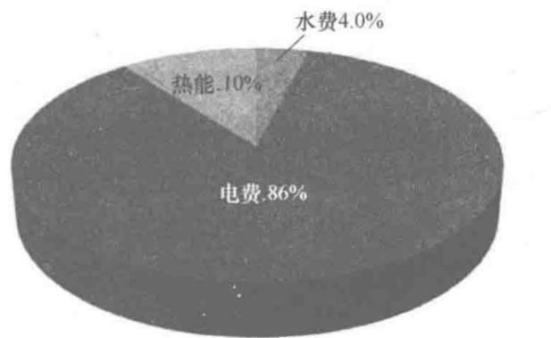  
图 1 某医院能耗费用结构图

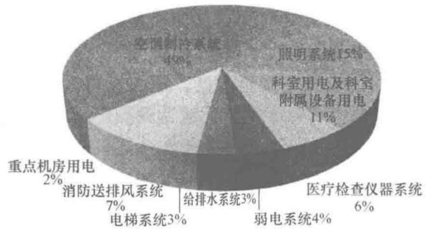  
图 2 某医院各系统用电百分比结构图

国家标准《公共建筑节能设计标准》GB 50189—2015 第 1.0.3 条规定 “公共建筑节能设计应根据当地的气候条件，在保证室内环境参数条件下，改善围护结构保温隔热性能，提高建筑设备及系统的能源利用效率，利用可再生能源，降低建筑暖通空调、给排水及电气系统的能耗。”该标准第 4 章按一般规定、冷热与热源、输配系统、末端系统、监测、控制与计量给出了供暖通风与空气调节的具体要求，是工程设计人员必须遵守的。为了确保节能措施的落地实施，该标准第 1.0.5 条又规定 “施工图设计文件中应说明该工程项目采取的节能措施，并宜说明其使用要求”。

我国气候跨度范围较大，共划分了严寒地区、寒冷地区、夏热冬冷地区、夏热冬暖地区和温和地区5个气候分区，每个气候分区内又划分了多个气候子区。为此，许多省市又根据当地气候特点制定了相应的地方标准。

在执行《公共建筑节能设计标准》GB 50189的同时，住房和城乡建设部发布了国家标准《绿色建筑评价标准》GB/T 50387—2014。所谓绿色建筑就是：在全寿命期内，最大限度地节约资源（节能、节地、节水、节材）、保护环境、减少污染，为人们提供健康、适用和高效的使用空间，与自然和谐共生的建筑。该标准第5章对暖通空调系统提出了高于《公共建筑节能设计标准》GB 50189的节能要求。目前，在工程设计过程中，各个地方政府对于公共建筑都提出了要达到1星或2星的要求。

在国家节能政策的鼓励下，暖通空调的节能技术不断涌现。既有建筑的节能改造、合同能源管理等项目，更是推动了节能技术的应用。本书通过对近几年工程设计中运用的节能技术进行总结，以便能够更好地进行广泛的推广应用，使更多的设计师和工程项目受益。

由于工程师多数都是离开学校多年，对一些基础知识如：焓、熵、对数温差等已经生疏，为了加强对节能理论的理解，本书对这些基本的理论知识进行了复习，再通过实际的工程设计案例而不是抽象的节能规范条文进行阐述，使内容更容易理解。

《建筑工程设计文件编制深度规定》中要求，暖通专业施工图“空调、制冷系统有自动监控时，宜绘制控制原理图，图中以图例绘出设备、传感器及执行器的位置；说明控制要求和必要的控制参数”。如何绘制和如何提出控制要求，便是本书要解决的问题之一。

笔者在工程设计工作中发现，空调系统的自动控制往往是暖通空调设计师的短板，在审核一些工程的暖通空调设计时发现很多设计师对空调自动控制的描述似是而非。希望本书的内容，可以对暖通空调工程师在自控应用方面有所帮助，同时也为自控工程师了解暖通空调的节能设计有所帮助。

笔者认为“空调”这两个字有两个含义，“空”是指空气处理，是对空气进行过滤、加热、冷却、加湿、除湿，而“调”是指对空气的参数进行控制。由于影响空气参数的扰量（如：室外空气温湿度、室内设备人员发热量）是不断变化的，因此，对于中央空调系统控制，通过手动是无法达到预定的精度的，对于有节能要求的系统，必须通过自动控制系统才能使冷热量的供给与冷热量需求保持一致。由此，中央空调系统节能设计和自控设计是密不可分的。如果一个空调系统没有自控设计，这个空调系统，只能说仅完成了一半，即：只完成了空气处理。另一方面，如果暖通工程师不参与控制系统的设计，而完全交给自控工程师，谁能保证这样的控制正是你所需要的呢？

因此，在空调系统控制设计过程中，不同专业的工程师从专业知识结构上还需进一步学习掌握各专业交叉的内容，暖通空调工程师需要学习电机配电、控制系统和通信网络方面的知识，弱电工程师需要学习空调系统节能设计、运行的知识。在设计过程中，暖通空调专业需要提给自控专业工艺流程图与测量控制要求，现场仪表安装处的工作参数和工艺条件，如管径、工作温度、湿度、压力、流量等，工艺系统所带的控制设备，如电动阀门的技术资料、设备的平面位置等，由自控工程师来完成自控系统设计。只有这样才能保证空调自控系统在设计上不脱节，使空调与自控能够有机地结合成一体。

在本书中，把空调系统的节能设计与自控设计放到一起来讨论，这是因为空调系统的节能是与自控系统密不可分的。没有自控的空调系统肯定是不节能的，但是有自控的空调系统也不一定节能。必须是节能的空调系统加上节能的控制逻辑才能实现真正的节能运行。

空调节能涉及的另外一个技术领域是电机及其拖动，在设计院的专业分工上这一部分既不属于暖通空调专业，也不属于电气专业和自控专业，属于“三不管”的专业，但与三个专业都有密切的关系，本书第14.1节中专门讨论了空调系统所用到的电机节能技术。电机及其控制实际上是暖通空调专业基础课程电工学中的内容，只不过在后来的工作分工中很少涉及，这使得设计院的暖通空调工程师对此部分完全“不认识了”，到了工程现场完全不知所措。希望本书中的章节和图片对这些同行有所帮助。

本书可供从事暖通空调专业的设计师、楼宇控制专业的设计师及相关专业的施工技术人员和系统运营管理人员参考。

本书在出版过程中得到了中国中元国际工程公司科技信息部的大力支持，在此表示感谢！本书在编写的过程中，电气专业的同事高磊和时珊珊对本书的第14章和第15章进行精心审校，并提出了宝贵建议，在此表示感谢！

许多空调设备生产企业的朋友为本书的编写提供了不少技术资料，在此一并表示感谢！

他们是：

1. 开利公司：王亚力；

2. 特灵公司：张宇、张伟；

3. 麦克维尔公司：陈琳琳；

4. 杭州源牌科技股份有限公司：张劲松；

5. 上海翱途流体科技有限公司：陈雷昕、刘光裕；

6. 爱芯环保科技（厦门）股份有限公司：钟喜生；

7. 倚世节能科技（上海）有限公司：阮红正；

8. BELIMO 公司：焦国军、杨征；

9. 妥思空调设备（苏州）有限公司：罗斯卡；

10. 广东艾科技术股份有限公司：李飞龙；

11. 欧文托普公司：李继来、郭晨；

12. 深圳市勤达富流体机电设备有限公司：张亚军；

13. 同能创达科技（北京）有限公司：郭建良；

14. 艾蒙斯特朗流体技术集团：周良；

15. 上海智全控制设备有限公司：冉龙；

16. 北京益必创楼宇科技有限公司：敖胜荣；

17. 北京长城融智科技有限公司：孙诗明。

本书将作者在工作中经常遇到的暖通空调自动控制原理图及控制要求，经整理后放到了中国建筑工业出版社服务器上，按照本书版权页中的流程，就可以下载 CAD 版的图纸，方便同行们修改使用，这样可以节省大量的工程设计时间。

目前，从暖通空调和自动控制设计的角度来讨论建筑节能问题的书籍资料不多，限于作者的水平和实践经验的局限性，书中尚有很多不完善和错误之处，恳请广大同行和读者批评指正。

赵文成

2018年1月30日

**目录**

第1章 概述 …… 1
1.1 暖通空调的节能方式 …… 1
1.2 暖通空调的节能技术 …… 1
1.3 暖通空调自控的内容 …… 2
第2章 中央空调风、水输配系统的节能 …… 3
2.1 管路的特性曲线 …… 3
2.2 串联管路和并联管路的特性曲线 …… 5
2.3 并联管路的总特性曲线的图解 …… 6
2.4 串联管路的总特性曲线的图解 …… 6
2.5 泵与风机的性能 …… 6
2.5.1 泵或风机的功率 …… 6
2.5.2 泵或风机的效率 …… 7
2.5.3 电动机功率 …… 7
2.5.4 选择电动机的功率 …… 8
2.5.5 泵或风机变频调速后效率 …… 9
2.6 泵与风机的性能曲线 …… 9
2.6.1 泵与风机的H-Q曲线 …… 9
2.6.2 泵与风机的N-Q曲线 …… 10
2.6.3 泵与风机的η-Q曲线 …… 10
2.7 水泵的特性曲线的数学表达 …… 10
2.8 空调水系统水泵的种类 …… 11
2.8.1 卧式泵 …… 11
2.8.2 立式泵 …… 12
2.9 水泵的节能标准 …… 12
2.10 水泵的选择 …… 13
2.10.1 空调系统循环泵选型时依据的参数 …… 13
2.10.2 变频水泵的选择 …… 14
2.11 空调风机的种类 …… 15
2.11.1 离心风机 …… 15
2.11.2 EC风机 …… 16
2.11.3 防爆风机 …… 16
2.12 泵与风机的相似定律 …… 17
2.13 泵与风机的比例定律 …… 17
2.14 比例定律的应用条件 …… 18
2.15 泵或风机改变转速后特性曲线的求解 …… 18

2.15.1 作图法求解……18
2.15.2 利用公式求解……19
2.16 泵与风机的等效率线……19
2.17 泵或风机的联合运行……20
2.17.1 并联工况分析……20
2.17.2 串联工况分析……20
2.18 泵与风机的工况调节……21
2.18.1 泵与风机的工作点……21
2.18.2 泵与风机的工况调节的图解分析……22
2.18.3 两台并联泵或风机中仅一台进行变速调节的问题……26
2.18.4 暖通空调系统中改变泵或风机转速的方法……28
2.18.5 暖通空调变频循环水泵的工作频率范围……28
2.18.6 变频风机的工作频率范围……29
第3章 空调冷冻水一次泵变流量系统的调节……30
3.1 控制曲线（或运行曲线）……30
3.2 变频泵的压差控制……31
3.3 无压差传感器的冷冻水一次泵变流量系统的控制……35
3.3.1 冷冻机房供回水总管之间恒压差的控制……35
3.3.2 水泵出口恒压力控制……38
3.3.3 空调系统最不利末端入口恒压差控制……38
3.3.4 无传感器泵控制优点……38
3.4 最优效率法全变频并联泵运行台数的调节……38
3.4.1 求效率—流量曲线……38
3.4.2 控制方案……39
3.4.3 控制方案节能分析……39
第4章 中央空调制冷系统的节能设计……40
4.1 冷水机组的台数设置……40
4.2 高压冷机的设置……40
4.3 冷冻机房的设计……40
4.3.1 水泵与冷水机组连接方式的选择……41
4.3.2 电动隔断蝶阀的控制……41
4.3.3 流量开关的设置……42
4.4 中央空调水系统节能设计……42
4.4.1 电机驱动的蒸汽压缩循环冷水机组名义制冷工况下和规定条件下的性能系数（COP）……42
4.4.2 电机驱动的蒸汽压缩循环冷水机组综合部分负荷性能系数（IPLV）……43
4.4.3 电冷源综合制冷性能系数（SCOP）……43
4.4.4 空调冷水系统耗电输冷比ECR-a……44
4.4.5 冷水机组能效的理论极限……44
4.4.6 中央空调制冷系统节能设计应当注意的问题……44

4.4.7 各种标准规范对水冷离心式冷水机组 COP 及 IPLV 的限值对比 …… 45
4.4.8 中央空调水系统节能设计具体措施 …… 46
4.5 冷水系统形式 …… 50
4.5.1 冷水冷源侧一次泵定流量系统 …… 50
4.5.2 冷水冷源侧二级泵（多级泵）变流量系统 …… 50
4.5.3 一级泵定流量系统与二级泵变流量系统的结合 …… 52
4.5.4 冷水冷源侧一次泵变流量系统 …… 53
4.6 超高层建筑空调水冷系统竖向分区节能设计 …… 55
4.6.1 目前空调系统主要设备及管道的承压 …… 55
4.6.2 空调冷水系统分区方式 …… 56
4.6.3 空调热水系统分区方式 …… 56
4.7 冷却塔冬季供冷系统 …… 57
4.7.1 冷却塔制冷的基本原理 …… 58
4.7.2 冷却塔供冷形式 …… 58
4.7.3 冷却塔供冷转换温度 …… 61
4.7.4 冷却塔特性曲线 …… 61
4.7.5 冷却塔冬季供冷设计计算 …… 61
4.7.6 冷却塔冬季供冷控制要求 …… 63
4.7.7 冷却塔冬季供冷设计注意事项 …… 63
第 5 章 蓄冷空调工程设计 …… 65
5.1 水蓄冷 …… 65
5.1.1 水蓄冷的冷水机组 …… 65
5.1.2 水的蓄冷量计算 …… 65
5.1.3 蓄冷水槽的形式 …… 66
5.1.4 采用消防水池水蓄冷 …… 66
5.1.5 采用水蓄冷的区域供冷 …… 68
5.1.6 数据中心的水蓄冷 …… 73
5.1.7 提高水蓄冷效率的方法 …… 73
5.2 冰蓄冷 …… 74
5.2.1 盘管式静态冰蓄冷系统 …… 75
5.2.2 盘管式内融冰蓄冷系统 …… 78
5.2.3 盘管式外融冰蓄冷系统 …… 82
5.2.4 盘管式冰蓄冷系统设计应注意的问题 …… 86
5.2.5 盘管式冰蓄冷系统设计计算 …… 87
5.2.6 冰片滑落式动态制冰蓄冷系统 …… 87
5.2.7 冰片滑落式动态冰蓄冷系统设计注意事项 …… 91
5.2.8 冰片滑落式动态冰蓄冷系统设计计算 …… 91
5.2.9 机械搅拌式直接蒸发动态制冰蓄冷系统 …… 92
5.2.10 机械搅拌式间接动态制冰系统 …… 95

5.2.11 过冷水式动态制冰技术....96
5.2.12 流态冰蓄冷系统设计注意事项....99
5.2.13 流态冰蓄冷系统设计计算....99

第6章 热交换站的设计....101
6.1 换热在暖通空调系统中的应用....101
6.1.1 热交换站的应用场所....101
6.1.2 常用的换热器的形式....101
6.2 换热器的选型注意事项....101
6.3 换热器的选型计算....102
6.3.1 换热面积计算....102
6.3.2 对数平均温差计算....102
6.3.3 对数平均温差的简化计算....102
6.3.4 对数平均温差的推导....102
6.3.5 换热器一次侧及二次侧流量的计算....104
6.4 锅炉房和换热机房的调节....105
6.5 气候补偿器原理....105
6.5.1 气候补偿器的设定曲线....105
6.5.2 气候补偿器的功能....107
6.5.3 气候补偿器的应用....108

第7章 空调水系统的阀门设置....109
7.1 空调系统各个分支阀门的设置....110
7.2 调节阀安装的位置....110
7.3 电动调节阀....111
7.3.1 空调机组加热器（表冷器）的静特性....111
7.3.2 电动调节阀的流量特性....112
7.3.3 调节阀的理想可调节范围R....112
7.3.4 调节阀的理想流量特性....112
7.3.5 电动调节阀的选择....113
7.3.6 等百分比流量特性的调节阀....114
7.3.7 阀权度....116
7.3.8 调节阀的实际可调节范围Rr....116
7.3.9 调节阀的工作流量特性....116
7.3.10 电动调节阀的口径计算....116
7.3.11 总结电动调节阀的计算选型过程....118
7.3.12 电动平衡一体阀....118
7.3.13 电动平衡一体阀用来设定变频冷水泵的最低频率....119
7.3.14 典型电动平衡一体阀的参数....120
7.3.15 动态平衡电动调节阀选型....121
7.3.16 电子式压力无关型电动调节阀....121

7.3.17 能量调节阀 …… 122
7.4 电动两通阀 …… 124
7.4.1 电动式两通阀 …… 124
7.4.2 电热式两通阀 …… 124
7.4.3 电动两通球阀 …… 125
7.4.4 动态平衡电动两通阀 …… 125
7.5 电磁阀 …… 125
7.6 动态双温度平衡电动调节阀 …… 126
7.6.1 动态双温度平衡电动调节阀控制原理 …… 126
7.7 静态平衡阀 …… 128
7.7.1 静态平衡阀使用注意事项 …… 128
7.7.2 静态平衡阀的安装要求 …… 128
7.7.3 静态平衡阀的选型 …… 129
7.8 电动蝶阀 …… 130
7.8.1 电动蝶阀连接形式和自动控制方式 …… 130
7.8.2 空调系统中的电动蝶阀 …… 130
第8章 空调水系统压力及定压 …… 133
8.1 压力表安装位置 …… 133
8.2 压力表读数的意义 …… 133
8.3 空调系统各点压力表读数的关系 …… 134
8.4 空调水系统的定压 …… 134
8.4.1 定压点的确定 …… 134
8.4.2 定压方式 …… 136
第9章 通风空调风系统的调节控制 …… 145
9.1 调节风阀 …… 145
9.1.1 电动调节风阀 …… 145
9.1.2 变风量末端（VAV BOX） …… 146
9.1.3 定风量阀 …… 147
9.2 变风量空调系统 …… 148
9.2.1 变风量空调系统的组成 …… 148
9.2.2 变风量空调系统房间温度的控制 …… 149
9.2.3 变风量末端的分类 …… 150
9.2.4 单风道单冷型变风量末端的调节过程 …… 150
9.2.5 单风道单冷再热型变风量末端的调节过程 …… 151
9.2.6 单风道冷暖型变风量末端的调节过程 …… 151
9.2.7 并联风机动力型变风量末端的调节过程 …… 151
9.2.8 串联风机动力型变风量末端的调节过程 …… 152
9.2.9 变风量末端装置风量计算 …… 153
9.2.10 变风量末端装置的选择 …… 153

9.2.11 变风量末端装置的安装要求 …… 154
9.2.12 变风量末端的应用 …… 154
9.2.13 变风量空调机组风量的控制 …… 156
9.2.14 送风温度的控制 …… 163
9.2.15 新、排风量的控制 …… 164

9.3 化学实验室专用压力无关型变风量控制单叶风阀 …… 164
9.4 文丘里调节阀 …… 165
9.4.1 定风量文丘里阀（CAV）…… 166
9.4.2 变风量文丘里阀（VAV）…… 166
9.4.3 采用文丘里阀的正负压 ICU 病房的设计 …… 168
9.4.4 采用文丘里阀的化学实验室变风量通风设计 …… 168
9.5 伯努利妙流智能风阀 …… 174
9.6 伯努利层流风幕排风柜 …… 176
9.6.1 伯努利层流风幕排风柜主要参数 …… 176
9.6.2 采用伯努利层流风幕排风柜的化学实验室变风量通风设计 …… 177
9.6.3 伯努利层流风幕排风柜的变风量控制 …… 177
9.6.4 采用伯努利层流风幕排风柜变风量通风实验室案例 …… 178
9.6.5 各种实验室通风方式的比较 …… 179
9.7 生物实验室的暖通空调设计 …… 179
9.7.1 生物安全实验室 …… 179
9.7.2 生物安全柜的排风设计 …… 183
9.7.3 P2 生物安全实验室的通风空调及控制系统设计 …… 183
9.7.4 静脉药物配置中心通风空调及控制系统设计 …… 184
9.8 净化空调系统恒定风量的控制 …… 187
9.8.1 净化空调系统恒定风量的直接控制法 …… 188
9.8.2 净化空调系统恒定风量的间接控制法 1 …… 188
9.8.3 净化空调系统恒定风量的间接控制法 2 …… 189
9.8.4 净化空调系统恒定风量的间接控制法 3 …… 189
9.9 房间压差的控制 …… 191
9.9.1 房间压差的建立 …… 192
9.9.2 房间压差的控制方法 …… 192
9.9.3 防止反流的措施 …… 196
9.9.4 气闸室（又称缓冲间）的设置 …… 196
第 10 章 排风热回收 …… 198
10.1 排风热回收的技术经济比较 …… 198
10.1.1 排风热回收的设计方法、步骤 …… 198
10.1.2 排风量的计算 …… 198
10.1.3 热回收量的计算 …… 199
10.1.4 风机电耗增加量的计算 …… 199

10.1.5 排风热回收的效率……199
10.2 排风热回收装置……201
10.2.1 转轮式……201
10.2.2 板翘式热回收换热器……202
10.2.3 热管式换热器……204
10.2.4 分离式热管……204
10.2.5 微通道分离式热管……205
10.2.6 溶液循环热回收……207
10.2.7 游泳池热泵式热回收……208

第 11 章 组合式空调机 …… 209
11.1 组合式空调机组主要性能要求 …… 209
11.2 组合式空调机组的结构 …… 210
11.3 组合式空调机组的各功能段 …… 211
11.3.1 机组的断面风速……211
11.3.2 立式机组、吊装式机组……211
11.3.3 机组的接口……211
11.3.4 消声段……211
11.3.5 风机段……211
11.3.6 表冷加热段……212
11.3.7 加湿段……213
11.3.8 过滤段……213
11.3.9 组合式空调机组常用功能段组合……214

第 12 章 空气处理过程 …… 221
12.1 湿空气的状态参数 …… 221
12.1.1 湿空气的压力（B）……221
12.1.2 含湿量（d）……221
12.1.3 相对湿度（φ）……221
12.1.4 湿空气的比焓（h）……222
12.2 湿空气的焓湿图 …… 222
12.3 空气状态参数的测量 …… 223
12.4 热湿比 …… 224
12.5 空气处理过程 …… 224
12.5.1 等湿加热、等湿冷却过程（A→C、A→F）……224
12.5.2 等焓加湿过程（A→E）……224
12.5.3 等温加湿过程（A→D）……224
12.5.4 等焓减湿过程（A→B）……225
12.5.5 减焓减湿过程（A→G）……225
12.5.6 不同状态空气的混合过程（W、N→C）……225
12.6 新风预热的条件 …… 226

12.7 空调房间的风量平衡和热量平衡 …… 226
12.7.1 风量平衡…… 226
12.7.2 热量平衡…… 228
12.8 新风量的确定 …… 229
12.9 空气处理过程送风量的确定 …… 229
12.10 工程中常见的空气处理过程 …… 229
12.10.1 空调房间送风温差和换气次数 …… 229
12.10.2 风机温升 …… 229
12.10.3 风机温升增加的显热负荷的百分率 …… 230
12.10.4 恒温恒湿空调系统空气处理过程 …… 231
12.10.5 舒适性空调一次回风系统空气处理过程 …… 233
12.10.6 舒适性空调二次回风系统空气处理过程 …… 234
12.10.7 变风量空调系统空气处理过程 …… 235
12.10.8 医疗净化空调系统空气处理过程 …… 236
12.10.9 二次回风手术室空调净化系统空气处理过程 …… 240
12.10.10 直流式空调系统空气处理过程 …… 242
12.10.11 泳池冷凝热回收空调系统空气处理过程 …… 244
12.10.12 风机盘管加新风空调系统空气处理过程 …… 246
12.10.13 空调系统不加湿的条件 …… 250
12.10.14 新风集中处理系统冬季过程 …… 251
12.10.15 新风诱导器系统空气处理过程 …… 251
12.10.16 辐射板加新风空调系统空气处理过程 …… 254
12.10.17 排风热回收空气处理过程 …… 255
12.11 空调系统加湿及其控制设计 …… 255
12.11.1 空调系统加湿方式 …… 255
12.11.2 各种加湿原理及控制方法 …… 257
12.11.3 加湿用水源 …… 265
12.12 空气的净化处理及其控制设计 …… 266
12.12.1 空气过滤器的分类及性能 …… 266
12.12.2 过滤器的效率 …… 267
12.12.3 房间洁净度的控制 …… 269
12.12.4 过滤器的控制 …… 269
12.12.5 静电过滤器 …… 269
第 13 章 制冷机组及其节能应用 …… 273
13.1 冷水机组的名义工况 …… 273
13.2 冷水机组能效等级 …… 274
13.3 制冷剂热力学性质图 …… 275
13.3.1 制冷剂的温熵 T-s 图 …… 275
13.3.2 比熵 …… 276

13.3.3 制冷剂的压焓 1gp-h 图 …… 276
13.4 蒸汽压缩式制冷的理论循环 …… 276
13.4.1 单级压缩制冷系统 …… 276
13.4.2 单级压缩蒸气制冷循环压缩比 …… 277
13.4.3 多级压缩制冷系统 …… 277
13.4.4 常用两级压缩制冷系统形式 …… 278
13.4.5 复叠式制冷系统 …… 281
13.4.6 复叠式制冷在空调系统中的应用 …… 282
13.4.7 跨临界制冷循环（CO₂ 热泵） …… 283
13.5 冷却水温度、冷水温度变化对制冷量的影响 …… 284
13.5.1 对单级压缩制冷系统的影响 …… 284
13.5.2 对双级压缩制冷系统的影响 …… 286
13.6 常用蒸汽压缩式空调冷水机组的分类及节能应用 …… 288
13.6.1 离心式压缩机冷水机组 …… 288
13.6.2 螺杆式压缩机冷水机组 …… 292
13.6.3 涡旋式冷水机组 …… 293
13.7 冷水机组负荷的运行调节 …… 294
13.7.1 容积式压缩机的负荷调节 …… 294
13.7.2 离心式冷水机组的负荷调节 …… 294
13.8 中央空调制冷系统的节能设计 …… 295
13.8.1 中央空调制冷系统的变频设计 …… 295
13.8.2 冷却水最优进水温度控制 …… 296
13.8.3 采用离心式水冷水机组的自然冷却 …… 296
13.8.4 采用冷凝热回收冷水机组 …… 296
13.8.5 冷水机组热回收加热生活热水系统设计 …… 300
13.8.6 冷凝器在线清洗系统设计 …… 300
13.8.7 微泡排气除污装置的应用设计 …… 303
13.8.8 热泵 …… 304
第 14 章 电机及电机拖动 …… 312
14.1 电机 …… 312
14.1.1 三相异步电动机 …… 312
14.1.2 单相异步电机 …… 317
14.1.3 直流无刷电机 …… 318
14.1.4 永磁同步交流电机 …… 320
14.1.5 高压电机 …… 323
14.1.6 变频电机 …… 323
14.2 三相笼式异步电机的启动 …… 324
14.2.1 三相笼式异步电机的直接启动 …… 324
14.2.2 三相笼式异步电机降压启动 …… 325

14.3 常用低压电器 …… 327
14.3.1 热继电器 …… 327
14.3.2 接触器 …… 327
14.3.3 中间继电器 …… 328
14.3.4 低压断路器 …… 328
14.3.5 按钮开关 …… 328
14.3.6 转换开关 …… 329
14.3.7 限位开关 …… 329
14.3.8 电机综合保护开关 …… 329
14.4 电动机的基本电气控制电路 …… 330
14.4.1 电动机的控制过程 …… 331
14.4.2 电动机的控制信号反馈 …… 331
14.5 单相异步电动机的正反转的控制 …… 331
14.5.1 电动蝶阀的控制原理 …… 331
14.5.2 电动蝶阀的内部电路 …… 332
14.6 风机盘管的配电 …… 332
14.7 一个温控器控制两台风机盘 …… 333
14.8 变频器 …… 333
14.8.1 变频器的节能作用 …… 333
14.8.2 变频器的安装位置 …… 334
14.8.3 变频器的类别 …… 334
14.8.4 变频器的额定数据 …… 335
14.8.5 四象限变频器 …… 336
第15章 暖通空调自动控制基础 …… 337
15.1 常用传感器 …… 337
15.1.1 温度传感器 …… 337
15.1.2 防冻开关 …… 338
15.1.3 湿度传感器 …… 338
15.1.4 压力传感器 …… 338
15.1.5 压差开关 …… 338
15.1.6 空气压差计、微压差变送器 …… 339
15.1.7 门窗磁开关 …… 340
15.1.8 液位传感器 …… 340
15.1.9 液位开关 …… 341
15.1.10 空气质量传感器 …… 341
15.1.11 流量计 …… 342
15.1.12 热量表 …… 344
15.1.13 风速的测量 …… 348
15.1.14 风量在线测量 …… 349

15.2 测量仪表的量程和精度 …… 353
15.3 执行器 …… 353
15.3.1 阀门的电动执行器 …… 353
15.3.2 电加热器和电热式加湿器的功率输出控制 …… 359
15.4 控制器 …… 360
15.4.1 控制器的工作过程 …… 360
15.4.2 可编程控制器（PLC） …… 360
15.4.3 直接数字控制器（DDC） …… 360
15.5 控制器调节特性 …… 362
15.5.1 比例（P）调节的特性 …… 362
15.5.2 比例积分（PI）调节特性 …… 363
15.5.3 比例微分（PD）调节的特性 …… 364
15.5.4 比例积分微分调节（PID）的特性 …… 365
15.6 如何更好地理解 PID 调节 …… 365
15.7 自动控制基本原理 …… 366
15.7.1 单回路闭环控制 …… 366
15.7.2 多回路闭环控制 …… 367
第 16 章 空调冷热源系统的控制 …… 369
16.1 冷水机组的群控 …… 370
16.1.1 冷水机组运行台数的控制 …… 370
16.1.2 设备自动切换、连锁控制 …… 372
16.1.3 群控系统监控的设备运行参数 …… 372
16.2 一次泵定流量、冬季冷却塔供冷制冷系统控制原理图 …… 373
16.2.1 项目概况 …… 373
16.2.2 控制要求 …… 376
16.3 一次泵变流量、冷凝热回收制冷系统控制原理图 …… 377
16.3.1 项目概况 …… 377
16.3.2 控制要求 …… 377
16.4 二级泵变流量、冬季冷却塔供冷制冷系统控制原理图 …… 381
16.4.1 项目概况 …… 381
16.4.2 控制要求 …… 381
16.5 一级泵变流量、水蓄冷、冬季冷却塔供冷、主机热回收制冷系统原理图 …… 384
16.5.1 项目概况 …… 384
16.5.2 控制要求 …… 385
16.6 动态制冰（冰片滑落式）蓄冷、冬季冷却塔供冷系统控制原理图 …… 389
16.6.1 项目概况 …… 389
16.6.2 控制要求 …… 390
16.7 冰球封装式冰蓄冷主机并联系统控制原理图 …… 394
16.7.1 项目概况 …… 394

16.7.2 控制要求……394
16.8 内融冰盘管式冰蓄冷主机上游串联系统控制原理图 …… 398
16.8.1 项目概况……398
16.8.2 控制要求……398
16.9 一次泵变流量、冷凝热回收及冬季冷却塔供冷制冷系统控制原理图 …… 402
16.9.1 项目概况……402
16.9.2 控制要求……402
16.10 一次泵变流量、冷凝热回收及流态冰蓄冷系统控制原理图 …… 406
16.10.1 项目概况……406
16.10.2 控制要求……407
16.11 数据中心水蓄冷、一次泵变流量系统控制原理图 …… 411
16.11.1 项目概况……411
16.11.2 控制要求……411
16.12 蒸汽型溴化锂吸收式制冷系统控制原理图 …… 414
16.12.1 项目概况……414
16.12.2 控制要求……415
16.13 土壤源热泵系统控制原理图 …… 418
16.13.1 项目概况……418
16.13.2 控制要求……418
16.14 空气源热泵系统控制原理图 …… 419
16.14.1 项目概况……419
16.14.2 控制要求……419
16.15 数据中心闭式冷却塔、一次泵变流量系统控制原理图 …… 424
16.15.1 项目概况……424
16.15.2 控制要求……424
16.16 空调热水汽-水换热机组控制原理图 …… 425
16.16.1 项目概况……425
16.16.2 控制要求……425
16.17 生活热水汽-水换热机组控制原理图 …… 430
16.17.1 项目概况……430
16.17.2 控制要求……430
16.18 空调热水水-水换热机组控制原理图 …… 430
16.18.1 项目概况……430
16.18.2 控制要求……431
16.19 带空调冷凝热回收生活热水预热水-水换热系统控制原理图 …… 431
16.19.1 项目概况……431
16.19.2 控制要求……431
第 17 章 空调机组的调节控制 …… 438
17.1 室内参数控制精度 …… 438

17.2 空调负荷变化时热湿比 $\varepsilon$ 的变化 …… 438  
17.3 定机器露点调节方法 …… 439  
17.4 变机器露点调节方法 …… 439  
17.5 变新风比的调节 …… 440  
17.6 一、二次回风混合比的调节 …… 441  
17.7 改变送风量的调节 …… 442  
17.8 空调机组控制信号的接点位置 …… 442  
第18章 空调机组及风机盘管常用控制原理 …… 444  
18.1 单风机变频空调机组控制 …… 444  
18.1.1 控制要求 …… 444  
18.2 二次回风空调机组控制 …… 446  
18.2.1 控制要求 …… 446  
18.3 兼作火灾补风单风机空调机组串级控制 …… 448  
18.3.1 控制要求 …… 448  
18.4 双风机变频空调机组控制 …… 450  
18.4.1 控制要求 …… 450  
18.5 兼作火灾补风双风机变频空调机组控制 …… 452  
18.5.1 控制要求 …… 452  
18.6 正压洁净手术室四管制变频净化空调机组（配电热加湿器和电再热器）控制 454  
18.6.1 控制要求 …… 454  
18.7 新风预处理正负压转换手术室净化空调机组（热水盘管再热）控制 …… 456  
18.7.1 控制要求 …… 456  
18.8 洁净手术部辅助用房净化空调恒定风量控制 …… 458  
18.8.1 控制要求 …… 458  
18.9 泳池冷凝热回收系统控制 …… 459  
18.9.1 项目概况 …… 459  
18.9.2 控制要求 …… 459  
18.10 变风量（VAV）系统定静压法控制 …… 463  
18.10.1 项目概况 …… 463  
18.10.2 控制要求 …… 463  
18.11 变风量（VAV）系统变静压法控制 …… 466  
18.11.1 工程概况 …… 466  
18.11.2 变静压控制要求 …… 466  
18.12 变风量（VAV）系统总风量法控制 …… 470  
18.13 制药厂变风量净化空调系统控制 …… 471  
18.13.1 项目概况 …… 471  
18.13.2 控制要求 …… 476  
18.14 组合式新风机组的控制（干蒸汽加湿）…… 477  
18.15 兼作火灾补风卧式新风机组（高压喷雾加湿）控制 …… 479

18.16 变频净化新风机组控制 …… 479
18.17 转轮式热回收新风机组控制 …… 482
18.18 板式显热回收新风机组控制 …… 484
18.19 板式显热回收分体式新风机组控制 …… 486
18.20 溶液循环热回收新风机组控制 …… 487
18.21 普通风机盘管的控制 …… 487
18.22 星级酒店RCU控制客房风机盘管 …… 493
18.23 医院普通病房风机盘管网络控制 …… 494
18.24 诱导器（冷梁）控制 …… 494

第19章 建筑设备监控系统 …… 496
19.1 建筑设备监控系统网络系统结构 …… 496
19.1.1 现场网络（仪表） …… 496
19.1.2 控制网络层 …… 498
19.1.3 管理网络层 …… 498
19.2 通信网络 …… 498
19.2.1 RS 485总线 …… 498
19.2.2 以太网网络结构 …… 499
19.3 通信协议 …… 499
19.4 建筑设备监控系统的基本要求 …… 500
19.4.1 建筑设备监控系统应具备的监测功能 …… 500
19.4.2 建筑设备监控系统应具备的监测功能应具备的安全保护功能 …… 500
19.4.3 建筑设备监控系统宜具备远程控制功能 …… 500
19.4.4 宜具备自动启停功能，并应以实现远程控制功能为前提 …… 500
19.4.5 宜具备自动调节功能，并应以实现远程控制功能为前提 …… 500
19.5 建筑设备监控系统应用 …… 501
19.5.1 RS 485总线工程案例 …… 501
19.5.2 以太网网络结构工程案例 …… 501

参考文献 …… 504

**第1章 概述**

**1.1 暖通空调的节能方式**

综合地分析一下目前应用的暖通空调的节能技术，它们不外乎都是从以下的四个方面着手：

1. 节省方式：通过追求高效率，采用高效率的设备、优化系统和加强自动控制的运行，来节省空调运行能耗。

2. 自然能利用的方式：通过合理使用自然能而减少空调能源消耗，如：新风供冷、冬季冷却塔供冷及热泵的利用。

3. 热回收方式：通过对热能的再回收，实现热能的二次利用，从而减少空调的能源消耗，如：排风热回收、制冷主机冷凝热回收等。

4. 采用高效率的设备：中央空调设备一般分为以下三类，分别是冷热源设备、水或空气的输送设备以及空调末端的设备。每一台中央空调设备都是由流体机械和驱动它的电机组成的。因此，提高这些设备的效率不能仅仅考虑它的机械、传热性能，还应关注电机效率。

**1.2 暖通空调的节能技术**

目前广泛应用的暖通空调节能技术主要有如下几个：

1. 蓄冷技术。蓄冷中央空调由冰或冷水提供冷源，利用电网低谷电力储存冷量，电网高峰时段释放冷量，有效转移空调用电高峰负荷，缓解电力供需矛盾，减缓发电厂的建设，从宏观上实现了节能。中央空调系统的冷水机组，在低谷电时段蓄水或冰，其他时段根据负荷需求由蓄冷系统供冷，实现用电的移峰填谷，为用户节省运行费用。

2. 大温差技术。在中央空调冷水机组的正常工作范围内，当输出冷量不变和室外环境满足冷却塔散热条件时，冷冻水和冷却水系统采用大温差小流量更加节能。

3. 变频技术。当中央空调的冷机系统“大马拉小车”或冷负荷需求波动时，冷冻水循环泵采用自动变频调速控制，实现节能运行。同样，冷水机组的变频技术、变风量空调系统、变风量通风系统的应用都能大幅节省空调通风系统的运行能耗。

4. 主机热回收技术。当同时有供热和制冷需求时，采用带有热回收功能的制冷机组，实现节能。在某些采用主机热回收技术的工程中，甚至可以省掉锅炉设备的投入。

5. 热泵技术。水、地源热泵、空气源热泵及吸收式热泵，可以充分利用低品位的热源。

6. 自然冷源利用技术。当全年都有供冷需求时，空调系统应考虑当环境温度较低时，直接利用自然冷源供冷，如冬季冷却塔供冷，实现节能。

7. 排风系统热回收技术。为了满足人员的卫生需求，新风负荷占空调总负荷的20%～40%。当具备安装条件时，经过技术经济比较后，采用带排风热回收功能的新风机组，实现节能运行。

8. 集中空调安装计量表。安装计量表后，可以对空调系统各个部分的用能情况进行分析，集中空调实行计量收费，是建筑节能运行的一项基本措施。

9. 制冷主机安装自动清洗设备。中央空调冷却系统大多采取敞开式散热，循环水在冷却塔内大量蒸发，循环水中的钙镁离子被浓缩，同时冷却水中含有大量被洗涤下来的污泥，在冷凝器内进行热交换时，非常容易结垢，因此，在冷凝器上安装自动清洗设备将有效地提高换热效率。

10. 采用高效的水泵、风机、制冷及换热设备。

11. 配备高效永磁同步电机、直流 EC 电机。

12. 精细化的水系统、风系统设计，减少系统的阻力降低水、风的输送能耗。

13. 优化空调自控系统。目前已开通的 BAS 系统多数只实现了建筑设备的自动启停和监测，其节能也主要表现在一些设备的定时开启和关闭，而空调系统作为建筑能耗大户，如何根据系统的实际情况尽可能地节能、经济运行则还未能实现。

这些节能技术的理论基础分散在大学不同的专业基础课程中，对于毕业多年的设计师或已生疏，本书对这些理论基础进行了复习。这些节能技术促进了暖通空调技术的进步，无论是哪种节能方式、哪种节能技术，自控系统都会无时无刻伴随其左右。

在暖通空调技术进步的同时，空调自控技术也在不断进步，目前已经全面地进入了计算机控制时代。这使得空调控制更加可靠和精确，而控制网络技术的进步使控制系统更加方便。

**1.3 暖通空调自控的内容**

暖通空调自控的内容大体上可分为：

1. 对设备运行的管理控制。

2. 对空调房间参数的控制。

普通的舒适性空调一般只对房间的温度和湿度两个参数进行控制，要求高一些的还会增加一个空气品质参数的控制。恒温恒湿空调系统也只是被控制的两个参数精度高一些。而医院的手术室、血液病房、检验科、病理科等功能房间、化学实验室、生物安全实验室、制药厂以及电子工业厂房等房间不仅有温、湿度参数的控制，还要有房间的洁净度和房间的压力梯度等参数的控制。如何在节能的前提下对这些参数进行安全、可靠的调控，是我们要解决的问题。

对于计算机控制系统的设计，简单地说就是将传感器、执行器分别连接到控制器，然后根据要求进行编程就行了。谁来编程？自控工程师。谁来提要求？暖通空调工程师。如何提要求？这就是我们要解决的问题。控制要求是否合理，是否可以实现，这就需要暖通工程师对自控系统进行必要的学习。

**第 2 章 中央空调风、水输配系统的节能**

空调风、水输配系统的节能应从减少管路阻力、提高泵与风机的效率、确定合理的运行调节方式三个方面着手，而这三个方面又是相互关联的，工程设计中片面地要求高效率的设备不一定就运行在高效率点上，也是没有意义的。因此，需要清楚它们之间的内在规律。本章将从管路的特性、泵与风机的特性、联合运行特性以及调节特性来分析空调的风、水输配系统的能耗。

**2.1 管路的特性曲线**

空调水或风通过水泵或风机在管道中进行输送，泵或风机的能耗用来克服管道的阻力。因此，为了减少输配系统的能耗，应首先从减少管道阻力着手。以水系统为例，闭式冷冻水管路的阻力由沿程阻力和局部阻力组成。工程中计算沿程阻力的经验公式为：

$$
\Delta P _ {\mathrm{y}} = \lambda \frac {l}{d} \cdot \frac {\nu^ {2}}{2 g} \gamma\tag{2-1}
$$

沿程阻力也被称之为摩擦阻力，工程设计中，将单位管段长度的沿程阻力定义为比摩阻（R），通过对不同管材、不同管径、不同流速及在不同工作温度下的比摩阻进行列表，工程设计时，通过查计算表，目前一般是通过计算机应用软件来计算求得。

$$
R = \frac {\lambda}{d} \cdot \frac {\rho \cdot v ^ {2}}{2}
$$

则

$$
\Delta P _ {\mathrm{y}} = R \cdot l
$$

计算局部阻力的经验公式为：

$$
\Delta P _ {\mathrm{j}} = \zeta \cdot \frac {\nu^ {2}}{2 g} \gamma\tag{2-2}
$$

闭式冷冻水管路的阻力：

$$
\Delta P = \Delta P _ {\mathrm{y}} + \Delta P _ {\mathrm{j}} = \lambda \frac {l}{d} \cdot \frac {\nu^ {2}}{2 g} \gamma + \zeta \cdot \frac {\nu^ {2}}{2 g} \gamma
$$

将 $v=\frac{Q}{A}=\frac{4Q}{\pi\cdot d^{2}}$ 代入上式，得：

$$
\Delta P = \frac {8 \times \left(\lambda \cdot \frac {l}{d} + \sum \zeta\right) \cdot \rho}{\pi^ {2} \cdot d ^ {4}} \cdot Q ^ {2}
$$

令

$$
S = \frac {8 \times \left(\lambda \cdot \frac {l}{d} + \sum \zeta\right) \cdot \rho}{\pi^ {2} \cdot d ^ {4}}
$$

则闭式冷冻水管的流动特性通常可以用下式表示：

$$
\Delta P = S \cdot Q ^ {2}\tag{2-3}
$$

同理，对于无背压的风管系统，风道的特性也可以以上式表示。

冷却水管的流动特性，可以用下式表示：

$$
\Delta P = S \cdot Q ^ {2} + h\tag{2-4}
$$

式中 $\Delta P_{y}$ ——管路系统的沿程阻力，Pa；

$\Delta P_{j}$ ——管路系统的局部阻力，Pa；

R —— 比摩阻，Pa/m；

$\Delta P$ ——管路系统的阻力（压力损失），Pa；

S——与管路沿程阻力和几何形状有关的综合阻力系数， $kg/m^{2}$ ;

Q——水的体积流量， $m^{3}/s$ ;

$\lambda$ ——管道的摩擦阻力系数；

d——管径，m；

$\zeta$ ——局部阻力系数；

l——管道长度，m；

h——冷却塔出水管与冷却塔内液面的高差，m；

$\gamma$ ——流体的容重， $N/m^{3}$ ;

$\rho$ ——流体的密度，kg/m $^{3}$ ;

A——管道截面积， $m^{2}$ ;

如图 2-2、图 2-3 所示的空调冷冻水系统和冷却水系统，将式（2-3）、式（2-4）用以 Q 和 $\Delta P$ 组成的直角坐标系图上，即可得出管路特性曲线。管路性能曲线是管路中通过的流体与所需要的能量之间的关系曲线，它是一条二次曲线。见图 2-1。

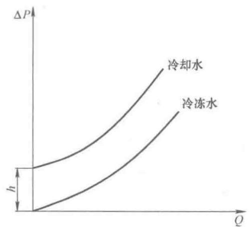  
图 2-1 冷冻水、冷却水管路特性曲线

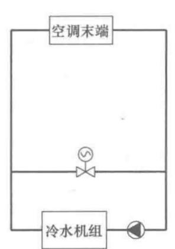  
图 2-2 冷冻水系统示意图

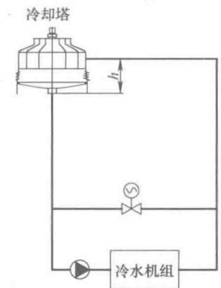  
图 2-3 冷却水系统示意图

管路特性曲线表明：对一定的管路系统来说，通过的流量越多需要外界提供的能量越大；管路性能曲线的形状取决于 S 值的大小，即：取决于管路装置、流体的性质和流动阻力，S 值越大，曲线越陡。

由式（2-3）和式（2-4）可知，减小管路阻力方法有：

1. 按推荐流速合理选择管径；

2. 缩短管道长度；

3. 减小局部阻力，可采取以下措施：

（1）选用阻力小的阀门（如蝶阀）代替阻力大的阀门（如截止阀）；

（2）选用阻力较小的过滤器（过滤器前后安装压力表，以便运行中观察堵塞情况，提醒及时清洗）；

（3）合流三通采用斜接方式；

（4）采用较大半径的弯头；

(5) 取消管路上不必要的管件、阀门。

**2.2 串联管路和并联管路的特性曲线**

流经串联管路各段的流量相等，其总阻力损失为各段阻力损失之和；流体流经并联管路时，各管段的阻力损失相等，通过的总流量为各管段的流量之和。

并联管段按照节点间各支管路的阻力损失相等来分配各支管上的流量，综合阻力系数S大的支管其流量小，S值小的支管其流量大。

在图 2-4 中，管路 2 由 a、b、c 三个支管路并联后又与管路 1、3 的串联。

对于串联管路有如下数学关系：

$$
\Delta P = \Delta P _ {1} + \Delta P _ {2} + \Delta P _ {3} = (S _ {1} + S _ {2} + S _ {3}) \cdot Q ^ {2} = S \cdot Q ^ {2}\tag{2-5}
$$

对于并联管路有如下数学关系：

$$
Q = Q _ {\mathrm{a}} + Q _ {\mathrm{b}} + Q _ {\mathrm{c}}\tag{2-6}
$$

对于管路2有如下关系：

$$
\Delta P _ {2} = S _ {\mathrm{a}} \cdot Q _ {\mathrm{a}} ^ {2} = S _ {\mathrm{b}} \cdot Q _ {\mathrm{b}} ^ {2} = S _ {\mathrm{c}} \cdot Q _ {\mathrm{c}} ^ {2} = \Delta P _ {2} = S _ {2} \cdot Q ^ {2}
$$

则有：

$$
Q _ {\mathrm{a}}: Q _ {\mathrm{b}}: Q _ {\mathrm{c}} = \frac {1}{\sqrt {S _ {\mathrm{a}}}}: \frac {1}{\sqrt {S _ {\mathrm{b}}}}: \frac {1}{\sqrt {S _ {\mathrm{c}}}}\tag{2-7}
$$

$$
S _ {2} = \frac {1}{\left(\frac {1}{\sqrt {S _ {\mathrm{a}}}} + \frac {1}{\sqrt {S _ {\mathrm{b}}}} + \frac {1}{\sqrt {S _ {\mathrm{c}}}}\right) ^ {2}}\tag{2-8}
$$

由式（2-7）可知，在图 2-6 的空调冷冻水系统中，在满负荷调试完水力平衡后，部分负荷下，冷冻水泵进行台数调节或变频调节时，各支路的流量将按等比例分配。

**2.3 并联管路的总特性曲线的图解**

先分别作出三条支管的 $\Delta P_{2}-Q_{a}$ 、 $\Delta P_{2}-Q_{b}$ 、 $\Delta P_{2}-Q_{c}$ 曲线，然后按三条曲阻力相等处的流量相加而得出 $\Delta P_{2}-Q$ ，见图 2-5。

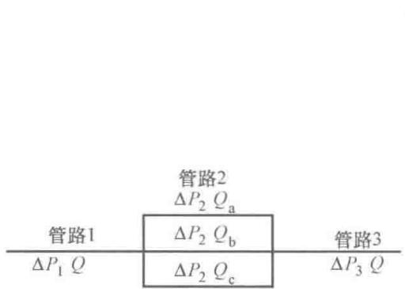  
图2-4 管路的串联和并联

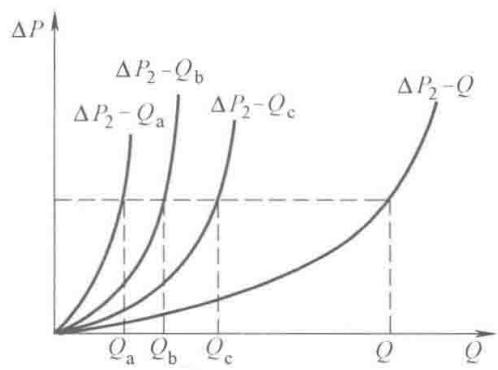  
图 2-5 管路 2 特性曲线

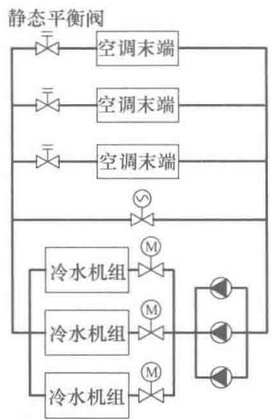  
图 2-6 冷冻水系统示意图

**2.4 串联管路的总特性曲线的图解**

先分别作出三条支管的 $\Delta P_{1}-Q$ 、 $\Delta P_{2}-Q$ 、 $\Delta P_{3}-Q$ 曲线，然后按三条曲线流量相等处的阻力相加而得出 $\Delta P-Q$ ，见图 2-7。

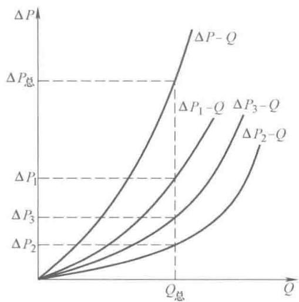  
图 2-7 总管路特性曲线

**2.5 泵与风机的性能**

**2.5.1 泵或风机的功率**

在暖通空调工程设计中，泵与风机的功率一般有有效功率、轴功率和原动机功率。原动机功率一般是指电动机功率。

1. 有效功率 $N_{e}$

单位时间内，流体从泵或风机工作中所获得的实际能量称为有效功率。

$$
N _ {\mathrm{e}} = \gamma \cdot Q \cdot H\tag{2-9}
$$

式中 $N_{e}$ ——有效功率，kW；

$\gamma$ ——流体的容重， $kN/m^{3}$ ;

Q——流量， $m^{3}/s$ ;

H——压头，m；

对于空调系统水泵，有：

$$
N _ {\mathrm{e}} = \frac {\rho \cdot g \cdot Q \cdot H}{1 0 0 0} = g \cdot Q \cdot H\tag{2-10}
$$

式中 $N_{e}$ ——有效功率，kW；

$\rho$ ——流体的密度，kg/m $^{3}$ ;

g——重力加速度， $9.8m/s^{2}$ ;

Q——水泵的流量， $m^{3}/s$ ;

H——水泵扬程，m。

其中，水泵扬程为：

$$
H = \frac {P _ {\mathrm{o}} - P _ {i}}{g} + \Delta h
$$

式中 $P_{0}$ ——水泵出口压力表读数，kPa；

$P_{i}$ ——水泵入口压力表读数，kPa；

$\Delta h$ ——压力表的高差，m。

空调系统风机的全压的单位是 Pa，其有效功率为：

$$
N _ {\mathrm{e}} = \frac {Q \cdot P}{1 0 0 0}\tag{2-11}
$$

式中 Q ——风机的风量， $m^{3}/s$ ;

P——风机的全压，Pa；

2. 轴功率 $N$

轴功率 N 是电动机加在泵或风机转轴上的功率，单位是 kW。轴功率可以通过扭矩仪测得扭矩和转速后求出。

**2.5.2 泵或风机的效率**

泵或风机的效率 $\eta$ 是有效功率 $N_{e}$ 与轴功率 N 的比值。

$$
\eta = \frac {N _ {\mathrm{e}}}{N}\tag{2-12}
$$

式中 $\eta$ ——泵或风机的效率，离心泵一般为 $0.80 \sim 0.92$ ，离心风机一般为 $0.70 \sim 0.90$ ;
N——轴功率，kW;

**2.5.3 电动机功率**

1. 泵或风机在运转时，其电动机的输出功率为：

$$
N _ {\mathrm{g}} = \frac {N _ {\mathrm{e}}}{\eta \cdot \eta_ {\mathrm{d}}}\tag{2-13}
$$

2. 泵或风机在运转时，其电动机的输入功率为：

$$
N _ {\mathrm{g}} ^ {\prime} = \frac {N}{\eta_ {\mathrm{d}} \cdot \eta_ {\mathrm{g}}} = \frac {N _ {\mathrm{e}}}{\eta \cdot \eta_ {\mathrm{d}} \cdot \eta_ {\mathrm{g}} \cdot \eta_ {\mathrm{f}}} = \frac {N _ {\mathrm{e}}}{\eta_ {\mathrm{总}}}\tag{2-14}
$$

式中 $N_{g}$ ——电动机的输出功率，kW；

$N_{g}^{\prime}$ ——电动机的输入功率，kW；

$\eta_{d}$ ——传动效率，直联传动为1.0；由联轴器传动为0.98；由三角皮带传动为0.95；

$\eta_{g}$ ——电动机效率；Y系列异步电动机额定效率一般为0.73～0.94；对于变频运行的风机水泵，在不同的转速下电机效率是不同的；

$\eta_{f}$ ——变频器的效率，在不同的转速下变频器效率是不同的；

$\eta$ ——泵或风机的效率。

$\eta_{总}$ ——泵或风机的总效率（考虑了变频器、电动机及传动之后的效率）。

3. 泵或风机各种功率效率的关系

泵或风机各种功率效率的关系可形象地表示为图 2-8 和图 2-9。

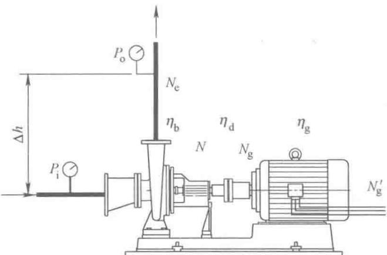  
图 2-8 泵与风机的功率传递关系

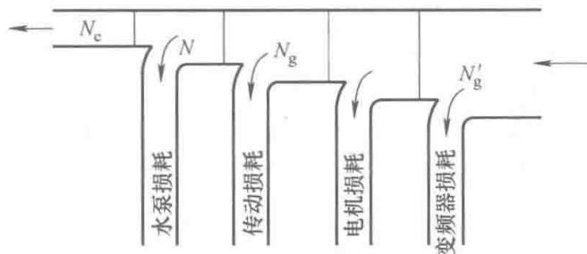  
图 2-9 泵与风机的功率传递关系

**2.5.4 选择电动机的功率**

选择电动机的功率应考虑一定的安全系数。

$$
N _ {\mathrm{M}} = K \cdot N _ {\mathrm{g}} ^ {\prime} = K \frac {N _ {\mathrm{e}}}{\eta_ {\mathrm{总}}}\tag{2-15}
$$

式中 $N_{M}$ ——选择电动机的功率，kW；

K——电动机的容量安全系数（见表2-1），在选择电动机时，考虑到过载的可能，通常在电动机功率的基础上考虑一定的安全系数。

电动机的容量安全系数  
表2-1

<table><tr><td rowspan="3">电动机功率(kW)</td><td colspan="4">K值</td></tr><tr><td colspan="3">离心式</td><td rowspan="2">轴流式</td></tr><tr><td>一般用途</td><td>灰尘</td><td>高温</td></tr><tr><td>&lt;0.5</td><td>1.5</td><td>—</td><td>—</td><td>—</td></tr><tr><td>0.5~1.0</td><td>1.4</td><td>—</td><td>—</td><td>—</td></tr><tr><td>1~2.0</td><td>1.3</td><td>—</td><td>—</td><td>—</td></tr><tr><td>2~5.0</td><td>1.2</td><td>—</td><td>—</td><td>—</td></tr><tr><td>&gt;5.0</td><td>1.15</td><td>1.2</td><td>1.3</td><td>1.05~1.1</td></tr></table>

由上式求出 $N_{M}$ 后，并根据国家标准 Y 系列电机功率规格选配。由此可知，由泵或风机产品样本所查出的泵或风机的配电功率与有效功率不是一回事，泵或风机在运行时所需的有效功率直接反映在它当时所提供的流量和压头上，而这时电动机的实时输入功率由运行电流和工作电压及功率因数决定，并且它们有如下关系：

$$
N _ {\mathrm{g}} ^ {\prime} = \sqrt {3} U \cdot I \cdot \cos \varphi\tag{2-16}
$$

该功率值可以用电工仪表直接检测出来。因此水泵在运行时有如下关系：

$$
g \cdot Q \cdot H / \eta_ {\mathrm{总}} = \sqrt {3} \cdot U \cdot I \cdot \cos \varphi
$$

上式说明，对于电压恒定的定频水泵，其运行电流 I 随水泵的流量 Q 与扬程 H 的乘积的变化而变化。

**2.5.5 泵或风机变频调速后效率**

泵或风机通过变频器变频调速后，其电机的功耗和变频器的功耗也会改变，也就是说变频后电机的效率和变频器的效率都会改变，且有如下关系 $^{[14]}$ ：

$$
\eta_ {\mathrm{g}} = 0. 9 4 1 8 7 \times (1 - e ^ {- 9. 0 4 \mathrm{k}})\tag{2-17}
$$

$$
\eta_ {\mathrm{f}} = 0. 5 0 8 7 + 1. 2 8 3 k - 1. 4 2 k ^ {2} + 0. 5 8 3 4 k ^ {3}\tag{2-18}
$$

式中 k ——变速比，即新转速与原转速的比值；

**2.6 泵与风机的性能曲线**

泵与风机的性能曲线是指在一定的进口条件和转速时，泵与风机的基本性能参数之间都相互存在着一定的内在联系，将泵或风机所提供的流量与压头之间的关系（H-Q）、泵或风机所提供的流量与所需外加轴功率之间的关系（N-Q）、泵或风机所提供的流量与设备本身效率之间的关系（ $\eta$ -Q）以曲线形式在以流量为横坐标的图上来表达，这些曲线叫做性能曲线。以H-Q曲线为最重要。

由于泵与风机内的损失还难以精确计算，性能曲线至今还不能用理论的方法精确绘制，所以通常用实验方法绘制性能曲线。

**2.6.1 泵与风机的 $H - Q$ 曲线**

泵与风机的 H-Q 曲线形状有三类，如图 2-10 所示。

1. 曲线 a 为平坦形，即：当流量变化较大时，能保持基本恒定的压头。较适合冷冻水一次泵定流量系统的冷冻水泵。

2. 曲线 b 为陡降形，即：当流量变化不大时，而扬程、全压变化较大。采用变频控制的水泵、风机具有此种性能曲线时，节能效果明显。

3. 曲线 c 为驼峰形，这种驼峰形性能曲线在上升段工作是不稳定的。在设备选型时，希望其性能曲线不出现上升段，或者出现但上升段的区域越窄越好。

**2.6.2 泵与风机的 $N - Q$ 曲线**

泵与风机的 N-Q 曲线形状与叶轮的叶形有关，对于暖通空调常用的泵与风机，基本上是 N 随 Q 的增大而增大的曲线。如图 2-11 所示。对于水泵可根据 $N=g \cdot Q \cdot H/\eta$ 绘出。

**2.6.3 泵与风机的 $\eta - Q$ 曲线**

泵与风机的 $\eta - Q$ 曲线根据下式绘出：

$$
\eta = \frac {N _ {e}}{N} = \frac {\gamma \cdot Q \cdot H}{N}
$$

$\eta-Q$ 曲线上有一最高效率 $\eta_{max}$ 点。泵与风机在此工况下运行，经济性最佳，如图 2-11 所示。

选择泵与风机时，应考虑让它们将来经常运行在最高效率点及其附近的区域。

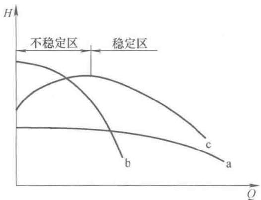  
图 2-10 泵与风机的 H-Q 性能曲线

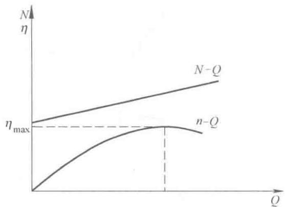  
图 2-11 泵与风机的 N-Q、 $\eta$ -Q 性能曲线

**2.7 水泵的特性曲线的数学表达**

在节能改造项目中，往往无法得到运行很久的水泵的特性曲线，这就需要工程师通过现场测试获得。

通过检测水泵的各个工况点的参数，用 Excel 做散点数据趋势预测和回归分析，可以得出拟合曲线和水泵的回归方程（也就是常说经验公式）。

$H - Q$ 曲线：

$$
H = a Q ^ {2} + b Q + c\tag{2-19}
$$

$\eta - Q$ 曲线：

$$
\eta = e Q ^ {2} + d Q + f\tag{2-20}
$$

过程如下：

1. 将测试得到的某水泵的流量、扬程。将其输入到 Excel 表并选中。

2. 进入插入菜单，点击散点图，将自动生成一个散点图片。

3. 鼠标点选图片上的散点并按右键，出现选择菜单，选择添加趋势曲线。

4. 在趋势曲线选项中，选择多项式和显示公式，便可生成 H-Q 曲线（见图 2-12）。同理，可获得 $\eta-Q$ 曲线（见图 2-13）。

<table><tr><td>x(流量m3/h)</td><td>150</td><td>225</td><td>300</td><td>375</td><td>450</td><td>525</td><td>600</td></tr><tr><td>y(扬程mH2O)</td><td>26.2</td><td>26</td><td>25.6</td><td>24.6</td><td>23</td><td>20.5</td><td>17</td></tr></table>

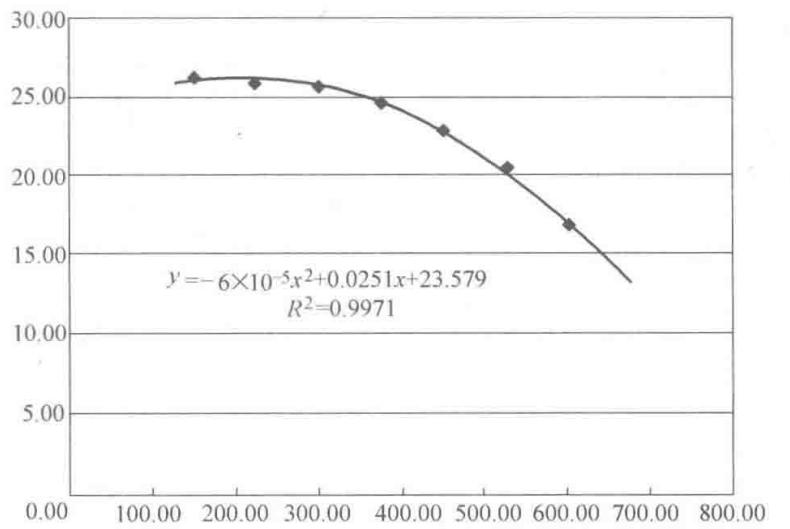  
图 2-12 水泵的 H-Q 性能曲线

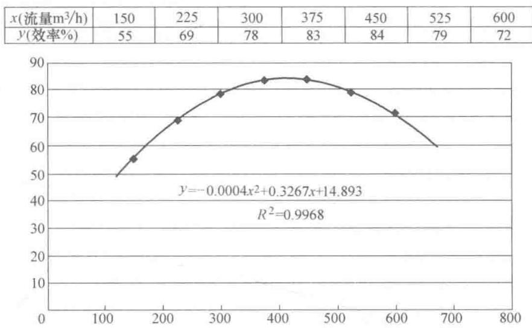  
图2-13 水泵的 $\eta -Q$ 性能曲线

**2.8 空调水系统水泵的种类**

目前空调冷冻水系统、冷却水系统及热水系统的循环水泵都是直联传动的单级清水离心泵，所配电机一般为三相异步电机，因此，根据电机的特性，水泵的额定转速有两种，即：1450r/min 和 2900r/min。循环水泵的形式分为：卧式泵和立式泵（见图 2-14）。

**2.8.1 卧式泵**

卧式泵的优点是便于维修，缺点是占地面积大、水泵的动平衡不好时振动较大，需要做严格的减振设计。在冰蓄冷乙二醇系统中，由于乙二醇的腐蚀作用，运行几年的卧式泵动平衡常常会被破坏，使振动加剧。将其设置在居住建筑地下室及医院的大型医疗设备（核磁、CT、直线加速器）附近时，需要特别注意其振动的影响。

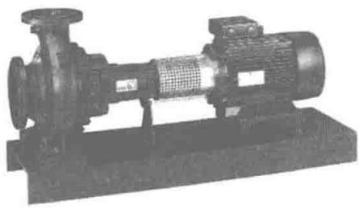  
(a)

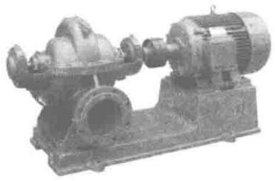  
(b)

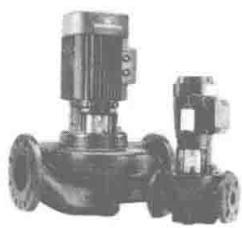  
(c)

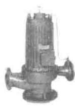  
(d)  
图 2-14 暖通空调常用离心泵  
(a) 卧式端吸离心泵；(b) 卧式双吸离心泵；(c) 立式离心泵；(d) 立式屏蔽离心泵

小流量的卧式泵一般采用端吸泵，大流量（大于 $700m^{3}/h$ ）的一般采用双吸泵。

**2.8.2 立式泵**

**1. 普通立式泵**

立式泵的优点是占地面积小，基本上无振动。运行中的立式泵像陀螺一样有自平衡作用。缺点是大流量的立式泵电机较重，不宜拆卸更换轴封。目前有采用联轴器分离设计的立式泵可以解决这个问题。

**2. 屏蔽泵**

屏蔽泵是立式泵的一种，它将叶轮与电动机的转子连成一体装在同一个密封壳体内而形成的一种全封闭泵。普通离心泵的驱动是通过联轴器将泵的叶轮轴与电动机轴相连接，使叶轮与电动机一起旋转而工作，而屏蔽泵是一种无密封泵，泵和驱动电机都被密封在一个被泵送介质充满的压力容器内，此压力容器只有静密封，并由定子绕组来提供旋转磁场并驱动转子。这种结构取消了传统离心泵具有的旋转轴密封装置，故能做到完全无泄漏。

屏蔽泵的结构特点：泵的叶轮与电动机的转子在同一根轴上，没有联轴器和轴封装置，从根本上解决了被输送液体的外泄问题。屏蔽泵利用其输送的介质来对电机冷却，没有电机的冷却风扇，具有噪声低的特点。对于供热系统，由于冷却电机的水是热水，因此设计时需要采用耐高温的屏蔽泵。由于在电机的转子和定子之间存在两个屏蔽套，使得电机的定子与转子之间的间隙加大，造成电机的性能下降，同时在屏蔽套中还会产生涡流，增加了电机的铁损，所以屏蔽泵的效率通常低于端吸机械密封离心泵。

**2.9 水泵的节能标准**

正规的厂家样本都会给出水泵的效率、电机的效率，两者的乘积就是水泵的总效率。

有关水泵节能的国家标准有《清水离心泵能效限定值及节能评价值》GB 19762—2007该标准给出了泵的最低能效限定值和判定为节能泵的效率值。前者是强制的，后者为非强制的，用于节能认证。该标准是用于水泵制造的标准。

当流量在 $5 \sim 10000 ~m^{3}/h$ 、比转速在 $20 \sim 300$ 范围内，单级清水离心泵的能效限定值，如表 2-2 所示。

由表 2-2 可以看出，在中央空调常用的流量范围 $200 \sim 1500 ~m^{3}/h$ 内，水泵的效率都

可以达到 80% 以上。

单级清水离心泵的能效限定值  
表2-2

<table><tr><td> $Q(m^{3}/h)$ </td><td>5</td><td>10</td><td>15</td><td>20</td><td>25</td><td>30</td><td>40</td><td>50</td><td>60</td><td>70</td><td>80</td></tr><tr><td>基准值 $\eta$ (%)</td><td>58</td><td>64</td><td>67.2</td><td>69.4</td><td>70.9</td><td>72</td><td>73.8</td><td>74.9</td><td>75.8</td><td>76.5</td><td>77</td></tr><tr><td>能效限定值 $\eta_{2}$ (%)</td><td>56</td><td>62</td><td>65.2</td><td>67.4</td><td>68.9</td><td>70</td><td>71.8</td><td>72.9</td><td>73.8</td><td>74.5</td><td>75</td></tr><tr><td> $Q(m^{3}/h)$ </td><td>90</td><td>100</td><td>150</td><td>200</td><td>300</td><td>400</td><td>500</td><td>600</td><td>700</td><td>800</td><td>900</td></tr><tr><td>基准值 $\eta$ (%)</td><td>77.6</td><td>78</td><td>79.8</td><td>80.8</td><td>82</td><td>83</td><td>83.7</td><td>84.2</td><td>84.7</td><td>85</td><td>85.3</td></tr><tr><td>能效限定值 $\eta_{2}$ (%)</td><td>75.6</td><td>76</td><td>77.8</td><td>78.8</td><td>80</td><td>81</td><td>81.7</td><td>82.2</td><td>82.7</td><td>83</td><td>83.3</td></tr><tr><td> $Q(m^{3}/h)$ </td><td>1000</td><td>1500</td><td>2000</td><td>3000</td><td>4000</td><td>5000</td><td>6000</td><td>7000</td><td>8000</td><td>9000</td><td>10000</td></tr><tr><td>基准值 $\eta$ (%)</td><td>85.7</td><td>86.6</td><td>87.2</td><td>88</td><td>88.6</td><td>89</td><td>89.2</td><td>89.5</td><td>89.7</td><td>89.9</td><td>90</td></tr><tr><td>能效限定值 $\eta_{2}$ (%)</td><td>83.7</td><td>84.6</td><td>85.2</td><td>86</td><td>86.6</td><td>87</td><td>87.2</td><td>87.5</td><td>87.7</td><td>87.9</td><td>88</td></tr></table>

注：1. 表中单级双吸离心水泵的流量是指全流量值。  
2. 基准值是当前泵行业较好产品效率平均值。

比转速 $(n_{s})$ ：比转速是在相似定律的基础上导出的一个包括流量、扬程和转数在内的综合特征数，它是计算泵结构参数的基础。一台泵只有一个比转速，变转速时比转速不变。比转速并不具有转速的物理概念，它是由相似条件得出的一个综合性参数，但它本身不是相似准则。保持相似的两台机器，比转速相等；然而两机器比转数相等却不一定相似。比转数随运行工况而变，一般所指的机器比转数是按最高效率点或额定工况点的参数计算的。比转速由下式计算：

$$
n _ {\mathrm{s}} = \frac {3 . 6 5 n \sqrt {Q}}{H ^ {3 / 4}}
$$

式中 Q —— 流量， $m^{3}/s$ （双吸泵计算流量时取 Q/2）；

$H$ ——扬程， $\mathrm{m}$

n ——转速，r/min;

**2.10 水泵的选择**

**2.10.1 空调系统循环泵选型时依据的参数**

**1. 流量、扬程**

高扬程的泵用于低扬程，便会出现流量过大，导致电机超载，若长时间运行，电机温度升高，甚至会烧毁电机。小流量泵在大流量下运行时，会产生气蚀，泵长时间气蚀，影响水泵过流部件的寿命。

**2. 水泵的工作压力**

空调系统循环泵一般要求是在管路上的电动阀门开启之前启动，详见本书“第4.3.2节 电动隔断蝶阀的控制”。因此，水泵的工作压力 $=$ 水泵在管路阀门关闭时的扬程 $+$ 水泵入口静压。水泵在管路阀门关闭时的扬程如图2-15所示。

**3. 介质类型**

介质类型，如：水、乙二醇等，要考虑介质的特性对选型的影响，如：密度、黏度、腐蚀性等。

（1）密度：离心泵的流量、扬程、效率都与密度无关；

（2）黏度：介质的黏度对泵的性能影响很大，黏度过大时，泵的压头（扬程）减小，流量减小，效率下降，泵的轴功率增大。一般样本上的参数均为输送清水时的性能，当输送黏性介质（如乙二醇等）时应进行换算。

**4. 介质温度**

高温介质需考虑密封材料的选择及材料的热膨胀系数。介质温度偏低时，考虑采用低温润滑油和低温电机。如：应用在供热系统的屏蔽泵，采用被输送的热水来为电机冷却，需要特殊的结构材料设计。

**5. 水泵的效率**

空调水泵的选择应当使其设计工况点在高效率区域内。

**2.10.2 变频水泵的选择**

由于设计师在选择水泵时都要将其流量、扬程乘以 1.1 的安全系数，这样一来就使得其最高效率点偏到 A 点的右上方，而真正的工作点却不是最高效率点（见图 2-16）。对于一般的定流量系统这种偏差不是很大，但是对于一次泵变流量空调冷冻水系统情况可能就大不同。

图 2-16 中，曲线 $n$ 、 $n_{1}\cdots n_{n}$ 为变频冷冻水泵在不同转速下的性能曲线，曲线 a 为设计工况管路曲线，A 点为设计工况点，曲线 b 为运行曲线，即水泵在变频调节时各个运行工况点的集合（详见第 3.1 节）。因为随着空调负荷的变化，变流量系统的变频冷冻水泵多数时间是工作在 65%～85% 的负荷状态。水泵只有在工作时间最多的时段运行效率最高才是最节能的。而不是仅仅保证设计工况的效率最高。因此要达到节能运行的目的，水泵的最高效率应该在曲线 b 上的 1-2 段之间，图中 $\eta_{\max}(1-2)$ ，这一区间应该是在 A 点的左下方。因此对于变频泵选型时，应根据其长期运行的区间，对其最高效率点的位置进行复核。至少应该在设计工况点的左下方，而不是在设计工况点的右上方。

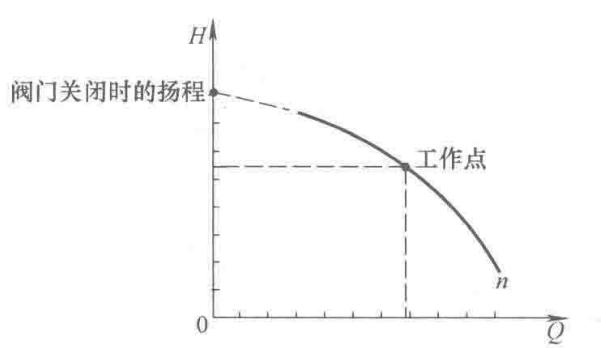  
图 2-15 阀门关闭时的水泵扬程

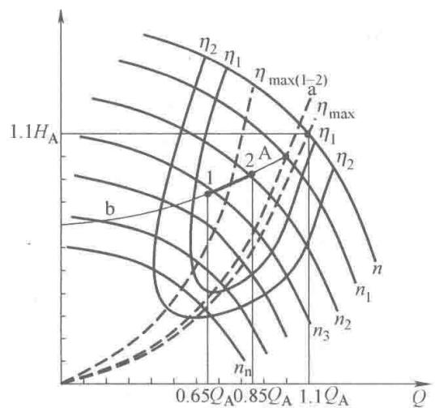  
图 2-16 变频冷冻水泵的选型

**2.11 空调风机的种类**

民用建筑空调通风系统采用的风机主要有离心风机、轴流风机、无动力风机（也称无动力风帽）。其他种类的风机应用很少。

**2.11.1 离心风机**

当电动机通过皮带轮带动装于轴承上的风机主轴时，叶轮将高速旋转，通过叶片推动空气，使空气获得一定能量而由叶轮中心四周流动。当气体流经蜗壳时，由于体积逐渐增大，使部分动能转化为压力能，然后从排风口进入管道。当叶轮旋转时，叶轮中心形成一定的真空度，此时吸气口处的空气在大气压力下被压入风机。这样，随着叶轮的连续旋转，空气即不断地被吸入和排出，完成送风任务。一般情况下，离心风机的流量和压头较轴流风机高。

随着技术的不断进步，特别是电机技术的进步，更加节能的新型离心风机在暖通空调领域得以应用。

**1. 离心风机箱**

离心风机用在通风系统中常常以离心风机箱的形式应用，风机箱的优点是接管方便、噪声低。分为电机内置和电机外置两种形式。当用于消防排烟和防爆场合应采用电机外置的形式。

**2. 外转子风机**

采用外转子电机制作的风机被称为外转子风机。它可以是离心风机也可是轴流风机。

传统的电动机是定子在外，转子旋转产生动力。外转子电机是与之相反的结构，定子在电动机的中间，转子在外。外转子风机是采用了外转子电机直接带动叶轮的先进结构和合理的气动设计，而具有效率高、噪声低、重量轻、结构紧凑、安装维修方便等特点。采用普通的感应电机的外转子风机，由于没有皮带轮的增速，风机的转速低，风机的风压较小。图 2-17 所示的离心式管道风机就是外转子风机的一种。

**3. 直联式无蜗壳风机**

如图 2-18 所示的风机，也被称为静压箱风机，也可以是外转子风机。有蜗壳离心风机的出口风速是有方向且不均匀的。如果在其静压复得尚未完全完成阶段就遇到风道转向，会产生较大的能量损失。如果把无蜗壳离心风机放在这个风向转向处，就可以完全避免这个能量损失。该类风机常用于净化空调机组内，优点是无传动皮带，可以有效避免皮带掉渣对过滤器的污染，同时在空调箱的断面上的风压均匀。

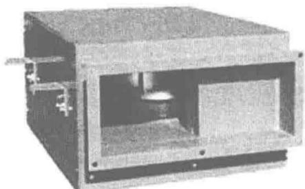  
图 2-17 外转子管道风机

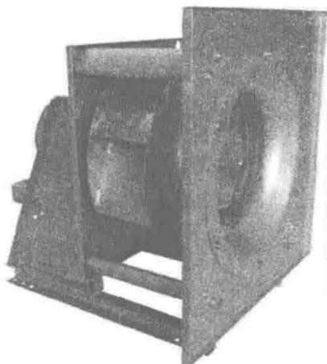  
图 2-18 直联式无蜗壳风机

**2.11.2 EC风机**

EC 风机是一种外转子风机，是采用了外转子 EC 电机的风机。可以是离心式，也可以是轴流式。常用于直联式无蜗壳离心风机。EC 电机为内置调速控制模块的永磁无刷直流电机，自带 RS 485 输出接口、0～10V 传感器输出接口、4～20mA 调速开关输出接口、报警装置输出接口及主从信号输出接口。

由于采用了永磁体励磁，消除了感应电机励磁电流产生的损耗；同时永磁电动机工作于同步运行方式，消除了感应电机转子铁心的滑差损耗。这两方面使永磁无刷直流电机的运行效率远高于感应电机。EC风机具有功率因数高、调速性能好、控制简单等特点。在节能改造工程中得到很好的应用。由图2-19（a）可以看出，EC风机在同样功率下，效率高于交流外转子电机。

EC 风机的电机容量做不了太大，目前最大可做到 11kW。更大风量应用需求，可以采用多个 EC 风机并联组成风机墙来实现。

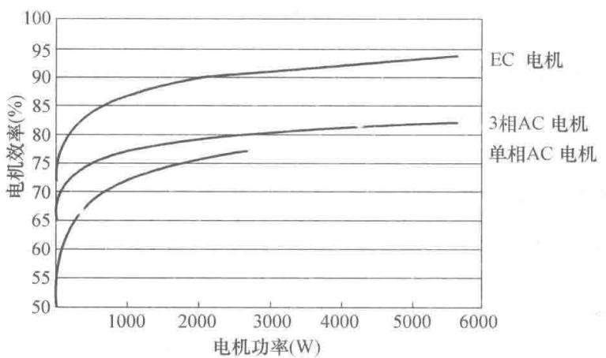  
(a)

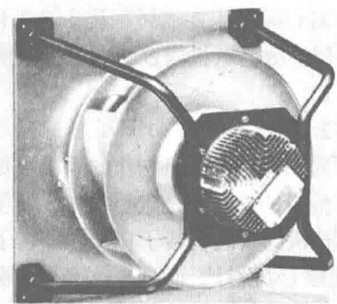  
(b)  
图 2-19 EC 风机  
(a) EC 电机与交流外转子电机效率对比；(b) EC 风机

**2.11.3 防爆风机**

民用建筑中使用的风机归类为一般用途的风机，但是在民用建筑中还有些需要防爆场合，如燃气表间、燃气锅炉房等，这些场所泄漏的易燃气体与空气的混合物遇到火花、电弧或危险高温就会被点燃，形成燃烧或爆炸。因此，这些场所的通风需要用到防爆风机。

所谓防爆风机应该满足：

1. 必须使用防爆电机。防爆电机是一种可以在易燃易爆场所使用的一种电机，运行时不产生电火花。

电机按防爆原理可分为隔爆型电机、增安型电机、正压型电机、无火花型电机及粉尘防爆电机等。

2. 对叶轮材质及叶轮相对应的机壳内壁位置材料有要求，要求它们在万一出现碰擦情况时不会产生火花，比如使用铝叶轮和铁内壁，或者铁叶轮并在内壁加铝环等。

防爆电机作为电气设备需满足《爆炸危险环境电气装置设计规范》GB 50058—2014和《爆炸性环境 第1部分：设备 通用要求》GB 3836.1—2010。

**2.12 泵与风机的相似定律**

由于流体在泵或风机内的运动情况十分复杂，所以新产品的设计往往是根据现有的设备参数作为依据，通过相似原理确定新产品的参数。这样泵或风机都是按系列设计的，同一系列中，大小不等的泵或风机都是相似的。

泵或风机凡满足几何相似、运动相似和动力相似，它们之间存在着相似的关系，必定满足相似定律。

在泵与风机的相似定律中，在 $\frac{D_1}{D_2}$ 和 $\frac{n_1}{n_2}$ 不太大时，可近似认为其效率相等。此时，相似定律可以表示为下列三个公式：

流量转速公式：

$$
\frac {Q _ {1}}{Q _ {2}} = \left(\frac {D _ {1}}{D _ {2}}\right) ^ {3} \frac {n _ {1}}{n _ {2}}\tag{2-21}
$$

水泵扬程转速公式：

$$
\frac {H _ {1}}{H _ {2}} = \left(\frac {D _ {1}}{D _ {2}} \frac {n _ {1}}{n _ {2}}\right) ^ {2}\tag{2-22}
$$

或风机压头转速公式：

$$
\frac {P _ {1}}{P _ {2}} = \frac {\rho_ {1}}{\rho_ {2}} \left(\frac {D _ {1}}{D _ {2}} \frac {n _ {1}}{n _ {2}}\right) ^ {2}
$$

功率转速公式：

$$
\frac {N _ {1}}{N _ {2}} = \frac {\rho_ {1}}{\rho_ {2}} \left(\frac {D _ {1}}{D _ {2}}\right) ^ {5} \left(\frac {n _ {1}}{n _ {2}}\right) ^ {3}\tag{2-23}
$$

以上三式中， $D_{1}$ 、 $Q_{1}$ 、 $H_{1}$ 、 $n_{1}$ 是编号为1的水泵或风机的叶轮直径、流量、压头及转速； $D_{2}$ 、 $Q_{2}$ 、 $H_{2}$ 、 $N_{2}$ 是编号为2的水泵或风机的叶轮直径、流量、压头及转速；P为风机的压头， $\rho$ 为空气的密度。

**2.13 泵与风机的比例定律**

前文提到相似定律用于泵或风机的产品开发设计，而在暖通空调系统中往往用到比例定律来进行节能、控制运行分析。

根据泵与风机的相似定律，可以得出同一台泵或风机在不同的转速下工作时，它们的参数之间的关系，也叫比例定律：

$$
\frac {Q _ {1}}{Q _ {2}} = \frac {n _ {1}}{n _ {2}}\tag{2-24}
$$

$$
\frac {H _ {1}}{H _ {2}} = \left(\frac {n _ {1}}{n _ {2}}\right) ^ {2}\tag{2-25}
$$

$$
\frac {N _ {1}}{N _ {2}} = \left(\frac {n _ {1}}{n _ {2}}\right) ^ {3}\tag{2-26}
$$

式中 $Q_{1}$ 、 $H_{1}$ 、 $N_{1}$ ——转速为 $n_{1}$ 时，泵或风机的流量、压头及功率；

$Q_{2}$ 、 $H_{2}$ 、 $N_{2}$ ——转速为 $n_{2}$ 时，泵或风机的流量、压头及功率。

以上三个公式被称为泵与风机的比例定律，是调节泵或风机性能的基本依据。

当某一泵或风机所输送的介质温度或压强发生变化时，介质的密度也将改变，由相似定律又可得出：

$$
\frac {H _ {1}}{H _ {2}} = \frac {\rho_ {1}}{\rho_ {2}} = \frac {\gamma_ {1}}{\gamma_ {2}}\tag{2-27}
$$

$$
Q _ {1} = Q _ {2}\tag{2-28}
$$

$$
\frac {N _ {1}}{N _ {2}} = \frac {\rho_ {1}}{\rho_ {2}} = \frac {\gamma_ {1}}{\gamma_ {2}}\tag{2-29}
$$

式（2-27）～式（2-29）告诉我们，水泵按清水介质选择后，如果输送的流体密度不同，需根据上式对其扬程和轴功率进行修正，如冰蓄冷工程中的乙二醇循环泵，而体积流量不变。

同时，按标准大气压下确定的风机参数，用于高原等气压低的地区时，需根据上式对其压头和轴功率进行修正，而体积流量不变。

**2.14 比例定律的应用条件**

在工程设计中经常用到比例定律来分析水泵或风机在变频调速前后的节能情况，但是这些比例定律的应用是有前提条件的，即：只有在相似抛物线上的工况点才可以应用比例定律。水泵变速工况相似的工程条件可归纳为：

1. 管路曲线必需为通过原点的曲线；

2. 所有并联水泵同时变速；

3. 管路特性曲线不改变。

**2.15 泵或风机改变转速后特性曲线的求解**

泵或风机改变转速后，特性曲线的求解有两种方法，即通过作图法求解和通过公式计算来求解。

**2.15.1 作图法求解**

**1. $H - Q$ 曲线求解**

如图 2-20 所示，欲求泵或风机由转速 $n_{1}=1450r/min$ 降低到 $n_{2}=1200r/min$ 时的 $H_{2}-Q_{2}$ 曲线，先在转速为 1450r/min 时的 $H_{1}-Q_{1}$ 上任意取 1、2、3、4 状态点，将其流量、压头代入式（2-24）和式（2-25），便可求出相似状态点 $1'$ 、 $2'$ 、 $3'$ 、 $4'$ 的流量、压头，用曲线将它们光滑连接，便可得到转速为 1200r/min 时的 $H_{2}-Q_{2}$ 曲线。

状态点 1 Q=10, H=4.7; 状态点 $1'$ $Q_{1}'=8.26$ , $H_{1}'=3.20$ ;

状态点 2 Q=7, H=8.3; 状态点 $2'$ $Q_{2}^{\prime}=5.80$ , $H_{2}^{\prime}=5.67$ ;

状态点 3 Q=5, H=9.6; 状态点 $3'$ $Q_{3}'=4.13$ , $H_{3}'=6.56$ ;

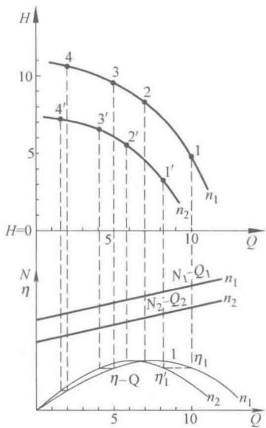

状态点 4 Q=2, H=10.6。状态点 $4'$ $Q_{4}^{\prime}=1.65$ , $H_{4}^{\prime}=7.23$ 。

2. 利用作图法同样可得出 $N_{2}-Q_{2}$ 曲线。

3. 相似点的效率

图 2-20 转速变化时泵与风机的性能曲线

比例定律应用的前提是：在转速变化不大时，相似点的效率相等。在图2-20中，通过作图可得 $n_{2}$ 时的 $\eta-Q$ 曲线；该曲线在转速变化不大时，基本上是平行移动，转速升高，向右移动，转速降低，向左移动。

**2.15.2 利用公式求解**

由式（2-19）可知水泵的 H-Q 曲线：

$$
H = a Q ^ {2} + b Q + c
$$

当水泵转速由 $n_{1}$ 变为 $n_{2}$ 时，令变速比 $k=\frac{n_{2}}{n_{1}}$ 。

则变速后的 $H - Q$ 曲线：

$$
H = a Q ^ {2} + b k Q + c k ^ {2}\tag{2-30}
$$

输入不同的 k 值，将得到一组曲线。

同理可得变速后的 $N - Q$ 曲线：

$$
N = \frac {H \cdot Q \cdot g \cdot k ^ {3}}{\eta}\tag{2-31}
$$

**2.16 泵与风机的等效率线**

由比例定律可得出下式

$$
\frac {H _ {1}}{H _ {2}} = \left(\frac {Q _ {1}}{Q _ {2}}\right) ^ {2}
$$

由上式可得下式

$$
\frac {H _ {1}}{Q _ {1} ^ {2}} = \frac {H _ {2}}{Q _ {2} ^ {2}} = \dots = K
$$

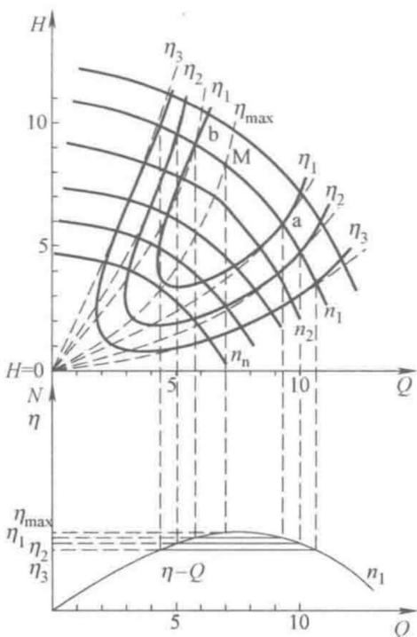  
图 2-21 泵与风机的相似抛物线

则

$$
H = K \cdot Q ^ {2}\tag{2-32}
$$

对于任何一个已知性能曲线的泵或风机，K 为一个常数，上式被称为相似抛物线方程，落在方程曲线上的工况点彼此相似，效率相等，所以相似抛物线又称为等效率线（见图 2-21）。

管路曲线也是抛物线，如果将相似抛物线看成管路曲线，在管路曲线不变的前提下，变速调节前后的工作点是相似的，也就是说工作点的效率是不变的。

在图 2-21 中，在泵或风机的转速为 $n_{1}$ 时，在 $\eta-Q$ 曲线上取 $\eta_{max}$ 点，过 $\eta_{max}$ 点向上作直线，与 H-Q 曲线交于工况点 M，工况点 M 的效率为最高，等效率线为 $\eta_{max}$ 。

在 $\eta-Q$ 曲线上取效率等于 $\eta_{1}$ 点，这样的点有两个，过 $\eta_{1}$ 点向上作直线，与 H-Q 曲线交于工况点 a 和工况点 b，过工况点 a 和工况点 b 等效率线为 $\eta_{1}$ 。

当泵或风机的转速由 $n_{1}$ 变化到 $n_{n}$ 时， $\eta-Q$ 曲线向左移动，工况点 a 和工况点 b 的无数个相似点，连成一条效率为 $\eta_{1}$ 的曲线。同理可以得到效率分别为 $\eta_{2}$ 、 $\eta_{3}$ 的曲线。这些曲线叫作泵与风机的等效率曲线。图 2-21 中的这些曲线叫作泵或风机的通用性能曲线。

通用性能曲线表达了不同转速下的 H-Q 曲线，同时，等效率曲线又标明了最佳工作区域。

等效率曲线在转速变化不太大时，与相似抛物线重合，而在转速偏大或偏小时，相似工况点效率不再相等，因此此时相似抛物线上的效率也不相等。

**2.17 泵或风机的联合运行**

在实际工作中有时需要将泵或风机并联或串联在管路系统中联合运行，目的在于增加系统中的流量或提高压头或对系统流量、压头进行调节。

**2.17.1 并联工况分析**

**1. 两台同型号的冷冻水泵并联**

图 2-22 所示为一次泵定流量冷冻水系统，两台同型号的冷冻水泵并联运行，并联后产生的扬程与各泵产生的扬程都相等、并联后的总效率与单台泵的效率一致。管路中的总流量为两台水泵流量之和。在图 2-23 中，单台水泵的性能曲线为 $(H-Q)_{1,2}$ ，通过压力相等时，总流量 $Q_{1+2}=2Q_{1}$ ，得出水泵的并联性能曲线 $(H-Q)_{1+2}$ 。同理，单台水泵的效率曲线为 $(\eta-Q)_{1,2}$ ，通过效率相等时，总流量 $Q_{1}+2=2Q_{1}$ ，得出水泵的并联效率曲线 $(\eta-Q)_{1+2}$ 。

**2. 两台型号不同，但相差不大的泵的并联**

如图 2-24 所示，两台泵并联后合成性能曲线只有在 A 点右侧才能正常工作。A 点左侧，只有一台泵工作，无法并联运行。

**2.17.2 串联工况分析**

图 2-25 所示为二次泵变流量冷冻水系统，两台不同型号的冷冻水泵串联运行，串联后产生的扬程为各泵产生的扬程之和。通过水泵的流量均相等（平衡管内的流量为0），在图2-26中，单台水泵的性能曲线分别为a、b。通过流量相等时，总扬程 $H=H_{a}+H_{b}$ ，得出水泵的串联性能曲线c。

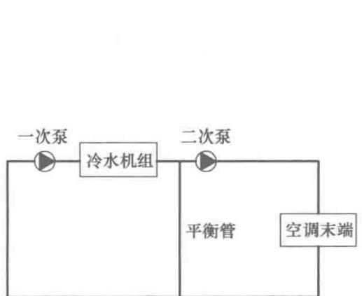

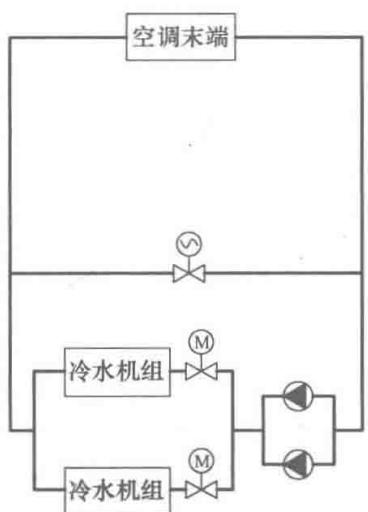  
图 2-22 冷冻水系统示意图

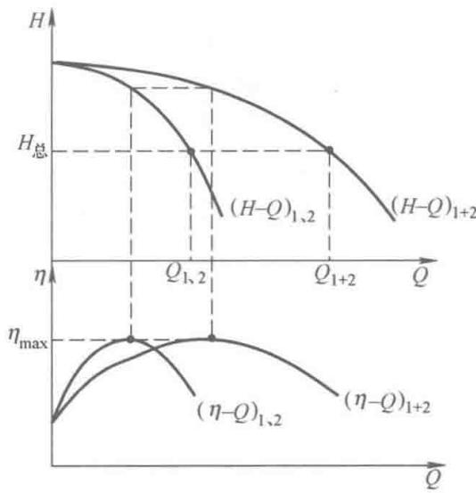  
图 2-23 两台型号相同的泵并联的 H-Q、 $\eta$ -Q 性能曲线

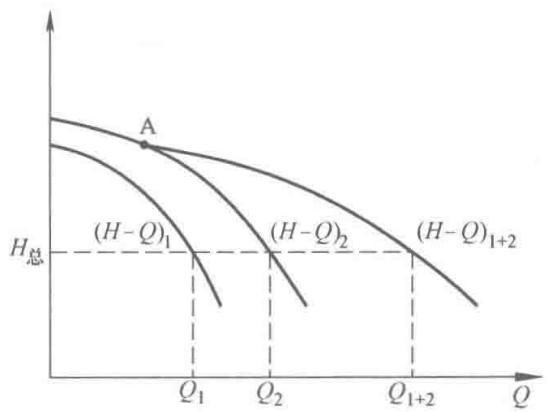  
图2-24 两台相差不大的泵并联的 $H - Q$ 性能曲线

图 2-25 冷冻水系统水泵串联示意图  
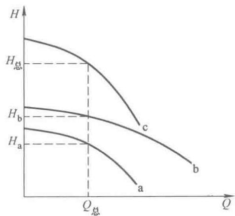  
图 2-26 泵串联的 H-Q 性能曲线

**2.18 泵与风机的工况调节**

**2.18.1 泵与风机的工作点**

如果将某一转速下泵或风机性能曲线和管路性能曲线按同比例绘于同一坐标上（见图

2-27)，则两条曲线相交于A点，A点就是泵或风机在该管路系统中运行的工作点。如果该点所表明的参数能满足工程提出的要求，而又处在泵或风机的高效率区域范围内，这样的工作点是合理的、经济的。

如果泵或风机性能曲线为驼峰形，则它与管路性能曲线交点可能有两个，如图2-28所示。其中在泵或风机性能曲线下降段的交点为稳定工作点，而在其上升段的交点则是不稳定工作点。如果泵或风机在B点工作，由于某种原因使工作点离开B点向右移动，流量、压头均增加，大于需求，直到越过顶峰，在下降段某一点A才稳定下来；反之，若工作点向左移动，流量、压头均减少，直至流量等于零为止。由上述可知，一旦外界干扰，工作点离开B点之后再也不会回到B点。不仅B点，整个上升段曲线都是这种情况。因此泵与风机性能曲线的上升段是不稳定工作区，泵与风机运行时应避开此区域，而只有下降段才是稳定的工作区。

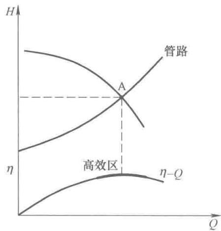  
图 2-27 泵与风机的工作点

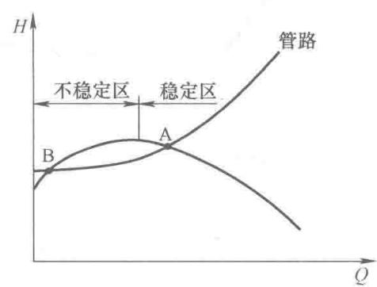  
图 2-28 泵与风机的不稳定工作区

实际工程中，工作点的漂移往往发生在管路系统的出口管路中具有较大的弹性空间的情况下，如采用全空气空调系统的大厅。或泵的出口管路中积存空气时，就有可能产生不稳定的“喘振”现象，“喘振”时会使泵或风机产生剧烈的低频振动，不能正常工作。对于空调水系统，甚至能使水泵及冷水机组损坏或造成制冷剂泄漏。

**2.18.2 泵与风机的工况调节的图解分析**

所谓调节，就是在系统运行中根据要求，采用人为的方法，分别或同时改变泵或风机性能曲线和管路性能曲线的形状或位置，从而改变工作点的位置。

**1. 改变管路系统性能的调节**

通过改变管路系统调节阀的开度，进行管路节流，使管路曲线形状发生变化来实现工作点改变。它可分为泵或风机的出口端节流和入口端节流两种方法。

**(1) 出口端节流**

如图 2-29 和图 2-30 所示，通过调节一次侧水泵出口处的电动调节阀，保证空调热水供水温度恒定在 $60^{\circ}$ C 不变。当负荷减少时，电动调节阀关小，一次侧管路曲线 a 变陡，成为 $a'$ ，水泵工作点由 A 移到 B，流量减少到 $Q_{B}$ ，以满足要求。但在流量为 $Q_{B}$ 时，管路所需要的扬程仅为 $H_{C}$ 就够了，而此时泵所产生的扬程为 $H_{B}$ ，多余的扬程 $\Delta H$ 完全消耗在电动调节阀的节流损失上。

这种调节是不节能的，目前多数系统中，已被水泵变频调节所取代。

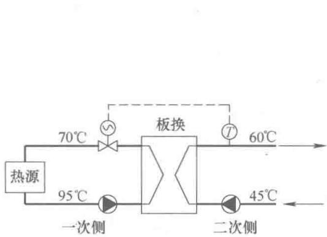  
图 2-29 空调热水换热原理图

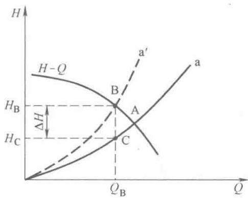  
图 2-30 泵的出口端节流调节

另外，水泵的节流阀通常只能设在泵的压出管段，这是因为：如果在吸入管段设置节流阀，将会增加泵吸入口的真空度，从而引起水泵的汽蚀。

在实际工程中，如图2-31所示的空调冷却水系统中，三台型号相同的冷却水泵与对应三台型号相同的冷水机组，冷却水总管是按最大负荷时确定的管径。在图2-32中，曲线d为管路曲线，曲线a为单台水泵的性能曲线，曲线b为两台泵并联运行时的性能曲线，曲线c为三台泵并联运行时的性能曲线。在三台泵同时工作时，工作点为A，此点就是设计工况点。此时每台泵的工作点为B，水泵的流量为 $Q_{\mathrm{B}}(Q_{\mathrm{B}}=1/3Q_{\mathrm{A}})$ ，扬程为 $H_{A}$ 。根据这两个参数，在泵的高效率区确定泵的型号，并据此确定了水泵的轴功率 $N_{B}$ 。

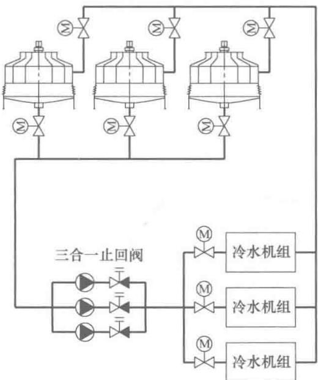  
图 2-31 冷却水系统图

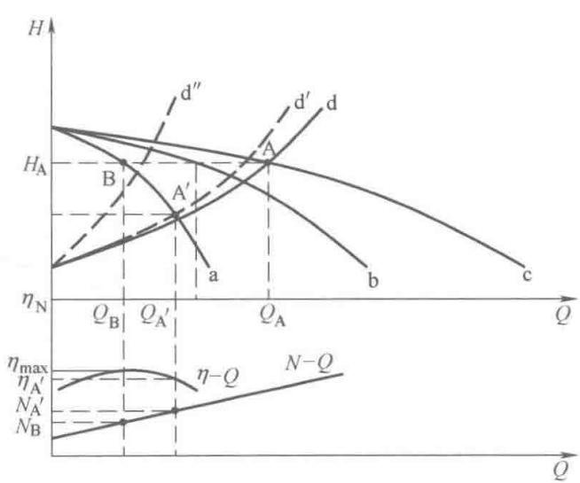  
图 2-32 冷却水泵工作点

在负荷变小，只有一台水泵工作时，不工作的冷水机组、冷却塔入口处的电动阀关闭，此时，管路的曲线变成 $d'$ ，水泵的工作点变为 $A'$ ，此时流量 $Q_A' > Q_B$ ，由N-Q曲线可见， $N_{A'} > N_B$ ，说明冷却水系统中，并联水泵在单独运行时的功率，大于并联运行时每台水泵的功率，此时水泵的效率降低至 $\eta_{A'}$ 。

在这种情况下，往往是由于水泵的电流过大而无法启动或频繁跳闸。为解决这个问题，提高水泵的效率，常常在水泵出口设置手动调节阀或者三合一止回阀（止回、调节、关断），当水泵单台运行时，关小调节阀，对流量进行限制。使管路曲线 $d'$ 变陡至 $d''$ ，使 $A'$ 点趋向于 B 点，从而降低水泵所需的功率。同理，冷冻水系统水泵出口也应设置相应的调节阀。

**(2) 入口端节流**

如图 2-33 所示是一个定风量全空气空调系统，工程安装完毕后需对系统风量进行调试。如果风量过大，需要关小阀门Ⅰ或Ⅱ，当关小入口端阀门Ⅱ时，不仅管路曲线 a 变陡，成为 $a'$ （见图 2-34），而且风机的性能曲线也发生了变化，由 $H_{1}-Q$ 变为 $H_{2}-Q$ ，这是因为节流后，风机入口前的气流压力降低，空气密度变小，由比例定律：

$$
\frac {H _ {1}}{H _ {2}} = \frac {\rho_ {1}}{\rho_ {2}}
$$

得出

$$
H _ {2} = \frac {\rho_ {2}}{\rho_ {1}} H _ {1} \text {而且有}: H _ {2} <   H _ {1}
$$

在图 2-34 中，风机工作点由 A 移到 B，风量减少到 $Q_{B}$ ，以满足风量的要求。节流损失为 $\Delta H_{1}$ 。当关小出口端阀门 I（入口阀门 II 不变）时，流量要达到 $Q_{B}$ 时，工作点需移到 D，管路曲线变为 $a''$ ，此时的节流损失为 $\Delta H_{2}$ 。由图中可知 $\Delta H_{2} > \Delta H_{1}$ ，这说明入口节流调节比出口调节更节能一些。人们在系统调试时会发现，调整回风阀比调整送风阀效果更好一些就是这个原理，阀门稍微关小一点，就同时调整了两条曲线。

由此可知，多台并联运行的水泵，当其单台运行时，通过调节水泵的出口处的调节阀，可以提高水泵的效率，减少水泵的能耗。

当空调风系统需要通过关小阀门来减少风量时，关小风机入口处的阀门比关小风机出口处的阀门能耗要低些。

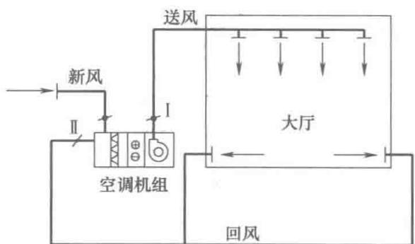  
图 2-33 全空气空调系统示意图

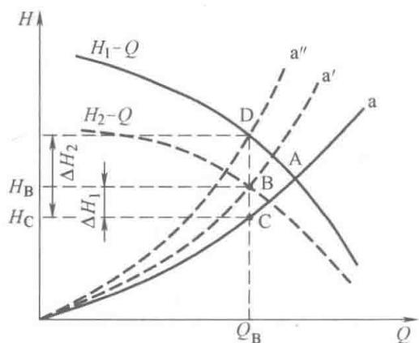  
图 2-34 风机的入口端节流调节

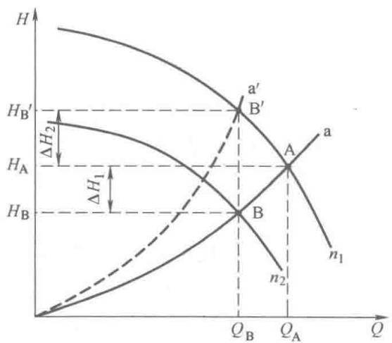  
图 2-35 泵与风机的变速调节

**2. 改变泵或风机性能的调节**

泵或风机变速调节是改变其性能曲线的方法。如图2-35所示，要求系统风量由 $Q_{A}$ 减少到 $Q_{B}$ ，如果此时采用节流调节，风机的性能曲线不变，通过改变管路性能曲线，使其由a变为 $a'$ ，工作点由A点移到 $B'$ 点，比调节前增加了节流损耗压头 $\Delta H_{2}$ 。

如果此时采用变速调节，在管路曲线 a 不变时，需将泵或风机转速由 $n_{1}$ 降为 $n_{2}$ ，由此改变了泵或风机的特性曲线，工作点由 A 点变为了 B 点，这种调节方法节省了压头 $\Delta H_{1}+\Delta H_{2}$ 。

由此可见，变速调节比节流调节有显著的节能效应。

**3. 并联水泵运行台数的调节**

对于通过开启水泵台数来进行调节的供冷供热系统，还需要关注调节量变化多少的问题。如果水泵选型不当，或者管路系统设计不尽合理，就会出现减少运行台数时，流量变化较少的情况，使得这种调节失去了意义。

以两台并联运行的水泵为例，假设两台运行与单台运行相比增加的流量为 $\Delta Q$ 。下面分别讨论泵的特性曲线和管路的特性曲线对流量增量 $\Delta Q$ 的影响。

**(1) 泵的特性曲线对流量增量 $\Delta Q$ 的影响**

如图 2-36 所示，泵 a 的特性曲线为 a 较陡，泵 b 的特性曲线为 b 较平坦，它们有一个交点 A，假设管路的特性曲线 c 刚好通过 A 点，也就是说泵 a 和泵 b 分别在这个系统中运行时工况点均为 A。泵 a 两台并联的特性曲线为 d，泵 b 两台并联的特性曲线为 e，它们与管路特性曲线 c 的交点分别为 B 和 C。很明显，泵 a 的并联流量增量 $\Delta Q_{a} > \Delta Q_{b}$ 。这说明泵的特性曲线越陡， $\Delta Q$ 越大，越适合并联工作。反之，泵的特性曲线越平坦， $\Delta Q$ 越小，越不适合并联工作。由于空调冷热水循环泵一般都是多台并联运行，因此，选型时要注意选择具有陡降型特性曲线的水泵。

**(2) 管路阻力对流量增量 $\Delta Q$ 的影响**

如图 2-37 所示，a、b、c 为三条管路特性曲线，综合阻力系数 $S_{a} > S_{b} > S_{c}$ ，泵的特性曲线为 d，两泵台并联的特性曲线为 e，单台泵分别在三个系统中工作时，工作点分别为 A、B、C。两台泵分别在三个系统中工作时，工作点分别为 A'、B'、C'。很明显，流量增量 $\Delta Q_{c} > \Delta Q_{b} > \Delta Q_{a}$ 。这说明管路的阻力越小， $\Delta Q$ 越大，越适合并联工作。反之，管路的阻力越大， $\Delta Q$ 越小，越不适合并联工作。因此，在管路系统设计时减少管路阻力不仅可以降低能耗，还更有利于调节。

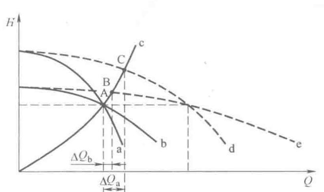  
图 2-36 两台型号相同的泵并联其性能曲线对流量增量的影响

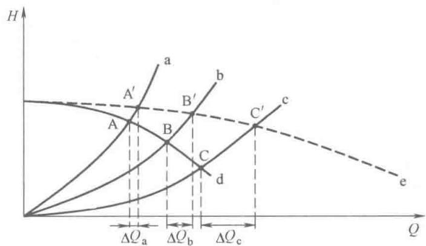  
图 2-37 管路性能曲线对并联泵流量增量的影响

**4. 旁通调节**

图 2-38 所示为一个一次泵定流量冷冻水系统，当末端的流量需求变化时，采用电动调节阀来调节旁通管内的流量，从而保证了流过冷水机组的流量恒定。整个冷冻水管路可以看成由管路 1 与管路 2 并联后，再与管路 3 串联组成。

在图 2-39 中，根据前述并联管路特性确定管路 1、管路 2 的综合曲线。在图 2-40 中，

根据前述串联管路特性确定管路 1-2 和管路 3 的总管路综合曲线。

在图 2-41 中，总管路曲线与水泵的性能曲线相交于 A 点，A 点就是泵的工作点，过 A 点作等流量线相交管路 1-2 于 A' 点，过 A' 做等压头线分别与管路 1、管路 2 交于 C 点、B 点，则 C 点、B 点对应的流量分别是管路 1 和管路 2 的流量。

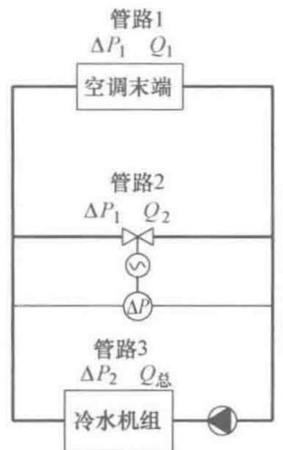  
图 2-38 冷冻水旁通调节

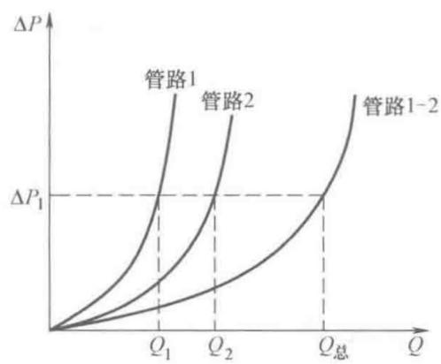  
图 2-39 管路 1、管路 2 并联后综合管路曲线

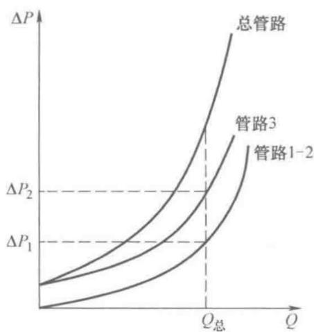  
图 2-40 管路 1、管路 2 并联后

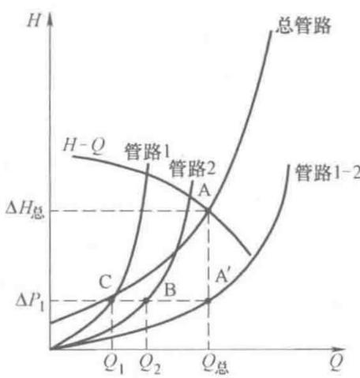  
图 2-41 旁通调节  
与管路 3 串联综合管路曲线

如果要保证流经冷水机组的流量恒定，则在空调负荷变化时，引起管路1的曲线变化，管路2的曲线必须与之同时变化，两者变化相抵，保证管路曲线1-2不变。在此调节

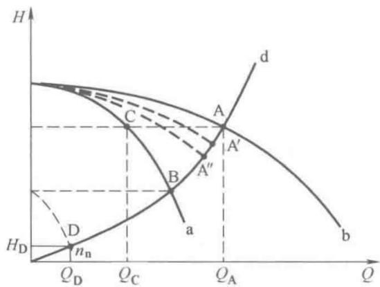  
图 2-42 变速泵或风机与定速泵或风机并联的运行工况

过程中，水泵的工作点 A 始终不变，能耗也就没有改变。

**2.18.3 两台并联泵或风机中仅一台进行变速调节的问题**

如果两台并联泵或风机中的一台进行变速调节，其工作点的确定方法如下：

如图 2-42 所示，两台型号相同的水泵或风机并联运行，一台定速，一台变速。曲线 d 为管路曲线，曲线 a 为一台定速泵或风机的性能曲线，曲线 b 为两台泵或风机均以额定转速运行时的综合曲线。A点为此时的工作点。此时，每台泵或风机的流量为 $Q_{C}=1/2Q_{A}$ 。当变速泵或风机的转速降低时，并联性能曲线变化如图 2-42 中的点划线所示，工作点变为 A'，A''……。当变速泵或风机的转速降低到某一转速值 $n_{n}$ ，其输出值为 0 时，这时的并联运行实际上相当于一台定速泵单独运行，其工作点为 B。

此时变速泵空耗的有效功率为：

$$
N _ {\mathrm{e}} = g \cdot Q _ {\mathrm{D}} \cdot H _ {\mathrm{D}}
$$

以上讨论是在管路特性曲线不变的情况下进行的，实际工程中管路特性曲线随着负荷的变化而变化。

如图 2-43 所示的空调热水换热机组，其二次侧采用两台型号相同的水泵并联运行，一台定频泵，一台变频泵。采用总管供回水压差信号控制变频泵的转速，保证该压差 $\Delta P$ 恒定不变。

在图 2-44 中，曲线 d 为二次侧管路曲线，曲线 a 为一台定频泵的性能曲线，曲线 b 为两台泵均以工频运行时的综合曲线。曲线 e 为控制曲线，交点 A 点为设计工况点。此时，每台泵的流量为 $Q_{B}=1/2Q_{A}$ 。当空调热负荷减少时，流量需求减少，空调末端电动阀关小，管路曲线变陡至 $d'$ ，两台水泵的综合曲线变为 c，曲线 $d'$ 、曲线 c、控制曲线 e（详见本书第 3.1 节）的交点 $A'$ 为新的工作点。当变速泵的转速降低到某一转速值 $n_{n}$ ，其输出值为 0 时，这时的并联运行实际上相当于一台定速泵单独运行，其工作点为 B，此时的变频泵的工作点为 D，变频泵空耗的有效功率为：

$$
N _ {\mathrm{e}} = g \cdot Q _ {\mathrm{D}} \cdot H _ {\mathrm{D}}
$$

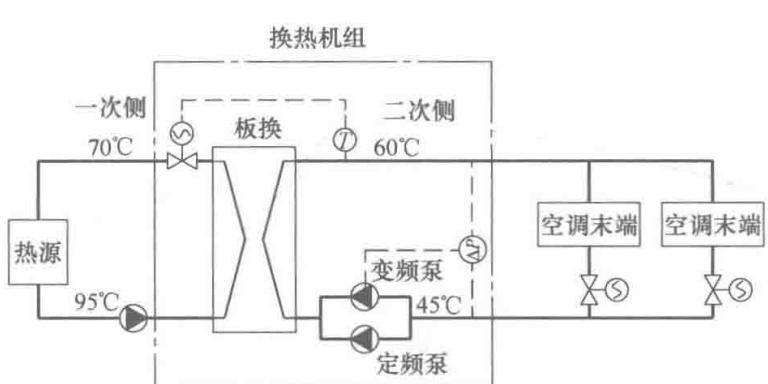  
图 2-43 空调热水换热机组原理图

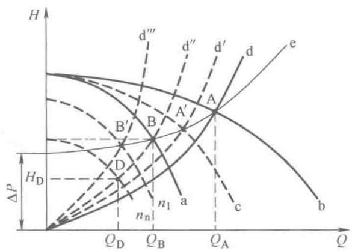  
图 2-44 变频泵与定频泵并联的运行工况

显然这是不节能的运行方式。

要使水泵节能运行，此时应关闭定频泵，让变频泵以工频运行，如果流量需求进一步减少，管路曲线 $d''$ 变陡至 $d'''$ ，则减少变频泵的转速至 $n_1$ ，变频泵的工作点为 $B'$ 。如此，直至达到保证 $\Delta P$ 不变的最低转速 $n_n$ ，此时的频率为变频泵的最低频率。

采用定频泵与变频泵相结合的调节方式时，应给定速泵的启停预留一定的提前量和延迟时间，以免水泵启停过分频繁。

由此可见，部分水泵变频在一定程度上可以减少变频器的投资，但是其运行相当复杂，操作不当不但不会节能反而会使系统能耗更高，如果条件允许，应尽量采用各台并联水泵均变频的控制方案。

**2.18.4 暖通空调系统中改变泵或风机转速的方法**

**1. 调换皮带轮**

这种方法仅用于风机的调节，通风空调系统调试过程中，往往会因为管路的计算不准确，导致风量过大、压头过高，在准确地测试出风机的风量或全压后，通过相似定律便可计算出新的风机转速，与设备厂家联系更换不同直径的皮带轮。这种方法造价低，在工程中时常会采用。

**2. 采用双速电机**

这种方法在通风系统中时常会采用，如：平时通风时，以低速运行；事故通风（或火灾排烟）时，以高速运行。这种方法的缺点是高、低风量往往很难同时满足设计要求，原因是由双速电机的结构决定的。暖通空调系统中的泵与风机基本上是由异步电动机驱动的。

交流电动机的同步转速（旋转磁场转速）为：

$$
n _ {1} = \frac {6 0 f}{p}
$$

异步电动机的转速为：

$$
n = \frac {6 0 f}{p} (1 - s)\tag{2-33}
$$

式中 $n_{1}$ ——同步转速，r/min；

n——异步电动机转速，r/min;

p——电动机磁极对数；

f——电源频率，Hz；

s——转差率， $s=\frac{(n_{1}-n)}{n_{1}}$ 额定负载时 $s=2\%\sim5\%$ 。

由式（2-33）可知，通过改变电动机的磁极对数 $p$ ，便可改变电动机的转速，双速电机就是在电动机的定子槽内嵌置不同极对数的独立绕组，通过改变定子绕组接线方式，便可改变极对数。但是，极对数的改变不可能多，大中型异步电机只改变一次，这就是双速电机。如： $p = 1\ n = 3000\mathrm{r / min}$ ； $p = 2\ n = 1500\mathrm{r / min}$ 。三速或四速仅在小型异步电动机中应用。此种方法调速虽然低廉可靠，但调速范围是有限的，为有级调速，不能实现平滑无极调速。在工程实践中，高转速的流量与低转速的流量，很难同时满足要求。

**3. 变频调速**

同样，由式（2-33）可知，通过改变电动机输入交流电源的频率f，也可以改变电动机的转速。这就需要用到变频器。关于变频器详见本书第14.8节。

**2.18.5 暖通空调变频循环水泵的工作频率范围**

水泵运行的最低频率定得太低将会使水泵的效率变得较低，定得太高将会使水泵的节能效果较差。要确定变频循环水泵的工作频率范围，需要从以下几个方面来考虑：

**1. 暖通变频循环水泵最大工作范围**

额定转速时，水泵在额定流量与额定扬程下运行，会有较高的水泵效率和电机效率。但是水泵的额定流量不是水泵的最大流量，一般来说，水泵在设计制造时考虑的最大工作流量是额定流量的120%。不同的转速下，水泵的最大流量也不同，将不同转速下水泵的最大流量点连成一条曲线，该曲线为最大流量曲线。

水泵转速也不能无限制地降低，由比例定律式（2-26）可知，当水泵的变速比 k 小于 0.25 时，水泵的轴功率已接近 0，若转速再进一步降低，水泵便不能正常工作。

在图 2-45 中，额定转速下，水泵的额定工况点为 A，最大流量工况点为 A'，将水泵额定转速下的特性曲线 $n_{1}$ 、转速比为 0.25 时的特性曲线 $n_{0.25}$ 与最大流量曲线 a 所包围的区域称为水泵的变频工作范围。当水泵运行超出这个区域，可能会造成水泵电机超载或者不能正常运行。

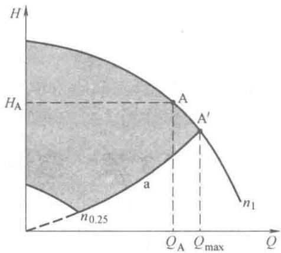  
图 2-45 水泵的变频工作范围

2. 在冷冻水系统中变频水泵允许的最低运行频率

实际上，运行在暖通空调系统中的变频循环泵的变频工作范围，远比图 2-45 所示的范围小得多。

在冷冻水二次泵系统中，冷源侧一级泵定流量运行，负荷侧次级泵变频运行，次级泵的最低运行频率要保证末端设备有一定的资用压头。如：电动平衡一体阀所需要的最小工作压差（见本书第7.3.12节），以及末端设备的最小流量要求，避免换热器的水流速进入层流区，从而恶化换热效果。保证末端设备能够正常运行。

在一次泵变流量空调冷冻水系统中，冷冻水泵的最小流量除了要满足末端的上述要求外，还需要满足冷水机组的最小流量要求。冷水机组的蒸发器要有一定的水流速度（一般为0.914～3.35m/s），否则，蒸发器内的水流速过低，进入了过渡区和层流区，会使冷水机组COP下降，工作性能恶化。各个品牌的冷水机组都会给出最低流量限值，一般要求最小流量为额定流量的50%～60%。也就是说，冷冻水泵运行频率最小可以降到25～30Hz。

**3. 变频水泵的最低运行频率对水泵效率的影响**

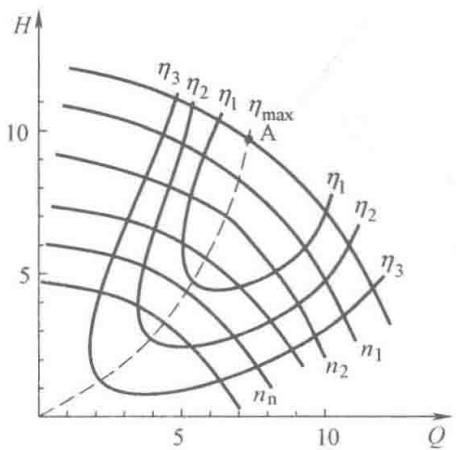  
图 2-46 水泵的通用性能曲线

由图 2-46 可知，水泵在转速降得较低时，水泵的效率也将变得较低。

考虑到水泵运行效率的影响，通常最低转速不小于额定转速的 60%，一般调节范围在 70%～100% 之间为宜，此外还应避开可能引起机械共振的转速范围。

因此，在设计空调冷热源系统的负荷调节时，应分析负荷变化的特点，采用水泵台数调节与变频调节相结合的方式，不可用一台大泵作全范围的变频调节。也不可把需要调节的负荷过多地集中在运行时的某一台变频泵上，如果调节量过大，从而使该台泵的特性曲线与其他泵的特性

曲线差别过大，将会导致该台变频泵不出水，失去调节的功能，如果条件允许，并联的水泵均变频，使它们的特性曲线始终一致。

**2.18.6 变频风机的工作频率范围**

在变风量空调 VAV 系统中，风机的最小风量应为额定风量的 50%，在大空间全空气空调系统中，当需要考虑变频节能运行时，最小风量要满足气流组织的要求，例如采用喷口侧送时，应避免由于风量减少而达不到射程。

**第 3 章 空调冷冻水一次泵变流量系统的调节**

空调冷冻水一次泵变流量技术是暖通专业重要的节能措施，但是并不是水泵加了变频器就等于节能了，还有更细致的问题需要研究。如：水泵变工况运行过程的轨迹、压差传感器设置的位置、控制方法以及并联变频泵运行台数调节的最优效率控制方法，本章将对上述问题进行讨论。

**3.1 控制曲线（或运行曲线）**

如图 3-1 所示的一次泵变流量冷冻水系统，采用冷冻机房内总管路供回水压差控制变频水泵的频率，保证此压差 $\Delta H$ 恒定不变。

在图 3-2 中， $n_{1}$ 为设计工况水泵性能曲线，管路系统特性曲线为 a，其可表示为公式：

$$
H = S Q ^ {2}
$$

1、2 两点冷源侧（左侧）的管路曲线为 b，其可表示为公式：

$$
H = S _ {1} Q ^ {2} + \Delta H
$$

曲线 b 实际上是水泵运行工况点的集合。因此被称为控制曲线（或运行曲线）。

在水泵变频调节过程中，水泵运行的工况点应为管路曲线 a、控制曲线 b、水泵特性曲线 n 三条曲线的交点。

以上两式中，S 为管路综合阻力系数； $S_{1}$ 为 1、2 两点冷源侧管路 b 的综合阻力系数，由于在调解过程中，管路 b 的阻力没有被改变，因此理论上它为定值； $\Delta H$ 为 1、2 两点间压差；Q 为空调冷冻水系统流量；H 为水泵的扬程。

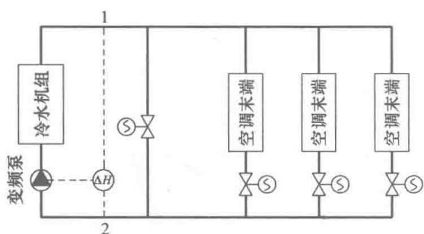  
图 3-1 冷冻水一次泵变流量系统

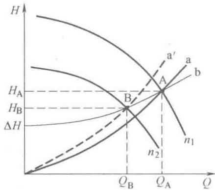  
图 3-2 一次泵变流量调节

在图 3-2 中，a、b、 $n_{1}$ 相交于一点 A（ $Q_{A}$ ， $H_{A}$ ）即为设计工况点。

如果空调负荷发生变化, 空调末端的电动调节阀关小, 水泵转速降低为 $n_{2}$ , 系统流量由 $Q_{\mathrm{A}}$ 变为 $Q_{\mathrm{B}}$ , 水泵的特性曲线 $n_{2}$ 与系统控制曲线交点即为该时刻系统工况点 B, 过点 B

和原点的抛物线 $a'$ 即为该时刻管路特性曲线。

由上可知：对于一个已知的系统，设计工况点 A（ $Q_{A}$ ， $H_{A}$ ）为已知的参数，1、2 两点间压差 $\Delta H$ 同样为已知参数。代入控制曲线方程，便可求出 $S_{1}$ 。因此，控制曲线上任意一点，均可根据公式 $H=S_{1}Q^{2}+\Delta H$ 求得。控制曲线对于分析系统的运行工况有重要的意义。

**3.2 变频泵的压差控制**

一次泵变流量系统中，压差传感器设置的位置对循环泵的能耗及系统的安全运行有着非常重要的影响。这种影响还随着系统平衡阀设置不同而不同。

当各末端支路采用静态平衡阀（见图 3-3）会有三种压差传感器的设置位置（方案一、方案二、方案三）。

图 3-4 中，在设计工况下，水泵以转速 n 运行，总管路性能曲线 a 与水泵特性曲线 n 的交点 A 为工作点，系统流量为 $Q_{A}$ 。在以下的分析中，将冷水机组的局部阻力等效地视为管路的沿程阻力。

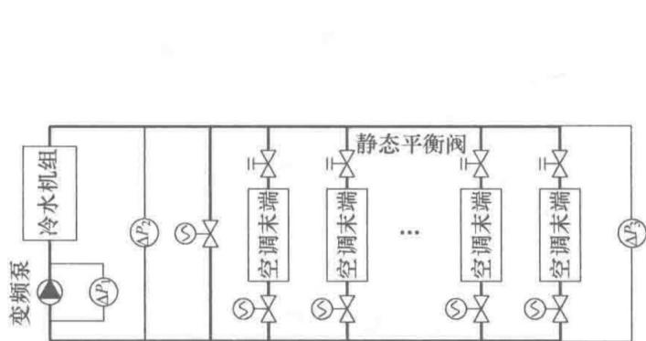

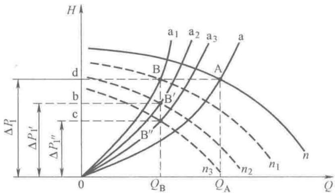  
图 3-3 采用静态平衡阀时，冷冻水一次泵变流量系 图 3-4 冷冻水一次泵变流量系统变频泵运行工况统压差传感器的位置

**1. 方案一**

压差传感器设置在循环泵进出口，采用图 3-5 中 $\Delta P_{1}$ 来控制变频泵的转速，此时的 $\Delta P_{1}$ 就是变频泵的扬程。

在图 3-5 中，在部分负荷下，由于流量的减小，供、回水管路上的压降将减少，管路水压线斜率变小。末端各支路均等比增加了可资用压头。

在图 3-4 中，在部分负荷 $Q_{B}$ 时，要求保证系统压差 $\Delta P_{1}$ 不变。由于末端电动调节阀关小，总管路性能曲线变为 $a_{1}$ 。由于频率减少，水泵转速降低至 $n_{1}$ ，工作点变为 B。由水泵有效功率公式 $N_{e}=g\cdot Q\cdot H$ 可知，由流量和扬程所包围的面积直接反映水泵有效功率的大小。当工作点由 A 变成 B 后，水泵能耗为 $0dBQ_{B}$ 所围成的面积，减少了由 $ABQ_{B}Q_{A}$ 所围成的面积。

**2. 方案二**

当压差传感器设置在系统的前端，采用图 3-6 中 $\Delta P_{2}$ 来控制变频泵的转速，部分负荷 $Q_{B}$ 下，由于流量的减少，供回水管路上的压降将减少，管路水压线斜率变小。为了保证 $\Delta P_{2}$ 不变，末端各支路均等比增加了可资用压头。而此时水泵扬程变成了 $\Delta P_{1}^{\prime}$ 。

在图 3-4 中，此时系统的工作点为 B'（ $\Delta P_{1}'$ 与 $Q_{B}$ 的交点），水泵转速降低至 $n_{2}$ ，总管路性能曲线变为 $a_{2}$ 。水泵能耗为 $0bB'Q_{B}$ 所围成的面积，与压差传感器设置在循环泵进出口时相比，减少了由 $bdBQ'_{B}$ 所围成的面积。

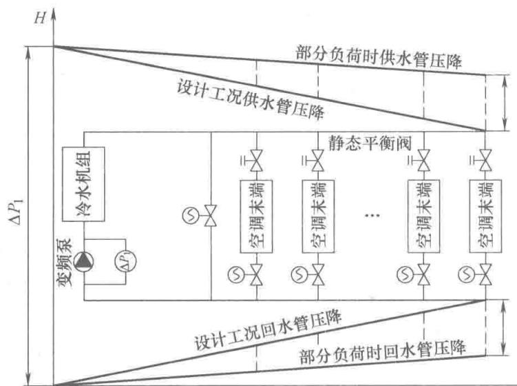  
图 3-5 方案一 压差传感器设置在循环泵进出口时系统水压图

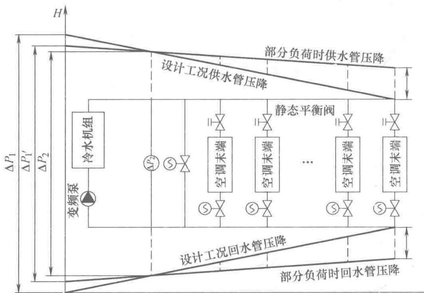  
图 3-6 方案二 压差传感器设置在系统前端时系统水压图

**3. 方案三**

当压差传感器设置在系统的末端，采用图3-7中 $\Delta P_{3}$ 来控制变频泵的转速，在部分负荷时 $Q_{\mathrm{B}}$ 下，由于流量的减少，供回水管路上的压降将减少，管路水压线斜率变小。为了保证系统末端支路压差 $\Delta P_{3}$ 不变，前端各支路均等比减少了可资用压头。此时水泵扬程变成 $3\Delta P_{1}^{\prime \prime}$ 。

在图 3-4 中，此时系统的工作点为 B''（ $\Delta P_{1}$ 与 $Q_{B}$ 的交点），水泵转速降低至 $n_{3}$ ，总管路性能曲线变为 $a_{3}$ 。水泵能耗为 $0cB''Q_{B}$ 所围成的面积，与压差传感器设置在系统前端时相比，减少了由 $cbB'B''$ 所围成的面积。

由此可知，这种情况下水泵运行是最节能的。但是，此时如果某一支路的空调负荷不是减少而是增加，那么这一支路的流量将不能保证。比如在酒店的空调系统中，室外温度降低时，顶层远端空调机组负荷减少，但是，处于二层等裙房的宴会厅的冷负荷主要是人员和新风的负荷，这样的负荷往往不随室外温度的降低而减少。这种情况下将压差传感器设置在系统末端将有可能使得宴会厅的空调系统不能正常工作。因此，在系统前端有与末端负荷变化趋势相反的负荷存在时，不建议采用此种方法。或者在宴会厅的空调末端入口处再设一个压差传感器，控制软件编程时要求在宴会厅使用时，其空调末端的压差必须得到保证。

综合以上三种传感器的设置方案，空调系统在部分负荷时能耗大小为：方案一>方案二>方案三，但是有些时候，方案三不能代表整个系统的变化趋势，只有方案二才能够反映系统整体负荷的变化且能耗也相对少。

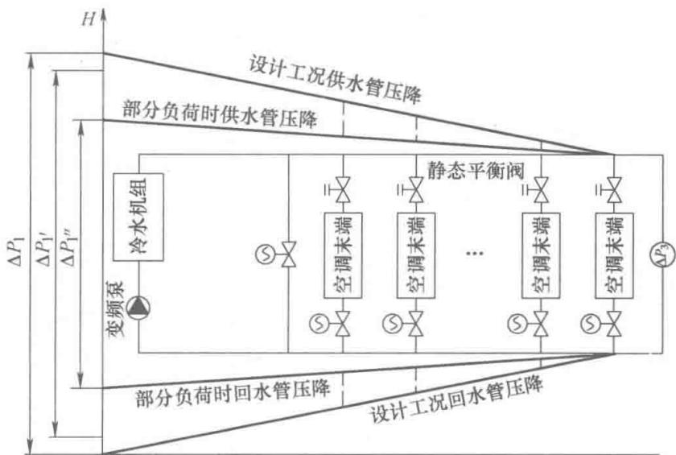  
图 3-7 方案三 压差传感器设置在系统末端时系统水压图

当各末端支路采用压差平衡阀（即：一个静态平衡阀或测量接口加一个压差控制器）时，同样会有三种压差传感器的设置位置（方案四、方案五、方案六）。在图3-8中，支管供回水之间的压差 $\Delta P$ 恒定，静态平衡阀的压降为 $\Delta P_{j}$ ，压差控制器的压降为 $\Delta P_{y}$ 。

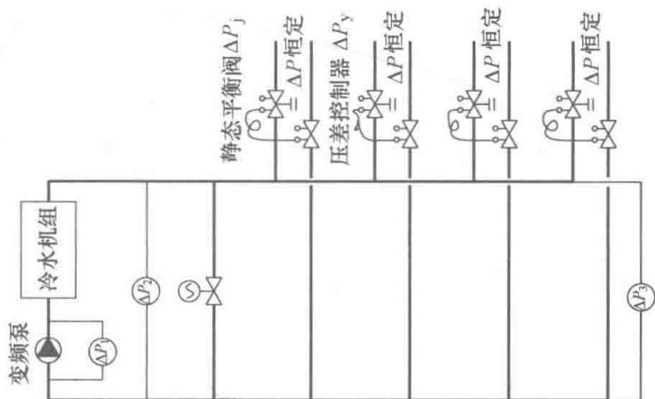  
图 3-8 采用压差平衡阀时，冷冻水一次泵变流量系统压差传感器的位置

**4. 方案四**

压差传感器设置在循环泵进出口，采用 $\Delta P_{1}$ 来控制变频泵的转速，如图3-9和图3-10所示，此时的调节效果同方案一。

**5. 方案五**

压差传感器设置在系统的前端，采用 $\Delta P_{2}$ 来控制变频泵的转速，如图 3-11 和图 3-12 所示，此时的调节效果同方案二。

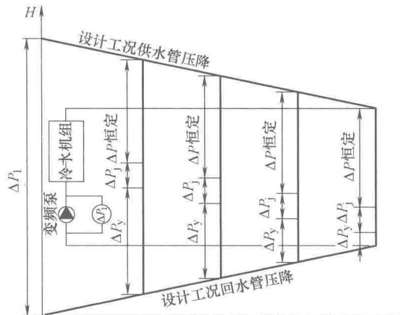  
图 3-9 方案四 设计工况时系统水压图

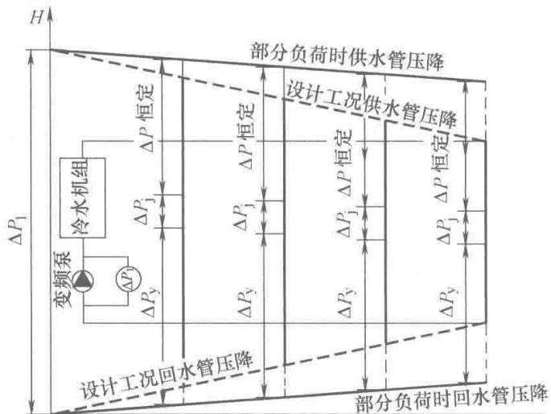  
图 3-10 方案四 部分负荷时系统水压图

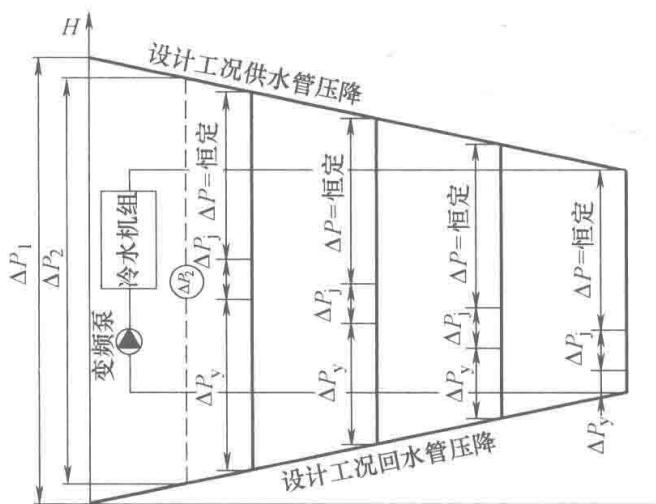  
图 3-11 方案五 设计工况时系统水压图

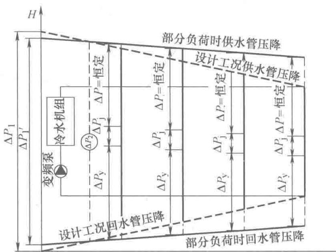  
图 3-12 方案五 部分负荷时系统水压图

**6. 方案六**

压差传感器设置在系统的末端，如图3-13和图3-14所示，采用 $\Delta P_{3}$ 来控制变频泵的转速，在部分负荷下，由于流量的减少，供回水管路上的压降将减少，管路水压线斜率变小。为了保证系统末端支路压差 $\Delta P_{3}$ 不变，前端各支路均等比减少了可资用压头。此时无论各支路负荷如何变化，由于压差控制器的调节作用，保证了各支管供回水压差 $\Delta P$ 恒定，从而保证了各支路的可资用压头。避免了方案三的情况发生。

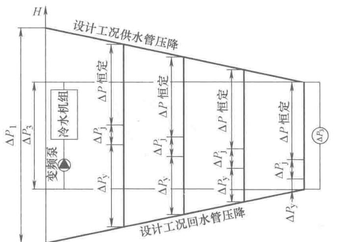  
图 3-13 方案六 设计工况时系统水压图

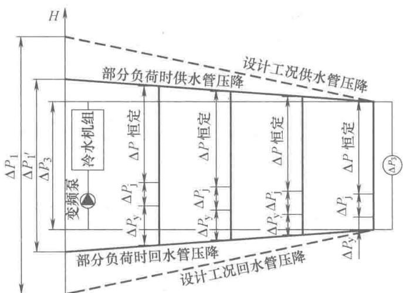  
图 3-14 方案六 部分负荷时系统水压图

需要注意的是，这种各末端支路采用压差平衡阀的系统不太适用于两管制（夏季供冷、冬季供热）的空调水系统，当热水的流量与冷冻水的流量相差较大时，远端的压差平衡阀有可能没有足够的工作压力，阀门无法启动，造成新的不平衡。

综合前面所述的 6 种控制方法，方案二与方案三是目前常用的控制方式，但是方案三的应用是有前提条件的，即：系统各部分冷负荷随室外温度的变化需一致，或者采取相应的控制措施。

**3.3 无压差传感器的冷冻水一次泵变流量系统的控制**

无压差传感器的变流量系统的控制是一种全新的控制方式，它可以实现水泵出口恒压力、冷冻机房供回水总管之间恒压差、系统最不利环路末端入口恒压差等几种控制方式。

**3.3.1 冷冻机房供回水总管之间恒压差的控制**

如图 3-15 所示的一次泵变流量冷冻水系统，冷冻水泵的转速采用冷冻机房内总管路 1、2 两点恒压差控制方案，保证此压差 $\Delta H = P_{1} - P_{2}$ 恒定不变，但是无压差传感器，水泵将根据控制曲线自动运行。

在图 3-16 中，管路系统特性曲线为 a，由式（2-3）可知，其数学表达式为：

$$
H = S Q ^ {2}
$$

1、2两点冷源侧的管路曲线（控制曲线）为b，由式（2-4）可知，其数学表达式为：

$$
H = S _ {1} Q ^ {2} + \Delta H
$$

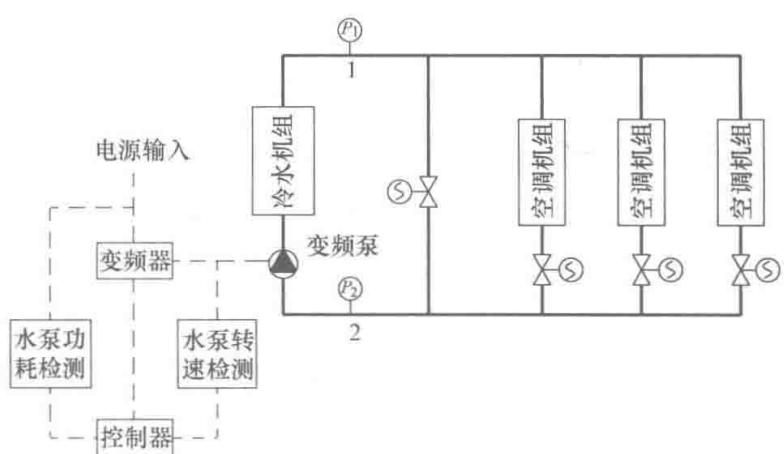  
图 3-15 冷冻水一次泵变流量系统无压差传感器控制

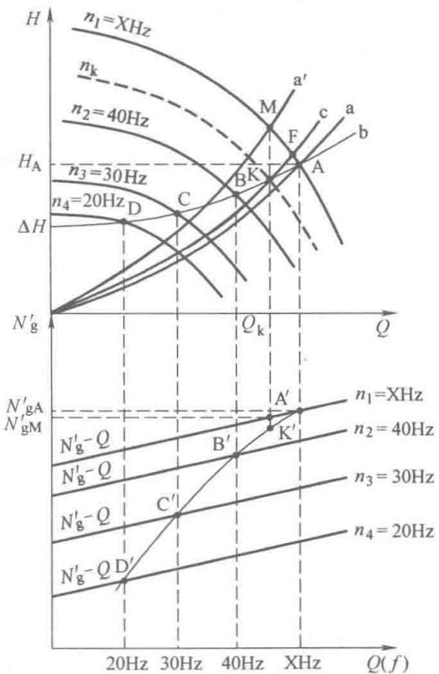  
图 3-16 一次泵变流量系统无压差传感器控制

控制方法一

**1. 现场调试时，先求出控制曲线**

**(1) 求最大流量工况点 A**

由于存在着系统阻力设计计算的误差，因此不能直接在水泵的选型曲线上依据设计流量和设计扬程确定工况点 A。需要通过现场调试来确定。但是，设计计算的流量一般是比较准确的。

在系统最大负荷时，通过现场流量计检测系统流量，调整水泵的运行频率，当系统流量达到设计流量 $Q_{A}$ 时，水泵前后压力表的读数差值就是水泵的扬程 $H_{A}$ 。由 $Q_{A}$ 和 $H_{A}$ 在此频率下水泵的特性曲线 $n_{1}$ 上确定最大流量工况点 A。

**(2) 求 $\Delta H$**

在系统流量达到设计流量 $Q_{A}$ 时，同时测量 1、2 两点的压差即为 $\Delta H$ 。

**(3) 求控制曲线**

将 $Q_{A}$ 、 $H_{A}$ 、 $\Delta H$ 代入控制曲线 $H=S_{1}Q^{2}+\Delta H$ ，便可求出 $S_{1}$ 。至此，控制曲线为一条已知的曲线。

**2. 水泵的特性曲线**

水泵出厂前通过测试得出 H-Q 曲线并可求出方程 $H=aQ^{2}+bQ+c$ ，通过测试得出 $N_{g}^{\prime}-Q$ 曲线（ $N_{g}^{\prime}$ 为电机在各种转速下的输入功率），见图 3-16。

在转速为 $n_1$ 时，已知水泵 $H - Q$ 曲线上一点 $\mathrm{A}(Q_{\mathrm{A}}, H_{\mathrm{A}})$ ，（过点A做垂直线与 $N_{\mathrm{g}}^{\prime} - Q$ 相交于 $\mathrm{A}'$ 点），便可知 $N_{\mathrm{g}}^{\prime} - Q$ 曲线上 $\mathrm{A}'(Q_{\mathrm{A}}, N_{\mathrm{gA}}')$ ；反过来，已知 $N_{\mathrm{g}}^{\prime} - Q$ 曲线上一点的 $\mathrm{A}'(Q_{\mathrm{A}}, N_{\mathrm{gA}}')$ 同样便可知 $H - Q$ 曲线的 $\mathrm{A}(Q_{\mathrm{A}}, H_{\mathrm{A}})$ 。

当改变水泵转速后，得到一组对应的曲线。

**3. 求输入功率—频率 $(N_{g}^{\prime}-f)$ 曲线**

控制曲线上的运行工况点 A、B、C、D 在 $N_{g}^{\prime}-Q$ 曲线上的对应点分别为 $A^{\prime}$ 、 $B^{\prime}$ 、 $C^{\prime}$ 、 $D^{\prime}$ 。它们连接成的曲线便是控制曲线对应的水泵的输入功率 - 频率 $(N_{\mathrm{g}}^{\prime}-f)$ 曲线，控制系统可求出拟合曲线及其方程 $N_{\mathrm{g}}^{\prime}=f(f)$ 。也就是说，知道水泵的运行频率和输入功率，便可知道其流量和扬程。

水泵的输入功率可由功率表实时检测，其运行频率可由变频器实时获得。

**4. 调节过程**

**(1) 求新的工况点**

当水泵以转速 $n_{1}$ 在工况点 A 运行时，空调负荷减少，空调机组电动阀关小，管路曲线由 a 变为了 $a'$ ， $a'$ 与水泵的特性曲线 $n_{1}$ 相交于点 M，此时功率表检测发现水泵的输入功率变为 $N_{gM}'$ ，由前面讲到的对应关系， $N_{gM}'$ 对应的 M 点的流量 $Q_{M}$ 便为已知参数， $Q_{M}$ 为系统新的需求流量，过点 M 作等流量线与控制曲线相交于点 K，该点就是变频水泵新的运行工况点。 $Q_{K}=Q_{M}$ ，代入控制曲线公式，求得 $H_{k}=S_{1}Q_{K}^{2}+\Delta H$ 。

**(2) 求新工况点的转速**

作过点 K 的管路特性曲线 c，与 $n_{1}$ 交于 F。或将 $Q_{K}$ 、 $H_{k}$ 代入管路曲线公式 $H=SQ^{2}$ 求得管路曲线 c 的 $S_{c}$ 值。

**依据管路曲线及水泵的特性曲线方程**

$$
H = S _ {\mathrm{c}} Q ^ {2}
$$

$$
H = a Q ^ {2} + b Q + c
$$

便可求出交点 F 的流量及扬程 $Q_{F}$ 、 $H_{F}$ ，F 点与 K 点为相似点。

则有：

$$
\frac {Q _ {\mathrm{F}}}{Q _ {\mathrm{K}}} = \frac {n _ {1}}{n _ {\mathrm{K}}}
$$

求得

$$
n _ {\mathrm{K}} = \frac {Q _ {\mathrm{K}}}{Q _ {\mathrm{F}}} n _ {1}
$$

新的运行频率

$$
f _ {\mathrm{K}} = \frac {n _ {\mathrm{K}}}{n _ {1}} \cdot f _ {1}
$$

**（3）频率的设定及输入功率的校核**

控制器根据新的转速重新设定变频器的频率，在新的运行频率下，功率检测表检测新的输入功率，并依据输入功率—频率 $(N_{\mathrm{g}}^{\prime}-f)$ 曲线校核，至此，调节过程结束。

由此可知，无压差传感器的冷冻水一次泵变流量系统的控制，是利用变频器都具有检测电机频率和输入功率的功能，将泵的特性曲线和模拟安装传感器的控制曲线预编程至集成控制器中，通过跟踪功率和频率运行。

由于运行参数的一一对应关系，该控制方式的控制器可显示水泵的瞬间流量、扬程、功率、电流、频率。

**控制方法二（采用 matlab 求解）**

**1. 采用 matlab 求解水泵的特性曲线**

水泵出厂前在额定转速下通过测试得出工况点，这些工况点在 matlab 软件中拟合得出 H-Q 曲线方程 $H=aQ^{2}+bQ+c$ ，及 $N_{g}^{\prime}-Q$ 曲线方程 $N_{g}^{\prime}=H\cdot Q\cdot g/\eta$ 总（ $N_{g}^{\prime}$ 为电机在各种转速下的输入功率）。当水泵转速由 $n_{1}$ 变为 $n_{2}$ 时，令变速比 $k=n_{2}/n_{1}$ 。

则变速后的 H-Q 曲线： $H=aQ^{2}+bkQ+ck^{2}$ ;

则变速后的 $N_{g}^{\prime}-Q$ 曲线： $N_{g}^{\prime}=H\cdot Q\cdot g\cdot k^{3}/\eta$ 总

输入不同的 k 值，将得到两组对应的曲线。

**2. 采用 matlab 求解求运行曲线及输入功率—频率 ( $N_{g}^{\prime}-f$ ) 曲线**

采用方法一中的第1步，在matlab求得运行曲线 $H=S_{1}Q^{2}+\Delta H$ ，过该曲线与不同转速下的H-Q曲线的交点做垂直线与对应的 $N_{g}^{\prime}-Q$ 曲线相交，这些交点在在matlab中拟合成运行曲线对应的水泵的输入功率-频率 $(N_{g}^{\prime}-f)$ 曲线方程 $N_{g}^{\prime}=f(f)$ 。

**3. 调节过程**

在图 3-16 中，当水泵以转速 $n_{1}$ 在工况点 A 运行时，空调负荷减少，空调机组电动阀关小，管路曲线由 a 变为了 $a'$ ， $a'$ 与水泵的特性曲线 $n_{1}$ 相交于点 M，此时功率表检测发现水泵的输入功率变为 $N_{gM}'$ ，由前面讲到的对应关系，在转速为 $n_{1}$ 时， $N_{gM}'$ 对应的 M 点的流量 $Q_{M}$ 便为已知参数（ $Q_{M}$ 为系统新的需求流量），在 matlab 中，过点 M 作等流量线与控制曲线相交于点 K，与 $N_{g}^{\prime}-f$ 曲线交于 $K^{\prime}$ ， $k^{\prime}$ 点就是变频水泵的节能运行工况点。

**4. 频率的设定及输入功率的校核**

将 K' 点的频率作为新流量下的节能运行频率，调整变频器的输出频率，采用此时 K' 点输入功率来校核功率表的实测功率，调节过程结束。

**3.3.2 水泵出口恒压力控制**

对于水泵出口恒压力控制（用于变频定压补水），可以看作是在3-15图中，点1、点2向泵的方向移动，此时控制曲线变成过A点的水平线。其余过程均同前面所述。

**3.3.3 空调系统最不利末端入口恒压差控制**

在图 3-7 中，要实现无压差传感器仅通过运行曲线来控制变频水泵的运行，并且保证 $\Delta P_{3}$ 恒定不变，需要以下步骤：

1. 空调末端入口处采用电动平衡一体阀来控制其负荷的变化。

2. 在系统最大流量时，将最不利末端的流量设定在最大流量，然后手动降低水泵的运行频率，当电动平衡一体阀的 $P_{1}-P_{3}$ 达到 $\Delta P_{min}$ 值时（详见本书第 7.3.13 节），记录 $\Delta P_{3}$ 值并将此值作为设定值 $\Delta P_{3set}$ ，同时测量水泵进出口压差及总管路的流量，将其作为水泵在工况点 A 的参数： $H_{A}$ ， $Q_{A}$ 。

3. 将最不利末端的流量设定在最大流量的 30%，并关闭一部分前端支路的阀门，以减少系统的总流量。手动降低水泵的运行频率，当 $\Delta P_{3}$ 达到 $\Delta P_{3set}$ 且电动平衡一体阀的 $P_{1}-P_{3}$ 再次达到 $\Delta P_{min}$ 值时，测量水泵的扬程和流量并将其作为水泵在工况点 B 的参数 $H_{B}$ 、 $Q_{B}$ 。

4. 将 A、B 两点的参数代入控制曲线 H=S， $Q^{2}+\Delta H$ 后，便可求出 $S_{1}$ 、 $\Delta H$ 。至此，满足最不利末端入口压差 $\Delta P_{3}$ 恒定且节能的控制曲线 C 就被求出，以后的步骤与本书第 3.3.1 节相同。

**3.3.4 无传感器泵控制优点**

采用无传感器泵控制具有以下优点：

1. 无需压差系统反馈传感器；

2. 节省传感器购买、安装、布线成本，以及试运行成本。

3. 各项控制参数均是根据实际工程现场设定，控制器将按系统需要控制泵速，节能水平等于或超过有传感器的变频控制。

4. 可根据系统实际状况重新设定水泵的运行参数。

**3.4 最优效率法全变频并联泵运行台数的调节**

如图 3-17 所示，有 4 台相同型号的冷冻水泵同时变频并联工作，当末端空调负荷减少时，冷冻水量需求减少，水泵转速降低，通常当水泵的转速降低到额定转速的 50% 或 70% 时，如果冷冻水量需求进一步减少，则停开一台水泵，依次类推，直到仅剩一台水泵运行。这样的控制就可以避免多台水泵在低效率下运行。调节运行台数的分界点，即：额定转速的 50% 或 70% 是运行经验得出的数值，没有理论上的依据。

如果采用无压差传感器的变频控制方法，则完全可以依据系统的实时最优效率调整水泵的运行台数。保证系统始终处于最高效率下运行，系统的效率不会受水泵的台数的变化而降低。

**3.4.1 求效率—流量曲线**

图 3-18 中，曲线 c 为管路曲线，曲线 d 为控制曲线， $a_{1}$ 、 $a_{2}$ 、 $a_{3}$ 、 $a_{4}$ 分别为一台、两台、三台、四台泵并联后的特性曲线。

水泵出厂时可测出单台水泵在某一转速下的效率—流量曲线 $\eta_{1}$ ( $\eta_{1}$ 为考虑了电机效

率、变频器效率之后的总效率）；并获得经验公式： $\eta=aQ^{2}+bQ+c$ 。

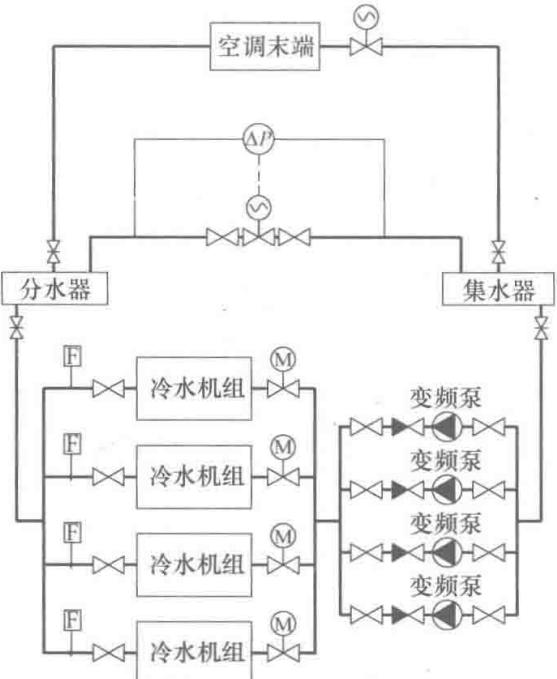  
图 3-17 冷冻水一次泵变流量系统

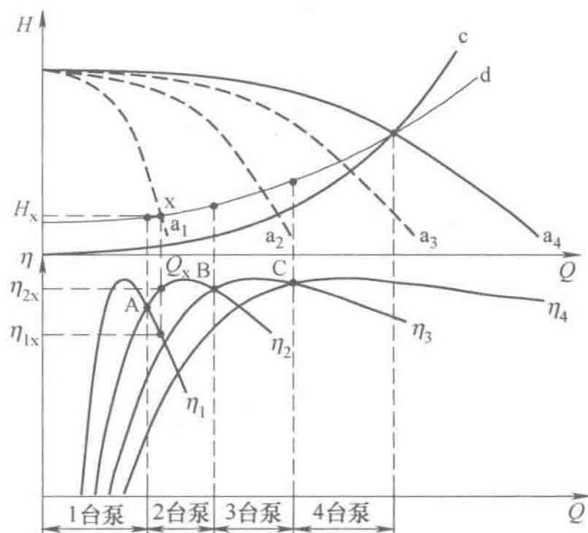  
图 3-18 并联变频泵运行台数调节原理

由本书第 2.17.1 节可知，两台同型号的冷冻水泵并联运行，并联后产生的扬程与各泵产生的扬程都相等、并联后的总效率与单台泵的效率一致。当流量为 2Q 时，效率仍为 $\eta$ 代入上式，可以得出两台泵并联的效率—流量曲线 $\eta_{2}$ ：

$$
\eta = 4 a Q ^ {2} + 2 b Q + c
$$

控制器通过求解上面两个一元二次方程得出两条曲线的交点 A。

同理可求出三台并联效率—流量曲线 $\eta_{3}$ ；四台并联水泵的效率—流量曲线 $\eta_{4}$ ；并求出交点 B、C。

**3.4.2 控制方案**

1. 当系统流量在 A 点左侧时，运行 1 台水泵；

2. 当系统流量在 A、B 之间时，运行 2 台泵；

3. 当系统流量在 B、C 之间时，运行 3 台泵；

4. 当系统流量在 C 点右侧时，运行 4 台水泵。

在某一转速下，各效率曲线的交点所对应的流量（或者说控制曲线上的工况点），就是水泵增减运行台数的控制点，这就保证了所运行的水泵整体效率始终处于高位。

**3.4.3 控制方案节能分析**

以运行曲线上的 X 点为例，流量为 $Q_{x}$ ，扬程为 $H_{x}$ ，

如果是单台泵运行，此时水泵的效率为 $\eta_{1x}$ ，则水泵电机的输入功率为：

$$
N _ {1 \mathrm{x}} = \frac {N _ {\mathrm{e}}}{\eta_ {1 \mathrm{x}}} = \frac {g \cdot Q _ {\mathrm{x}} \cdot H _ {\mathrm{x}}}{\eta_ {1 \mathrm{x}}}
$$

如果是两台泵运行，此时水泵的效率为 $\eta_{2x}$ ，则水泵电机的输入功率为：

$$
N _ {2 \mathrm{x}} = \frac {N _ {\mathrm{e}}}{\eta_ {2 \mathrm{x}}} = \frac {g \cdot Q _ {\mathrm{x}} \cdot H _ {\mathrm{x}}}{\eta_ {2 \mathrm{x}}}
$$

由于 $\eta_{2x} > \eta_{1x}$ ，则 $N_{1x} > N_{2x}$ ，也就是说，此时，运行一台泵的耗电量大于运行两台泵的耗电量，运行两台泵比运行一台泵节能。

**第 4 章 中央空调制冷系统的节能设计**

制冷系统的设计是要通盘考虑制冷方式、输配方式、冷水机组、水泵等设备的形式、台数、容量大小、定压方式等，还要考虑如何将它们组合成一个高效节能的制冷系统，来满足工程项目的需要。

**4.1 冷水机组的台数设置**

应首先考虑采用相同冷量、型号的冷水机组，通过开启台数的多少进行负荷调节。使制冷系统在各种负荷率下均处于高效率运行状态，避免大马拉小车，但是台数不宜过多，否则会造成投资过高。当采用台数调节不能满足最低负荷要求时，如：常规的离心机组的最低负荷为30%，在负荷率低于30%时机组会发生喘振而无法正常工作，可采用大小机组搭配，通过计算最低负荷来确定小冷水机组的容量，根据负荷的重要性确定小冷机的台数。如在医院、酒店工程中，常采用多台大容量的离心机组加两台小容量的螺杆机组搭配。

**4.2 高压冷机的设置**

低压电机功率增大到一定程度（如 550kW/380V）电流受到导线的允许承受能力的限制就难以做大，或成本过高。一般当单台冷机的制冷量大于 3868kW（1100 冷吨）时，应考虑高电压 10kV 冷水机组，但是有的地区高压电网不稳，当电压波动超过 ±10% 时，会造成机组无法正常开机运行，设计采用高压冷水机组时，应事先对项目所在的供电情况进行调查。

**4.3 冷冻机房的设计**

在进行冷冻机房设计之前，首先要确定制冷系统流程，再根据制冷系统流程确定机房内设备的布置。然而，冷水泵、冷却水泵与冷水机组的连接方式又受到机房尺寸和形状的约束。

冷冻机房内冷水泵、冷却水泵与冷水机组的连接方式有两种，一种是一对一的连接方式，另一种是共用集管的连接方式。

1. 一对一的连接方式

如图 4-1 所示，在一对一的连接方式中，水泵与冷水机组串联后再并联。

2. 共用集管的连接方式

如图 4-2 所示，在共用集管的连接方式中，水泵先并联后再与冷水机组串联。采用此方式应在冷水机组入口或出口设置电动隔断蝶阀，当冷冻水泵停止运行时，连锁关闭对应的电动蝶阀。设置电动蝶阀后不必再设置手动的设备检修阀，因为电动蝶阀都有手动关闭的手轮。

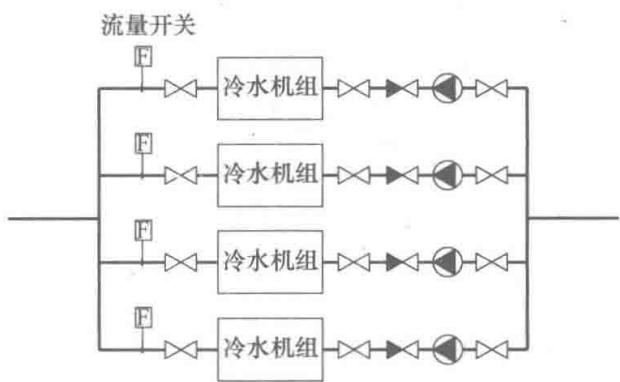  
图 4-1 循环泵与冷水机组之间采用一对一示意图

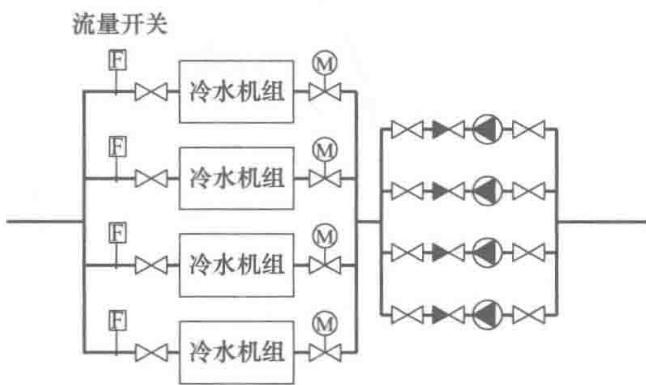  
图 4-2 循环泵与冷水机组之间采用共用集管连接示意图

**4.3.1 水泵与冷水机组连接方式的选择**

水泵与冷水机组采用何种方式连接，取决于机房的形状和大小，当机房形状方正（见图4-3），机组前能够布置下冷水泵、冷却水泵时，宜采用一对一的方式，这种方式对机组的冷水量有可靠的保证，特别是在有大小机组混合搭配时，应该采用此方式。同时，这种方式也省去了机组前的电动隔断蝶阀，使安装、运行更为方便。如果冷水机组的型号不同，在一对一的方式中，各台水泵的扬程，要保证在克服冷水机组后的剩余扬程相等。一对一的方式中，水泵与冷水机组启停一一对应，水系统结构简单，但水泵不能互为备用。

当机房形状细长（见图 4-4），机组前布置冷水泵、冷却泵困难时，宜采用共用集管的方式，采用此种方式连接时，当冷水机组的大小、型号一致时，各机组的水量容易平衡；否则，各机组入口需要加静态平衡阀进行初调，以保证各台机组要求的水量。共用集管的方式水泵/冷水机组可互为备用，机房内管路较简单，但需在冷水机组出口处增加电动隔断蝶阀。

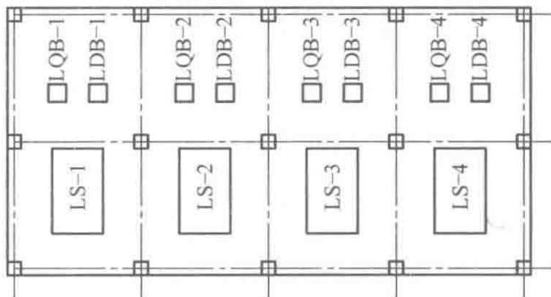  
图 4-3 冷水泵、冷却水泵与冷水机组一对一连接布置图

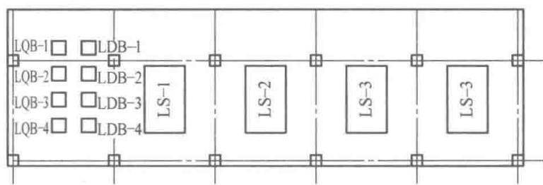  
图 4-4 冷水泵、冷却水泵与冷水机组采用共用集管连接布置图

**4.3.2 电动隔断蝶阀的控制**

在图 4-2 所示的共用集管的连接方式中，系统冷负荷增大，冷水机组加机过程中，电动隔断蝶阀的开启方式和开启时间与冷水机组所能容忍的最大许可流量变化率密切相关。

当采用先开电动隔断蝶阀后开水泵的方式，在一台冷水机组运行到满负荷后需要开启第二台冷水机组时，由于第二台机组前的隔断蝶阀打开，水量被分流，正在运行的冷水机组的流量最终变为先前的50%。一般的电动隔断蝶阀开启时间在35～55s不等（详见本书第7.8.2节），由此，冷水机组的流量变化率为86%～54%，而最好的变流量冷机的流量变化率才能达到30%左右，在这种情况下，原来正常运行的冷水机组将会因流量不足而停机。因此，电动隔断蝶阀应在水泵启动后开启，这样正在运行的冷水机组的流量不会出现突然减少。同时这样还可以防止水泵启动时，因启动电流大而过载跳闸。

而电动隔断蝶阀在关闭时需要满足先关阀后停水泵的要求。因为在有压力管路中，如果冷水泵突然停车，会使管内水的流速突然发生变化，导致压力变化，从而引起水击，因此为了防止水击的出现，电动隔断蝶阀应在水泵停止之前逐渐关闭。

**4.3.3 流量开关的设置**

无论何种连接，都需在冷水机组的冷水、冷却水的出水管上设置流量开关，用来判断蒸发器、冷凝器内是否有水流过，只有在水流动后冷水机组才能启动，对冷水机组进行保护。同时，流量开关信号也可以判断冷水泵、冷却水泵是否在工作状态。流量开关一般由冷水机组厂家配套供货，工程设计时应留好安装位置。

**4.4 中央空调水系统节能设计**

由冷水机组、冷水泵、冷却水泵及冷却塔组成的空调水系统是空调系统的主要运行耗能部分。为了约束这部分的能耗，《公共建筑节能设计标准》GB 50189—2015对空调电制冷系统节能分别采用下列参数进行评价和限定，各参数对应评价的范围见图4-5。

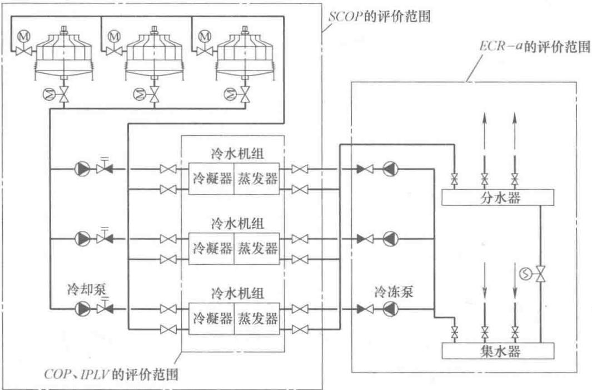  
图 4-5 空调制冷系统原理图

4.4.1 电机驱动的蒸汽压缩循环冷水机组名义制冷工况下和规定条件下的性能系数（COP）

$$
C O P = \frac {Q _ {\mathrm{c}}}{P _ {\mathrm{L}}}\tag{4-1}
$$

式中 $Q_{c}$ ——名义制冷工况下机组的制冷量，kW；

$P_{L}$ ——名义制冷工况下机组的耗电功率，kW。

**4.4.2 电机驱动的蒸汽压缩循环冷水机组综合部分负荷性能系数（IPLV）**

$$
I P L V = 1.2 \% \times A + 32.8 \% \times B + 39.7 \% \times C + 26.3 \% \times D\tag{4-2}
$$

式中 A ——100% 负荷时的性能系数（W/W），冷却水进水温度 $30^{\circ}$ C / 冷凝器进气干球温度 $35^{\circ}$ C；

B——75%负荷时的性能系数（W/W），冷却水进水温度26℃/冷凝器进气干球温度31.5℃；

C——50%负荷时的性能系数（W/W），冷却水进水温度23℃/冷凝器进气干球温度28℃；

D——25%负荷时的性能系数（W/W），冷却水进水温度19℃/冷凝器进气干球温度24.5℃；

**4.4.3 电冷源综合制冷性能系数（SCOP）**

电冷源综合制冷性能系数（SCOP）为名义制冷量（kW）与冷源系统主机、冷却水泵和冷却塔的总耗电量（kW）之比。

当冷水机组与冷却水泵和冷却塔采用一对一配置时，每台冷水机组的综合性能系数按下式计算确定：

$$
S C O P = \frac {Q _ {\mathrm{c}}}{P _ {\mathrm{e}}}\tag{4-3}
$$

当多台冷水机组共用一套冷却水系统时，多台制冷设备的综合 $SCOP_{z}$ 按式（4-4）确定，其限值 $SCOP_{zx}$ 按冷量加权的方式确定，即：式（4-5）。

$$
S C O P _ {z} = \frac {\sum Q _ {c}}{\sum P _ {e}}\tag{4-4}
$$

$$
S C O P _ {\mathrm{zx}} = \frac {\sum_ {i = 1} ^ {n} Q _ {\mathrm{ci}} S C O P _ {i}}{\sum Q _ {\mathrm{c}}}\tag{4-5}
$$

制冷设备冷水机组名义工况需要输入的总电量或总用能量按下式确定。

$$
P _ {\mathrm{e}} = P _ {\mathrm{L}} + P _ {\mathrm{b}} + P _ {\mathrm{t}}\tag{4-6}
$$

$$
\sum P _ {\mathrm{e}} = \sum P _ {\mathrm{L}} + \sum P _ {\mathrm{b}} + \sum P _ {\mathrm{t}}\tag{4-7}
$$

水泵的耗电量应按冷却水泵设计工况流量、扬程和水泵效率计算确定，计算公式为：

$$
P = G \cdot H / (3 2 3 \eta_ {\mathrm{b}})\tag{4-8}
$$

式中 $Q_{c}$ ——电制冷机组的名义制冷量，kW；

$P_{e}$ ——电制冷机组的名义工况下的耗电功率和设计工况配套冷却水泵和冷却塔的总耗电量，kW；

$Q_{ci}$ ——第 i 台电制冷机组的名义制冷量，kW；

$SCOP_{i}$ ——第 i 台电制冷机组的 SCOP 限定值，可查《公共建筑节能设计标准》GB 50189—2015 的表 4.2.12；

n——冷水机组台数；

$P_{L}$ ——电制冷机组的名义工况下的耗电量，kW；

$P_{b}$ ——电制冷机组对应的冷却水泵设计工况耗电量，kW；

$P_{t}$ ——电制冷机组对应的冷却塔设计工况耗电量，kW，可近似按设备铭牌功率取值；

G——冷却水泵设计工况流量， $m^{3}/h$ ;

H——冷却水泵设计工况扬程，m；

$\eta_{b}$ ——冷却水泵设计工况点的效率。

设置 SCOP 限值的目的是要求设计师不仅要选择性能系数高的冷水机组，设计中还应合理确定冷却塔位置和进行冷却水管道设计，以减少冷却水输送系统和冷却塔的能耗。

**4.4.4 空调冷水系统耗电输冷比 ECR-a**

$$
E C R - a = 0. 0 0 3 0 9 6 \sum (G \times H / \eta_ {\mathrm{b}}) / Q \leqslant A (B + \alpha \Sigma L) / \Delta T\tag{4-9}
$$

式中 ECR-a——空调冷水系统循环水泵的耗电输冷比；

G——每台运行水泵的设计流量， $m^{3}/h$ ;

H——每台运行水泵对应的设计扬程，m；

$\eta_{b}$ ——每台运行水泵对应的设计工作点效率；

Q——设计冷负荷，kW；

$\Delta T$ ——规定的计算供回水温差， $^{\circ}$ C，按《公共建筑节能设计标准》GB 50189—2015的表4.3.9-1选取；

A——与水泵流量有关的计算系数，按《公共建筑节能设计标准》GB 50189—2015 的表 4.3.9-2 选取；

B——与机房及用户的水阻力有关的计算系数，按《公共建筑节能设计标准》GB 50189—2015 的表 4.3.9-3 选取；

α——与 ΣL 有关的计算系数，按《公共建筑节能设计标准》GB 50189—2015 的表 4.3.9-4 选取；

$\Sigma L$ ——从冷冻机房出口至该系统最远用户供回水管道的总输送长度，m。

式（4-9）左侧为系统实际 ECR-a 计算值，要求不大于右侧的限定值，对此值进行限制是为了保证冷水系统阻力和水泵的扬程在合理的范围内，以降低水泵能耗。

**4.4.5 冷水机组能效的理论极限**

冷水机组的 COP 和 IPLV 不可能是无限大的，随着技术的进步，这两项参数会趋近它的理论极限值。文献 [19] 给出了水冷冷水机组在 GB/T 18430.1—2007 下的满负荷 COP 的极限值为 10.01，IPLV 的极限值为 14.51；风冷冷水机组的相应值分别为 7.37/10.25。

**4.4.6 中央空调制冷系统节能设计应当注意的问题**

1. 在《公共建筑节能设计标准》GB 50189—2015 中，COP、IPLV 都是指在冷水机组在名义工况的参数。它们是设备的参数，无需设计师计算，但在选型时，设计师需根据《公共建筑节能设计标准》提出限值要求。

2. SCOP 是系统的参数，需要设计师进行计算后确定。计算 SCOP 时，冷水机组的参数采用名义工况的参数，而其中用来计算的冷却水泵和冷却塔的耗电量是在设计工况下的参数。

3. ECR-a 是系统的参数，需要设计师进行计算后确定。计算 ECR-a 时，所采用的参数均是在设计工况下的参数。

4. 设计过程中冷水机组选型时应由厂家分别选出机组在名义工况下和设计工况下的参数。

**4.4.7 各种标准规范对水冷离心式冷水机组 COP 及 IPLV 的限值对比**

《公共建筑节能设计标准》GB 50189—2015 对 COP 和 ECR-a 的限值要求比较宽松，对于一个一般的空调系统都很容易达到，比如 SCOP 的限制，都是在冷却水泵扬程为 $30 ~mH_{2}O$ 左右、冷却水泵的效率仅为 70% 左右时制定的，而目前较好的节能设计，其冷却水泵的扬程都可以降到 $12 ~mmH_{2}O$ ，水泵的效率可达 80% 以上。

对比《公共建筑节能设计标准》GB 50189—2015与《冷水机组能效限定值及能效等级》GB 19577—2015（详见本书第13.2节 冷水机组能效等级），前者对冷水机组的COP、IPLV的要求仅仅是市场的准入级，距离1、2级能效还有较大的差距。因此，仅仅满足《公共建筑节能设计标准》的设计，还有很大的节能潜力可以挖掘。现将各个规范标准的限值作如下对比。

图 4-6～图 4-8 中的规范标准代号：

A——《公共建筑节能设计标准》GB 50189—2015;

B——北京市地方标准《公共建筑节能设计标准》DB1/687—2015;

C——《绿色建筑评价标准》GB/T 50387—2014;

D——《冷水机组能效限定值及能源效率等级》GB 19577—2015（3级）；

E——《冷水机组能效限定值及能源效率等级》GB 19577—2015（2级）；

F——《冷水机组能效限定值及能源效率等级》GB 19577—2015（1级）；

G——水冷冷水机组在 GB/T 18430.1—2007 下的满负荷的理论极限值。

1. 以寒冷地区为例，当名义制冷量 CC > 2110kW 时，各种标准规范对水冷离心式冷水机组 COP 及 IPLV 的限值对比如图 4-6 所示。

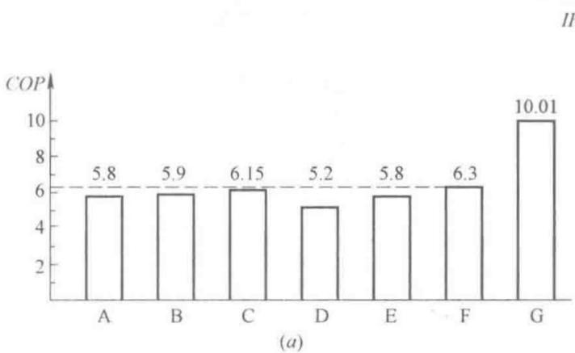

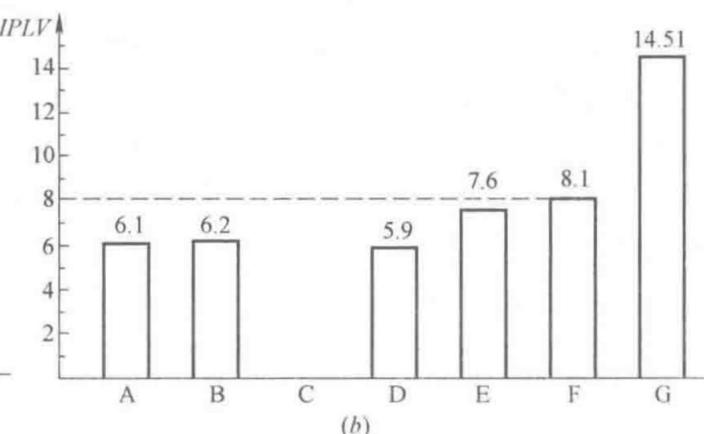  
(b)  
图 4-6 名义制冷量 CC > 2110kW 时，各种规范标准对水冷离心式冷水机组 COP 及 IPLV 的限值对比  
(a) 冷水机组 COP 限值；(b) 冷水机组 IPLV 限值

2. 当名义制冷量 $528 \, kW < CC < 1163 \, kW$ 时，各种标准规范对水冷螺杆式冷水机组 COP 及 IPLV 的限值对比如图 4-7 所示。

3. 当名义制冷量 CC > 50kW 时，各种标准规范对风冷螺杆式冷水机组 COP 及 IPLV 的限值对比如图 4-8 所示。

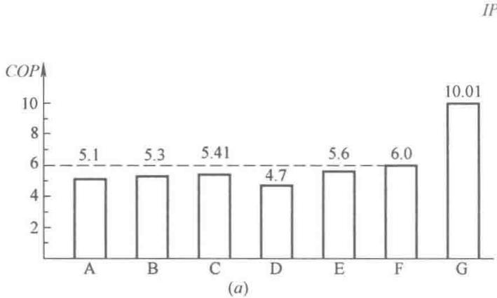

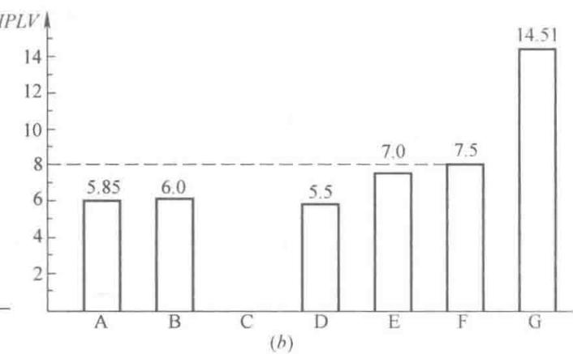  
图 4-7 名义制冷量 528kW < CC < 1163kW 时，各种标准规范对水冷螺杆式冷水机组 COP 及 IPLV 的限值对比  
(a) 冷水机组 COP 限值；(b) 冷水机组 IPLV 限值

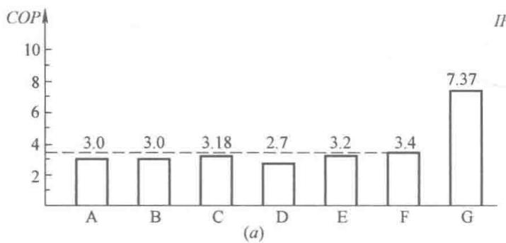

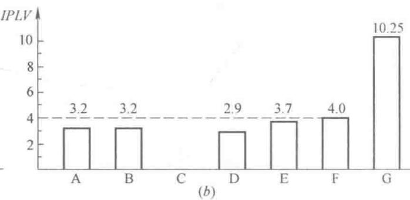  
图 4-8 名义制冷量 CC > 50kW 时，各种标准规范对风冷螺杆式冷水机组 COP 及 IPLV 的限值对比  
(a) 风冷螺杆式冷水机组 COP 限值；(b) 风冷螺杆式冷水机组 IPLV 限值

**4.4.8 中央空调水系统节能设计具体措施**

在设计中央空调水系统时，可以通过下列具体措施来提高系统的能效：

1. 采用 1 级、2 级能效的冷水机组。

2. 采用效率大于 80% 的水泵。

3. 水管管径按管内流速来确定。由于机房内设备、管件较多，管道的阻力以局部阻力为主，为了减小阻力，降低水泵的扬程，冷水机房内的水管管径应按管内流速来确定，而不是采用经济比摩阻小于或等于 $100 \, Pa/m$ 来确定，在条件允许的情况下，应保证水流速小于或等于 $1.5 \, m/s$ 。

以图 4-9 所示冷冻机房内的冷冻水管为例，我们通过计算除冷水机组之外的管路阻力，来比较两种流速下两者的能耗差异。

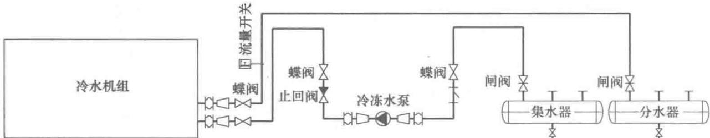  
图 4-9 冷冻机房内冷冻水流程

图 4-9 中为一台制冷量 2814kW（800 冷吨）的离心式冷水机组，冷水流量

$Q=484m^{3}/h$ ，由分水器至集水器的焊接钢管长度为25m。

当管径取 DN300 时，v=1.82m/s，比摩阻 R=100.28Pa/m；满足比摩阻限制要求，沿程阻力为： $\Delta P_{2}=25\times100.28=2507Pa$ 。

当管径取 DN350 时，v=1.35m/s；比摩阻 R=46.48Pa/m；沿程阻力为： $\Delta P_{2}=25\times46.48=1162Pa$ 。

局部阻力按下式计算：

$$
\Delta p _ {\mathrm{j}} = \zeta \times \frac {\rho \times v ^ {2}}{2}\tag{4-10}
$$

式中 $\Delta p_{j}$ ——局部阻力，Pa；

$\zeta$ ——局部阻力系数，见表4-1；

$\rho$ ——水的密度， $1000kg/m^{3}$ ;

v——水的流速，m/s。

局部阻力系数 $\zeta$  
表4-1

<table><tr><td>设备名称</td><td>数量</td><td>局部阻力系数 $\zeta$ </td><td>总局部阻力系数 $\sum \zeta$ </td></tr><tr><td>过滤器</td><td>1</td><td>3.0</td><td rowspan="10">31.82</td></tr><tr><td>止回阀</td><td>1</td><td>7.0</td></tr><tr><td>蝶阀</td><td>4</td><td>0.30</td></tr><tr><td>闸阀</td><td>2</td><td>0.08</td></tr><tr><td>变径管(渐缩)</td><td>2</td><td>0.10</td></tr><tr><td>变径管(渐扩)</td><td>2</td><td>0.30</td></tr><tr><td>软接头</td><td>4</td><td>1.20</td></tr><tr><td>焊接弯头(90°)</td><td>12</td><td>0.78</td></tr><tr><td>水泵入口</td><td>1</td><td>1.0</td></tr><tr><td>与分水器接口</td><td>1</td><td>1.5</td></tr><tr><td>与集水器接口</td><td>1</td><td>3.0</td><td></td></tr></table>

当 $v=1.82\,m/s$ 时，局部阻力 $\Delta P_{1}=52700\,Pa$ ，总阻力 $\Delta P=\Delta P_{1}+\Delta P_{2}=55207\,Pa$ 。  
当 $v=1.35\,m/s$ 时，局部阻力 $\Delta P_{1}=28996\,Pa$ ，总阻力 $\Delta P=\Delta P_{1}+\Delta P_{2}=30158\,Pa$ 。

两者阻力相差 $23704 \, Pa = 2.3 \, mH_{2}O$ 。假如冷水泵的扬程为 $28 \, mH_{2}O$ ，由此可以看出，冷水机房内的管路采用低流速，水泵扬程可以减少 8% 左右，也就是说冷冻水泵可以节能 8%。

4. 避免重复设置水过滤器和采用低阻过滤器。水过滤器阻力较大，一般会有 $2 \sim 5 \mathrm{mH}_{2} \mathrm{O}$ 的压降，在水泵与机组距离较近时，可仅设一次过滤器，切记避免设置了全程水处理器后，再设置过滤器。采用低阻力过滤器，如扩散过滤器、微泡排气过滤装置，来代替 Y 形过滤器。

5. 避免直角三通和管道走向突变。暖通工程师在作风管设计时，非常注重弯头、三通的连接方式，但在水管管路的设计时往往忽略了这一点，制冷机房内的水管连接复杂，水管经常汇合、分流，避免采用直角三通和管道走向突变可以有效降低水系统的阻力。如表

4-2 所示，对比分流直角三通与分流斜角三通，前者的局部阻力系数是后者的 1.5 倍；对比合流直角三通与合流斜角三通，前者的局部阻力系数是后者的 3 倍。制冷机房内降低三通阻力的连接方式见图 4-10。

各种三通的局部阻力系数 $\zeta$  
表4-2

<table><tr><td>合流直角三通</td><td>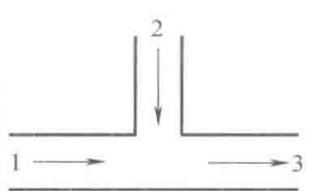</td><td>流向:2→3,ζ=1.5;流向:1→3,ζ=0.1</td><td>分流直角三通</td><td>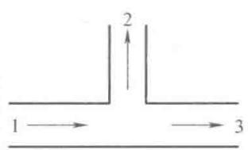</td><td>流向:1→2,ζ=1.5;流向:1→3,ζ=0.1</td></tr><tr><td>合流斜角三通</td><td>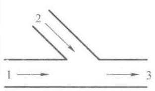</td><td>流向:2→3,ζ=0.5;流向:1→3,ζ=0.1</td><td>分流斜角三通</td><td>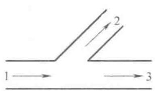</td><td>流向:1→2,ζ=1;流向:1→3,ζ=0.1</td></tr></table>

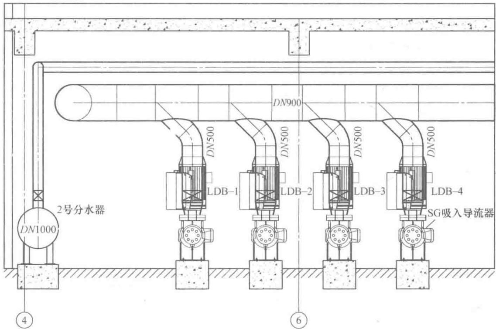  
图 4-10 冷冻机房内水管三通做法

6. 适当加大冷水干管的管径。由式（2-3）可知，管道的阻力反比于管径的5次方，即：

$$
\frac {\Delta P _ {1}}{\Delta P _ {2}} = \left(\frac {d _ {2}}{d _ {1}}\right) ^ {5}.
$$

适当加大冷水干管的管径，如敷设于高层建筑管井内的冷水管的管径，不仅可以降低管道的阻力，同时，由于干管的阻力相对于末端支管的阻力较小，这样水系统更容易水力平衡。如果采用 DN300 的管径代替 DN250 的管径，带入上式，管路阻力可以减小 60%。

7. 采用低阻力冷水机组。双流程冷水机组的冷凝器、满液式蒸发器的水阻力一般都在

20～100kPa 之间，对于某一确定系列的冷水机组，影响机组阻力大小的原因是换热器的大小，也就是换热器内部换热管束的多少，对于高能效的冷水机组很容易做到低阻力。这对于输配系统的节能至关重要，SCOP、ECR-a 的限值也是对机组蒸发器、冷凝器水阻力的间接限制。在设计和设备招标时限定机组蒸发器、冷凝器的水阻力，力求做到小或等于 40kPa。

8. 冷却塔靠近冷水机组布置，尽量缩短冷却水管路的长度。

9. 采用大温差。对于输送系统的冷水泵、冷却水泵而言，由水泵的有效轴功率公式 $N_{\mathrm{e}} = g \cdot L \cdot H$ 可知，低能耗取决于低流量和低扬程，冷水所输送的冷量：

$$
Q = c \cdot \rho \cdot L \cdot \Delta t\tag{4-11}
$$

式中 $N_{e}$ ——有效功率，kW；

g——重力加速度， $9.8m/s^{2}$ ;

L——水泵的流量， $m^{3}/s$ ;

H——水泵扬程，m；

Q——水泵输送的冷量，kW；

c——水的定压比热 $\left[\mathrm{kJ}/(\mathrm{kg}\cdot^{\circ}\mathrm{C})\right]$ ，取 $4.18\mathrm{kJ}/(\mathrm{kg}\cdot^{\circ}\mathrm{C})$ ;

$\rho$ ——水的密度， $1000kg/m^{3}$ ;

$\Delta t$ ——供回水温差， $℃$ 。

由上式可知，水泵输送冷量一定时，温差大，流量可以减少，因此泵的能耗会降低。常规的空调系统冷水供回水温差及冷却水供回水温差均为 $5^{\circ}$ C，如果将冷水供回水温差加大到 $6\sim9^{\circ}$ C，冷却水供回水温差也加大到 $6\sim9^{\circ}$ C，则，水系统的输送能耗可大幅地减少。

例如：输送相同冷量的冷水，当供回水温差采用 $\Delta t=6^{\circ}C$ 代替 $\Delta t=5^{\circ}C$ 时，代入上式可知，水泵能耗降低 17%；当供回水温差采用 $\Delta t=7^{\circ}C$ 代替 $\Delta t=5^{\circ}C$ 时，代入上式可知，水泵能耗降低 29%。

(1) 冷却水大温差。冷却水大温差有利于冷却塔的散热, 冷却塔利用的是空气的湿球温度进行冷却, 只要湿球温度低于冷却水水温就能起到冷却作用, 工作中的冷却塔的出水温度趋近于周围环境空气的湿球温度, 这种趋近程度被称为逼近度:

冷却塔的逼近度 = 冷却塔出口水温 - 环境空气的湿球温度

假定环境湿球温度为 $27^{\circ}C$ ，逼近度为 $3^{\circ}C$ ，冷却塔在：

8℃温差时（30℃/38℃），冷却塔的散热能力为115%；

$5^{\circ}$ C温差时（ $30^{\circ}$ C / $35^{\circ}$ C），冷却塔的散热能力为100%；

$2^{\circ} \mathrm{C}$ 温差时（ $30^{\circ} \mathrm{C} / 32^{\circ} \mathrm{C}$ ），冷却塔的散热能力为 $75 \%$ 。

(2) 冷水大温差。冷水系统可以按大温差来设计, 现有的常规系统在一定范围内也可以转变为大温差的模式运行, 但在冷水大温差运行模式下, 空调系统的冷源、输配和末端环节的设计匹配与常规系统相比都将产生相应的改变。

1）冷水大温差对冷水机组的影响。常规的空调系统，其冷水机组的进/出水温度为 $12^{\circ}C/7^{\circ}C$ ，若回水温度 $12^{\circ}C$ 不变，出水温度降低至 $5^{\circ}C$ ，由本书第13.5节可知，冷水机组的COP将会下降 $6\%\sim8\%$ 。若维持其出水温度 $7^{\circ}C$ 不变，通过提高冷水机组进水温度来达到大温差运行，冷水机组的COP会有所提升，但是提升的程度有限。

2）冷水大温差对空调末端设备的影响。若回水温度过高，末端空调箱的表冷器和风机盘管性能都将有所下降，其中以除湿能力的衰减最为明显。因此，冷水大温差系统设计必须根据设计工况温差来选择表冷器。相比常规的 $12^{\circ}$ C /7℃ 工况，大温差工况下，表冷器选型时排数会有所增加或迎风面积增大，对应于风机盘管就是型号需要增大。这将导致设备阻力变大，末端能耗增加，同时提高工程造价。

降低冷水机组的冷水出水温度可以减小大温差对表冷器和风机盘管冷却除湿性能的不利影响，但降低供水温度将引起冷水机组能耗的增加。因此，当采用冷水机组直供时，通常冷水出水温度不宜低于 $5^{\circ}$ C。

大温差空调冷水系统对冷水机组、冷水泵的能耗产生较大影响，但其运行是有其适用范围的。只有在冷水泵的能耗减少大于冷机能耗的增加时，其节能才有实际意义。

冷水大温差系统挖掘了空调输配系统的节能潜力，同时减小了输配设备的尺寸，降低了初投资，特别适用于供冷半径大、输配管道长的系统，如区域供冷系统，可大大降低其初投资和运行能耗；

冷水大温差系统特别适用于冰蓄冷空调系统。冰蓄冷空调系统可提供 $1 \sim 4^{\circ} \mathrm{C}$ 的低温冷水，将大大提高表冷器和风机盘管的冷却除湿能力，从而可以避免末端设备的投资增加。

10. 水泵、冷却塔风机采用变频控制。冷水泵变频，即一次泵变流量系统，冷水泵根据压差信号变频运行，冷却塔风机根据冷却塔的出水温度变频运行，值得注意的是冷却塔节能的控制不是保证冷却塔的出水温度恒定在 $32^{\circ}$ C，而是将冷却水温度控制在冷水机组的最优进水温度，详见本书第 15.5.1 节。

而冷却水泵一般不主张变频，这是因为：一方面，当冷却水流量减少时，冷凝器内水流速下降，将会导致冷却水中的泥沙沉积在换热管上，使换热效果恶化。另一方面，在部分负荷时，冷却水泵变频不一定就节能，因为冷水机组通过定流量来降低冷凝温度可大幅降低压缩机的功耗。总体上是否节能要看冷却水泵功耗在机组的综合性能系数中（SCOP）所占的比重。如果冷却水泵功耗比重较小时，节能效果不明显。只有冷却水泵功耗在机组的综合性能系数中（SCOP）所占比例较大，冷却水泵变频的节能效果大于定流量时压缩机的节能效果才有意义。

**4.5 冷水系统形式**

空调系统较大时，由分水器供至末端的冷水，应根据不同的区域或不同的设备分成若干支路，考虑到可靠性、阻力的差别以及调试的方便，例如在医院项目设计时，一般会将风机盘管、舒适性空调机组、手术部净化空调机组，以及血液病房净化空调机组分成各自独立的支路。

**4.5.1 冷水冷源侧一次泵定流量系统**

在一次泵定流量系统中，当末端负荷减少时，供回水之间的压差加大，旁通管上的电动调节阀根据压差调节开度，旁通部分水量，保证压差恒定，从而保证流过冷水机组的流量不变。旁通管管径的确定方法：按其流量为一台最小主机的流量来计算。水泵与冷水机组有两种连接方式，分别见图4-11及图4-12。

**4.5.2 冷水冷源侧二级泵（多级泵）变流量系统**

冷水冷源侧二级泵（多级泵）变流量系统有多种形式，工程设计时应根据不同的情况采用相应的方式。

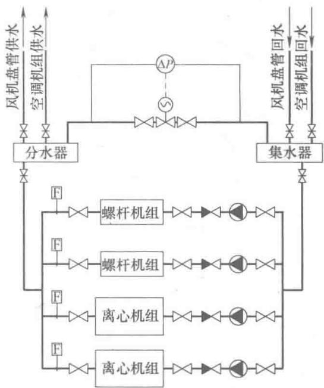  
图 4-11 冷水一次泵定流量循环泵与冷水机组之间采用一对一连接示意图

1. 当空调管网系统较大，阻力较高时，宜采用二级泵或多级泵系统，如图4-13所示的区域供冷系统。该系统中：

（1）一级泵仅克服冷水机房内的管路阻力；

（2）变频二级泵克服室外区域管网的阻力，根据管网的最不利末端的供回水压差 $\Delta P_{2}$ 变频运行，保证最不利末端压差恒定； $\Delta P_{2}$ 压差传感器应在多栋建筑入口设置，以便当某一建筑的空调系统关闭时，自控系统根据预先编好的程序重新选择确定最不利环路。

（3）变频用户泵设置在各个建筑内，克服板式换热器二次侧的阻力，根据末端的供水压差 $\Delta P_{1}$ 变频运行，保证供水压差恒定。板式换热器的一次侧电动调节阀根据二次侧的供水温度调节，保证供水温度恒定。

2. 当各区域管路阻力相差悬殊或各系统水温要求不同时，宜按区域分别设置二级泵。

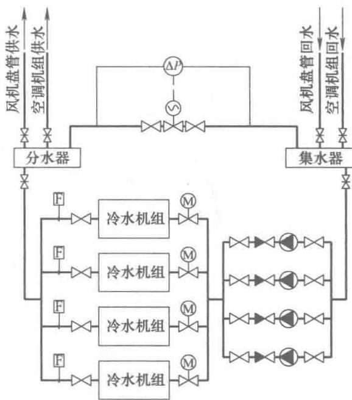  
图 4-12 冷水一次泵定流量循环泵与冷水机组之间采用共用集管连接示意图

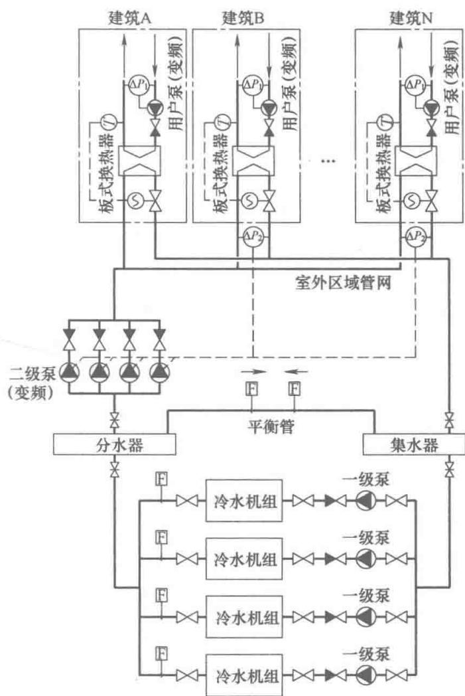  
图 4-13 区域供冷多级泵系统

图 4-14 所示为某医院新建门诊楼制冷系统，为了减少输送能耗，采用大温差供冷，供 / 回水温度为 $6^{\circ}C / 12^{\circ}C$ ；同时，由于新建科研楼距新建的门诊楼较远，它们的阻力相差较大。因此，采用两组不同的二级循环泵。

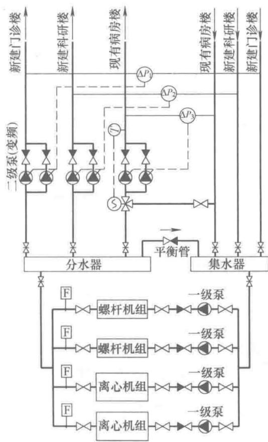  
图 4-14 分区域多级泵系统

该医院现有的病房楼的制冷系统已达到使用寿命，需要由新建的冷水机房供冷，由于原设计是供/回水温度为7℃/12℃，为了避免低温供水使其保温失效、结露，因此，需采用混水措施提高其供水温度至7℃。各二级泵根据各自回路的供回水压差变频运行，保证各自回路的压差恒定。混水三通阀根据供水温度调节，保证现有病房楼的供水温度恒定。

**3. 平衡管**

二级泵系统中，理论上在设计负荷时，平衡管内的水是不流动的，在末端的负荷大于冷水机组提供的负荷时，平衡管内的水由集水器流向分水器，相反，在末端的负荷小于冷水机组提供的负荷时，则由分水器流向集水器。由此，判断平衡管内的流向，就可以判断冷水机组运行台数的加减趋势。通常可以在平衡管上安装两个方向相反的靶片式流量开关，来判断水的流向。如图4-13所示。

平衡管上不应设置阀门，平衡管的管径为单台容量最大机组的管径，通常与供、回水总管的管径相同。以上的系统在末端负荷大于冷水机组提供的负荷时，平衡管内的水由集水器流向分水器，这样会导致冷水的供水与回水混合，使得供水温度升高，在系统没有

达到加机的之前，过高的冷水温度使得末端除湿能力下降，二级泵以小温差大流量的方式运行，不节能。解决这个问题可在平衡管上装单向阀，此时，单向阀使得系统相当于一级泵与二级泵串联运行，一级泵的流量会增大，可以制取超额冷量。

**4.5.3 一级泵定流量系统与二级泵变流量系统的结合**

二级泵的另一项应用就是在一级泵定流量的系统上，利用风机盘管和空调机组的回水，通过二级混水泵来制取更高温度的冷水，供建筑局部的高温末端使用。

图 4-15 为某医院的制冷系统图，为了提高舒适度，其病房部分采用冷梁空调，一级泵定流量系统供 / 回水温度为 $7^{\circ}C/12^{\circ}C$ ，二级泵在集水器上抽取 $12^{\circ}C$ 的冷水，与冷梁的 $18^{\circ}C$ 回水混合至 $15^{\circ}C$ 供给冷梁。由于提高了供水温度，相应的送风温度也被提高，使得病房内无吹冷风感，提高了舒适度。

混水三通阀根据冷梁的供水温度调节，保证冷

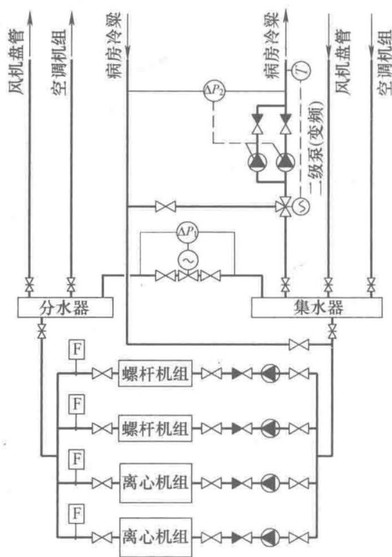  
图 4-15 一次泵定流量系统与  
二级泵变流量的结合系统

梁的供水温度恒定。二级泵根据冷梁回路的供回水压差变频运行，保证压差恒定。

**4.5.4 冷水冷源侧一次泵变流量系统**

舒适性空调系统在绝大部分时间都是在部分负荷下运行，然而空调系统的冷水循环泵流量都是在设计工况下确定的，在部分负荷工况下，大部分水量都是通过分集水器之间的旁通管旁通掉了，而没有到达末端，造成水泵空耗。因此，节省冷水泵在部分负荷工况下的能耗意义重大。随着节能设计要求的深入以及冷水机组控制技术的进步，早先冷水机组蒸发器、冷凝器一定要保持恒定流量的观念已经被打破。越来越多的工程采用了冷水一次泵变流量系统。

**1. 一次泵变流量系统的应用有三个前提条件**

(1) 采用变流量冷水机组。变流量冷水机组是指蒸发器的流量可在较大范围内变化的机组, 机组蒸发器的许可流量变化范围和许可流量变化率是衡量冷水机组性能的重要指标。机组蒸发器的许可流量变化范围越大, 越有利于冷水机组的加、减机控制, 节能效果越明显; 机组蒸发器的许可流量变化率越大, 冷水机组变流量时出水温度波动越小。在实际的机组设计选型中: 选择蒸发器流量许可变化范围大, 最小流量尽可能低的冷水机组, 如离心机 $30\% \sim 130\%$ , 螺杆机 $45\% \sim 120\%$ , 最小流量宜小于额定流量的 $50\%$ ; 选择蒸发器许可流量变化率大的冷水机组, 每分钟许可流量变化率宜大于 $30\%$ 。

为了保证冷水机组出水温度稳定，变流量冷水机组不仅具有反馈控制功能，还具有前馈控制功能。这种控制不仅能根据冷水机组的出水温度变化调节机组负荷，还能根据冷水机组的进水温度变化来预测和补偿空调负荷变化对出水温度的影响。目前，各大厂家的变流量冷水机组基本上都能满足上述要求。

（2）监测机组的最小流量。冷水机组的最小流量检测有两种方式：

1）设置精度较高的电磁流量传感器监测机组的最小流量，如图4-16和图4-17所示。当制冷量较大、冷水总管管径较大时，电磁流量传感器的造价将会很高，采用这种方式不经济。

2）如图 4-18 所示，也可使用压差传感器测量蒸发器的压降，根据机组的压降—流量特性得到流过蒸发器的流量。当机组达到最小流量时，末端流量还需进一步减小时，开启旁通阀。使流过蒸发器的流量等于旁通流量加上末端的流量。

（3）冷水循环泵根据供回水压差变频运行。

**2. 一次泵变流量系统的优点**

与二级泵变流量系统相比，一次泵变流量省去了二级泵。可以消除一次泵定流量和二级泵系统的“低温差综合症”，使冷水机组高效运行。在某些场合一次泵变流量系统可以完全代替二级泵系统，但是在集中供冷、分期建设的项目，二级泵系统仍然具有较大的优势。

**3. 一次泵变流量系统方式**

冷水泵与冷水机组的连接采用一对一的连接方式或共用集管的连接方式，两种连接方式都可以做一次泵变流量，但是两者的效果有些不同。

图 4-16 中，大小主机并联设置，冷水机组与水泵一一对应，同开同关。流量调节时，首先调节冷水机组的运行台数，然后再调节冷水泵的运行转速。当任何一台冷水机组的流量达到其最小流量且末端流量还需进一步减小时，均需开启旁通阀。

图 4-17～图 4-19 中，相同型号的冷水机组并联设置，可以使冷水机组和水泵的运行台数不必一一对应（在图 4-17 中，一般设计台数还是要一一对应）。它们的台数变化和启停可分别独立控制。图 4-17～图 4-19 可以充分利用冷水机组的超额冷量，减少并联的冷

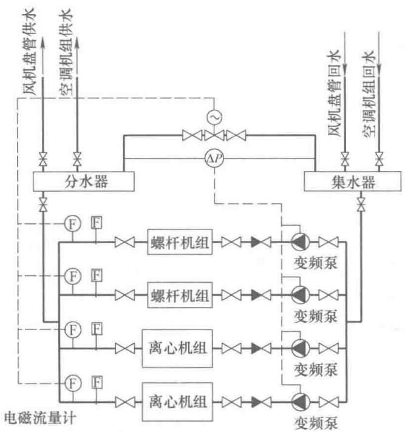  
图 4-16 冷水一次泵变流量循环泵与冷水机组之间采用一对一连接

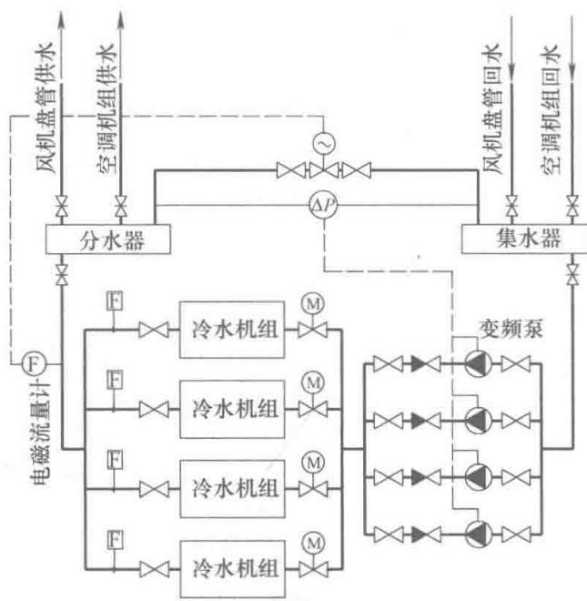  
图 4-17 冷水一次泵变流量循环泵与冷水机组之间采用共用集管连接方式

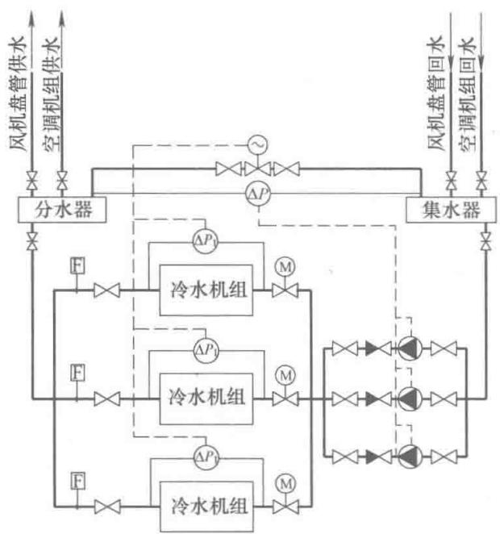  
图 4-18 蒸发器的最小压差控制机组的最小流量

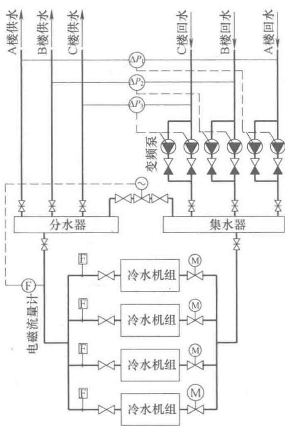  
图 4-19 冷水一次泵变流量分区一次泵变流量系统

水机组和冷却水泵的全年运行时数和能耗。由于是相同的主机并联运行，在流量变化时，各台主机的流量始终是相等的，因此，当总管上的检测到的流量除以运行台数，就是单台冷水机组的流量，当其达到机组的最小流量且末端流量还需进一步减小时，需开启旁通阀。

图 4-20 中，大小不同的冷水机组与变流量循环泵之间采用共用集管连接方式，此时应在冷水机组入口处设置静态平衡阀进行流量初调。

**4. 冷水机组的超额冷量**

所谓冷水机组的超额冷量是指当冷却水进水温度低于设计工况时，冷水机组满负荷运行时的制冷量通常会大于其额定冷量。当采用图4-17～图4-19的连接方式时，水泵的运行台数与冷水机的运行台数可以不一一对应，这样就可以通过加大蒸发器的流量，来获得超额的冷量。

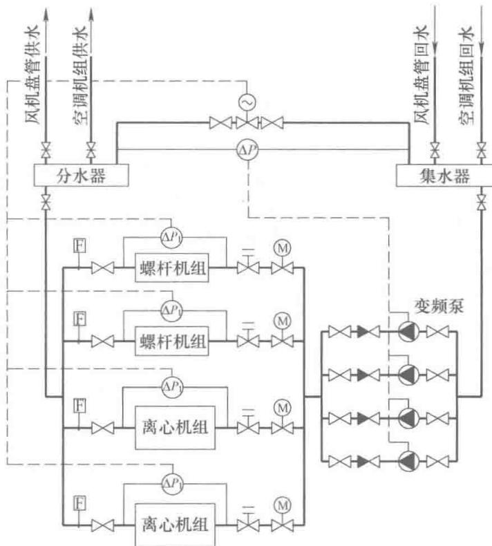  
图 4-20 一级泵变流量循环泵与大小不同的冷水机组之间采用共用集管连接方式

**4.6 超高层建筑空调水冷系统竖向分区节能设计**

超高层建筑空调水系统竖向分区是设计工作的重要的环节，空调水系统竖向分区是否合理，将会对工程的安全性、节能性、经济性和运行管理等产生重大的影响。

空调水系统竖向分区的主要原因是随着建筑高度的不断增加，空调水系统工作压力也逐渐增大，为了解决设备和管道系统的承压问题，一般是采用设置板式换热器进行竖向换热分区，但是这样的换热分区不宜进行多级，因为如果中间换热设备和分区循环泵增多，一方面增加了能源的转输能耗，另一方面，冷水经换热设备梯级换热后温度逐级升高，空调末端设备换热面积将增大，末端设备投资增加，同时，二次水的去湿能力下降。为了保证冷水有一定的除湿能力，一般要求冷水温度 $\leqslant8^{\circ}C$ 。为了保证冷水机组的效率，冷水机组的出水温度也不能太低，换热次数也不能太多，一般不超过两次。这样一来，就需要充分利用设备和管道系统承压能力，在系统分区时，应尽量用足一次水可能达到的高度，尽量减少竖向分区，也是节能设计的重要手段。

为了避免循环水泵对冷水机组和板式换热器承压的影响，这样的系统一般是把水泵的吸入侧与冷水机组或板式换热器相连，考虑到空调水系统设备的承压，必须保证系统最大工作压力不超过2.5MPa。

**4.6.1 目前空调系统主要设备及管道的承压**

1. 冷水机组的承压有 1.6MPa、2.0MPa。

2. 空调机组、风机盘管机组的承压为 1.6MPa。

3. 板式换热器的承压为 1.6MPa、2.0MPa、2.5MPa。

4. 水泵壳体的承压为 1.6MPa、2.0MPa、2.5MPa。

5. 阀门的承压等级很多，可根据系统工作压力选取，如 1.6MPa、2.0MPa、2.5MPa、4.0MPa。

6. 管道连接：螺纹连接最大承压不超过 1.6MPa，普通焊接法兰连接最大承压为 2.5MPa，特殊工艺的法兰可以达到 4.0MPa，甚至更高的承压要求；焊接连接承压可以达到管道本身的承压要求。

**4.6.2 空调冷水系统分区方式**

1. 采用承压为 1.6MPa 的冷水机组时，竖向分区可按图 4-21 所示的方案。

2. 采用承压为 2.0MPa 的冷水机组，同时楼层高度仅需一次换冷时，竖向分区可按图 4-22 所示的方案，该方案中，为了防止低区末端设备超压，将群房以下部分采用板式换热器隔离后供冷。

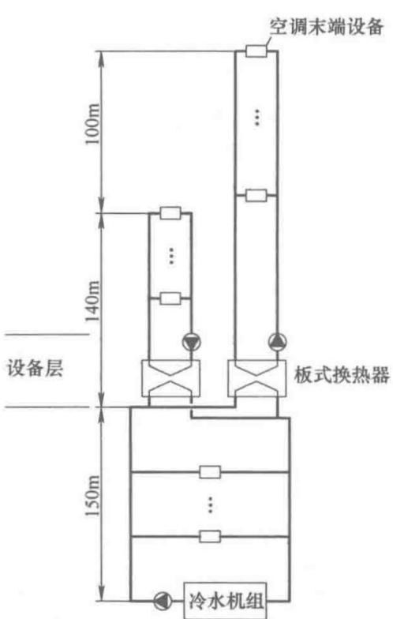  
图 4-21 一次换热系统分区示意图 1

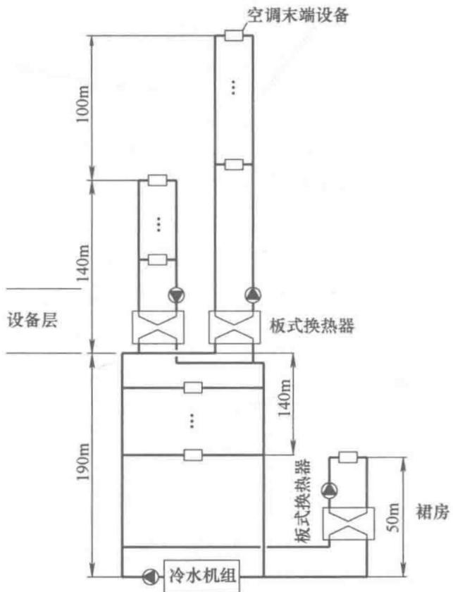  
图 4-22 一次换热系统分区示意图 2

3. 采用承压为 2.0MPa 的冷水机组同时楼层高度需要两次换冷时，竖向分区可按图 4-23 的方案，同样，为了防止低区末端设备超压，该方案将群房以下部分采用板式换热器隔离后供冷。

以上分区方式为较理想的分区方式，实际工程中，随着设备层位置的不同，分区需作相应的调整。

**4.6.3 空调热水系统分区方式**

空调热水系统可以参照冷水系统来分区。但是如果是自建热源锅炉房或者有蒸汽热源建议采用蒸汽供热。利用蒸汽本身的压力直接供至各个换热器所在的设备层，如图4-24所示。这样不仅节省了热水的输送能耗，同时，由于蒸汽换热利用的是汽化潜热且流速高，在输送同样热量时，其管径小得多，可以节省管井的面积和管道层的高度，这一点对于超高层建筑来讲非常重要。供热系统换热器与供冷系统板式换热器宜设置在同一设备层，方便供冷与供热相互切换。

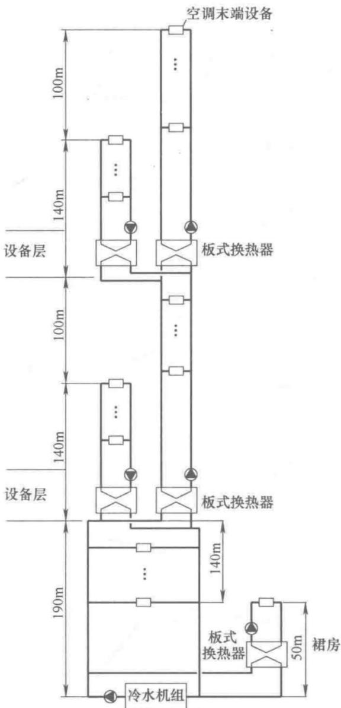  
图 4-23 二次换热系统分区示意图

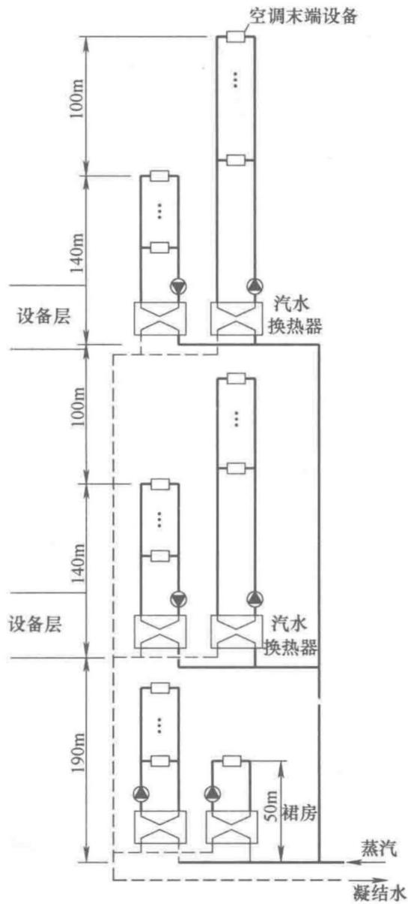  
图 4-24 蒸汽供热系统分区示意图

以一座 300m 高，建筑面积为 $179000 \, m^{2}$ 的塔楼为例，其冬季空调热负荷约为 15100kW。如果采用 $85^{\circ}C / 60^{\circ}C$ 的热水供热，其主管直径为 DN300，如果采用 0.8MPa 的饱和蒸汽，其主管直径可以降到 DN200（蒸汽量的计算详见本书第 6.3.5 节）。

**4.7 冷却塔冬季供冷系统**

冷却塔供冷能够利用自然冷源，解决冬季某些建筑的供冷需求，减少制冷水机运行时间，从而得到显著的节能效果。但是冬季空调供冷应优先采用室外新风消除室内余热，这是利用自然冷源的最直接的方式。一些工程内区面积或冷负荷过小，或内区采用全空气系统，是没有必要设置冬季供冷水系统的，盲目设置会造成投资增加和新的能源浪费。在风机盘管加新风空调系统中，冬季空调内区如需供冷，水系统采用分区两管制或四管制，供

暖期应完全利用冷却塔提供空调冷水供冷。

同样，这种方式也适用于某些采用冷水式恒温恒湿机组的数据中心以及采用定新风比净化空调系统的医疗场所。

**4.7.1 冷却塔制冷的基本原理**

从冷却塔工作原理可以看出，冷却塔能将水温降低的原因在于，水在蒸发过程中需要吸收热量从而使没有蒸发的水温度降低，水温降低的程度取决于蒸发水量，蒸发水量取决于空气的饱和程度。首先冷却水在冷却塔内与空气接触进行热湿交换，只要湿球温度低于冷却水温度就能起冷却作用。随着过渡季及冬季的到来，室外气温逐渐下降，相对湿度降低，室外湿球温度也下降，从而冷却塔出口水温也随之降低。例如：夏季当湿球温度为28℃时，一般的冷却塔可以使冷却水降温4℃，即供水温度为32℃。对于上述冷却塔，冬季当空气湿球温度为7℃时，冷却塔可以使冷却水降温增加到8℃，即出水温度为15℃。另一方面，冬季建筑室内湿负荷也在不断下降，空调末端除湿需求减少，适当提高冷水水温，减少其除湿能力，完全能满足空调系统舒适性的要求，也就是说，舒适性空调系统冬季空调冷水温度可以略高于夏季的冷水温度。

**4.7.2 冷却塔供冷形式**

冷却塔供冷大致有如下 3 种形式：

**1. 开式冷却塔直供**

冬季，当环境温度足够低时，从冷却塔来的冷却水直接进入冷水系统进行循环，包括进入空调系统的末端（如风机盘管、诱导器等），如图4-25所示。从节约能源的角度，这样的系统效果最好。不过，开式直接供冷系统需要将冷却水系统与冷水系统相连通，这样被冷却塔洗涤下来的空气中的灰尘，变成泥浆后就会污染干净的冷水系统，在空调末端换热器内表面附着一层污泥，使其换热效率大幅下降，甚至使其堵塞。一般通过采取对冷水加强过滤的措施（如增设微泡排气除污装置），来改善冷水的污染，但是效果有限，这种方式在空气污染较严重的地区不推荐采用。否则，这种方式冷却塔的安装高度必须高于冷水系统的最高点。

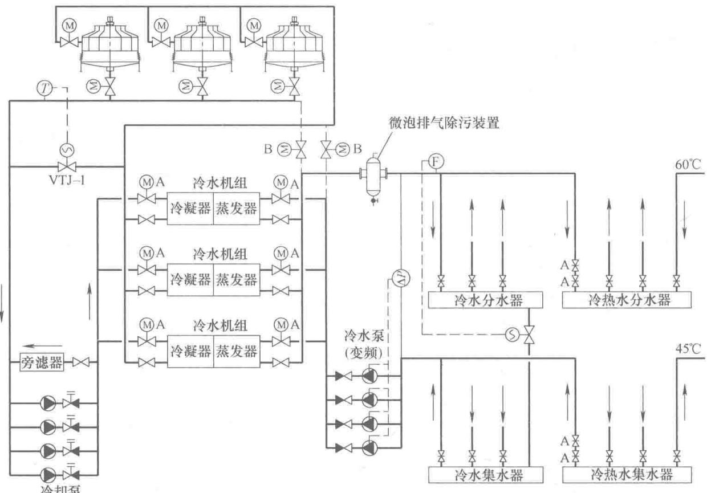  
图 4-25 开式冷却塔直接供冷系统图

**2. 闭式冷却塔供冷**

采用闭式冷却塔的闭式系统（见图 4-26），与开式直接供冷系统的相似之处，在于它也是用从冷却塔供给的冷却水直接进行供冷。不同的是它的冷却水系统是封闭的，冷却水未暴露在大气或灰尘中，这样就解决了堵塞污染问题。由于在闭式冷却塔内进行了空气-水换热，所以冷却塔的出水温度较高，同时由于闭式冷却塔造价较高，而且冷却塔的盘管还需要另外的防冻保护，因此，除非夏季工况时制冷工艺上对闭式冷却塔有特殊要求，一般不会采用。

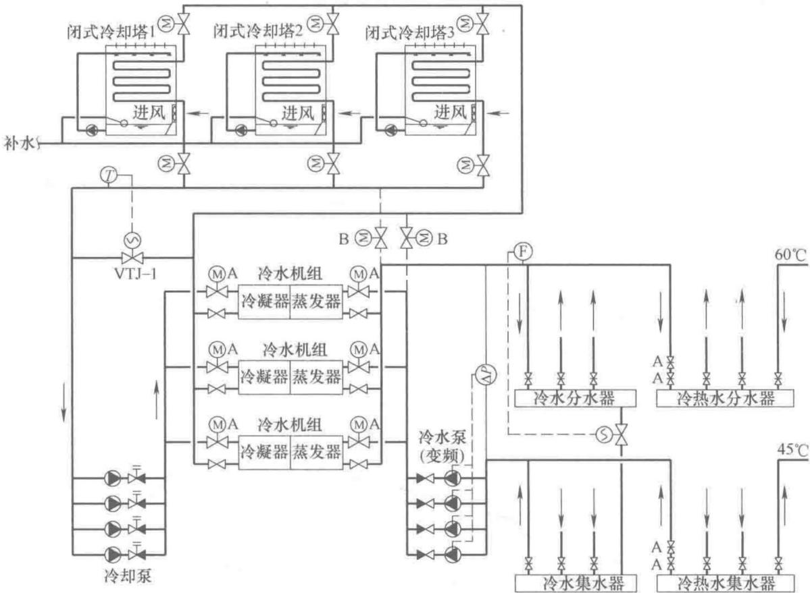  
图 4-26 闭式冷却塔供冷系统图

**3. 开式冷却塔加板式热交换器间接供冷**

冷却水作为一次水，通过板式换热器对冷水进行间接降温。工程设计中可以将板式换热器视为“冷机”与冷水机组并联。由于冷却水系统和冷水系统是隔离的，从而避免了冷水系统被污染、腐蚀和堵塞问题。板式换热器体积小，换热能力强，能够最小限度地减小换热温差，设计时板式换热器宜分成两组，每组均能分担70%的冬季冷负荷。这种供冷方式目前被广泛采用。开式冷却塔加板式热交换器间接供冷的循环泵设置有两种方式：

（1）当水泵与冷水机组一对一的连接方式时，如图 4-27 所示，供冷板式换热器建议单独配冷却水泵和冷水泵，这样在机房设计时管路系统清晰，水泵的大小可以独立选型，不受约束，运行管理方便。

（2）当水泵与冷水机组是共用集管的连接方式时，如图 4-28 所示，供冷板式换热器的冷却水泵和冷水泵可与冷水机组的共用，这样可以节省水泵的投资。

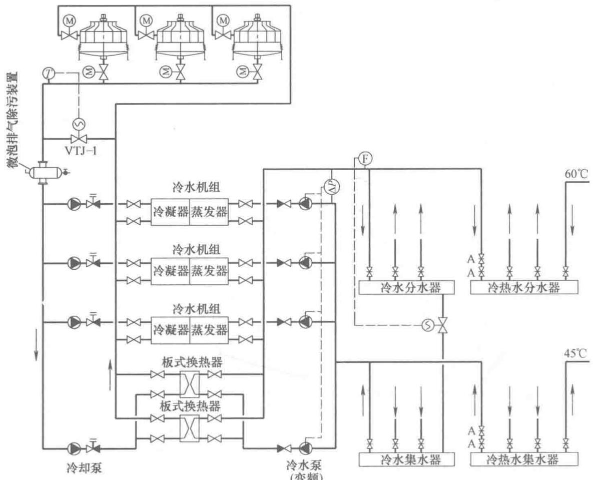  
图 4-27 开式冷却塔 + 板式换热器间接供冷系统图一

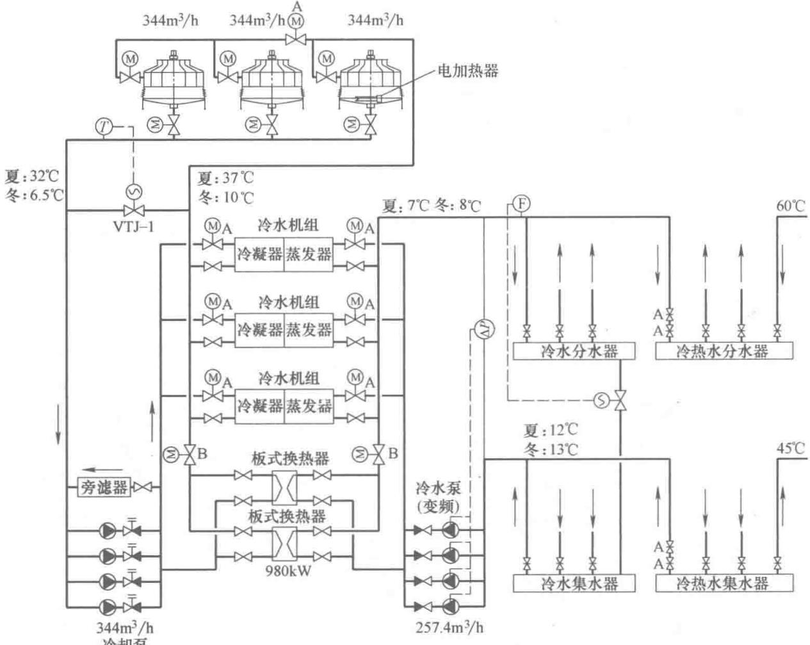  
图 4-28 开式冷却塔 + 板式换热器间接供冷系统图二

**4.7.3 冷却塔供冷转换温度**

为了最大限度地利用室外冷源，设计采用的室外最高湿球温度设计值不应低于 $5^{\circ}$ C，也就是说冷水机组供冷与冷却塔供冷进行转换的依据是室外湿球温度，这个湿球温度不应低于 $5^{\circ}$ C。

**4.7.4 冷却塔特性曲线**

冷却塔特性曲线是冷却塔冬季供冷工况不同流量比下的室外湿球温度 $t_{\mathrm{w}}$ 与冷源水供水温度 $t_{\mathrm{cl}}$ 和冷源水供回水温差 $\Delta t_{\mathrm{c}}$ 的关系图。该曲线应由冷却塔生产厂家通过实测资料提供，但是目前一般的冷却塔厂家都无法提供。当缺少资料时，可参考图4-29（该图引自《北京地区冷却塔供冷设计指南》，是由模拟计算得出的）。

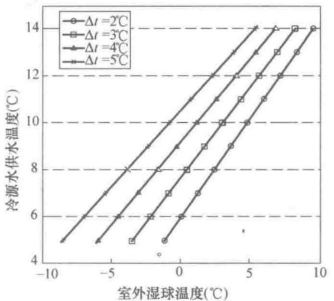  
(a)

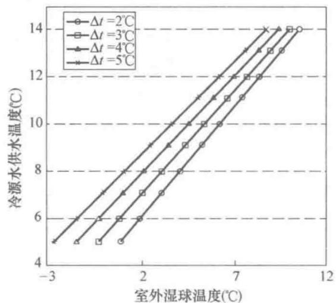  
(b)

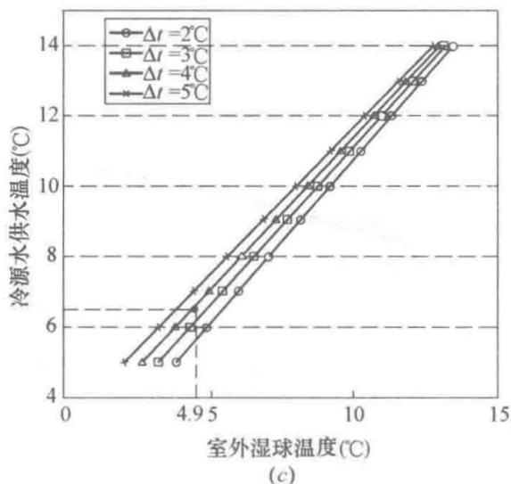  
图 4-29 冷却塔冷却特性曲线  
(a) 流量比 100%; (b) 流量比 70%; (c) 流量比 50%  
注：图中流量比，为冷却塔冬季供冷时的设计流量与夏季名义流量之比；图中温差，为冷却塔供冷时进出口温差。

**4.7.5 冷却塔冬季供冷设计计算**

以图 4-28 所示的北京某冷冻水一次泵变流量系统为例，总冷负荷为 4800kW，采用 3 台制冷量为 1600.4kW 的螺杆式冷水机组，每台冷却水流量为 $344m^{3}/h$ ，冷水流量为 $257.4m^{3}/h$ ，冷水泵、冷却水泵均为三用一备。夏季供冷时冷水供水温度为 $7^{\circ}C$ ，回水温度为 $12^{\circ}C$ ，温差 $5^{\circ}C$ 。冬季冷负荷为 1400kW。

在冷却塔供冷项目设计时，末端（风机盘管或空调机组）设备及冷却塔均已按夏季供冷确定。因此，在冬季供冷时，就存在两者的匹配问题，设计时需计算板式换热器的换热量、确定冷却水泵、冷水泵及冷却塔的开启台数。

1. 首先要确定冬季供冷时冷水的温度，一般是尽量接近夏季的温度，但是，过低的冷水温度会使增加冷却塔的开启台数或者使供冷时间缩短。

冬季冷负荷为 1400kW，取冬季内区空调冷冻水供水温度 $t_{L1}=8^{\circ}C$ ，回水温度 $t_{L2}=13^{\circ}C$ 。

2. 冬季供冷冷水流量：

$$
L _ {1} = \frac {Q}{c \cdot \rho \cdot \Delta t} = \frac {1 4 0 0 \times 8 6 0}{1 \times 1 0 0 0 \times 5} = 2 4 0. 8 \mathrm{m} ^ {3} / \mathrm{h}
$$

由上可知，冬季需要变频运行 1 台冷水泵即可满足供冷要求。

3. 冬季冷却塔供冷时每台板式换热器负担的负荷为：1400kW×70%=980kW。

4. 确定冬季板式换热器温差较小端一、二次水温差 $\Delta t_{x}$ 。

板式换热器温差较小端一、二次介质温差宜取 $\Delta t_{x}=1\sim2^{\circ}C$ 。该温差取的太小，则板式换热器选型后的换热面积太大，工程造价较高。该温差取的太大，则可利用的供冷时间太少。一般取 $\Delta t_{x}=1.5^{\circ}C$ 。

5. 确定冬季冷却水温差 $\Delta t_{c}$ 。

由公式

$$
L _ {2} = \frac {Q}{c \cdot \rho \cdot \Delta t _ {\mathrm{c}}}
$$

可求得

$$
\Delta t _ {\mathrm{c}} = \frac {Q}{c \cdot \rho \cdot L _ {2}}
$$

上式中 $L_{2}$ 的大小由供冷时运行冷却泵的台数决定。一次侧流量越大， $\Delta t_{c}$ 越小。对于同一冷却塔， $\Delta t_{c}$ 越小，要求冷却塔温降越小，可以在较高室外湿球温度情况下供冷，但水泵运行的台数越多，需要电能较多；但 $\Delta t_{c}$ 也不宜过小，否则就是一个大流量小温差的系统，一般以 $2^{\circ}C$ 为界。

当运行 1 台冷却水泵时，代入上式可得 $\Delta t_{c}=3.5^{\circ}C$ ;

当运行 2 台冷却水泵时，代入上式可得 $\Delta t_{c}=1.75^{\circ}C$ 。

由上式可知运行 1 台冷却水泵， $\Delta t_{c}=3.5^{\circ}C$ ，满足要求。

6. 冷却塔供冷的一次冷源水供水温度应如下确定，如图 4-30 所示：

(1) 当 $\Delta t_{c} \leqslant (t_{L2} - t_{L1})$ 时， $t_{c1} = t_{L1} - \Delta t_{x}$

(2) 当 $\Delta t_{c} > (t_{L2} - t_{L1})$ 时， $t_{c1} = t_{L2} - \Delta t_{x} - \Delta t_{c}$

（3） $t_{c1}$ 不应小于 $5^{\circ}C$ ，当 $t_{c1}$ 计算结果小于 $5^{\circ}C$ ，应调整 $\Delta t_{x}$ 或 $\Delta t_{c}$ 。

$\Delta t_{c}$ ——冷源水供回水温差，℃；

$t_{L1}$ ——空调冷水最高供水温度，℃；

$t_{L2}$ ——空调冷水最高回水温度，℃；

由于

$t_{c1}$ ——冷源水最高供水温度，即冷却塔出水温度，℃；

$$
\Delta t _ {\mathrm{c}} = 3. 5 ^ {\circ} \mathrm{C} <   5 ^ {\circ} \mathrm{C}
$$

冷却塔供应的一次冷源水供水温度为： $t_{c1}=t_{L1}-\Delta t_{x}=8^{\circ}C-1.5^{\circ}C=6.5^{\circ}C$

7. 冷却塔供应的一次冷源水回水温度为： $t_{c1}+\Delta t_{c}=6.5^{\circ}C+3.5^{\circ}C=10^{\circ}C$

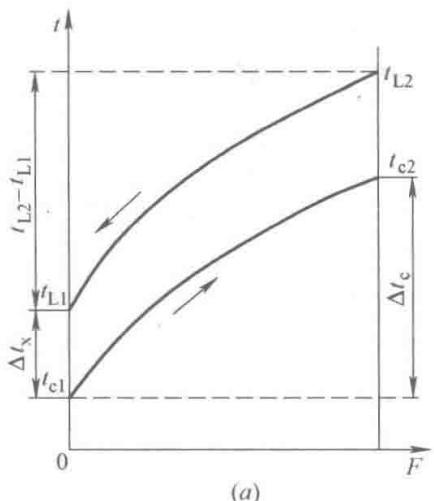

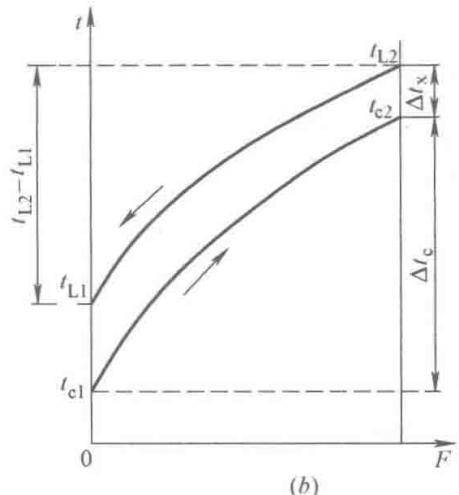  
图 4-30 换热温差关系  
(a) $\Delta t_{c} \leqslant t_{L2} - t_{L1}$ 时，换热温差关系；(b) $\Delta t_{c} > t_{L2} - t_{L1}$ 时，换热温差关系

**8. 确定冬季冷却塔运行的台数**

根据冷却塔供应的一次冷源水供水温度 $6.5^{\circ}$ C 和冬季冷却水温差 $3.5^{\circ}$ C（通过内插法获得），查冷却塔特性曲线，满足室外最高湿球温度设计值不低于 $5^{\circ}$ C 的条件只有冷却塔特性曲线 c。

此时的室外湿球温度为 $t_{w}=4.9^{\circ}C$ ，流量比为 50%。因此冷却塔的夏季名义流量为： $344/50\%=688m^{3}/h$ 。

由上可知冬季供冷需要运行 2 台冷却塔。

**4.7.6 冷却塔冬季供冷控制要求（以图 4-28 为例）**

1. 系统应根据室外湿球温度进行冷水机组供冷和冷却塔供冷的工况转换。转换室外湿球温度为 $t_{w}=4.9^{\circ}C$ ，并根据实际运行实践经验进行调整。冬季冷却塔 + 板式换热器供冷时，图 4-28 中阀门 A 关闭，阀门 B 开启；冷水机组供冷时，阀门 B 关闭，阀门 A 开启；

2. 电动调节阀 VTJ-1 根据冷却塔的出水温度控制：

(1) 冷水机组供冷时, 采用模拟量控制方案, 采用温度传感器实测温度 $T$ 与设定温度 (15.5°C) 的差值, 经 PID 运算后, 调节 VTJ-1, 使冷却塔的出水温度不低于 15.5°C。

(2) 当采用冬季冷却塔 + 板式换热器供冷时, 电动调节阀 VTJ-1 采用开关量控制方案, 水温应控制在不冻结温度以上, 即: 当温度传感器检测到冷却塔的出水温度 $\leqslant 5^{\circ} \mathrm{C}$ 时, 全开 VTJ-1, 当温度传感器检测到冷却塔的出水温度高于设计值 $t_{\mathrm{cl}}$ (6.5°C) 时全关 VTJ-1。

3. 当温度传感器检测到冷却塔的出水温度 $\leqslant 5^{\circ}C$ 时，冷却塔风机停止运行，升高至设计值 $t_{cl}$ 时，恢复运行。

4. 冷却塔集水盘需要设置电加热器，室外冷却水管道需要设置电伴热。电加热器及电伴热的启停控制应纳入楼宇控制，当冷却塔集水盘内水温低于 $5^{\circ}$ C 时开启电加热器，高于设计值 $t_{c1}$ 时，关闭电加热器。同时要确保在集水盘内无水时，电加热器不能启动。

**4.7.7 冷却塔冬季供冷设计注意事项**

1. 应采用为冷水机组配置的冷却塔，确定其中的 1 台或几台作为冬季冷源设备，冷却塔供冷工况时流经冷却塔的流量不应大于冷却塔额定流量；为了防止气温过低时冷却塔冻结，不应小于冷却塔额定流量的 $50\%$ 。冷却水泵应为定流量运行。

2. 冬季不使用的冷却塔和室外管道应泄空防冻。冷却水室内管线需保温，防止冬季供冷时结露。

3. 供冷板式换热器选型时，应让其阻力接近冷水机组冷凝器的阻力，避免因冷却水管路阻力太小，冷却泵过载启动困难。

4. 加强冷却水系统的除污过滤，如设置加药装置、设置旁滤装置或微泡排气除污装置，减轻冷却水对板式换热器的污染。

5. 空调冷水泵应尽量利用按夏季工况选定的设备，有条件时宜变流量运行。

6. 由于闭式冷却塔造价较高，仅仅为了冬季供冷而采用闭式冷却塔是非常不经济的。

7. 冷却塔一般在温度最低的进风口处和填料处最易发生冻结，对于不同类型的冷却塔，容易结冰的程度不同：

（1）横流塔：大面积填料暴露在进风处，且处于半干半湿状态相对易结冰。

（2）轴流风机设在上部的引风式逆流塔：除小面积进风口处外，填料基本处于有一定流速的水流包围中，相对横流塔不易结冰。

（3）离心风机设在下部的半封闭式鼓风式逆流塔：进风腔无水不会结冰；填料也基本处于有一定流速的水流包围中，也不易结冰。

**第 5 章 蓄冷空调工程设计**

由于发电厂的发电能力与用电负荷不相等，同时，由于目前电能还无法有效地大规模储存。这就存在着用电峰值和用电谷值。电力部门通过需求侧管理（demand side management，DSM），采取削峰、填谷、移峰填谷、改变用户的用电方式等措施，对电力负荷曲线进行整形，减少日用电的峰谷差等。

蓄冷空调工程就是在用电低谷时段，利用蓄能设备将制冷机制得的冷量储存起来，在用电高峰期再将储存的冷量释放给空调末端使用。

由于充分利用了夜间低谷电力，不仅使中央空调的运行费用大幅度降低，而且对电网具有显著的移峰填谷作用，提高了电网运行的经济性。对电网来说，蓄冷空调起到了转移用电峰值的作用，平衡了电网负荷，从而提高了发电设备的使用效率，从宏观上减少了发电设备的装机容量，节省了能源消耗，减少了温室气体的排放。

对用户来说，蓄冷空调利用峰谷电价差，给用户节省了空调电费。节省电费的多少与项目所在地的峰谷电价差及蓄冷的形式相关。蓄冷的形式大体上分为水蓄冷和冰蓄冷。水的单位体积蓄冷量较小（5.8～12.77kWh/m $^{3}$ ），蓄冷所占容积较大。冰的单位体积蓄冷量较大（40～50kWh/m $^{3}$ ），冰蓄冷储槽所占容积较水蓄冷小。冰蓄冷可提供较低的供水温度，适宜大温差低温供水、低温送风、区域供冷等空调工程。

**5.1 水蓄冷**

水蓄冷是采用水作为蓄冷介质，利用水在不同温度下具有不同显热量的特性蓄冷。蓄存的冷量取决于蓄冷槽储存冷水的数量和蓄冷温差。因此，水蓄冷最适合大温差供水的空调系统，这将大大增加蓄冷量。

**5.1.1 水蓄冷的冷水机组**

由于水在 $4^{\circ}$ C 时的密度最大，有利于自然分层，因此可以采用常规冷水机组，直接制取 $4^{\circ}$ C 的冷水来储存。也可以采用两台常规冷水机组串联，分两段将冷水降低到 $4^{\circ}$ C，以此来提高机组的制冷效率。

**5.1.2 水的蓄冷量计算**

$$
Q = \frac {\rho \cdot V \cdot c _ {\mathrm{p}} \cdot \Delta t}{3 6 0 0}\tag{5-1}
$$

式中 Q —— 水蓄冷量，kWh;

$\rho$ ——蓄冷水密度，kg/m $^{3}$ ，取1000kg/m $^{3}$ ；

V——水的体积， $m^{3}$ ;

$c_{p}$ ——水的定压比热， $\mathrm{kJ}/(\mathrm{kg}\cdot^{\circ}\mathrm{C})$ ，取4.18kJ/ $(\mathrm{kg}\cdot^{\circ}\mathrm{C})$ ;

$\Delta t$ ——蓄冷水池进、出水温差， $^{\circ}$ C。

但是对于某一水槽的蓄冷量还需附加一定的安全系数。

$$
Q _ {\mathrm{x}} = \frac {\eta \cdot \varphi \cdot Q}{k _ {\mathrm{d}}}\tag{5-2}
$$

式中 $Q_{x}$ ——水槽的蓄冷量，kWh；

$\eta$ ——水槽的容积率，取 0.95；

$\varphi$ ——蓄冷水槽的完善度，考虑斜温层、死水区的影响，一般取 $0.85\sim0.90$ ;

$k_{d}$ ——冷损失附加率，一般取 $1.01 \sim 1.03$ 。

**5.1.3 蓄冷水槽的形式**

蓄冷水槽有多种形式，如：水平串联式、水平并联式，但是以重力自然分层的形式蓄冷的效率最高，应用最多，下面的介绍均为自然分层式。

**5.1.4 采用消防水池水蓄冷**

在民用建筑中常常是利用消防水池来做水蓄冷，这样就不需增加多少投资，比较适合蓄冷量不太大的工程，如酒店等，利用一部分机组来承担夜间负荷，同时用另一部分机组在夜晚低谷电价时来做水蓄冷。

利用消防水池来做水蓄冷需要在设计之初与给排水专业充分沟通，使得消防水池的形状、容量在满足消防要求的同时，也能方便于蓄冷的使用。这种蓄冷最有利的方式是采用自然温度分层。而多水池水平水平串联法、迷宫法及折流法，由于要增加水池内部分隔等措施，增加工程的造价和复杂性，在新建工程中不建议采用。

**1. 蓄冷水池的构造**

采用自然分层式水蓄冷，要求水池的面积与体积之比越小越好，也就是瘦高的形状，或者通过分隔成几个水池，使每个水池变得瘦高。同时，水池内的水面净高要大于5m。水池最好是在冷水机组的上一层，这样蓄冷时冷水机组的蒸发器始终为满水状态，从而形成一个以水池定压的蓄冷循环系统。

在水池内部，通过设置上、下两个完全相同的布水器来控制水流，避免冷热水掺混。下布水器距池底的距离与上部水器距水面的距离相等。

**2. 斜温层**

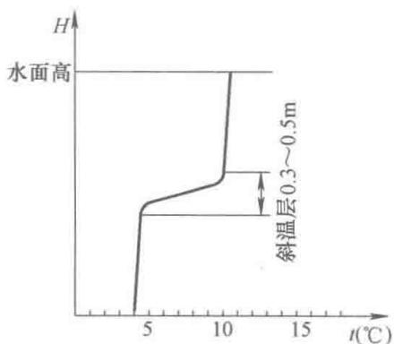  
图 5-1 水池内部斜温层

用 $4^{\circ}\mathrm{C}$ 。

在水池底部的冷水与上部的温水之间，由于温差导热会形成温度过渡层，即斜温层（见图5-1），一般在0.3～0.5m，保证斜温层的稳定，能够防止冷温水的混合。为此，要沿高度方向设置多个间距小于或等于0.3m的温度传感器，来监控水温的变化。

**3. 工作原理**

如图 5-2 所示的采用消防水池的水蓄冷系统，蓄冷时，冷水机组制取冷水直接送入水池，由于水在 $4^{\circ}$ C 时的密度最大，有利于自然分层，因此，冷水机组出水温度一般采

蓄冷时，低温水由下部的布水器进入水池，高温水由上部的布水器流出水池。释冷时，低温水由下部的布水器流出水池，高温水由上部的布水器进入水池。因此，需要一个

转换阀组来实现这一转换。

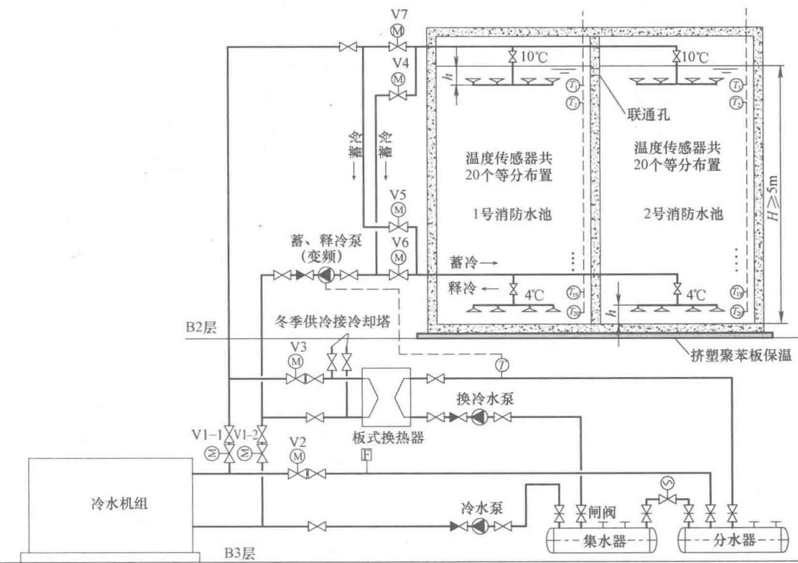  
图 5-2 消防水池水蓄冷原理图

联合供冷时，蓄冷水池与冷水机组一般采用并联的方式运行，而不采用串联的方式。因为如果采用主机下游的串联方式，主机会因为进水温度较低而效率降低。如采用主机上游的串联方式，由于水池出水温度不易稳定，从而导致系统供水温度不稳定。

释冷时，水池内 $4^{\circ}$ C 冷水通过板式换热器交换成 $7^{\circ}$ C / $12^{\circ}$ C 的冷水，进入分集水器。如果有冬季内区冷负荷，该板式换热器可与冬季冷却塔供冷的板式换热器共用，设计时，分别计算两种板式换热器的面积，取其最大值。

蓄冷时，当 $T_{1} \approx 4^{\circ}C$ 时，蓄冷结束。

释冷时，释冷泵根据板式换热器二次侧出水温度变频运行，保证出水温度恒定在 $7^{\circ}C$ 。当释冷泵以最高转速运行时，如果出水温度高于 $7^{\circ}C$ ，则释冷结束。

各种运行模式下设备、阀门状态如表 5-1 所示。

各种运行模式下设备、阀门状态  
表5-1

<table><tr><td>运行模式</td><td>冷水机组</td><td>冷水泵</td><td>蓄、释冷水泵</td><td>换冷水泵</td><td>V1-1、2</td><td>V2</td><td>V3</td><td>V4、V5</td><td>V6、V7</td></tr><tr><td>蓄冷</td><td>开</td><td>关</td><td>开(工频)</td><td>关</td><td>开</td><td>关</td><td>关</td><td>开</td><td>关</td></tr><tr><td>水池单独供冷</td><td>关</td><td>关</td><td>开(变频)</td><td>开</td><td>开</td><td>关</td><td>开</td><td>关</td><td>开</td></tr><tr><td>主机单独供冷</td><td>开</td><td>开</td><td>关</td><td>关</td><td>关</td><td>开</td><td>关</td><td>关</td><td>关</td></tr><tr><td>主机水池联合供冷</td><td>开</td><td>开</td><td>开(变频)</td><td>开</td><td>关</td><td>开</td><td>开</td><td>关</td><td>开</td></tr></table>

**4. 消防水池水的保温**

消防水池水的保温可以采用简单的外保温。由于水池一般要求与建筑主体结构脱开，因此可在水池底部与主体结构之间垫一层挤塑聚苯板作为水池底部的外保温。挤塑聚苯板是由聚苯乙烯树脂及其他添加剂，经挤压过程制造出的拥有连续均匀表层及闭孔式蜂窝结构的板材，这些蜂窝结构的厚板，完全不会出现空隙，同时拥有较低的导热系数[仅为 $0.028\mathrm{W / (M\cdot K)}$ ]和经久不衰的优良保温和抗压性能，抗压强度可达 $220\sim 500\mathrm{kPa}$ $(22\sim 50\mathrm{t / m}^2)$ 。

水池的侧壁保温可采用普通的防火外墙保温做法。

**5. 布水器**

布水器必须保证能够形成一个冷、温水混合程度最小的斜温层，还要保证斜温层不被以后发生的扰动所破坏，因此无论是在蓄冷还是在释冷过程中，水的流动都应以密度差为动力，而尽可能防止惯性力的影响。为此需要控制进水雷诺数在 $Re=400 \sim 800$ 。

$$
R e = \frac {q}{v}\tag{5-3}
$$

$$
q = \frac {Q}{L}\tag{5-4}
$$

式中 q ——单位分配器长度的体积流量， $m^{3}/(m \cdot s)$ ;

v——水的运动黏度， $m^{2}/s$ ;

Q——最大流量， $m^{3}/s$ ;

L——布水器有效长度，m；

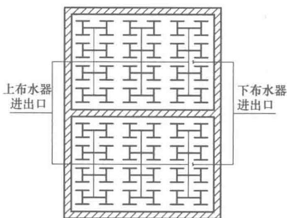  
图 5-3 消防水池 H 形布水器平面图

上部温水的布水器的进、出水孔应朝上，下部冷水的布水器的进、出水孔应朝下，考虑到造价和防腐的要求，目前一般采用工程塑料管上钻孔，孔的流速应小于或等于0.3m/s，由于消防水池一般为矩形或方形，因此，布水器一般采用H形布局（见图5-3）。

**6. 消防水池水蓄冷的注意事项**

（1）消防水池一般在地下，空调冷水系统定压高度远高于水池，在空调与蓄冷转换时，电动阀门的严密性很重要，否则，冷水就会漏到水池后而溢

流掉。

（2）工程中，为了防止池水变质，给排水专业经常将会将消防水池内的水设计成冷却塔的补水，但在消防水池水蓄冷工程中就应避免这样的设计。水池的液位监控及补水、溢水由给排水专业设计。

**5.1.5 采用水蓄冷的区域供冷**

场地宽裕的项目可采用水蓄冷作为区域供冷，如某机场航站区采用水蓄冷的制冷站，采用4个蓄冷水罐，单罐水容积达 $13800m^{3}$ ，罐体有效直径26.5m，有效高度25.1m。总蓄冷量可达50.8万kWh，工程造价远比同等规模的冰蓄冷低得多。由于蓄冷罐较高，水罐一般也兼作区域供冷一次侧的定压补水膨胀水箱。

**1. 采用两级泵的水蓄冷区域供冷系统**

基于与消防水池蓄冷同样的原因，在联合供冷时，蓄冷罐与主机采用并联运行的方式。图5-4为采用大温差的水蓄冷区域供冷原理图，该项目采用两级泵系统，一级泵为定频泵，其扬程用来克服冷冻机房内及室外管网的阻力。二级泵为变频泵，其扬程用来克服末端用户内部阻力，根据末端用户室内管网供回水压差 $\Delta P_{1}$ 变频运行，保证室内管网压差恒定。蓄冷泵仅克服蓄冷罐的阻力。

该系统最大的特点是在夜晚低谷电、冷负荷较低时，可以实现边供冷边蓄冷，省去了机载主机，使系统得以简化。

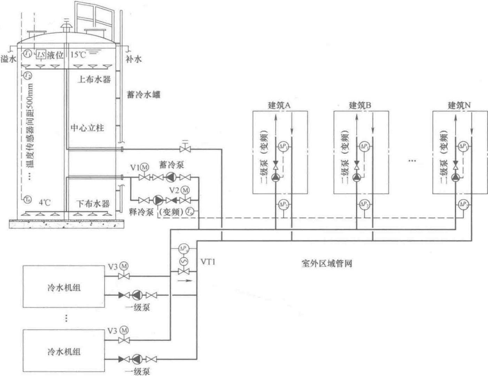  
图 5-4 水蓄冷二级泵系统区域供冷原理图

蓄冷工况下，当 $T_{1}\approx4^{\circ}C$ 时，蓄冷结束。

联合供冷时，以释冷优先，释冷泵以工频额定转速运行，如果出水温度 $T_{0}$ 高于 $4^{\circ}C$ ，则释冷结束。

蓄冷罐单独供冷时，释冷泵根据远端最不利环路供回水压差 $\Delta P_{2}$ 调节转速，保证远端最不利环路供回水之间压差恒定。 $\Delta P_{2}$ 压差传感器应在各建筑入口设置，以便当某一建筑的空调系统关闭时，自控系统根据预先编好的程序重新选择确定最不利环路。

液位计的低水位信号、高水位信号分别控制补水泵的启动和停止。

各种运行模式下设备、阀门状态如表 5-2 所示。

二级泵系统管网的水压图如图 5-5 所示。

各种运行模式下设备、阀门状态  
表5-2

<table><tr><td>运行模式</td><td>冷水机组</td><td>一级泵</td><td>蓄冷泵</td><td>释冷泵</td><td>二级泵</td><td>V1</td><td>V2</td><td>V3</td><td>VT1</td><td>备注</td></tr><tr><td>蓄冷</td><td>开</td><td>开</td><td>开</td><td>关</td><td>关</td><td>开</td><td>关</td><td>开</td><td>关</td><td></td></tr><tr><td>蓄冷水罐单独供冷</td><td>关</td><td>关</td><td>关</td><td>开</td><td>开</td><td>关</td><td>开</td><td>关</td><td>关</td><td></td></tr><tr><td>主机单独供冷</td><td>开</td><td>开</td><td>关</td><td>关</td><td>开</td><td>关</td><td>关</td><td>开</td><td>调节</td><td></td></tr><tr><td>主机水罐联合供冷</td><td>开</td><td>开</td><td>关</td><td>开</td><td>开</td><td>关</td><td>开</td><td>开</td><td>调节</td><td></td></tr><tr><td>主机边供冷边蓄冷</td><td>开</td><td>开</td><td>开</td><td>关</td><td>开</td><td>开</td><td>关</td><td>开</td><td>调节</td><td>冷负荷较低时</td></tr></table>

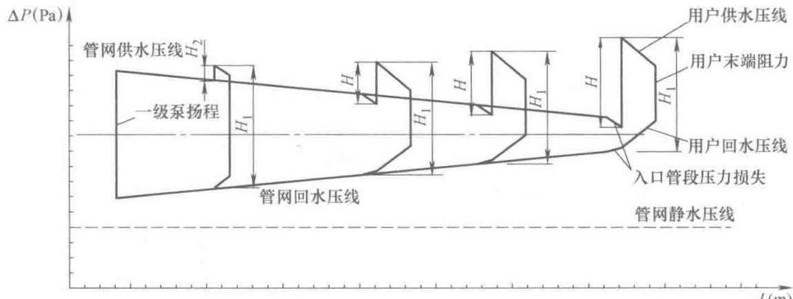  
图 5-5 二级泵系统水压图  
H—二级泵扬程； $H_{1}$ —用户资用压力； $H_{2}$ —蓄冷泵扬程

**2. 采用三级泵的水蓄冷区域供冷系统**

当外网较长，阻力较大，该项目可以采用三级泵系统，如图 5-6 所示。

一级泵为定频泵，其扬程用来克服冷水机房的阻力。

二级泵为变频泵，其扬程用来克服室外管网的阻力。二级泵的控制方法有如下：二级泵为变频泵根据远端最不利环路供回水压差 $\Delta P_{2}$ 调节转速，保证供回水之间的压差恒定。 $\Delta P_{2}$ 压差传感器应在各个栋建筑入口设置，以便当某一建筑的空调系统关闭时，自控系统根据预先编好的程序重新选择确定最不利环路。

三级泵为变频泵，其扬程用来克服末端用户内部阻力，根据室内管网供回水压差 $\Delta P_{1}$ 变频运行，保证室内管网压差恒定。

蓄冷泵、释冷泵仅克服蓄冷罐的阻力。

该系统同样可以在夜晚低谷电、冷负荷较低时，实现边供冷边蓄冷。蓄冷工况下，当 $T_{1}\approx4^{\circ}C$ 时，蓄冷结束。

联合供冷时，以释冷优先，释冷泵以工频额定转速运行，如果出水温度 $T_{0}$ 高于 $4^{\circ}C$ 则释冷结束。

蓄冷罐单独供冷时，释冷泵根据回水温度 $t_{1}$ 与设定值的差值，经 PID 运算后，调节变频器的频率，保证回水温度恒定，避免低温水回到蓄冷罐内。

蓄冷罐内液位计的低水位信号、高水位信号分别控制补水泵的启动和停止。

三级泵系统管网的水压图如图 5-7 所示。

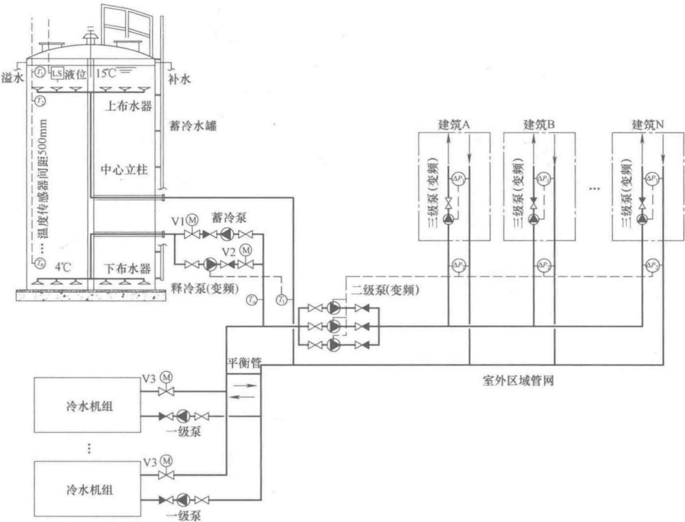  
图 5-6 水蓄冷三级泵系统区域供冷原理图

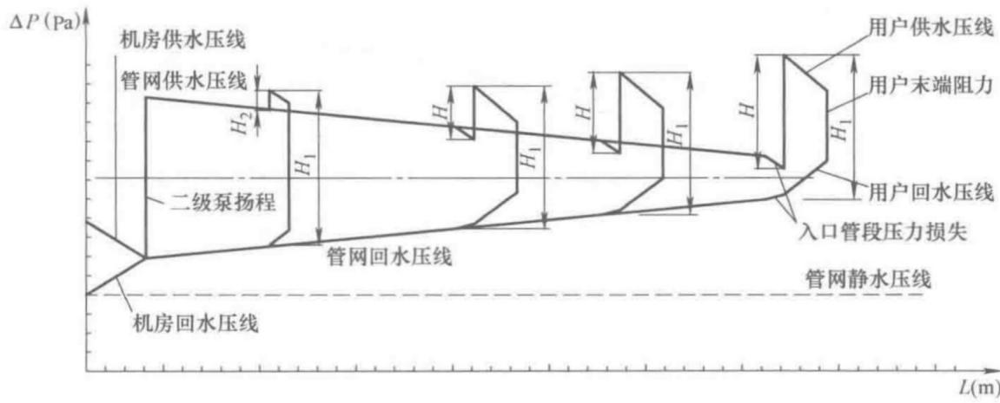  
图 5-7 三级泵系统水压图  
H—三级泵扬程； $H_{1}$ —用户资用压力； $H_{2}$ —蓄冷泵、释冷泵扬程

**3. 采用一次泵变流量的水蓄冷区域供冷系统**

当室外管网阻力不大时可以采用一次泵变流量系统，这样可以使系统大大的简化，如果末端是高层用户，应采用分隔板式换热器进行换热，如图5-8所示。蓄冷时电动蝶阀V1开启，释冷时V1关闭。供冷时，变频冷水泵根据远端最不利环路供回水压差 $\Delta P_{2}$ 调节转速，保证供回水之间压差恒定。释冷时，释冷泵同样根据供回水压差 $\Delta P_{2}$ 调节转速，保证管网远端最不利环路供回水之间压差恒定。 $\Delta P_{2}$ 压差传感器应在各建筑入口设置，以便当某一建筑的空调系统关闭时，自控系统预先编好的程序重新选择确定最不利环路。同时，各机组蒸发器进出口之间设置压差传感器 $\Delta P_{1}$ ，通过 $\Delta P_{1}$ 来监测蒸发器的最小流量，当达到最小流量时，开启 VT1，调节旁通流量，使蒸发器的流量始终大于等于最小流量。为了防止蓄冷时布水器流速超出限值，在蓄冷管路上设置动态流量平衡阀，保证流量恒定。

一次泵变流量系统管网的水压图如图 5-9 所示。

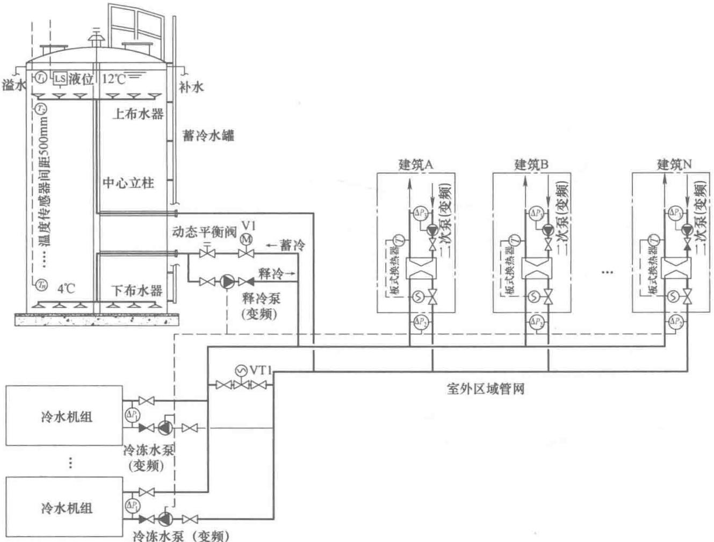  
图 5-8 水蓄冷一次泵变流量系统区域供冷原理图

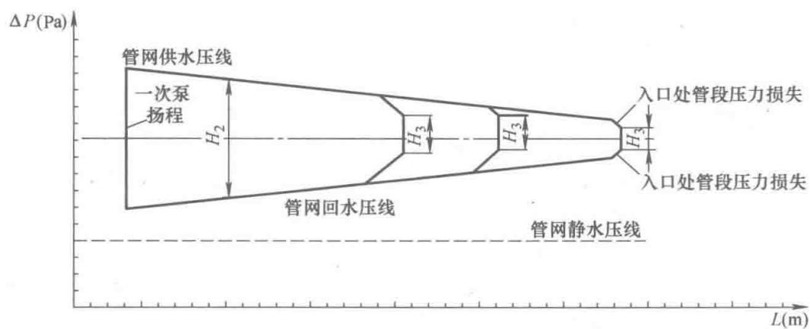  
图 5-9 一次侧水压图  
$H_{2}$ —释冷泵扬程； $H_{3}$ —板式换热器阻力+调节阀阻力

**4. 蓄冷水罐**

蓄冷水罐采用温度分层法，控制释冷及蓄冷时罐中水流平稳，避免罐内水流无序扰动，最大限度减小斜温层厚度。

水流分配系统技术要求：在罐顶和罐底设置水流分配系统，并确保水流到达各水流分配口时流速和流量的稳定、均匀。水流分配系统各水流分配口的流速不大于蓄冷规范要求，进口雷诺数 Re 在 240～850 之间，流速均匀并小于 0.3m/s。水流分配系统所用的材料必须采取必要的防腐措施。

超大型蓄冷水罐为完整产品，其技术性能指标须整体设计、制作及安装。罐体设计应满足《立式圆筒形钢制焊接油罐设计规范》GB 50341—2014的要求。

蓄冷罐及其组件包括：罐底、罐壁、罐顶、笼式直梯、操作平台、防滑条（罐顶的通气孔、测温孔、人孔及其维修通道）、进出水孔、罐顶栏杆及平台、排污管、补水管、人孔、抗风圈、罐体立柱、罐体保温、液位计、双组温感探头（每组间隔0.5m）、航空指示灯等。

罐体保温：蓄冷水罐罐体外保温采用聚氨酯现场发泡，保温层厚度不低于120mm，罐体保冷设计要保证冷量损失最大不超过日蓄冷量的5%。外保护层采用0.8mm厚瓦楞彩色钢板，并考虑罐底的绝热设计。

防腐措施：罐内壁采用两道环氧防锈漆，罐外壁采用两道铁红防锈漆进行防腐处理。栏杆、罐顶平台等预制钢构件加工后采取油漆环氧镀锌处理。蓄水罐附件、直梯、栏杆等的防腐为二底二面，即二道防锈底漆，二道银粉面漆。

**5.1.6 数据中心的水蓄冷**

高安全等级数据中心的水蓄冷与常规的水蓄冷完全不同，它是以保证安全为目的而不是以节省运行电费为目的。当市电出现故障，柴油发电机启动之前，释冷泵、机房内的恒温恒湿空调的风机由UPS供电，蓄冷罐保证在最大负荷下持续供冷15min。由于要求释冷速率非常高，一般的静态冰蓄冷系统都无法满足这一要求。

在图 5-10 中，数据中心的制冷系统为一级泵冷源侧变流量系统，该系统提供 $12^{\circ}$ C / $18^{\circ}$ C 的空调冷水，为了保证水系统的高可靠性，冷水系统为环状管网，能够保证在单点故障时系统能够正常运行。蓄冷水罐兼作定压补水膨胀水箱。系统不是在夜晚低谷电时蓄冷，而是时刻准备着蓄冷和释冷。

当蓄冷罐内竖向水温最高与最低相差 $1^{\circ} \mathrm{C}$ 时, 机组开始蓄冷。蓄冷时, 开启阀门 V1, 当罐内竖向温度均达到 $12^{\circ} \mathrm{C}$ 时, 蓄冷自动停止, 关闭阀门 V1。供冷时, 变频冷水泵根据供回水压差 $\Delta P_{2}$ 调节转速, 保证供回水之间压差恒定。释冷时, 释冷泵同样根据供回水压差 $\Delta P_{2}$ 调节转速, 保证供回水之间压差恒定。同时, 各机组蒸发器进出口之间设置压差传感器 $\Delta P_{1}$ , 通过 $\Delta P_{1}$ 来监测蒸发器的最小流量, 当达到最小流量时, 开启 VT1, 调节旁通流量, 使蒸发器的流量始终大于等于最小流量。

**5.1.7 提高水蓄冷效率的方法**

提高水蓄冷的效率，就是在一个确定的水槽容积下，提高其蓄冷量和释冷量，一般可以从以下几个方面着手：

1. 由式（5-1）可知：加大水槽的供回水温差，可以显著提高蓄冷量，这就要求空调末端系统采用大温差技术。

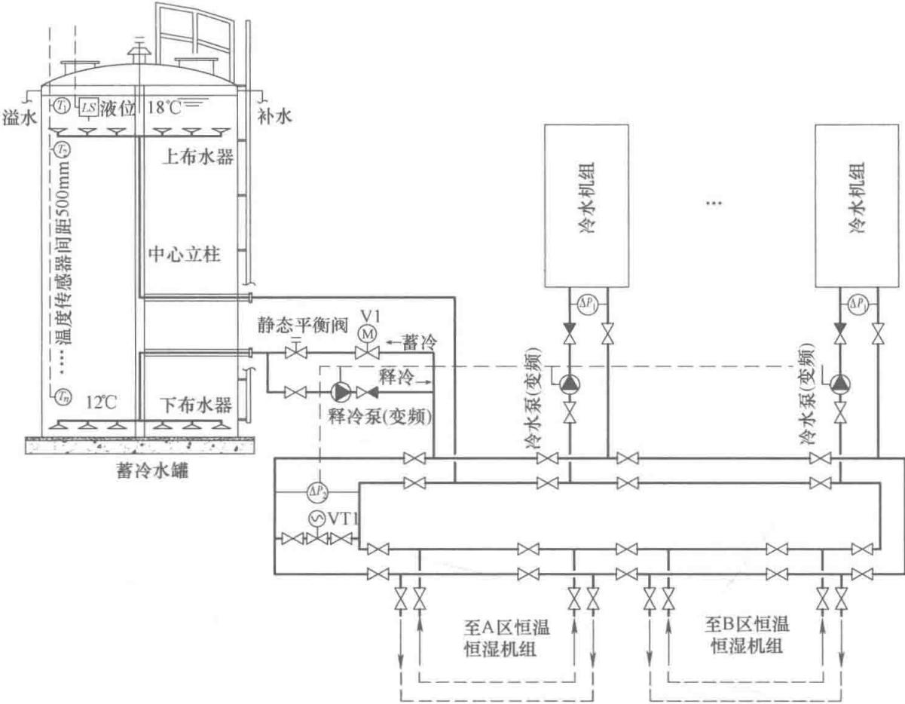  
图 5-10 数据中心水蓄冷一级泵变频系统原理图

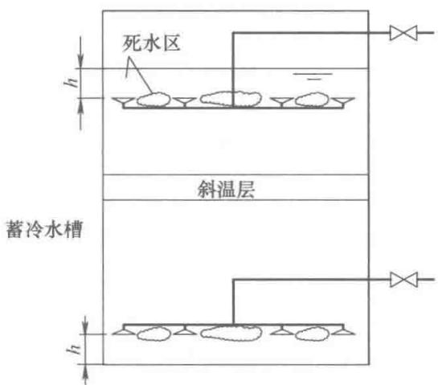  
图 5-11 蓄冷水槽的死水区域

2. 采用瘦高型水槽，提高水槽的完善度，在水槽内部会存在一些死水区，这部分水占据了水槽的容积却不参与换热，如图 5-11 所示，上布水器距水面的空间、下布水器距池底的空间、两个出水孔之间的区域、斜温层的区域。毫无疑问，当水槽为瘦高型时，上述区域的体积会大量减少。

3. 采用高效的布水器，进一步提高水槽的完善度。

4. 释冷泵采用变频泵，避免出现大流量小温差的运行工况，从而导致回水温度降低。

**5.2 冰蓄冷**

根据蓄冷器的形式，目前在中央空调系统中应用较多的有静态制冰（钢盘管式、冰球式、塑料盘管式）和动态制冰（冰片滑落式、流态冰）等几种方式。盘管式以蓄冷量大、技术成熟的优势在区域供冷项目中应用最多。

在国内过去几十年的应用中，各种蓄冷形式的优缺点都得以体现。钢盘管的最大劣势是不耐腐蚀，在钢盘管整体镀锌过程中，有时会存在薄弱部位，或在运输安装过程中遇到磕碰，就使这些部位容易被腐蚀，出现盘管泄漏的情况，而且修复困难。冰球的最大劣势是损耗，有文献说冰球易破裂，需要每年更换一些冰球。但是笔者对运行了十几年的项目随访中没有发现冰球破裂的情况，而是出现了许多冰球因内部的水分流失而瘪了，从而导致蓄冷量大幅衰减。分析其原因，可能是渗透作用引起的。渗透作用（Osmosis）是指两种不同浓度的溶液隔以半透膜（允许溶剂分子通过，不允许溶质分子通过的膜），水分子或其他溶剂分子从低浓度的溶液通过半透膜进入高浓度溶液中的现象。动态制冰具有冷机效率高、释冷速度快等优点，但是其制冰设备容量普遍较小，不太适合大型项目采用。

纳米导热复合盘管能够避免钢盘管的腐蚀泄漏的状况，其制冰性能与钢盘管相当，同时也没有冰球的缺点，经过近20年的工程实践，目前有一定的优势。

蓄冷器与双工况主机的布置形式上有并联和串联两种方式，同时还有主机上游、主机下游两种形式，但是通过多年的工程经验，以及大温差节能等的要求，目前的工程设计以主机上游串联的形式为主。

**5.2.1 盘管式静态冰蓄冷系统**

**1. 盘管种类**

目前应用于冰蓄冷系统的盘管分为钢盘管和塑料盘管两大类。

（1）如图 5-12 所示，钢制蛇形盘管为连续卷焊（或无缝钢管焊接）而成的立置蛇形盘管，外表面热镀锌，管外径 26.67mm，内融冰冰层厚度为 25～30mm。外融冰冰层厚度为 35～40mm。

(2) 如图 5-13 所示, 纳米导热复合盘管, 为不完全冻结蓄冰盘管, 其基材为 PE 纳米复合材料, 内融冰冰层厚度为 $18 \sim 20 \mathrm{~mm}$ 。外融冰冰层厚度为 $20 \sim 22 \mathrm{~mm}$ 。与普通塑料管相比导热系数大, 比高密度聚乙烯管材高 4 倍左右, 接近冰的导热系数 $[2 \mathrm{~W} / (\mathrm{m} \cdot {}^{\circ} \mathrm{C})]$ 。与钢盘管相比, 由于管径较小, 管间距小, 在同样外形尺寸的盘管中, 纳米导热复合盘管比钢制盘管增加了 $20 \%$ 的换热面积 (盘管数量多), 结冰厚度相对较薄。根据换热公式: $Q = k \cdot A \cdot \Delta t$ , 制冰中后期, 换热热阻主要来自冰层 (冰层厚度远大于 $2 \mathrm{~mm}$ 厚的管壁), 故在制冰中后期 (6 \~ 7h, 即制冰的大部分时间内), 无论是钢盘管还是纳米导热复合盘管, 其传热系数 $k$ 都比较接近, 决定盘管制冰性能 ( $Q$ ) 的主要是换热面积 ( $A$ ) 的大小。纳米导热复合盘管换热面积 ( $A$ ) 比钢盘管大, 约为钢盘管的 1.2 倍, 因此, 纳米导热复合盘管最终制冰完成温度明显高于的钢盘管, 制冰厚度也较薄, 故显著提高了系统整体效

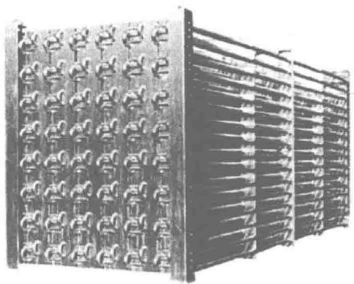  
图 5-12 整体热镀锌钢盘管

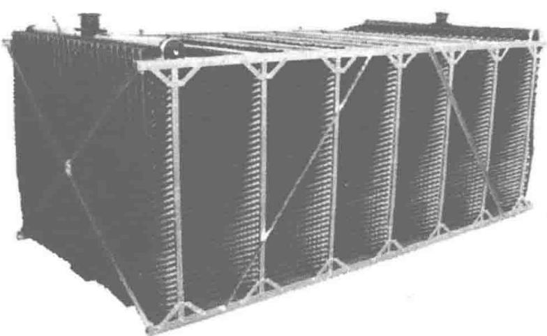  
图 5-13 纳米导热复合盘管

率，总蓄冰量也与钢盘管相当。

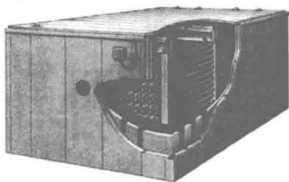  
图 5-14 自带钢制水槽的钢盘管

**2. 蓄冰槽**

盘管式静态冰蓄冷系统的蓄冰槽有现场制作混凝土蓄冰槽和盘管自带钢制蓄冰槽两种（见图 5-14）。前者造价较低，大规模蓄冷时节省空间，但是水槽的防水保温施工要求高，否则极易泄漏和结露。下面介绍一种混凝土蓄冰槽防水保温一体化设计方案。

**（1）混凝土蓄冰槽防水保温一体化设计方案**

混凝土蓄冰槽防水保温一体化设计方案如图 5-15 和

图 5-16 所示。该设计方案采用 2.0mm 厚的聚脲涂层作为蓄冰槽防水保温体系的防水层，以及采用 100mm 厚喷涂聚氨酯发泡材料作为蓄冰槽防水保温体系的保温层。

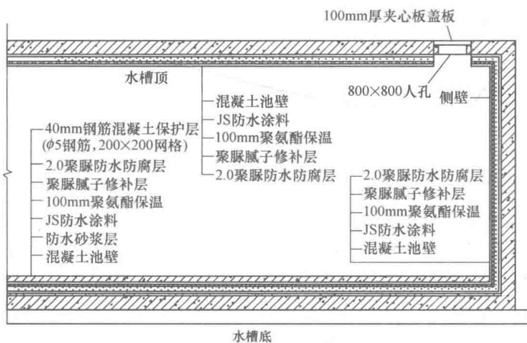  
图 5-15 混凝土蓄冰槽保温防水做法

聚脲是由异氰酸酯组分与氨基化合物组分反应生成的一种弹性体物质。聚脲的最基本特性就是防腐、防水、耐磨等。

蓄冰槽防水保温的传统做法是 PVC 防水卷材 + 挤塑聚苯板。该做法的缺陷在于 PVC 防水卷材采用多道搭接施工，随着使用时间的增加将不可避免地出现不同程度的搭接缝部位粘结失效，导致水穿透防水卷材的现象，而且水将沿挤塑聚苯板之间的缝隙渗透并穿过下层防水材料（砂浆），进一步渗透至建筑物内部。由于挤塑聚苯板长期被积水浸泡，其保温性能也将明显

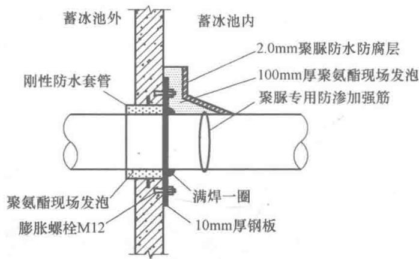  
图 5-16 蓄冰池保温防水施工节点图

注：蓄冰槽内管道及防腐保温工程，需先完成蓄冰槽内管道工程，再进行蓄冰槽体防腐保温施工。

下降；一旦发生渗漏，要发现准确的渗漏点难度却很大：PVC 防水卷材被保护层覆盖，如不全面移除该保护层，则很难判断出具体的防水卷材搭接缝粘结失效部位。

**(2) 一体化设计方案的特点**

1）聚氨酯发泡保温层与聚脲防水层整体无缝，不形成应力点，能够适应各类不规则的结构表面，以及优异的附着力，起到了杜绝雨水渗漏的效果。

2）聚脲防水层覆盖于聚氨酯发泡保温层表面，提供“皮肤式”铠甲防护，是保温层不可缺少的部分；整体无缝的聚脲防水层和聚氨酯发泡保温层双重保护池体结构与腐蚀介质隔离开，提高池体结构的耐久性能。

3）聚脲喷涂系统是具有高机械强度的双组分无溶剂液态系统，不含增塑剂或溶剂挥发物。喷涂施工时可快速固化，5～20s凝胶时间，快速进入使用阶段。喷涂聚脲单机日施工面积可达 $1000m^{2}$ 以上，而聚氨酯发泡保温层采用喷涂施工，也具备较高的施工效率，因此该防水保温体系具备较高的施工效率，可适用于蓄冰槽快速抢修工程。

**3. 盘管式静态冰蓄工作原理**

由浸没在满水的蓄冰槽中的盘管构成蓄冷装置。蓄冷时，低温（低于 $0^{\circ} \mathrm{C}$ ）载冷剂在盘管内流动，经管壁传热，使盘管外的水结成冰以蓄存冷量。为防止充冷过度，需要将冰盘管划分成若干组，在每组盘管的乙二醇管路上设置电动阀门，同时在每组盘管上设置的冰厚度探测器，当冰的厚度达到设定值后，探测器发出信号自动关闭电动阀。

**4. 融冰方式**

冰盘管式蓄冰按融冰方式分有内融冰和外融冰两种。钢盘管和纳米导热复合盘管都可以做内融冰和外融冰，但是融冰方式的不同，盘管的排列方式也不同。

（1）内融冰方式释冷时，载冷剂仍在盘管内循环流动，此时载冷剂温度较高，通过盘管壁与冰层换热从冰槽内取冷，再通过板式换热器与空调水进行换热，将冷量释放给空调水，管壁外的冰层是自内向外融化的，如图5-17所示。

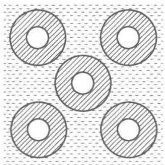  
(a)

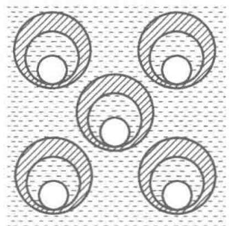  
(b)

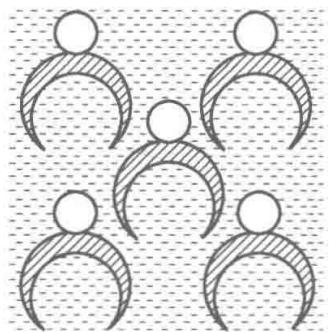  
(c)

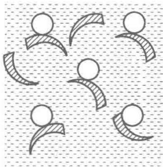  
(d)  
图 5-17 纳米导热复合盘管内融冰过程  
(a) 融冰开始；(b) 融冰初期；(c) 融冰中期；(d) 融冰中后期

以纳米导热复合内融冰盘管为例，在融冰过程中，随着融冰比例的增加，冰层和盘管之间形成水环，冰层受到外界水的浮力作用，始终与盘管保持良好接触。在冰融化到20%～30%时，冰层破裂均匀散落在水中，形成温度均衡的0℃冰水混合物。

1）融冰开始时的状态：制冰结束时冰槽中的水不全部结成冰，冰柱之间相互不连接；此时融冰与完全冻结式的盘管相同。

2）融冰初期：冰融化后，冰环与盘管之间有水，而冰比水轻冰上浮，冰环下部与盘管直接接触，换热效果好。

3）融冰中期：冰环下部与盘管一直接触，融冰速度高于冰环上部，因此下部的冰融完后冰环破裂，脱离盘管上浮后与上面的盘管接触，继续融冰。

4）融冰中后期：冰环破裂后冰上浮碰到上面的盘管，接触部分融冰速度快，与过程3）类似，接触部分融完破裂，形成更小的冰。

5）融冰后期：经过过程3）和过程4），冰破碎成小块，形成温度为0℃的冰水混合物，盘管浸没在冰水混合物中，换热稳定且可以得到较低的出水温度，满足系统的要求，直至融冰结束。

(2) 外融冰方式释冷时, 由温度较高的空调回水, 直接进入蓄冰槽内循环流动, 或者设置换热器, 让空调回水与冰槽水间接换热, 使盘管外表面的冰层自外向内逐渐融化。贮槽一般为开式, 为了使融冰均匀, 在贮槽底部设置压缩空气搅拌管道, 用清洁的压缩空气气泡增加水流扰动, 提高换热效率。

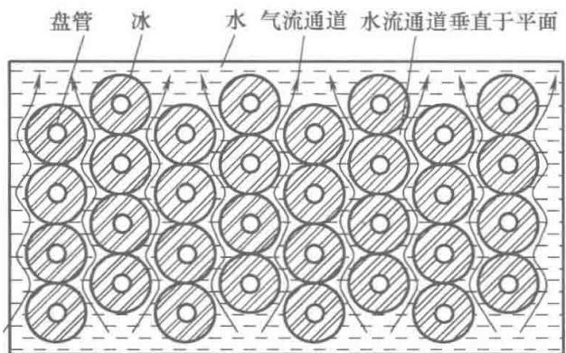  
图 5-18 外融冰原理图

外融冰方式直接采用蓄冰槽内的水作为取冷介质，冰是从冰柱外表面开始向内融化的，如图 5-18 所示。

（3）内融冰方式与外融冰方式的比较：与外融冰方式相比，内融冰方式可以避免外融冰方式由于上一周期蓄冷循环时，在盘管外表面可能产生剩余冰，引起传热效率下降，以及表面结冰厚度不均匀等不利因素。另外，内融冰系统为闭式流程，对系统的防腐及静压问题的

处理都较为简便、经济。由于换热面积仅为盘管表面，所以内融冰的融冰释冷速度不及外融冰。

内融冰供冷式是间接换热冷却；而外融冰方式是直接接触冷却，其取冷效率更高，取冷温度更低，水温可长时间保持在0～2℃。

外融冰蓄冷系统为开式流程，与内融冰蓄冷系统相比，设计、操作、控制和运行维护较复杂。因此，对冷水温度没有严格要求的单栋建筑的空调冷源，外融冰蓄冷系统不是很适合。外融冰蓄冷系统最大的优点是能提供较低温度的空调冷水，另一大优点是取冷速度快。因此，外融冰蓄冷技术一般是区域供冷的首选技术。

**5.2.2 盘管式内融冰蓄冷系统**

图 5-19 为一个盘管式内融冰蓄冷系统原理图，其末端为一个低温送风系统。3 台双工况冷水机组与蓄冰盘管组成主机上游串联式蓄冷系统，夜间向蓄冰槽内蓄冷，白天通过板式换热器换热，向冷水系统供冷。同时设置一台基载机组承担夜间冷负荷，基载机组为变流量冷水机组。

**1. 工作模式**

该系统可以按以下 4 种工作模式运行：

（1）双工况主机制冰 + 基载主机供冷模式；

（2）主机与蓄冰装置联合供冷模式；

（3）融冰单独供冷模式；

（4）主机单独供冷模式。

各工况下设备、阀门的状态如表 5-3 所示。

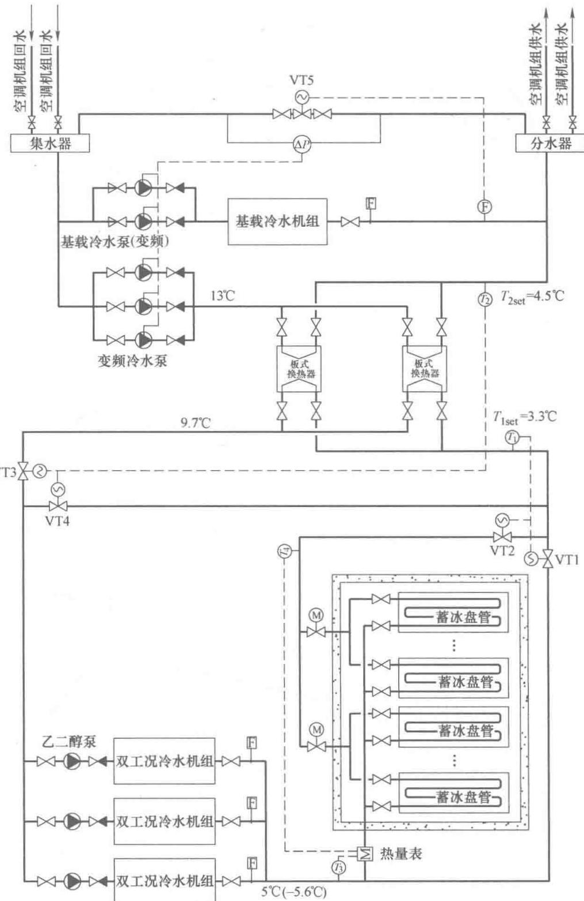  
图 5-19 盘管式蓄冰系统内融冰原理图

盘管式内融冰各工况下设备、阀门的状态  
表5-3

<table><tr><td>主要设备\运行模式</td><td>双工况主机制冰+基载主机供冷</td><td>双工况主机与蓄冰装置联合供冷</td><td>蓄冰装置单独融冰供冷</td><td>双工况主机单独供冷</td></tr><tr><td>蓄冰装置</td><td>工作</td><td>工作</td><td>工作</td><td>不工作</td></tr><tr><td>双工况主机</td><td>制冰工况</td><td>空调工况</td><td>停机</td><td>空调工况</td></tr><tr><td>基载主机</td><td>空调工况</td><td>空调工况</td><td>停机</td><td>空调工况</td></tr><tr><td>板式换热器</td><td>不工作</td><td>工作</td><td>工作</td><td>工作</td></tr><tr><td>乙二醇泵</td><td>运行</td><td>运行</td><td>运行</td><td>运行</td></tr><tr><td>冷冻水泵</td><td>运行</td><td>运行</td><td>运行</td><td>运行</td></tr><tr><td>基载主机冷冻水泵</td><td>运行</td><td>运行</td><td>停止</td><td>运行</td></tr><tr><td>VT1、VT2、VT3、VT4</td><td>VT1、VT3全闭,VT2、VT4全开</td><td>VT1、VT2根据 $T_1$ 调节,VT3、VT4根据 $T_2$ 调节</td><td>VT1、VT2根据 $T_1$ 调节,VT3、VT4根据 $T_2$ 调节</td><td>VT1、VT3全开,VT2、VT4全闭</td></tr></table>

**2. 系统工况运行说明**

**（1）双工况主机制冰 + 基载主机供冷模式**

VT1、VT3全闭，VT2、VT4全开，将双工况主机设定为制冰工况开启（蒸发器出口温度设置为-5.6℃，可调），系统转换为“双工况主机制冰模式”，开启乙二醇泵后，乙二醇溶液进入双工况主机蒸发器，经双工况主机降温后的乙二醇溶液进入蓄冰装置，将盘管外的水冻结成冰并储存冷量，当某组盘管的蓄冷量达到设定值后，蓄冷结束，关闭该组盘管的电动阀。

各组蓄冰盘管模块配置冰厚传感器，盘管式冰蓄冷首先应考虑采用冰厚度控制器来判断蓄冷是否结束，防止结冰过量。还可以同时采用蓄冰槽的液位高度以及蓄冷器入口处的热量表来辅助判断蓄冷是否结束。

冰厚度控制器的工作原理：以 RIS-1001 智慧冰量控制器为例，它由传感器和监控器组成，冰量控制器根据水和冰电导率差异进行测量，通过检测其电导率确定结冰厚度及结冰量（见图 5-20）。

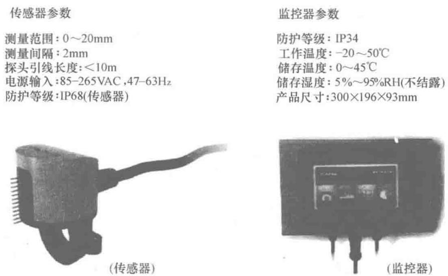  
图 5-20 RIS-1001 智慧冰量控制器

液位式冰量传感器（见图 5-21）：在夜间开始制冰时，系统先通过液位式冰量传感器检查蓄冰槽内所剩冰量，来确定开启制冷主机台数。融冰时通过液位式冰量传感器检测剩余冰量测量，进行每小时融冰量的优化分配，使运行策略达到最优目标。

液位式冰量传感器的工作原理是基于冰比水有较低的密度（即有较高的比容）。由于冰槽中的部分水会变成冰，这就使得此冰水的体积增加，从而使冰槽中的水位升高。当槽中没有冰时，将水位调定为“冰生成量0%的水位”，并在视管上示出。由于在冰生成的循环中水位会提高，传感器会检测出其中的压力提高，并将其变换成为4～20mA或1～5V DC的输出信号，其量值与槽中的蓄冰量成正比。

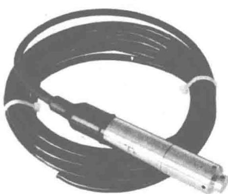  
图 5-21 液位传感器

1kg 0℃水冻结成 1kg 0℃的冰释放出的潜热 $\gamma_{ice}$ ，1kg 0℃水冻结成 1kg 0℃的冰体积变化量：

$$
\Delta V = \frac {1}{\rho_ {\mathrm{ice}}} - \frac {1}{\rho_ {\mathrm{w}}}\tag{5-5}
$$

液位变化量：

$$
\Delta h = \frac {\Delta V}{L \cdot W}\tag{5-6}
$$

式中 $\Delta V$ ——体积变化量， $m^{3}$ ;

$\rho_{ice}$ ——冰的密度，kg/m $^{3}$ ;

$\rho_{w}$ ——水的密度，kg/m $^{3}$ ;

$\Delta h$ ——液位变化量，m；

L——蓄冰槽长度，m；

W——蓄冰槽宽度，m。

因此，蓄冰量 Q 可以用以下公式来表示：

$$
Q = \frac {\gamma_ {\mathrm{ice}} \cdot L \cdot W \cdot \Delta h}{\frac {1}{\rho_ {\mathrm{ice}}} - \frac {1}{\rho_ {\mathrm{w}}}} = \left(\frac {\gamma_ {\mathrm{ice}} \cdot L \cdot W}{\frac {1}{\rho_ {\mathrm{ice}}} - \frac {1}{\rho_ {\mathrm{w}}}}\right) \cdot \Delta h\tag{5-7}
$$

根据建筑物夜间供冷需求情况，该模式下系统同时运行基载冷水机组，满足夜间空调冷负荷需求，机载冷水泵根据供回水压差 $\Delta P$ 变频运行，保证 $\Delta P$ 恒定不变。当流量计 F 检测到机组达到其最小流量时，此时如果末端负荷还需进一步减小，则开启分集水器之间的旁通水阀 VT5，调节末端的供水量，保证 $\Delta P$ 恒定不变。

**（2）主机与蓄冰装置联合供冷模式**

将双工况主机出水温度设定为设计工况，控制系统转换为“主机与蓄冰装置联合供冷模式”，开启乙二醇泵和系统冷水泵，从板式换热器出来的高温乙二醇溶液（9.7℃）先进入双工况主机的蒸发器降温，再进入蓄冰装置融冰降温，融冰后产生的低温乙二醇溶液（3.3℃）进入板式换热器与冷水进行换热，控制系统根据温度传感器 $T_{1}$ 调节电动阀VT1、VT2，控制进入蓄冰槽的乙二醇流量，调节融冰供冷量，保证 $T_{1}$ 恒定。冷水泵向空调系统提供4.5℃的冷水，控制系统根据温度传感器 $T_{2}$ 调节电动阀VT3、VT4，调节进入板式换热器的乙二醇流量，保证供水温度 $T_{2}$ 恒定。冷水泵根据供回水压差 $\Delta P$ 变频运行，保证 $\Delta P$ 恒定不变。

该模式下蓄冷系统有两种运行策略：

1）主机优先：蓄冷系统在设计日工况下，采取主机优先的策略，主机优先向负荷侧供冷，当不能满足负荷需求时，用融冰加以补充。

2）融冰优先：蓄冷系统在非设计日工况下，采取融冰优先的策略，最大限度减小主机运行时间。当融冰速率不能满足负荷时，用主机补充其冷量。

根据建筑物供冷需求情况，该模式下系统同时运行基载冷水机组，满足空调冷负荷需求，控制要求同前。

**（3）蓄冰装置融冰单独供冷模式**

关闭所有双工况制冷主机和基载主机，控制系统转换为“融冰单独供冷模式”。开启乙二醇泵，从板式换热器回来的高温乙二醇溶液（9.7℃）进入蓄冰装置融冰降温，融冰后产生的低温乙二醇溶液（3.3℃）进入板式换热器与冷水进行换热，控制系统根据温度传感器 $T_{1}$ 调节乙二醇泵的开启台数和调节电动阀VT1、VT2，控制进入蓄冰槽的乙二醇流量，调节融冰供冷量，保证 $T_{1}$ 恒定。冷水泵向空调系统提供4.5℃的冷水，控制系统根据温度传感器 $T_{2}$ 调节电动阀VT3、VT4，调节进入板式换热器的乙二醇流量，保证供水温度 $T_{2}$ 恒定。冷水泵根据供回水压差 $\Delta P$ 变频运行，保证 $\Delta P$ 恒定不变。

**（4）主机单独供冷模式**

VT1、VT3 全开，VT2、VT4 全闭，控制系统转换为“双工况主机单独供冷模式”，主机设定为空调工况，出水温度为 $3.3^{\circ}C$ ，开启乙二醇泵后，乙二醇溶液进入双工况主机蒸发器，经过降温后进入板式换热器，冷水泵向空调系统提供 $4.5^{\circ}C$ 的冷水。控制系统通过调节主机运行台数来满足末端负荷的变化。冷水泵根据供回水压差 $\Delta P$ 变频运行，保证 $\Delta P$ 恒定不变。

根据建筑物供冷需求情况，该模式下系统同时运行基载冷水机组，满足空调冷负荷需求。控制要求同前。

**5.2.3 盘管式外融冰蓄冷系统**

图 5-22 为采用盘管式外融冰蓄冷系统的区域供冷冷站原理图，冷站供 / 回水温度为 $2^{\circ}C/11^{\circ}C$ 。采用三级泵系统，一级泵克服冷站内部阻力，通过运行台数调节流量；二级泵克服管网阻力，根据管网最不利环路末端入口压差来变频运行；三级泵克服用户内部阻力。双工况冷水机组与蓄冰盘管组成主机上游串联式蓄冷系统，夜间向蓄冰槽内蓄冷，由于区域外网高差较大，不适合采用开式系统直接将冰槽内的低温水输送给外网各用户，因此冰槽内的低温水通过板式换热器换热后向外网供冷。同时设置一台基载机组承担夜间冷负荷。外融冰方式的结冰过程与前面讲到的内融冰基本一致，但融冰的机理大不相同。

**1. 该系统工作模式**

（1）双工况主机制冰 + 基载主机供冷模式；

（2）主机与蓄冰装置联合供冷模式；

（3）融冰单独供冷模式；

（4）主机单独供冷模式；

2. 系统工况运行说明

（1）双工况主机制冰 + 基载主机供冷模式

VT1、VT3 全闭，VT2、VT4 全开，将双工况主机设定为制冰工况开启（蒸发器出口温度设置为 $-5.6^{\circ}C$ ，可调），系统转换为“双工况主机制冰模式”，开启乙二醇泵后，乙二醇溶液进入双工况主机蒸发器，经双工况主机降温后的乙二醇溶液进入蓄冰装置，将盘管外的水冻结成冰并储存冷量，当某组盘管的蓄冷量达到设定值后，蓄冷结束，关闭该组盘管的电动阀。

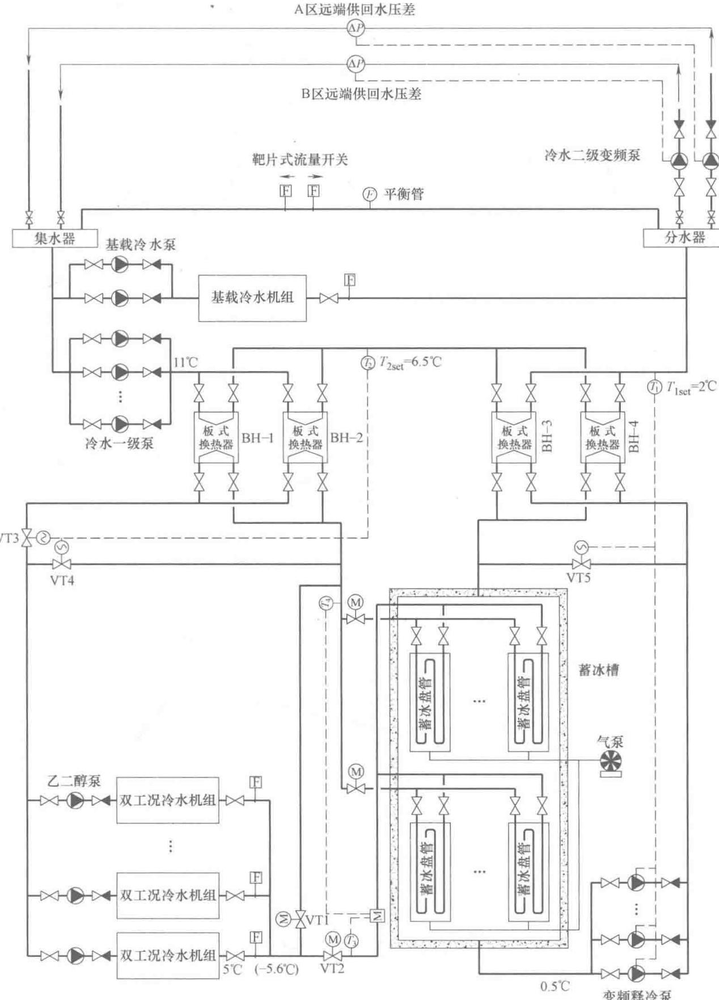  
图 5-22 盘管式蓄冰系统外融冰原理图

各组蓄冰盘管模块配置冰厚传感器，盘管式冰蓄冷首先应考虑采用冰厚度控制器来判断蓄冷是否结束，防止结冰过量。同时，采用蓄冷器入口处的热量表来辅助判断蓄冷是否结束。

根据建筑物夜间供冷需求情况，该模式下系统同时运行基载冷水机组，满足夜间空调冷负荷需求。

**（2）主机与蓄冰装置联合供冷模式**

将双工况主机出水温度设定为联合供冷工况，控制系统转换为“双工况主机与蓄冰装置联合供冷模式”，开启乙二醇泵、系统冷水泵、释冷泵及气泵。双工况主机在此工况供水温度为 $5^{\circ}\mathrm{C}$ 。蓄冰装置供水温度为 $0.5^{\circ}\mathrm{C}$ 。

空调冷水先进入板式换热器 BH-1、BH-2 与双工况主机供冷系统换热，再进入板式换热器 BH-3、BH-4 与蓄冰装置供冷系统换热。

控制系统根据温度传感器 $T_{2}$ 调节电动阀 VT3、VT4，调节进入板式换热器 BH-1、BH-2 的乙二醇流量，保证供水温度恒定。控制系统根据温度传感器 $T_{1}$ 调节释冷水泵的运行频率和运行台数，调节进入板式换热器 BH-3、BH-4 的冰水的流量，保证供水温度恒定。当只有一台释冷水泵运行且达的其设定的最小流量后，末端冷量需求还在进一步减少，开启 VT5，通过调节 VT5 来保证供水温度 $T_{1}$ 恒定。

冷水一级泵的控制：控制系统根据平衡管上的靶片时流量开关判断水的流向和平衡管上的流量计测得的流量，控制冷水一级泵的运行台数。当水的流向由分水器至集水器时，说明系统流量富裕，当检测到的流量大于一台泵的流量，并且持续一段时间时，关闭一台一级泵。当水的流向由集水器至分水器时，说明系统流量欠缺，当检测到的流量大于一台泵的流量10%，并且持续一段时间时，开启一台一级泵。

根据建筑物供冷需求情况，该模式下系统同时运行基载冷水机组，满足空调冷负荷需求，控制要求同前。

**（3）蓄冰装置融冰单独供冷模式**

关闭所有双工况制冷主机和基载主机，控制系统转换为“蓄冰装置融冰单独供冷模式”。开启释冷水泵和气泵，蓄冰槽内的冰水进入板式换热器 BH-3、BH-4 与冷水进行换热，经过换热的冷水由冷水一级泵在冷站内循环。控制系统根据温度传感器 $T_{1}$ 调节释冷水泵的运行频率和运行台数，调节进入板式换热器 BH-3、BH-4 的冰水的流量，保证供水温度恒定。当只有一台释冷水泵运行且达到其设定的最小流量后，末端冷量需求还在进一步减少，开启 VT5，通过调节 VT5 来保证供水温度 $T_{1}$ 恒定。

冷水一级泵的控制同前。

**（4）双工况主机单独供冷模式**

VT1 全开，VT2 全闭，控制系统转换为 “双工况主机单独供冷模式”，主机设定为空调工况，开启乙二醇泵后，乙二醇溶液进入双工况主机蒸发器，经过降温后进入板式换热器 BH-1、BH-2，经过换热的冷水由冷水一级泵在冷站内循环。控制系统通过调节主机运行台数来满足末端负荷的变化。

冷水一级泵的控制同前。

根据建筑物供冷需求情况，该模式下系统同时运行基载冷水机组，满足空调冷负荷需求。控制要求同前。

**盘管式外融冰各工况下设备、阀门状态如表 5-4 所示**

盘管式外融冰各工况下设备、阀门的状态  
表5-4

<table><tr><td>主要设备\运行模式</td><td>双工况主机制冰+基载主机供冷</td><td>双工况主机与蓄冰装置联合供冷</td><td>蓄冰装置单独融冰供冷</td><td>双工况主机单独供冷</td></tr><tr><td>蓄冰装置</td><td>工作</td><td>工作</td><td>工作</td><td>不工作</td></tr><tr><td>双工况主机</td><td>制冰工况</td><td>空调工况</td><td>停机</td><td>空调工况</td></tr><tr><td>基载主机</td><td>空调工况</td><td>空调工况</td><td>停机</td><td>空调工况</td></tr><tr><td>板式换热器BH-1、BH-2</td><td>不工作</td><td>工作</td><td>不工作</td><td>工作</td></tr><tr><td>板式换热器BH-3、BH-4</td><td>不工作</td><td>工作</td><td>工作</td><td>不工作</td></tr><tr><td>乙二醇泵</td><td>运行</td><td>运行</td><td>不运行</td><td>运行</td></tr><tr><td>冷水一级泵</td><td>不运行</td><td>运行</td><td>运行</td><td>运行</td></tr><tr><td>释冷水泵</td><td>不运行</td><td>运行</td><td>运行</td><td>不运行</td></tr><tr><td>气泵</td><td>不运行</td><td>运行</td><td>运行</td><td>不运行</td></tr><tr><td>基载主机冷水泵</td><td>运行</td><td>运行</td><td>停止</td><td>运行</td></tr><tr><td>VT1、VT2、VT3、VT4</td><td>VT1、VT3全闭,VT2、VT4全开</td><td>VT1全开、VT2全闭,VT3、VT4根据 $T_2$ 调节</td><td>VT1、VT2、VT3、VT4全闭</td><td>VT1全开,VT2全闭,VT3、VT4根据 $T_2$ 调节</td></tr></table>

**3. 其他方式的外融冰蓄冷系统**

除了上文介绍的盘管式外融冰蓄冷系统之外，在国内区域供冷系统中应用的还有采用双蒸发器双工况主机的系统以及采用翅片钢盘管的外融冰的区域供冷系统，前者是将双工况主机制冰工况与空调工况分别采用两个蒸发器来完成，后者是将前述的外融冰系统中的板式换热器 BH-3、BH-4 变成翅片管换热器与蓄冰盘管结合侵入蓄冰槽内，这两种技术方案都可以使系统得以简化明晰，但是设备造价都较高，应用不广泛。

**（1）双蒸发器双工况主机蓄冷系统**

图 5-23 为主机上游串联式盘管式外融冰蓄冷系统，蓄冷工况时空调蒸发器不工作，蓄冷蒸发器制取低温乙二醇溶液。空调工况时，蓄冷蒸发器不工作，空调蒸发器制取空调冷水。联合供冷时，通过调节 VT1、VT2 来保证供水温度恒定。该系统制冷站内无板式换热器，系统得以简化。但是双工况主机体积较大。

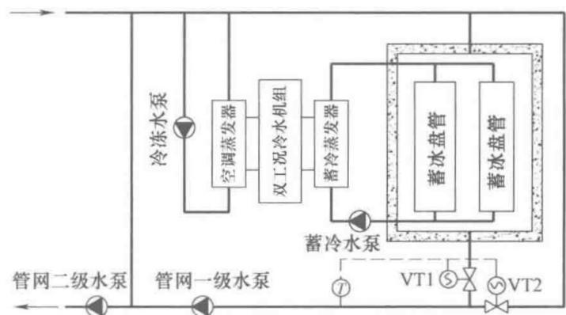  
图 5-23 双蒸发器盘管式蓄冰原理图

**(2) 翅片钢盘管**

图 5-24 为主机上游串联式盘管式外融冰蓄冷系统，采用翅片钢盘管，蓄冷工况时，V1 开启，V2 关闭。空调工况时，V2 开启，V1 关闭。联合供冷时，V2 开启，V1 关闭。通过调节 VT1、VT2 来保证供水温度恒定。与常规的系统相比，该系统制冷站内少了一组板式换热器，系统也得到一定的简化。但是带翅片的钢盘管体积也较大，相应的蓄冰槽的

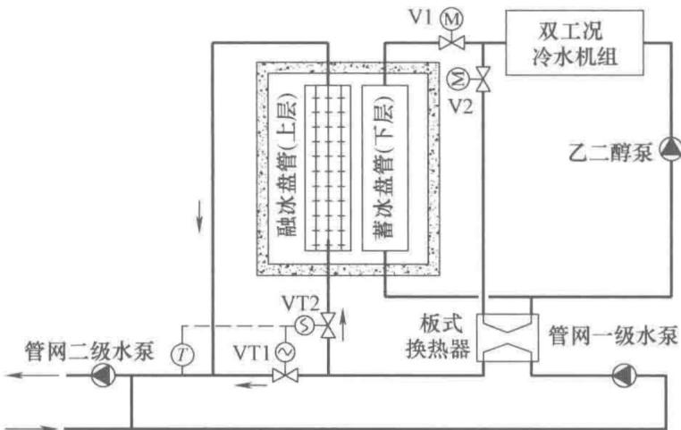  
图 5-24 带翅片盘管式蓄冰原理图

体积也较大。

**5.2.4 盘管式冰蓄冷系统设计应注意的问题**

**1. 防止结冰过量**

盘管结冰厚度是蓄冰系统的一项重要指标，它直接影响盘管及主机的性能。各组蓄冰盘管均应配置冰厚传感器，每组乙二醇支管上设置电动开关蝶阀，并将它们纳入自控系统，当结冰厚度达到设定值时自动关闭蝶阀。避免各组蓄冰盘管因系统不平衡导致

结冰过量。

**2. 各冰槽水系统平衡**

当采用盘管自带钢制冰槽时，应当注意外融冰各冰槽冷水系统平衡，应在各冰槽进出水总管上设置流量计或热量表，融冰阶段根据各槽的融冰速度精确调试进出水阀门，使融冰速度达到设计值。

**3. 避免结露**

强化冰槽保温绝热厚度计算，因地制宜采用合适的除湿方式，避免制冷机房及蓄冰槽间出现结露问题。

**4. 冰量计量**

外融冰系统应采用冰厚传感器计量蓄冰量。外融冰系统由于管网渗漏、补水过量、外融冰管道内混入空气等情况，将会导致冰槽内的液位经常变化，对于外融冰系统，当融冰泵开启后，蓄冰槽中的液位存在一定波动，因此不适合采用液位传感器计算蓄冰量（带翅片外融冰盘管除外）。

**5. 管网冲洗**

大型能源站管网冲洗条件：需要有功率足够大的水泵提供所需要的管道冲洗流速；需要充足的冲洗用水和水泵所需的配电；管网冲洗效果较差，管网水中含有大量泥沙、铁锈，严重影响水泵、板式换热器的使用寿命。

设计时：制冷机房网管系统设置除污过滤装置；在用户换热站板式换热器一次侧设置反冲洗过滤器；在地势较低的地方，结合管道井，设置排污点；

施工时：注意管道的清洁保护，如管道运输、储存时管道口用塑料袋密封；焊接后及时清理焊渣等，实行分段冲洗。

**6. 乙二醇选用**

钢制盘管应选用抑制性乙二醇（进口美国陶氏），复合塑料盘管可选用一般抑制性乙二醇溶液。

**7. 系统的维护管理**

定期对乙二醇溶液的浓度、腐蚀性进行检测；

定期对冰槽冷水的腐蚀性、硬度进行检测；

定期检测零液位。

**8. 传感器的设置**

系统应设计安装流量、温度传感器、热量表等，避免调试过程中无法直接获取系统的具体特征量，影响调试进度。如果温度传感器安装在管道最上方，当管道中存在气体时，将影响测量数据的准确性，应当避免这种情况。

流量计选型不能简单地根据管径选择，应该考虑变流量运行情况下的最低流量测量精度。

**5.2.5 盘管式冰蓄冷系统设计计算**

盘管式冰蓄冷系统设计分为全蓄冰和部分蓄冰两种情况来计算。

**1. 全蓄冰**

(1) 蓄冰装置容量:

$$
Q _ {s} = \varepsilon \cdot Q\tag{5-8}
$$

式中 $Q_{s}$ ——蓄冰装置容量，kWh;

Q——设计日总冷负荷，kWh；

$\varepsilon$ ——蓄冷装置的实际放大系数，蓄冷水槽取 $1.03\sim1.05$ 。

(2) 双工况冷水机组的容量:

$$
q _ {\mathrm{c}} = Q _ {\mathrm{s}} / n _ {2} \cdot C _ {\mathrm{f}}\tag{5-9}
$$

式中 $q_{c}$ ——双工况机组空调工况制冷量，kW；

$n_{2}$ ——制冷机在制冰工况下的运行小时数，h，一般取所在城市低谷电价时数；

$C_{f}$ ——制冷机工况系数，即制冰工况与空调工况制冷能力的比值，一般为0.6～0.75；由于各厂家的设备差异较大，应根据工程的使用条件，以产品生产商提供的选型报告为准。

**2. 部分蓄冰**

（1）双工况冷水机组的容量：

$$
q _ {\mathrm{c}} = Q / \left(n _ {1} + n _ {2} \cdot C _ {\mathrm{f}}\right)\tag{5-10}
$$

式中 $q_{c}$ ——双工况机组空调工况制冷量，kW；

Q——设计日总冷负荷，kWh；

$n_{1}$ ——白天制冷机在空调工况下的运行小时数，h；

$n_{2}$ ——制冷机在制冰工况下的运行小时数，h；

$C_{f}$ ——制冷机工况系数。

(2) 蓄冰装置容量:

$$
Q _ {\mathrm{s}} = \varepsilon \cdot n _ {2} \cdot C _ {\mathrm{f}} \cdot q _ {\mathrm{c}}\tag{5-11}
$$

式中 $Q_{s}$ ——蓄冰装置容量，kWh;

$\varepsilon$ ——蓄冷装置的实际放大系数，蓄冷水槽取1.03～1.05；

$n_{2}$ ——制冷机在制冰工况下的运行小时数，h；

$C_{f}$ ——制冷机工况系数；

$q_{c}$ ——双工况机组空调工况制冷量，kW。

**5.2.6 冰片滑落式动态制冰蓄冷系统**

冰片滑落式动态制冰是直接蒸发式制冰。制冷主机与蒸发器为分体式，采用三根制冷

剂管道相连。蒸发器为板状，被置于蓄冰槽上方。

制冰时，水被淋到板状蒸发器表面，放出潜热后冻结成冰，根据制冰时间，控制蒸发板表面的冰层厚度为6～9mm，当制冰时间到设定值，某一蒸发板模块的制冷剂进气电磁阀打开，部分热的制冷剂气体进入蒸发板模块内，蒸发板模块内温度升高，与蒸发板表面接触的冰由于受热失去附着力，冰层受热出现小裂纹，冰层在水流和重力的带动下与蒸发板脱离后依靠重力落到蓄冰槽内，破碎成小冰片。

**1. 冷水机组组成**

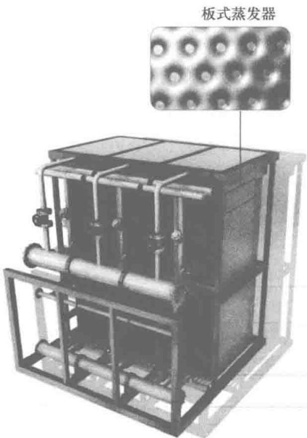  
图 5-25 板式蒸发器模块

冰片冷水机组有单蒸发器和双蒸发器两种。

单蒸发器冰片冷水机组由压缩冷凝机组、蒸发板模块和控制系统组成，实现制冷和制冰两种工况，是高效的满液式蒸发双工况冷水机组。

压缩冷凝机组由高效螺杆压缩机、冷凝器、经济器、节流阀、低压循环桶、制冷剂泵和高效回油系统等组成。

板式蒸发模块是冰片冷水机组中的蓄冰装置，如图 5-25 所示，由片状垂直安装的蒸发板、控制阀门、布水器、不锈钢框架和保温门板等组成，直接放置在蓄冰槽上方。蒸发板模块既是高效的制冰蒸发器，同时也是制冷蒸发器。

冰片蓄冰系统采用板式换热器间接换热，将蓄冰槽侧与冷冻水侧隔离。

双蒸发器机组与单蒸发器机组的区别是前者多了

一个常规制冷的壳管式蒸发器。

2. 机组工作原理（以图 5-26 所示的单蒸发器机组为例）

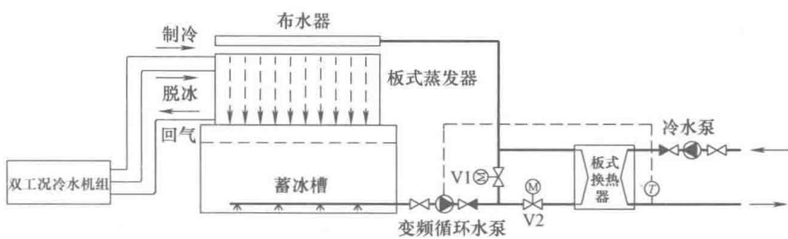  
图 5-26 单蒸发器冰片滑落式蓄冰制冷原理图

**(1) 制冷过程**

如图 5-26 所示，阀 V1 关闭，阀 V2 开启，在循环水泵的作用下，经过板式换热器与空调回水换热后的循环水进入蒸发板模块上部的布水器，通过布水器的均匀分配，循环水沿蒸发板表面呈膜状均匀流下，制冷剂在蒸发板内蒸发吸热，温度降低后的水落到蓄冰槽内，由循环水泵吸入，循环水流经板式换热器与空调回水换热，从而完成整个制冷循环过程。控制系统根据板式换热器二次侧出水温度调节变频循环泵的转速，保证板式换热器出水温度恒定。

**(2) 制冰过程**

阀 V1 开，阀 V2 关，循环水泵以工频运行，在循环水泵的作用下，低温的循环水进入蒸发板模块上部的布水器，通过布水器的均匀分配，循环水沿蒸发板表面呈膜状均匀流下，制冷剂在蒸发板内蒸发吸热，部分水冻结成冰附在蒸发板的表面，另一部分水落到蓄冰槽内，由循环水泵再次吸入，进入蒸发板模块上部的布水器，从而完成整个制冰循环过程。

**(3) 脱冰过程**

根据制冰时间，控制蒸发板表面的冰层厚度为6～9mm，当制冰时间到设定值时，某一蒸发板模块的制冷剂进气电磁阀打开，部分热的制冷剂气体进入蒸发板模块内，蒸发板模块内温度升高，与蒸发板表面接触的冰由于受热失去附着力，冰层与蒸发板脱离后依靠重力落到蓄冰槽内，破碎成小冰片。某一蒸发板模块表面冰完全脱落后，与蒸发板模块配套的制冷剂进气电磁阀关闭，重新进入制冰状态，同时另一蒸发板模块的制冷剂进气电磁阀打开，进入脱冰过程，依次循环，直到所有蒸发板模块的冰脱落。

当某一蒸发板模块进入脱冰过程时，其他蒸发板模块仍处于制冰状态。每一蒸发板模块脱冰过程持续 30～60s。

**(4) 融冰过程**

在循环水泵的作用下，经过板式换热器与空调回水换热后的循环水进入蒸发板模块上部的布水器，沿蒸发板表面下落到蓄冰槽内，直接与蓄冰槽中片状冰接触换热后，由循环水泵吸入，流经板式换热器与空调回水换热后再回到蓄冰槽内，完成整个融冰循环过程。控制系统根据板式换热器二次侧出水温度调节变频循环泵的转速，保证板式换热器出水温度恒定。

**(5) 制冷 + 融冰过程**

阀 V1 关，阀 V2 开，在循环水泵的作用下，经过板式换热器与空调回水换热后的循环水进入蒸发板模块上部的布水器，沿蒸发板表面呈膜状均匀流下，制冷剂在蒸发板内蒸发吸热，温度降低后的水落到蓄冰槽内直接与蓄冰槽中片状冰接触换热后由循环水泵吸入，流经板式换热器与空调回水换热后再回到蓄冰槽内，完成整个制冷 + 融冰循环过程。控制系统根据板式换热器二次侧出水温度调节变频循环泵的转速，保证板式换热器出水温度恒定。

双蒸发器机组在融冰和制冷时循环水不再经过板式蒸发器，在制冷时冷水直接由壳管式蒸发器制得，其原理见图 5-27。工程设计时，也可以将蓄冷泵和释冷泵分开，这样可以减少电动阀的倒换，使控制得以简化，如图 5-28 所示。

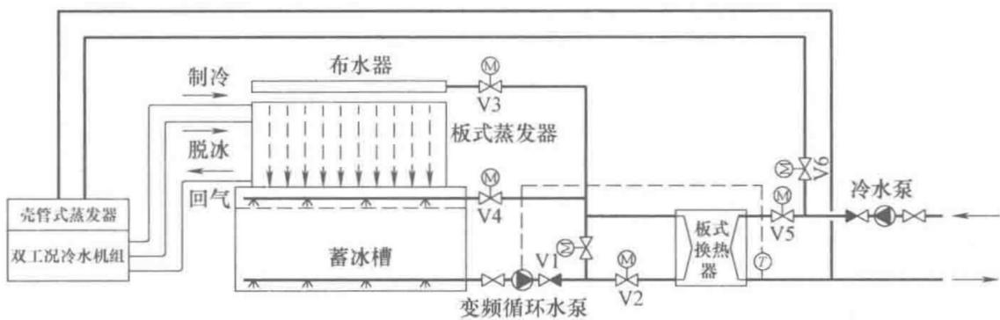  
图 5-27 双蒸发器冰片滑落式单泵蓄冰制冷原理图

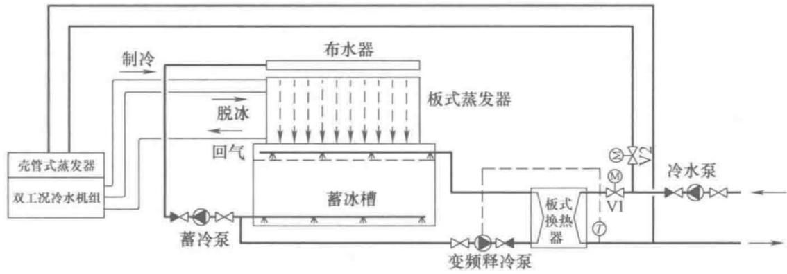  
图 5-28 双蒸发器冰片滑落式双泵蓄冰制冷原理图

**3. 板冰冷水机组蓄冰系统的特点**

**(1) 系统简单**

采用制冷剂直接蒸发制冰，无需乙二醇中间换热环节。

**(2) 效率较高**

蒸发温度比间接蓄冰高 $3 \sim 5^{\circ}C$ ，效率高 $10\% \sim 15\%$ 。制冷剂泵强制循环，循环量数倍于压缩机的吸气量，蒸发器换热系数高，满液式蒸发，消除了蒸发器过热区，结冰厚度控制在 9mm 以下，冰的热阻小。

**（3）融冰性佳**

冰与水直接接触，融冰速度快，由图 5-29 所示的冰片滑落式蓄冰系统的融冰曲线可以看出，融冰过程可始终保持恒定的 0.5～1℃ 出水温度，融冰彻底，无 “千年冰”。即使不开主机，也可满足尖峰负荷，运行策略更灵活，最大限度降低运行费用。易实现全量蓄冰，无融冰供冷不能满足负荷之担忧，更适合过渡季节由部分蓄冰向全蓄冰转换。

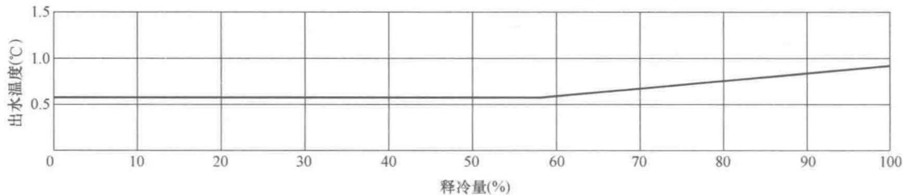  
图 5-29 冰片滑落式蓄冰系统的融冰曲线

**(4) 蓄冰直观**

在蒸发板上形成片状冰，结冰过程可见，热气脱冰，碎冰存在蓄冰槽中，蓄冰槽中冰量也直观可见。

**(5) 布置灵活**

蓄冰槽中为水和冰的混合物，无任何设备，设计、安装简单。蓄冰槽可利用建筑物堡基或箱基，不占用机房空间。蓄冰槽可全埋式或半埋式露天放置或设置在屋顶。仅增大蓄冰槽的体积即可延长蓄冰时间，实现长周期蓄冰。

**(6) 可靠性高**

压缩机吸气过热度低，压缩机电机温升小，使用寿命长。蒸发板蓄冰、脱冰时无应力影响，免维护，使用寿命长。无乙二醇间接换热系统，系统简单，可靠性大幅提高。

(7) 节省空间

没有乙二醇中间换热环节，蓄冰槽可用作蓄热槽，所需机房面积最小。

(8) 维护方便

制冰与蓄冰分离，蓄冰装置维护的工作量少，不影响系统的正常使用，维护费用低。

(9) 施工期短

机组均在生产厂整体装配，系统简单，现场安装的工程量少，施工周期短。

(10) 成本较低

无乙二醇中间换热环节，可实现蓄冷槽和蓄热槽共用，系统简单，节省机房面积。蓄冰效率高，系统运行费用与常规静态蓄冰系统相比较低。

**5.2.7 冰片滑落式动态冰蓄冷系统设计注意事项**

1. 由于螺杆式机组的制冷量不是很大，因此对于大型蓄冷项目不太适合。

2. 由于板式蒸发器需设置在蓄冰水池上方，因此机房层高需要特别注意。

3. 板式换热器选型宜按空调设计负荷确定，以便在高峰电价时段，实现不开主机，通过全融冰供冷，最大限度地节省运行费用。

**5.2.8 冰片滑落式动态冰蓄冷系统设计计算**

冰片滑落式动态冰蓄冷系统设计也分为全蓄冰和部分蓄冰两种情况来计算。

1. 双工况冷水机组容量

(1) 全蓄冰系统

$$
q _ {\mathrm{c}} = \varepsilon \cdot Q / n _ {2} \cdot C _ {\mathrm{f}}\tag{5-12}
$$

式中 $q_{c}$ ——双工况机组空调工况制冷量，kW；

Q——设计日总冷负荷，kWh;

$\varepsilon$ ——蓄冷装置的实际放大系数，蓄冷水槽取1.1；

$C_{f}$ ——制冷机工况系数，螺杆机取0.69；

$n_{2}$ ——制冷机在制冰工况下的运行小时数，h。

(2) 部分蓄冰系统

$$
q _ {\mathrm{c}} = \varepsilon \cdot Q / (n _ {1} + n _ {2} \cdot C _ {\mathrm{f}})\tag{5-13}
$$

式中 $n_{1}$ ——白天制冷机在空调工况下的运行小时数，h；

其余同上。

2. 实际蓄冰量计算公式

实际蓄冰量：

$$
Q _ {\mathrm{s}} = n _ {2} \cdot C _ {\mathrm{f}} \cdot q _ {\mathrm{c}}\tag{5-14}
$$

式中 $Q_{s}$ ——蓄冰量，kWh;

其余同上。

3. 蓄冰槽体积计算公式

蓄冷密度一般取 $42 \, kWh/m^{3}$ 。

$$
V = 4 2 \times Q _ {\mathrm{s}} \times 1. 1\tag{5-15}
$$

式中 V ——蓄冰池体积， $m^{3}$ ;

1.1 ——考虑到落冰所需距离和无冰空间，取 10% 的余量。

4. 板式换热器

板式换热器选型宜按空调设计负荷确定，以便在高峰电价时段，实现不开主机，通过全融冰供冷。

**5.2.9 机械搅拌式直接蒸发动态制冰蓄冷系统**

冰蓄冷工程需要采用双工况冷水机组，常规静态盘管蓄冰的冰蓄冷工程，在制冰结束时刻，双工况冷水机组的出水温度一般都降到了 $-6 \sim -5.5^{\circ} \mathrm{C}$ 。冷水机组的出水温度每降低 $1^{\circ} \mathrm{C}$ ，其制冷量会降低 $3 \%$ 左右，以螺杆机组为例，制冰工况的制冷量仅为空调工况（ $7^{\circ} \mathrm{C}$ 出水）的 $63 \% \sim 72 \%$ ，而此时的 COP 仅为空调工况的 $65 \% \sim 70 \%$ 。同时，随着盘管结冰厚度的增加，热阻逐渐增大，使得传热效率进一步下降。由此可以看出，冷水机组在制冰工况已经变得非常不节能了，下面介绍的是具有较高制冷效率的流态冰蓄冷系统。

  
图 5-30 絮状的流态冰  
流态化动态冰蓄冷技术的先进之处在于改进了传统制冰过程中的主要缺点，而且制出的冰以流态化冰浆的形式存在，如图5-30～图5-32所示。传统静态制冰过程中，水通过自然对流换热，冰层首先在换热壁面上形成，然后逐渐变厚。这样就导致形成新的冰层所需的热量传递必须以导热的形式穿过越积越厚的原有冰层，从而严重恶化了传热效率，致使结冰越来越困难，制冷剂提供的冷却温度也必须越来越低。

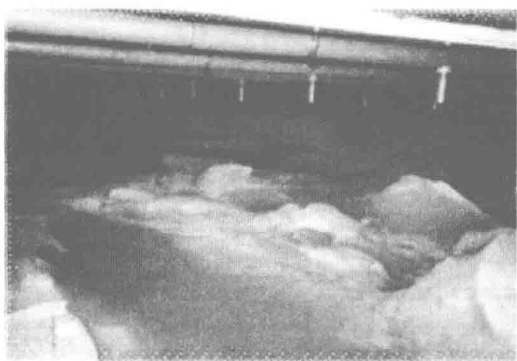  
图 5-31 蓄冰池内含冰率为 25% 时的流态冰

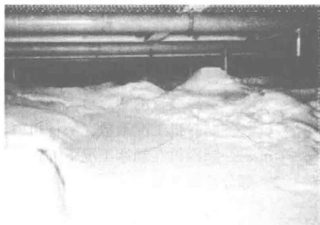  
图 5-32 蓄冰池内含冰率为 50% 时的流态冰

流态化动态冰蓄冷技术制冰过程的最大特点在于首先在传热壁面附近制取过冷水，然后把过冷水转移到远离传热壁面的空间里解除过冷、生成冰浆。这样就彻底避免了冰在传热壁面上形成的可能性，既消除了固态冰层导热热阻的存在，同时在液体和传热壁面之间又始终保持着强制对流的高效率换热模式，因此整个制冰环节的传热系数得到大幅度提高。

另一方面，制冰过程中的换热温差、流量等参数都保持稳态，并不因时间而变化，从而保证了出冰速度的恒定，也便于系统的控制。流态化动态冰蓄冷主要包括两种形式，即：机械搅拌式和过冷水式。两种技术在基本原理上是一致的，但形式差别较大，下面分别说明。

小型的机械搅拌式动态制冰系统采用螺杆式机组直接蒸发制冰，即制冷剂直接与水进行热交换，使水结成絮状冰晶。制冷主机与冰晶发生器做成一体机。大型的机械搅拌式动

态制冰系统采用离心机间接与水进行热交换。

**1. 机械搅拌式直接蒸发动态制冰系统原理**

如图 5-33 所示，水（溶液）在蒸发器（又称冰晶发生器）内部通过换热壁面被冷却到低于冰点的过冷状态，由于搅拌棒以较快的回转速度旋转，靠近蒸发器（又称冰晶发生器）换热壁面的过冷水被及时刮离壁面，从而确保了换热器壁面上不会生成冰晶。从壁面附近被刮出的过冷水随即进入水侧的中心主流区，并在主流区中经已经存在的冰晶颗粒促晶解除过冷，生成冰浆。与过冷水式相比，机械搅拌式动态制冰系统无需过冷却解除装置。需要指出的是，这种机械搅拌式动态制冰技术中的搅拌棒所起的作用是及时清除换热壁面附近的过冷水，而非像一些传统制冰机那样用于刮除已经生长在换热壁面上的冰层。因此这种制冰方式也避免了因冰层热阻引起的传热恶化，而且还因为搅拌棒的强烈扰动而大幅强化了对流换热效果。

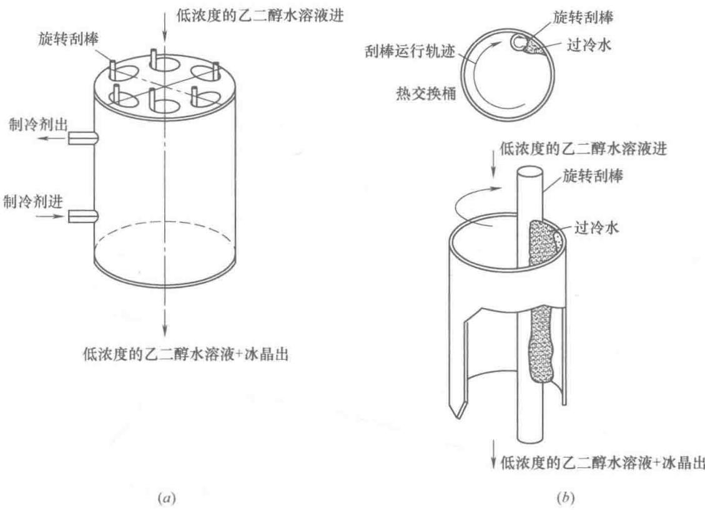  
图 5-33 机械搅拌式冰晶发生器原理  
(a) 蒸发器（冰晶发生器）；(b) 刮棒详图

机械搅拌式动态制冰技术中最核心的技术仍然是防堵塞技术。过冷状态下的水溶液非常容易在换热壁面上结晶，一旦在壁面上结晶，冰晶发生器就面临被堵塞的可能。因此，搅拌棒与换热壁面之间的接触必须紧密。另一方面，由于由纯水生成的冰晶颗粒较粗，而且容易聚集硬化，更容易导致堵塞，因此这种制冰方法中往往需要在水中添加一定浓度的冰点抑制剂，如乙二醇（质量浓度为 $6\%$ ）。由低浓度的乙二醇水溶液制出的冰晶颗粒十分细腻，粒径可低于 $100 \mu \mathrm{m}$ ，由于冰晶的密度小，冰晶会悬浮于蓄冰槽上部，形成自然分层。蓄冰槽冰浆固相含量约 $50\%$ 。

**2. 系统运行工况**

图 5-34 所示的机械搅拌式的流态冰蓄冷系统，是一个主机上游串联式系统。系统蓄冰运行时，水池底部的水通过吸水管泵入双工况主机的冰晶发生器，其产生的冰浆由设置水池中部的涌泉管喷出。系统融冰运行时，低温水由池底部的吸水管泵入板式换热器，高温水由水池顶部的喷淋管回到水池。

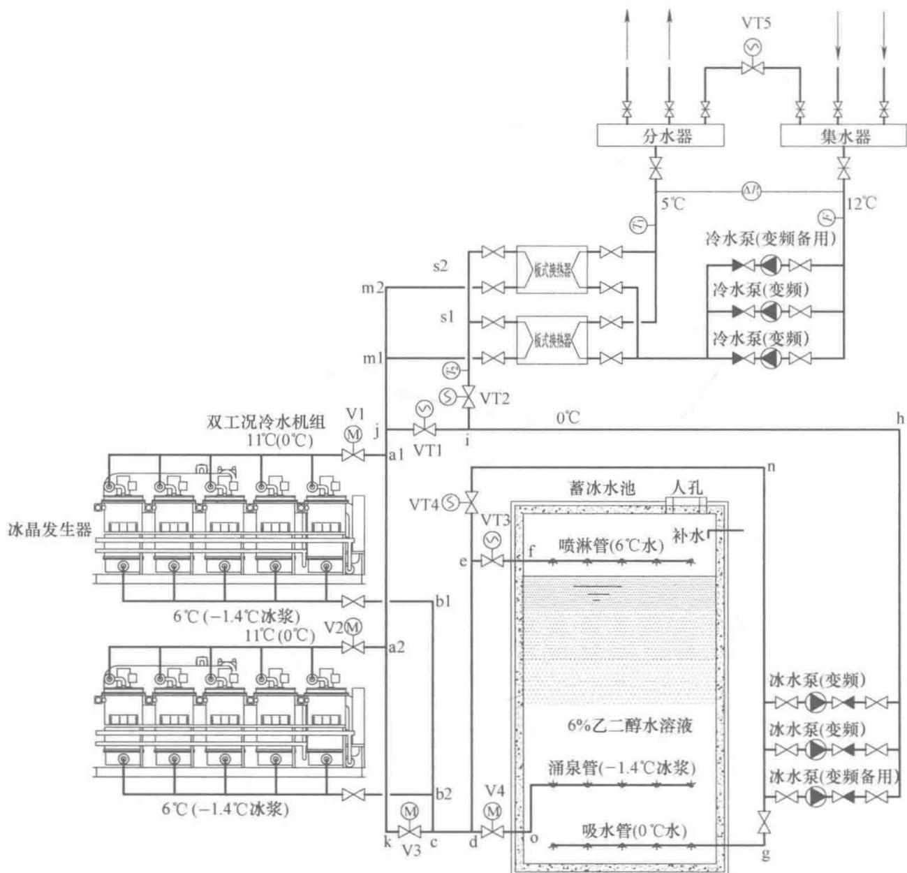  
图 5-34 螺杆机流态冰蓄冷原理图

制冷系统可实现以下 5 种工况运行：

（1）主机蓄冰工况；流程：a-b-c-d-o-g-h-i-j-a

（2）融冰供冷工况；流程：g-h-i-s-m-j-k-c-d-e-f-g

（3）主机单独供冷工况；流程：a-b-c-d-e-n-h-i-s-m-j-a

（4）主机制冷 + 融冰供冷工况；流程：a-b-c-d-e-f-g-h-i-s-m-j-a $\rightarrow$ j-a

在此工况下，制冷系统可以实现主机优先模式或者融冰优先模式

（5）主机制冰 + 融冰供冷工况；流程：a-b-c-d-o-g-h-i-s-m-j-a $\rightarrow$ j-a

3. 蓄冷系统各种运行工况下设备、阀门状态（见表 5-5）

蓄冷系统各种运行工况下设备、阀门状态  
表5-5

<table><tr><td>工况</td><td>主机</td><td>冰水泵</td><td>冷冻水泵</td><td>阀门开启</td><td>阀门关闭</td><td>阀门调节</td></tr><tr><td>1</td><td>开</td><td>以蓄冰流量定频运行</td><td>关</td><td>V1、V2、V4、VT1</td><td>VT3、VT4、VT2、V3</td><td></td></tr><tr><td>2</td><td>关</td><td>由 $T_1$ 控制变频运行</td><td>由 $\Delta P_1$ 控制变频运行</td><td>VT3、VT2、V3</td><td>V4、VT4、VT1、V1、V2</td><td></td></tr><tr><td>3</td><td>开</td><td>以空调流量定频运行</td><td>由 $\Delta P_1$ 控制变频运行</td><td>V1、V2、VT4</td><td>V3、V4、VT3</td><td>VT1、VT2由 $T_1$ 控制</td></tr><tr><td>4</td><td>开</td><td>以空调流量定频运行</td><td>由 $\Delta P_1$ 控制变频运行</td><td>V1、V2</td><td>V3、V4</td><td>VT1、VT2由 $T_1$ 控制主机优先VT4全开、VT3依据 $T_2$ 调节融冰优先VT3全开、VT4依据 $T_2$ 调节</td></tr><tr><td>5</td><td>开</td><td>以蓄冰流量定频运行</td><td>由 $\Delta P_1$ 控制变频运行</td><td>V1、V2、V4</td><td>V3、VT3、VT4</td><td>VT1、VT2由 $T_1$ 控制</td></tr></table>

**4. 机械搅拌式直接流态冰蓄冷系统的特点**

（1）在制冰工况下，主机平均出水温度为 $-1.4^{\circ}C$ 。机组蒸发器内制冷剂的温度在制冰的全过程几乎是不变的，由于制冰温度较高，流态冰蓄冷系统较其他方式的蓄冰方式制冷量提高 10% 。静态盘管蓄冰在蓄冰 4h 后，由于冰阻的影响，效率降低为空调工况的 45%，最后 1h 只有不到 30% 。所以冰浆蓄冰总体效率比盘管高 20% 以上。冰晶换热表面积大，融冰迅速、彻底。可提供 $0^{\circ}C$ 冷源，适合低温送风、大温差供回水技术及相应的区域供冷项目。

（2）由于融冰速率高，仅仅通过加大板式换热器的面积，就可在高峰电价时段，实现不开主机，通过全融冰供冷，最大限度地节省运行费用。

（3）流态冰以流体形式储存，蓄冰槽内无盘管，在相同的蓄冷量下，蓄冰槽体积小。机房系统简单。

（4）流态冰蓄冷另一个显著特点是可以实现主机一边制冰一边供冷，这在仅有少量夜间负荷的空调系统中可以省去基载主机，使制冷系统大大简化。

（5）避免了冰在传热壁面上形成的可能性，消除了固态冰层导热热阻，整个制冰环节的传热系数得到大幅度提高。制冰过程中的换热温差、流量等参数都保持稳态，并不因时间而变化，从而保证了出冰速度的恒定，便于系统的控制。

**5.2.10 机械搅拌式间接动态制冰系统**

**1. 制冰系统原理**

如图 5-35 所示，间接制取流态冰系统由离心式双工况冷水机组先将 25% 的乙二醇溶液冷却至 $-4.7^{\circ}C$ ，通过制冷循环泵将乙二醇溶液输送至冰晶发生器；另一侧，制冰循环泵将 6% 的乙二醇溶液输送至冰晶发生器；25% 的乙二醇溶液与 6% 的乙二醇溶液通过冰晶发生器进行换热，并在 6% 的乙二醇溶液侧生成含有冰晶的溶液。通过上述循环，完成整个制冰过程。间接制取流态冰系统具有以下特点：

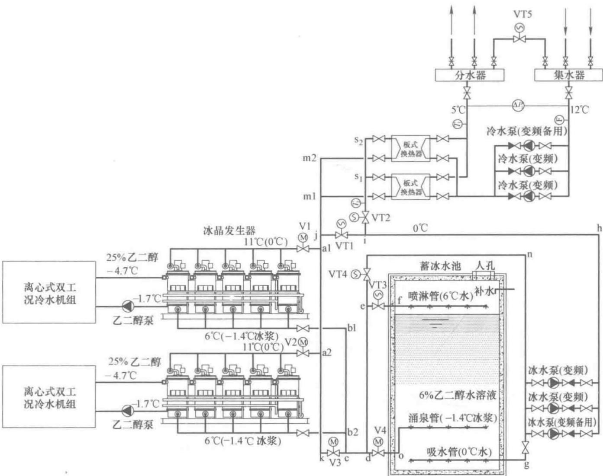  
图 5-35 间接动态制冰原理图

**(1) 优点**

1）可以采用较熟悉品牌的双工况冷水机组；

2）双工况冷水机组与蓄冰装置分离，维护、检修难度低；

3）联合供冷工况下融冰过程融冰效率、速率高，适用于蓄冷量大、瞬时负荷高的场所（如剧院、体育场等）。

**(2) 缺点**

1）系统较冷媒直接蒸发制冰复杂；

2）由于存在中间换热过程，且设置了两套水泵，故系统效率较冷媒直接蒸发系统降低3%～5%（但仍比传统的制冰系统效率高5%以上）；

（3）双工况冷水机组与制冰装置分开设置，机房占地面积较大。

**5.2.11 过冷水式动态制冰技术**

**1. 过冷水式动态制冰技术的基本原理**

首先把水在过冷却热交换器中冷却至低于 $0^{\circ}$ C 的过冷状态，然后把过冷水输送至特殊的过冷却解除器中解除过冷，生成大量细小的冰晶颗粒，与剩余的液态水一起形成 $0^{\circ}$ C 下的冰浆，其过程如图 5-36 所示。这种制冰过程中最关键的技术在于确保流经过冷却热交换器的液态水具有尽可能大的过冷度，但同时又必须保证过冷水不能在流出热交换器之前生成冰晶，否则换热器将被堵塞甚至破坏。此外，还应有高效率的过冷却解除技术，以确保过冷水能够连续快速结晶。

过冷却热交换器采用板式换热器。为了防止过冷水在换热器内结冰，换热器内表面需要进行特殊涂层处理，同时对换热器内部的流场特性也有很高的要求，否则很难获得足够大的过冷度，以及避免堵塞。过冷却解除技术有多种，如机械方法、热方法、超声波方法等。过冷水式动态制冰技术的系统控制要求非常高，这也是该技术走向实用化所面临的一大技术难点。

**2. 水的过冷特性**

水的过冷特性见图 5-37。水的冰点在标准大气压下为 $0^{\circ}$ C，但温度降到 $0^{\circ}$ C 时并不立即结冰，而是低于 $0^{\circ}$ C 以下的某个温度点才开始结冰，低于 $0^{\circ}$ C 的差值就是过冷度。过冷度的大小取决于水的初始条件和外界环境。

普通自来水：安全过冷度 $T_{s} \approx 3.8^{\circ}C$ ，最低过冷度 $T_{m} \approx 5.8^{\circ}C$ 。

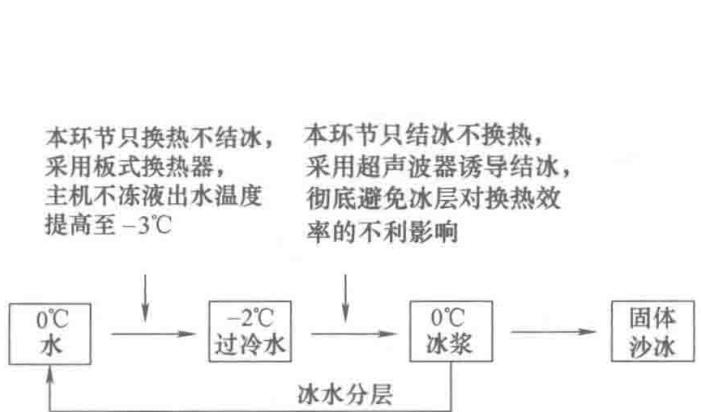  
图 5-36 过冷水式动态制冰技术过程

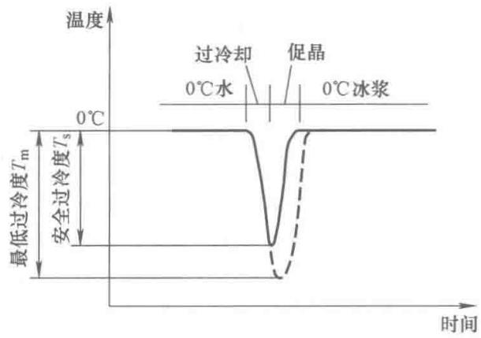  
图 5-37 水的过冷特性

**3. 促晶技术（解除过冷却，生成冰浆）**

超声波促晶器，如图 5-38 所示，利用超声波在液相水中的强烈空化效应，在过冷水中均匀产生强烈的内部微小扰动，破坏过冷水的亚稳态，快速诱发结冰。

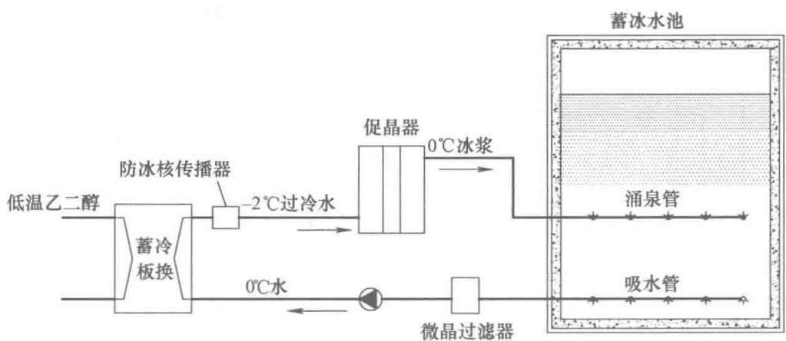  
图 5-38 超声波促晶原理图

超声波空化作用是指存在于液体中的微气核空化泡在声波的作用下振动，当声压达到一定值时发生的生长和崩溃的动力学过程。空化作用一般包括3个阶段：空化泡的形成、长大和剧烈的崩溃。当盛满液体的容器通入超声波后，由于液体振动而产生数以万计的微

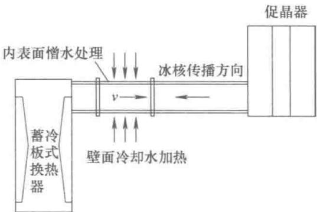  
图 5-39 防冰核传播器原理图

板式换热器方向的传播。

小气泡，即空化泡。这些气泡在超声波纵向传播形成的负压区生长，而在正压区迅速闭合，从而在交替正负压强下受到压缩和拉伸。在气泡被压缩直至崩溃的一瞬间，会产生巨大的瞬时压力，一般可高达几十兆帕至上百兆帕。

**4. 热交换器出口冰核防传播技术（见图 5-39）**

冰核传播原理——过冷水中一旦有局部地方生成冰晶，则冰晶将具有迅速向各个方向蔓延到整个过冷水域的强烈趋势。通过设置防冰核传播器来阻断其向

防冰核传播器是通过下面三种措施进行工作的：

（1）内表面憎水化处理：迫使沿壁面生成的冰晶脱落。

（2）采用冷却水对外壁面加热：迫使沿壁面生成的冰晶脱落。

（3）使管内流速 $v \geqslant$ 临界值：冲刷脱离壁面的冰晶。

5. 过冷水式动态制冰系统原理

如图 5-40 所示，过冷水式动态冰蓄冷技术是通过把普通淡水冷却到低于 $0^{\circ}$ C 的液态过冷状态，再经超声波促晶生成流态化冰浆的技术。过冷水式动态冰蓄冷技术的核心是把制冰过程的热传递和冰水相变两个环节从空间上彻底分离，一举解决传统制冰工艺中结冰对传热的恶劣影响，从而大幅度降低制冰能耗并提高制冰效率。由于冰浆中固液两相存在密度差，在蓄冰槽中可以循环抽取出冰浆中分离出来的液态水，再送回制冰系统中生成冰浆，由此可使蓄冰槽内的冰浆固相含量达到 50% 左右。

由于过冷水式动态冰蓄冷系统较为复杂的工艺设计、高标准的设备和零部件加工要求和高可靠性的自控系统设计要求，为此，我国高菱公司采用模块化设计思路，将过冷水式动态冰蓄冷系统中最核心和可靠性要求最高的工艺和设备集成为模块化动态制冰机组（见图5-41），在工厂内完成机组的加工、装配、检验和测试，确保机组的技术参数和整体质量达到设计规范要求，同时大幅降低现场安装施工的难度。模块化动态制冰机组通过台数的多少可以实现不同蓄冷量的组合。

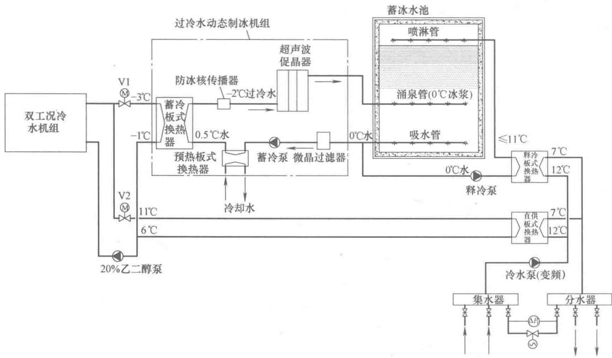  
图 5-40 过冷水式动态蓄冰供冷原理图

过冷水式动态制冰系统的主机与蓄冷水槽通常采用并联系统来实现联合供冷。

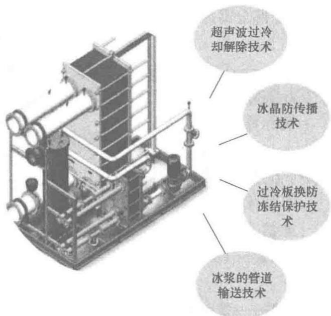

**6. 过冷水式流态冰蓄冷系统的特点**

过冷水式流态冰蓄冷系统的特点除了以下几点之外，均与机械搅拌式相同。

图 5-41 过冷水模块化动态制冰机组

（1）过冷水式流态冰蓄冷系统在制冰工况下主机平均出水温度为 $-3^{\circ}C$ 。

（2）需要冷却水对板式换热器入口的冷水进行预热。

（3）联合供冷时，主机与蓄冰水池为并联系统。

（4）冰水为自来水无需加入低浓度的乙二醇。

（5）这种制冰方法中由于冰浆中不添加冰点抑制剂，如乙二醇、NaCl等物质且可以实现低温（0～1℃）供水，过冷水式流态冰非常适合食品医药行业如鲜奶、饮料、药剂、生鲜食品等的加工工艺对低温冷源的要求。

**5.2.12 流态冰蓄冷系统设计注意事项**

1. 蓄冰水池液面宜高于冰晶发生器，蓄冷侧采用蓄冰水池定压。

2. 板式换热器选型宜按空调设计负荷确定，以便在高峰电价时段实现不开主机，通过全融冰供冷，最大限度地节省运行费用。

3. 为了避免铁锈对过冷水稳定性的影响，以及防止乙二醇对管道的腐蚀。冰浆系统通常选择 PE 或 PVC 管道。PE 或 PVC 管道施工便捷，周期短，且管道清洗方便。另外，PE 塑料管道传热系数为 $0.35 \, \text{W/(m}^2 \cdot \text{K)}$ ，而普通空调循环水路钢管的传热系数为 $46.52 \, \text{W/(m}^2 \cdot \text{K)}$ ，由此可见 PE 管路的热损失更小。

**5.2.13 流态冰蓄冷系统设计计算**

**1. 双工况冷水机组的确定**

流态冰蓄冷系统设计也分为全蓄冰和部分蓄冰两种情况来计算。

1）全蓄冰系统

$$
q _ {\mathrm{c}} = \varepsilon \cdot Q / n _ {2} \cdot C _ {\mathrm{f}}\tag{5-16}
$$

式中 $q_{c}$ ——双工况机组空调工况制冷量，kW；

Q——设计日总冷负荷，kWh;

$\varepsilon$ ——蓄冷装置的实际放大系数，蓄冷水槽取1.1；

$C_{f}$ ——制冷机工况系数，较静态制冰机组高，螺杆机取0.77，离心机取0.73；

$n_{2}$ ——制冷机在制冰工况下的运行小时数， $h_{0}$

**2）部分蓄冰系统**

$$
q _ {\mathrm{c}} = \varepsilon \cdot Q / (n _ {1} + n _ {2} \cdot C _ {\mathrm{f}})\tag{5-17}
$$

式中 $n_{1}$ ——白天制冷机在空调工况下的运行小时数，h。

**2. 实际蓄冰量计算公式**

实际蓄冰量：

$$
Q _ {\mathrm{s}} = n _ {2} \cdot C _ {\mathrm{f}} \cdot q _ {\mathrm{c}}\tag{5-18}
$$

式中 $Q_{s}$ ——蓄冰量，kWh。

**3. 蓄冰槽体积计算公式**

冰蓄冷通常不会将水全部凝固，流态冰所占容积的比例通常在 50% 左右，蓄冷密度一般在 12～16RT·h/m³。根据工程经验，一般取 12.5RT·h/m³，即 44kWh/m³。

$$
V = 4 4 \times Q _ {s}\tag{5-19}
$$

式中 V ——蓄冰池体积， $m^{3}$ ;

**4. 板式换热器选型**

板式换热器选型宜按空调设计负荷确定，以便在高峰电价时段，实现不开主机，通过全融冰供冷。

**第6章 热交换站的设计**

**6.1 换热在暖通空调系统中的应用**

**6.1.1 热交换站的应用场所**

1. 供暖、空调系统所需的低温热水，常常需要由高温热水或蒸汽经换热站交换制得。

2. 冰蓄冷工程中，乙二醇系统与末端空调冷水系统，常常需要板式换热器进行分隔。

3. 北方地区，冬季冷却塔供冷系统，冷却水与冷水需要板式换热器进行分隔。

4. 区域供冷系统中，室外管网与各个单体建筑的冷水系统也需要采用板式换热器分隔。

5. 高层建筑竖向分区的空调冷水系统，其高区冷水也需经板式换热器与低区的一次水交换制得。

6. 有些时候，热回收冷水机组的回收热也需与生活热水的蓄水箱进行换热。

**6.1.2 常用的换热器的形式**

在这些换热系统中，需根据系统的特点采用不同的换热器。在暖通空调系统中，常用的换热器有板式换热器、螺旋螺纹管式、浮动盘管容积式换热器等。

1. 板式换热器：常用于暖通空调系统的水-水换热，特别适合小温差冷水系统的换热。为了方便接管、减少占地面积，板式换热器常常与循环水泵做成板式换热机组来使用。

2. 螺旋螺纹管换热器：常用于暖通空调系统的汽-水换热，换热器体积小，该换热器经常与循环水泵组合成换热机组在供热工程中应用。

3. 浮动盘管容积式换热器：常用于冷水机组热回收的水-水换热，由于产热与用热的不同时性，需要一定的水容积对热量进行蓄存。

**6.2 换热器的选型注意事项**

根据介质在换热器内流动的相对方向，可分为逆流、顺流及交叉流。在相同进出温度下，逆流比顺流平均温差大。顺流时冷流体出口温度必然低于热流体出口温度，而逆流体则不受此限制。故工程设计应采用逆流式。工程设计时需对换热器进行选型，换热器选型时需注意以下几点：

1. 一个换热系统的换热器不宜少于 2 台，当其中一台停止工作时，其余换热器的换热量以满足系统的 70%。

2. 换热器水侧阻力一般不大于 $7 \mathrm{~m}$ 。换热器阻力的大小决定着换热器的造价，以板式换热器为例，板片越多，流道越多，阻力越小，反之阻力越大。同时，换热器水侧阻力还

影响着循环泵的耗电输热比。

3. 每个换热系统的循环泵应设置一台备用泵。

4. 并联使用的循环泵不应超过 3 台，且型号应相同。台数过多时，采用台数调节负荷时，由于工况点的变化，调节范围较小。

5. 循环泵应采用变频调速，根据负荷变化进行流量调节。

**6.3 换热器的选型计算**

暖通空调工程的换热器计算，一般都是已知热负荷，来计算换热器的换热面积、一次热媒流量和二次水流量。

**6.3.1 换热面积计算**

$$
F = \frac {Q}{K \cdot B \cdot \Delta t _ {\mathrm{m}}}\tag{6-1}
$$

式中 F ——换热器传热面积， $m^{2}$ ;

Q——换热量，W；

K——换热器的传热系数， $W/(m^{2} \cdot ^{\circ}C)$ ;

B——水垢系数；当汽-水换热时， $B=0.9\sim0.85$ ；当水-水换热时， $B=0.8\sim0.7$ ； $\Delta t_{m}$ ——对数平均温差，℃。

**6.3.2 对数平均温差计算**

$$
\Delta t _ {\mathrm{m}} = \frac {\Delta t _ {\mathrm{max}} - \Delta t _ {\mathrm{min}}}{\ln \frac {\Delta t _ {\mathrm{max}}}{\Delta t _ {\mathrm{min}}}}\tag{6-2}
$$

式中 $\Delta t_{max}$ ——较大温差端的温差，℃；

$\Delta t_{min}$ ——较小温差端的温差，℃。

**6.3.3 对数平均温差的简化计算**

当 $\Delta t_{max}/\Delta t_{min} \leqslant 2$ 时，对数平均温差可简化为按算术平均温差计算，即：

$$
\Delta t _ {\mathrm{m}} = \frac {\Delta t _ {\mathrm{max}} + \Delta t _ {\mathrm{min}}}{2}\tag{6-3}
$$

算术平均温差相当于温度呈直线变化的情况，因此，总是大于相同进出口温度下的对数平均温差，上式在采用小温差的空调冷水换热的板式换热器计算中经常用到。

**6.3.4 对数平均温差的推导**

换热器的换热面积计算，之所以采用对数平均温差，是因为冷热流体沿传热面进行热交换，其温度沿流动方向不断变化，因此冷热液体间温差也是不断变化的，如图6-1和图6-2所示。

以顺流情况为例，并作如下假设：

1. 冷、热流体的质量流量 $M_{1}$ 、 $M_{2}$ 以及比热容 $c_{p1}$ 、 $c_{p2}$ 是常数；

2. 传热系数是常数；

3. 换热器无散热损失；

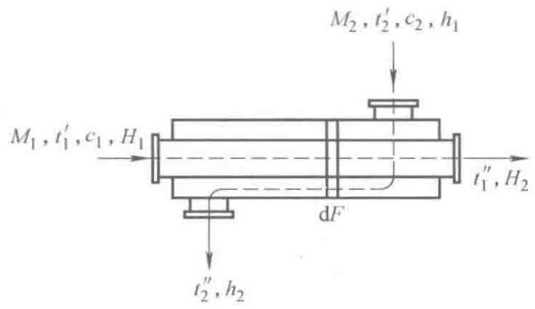

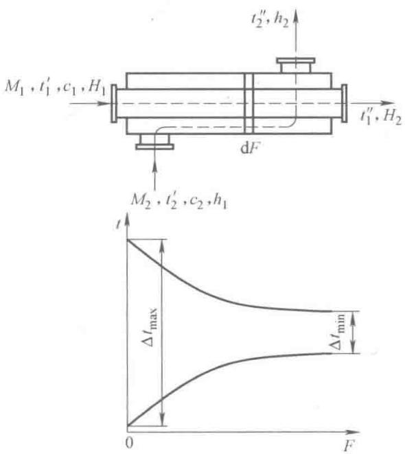  
图6-1 顺流

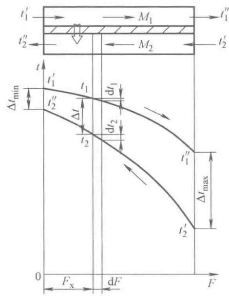  
图6-2 逆流

4. 换热面沿流动方向的导热量可以忽略不计。

从换热面 $F_{x}$ 处取一微面积 dF，它的传热量为：

$$
\mathrm{d} Q = K \left(t _ {1} - t _ {2}\right) _ {\mathrm{x}} \mathrm{d} F _ {\mathrm{x}}\tag{6-4}
$$

则全部换热面的传热量可由式（6-4）积分得到：

$$
Q = \int_ {0} ^ {F} K (t _ {1} - t _ {2}) _ {\mathrm{x}} \mathrm{d} F = K \Delta t _ {\mathrm{m}} F
$$

式中 $\Delta t_{m}$ ——平均温差。

$$
\Delta t _ {\mathrm{m}} = \frac {\int_ {0} ^ {F} (t _ {1} - t _ {2}) _ {\mathrm{x}} \mathrm{d} F}{F} = \frac {1}{F} \int_ {0} ^ {F} \Delta t _ {\mathrm{x}} \mathrm{d} F\tag{6-5}
$$

换热器较大温差端的温差为 $\Delta t_{max}$ ，换热器较小温差端的温差为 $\Delta t_{min}$ 。

在 $F_{\mathrm{x}}$ 处的 $\mathrm{d}F$ 面积上，热流体温度变化 $\mathrm{dt}_1$ ，换热量为：

$$
\mathrm{d} Q = - M _ {1} c _ {1} \mathrm{d} t _ {1}\tag{6-6}
$$

则

$$
\mathrm{d} t _ {1} = - \frac {\mathrm{d} Q}{M _ {1} c _ {1}}
$$

冷流体温度变化 $dt_{2}$ ，换热量为：

$$
\mathrm{d} Q = M _ {2} c _ {2} \mathrm{d} t _ {2}
$$

则

$$
\mathrm{d} t _ {2} = \frac {\mathrm{d} Q}{M _ {2} c _ {2}}\tag{6-7}
$$

$$
\mathrm{d} t _ {1} - \mathrm{d} t _ {2} = \mathrm{d} (t _ {1} - t _ {2}) _ {\mathrm{x}} = - \mathrm{d} Q \left(\frac {1}{M _ {1} c _ {1}} + \frac {1}{M _ {2} c _ {2}}\right)\tag{6-8}
$$

把式（6-4）代入式（6-8）得：

$$
\frac {\mathrm{d} \left(t _ {1} - t _ {2}\right) _ {\mathrm{x}}}{t _ {1} - t _ {2}} = \frac {\mathrm{d} (\Delta t) _ {\mathrm{x}}}{\Delta t _ {\mathrm{x}}} = - K \left(\frac {1}{M _ {1} c _ {1}} + \frac {1}{M _ {2} c _ {2}}\right) \mathrm{d} F _ {\mathrm{x}}\tag{6-9}
$$

将式（6-9）从0到 $F_{x}$ 积分得：

$$
\ln \frac {\Delta t _ {\mathrm{x}}}{\Delta t _ {\max}} = - K \left(\frac {1}{M _ {1} c _ {1}} + \frac {1}{M _ {2} c _ {2}}\right) F _ {\mathrm{x}}
$$

或写成

$$
\Delta t _ {\mathrm{x}} = \Delta t _ {\max} e ^ {- K \left(\frac {1}{M _ {1} c _ {1}} + \frac {1}{M _ {2} c _ {2}}\right) F _ {\mathrm{x}}}\tag{6-10}
$$

把式（6-10）代入式（6-5）得：

$$
\Delta t _ {\mathrm{m}} = \frac {1}{F} \int_ {0} ^ {F} \Delta t _ {\mathrm{x}} \mathrm{d} F = \frac {\Delta t _ {\max}}{- K F \left(\frac {1}{M _ {1} c _ {1}} + \frac {1}{M _ {2} c _ {2}}\right)} [ \mathrm{e} ^ {- K F \left(\frac {1}{M _ {1} c _ {1}} + \frac {1}{M _ {2} c _ {2}}\right)} - 1 ]\tag{6-11}
$$

将式（6-9）从0到 $F$ 积分得：

$$
\ln \frac {\Delta t _ {\min}}{\Delta t _ {\max}} = - K F \left(\frac {1}{M _ {1} c _ {1}} + \frac {1}{M _ {2} c _ {2}}\right)\tag{6-12}
$$

或写成

$$
\frac {\Delta t _ {\min}}{\Delta t _ {\max}} = \mathrm{e} ^ {- K F \left(\frac {1}{M _ {1} c _ {1}} + \frac {1}{M _ {2} c _ {2}}\right)}\tag{6-13}
$$

将式（6-12）、式（6-13）代入式（6-11）得：

$$
\Delta t _ {\mathrm{m}} = \frac {\Delta t _ {\mathrm{max}} - \Delta t _ {\mathrm{min}}}{\ln \frac {\Delta t _ {\mathrm{max}}}{\Delta t _ {\mathrm{min}}}}
$$

**6.3.5 换热器一次侧及二次侧流量的计算**

根据能量守恒，换热量等于一次热媒放热，等于二次热水得热量，即：

$$
Q = M _ {1} (H _ {2} - H _ {1}) = M _ {2} (h _ {2} - h _ {1})
$$

则

$$
M _ {1} = \frac {Q}{(H _ {1} - H _ {2})}
$$

$$
M _ {2} = \frac {Q}{(h _ {2} - h _ {1})} = \frac {Q}{c _ {p} (t _ {2} - t _ {1})}
$$

式中 $H_{1}$ 、 $H_{2}$ ——一次热媒进出口的焓值，kJ/kg；

$h_{1}$ 、 $h_{2}$ ——二次热水进出口的焓值，kJ/kg。

如果一次热媒为蒸汽，采用上式计算一次蒸汽量非常方便。例如：换热量为15100kW的汽-水换热器，一次蒸汽为0.8MPa的饱和蒸汽，凝结水为70℃，二次水为85℃/60℃的热水，求其蒸汽耗量和二次水循环水量。

首先，通过查《动力专业设计常用数据》得到 0.8MPa 饱和蒸汽的比焓值为 2767.5kJ/kg，70℃的水的比热为 4.187kJ/(kg·K)

$$
M _ {1} = \frac {Q}{(H _ {1} - H _ {2})} = \frac {1 5 1 0 0}{2 7 6 7 . 5 - 4 . 1 8 7 \times 7 0} = 6. 1 0 \mathrm{kg/s} = 2 2 \mathrm{t/h}
$$

$$
M _ {2} = \frac {Q}{(h _ {2} - h _ {1})} = \frac {1 5 1 0 0}{4 . 1 8 7 \times (8 5 - 6 0)} = 1 4 4 \mathrm{kg/s} = 5 1 8 \mathrm{m} ^ {3} / \mathrm{h}
$$

**6.4 锅炉房和换热机房的调节**

《公共建筑节能设计标准》GB 50189—2015 规定：“锅炉房和换热机房应设置供热量自动控制装置”。使供水水温或流量等参数在保持室内温度的前提下，随室外空气温度的变化进行调整，始终保持锅炉房或换热机房的供热量与建筑的需热量基本一致，实现按需供热，达到最佳的运行效率和最稳定的供热质量。

供热量自动控制包括质调节和量调节。质调节一般采用气候补偿器来实现，而量调节一般是采用水泵的变频调速来实现。

**6.5 气候补偿器原理**

气候补偿器是根据室外温度的变化及用户设定的不同时间对室内温度要求，按照设定曲线求出恰当的供水温度进行自动控制，实现供热系统供水温度—室外温度的自动气候补偿，避免产生室温过高而造成能源浪费的一种节能产品；根据系统不同，节能率达10%～25%。

**6.5.1 气候补偿器的设定曲线**

设定曲线是按以下原理确定的：

如果忽略管网沿途热损失，则有以下热平衡方程：

$$
Q _ {1} = Q _ {2} = Q _ {3}
$$

式中 $Q_{1}$ ——建筑物的热负荷，kW；

$Q_{2}$ ——散热设备放出的热量，kW；

$Q_{3}$ ——供热管网输送的热量，kW；

$$
Q _ {1} = q V \left(t _ {\mathrm{n}} - t _ {\mathrm{w}}\right)\tag{6-14}
$$

$$
Q _ {2} = K F \left(t _ {\mathrm{p}} - t _ {\mathrm{n}}\right)\tag{6-15}
$$

$$
Q _ {3} = G c \left(t _ {\mathrm{g}} - t _ {\mathrm{h}}\right)\tag{6-16}
$$

式中 q ——建筑物的热指标， $\mathrm{kW}/(\mathrm{m}^{3} \cdot ^{\circ}\mathrm{C})$ ;

V——建筑物的体积， $m^{3}$ ;

$t_{n}$ ——室内温度，℃；

$t_{w}$ ——冬季室外计算温度，℃；

K——散热器的传热系数， $\mathrm{kW/(m^{2}\cdot^{\circ}C)}$ ;

F——散热器的外表面积， $m^{2}$ ;

$t_{p}$ ——散热器内热水平均温度，℃；

G——管网内热水流量，kg/s；

c——管网内热水的重量比热，kW/(kg·℃);

$t_{g}$ ——热网的供水温度，℃；

$t_{h}$ ——热网的回水温度，℃。

散热器的传热系数 K 可以写成经验公式：

$$
K = A \left(t _ {\mathrm{p}} - t _ {\mathrm{n}}\right) ^ {B}
$$

式中 A、B——为由实验确定的系数。

对整个建筑而言，可近似地认为

$$
t _ {\mathrm{p}} = \frac {t _ {\mathrm{g}} + t _ {\mathrm{h}}}{2}
$$

由此，式（6-15）可以写成：

$$
Q _ {2} = A F \left(\frac {t _ {\mathrm{g}} + t _ {\mathrm{h}}}{2} - t _ {\mathrm{n}}\right) ^ {1 + B}
$$

若以带“/”的符号表示任一非设计室外条件下的各种参数，热平衡方程可写成：

$$
Q _ {1} ^ {\prime} = Q _ {2} ^ {\prime} = Q _ {3} ^ {\prime}
$$

$$
Q _ {1} ^ {\prime} = q ^ {\prime} V (t _ {\mathrm{n}} - t _ {\mathrm{w}} ^ {\prime})
$$

$$
Q _ {2} ^ {\prime} = A F \left(\frac {t _ {\mathrm{g}} ^ {\prime} + t _ {\mathrm{h}} ^ {\prime}}{2} - t _ {\mathrm{n}}\right) ^ {1 + B}
$$

$$
Q _ {3} ^ {\prime} = G ^ {\prime} c (t _ {\mathrm{g}} ^ {\prime} - t _ {\mathrm{h}} ^ {\prime})
$$

若将运行调节时的热负荷与设计热负荷之比称之为相对热负荷 $\overline{Q}$ ，而流量之比称之为相对流量 $\overline{G}$ ，则有

$$
\overline {{Q}} = \frac {Q _ {1} ^ {\prime}}{Q _ {1}} = \frac {Q _ {2} ^ {\prime}}{Q _ {2}} = \frac {Q _ {3} ^ {\prime}}{Q _ {3}}
$$

$$
\overline {{{G}}} = \frac {G ^ {\prime}}{G}
$$

对于变频调速水泵有：

$$
\overline {{{G}}} = \frac {G ^ {\prime}}{G} = \frac {f ^ {\prime}}{f}
$$

式中 $f'$ ——水泵调节时的运行频率；

f——水泵设计工况时的运行频率。

由上式可得出：

$$
\overline {{Q}} = \frac {Q _ {1} ^ {\prime}}{Q _ {1}} = \frac {q ^ {\prime} (t _ {\mathrm{n}} - t _ {\mathrm{w}} ^ {\prime})}{q (t _ {\mathrm{n}} - t _ {\mathrm{w}})}
$$

忽略误差，工程中常把热指标 q 当成恒定不变的常数，则得出：

$$
\overline {{{Q}}} = \frac {t _ {\mathrm{n}} - t _ {\mathrm{w}} ^ {\prime}}{t _ {\mathrm{n}} - t _ {\mathrm{w}}}\tag{6-17}
$$

$$
\overline {{Q}} = \frac {Q _ {2} ^ {\prime}}{Q _ {2}} = \frac {(t _ {\mathrm{g}} ^ {\prime} - t _ {\mathrm{h}} ^ {\prime} - 2 t _ {\mathrm{n}}) ^ {1 + B}}{(t _ {\mathrm{g}} - t _ {\mathrm{h}} - 2 t _ {\mathrm{n}}) ^ {1 + B}}\tag{6-18}
$$

$$
\overline {{Q}} = \frac {Q _ {3} ^ {\prime}}{Q _ {3}} = \overline {{G}} \frac {t _ {\mathrm{g}} ^ {\prime} - t _ {\mathrm{h}} ^ {\prime}}{t _ {\mathrm{g}} - t _ {\mathrm{h}}}\tag{6-19}
$$

由式（6-18）、式（6-19）可得出：

$$
t _ {\mathrm{g}} ^ {\prime} = t _ {\mathrm{n}} + \frac {1}{2} (t _ {\mathrm{g}} + t _ {\mathrm{h}} - 2 t _ {\mathrm{n}}) \left(\frac {t _ {\mathrm{n}} - t _ {\mathrm{w}} ^ {\prime}}{t _ {\mathrm{n}} - t _ {\mathrm{w}}}\right) ^ {\frac {1}{1 + B}} + \frac {1}{2 G} (t _ {\mathrm{g}} - t _ {\mathrm{n}}) \left(\frac {t _ {\mathrm{n}} - t _ {\mathrm{w}} ^ {\prime}}{t _ {\mathrm{n}} - t _ {\mathrm{w}}}\right)\tag{6-20}
$$

式中，B 值的大小与散热器的种类和系统连接方式有关。当暖风机循环风供热及空调供热时，B=0。

对于新风比为 $x$ 的空调供热系统，将 $t_{\mathrm{n}}$ 改为 $\frac{t_{\mathrm{n}} + xt_{\mathrm{w}}}{1 + x}$ 则有：

$$
t _ {\mathrm{g}} ^ {\prime} = \frac {t _ {\mathrm{n}} + x t _ {\mathrm{w}} ^ {\prime}}{1 + x} + \left(\frac {t _ {\mathrm{g}} + t _ {\mathrm{h}}}{2} - \frac {t _ {\mathrm{n}} + x t _ {\mathrm{w}} ^ {\prime}}{1 + x}\right) \left(\frac {t _ {\mathrm{n}} - t _ {\mathrm{w}} ^ {\prime}}{t _ {\mathrm{n}} - t _ {\mathrm{w}}}\right) + \frac {1}{2 G} (t _ {\mathrm{g}} - t _ {\mathrm{n}}) \left(\frac {t _ {\mathrm{n}} - t _ {\mathrm{w}} ^ {\prime}}{t _ {\mathrm{n}} - t _ {\mathrm{w}}}\right)\tag{6-21}
$$

以室外温度为横坐标，以供水温度为纵坐标，式（6-20）、式（6-21）可表示为图6-3中的两条曲线，这就是气候补偿器的设定曲线。

**6.5.2 气候补偿器的功能**

气候补偿器实际上就是植入上述公式的 PLC 控制器或 DDC 控制器。不同的厂家生产的气候补偿器略有不同，有的还采用典型供暖房间的室内温度偏差对供水温度进行修正。一般都有以下功能：

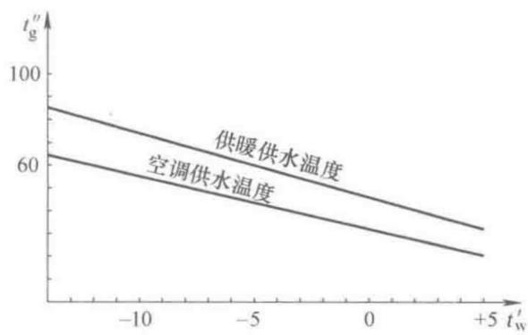

1. 实时显示室内外温度、供水温度、回水温度及电动阀开度等运行参数，LED 灯显示系统运行状态；触摸键盘操作；

图 6-3 气候补偿器调节曲线

2. 分时分温功能模块内嵌，系统默认提供数个时段、数条独立运行曲线，以满足用户在不同时段对室内温度的要求；

3. 能够精确控制供水温度，根据室外温度运算出所需的供暖水温，并运用 PID 控制规律实时与实际供水温度比较，调节电动阀开度，精确保证稳定供水温度，避免发生用户室温过高的现象而浪费能耗；

4. 曲线自学习功能，根据历史参数实时修正室外温度—供水温度曲线，使供暖系统最优化运行；

5. 支持多种通信方式。

**6.5.3 气候补偿器的应用**

图 6-4 为采用气候补偿器的换热系统，气候补偿器根据室外温度计算出二次水的设定温度，由二次水设定温度控制一次侧电动调节三通阀，调节进入板式换热器的水量。保证二次水温度恒定。

如果热源是市政高温热水，一次侧的电动调节三通阀可以改成电动调节两通阀。

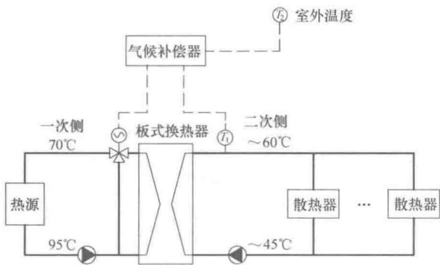  
图 6-4 气候补偿器控制原理图