# 系统思维下的精准调控一供冷系统预调试与平衡调试关键点解析

汇报部门：北非公司 汇报人：周华轩

日期：2025-09

 姓名：周华轩

 年龄：25

 毕业院校：天津大学

 专业：水利水电工程

 爱好特长：羽毛球、围棋、游泳

 获奖经历：公司第二届职工创新大赛三等奖、局新

员工安全隐患整改优秀案例、公司首届青蓝杯大赛

二等奖

## 日录

## CONTENTS

01 预调试 vs. 平衡调试  
02 万丈高楼平地起  
—预调试重难点分析  
03 从单机到系统的艺术  
—平衡调试重难点分析  
04 分析与总结

## 01PART ONE

## 预调试 vs. 平衡调试

## 预调试 vs. 平衡调试

## 1.1 概念澄清：预调试 vs. 平衡调试

• “做对的事情”（Do things right）—— 在系统运行前，确保所有设备安装正确、功能完好、具备运行条件。（侧重于静态检查）

## 两者关系

• 预调试是平衡调试的基础，没有合格的预调试，平衡调试无从谈起。

• “把事情做对”（Get things done）—— 在系统运行中，通过测试、测量和调整，使系统实际运行参数达到设计指标。（侧重于动态优化）

## 预调试 vs. 平衡调试

## 1.2 调试阶段流程、价值以及重要性

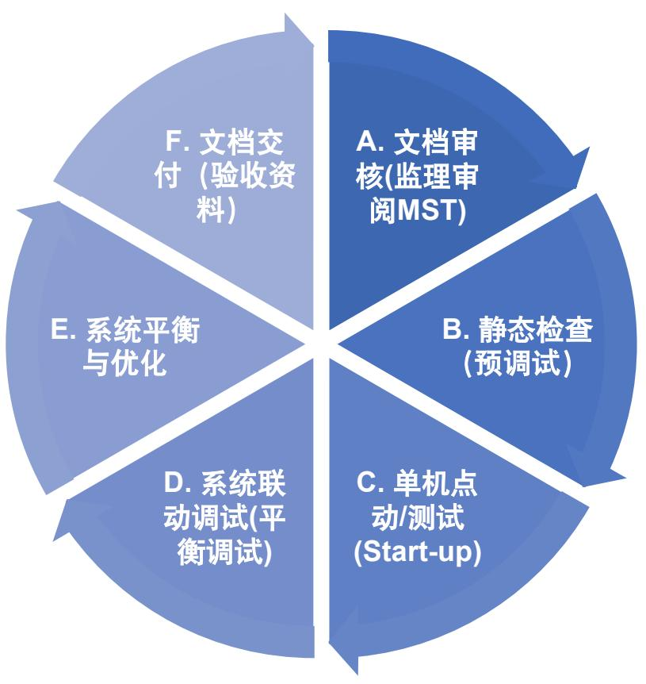

从单机到系统，从静态到动态实现对整个系统的调测

o确保系统按设计意图运行，实现能效最优。

提前暴露并解决设备、安装、控制中的隐患，o避免后期巨大损失。

o是工程验收、移交和未来运维的关键依据。

## 02 万丈高楼平地起PART TWO --预调试重难点分析

## 预调试重难点分析

2.1 供冷系统设备预调试内容详解

冷却水侧（冷机的冷凝器）设计供回水温差为29℃进水，36℃出水。

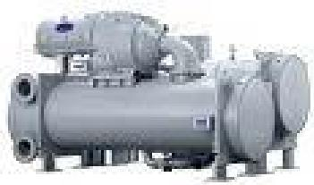

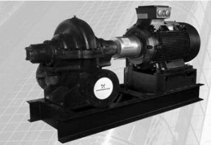

冷冻水侧（冷机的蒸发器）设计供回水温差为4.4℃供冷，13.3℃回水。

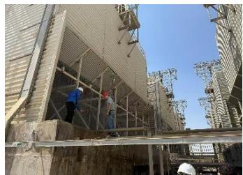

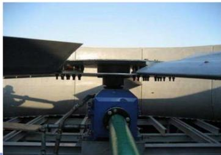

供冷系统的核心：冷机

经由冷却塔泵将冷却水泵送至冷却塔，由冷却塔进行空气和冷却水的强制换热，将冷却水的温度降低并循环回冷机的冷凝器，完成开式系统的循环。

经由冷机制冷过的空调水由一次泵泵送出蒸发器，到达解耦管（Decoupler Line）按照二次侧所需用水分配流量，保证一次侧冷机端有稳定流量。

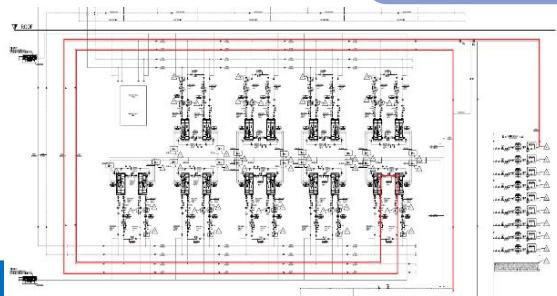

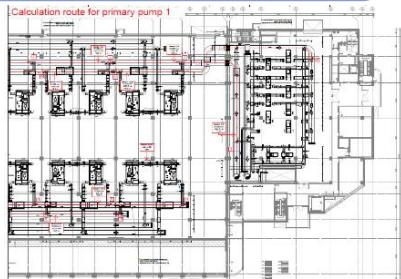

二次泵将冷冻水进入各个塔楼的板式换热器参与CBD塔楼内部的降温循环。

储热（冷）罐泵将用冷低 谷的多余冷水泵送至储热 （冷）罐储备应对用冷高 峰的情况。

## 预调试重难点分析

## 2.2 供冷系统设备预调试内容详解—冷机

## 预调试阶段 (Pre-commissioning) - 确保启动条件万无一失

设备安装完成后便进入预调试阶段，这个阶段的所有工作都是为了回答一个问题：“冷机现在可以安全启动了吗？”冷机安全启动涉及到多个专业的安装阶段是否全部符合要求地完成，对于设备本身厂家的技术人员在启动前会反复检查确认，但是作为施工方还需要关注供电和供水两大重点问题。

## 电气系统核查：

因为CUC项目地冷机选型是12kV中压供电，所以在冷机预调试以及启动之前，电气系统的检查必不可少。

电源质量： 测量主电源电压波动范围（通常在±10%内）、频率稳定性。相序核对： 必须确认电源相序与机组要求一致。相序错误会导致压缩机反转，瞬间损坏。

绝缘测试： 在厂家指导下，对压缩机电机、加热器等主要电气元件进行绝缘电阻测试，确保其值在安全范围内（通常>1 MΩ）。

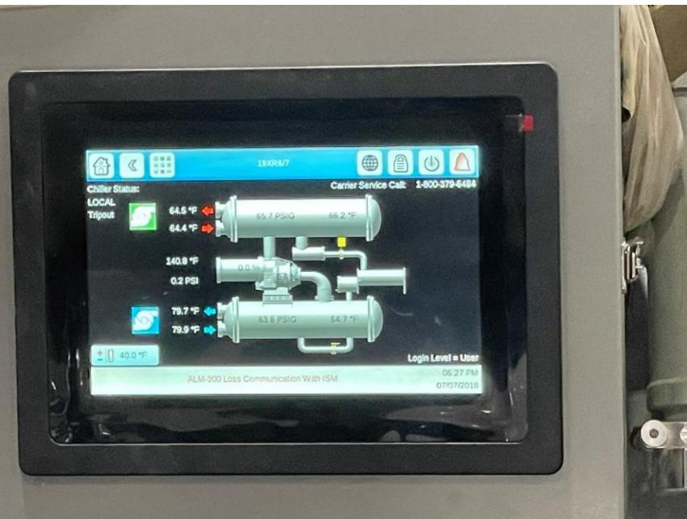

水系统关联检查：

水流量不足是冷机自我保护机制触发的主要原因，需要重点检查流量以及水质以满足冷机运行要求。

流量验证： 必须通过安装的流量计或使用超声波流量计，实测蒸发器和冷凝器的水流量，确保其达到机组最小安全流量以上，并尽量接近设计值。绝不能仅凭“水泵开了”就想当然。

水质报告： 查验水系统冲洗后的水质报告，确保水质（硬度、pH值、浊度）符合机组要求，防止结垢腐蚀。

## 预调试重难点分析

## 2.3 供冷系统设备预调试内容详解—水泵

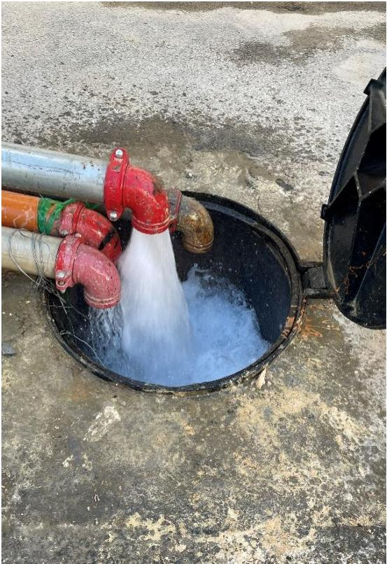

 泄水冲洗

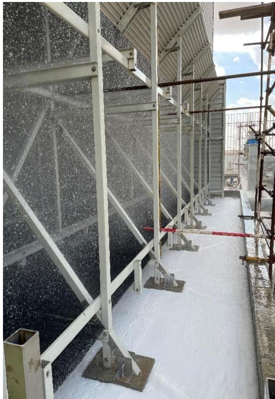

 冷却塔冲洗

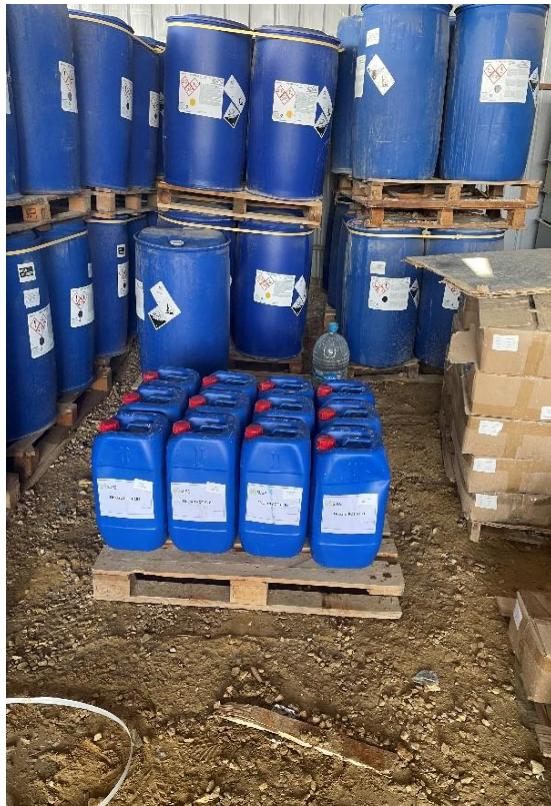

 冲洗药剂

##  调试前序工作-管道冲洗

大管道冲洗工作分为五步骤：静态清洗-动态冲洗-管道酸洗-预膜钝化-最终加药。

其中从静态、动态冲洗转为酸洗的条件是水无杂质，转为酸洗需要将所有过滤器清理干净，之后进行管道酸洗及预膜钝化，钝化后主要指标铁离子含量应低于0.5ppm。CBD的冲洗分为三个阶段，一阶段是CUC与北区办公楼的供冷管道，二阶段是南区住宅楼和中区冲洗，三阶段是南北环线并网循环。

## 预调试重难点分析

## 2.3 供冷系统设备预调试内容详解—水泵

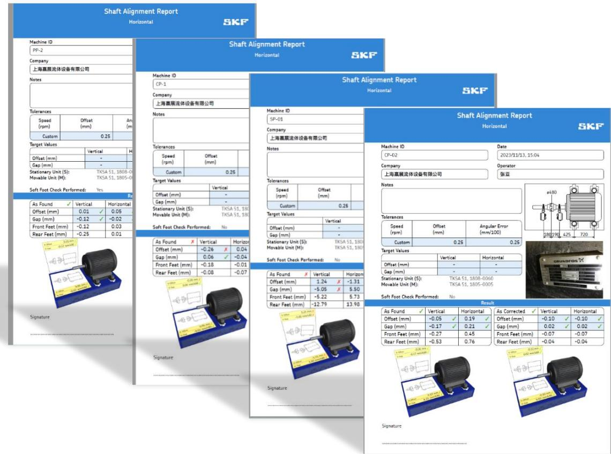

##  水泵调轴对中与试运行

完成管道冲洗后，需要将一次泵、二次泵及冷却水泵并网并进行的联轴器对中检查，此外需要与水泵厂家以及电气团队工程师共同检查水泵启动的供电准备工作。完成水泵启动才能为冷冻水系统循环以及冷机调试运行创造条件。

（左图为格兰富厂家使用SKF激光对中设备出具的水泵联轴器对中报告，此外水泵运行1000小时后，需要厂家到场检查一次对中。）

水泵运行前还需要仔细清理一次泵前过滤器内的杂质，既防止杂质冲进泵头损坏水泵叶轮，又能防止在水泵前侧因过滤器堵塞出现负压力甚至汽蚀的情况。

## 预调试重难点分析

## 2.3 供冷系统设备预调试内容详解—水泵

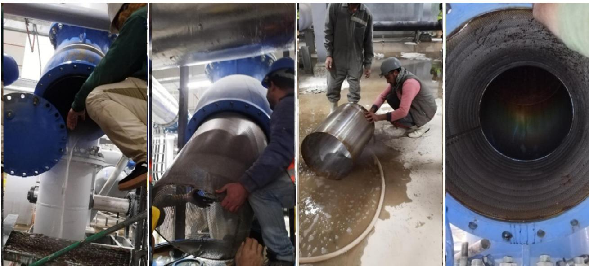

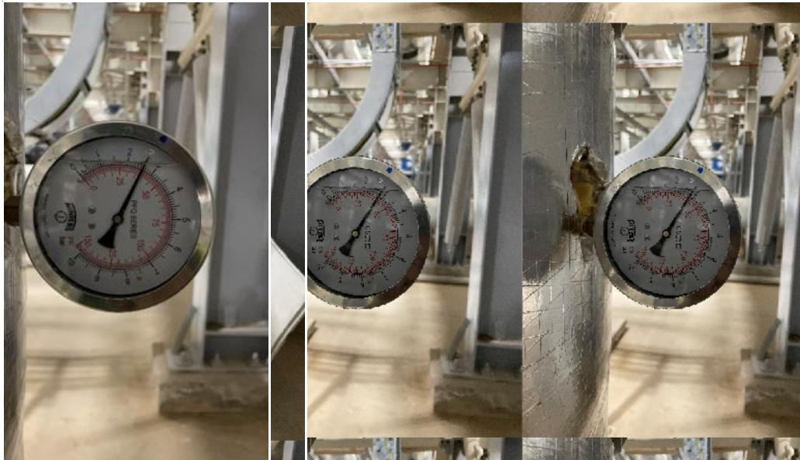

过滤器清洗的注意点：水泵运行前清理过滤器时一定要注意不要破坏滤网，恢复安装时注意垫片要安装到位。

 水泵运行时关注压力变化：因为水泵启动时稳压系统还未接入大管道，所以需要时刻关注压力变化，防止泵前掉压导致水泵损坏。

## 预调试重难点分析

## 2.4 供冷系统设备预调试内容详解—冷却塔

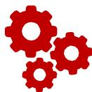

##  冷却塔调试重难点分析

首先需要检查冷却塔塔体的垂直度以及结构紧固件是否拧紧，确保塔体材料拼接处不存在漏水情况，清理塔内全部的垃圾杂物；

其次需要对冷却塔风机进行预调试检查，涉及到风机叶片的角度检查，联轴器对中检查以及电机的绝缘与转向检查；最后是对冷却塔内部填料和布水系统的检查，确认填料完好以及布水均匀后可以启动冷却塔的预调试验收。

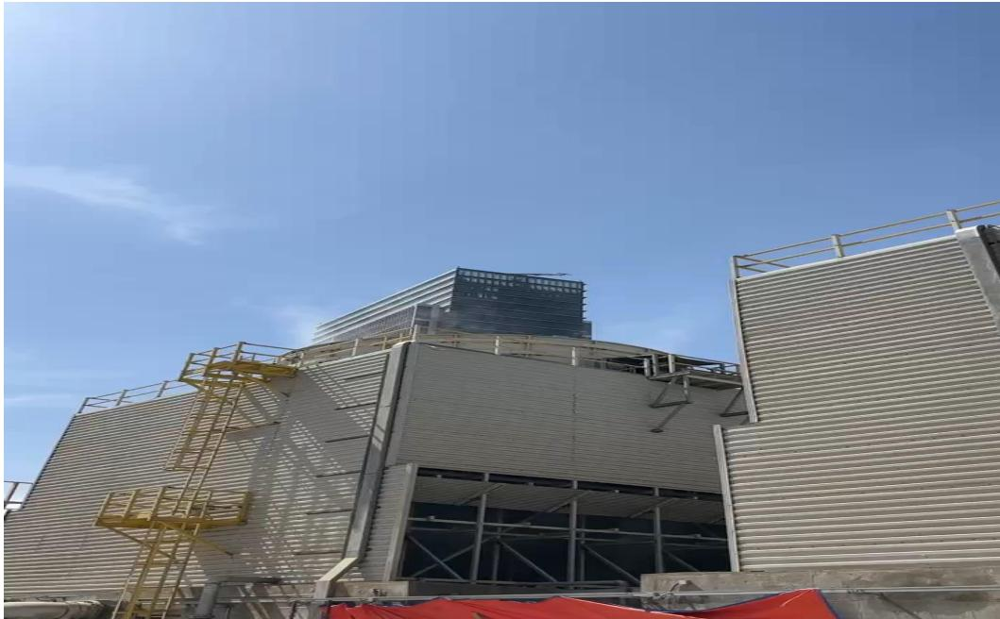

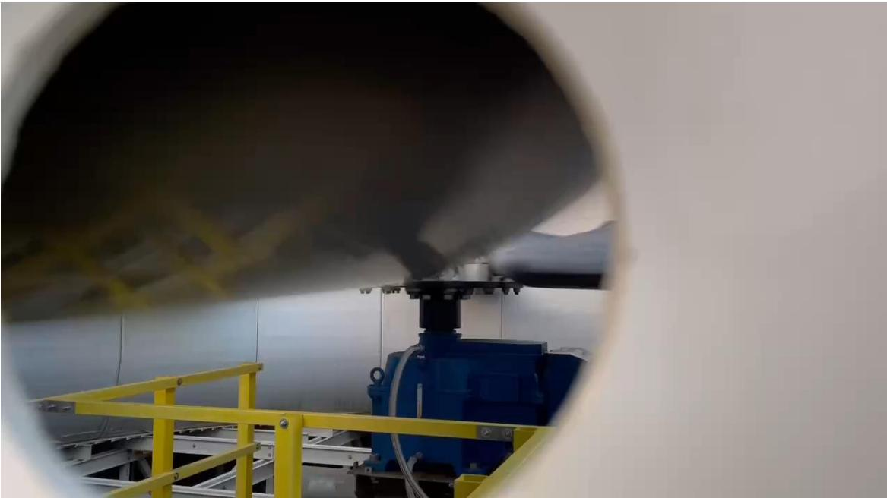

## 03 从单机到系统的艺术PART THREE --平衡调试重难点分析

## 三 平衡调试重难点分析

## 3.1 供冷系统设备平衡调试内容详解—初步平衡

##  平衡调试第一阶段：初步平衡 (Preliminary Balancing) -“从无序到有序”

 1. 核心目标：在系统首次充满水并启动后，通过大幅度的调整，快速消除严重的水力失调，使水流能够基本到达所有末端设备。为第二阶段的精细调试建立一个稳定的、可操作的基础水力工况。

 2. 核心原理：比例法 (Proportional Method)：其核心思想不是追求每个末端的绝对流量立即达到设计值，而是通过调节各支路上的手动平衡阀，使所有末端的实际流量与设计流量的比值趋于相同。当这个比例在整个系统中达到一致后，再调整总流量至设计值，各支路流量就会自动按比例达到设计值。

##  3. 关键步骤重点说明：

 检查图纸：确保有最新的平衡阀计算表（其中包含每个平衡阀的设计流量、压降、预设开度等）

 设备状态：阀门先全开之后按照测试结果调整开度。

 仪表校准： 确保超声波流量计、压差计等测量工具准确可靠。

 开始测试：测量与计算系统总流量；从最不利环路开始，测量并计算比值；调节其他支路，匹配比值。

O 最终调整：使所有支路流量“实测/设计”比值尽可能接近一致，再测量系统总流量，通过调节水泵出口的主阀使实测总流量接近设计总流量。此时，由于各支路比值相同，总流量达到设计值，理论上各支路的流量也会自动达到其设计值。

Condenser pump

Primary Pumps

## 三 平衡调试重难点分析

## 3.2 供冷系统设备平衡调试内容详解—水泵平衡及性能测试

1 . 水泵的平衡 (Pump Balancing)：这里的“平衡”并非指水泵自身的动平衡，而是指在水力系统中，通过调整，使水泵的工作状态（工作点）与系统需求相匹配，并确保流量能按需分配。它分为两个层面： 1. 水泵与系统的平衡；2系统内部通过水泵实现平衡。

 2. 核心概念：理解水泵的工作点 (Operating Point)

 水泵性能曲线 (Pump Curve): 一条表示水泵自身能力的曲线，显示其在不同流量下所能提供的扬程。流量越大，扬程越低。

系统阻力曲线 (System Curve): 一条表示管道系统需求的曲线，显示需要多少扬程才能推动一定的流量通过系统。流量越大，所需扬程越高（阻力与流量的平方成正比）。

 工作点： 上述两条曲线的交点。这个点决定了水泵实际运行的流量和扬程。

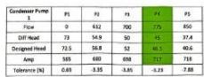

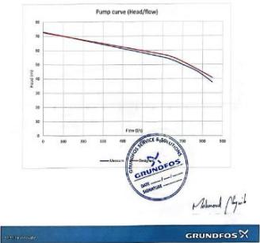

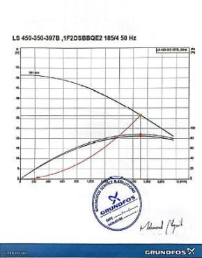

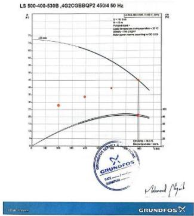

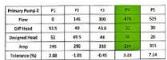

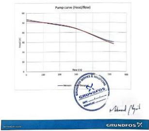

Condenser pump

## 三 平衡调试重难点分析

## 3.2 供冷系统设备平衡调试内容详解—水泵平衡及性能测试

 水泵的性能测试（Performance Test）：性能测试的核心目的是验证水泵的实际运行工况是否与其设计选型点和性能曲线相符，从而判断水泵自身、控制系统及管道系统是否存在问题。

 1. 前置条件：

 系统已平衡： 水系统已完成初步水力平衡，各主要支路流量已分配均匀，无重大水力失调。

 仪表校准： 超声波流量计、压力表、压差计、钳形电流表等关键测量仪器均已校准，确保数据准确。

 安全措施： 系统已排气，人员熟悉紧急停机程序。

##  2. 测试工况点的确定：

 设计工况点 (Design Point): 水泵的设计流量和扬程。

 大流量点 (High Flow Point): 约为设计流量的1 1 0%-1 20%（通过关小主管路平衡阀来模拟系统阻力降低）。

 小流量点 (Low Flow Point): 约为设计流量的80%-70%（通过关小水泵出口主阀来增大系统阻力）。

 重要提示： 关小阀门来改变流量本质上是改变系统阻力曲线，从而迫使水泵的工作点移动。严禁长时间在小流量点（尤其是性能曲线最左侧）运行，以免引起汽蚀和设备损坏。测试应快速完成。

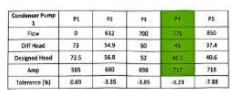

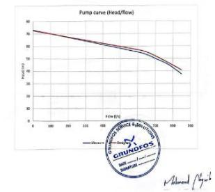

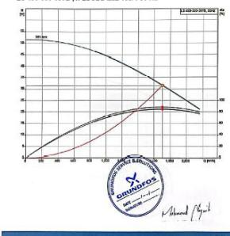

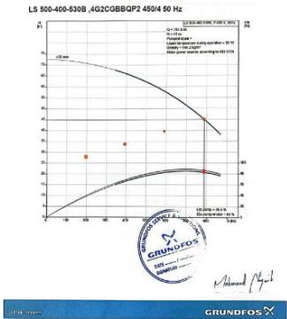

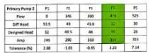

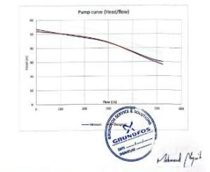

## 三 平衡调试重难点分析

## 3.2 供冷系统设备平衡调试内容详解—水泵平衡及性能测试

## 水泵平衡以及性能测试中常见问题、原因分析与解决方案

##  问题一：流量和扬程均低于设计值

现象： 在设计工况下，实测流量和扬程都远低于性能曲线。

可能原因与排查顺序：

A. 转速过低（对于变频泵）： 首要排查点！ 检查变频器输出频率是否达到50Hz（工频）。

B. 系统阻力大于设计：

 过滤器堵塞： 检查Y型过滤器、除污器的压降是否过大。

 阀门未全开： 确认关键阀门（如止回阀、蝶阀、平衡阀）是否处于全开位置。

 管道气囊： 系统高点是否排气彻底。

##  问题二：汽蚀 (Cavitation)

现象： 泵体内发出“噼里啪啦”的爆裂声，像石子流过一样；扬程和流量剧烈波动并下降；严重时伴有振动。

原因： 水泵进口压力过低，导致液体在泵内汽化形成气泡，气泡在高压区破裂冲击叶轮。

A. 进口管路： 阀门未全开、过滤器堵塞、管径过小、管道过长弯头过多。

B. 液位高度： 开放式水箱液位过低。

C. 水温过高： 水温高，饱和蒸汽压高，更容易汽化。

立即解决： 关小水泵出口阀门！ 这虽然会降低流量，但会立刻提高泵进口压力，是缓解汽蚀的应急措施。长期解决方案需从进口侧找原因。

## 三 平衡调试重难点分析

## 3.3 供冷系统设备平衡调试内容详解—冷却塔平衡及性能测试

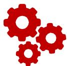

 冷却塔的平衡 (Cooling Tower Balancing)：冷却塔平衡的核心目标是解决多台塔并联运行时水量分配不均的“抢水”问题，确保每台塔都能获得设计水量，从而发挥其最佳冷却效果。

 第一步：静态水位调平 (The Foundation -基础)：这是最重要且最容易被忽略的一步。如果静态水位都不一致，动态平衡无从谈起。

 操作步骤：关闭所有冷却塔的补水阀。停止冷却水泵，让系统水回流并静置，使所有塔盆水位稳定。人工检查并调整每一台冷却塔的浮球阀或液位控制器的设定，确保所有塔盆的静态水位高度完全一致。为何关键？ 水位高的塔，水泵抽其所需扬程小，阻力小，会“抢走”更多水；水位低的塔则相反。水位一致是水力平衡的基础。

 第二步：动态水量平衡 (The Adjustment -调整)：在水位一致的基础上，通过阀门调节实现水量均衡。

 操作步骤：在每台冷却塔的进水管上（最佳位置）安装一台手动平衡阀。启动冷却水泵，让系统运行起来。使用超声波流量计，逐一测量每台冷却塔进水管的流量。调节各塔进水管上的平衡阀，使每台塔的流量接近其设计流量。目标： 使各塔流量均匀。注意： 此时的目标是流量均衡，出水温度可能仍有差异，需进入下一步优化。

 第三步：运行效果优化 (The Optimization -优化)：流量平衡后，最终的检验标准是出水温度，需要在CTI测试时同步进行。

 操作步骤：在水量平衡后，让系统运行稳定（至少30分钟）。读取并记录每台冷却塔的出水温度。微调各塔的平衡阀：对出水温度偏高的塔，可稍开大其阀门，增加其水量；对出水温度偏低的塔，可稍关小其阀门。最终目标： 所有并联冷却塔的出水温度趋于一致，且接近环境湿球温度。

For Water Temperature Measurement with Pt100 Temperature probe

## 三 平衡调试重难点分析

## 3.3 供冷系统设备平衡调试内容详解—冷却塔平衡及性能测试

 冷却塔的性能测试 (Cooling Tower Performance Testing)：性能测试的核心目的是验证单台冷却塔的换热能力是否达到厂家宣称的性能指标。

 环境湿球温度 (Ambient Wet-Bulb Temperature)：这是性能测试的基准。 冷却塔的极限冷却能力取决于湿球温度。

 循环水量 (Water Flow Rate)：使用超声波流量计精确测量进入该冷却塔的水流量。流量必须稳定在设计值附近（±10%内）。

 进出水温度 (Entering & Leaving Water Temperature)：使用校准后的温度传感器，精确测量冷却塔的进水和出水温度。

 趋近度 (Approach) - 核心性能指标：趋近度 = 出水温度 -环境湿球温度。衡量冷却塔的换热效率。趋近度越小，说明冷却塔性能越优秀，其出水越接近理论的冷却极限。新塔的实测趋近度应等于或小于厂家样本上承诺的值（通常为2-3℃）。

 噪声测试（Sound Pressure Level Measurement）：该测试还会在夜间运行时测量运行中的冷却塔产生的噪声分贝以及夜间工况环境的背景噪声，以确定运行时冷却塔的噪声对周围环境的影响。

Cooling Tower Test Associates, inc. 15325 Melrose Drive - Stanley, KS 66221-9720 Voice: 913-681-0027Fax: 913-681-0039 Emaill: cttakci@taol.com - Internet: www.cttai.com

  
The measurement locations. for criteria 2 & 3 In Sectlon 2.2 are Identifled In Fleure 2 below All measurements shall be made 1 meter away from the exit plane of the fan stack at a 45\* angle in accordance with acceptance criteria 2

  
Figure 2. Sound Pressure Level Measurement Locations for Criteria 2 & 3.  
Representative measurement locations for each Tower

Cooling Tower Test Associates, inc. 15325 Meirose Drive - Stanley, KS 66221-9720 Voice: 913-681-0027-Fax: 913-681-0039 Email: cttakc@taol-com..Internet: www.cttai.con

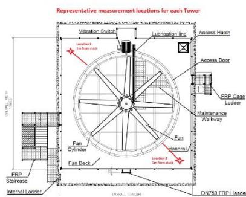

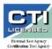  
Figure 1. Sketch of the Wet Bulb Temperature Instrumentation Installation  
ng Tower Test Associates, inc Melrose Drive - Stanley, KS 66221-9720 913-6B1-0027Fax:913.681-0039 sttakc@aol.com. Internet: woww.cttai.com

  
rst acceptance criteria in Section 2.2 are identified in Figure 1 below. All m above grade and 15 m away from the towers if accessible

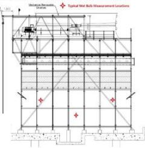  
ressure Level Measurement Locationsfor Criteria 1  
rith a calibrated portable came-on power meter at the motor meter method Corrections for line losses between the motor wer fan motors will be calculated per the ATC-105 test code. The rill be required to measure the fan power using a CTTA provided  
I not be measured for this test due to the surround wall around  
isured with a portable digital barometer

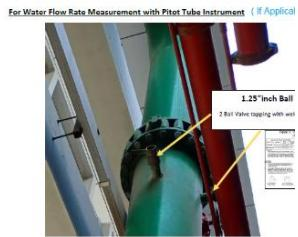

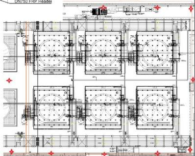  
Water Temperature Measurements

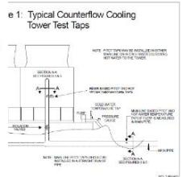

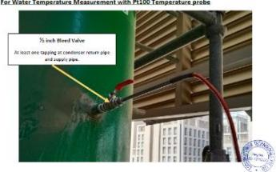

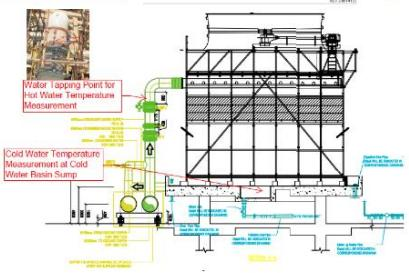

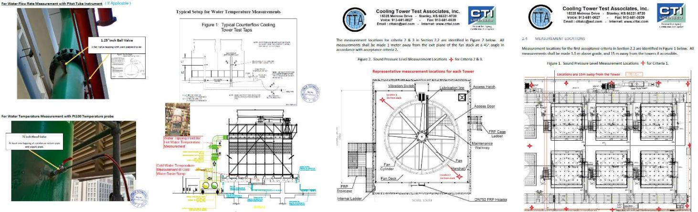

## 三 平衡调试重难点分析

## 3.3 供冷系统设备平衡调试内容详解—冷却塔平衡及性能测试

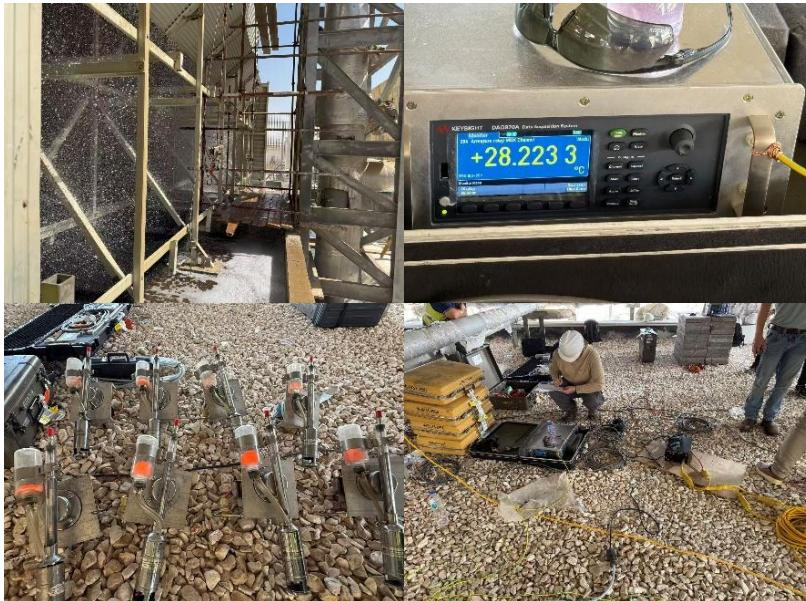

 冷却塔湿球温度计和干球温度计以及数据收集处理器。同步收集测量冷却塔进水量、冷却塔进出水温度、干湿球温度等数据，之后可以连接电脑进行数据处理绘制冷却塔性能曲线图，与出厂曲线（右图）进行对比，可以确定出冷却塔的实测换热性能与厂家报审资料中的性能是否接近。

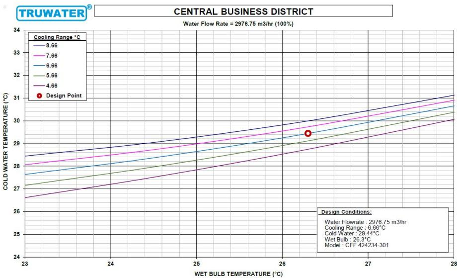

冷却塔进水立管处在CTI测试之前要在指定点位增加毕托管（Pitot Pipe）点位以便现场测试冷却塔进水量指标。

 此外针对噪声测试，CTI厂家也在研究图 纸之后给出了每个冷却塔上2个点，围绕 冷却塔屋面区域12个点，总共24个点位的 噪声测试点。

## 三 平衡调试重难点分析

## 3.4 供冷系统设备平衡调试内容详解—冷机与储热罐的平衡

 能源中心（CUC，Central Utility Complex）设计的核心理念之一是通过集中化、规模化的高效系统将供冷集中到冷站中，以高能效的中央冷站代替分散的空调系统，使制冷能效最大化，符合绿色建筑的理念。

 基于这个设计理念，CUC将储热罐（Thermal Energy Storage Tank, TES） 纳入供冷系统，目的是使冷机处于最佳效率点持续产出冷冻水，通过储热罐和水泵的配合来调节用冷高峰和低谷的空调水，削峰填谷，保证CBD区域供冷的稳定性的同时也能节约能耗，平衡电网负荷。

 将储热罐（Thermal Energy Storage Tank, TES） 纳入系统后，调试的复杂性呈指数级上升，因为它引入了时变因素和多种运行模式。系统从单一的“冷机-冷却塔”耦合变成了“冷机-冷却塔-储热罐”三者之间的动态平衡。核心目标是确保系统在不同运行模式（如：单冷机供冷、冷机+储罐联合供冷、蓄冷模式、单储罐供冷）下切换时，水力工况和热力工况都能保持稳定。

 系统需要在“制冷模式”和“蓄冷模式”之间切换。切换过程中，管道内的流量、流向、温度都会发生剧烈变化。关键设备： 通常通过一组精心设计的电动阀门（如三通阀或两通阀组合）来实现流程切换。

 当末端负荷变化时，二次侧变频泵会降低转速，减少系统总流量。但当系统处于“制冷模式”时，冷机蒸发器有严格的最小流量限制。系统总流量过低会触发冷机低流量报警或停机。当系统处于“单储罐供冷”模式时，没有此限制，水泵可以降频至很低以节能。关键设备：一次泵（为冷机蒸发器侧设置定流量的一级泵，确保通过冷机的流量永远恒定且满足要求）、解耦管（在一次侧（定流量）和二次侧（变流量）之间设置解耦管（Decoupler）。通过解耦管上的温度传感器或流量计来判断水流方向，从而平衡一、二次侧的水量差）。

## 三 平衡调试重难点分析

## 3.4 供冷系统设备平衡调试内容详解—冷机与储热罐的平衡

##  储热罐（TES）的性能测试内容：测试目标是验证储热罐的实际蓄冷/放冷能力是否达到设计指标。

##  蓄冷容量测试 (Capacity Test)

 准备工作： 将储罐内的水完全混合，并使其温度均匀升高到放冷结束时的设计温度（例如，12°C）。

 开始蓄冷： 启动冷机进入蓄冷模式，向储罐注入低温水（4.4°C），同时记录开始时间。

 测量与记录： 在整个蓄冷过程中，持续测量并记录：进口温度（低温）、出口温度（高温）、流量、时间。

 结束条件：当储罐出口温度达到蓄冷完成的设计温度时，停止蓄冷，记录结束时间。

##  实际总蓄冷量 (Q) = ρ \* Cp \* V \* ΔT

 ρ：水的密度

 Cp：水的比热容

 V：储罐有效体积（从温度变化曲线计算得出）

 ΔT：储罐内水的平均温降（通过进出口温度积分计算）

 将计算出的Q与设计蓄冷量对比。

## 三 平衡调试重难点分析

## 3.5 供冷系统设备平衡调试内容详解—CUC与塔楼的平衡

 “入户段”是供冷系统与最终用户（各个单体建筑的换热间）的连接点，是系统水力平衡的“最后一公里”。此阶段的平衡直接决定了末端用户的供冷效果和系统的整体能效。其调试的核心目标是：在系统总流量满足设计的前提下，确保每一个入户支路都能获得其设计所需的精确流量，避免出现“近端过热、远端过冷”的水力失调现象。

##  调试步骤

 图纸与资料核实：核对最新竣工图，确认所有入户支路的位置、设计流量、管径、以及预设的平衡阀型号和KV值。

 设备与状态确认：确认平衡阀已正确安装，阀柄易于操作，阀体上的测压口无障碍，并已安装好测压软管。确认入户段的所有手动阀门处于全开状态（平衡阀除外），确保平衡调试不受自控系统干扰。检查过滤器是否已清洗干净，避免因其堵塞导致流量读数和调试失准。

 首先，测量并调整系统主管的总流量达到设计值。之后，同样运用比例法调节系统最不利的环路开始，之后当所有支路比值接近后，复测系统总流量，并通过主管上的主调节阀将其精确调整至设计值。最后，使用超声波流量计抽测关键支路的流量，进行最终验证和微调，将流量偏差控制在 ±10% 以内。同时可以运用温度验证法，即在供回水温度正常的情况下，各入户端的供回水温差应接近设计温差（通常为5℃），避免“大流量、小温差”的低效运行。

## 04 分析与总结

PART FOUR

## 四 分析与总结

<table><tr><td>设备</td><td>预调试阶段 (Pre-commissioning) - 关键静态检查点</td><td>平衡测试/性能测试阶段 - 核心技术难点与重点</td><td>大小系统差异注意</td></tr><tr><td>水泵 (Pump)</td><td>1. 基础与对中: 激光对中,消除管道应力。2. 润滑: 按手册加注正确型号和量的油/脂。3. 电气: 绝缘测试, 点动确认转向。</td><td>1. 工作点确认: 测试流量、扬程、电流, 对照曲线, 确保在高效区运行。2. 汽蚀排查: 监听异响, 确保进口压力充足。难点: 通过调节出口阀移动工作点,避免小流量运行。</td><td>大系统: 关注并联运行的相互干扰和启停顺序。小系统: 关注选型是否过大, 导致工作点偏离。</td></tr><tr><td>冷机 (Chiller)</td><td>1. 水流量验证: 必须实测蒸发器/冷凝器流量, 确保 &gt;最小安全值。2. 电气与制冷剂: 核对电压、相序、冷媒量、油位油温(预热)。</td><td>1. 效率核心指标: 计算趋近度 (Approach), 异常增大表明换热不良(结垢或流量不足)。2. 负载测试: 在25%、50%、75%、100%负荷点附近测试稳定性。难点: 低负荷防止喘振(离心机),夜间低温防止冷凝压力过低。</td><td>大系统: 重点关注并联运行的负载分配和启停逻辑。小系统: 关注部分负荷下的运行效率。</td></tr></table>

## 四 分析与总结

<table><tr><td>设备</td><td>预调试阶段 (Pre-commissioning) - 关键静态检查点</td><td>平衡测试/性能测试阶段 - 核心技术难点与重点</td><td>大小系统差异注意</td></tr><tr><td>冷却塔 (Cooling Tower)</td><td>1. 水平调平: 关键调整浮球阀,确保所有并联塔盆静态水位高度一致。2. 风机系统: 检查皮带张力、叶片角度、电机转向。3. 布水系统: 清理喷嘴,检查布水均匀性。</td><td>1. 并联平衡: 在进水管加装平衡阀,调节使各塔流量均衡,最终目标是出水温度一致。2. 性能指标: 计算趋近度(出水温度 - 湿球温度),评估换热性能。难点: 解决并联“抢水”问题;夜间运行模式下调风机转速,防止水温过低。</td><td>大系统: 并联平衡是重中之重,风机需联动变频控制。小系统: 关注单塔本身的布水和风机性能。</td></tr><tr><td>储热罐 (TES Tank)</td><td>1. 设备检查: 确认布水器、温度传感器阵列安装正确。2. 阀门与逻辑: 确认与冷机连接的所有切换阀门动作正确,逻辑清晰。</td><td>1. 性能核心: 蓄冷容量测试与热分层效果测试(通过温度传感器阵列查看斜温层是否陡峭)。2. 模式切换: 测试“蓄冷”与“放冷”模式切换时,水力工况稳定,无冲击。难点: 与自控深度配合,验证多种运行模式的切换流畅性。</td><td>大系统: 是核心调峰手段,测试需完整模拟日间蓄冷/放冷循环。小系统: 可能仅为小型缓冲罐,测试相对简单。</td></tr></table>

## 四 分析与总结

<table><tr><td>设备</td><td>预调试阶段 (Pre-commissioning) - 关键静态检查点</td><td>平衡测试/性能测试阶段 - 核心技术难点与重点</td><td>大小系统差异注意</td></tr><tr><td>供冷系统平衡 (System Balancing)</td><td>1. 冲洗: 彻底冲洗管路, 旁通所有精密设备(冷机、控制阀等),直至排水口滤网连续1小时无杂质。2. 文档: 核对最新图纸与设备参数。</td><td>1. 方法: 采用比例法,从最不利环路开始,使各支路流量比值一致,再调整总流量。2. 最终目标: 所有末端设备流量达到设计值 ± 10%。3. 自控联调: 设置最不利环路压差传感器,并优化水泵变频控制的PID参数,防止振荡。难点: 调节任一支路都会影响其他支路(系统耦合),需反复迭代调试;消除气囊。</td><td>大系统: 必须采用标准比例平衡法,并使用压差控制来维持变工况下的水力稳定。小系统: 可简化,可能仅通过阀门手感调节和测温差来粗略平衡。</td></tr></table>

## 四 分析与总结

## 总结说明：

 预调试是基础：此阶段所有静态检查的完成质量，直接决定了动态调试能否顺利进行。所谓“七分准备，三分调试”。

 性能指标是关键：调试不是简单地把设备打开，而是要用量化数据（趋近度、COP、工作点、流量偏差）来验证设备及系统是否达到设计性能。

 系统思维是核心：调试后期必须从单设备跳出来，关注设备之间的耦合关系（如冷却塔水温与冷机冷凝压力的关系、水泵变频与系统压差的关系），并通过自控系统实现联动优化。

 大系统重逻辑与耦合：大型系统复杂度高，必须严格按照流程操作，高度重视并联设备的平衡和控制逻辑。

 小系统重选型与简化：小型系统更可能因选型不当导致先天问题，调试方法可适当简化，但核心的静态检查和水力平衡原则不变。

汇报结束，谢谢！