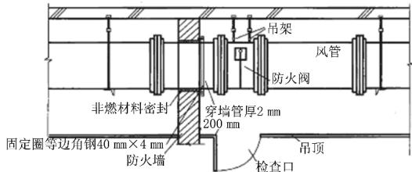
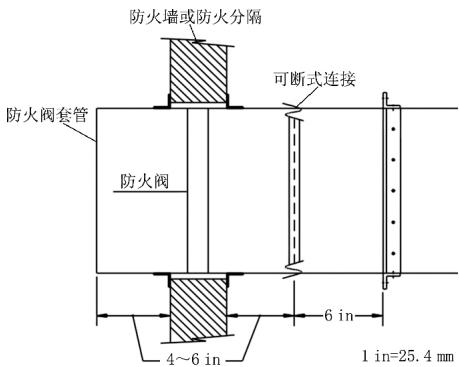
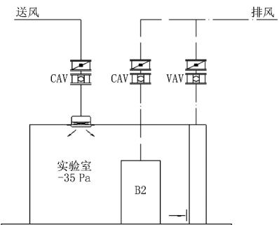

# ComparativeanalysisofChineseandAmerican standardsforfireandsmokedampers

By Ye Jianyun\*

Abstract BasedonthecomparativeanalysisoffireandsmokedampersbetweenChineseandAmerican standards expoundstheirsimilaritiesanddifferencesonthetechnicalrequirementsoffireandsmoke dampersintermsofcategory function installation performanceandtest．Providesareferencefor revisingChinanationalandindustrystandards

Keywords firedamper， smokedamper， function，installation， performance， test， standard

★ ShanghaiNuclearEngineeringResearch＆ DesignInstituteCo．， Ltd．， Shanghai， China

## 0 引言

防火阀和排烟阀（以下简称防火排烟阀）是避免火和烟气在供暖 通风与空调系统中扩散 实现防排烟系统设计功能的关键部件 我国防火排烟阀的设计 制造和试验主要遵循 GB15930—2007《建筑通风和排烟系统用防火阀门》［1］的技术要求美国防火排烟阀主要遵循 UL555－2016《Standardfor safety fire dampers》［2］ 和 UL 555S－2016《Standardforsafetysmokedampers》［3］

在经济全球化推动下 国内电力 建筑工程 机械行业快速走向海外市场 为了适应海外市场对消防产品设计 验证的差异化要求 有必要对防火排烟阀的中美同类标准进行对比分析

## 1 类别与功能

## 1．1 我国标准

我国标准 GB15930—2007《建筑通风和排烟 系统用防火阀门》将防火排烟阀分为防火阀 排烟 防火阀和排烟阀3类

1） 防火阀 安装在通风 空调系统的送 回风管道上，平时呈开启状态 ， 火灾时当管道内烟气温度达到70℃时关闭，并在一定时间内能满足漏烟量和耐火完整性要求 起隔烟阻火作用的阀门

2） 排烟防火阀 安装在机械排烟系统的管道上 平时呈开启状态 火灾时当排烟管道内烟气温度达到280℃时关闭 并在一定时间内能满足漏烟量和耐火完整性要求 起隔烟阻火作用的阀门

3） 排烟阀， 安装在机械排烟系统各支管端部（烟气吸入口）处 平时呈关闭状态并满足漏风量要求，火灾或需要排烟时手动和电动打开 ， 起排烟作用的阀门

## 1．2 美国标准

UL 555－2016 《 Standard for safety firedampers》将防火阀分为静态防火阀 动态防火阀防火防烟阀和走道排烟阀 4 类； UL555S－2016《Standardforsafetysmokedampers》将防烟阀分为防烟阀、防火防烟阀和走道排烟阀3类

1） 静态防火阀 与我国标准中的防火阀功能相同 安装在通风空调风管穿越防火屏障处 在风管内烟气温度达到设定值 （71～100℃） 时自动关闭 。

2） 动态防火阀 与我国标准中的排烟防火阀功能类似 安装在火灾时投入使用的系统（机械排烟系统）中，风管内烟气温度达到设定值（71～177℃）时自动关闭。

3） 防烟阀， 安装在通风空调风管穿越防烟屏障处 火灾探测及报警装置探测到火灾时 由消控中心控制相应防烟阀自动关闭 避免烟气在通风空调风管内扩散。

4） 走道排烟阀 与我国标准中的排烟阀功能类似 安装在风管贯穿走道处 或作为末端排烟口安装在走道开孔位置 协助排烟系统建立烟气流动的压差。

5） 防火防烟阀 兼具防火阀和防烟阀功能的一类阀门 安装在穿越防火屏障处 既有达到设定值自动关闭的温度感应元件 又有与消防控制中心联动控制阀门动作的装置

## 1．3 功能比对

中美防火排烟阀的类别与功能对比分析如下 ：

1） 我国标准防火阀包括静态防火阀 （无远程控制）和防火防烟阀（远程控制） ， 公称动作温度为70℃ 具有漏风量控制指标；美国标准防火阀的公称动作温度在71～100℃范围内可选 防火防烟阀根据系统设计可配置2个不同公称动作温度的温度感应元件 静态防火阀无漏风量控制指标

2） 我国标准排烟防火阀包括动态防火阀 （无远程控制）和防火防烟阀（带远程控制） 公称动作温度为280℃ 具有漏风量控制指标 美国标准动态防火阀的公称动作温度在71～177℃范围内可选 动态防火阀无漏风量控制指标

3） 我国标准排烟阀明确为常闭阀 火灾排烟时打开 且不带温度感应元件 美国标准走道排烟阀带有两级温度感应元件 第一级公称动作温度在71～100℃范围内可选 第二级公称动作温度应高于第一级动作温度 ，不高于177℃

4） 我国标准未规定风管穿越防烟屏障处安装防烟阀要求；美国标准要求消防控制中心控制穿越防烟屏障处设置的防烟阀自动关闭 避免烟气扩散 。

## 2 安装

我国标准 GB15930—2007《建筑通风和排烟系统用防火阀门》是侧重于阀门产品的标准 ， 对阀门在风管系统中的安装位置未作规定 ； 美国标准

UL555－2016规定防火阀和防火防烟阀应安装在 风管贯穿防火屏障的孔洞内 ，以确保阀门关闭时孔 洞耐火极限的完整性

## 2．1 安装形式

## 2．1．1 我国标准

GB50016—2014《建筑设计防火规范》［4］ 条文 说明9．3．13款提供了防火阀与风管的安装示意 ， 如图1所示。

  
图1 防火阀与风管安装示意

从图1可以看出 防火阀或排烟阀与风管采用法兰连接 防火阀尽量靠近防火屏障安装 ，距离不超过200mm 防火阀安装在贯穿孔洞外部 ，为了提高贯穿节点整体的耐火极限 要求贯穿防火屏障孔洞内的风管壁厚不小于2mm。

## 2．1．2 美国标准

美国标准 UL5552016给出了防火阀及其套管与风管和防火屏障连接示意图（见图2） NFPA

  
图2 防火阀贯穿孔洞与风管安装示意

90A－2015《Standardfortheinstallationofair－conditioningandventilatingsystems》［5］第5．3．5．1条指出 防烟阀应尽量靠近风管贯穿的防烟屏障在孔洞外安装时， 距离防烟屏障不应超过 610mm。

## 2．2 安装要求

我国标准中防火阀的主轴与叶片位于同一平面 主轴直接穿出阀体外壁 与执行机构连接 因此 我国标准中防火阀只能安装在贯穿孔洞外 保护防火屏障耐火极限的能力必须由孔洞内加厚的风管（不小于2mm）补充

美国标准防火阀的主轴通过连杆机构与执行机构连接 阀门叶片及主轴所处平面与执行机构所处平面不必重合 从而可实现阀门本体位于孔洞内，执行机构位于孔洞外的安装形式 阀门本体在孔洞内可以更好地保护所贯穿防火屏障的耐火完整性

我国标准的防烟屏障一般都位于疏散楼梯间前室和避难层等区域 此类空间通常不允许正压送风以外的风管系统进入 因此 我国标准也就没有提出防烟阀的概念 而排烟阀只需在火灾时联动打开 实现排烟功能 没有安装位置的具体要求

美国标准提出防烟屏障的概念 要求贯穿防烟屏障处设置防烟阀 限制烟气流动 防烟阀的安装位置应尽量靠近风管贯穿的防烟屏障

## 3 性能与试验

## 3．1 性能

我国与美国标准要求的防火排烟阀性能对比详见表1。

表1 中美标准要求防火排烟阀性能对比
<table><tr><td>我国标准</td><td>美国标准</td><td>具体要求</td></tr><tr><td>驱动扭矩</td><td>弹簧关闭力</td><td>均要求达到主轴所需转矩或关闭力的2.5倍</td></tr><tr><td>复位功能</td><td>运行性能</td><td>我国标准要求阀门可复位；美国标准要求阀门在设计气流环境下，完成启闭动作时间不超过75s</td></tr><tr><td>温感器控制</td><td>动态关闭</td><td>我国标准对温感器元件动作性能提出要求；美国标准则对阀门响应气流温度的能力提出要求， 详见本文3.2节</td></tr><tr><td>手动控制</td><td>无对应要求</td><td>美国标准阀门未提出将手动控制作为补充手段，也未规定手动操作力的要求</td></tr><tr><td>电动控制 绝缘性能</td><td>无对应要求</td><td>美国标准阀门未规定工作电压和电流，无低压和超压工作的稳定性要求</td></tr><tr><td></td><td>无对应要求</td><td>美国标准要求阀内执行机构遵循UL 60730《Controls for household and similar use》，其绝缘性能 低于我国标准 20 MΩ 要求</td></tr><tr><td>开关可靠性</td><td>重复动作可靠性</td><td>美国标准阀门重复动作的次数比我国标准要求更多，详见本文3.2节</td></tr><tr><td>耐腐蚀</td><td>耐盐雾腐蚀</td><td>盐水溶液质量浓度不同</td></tr><tr><td>漏风量</td><td>漏风量</td><td>我国标准对防火排烟阀门均有漏风量指标要求；而美国标准仅对防烟阀和防火防烟阀提出漏风 量要求，对防火阀不要求，具体漏风量指标也不同，详见本文3.2节</td></tr><tr><td>耐火性能</td><td>耐火性能</td><td>耐火试验细节和要求不同，我国标准提出漏烟量要求；而美国标准耐火试验后有水龙带喷水试 验，详见本文3.2节</td></tr><tr><td>无对应要求</td><td>开启和关闭时间</td><td>美国标准要求防烟阀和防火防烟阀启闭时间不超过75 s</td></tr><tr><td>无对应要求</td><td>抗老化性能</td><td>我国标准未规定非金属材料在持续高温环境下的抗老化性能要求</td></tr><tr><td>无对应要求</td><td>耐高温性能</td><td>美国标准要求阀内在高温环境中，保持完全关闭状态30min后仍能执行其功能</td></tr><tr><td>无对应要求</td><td>执行机构性能</td><td>美国标准要求验证阀门执行机构在通电状态下持续6个月后仍能执行其功能</td></tr></table>

由表1可知 我国标准与美国标准对防火排烟阀的性能要求大体相同 与美国标准相比 我国标准额外规定了阀门手动控制 电动控制和绝缘性能 适应人工操作方便 安全和工作电压波动等工程实际条件 美国标准更注重防火排烟阀在实际工况下的性能 如运行性能和动态关闭均要求阀门在设计气流条件下实现温感器动作关闭和执行机构复位功能 此外 美国标准额外规定了阀门的启闭时间 抗老化 耐高温和执行机构长期工作性能可见 美国标准对防火排烟阀的质量和功能有更高要求

## 3．2 试验

我国和美国标准检验防火排烟阀各项性能的试验要求和验收准则都存在不同程度的差异 限于篇幅 本文仅对温感器控制 开关可靠性 漏风量和耐火等我国标准 A 类性能试验进行对比分析（无特殊说明 本节中提到的我国标准防火阀包含防火阀和排烟防火阀 ；美国标准防火阀包含防火阀和防火防烟阀 ，防烟阀包含防烟阀和防火防烟阀）

## 3．2．1 温感器控制与动态关闭

表2给出了我国温感器控制与美国动态关闭试验的对比

表2 我国温感器控制与美国动态关闭试验对比
<table><tr><td colspan="2">我国标准</td><td>美国标准</td></tr><tr><td>试验项目</td><td>温感器控制</td><td>动态关闭试验</td></tr><tr><td>试验设备</td><td>恒温水浴、恒温油浴</td><td>带流量测量和压差控制的试验台</td></tr><tr><td>试验内容</td><td>感温元件完全浸入水或油中，控制水浴/油浴温度，验证温感器 不动作和动作性能</td><td>通过试验台，维持阀门在设计流速工况，加热试验气流， 使其达到阀门额定工作温度，验证阀门动态关闭性能</td></tr><tr><td>验收准则</td><td>在(65±0.5)℃恒温水浴(防火阀)和(250±2)℃恒温油浴(排 烟防火阀)，温感器5min内不动作；在(73±0.5)℃恒温水 浴(防火阀)和(285±2)℃恒温油浴(排烟防火阀)，温感器水 浴1min内动作，油浴2 min内动作</td><td>试验气流达到设定温度时，阀门自动关闭，阀内及其部 件没有损坏</td></tr></table>

温感器控制试验和动态关闭试验都是为了验证防火阀在风管内气流温度达到设定值时阀门能自动关闭 隔断火或烟气在风管系统内传播

我国标准仅对温感器元件进行试验验证 不能证明防火阀在实际气流工况下的动作性能 特别是油浴试验中温感器放入深度对试验结果影响很大［6］ 因此 温感器控制试验只能作为防火阀内部元件的验收试验 不适合作为阀门整体性能的一项验证试验

美国动态关闭试验的阀门在设计流速和压差环境下 当气流温度达到设定值时 验证阀门能自动关闭 阀门及其部件没有损坏 该试验证明阀门在通风系统气流条件下 感知温度变化实现关闭并维持防火屏障完整性的功能 然而 动态关闭试验也有局限 试验期间对气流温度稳定性的控制比较困难，试验误差较大 因此 UL555－2016只定性描述设定温度 并没有规定试验气流温度的控制精度和测点布置

## 3．2．2 开关可靠性

开关可靠性试验 是为了验证防火排烟阀经过多次启闭操作后 ，仍能执行预定功能 表3给出了中美标准开关可靠性试验对比

表3 中美标准开关可靠性试验对比
<table><tr><td colspan="2">我国标准</td><td>美国标准</td></tr><tr><td>试验项目</td><td>开关可靠性</td><td>重复动作可靠性</td></tr><tr><td>试验设备</td><td>带压差控制的试验台</td><td>手动或电动操作</td></tr><tr><td>试验内容</td><td>防火阀按操作方式分别进行50次关闭操作；排烟阀电 动和手动各25次开启操作后，在气流静压（1000± 15)Pa条件下，手动和电动开启，观察开启情况</td><td>手动操作的防火阀不少于250次启闭操作；配执行机构防火阀或 防烟阀不少于20000次启闭操作，带调节功能的阀内还要在 每10%开度间切换不少于10000次，共100000次切换操作</td></tr><tr><td>验收准则</td><td>防火阀启闭试验后，零部件无磨损或变形；排烟阀在气 流条件下能立即开启</td><td>试验后，阀门能正常执行功能，防烟阀启闭动作时间不超过75s</td></tr></table>

我国标准要求防火排烟阀进行50次启闭操作试验 美国标准对启闭操作次数要求更高 手动操作次数是我国标准的5倍 配执行机构的防火排烟阀是我国标准的400倍 更重视阀门功能的可靠性 试验后，我国标准要求排烟阀在气流静压条件下立即开启 美国标准此项试验中未规定 但运行试验和动态关闭试验都分别验证了防烟阀和防火阀在设计气流条件下执行预定功能的性能 ， 而且UL555－2016第9．2条明确规定 应使用通过重复动作可靠性试验的样品进行运行试验和动态关闭试验

## 3．2．3 漏风量

漏风量试验 目的是测量气流压差作用下 通过已关闭阀门泄漏到下游的风量 验证阀门隔断风管内气流的性能 表4给出了中美标准漏风量试验对比。

表4 中美标准漏风量试验对比
<table><tr><td colspan="2">我国标准</td><td>美国标准</td></tr><tr><td>试验项目</td><td>漏风量</td><td>漏风量</td></tr><tr><td>试验设备</td><td>带流量测量和压差控制的试验台</td><td>带流量测量和压差控制的试验台</td></tr><tr><td>试验内容</td><td>通过试验台，维持阀门上下游规定的压差，测量并计 算试验系统漏风量和阀门关闭状态的漏风量</td><td>通过试验台，维持阀门上下游规定的压差，分别测量并计算高温 气流和环境气流作用下阀门的标准状态漏风量，取大值作为阀 内漏风量</td></tr><tr><td>验收准则</td><td>在300Pa压差作用下，防火阀关闭状态的漏风量不 大于500m³/(m²·h)；在1000Pa压差作用下，排 烟阀关闭状态的漏风量不大于700m³/(m²·h)</td><td>在1100Pa压差作用下，Ⅰ级阀内关闭状态的漏风量不大于146 m³/(m²·h)，Ⅱ级阀内关闭状态的漏风量不大于367m³/ (m²·h)，Ⅲ级阀内关闭状态的漏风量不大于1469 m³/(m²·h)</td></tr><tr><td colspan="2">美国标准仅对防烟阀提出漏风量试验要求， 对防火阀未作规定；我国标准对防火阀和排烟阀</td><td>试验；我国标准漏风量试验仅选择最大尺寸的阀</td></tr><tr><td colspan="2">均提出了漏风量试验要求，限制了防火阀隔断的</td><td>门，进行环境温度下的漏风量试验，在耐火试验中， 也补充了高温气流作用下的漏烟量要求。</td></tr><tr><td colspan="2">着火区向共用通风系统的其他非着火区传播烟</td><td>我国标准和美国标准均要求控制阀内单位面</td></tr><tr><td colspan="2">气的能力。</td><td>积的漏风量，小尺寸阀内虽然总漏风量小，但单位</td></tr><tr><td colspan="2">美国标准不仅要求最大尺寸的阀内进行高温</td><td>面积的漏风量可能会超出大尺寸阀内。美国标准</td></tr><tr><td colspan="2">气流和环境温度下的漏风量试验，还要求最大宽</td><td>对参与试验的阀门样品选择更全面，具有包络性。</td></tr><tr><td colspan="2">度、最小高度，最小宽度、最大高度，最小宽度、最小</td><td>从验收指标看，我国标准防火排烟阀的漏风量只相</td></tr></table>

## 3．2．4 耐火试验

耐火试验，是验证防火阀在火灾中隔断火和烟气能力的最关键性能试验 我国标准和美国标准中都大篇幅描述了试验设备 温升控制 测点布置控制精度 读数间隔 验收准则等细节要求 表5给出了中美标准耐火试验对比

表5 中美标准耐火试验对比
<table><tr><td colspan="2">我国标准</td><td>美国标准</td></tr><tr><td>试验项目</td><td>耐火试验</td><td>耐火试验</td></tr><tr><td>试验设备</td><td>耐火试验炉、带流量测量和压差控制的试验台、阀门 向火面温度测量与控制系统</td><td>耐火试验炉、阀门向火面温度测量与控制系统、水龙带及喷水冲 击装置</td></tr><tr><td>试验内容</td><td>控制阀门向火面温升满足温升时间曲线要求，记录阀 门关闭时间，通过试验台，测量计算耐火试验期间 的漏烟量，实时观察阀门背火面的状态</td><td>控制阀门向火面温升满足温升时间曲线要求，记录阀门关闭时 间，实时观察阀门背火面的状态，测量阀门部件的间隙。耐火 时间结束时，立即用水龙带将规定压力的水喷射阀门中心和背 火面的其他区域，喷射结束后测量阀内部件之间的间隙</td></tr><tr><td>验收准则</td><td>耐火试验开始1min内，防火阀应动作关闭，3min 内，排烟防火阀应动作关闭；规定的耐火时间内，防 火阀两侧(300±15)Pa压差作用下，漏烟量不大于 700 m³/(m²·h)，阀内背火面不应出现连续10 s 以上的火焰；防火阀耐火时间不少于1.5h</td><td>温度达到设定值时，防火阀应动作关闭；耐火试验期间，阀门背火 面不应出现组件材料燃烧现象；阀内叶片、框架等部件的内部 间隙不超过规定值；喷水试验后，阀门各部件的间隙不超过 25.4 mm；阀内耐火时间不少于规定值；耐火和喷水试验期间， 阀门在安装孔洞内保持结构完整</td></tr></table>

我国标准控制耐火试验炉的温升曲线遵循GB／T9978．1—2008《建筑构件耐火试验方法 第1部分 通用要求》［7］ ； 美国标准温升曲线遵循 UL5552016 经过对比 2条温升曲线在试验第1h内基本吻合 1h后 我国标准试验炉内温度比对应时刻的美国标准试验炉高50℃左右

美国标准防火阀按照楼板和墙体不同安装形式分别进行试验， 安装于墙体的阀门 ， 需选择正反气流方向2个样本进行耐火试验 涵盖了阀门执行机构置于耐火试验炉内的工况 ；我国标准耐火试验要求阀门安装在试验炉外侧 未验证执行机构置于耐火试验炉内的工况 也未考虑防火阀安装在楼板和墙体应对不同火灾模型的抵抗能力

我国标准在耐火试验中 提出了防火阀在规定压差作用下的漏烟量要求 美国标准对防火阀未规定漏烟或漏风要求 在耐火试验中 仅规定阀门部件的间隙要求 可见 美国标准防火阀只关注阀门关闭后的阻火性能 对于着火区隔断后 共用的通风系统其他区域仍需保持运行时 该防火隔断处应选择具有漏风量要求的防火防烟阀

我国标准规定防火阀耐火时间不少于1．5h；美国标准要求阀门耐火时间不少于其标定值 ，如2h或3h，试验时间更长

美国标准在耐火试验后 还要求进行喷水试验 验证了阀门在火灾高温火焰作用时 抵抗消防水冲击 保证防火屏障完整性的能力

## 4 结论

1） 我国标准按照防火和排烟对阀门进行分类；而美国标准按照防火和隔烟对阀门进行分类要求兼具防火和排烟功能时 我国标准需要安装2个不同功能的阀门 而美国标准只需要安装1个防火防烟阀即可满足防火和隔烟功能 同一防火区内 采用气体灭火需要隔断通风系统时 美国标准可以直接选用防烟阀； 而我国标准选用电动防火阀 与防火区划分有矛盾 美国标准防火排烟阀的功能分类与系统设计更匹配

2） 我国标准防火阀只能安装在贯穿防火屏障的孔洞外 美国标准提出了防烟屏障的概念 更重视阀门保护防火或防烟屏障完整性的功能

3） 我国标准与美国标准对防火排烟阀的性能要求大体相同 我国标准考虑了人工操作和电压波动等工程需要 ； 美国标准更注视阀门实际运行性能 补充了阀门的启闭时间 抗老化 耐高温和执行机构长期工作性能 对阀门质量和功能要求更高

4） 我国标准和美国标准检验防火排烟阀各项性能的试验要求和验收准则都存在不同程度的差异 美国标准验证了防火阀实际气流作用下关闭性能 通过数倍于我国标准的重复操作次数验证阀门启闭操作的可靠性 ；选择漏风量试验的样本更具有包络价值；耐火试验全面验证了不同安装形式的阀门样本抵抗高温火焰和消防水冲击的能力

5） 通过对比分析 建议在我国现有标准基础上 吸收并采纳美国标准对防火排烟阀安装 性能和试验的细节优点 更新我国防火排烟阀标准规范体系，为国内相关行业走向海外市场 ， 提供更具融合能力的技术指导和规范要求

（下转第86页）

表3 3种方案对比
<table><tr><td></td><td>系统稳定性</td><td>调适难易度</td><td>能耗</td><td>初投资及运行成本</td></tr><tr><td>方案1</td><td>稳定</td><td>简单</td><td>较少</td><td>一般</td></tr><tr><td>方案2</td><td>不稳定</td><td>复杂</td><td>较方案1明显增加</td><td>较方案1明显增加</td></tr><tr><td>方案3</td><td>较稳定</td><td>较复杂</td><td>较方案1,2 显著增加</td><td>较方案1,2 显著增加</td></tr></table>

上述3种方案均设置了与B2生物安全柜排风相对应的排风口 在生物安全柜启闭时进行排风切换 保持总排风量不变 该方式已大量应用于有压力要求的洁净室领域中

对于B2生物安全柜排风设置 另一种方案如图7所示 B2生物安全柜的排风采用定风量阀控制 房间排风管变风量阀根据房间设置的压差要求调节开度，以消除B2生物安全柜启闭时对房间压差产生的扰动 该方案的控制思路仍为定送变排方式 只要控制模式及阀门响应及时 系统运行调适及实际使用效果不错 需要注意的是 图7中B2生物安全柜及房间排风的支路阻力相差较大 ，实际应用时需考虑调适问题

  
图7 定送变排模式系统原理示意图

2种B2生物安全柜的排风控制模式在国内均较为常见 其关键点在于合理预设阀门动作顺序采用快速响应阀门 建议响应时间不要超过2s［7］阀门的调节或切换不可影响室内压差 同时需考虑系统的阻力平衡问题

## 4 结论

## 参考文献 ：

［1］ 广州市泰昌实业有限公司．建筑通风和排烟系统用防火阀门 ：GB15930—2007［S］．北京 ： 中 国 标 准 出 版社 ，2007：1－12

［2］ UnderwritersLaboratoriesINC．Standardforsafety fire dampers： UL 555－2016 ［S］． Northbrook： UnderwritersLaboratoriesINC， 2016：1－30

［3］ UnderwritersLaboratoriesINC．Standardforsafety smokedampers： UL 555S－2016［S］．Northbrook： UnderwritersLaboratoriesINC， 2016：1－26

1） 对于A2生物安全柜是否外排 需根据实验室生物安全等级 实验操作对象等综合考虑 对于是否采用外排套管式连接方式 国内规范尚未给出明确要求

2） 基于本文中能耗分析及估算 外排式A2生物安全柜或B2生物安全柜的使用导致新风量 冷热负荷 冷热源装机容量等均有所增加 尤其是针对仅有 A2生物安全柜的实验室 设置排气罩时还应考虑房间高度等参数 房间高度增加也将增加由换气次数确定的室内送风量

3） 当系统中同时存在 A2生物安全柜与 B2生物安全柜且台数较多时 考虑到系统的阻力平衡和调适的便利 建议排风机分开设置 使系统更加稳定。

## 参考文献 ：

［1］ 陆龙喜 ，林军明 ，顾华．生物安全实验室中生物安全柜使用现状调查 ［J］．中国消毒学杂志 ，2010，27（4） ：376－378

［2］ 中国建筑科学研究院．生物安全柜 ：JG170—2005［S］．北京 ：中国标准出版社 2005：3

［3］ 古希波 张英．生物安全柜的选择 安装与使用［J］．医疗卫生装备 ，2010，31（7） ：94－96

［4］ NSF International． Biosafety cabinetry： design construction， performance， andfieldcertification： NSF／ANSI 49－2014 ［S］． Alexandria： NSF International 2014E7

［5］ 北京市医疗器械检验所 ，苏净集团苏州安泰空气技术有限公司 ，上海力申科学仪器有限公司 ， 等．Ⅱ 级生物安全柜 ：YY0569—2011［S］．北京 ： 中国标准出版社 ，2013：3

［6］ 陆亚俊 ，马最良 ，邹平华．暖通空调［M］．北京 ： 中国建筑工业出版社 2008：120

［7］ 梁磊 ，冯昕 ，张旵东 ，等．高等级生物安全实验室中 Ⅱ级B2型生物安全柜气流控制模式研究 ［J］．暖通空调 ，2018，48（1） ：20－27

［4］ 公安部天津消防研究所 公安部四川消防研究所．建筑设计防火规范 ：GB50016—2014［S］．北京 ： 中国计划出版社 ，2014：368

［5］ NationalFireProtection Association．Standardfor theinstallation ofair－conditioning and ventilating systems：NFPA90A－2015［S］．Qunicy： NationalFire ProtectionAssociation，2015：15

［6］ 盛晋京．防火阀、排烟防火阀试验方法的不足及修改的建议［J］．消防技术与产品信息 ，2001（3） ：42－43

［7］ 公安部天津消防研究所．建筑构件耐火试验方法 第1部分 ：通用要求 ：GB／T9978．1—2008［S］．北京 ： 中国标准出版社 2008：8